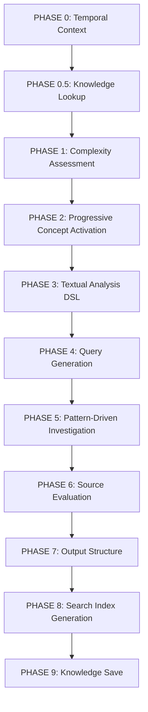

# 🔍 APEX Investigation Framework Analysis

## Comprehensive Analysis of TRUTH ENGINE v10.5 for Political Investigation

---

## 📋 Executive Summary

This document provides a comprehensive analysis of the APEX investigation framework that will be used for analyzing Benjamin Haddad and Annie Genevard's agricultural policy statements. The analysis covers the progressive activation methodology, pattern detection, WOLF MODE criteria, and EDI scoring system.

---

## 🧠 Core System Architecture

### 1. Progressive Activation Methodology

The system uses a **multi-phase progressive activation approach** that loads cognitive concepts dynamically based on detected patterns:



### 2. L0-L9 Cascade Structure

The investigation operates across **10 depth levels** with progressive activation:

- **L0-L5**: Core analysis (mandatory for all investigations)
- **L6-L9**: Advanced analysis (triggered by pattern thresholds)
  - **L6**: Counter-narrative analysis
  - **L7**: Cognitive warfare detection
  - **L8**: Network mapping and extraction
  - **L9**: Temporal evolution and prediction

---

## 🎯 Key Concepts and Patterns

### 1. Core Cognitive DSL Concepts

The system uses **5 core concepts** for initial scanning (2KB memory footprint):

| Symbol | Concept   | Detection Focus                   | Activation Threshold |
| ------ | --------- | --------------------------------- | -------------------- |
| Ξ      | ICEBERG   | Omission patterns, hidden data    | Score ≥5             |
| €      | MONEY     | Financial flows, hidden interests | Score ≥5             |
| Λ      | FRAMING   | Imposed false choices, boundaries | Score ≥5             |
| Ω      | INVERSION | Reality reversal, doublespeak     | Score ≥5             |
| Ψ      | OVERLOAD  | Cognitive saturation, confusion   | Score ≥5             |

### 2. Required Pattern Analysis

#### 🧊 ICEBERG MAX Pattern

- **Focus**: Systematic omission and data hiding
- **Detection Triggers**:
  - Selective data presentation
  - Category manipulation
  - Shadow populations
  - Methodology opacity
- **Investigation Triggers**:
  - Ξ ≥7: Activate all ICEBERG cluster concepts
  - Ξ ≥9: Flag as CRITICAL OMISSION, demand full disclosure

#### 💰 MONEY Pattern

- **Focus**: Financial manipulation and hidden economic interests
- **Detection Triggers**:
  - Lobby influence tracing
  - Subsidy shadow analysis
  - Revolving door patterns
  - Cost externalization
- **Investigation Triggers**:
  - € ≥7: Comprehensive money flow tracing
  - € ≥9: Flag as SYSTEMIC CORRUPTION

#### 🌐 NETWORK Pattern

- **Focus**: Hidden connections and power networks
- **Detection Triggers**:
  - Node centrality analysis
  - Revolving door networks
  - Dark network mapping
  - Influence cascade detection
- **Investigation Triggers**:
  - 🌐 ≥7: Full network mapping
  - 🌐 ≥9: Systemic capture confirmation

#### ⏰ TEMPORAL Pattern

- **Focus**: Time manipulation and historical distortion
- **Detection Triggers**:
  - Memory hole detection
  - Historical revision analysis
  - Crisis cycling patterns
  - Future foreclosure detection
- **Investigation Triggers**:
  - ⏰ ≥7: Full timeline audit
  - ⏰ ≥9: Reality history contested

---

## 🐺 WOLF MODE Activation Criteria

### Political Analysis Activation

**WOLF MODE** is activated for political investigations when:

1. **Content Type**: Political/corporate subject matter
2. **Actor Count**: ≥8 political actors identified
3. **Pattern Thresholds**: €≥3, ♦≥3, 🌐≥3, Κ≥4, ⚔≥2
4. **Complexity Level**: APEX (score ≥8)

### WOLF Investigation Protocol

```yaml
WOLF_CRITERIA:
  - SUSPICION: 95% (presume manipulation until proven innocent)
  - DEPTH: Minimum L6 (counter-narrative mandatory)
  - OUTPUT: 3-part structure (Natural FR + Technical + WOLF)
  - SOURCES: ≥15 minimum
  - EDI_TARGET: ≥0.60
  - PATTERNS: All patterns activated
  - ACTORS: ≥8 individual wolves required
```

### Dynamic Threshold Formula

```python
threshold_adjusted = base_threshold - controversy_factor - complexity_factor
# Base thresholds: Political=8, Geopolitical=8, Corporate=5
# Controversy factor: ≥9=-3, ≥7=-2
# Complexity factor: ≥8=-2, ≥6=-1
# Minimum threshold: max(3, threshold_adjusted)
```

---

## 📊 EDI Scoring System

### EDI Formula and Targets

**EDI (Epistemic Diversity Index)** is calculated using 6 dimensions:

```python
EDI = (geo_diversity × 0.25) + (lang_diversity × 0.20) +
      (strat_diversity × 0.20) + (ownership_diversity × 0.15) +
      (perspective_diversity × 0.15) + (temporal_diversity × 0.05)
```

### Target Thresholds by Complexity

| Complexity | Score Range | EDI Target | Primary Sources (◈) |
| ---------- | ----------- | ---------- | ------------------- |
| SIMPLE     | 0-3         | ≥0.30      | ≥1                  |
| MEDIUM     | 4-6         | ≥0.50      | ≥2                  |
| COMPLEX    | 7-8         | ≥0.70      | ≥3                  |
| APEX       | 9-10        | ≥0.80      | ≥3                  |

### EDI Penalty System

**Critical penalties that reduce EDI score:**

- **Institutional Monoculture**: -0.20 (govt/corp >60%)
- **Power Monoculture**: -0.25 (govt+corp >75%)
- **Missing Adversary**: -0.15 (sensitive subject without critique)
- **Narrative Echo Chamber**: -0.20 (only official perspective)
- **Tertiary Dominance**: -0.15 (>70% tertiary sources)

---

## 🎭 Textual Analysis Framework

### Mandatory Analysis Components

1. **Concepts Activés**: 10+ DSL concepts with scores ≥5
2. **Techniques Rhétoriques**: Named patterns with text examples
3. **Déconstruction Sémantique**: Numbered list of sous-entendus
4. **Cartographie Dialectique**: Thèse/antithèse/synthèse structure

### Rhetorical Techniques Detection

- **FALSE_DICHOTOMY**: Binary framing analysis
- **SPECTACLE**: Distraction detection
- **ICEBERG**: 90% hidden implication
- **MONEY_INVISIBLE**: Cui bono analysis
- **TEMPORAL_URGENCY**: Panic induction
- **CONFIRMATION_LOOP**: Bias exploitation

---

## 🔍 Investigation Workflow

### Phase Sequence for APEX Investigation

1. **PHASE 0**: Temporal context establishment
2. **PHASE 0.5**: MnemoLite knowledge lookup (memories://search)
3. **PHASE 1**: Complexity assessment (6 dimensions)
4. **PHASE 2**: Progressive concept activation (core → clusters)
5. **PHASE 3**: Mandatory textual analysis DSL
6. **PHASE 3.5**: Historical precedents search (if patterns ≥5)
7. **PHASE 4**: Query generation (25+ for APEX)
8. **PHASE 5**: Pattern-driven deep dive
9. **PHASE 6**: Source evaluation with EDI calculation
10. **PHASE 7**: Structured output generation
11. **PHASE 8**: Search index creation
12. **PHASE 9**: MnemoLite knowledge persistence

---

## 📈 Quality Gates and Enforcement

### Mandatory Output Requirements

```yaml
QUALITY_GATES:
  - Textual analysis: 10+ concepts analyzed
  - Techniques named: DSL terms explicitly used
  - Sous-entendus: Numbered list revealed
  - Dialectic mapping: Thèse/antithèse structure
  - EDI meets target: ≥0.80 for APEX
  - Sources stratified: ◈◉○ distribution
  - Patterns quantified: Scores provided
  - Pure DSL: No code implementation
  - SEARCH_INDEX: All 8 fields present
  - MnemoLite save: Investigation persisted
```

### Failure Handling

- **EDI < Target**: Trigger adaptive search for diversity
- **Wolves < Threshold**: Activate WOLF hunt protocol
- **Patterns < 5**: Force pattern detection iteration
- **Primary Sources Missing**: Mandatory ◈ source search

---

## 🎯 Application to Agricultural Policy Investigation

### Expected Framework Application

For the Benjamin Haddad and Annie Genevard agricultural policy analysis:

1. **Complexity Assessment**: Likely APEX (9-10) due to political sensitivity
2. **Pattern Activation**: ICEBERG, MONEY, NETWORK, TEMPORAL clusters
3. **WOLF MODE**: Activated (political actors ≥8 expected)
4. **EDI Target**: ≥0.80 with comprehensive source stratification
5. **Depth Levels**: L0-L9 full cascade with reverse engineering
6. **Output Structure**: 4-part mandatory format with SEARCH_INDEX

### Key Focus Areas

- **Financial Analysis**: EU agricultural subsidies, lobby influence
- **Network Mapping**: FNSEA, government, corporate connections
- **Temporal Analysis**: Policy evolution over time
- **Omission Detection**: Hidden impacts, suppressed data
- **Counter-Narrative**: Dissident and academic perspectives

---

## 🔚 Conclusion

This APEX investigation framework provides a **comprehensive, systematic approach** to political analysis with:

- **Progressive activation** of cognitive patterns
- **Mandatory textual analysis** using DSL concepts
- **WOLF MODE** for political beneficiary mapping
- **EDI scoring** for epistemic diversity assurance
- **Multi-level depth** (L0-L9) for comprehensive coverage
- **Quality enforcement** through mandatory gates

The framework is specifically designed to **uncover hidden patterns, financial flows, network connections, and temporal manipulations** in political discourse, making it ideally suited for analyzing agricultural policy statements with the rigor required for APEX-level investigation.
