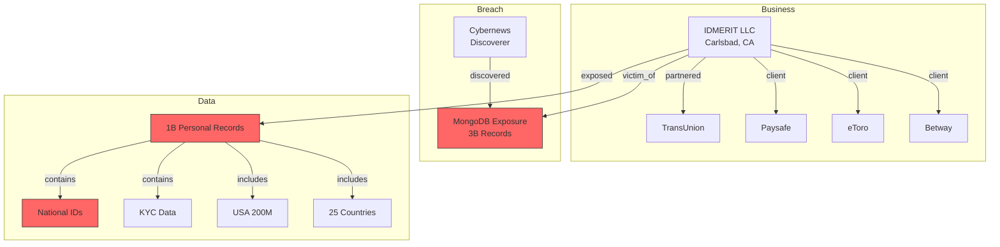

# Relationship Graph

---
investigation: IDMERIT Data Breach - 3 Billion Records Exposed
created: 2026-02-21T12:00:00
updated: 2026-02-21T12:15:00
type: graph
---

## Graph Overview

- **Total Nodes:** 12
- **Total Edges:** 15
- **Clusters Identified:** 3
- **Anomalies Detected:** 1

---

## Nodes (Entities)

### Organizations

| ID | Name | Type | Location | Connections |
|----|------|------|----------|-------------|
| O001 | IDMERIT LLC | identity verification | Carlsbad, CA | 9 |
| O002 | Cybernews | security research | - | 1 |
| O003 | TransUnion | data partner | - | 1 |
| O004 | Paysafe | client | - | 1 |
| O005 | eToro | client | - | 1 |
| O006 | Betway | client | - | 1 |

### Events

| ID | Name | Type | Date | Connections |
|----|------|------|------|-------------|
| E001 | MongoDB Exposure | data breach | ~Feb 2026 | 2 |

### Locations

| ID | Name | Type | Connections |
|----|------|------|-------------|
| L001 | USA | country | 2 |
| L002 | 25 other countries | countries | 1 |

### Data Types

| ID | Name | Type | Sensitivity |
|----|------|------|-------------|
| D001 | Personal Records (1B) | data | CRITICAL |
| D002 | National IDs | data | CRITICAL |
| D003 | KYC Data | data | CRITICAL |

---

## Edges (Relationships)

| ID | From | To | Type | Confidence |
|----|------|-----|------|------------|
| E001 | O001 | E001 | victim_of | confirmed |
| E002 | O001 | D001 | exposed | confirmed |
| E003 | D001 | D002 | contains | confirmed |
| E004 | D001 | D003 | contains | confirmed |
| E005 | O002 | E001 | discovered | confirmed |
| E006 | O001 | O003 | partnered_with | confirmed |
| E007 | O001 | O004 | client_of | confirmed |
| E008 | O001 | O005 | client_of | confirmed |
| E009 | O001 | O006 | client_of | confirmed |
| E010 | D001 | L001 | includes | confirmed |
| E011 | D001 | L002 | includes | confirmed |

---

## Clusters

### Cluster 1: IDMERIT Business Network

```
                    [O003: TransUnion]
                           │
                     partnered_with
                           │
[O004: Paysafe] ──client── [O001: IDMERIT] ──client── [O005: eToro]
                           │
                       client
                           │
                    [O006: Betway]
```

**Theme:** IDMERIT's commercial relationships
**Significance:** These clients may have data exposed through IDMERIT

---

### Cluster 2: Breach Event

```
[O002: Cybernews] ──discovered── [E001: MongoDB Exposure]
                                        │
                                   victim_of
                                        │
                                 [O001: IDMERIT]
```

**Theme:** Discovery chain
**Significance:** Researchers, not IDMERIT, discovered the breach

---

### Cluster 3: Exposed Data

```
                    [D001: 1B Personal Records]
                           │
            ┌──────────────┼──────────────┐
            │              │              │
       contains       contains       includes
            │              │              │
     [D002: National IDs] [D003: KYC] [L001: USA 200M]
                                        │
                                    includes
                                        │
                               [L002: 25 Countries]
```

**Theme:** Scope of exposed data
**Significance:** Shows breadth and depth of compromise

---

## Graph Visualization (Mermaid)



---

## Anomalies

### ANOM-001: Unsecured Database

- **Type:** security failure
- **Description:** Company specializing in identity security left own database completely unprotected
- **Significance:** Irony/hypocrisy - IDMERIT sells security but failed basic security
- **Impact:** Undermines trust, potential legal liability

---

## Hidden Links (To Investigate)

| From | To | Suggested Type | Reason | Priority |
|------|-----|----------------|--------|----------|
| ?Regulators | O001 | investigating | Data breach this size | HIGH |
| ?Victims | D001 | data_subject | 1B affected individuals | HIGH |
| ?Criminals | D001 | accessed? | Potential misuse | HIGH |
| ?Other Clients | O001 | client | Undisclosed clients | MEDIUM |

---

## Key Relationships to Verify

1. **Client exposure:** Did Paysafe, eToro, Betway have customer data exposed?
2. **TransUnion data:** Was TransUnion partnership data affected?
3. **Regulatory notification:** Which regulators have been notified?
4. **Criminal access:** Any evidence of data being accessed by malicious actors?

---

## Impact Network

```
IDMERIT Breach
    │
    ├── Direct Impact
    │   ├── 1B individuals (PII exposed)
    │   ├── 26 countries (jurisdictional)
    │   └── IDMERIT clients (reputation, liability)
    │
    ├── Potential Consequences
    │   ├── Identity theft (individuals)
    │   ├── Fraud (financial institutions)
    │   ├── Regulatory fines (GDPR, CCPA)
    │   └── Lawsuits (class actions)
    │
    └── Unknown
        ├── Who accessed the data?
        ├── Has data been sold/shared?
        └── What will victims do?
```

---

## Statistics

- **Total Entities:** 12
- **Countries Affected:** 26
- **Records Exposed:** 3 billion
- **Confirmed Clients:** 4
- **Regulatory Bodies:** TBD
