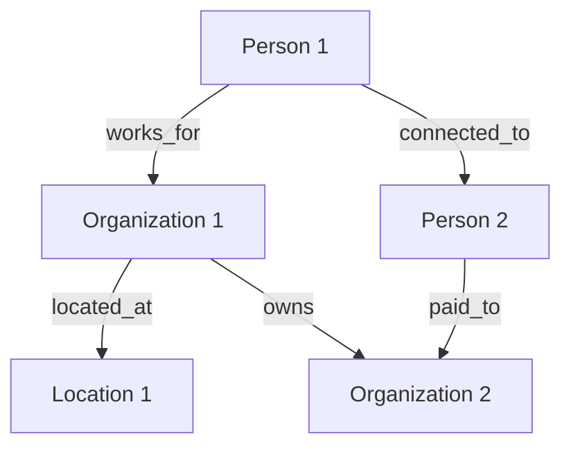

# Relationship Graph

---
investigation: {{investigation_name}}
created: {{timestamp}}
updated: {{timestamp}}
type: graph
---

## Graph Overview

- **Total Nodes:** 
- **Total Edges:** 
- **Clusters Identified:** 
- **Anomalies Detected:** 

---

## Nodes (Entities)

### Summary Table

| ID | Name | Type | Connections | Confidence | Key Evidence |
|----|------|------|-------------|------------|--------------|
| P001 | | person | # | | S001 |
| O001 | | organization | # | | S002 |

### Node Details

#### P001: [Person Name]

- **Type:** person
- **Aliases:** 
- **Primary Organization:** 
- **Role/Position:** 
- **Location:** 
- **Confidence:** confirmed | probable | unverified
- **Evidence:**
  - S001: [What the source says about this person]
- **Connections:**
  - → O001 (works_for)
  - → P002 (connected_to)
- **Notes:** 

#### O001: [Organization Name]

- **Type:** organization
- **Subtype:** corporation | ngo | government | shell | other
- **Jurisdiction:** 
- **Key People:** P001, P002
- **Confidence:** confirmed | probable | unverified
- **Evidence:**
  - S002: [What the source says about this org]
- **Connections:**
  - ← P001 (works_for)
  - → O002 (subsidiary_of)
- **Notes:** 

---

## Edges (Relationships)

### Relationship Types Reference

| Type | Definition | Direction |
|------|------------|-----------|
| connected_to | General association | Bidirectional |
| involved_in | Participation in event/org | Entity → Event/Org |
| owns | Ownership relationship | Entity → Entity |
| works_for | Employment | Person → Organization |
| paid_to | Financial transaction | Entity → Entity |
| located_at | Physical presence | Entity → Location |
| mentioned_in | Document reference | Entity → Document |
| related_to | Family or close connection | Bidirectional |

### Edge Summary

| ID | From | To | Type | Strength | Confidence | Evidence |
|----|------|-----|------|----------|------------|----------|
| E001 | P001 | O001 | works_for | strong | confirmed | S001 |
| E002 | O001 | O002 | owns | weak | probable | S002 |

### Edge Details

#### E001: P001 → O001 (works_for)

- **Relationship Type:** works_for
- **From Entity:** P001 [Person Name]
- **To Entity:** O001 [Organization Name]
- **Start Date:** 
- **End Date:** 
- **Context:** [Nature of the relationship]
- **Strength:** strong | moderate | weak
- **Confidence:** confirmed | probable | unverified
- **Evidence:**
  - S001: [What evidence supports this relationship]
- **Notes:** [Any caveats or additional context]

---

## Clusters

Groups of connected entities:

### Cluster 1: [Cluster Name/Theme]

- **Theme:** [What connects these entities]
- **Entities:** P001, P002, O001, L001
- **Central Node:** [Most connected entity]
- **Significance:** [Why this cluster matters]
- **Visualization:**
  ```
  [P001] ──works_for── [O001]
     │                    │
  connected_to        located_at
     │                    │
  [P002]              [L001]
  ```

---

## Anomalies

Unexpected or suspicious connections:

### ANOM-001: [Anomaly Description]

- **Type:** unexpected_connection | missing_connection | contradictory_relationship
- **Entities Involved:** 
- **The Anomaly:** [What makes this unusual]
- **Possible Explanations:**
  1. [Explanation 1]
  2. [Explanation 2]
- **Investigation Priority:** high | medium | low
- **Next Steps:** [What to investigate]

---

## Graph Visualization

### Full Network (Mermaid)



### Subgraph: [Cluster Name]

```mermaid
graph TD
    [Subset of related nodes]
```

---

## Connection Matrix

### Person-to-Person

|  | P001 | P002 | P003 |
|--|------|------|------|
| **P001** | - | connected_to | - |
| **P002** | connected_to | - | related_to |
| **P003** | - | related_to | - |

### Person-to-Organization

|  | O001 | O002 |
|--|------|------|
| **P001** | works_for | - |
| **P002** | - | works_for |

---

## Hidden Links

Potential relationships not yet confirmed:

| From | To | Suggested Type | Reason | Priority |
|------|-----|----------------|--------|----------|
| P001 | O002 | indirect_ownership | [Why we suspect this] | high |

---

## Investigation Priorities

Based on graph analysis:

1. **Verify** relationship P001 → O002
2. **Explore** cluster around O001 (3 hidden connections suspected)
3. **Resolve** anomaly ANOM-001
4. **Fill** missing connections in [Cluster 2]
