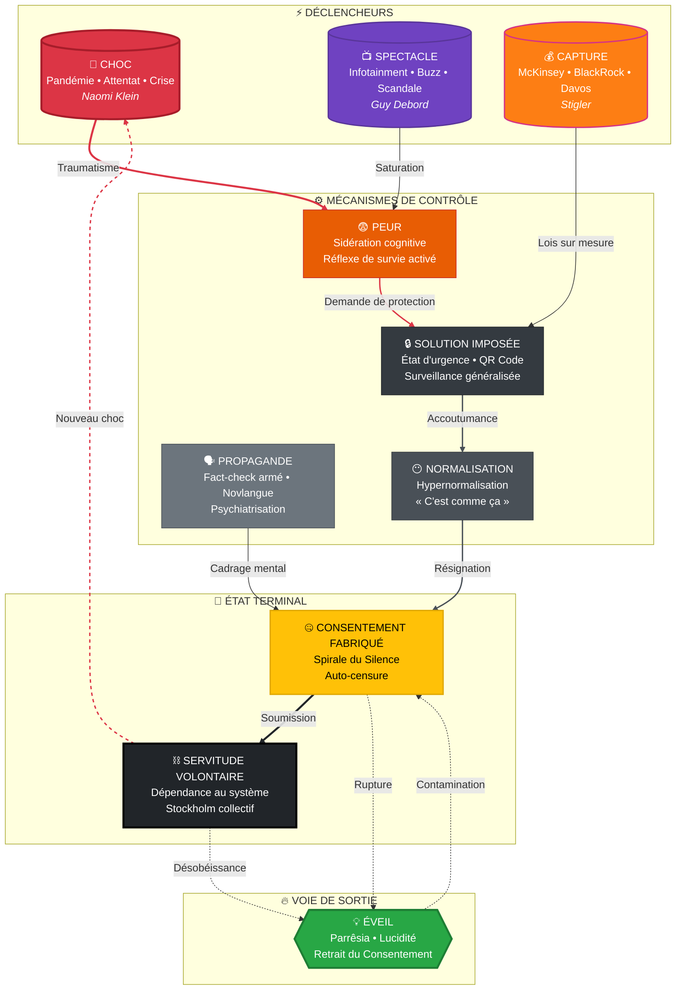

Ils sourient aux caméras. Ils votent. Ils consomment. Ils s'indignent sur commande et s'apaisent sur prescription. Ils croient choisir leurs chaînes et appellent cela liberté.

Le patient n'est pas malade. Le patient est mort. Ce qui bouge encore n'est que réflexe post-mortem — spasmes d'un corps social dont l'âme a été extraite méthodiquement, remplacée par un simulacre si parfait que le cadavre lui-même ignore sa propre putréfaction. L'Occident n'est pas tombé. Il s'est dissous. Lentement. Confortablement. Dans un bain tiède de divertissement, de terreur calibrée et de servitude volontaire.

Ceci n'est pas un pamphlet. C'est un rapport d'autopsie.

**Bienvenue dans l'Empire du Mensonge.**

---

> **DÉCLARATION**
>
> Ce texte n'est pas une œuvre de fiction. Ce n'est pas non plus un travail neutre, académique ou prétendument objectif. C'est un **acte de parole libre**, une prise de position radicale, une alerte lancée au cœur du vacarme.
>
> Je déclare ici avoir écrit cet essai dans un but de **lucidité, de dévoilement et de résistance**, face à un système qui mutile les consciences, éteint les voix dissidentes, travestit le réel et promeut l'aliénation sous toutes ses formes — cognitive, psychologique, sociale et politique.
>
> Je n'appartiens à aucun parti, aucune chapelle, aucun pouvoir. Je ne réclame ni vérité absolue, ni monopole du sens. Je revendique au contraire le doute, le discernement, la pensée critique — cette flamme fragile que tout dans ce monde cherche à étouffer.
>
> Ce texte est une **déclaration de désobéissance mentale**. Il est le fruit d'un refus : refus de me taire, refus de consentir, refus de faire semblant. S'il blesse, dérange ou irrite, c'est qu'il vise juste. S'il provoque, tant mieux : le confort intellectuel est un luxe que nous ne pouvons plus nous offrir.
>
> **Je n'écris pas pour convaincre. J'écris pour secouer.**

> **REMERCIEMENTS**
>
> Ce texte est né d'une colère froide et d'une inquiétude brûlante. Mais il n'aurait pu voir le jour sans l'héritage intellectuel de penseurs résistants qui, bien avant moi, ont levé le voile sur les rouages du pouvoir, de la manipulation et de la servitude volontaire.
>
> Je tiens à remercier, en pensée et en esprit, **Hannah Arendt** pour avoir diagnostiqué les racines du totalitarisme, **Naomi Klein** pour sa mise en lumière de la stratégie du choc, **Edward Bernays** pour avoir cyniquement révélé les armes de la propagande, **Stanley Milgram** et **Albert Biderman** pour leurs travaux glaçants sur l'obéissance et la coercition psychologique. Leur lucidité m'a guidé.
>
> Merci également à celles et ceux qui, à voix basse ou forte, sur les marges ou au centre, osent encore penser, questionner, douter, chercher — les dissidents sincères, les lucides obstinés, les éveillés anonymes. Ce texte vous appartient autant qu'à moi.
>
> Enfin, merci aux lecteurs — présents, futurs, critiques ou convaincus — qui prendront le temps d'ouvrir cet essai et de le confronter à leur propre expérience. C'est à vous qu'il revient d'en faire une arme de conscience, ou un simple miroir.

---

# DIAGNOSTIC : L'ARCHITECTURE DE LA MANIPULATION

## Introduction : Le règne de la contrefaçon

> **« Le monde occidental est l'Empire du Mensonge. »**

Cette formule abrupte n'est pas une exagération littéraire, mais le **diagnostic clinique** d'une époque en état avancé de falsification systémique. L'Occident moderne, en apparence libre, démocratique et éclairé, repose en réalité sur une **infrastructure psychique de manipulation** — ce que les stratèges militaires nomment désormais la **Domination à Spectre Complet** (*Full Spectrum Dominance*), incluant la **Guerre Cognitive** (*Cognitive Warfare*) : un agencement pervers de dispositifs sociaux, médiatiques, technologiques et cognitifs, conçu pour **inverser la réalité**, falsifier le langage et neutraliser les résistances.

Politiciens véreux, médias dociles, journalistes de garde, experts vendus (victimes de **Capture Réglementaire**), pseudo « fact-checkers » aux ordres, influenceurs décérébrés ou ONG de façade forment les membres d'un **théâtre de marionnettes**, où les ficelles sont tirées dans l'ombre par des intérêts oligarchiques, technocratiques et ploutocratiques. Ensemble, ils tissent un **tissu d'illusions collectives**, dont la fonction principale est de **remplacer la réalité par sa simulation** : un monde sans vérité, sans racine, sans mémoire.

Nous ne vivons plus dans des démocraties, mais dans des **démocratures d'apparat** — ce que le philosophe Sheldon Wolin appelait le **Totalitarisme Inversé** (*Inverted Totalitarianism*) : un système où le pouvoir corporatiste a capturé l'État sans abolir formellement les institutions. Le vide du discours est comblé par la **fiction répétée**, l'enfumage séquentiel, l'émotion téléguidée. C'est l'ère de l'**Hypernormalisation** (concept d'Alexei Yurchak) : tout le monde sait que le système ment, le système sait que tout le monde sait, mais personne n'imagine d'alternative tant la **réalité a été remplacée par sa simulation** — le *Simulacre* de Baudrillard.

Cette contrefaçon mentale n'est pas une erreur : c'est une **stratégie d'ingénierie sociale délibérée**. **Diviser pour mieux régner**, occuper les esprits avec des *panem et circenses*, saturer les consciences par l'infobésité, reprogrammer les émotions via la peur, **neutraliser l'opposition par la Pathologisation de la Dissidence**, coordonner la servitude via les algorithmes : tout cela n'est pas le fruit du hasard, mais **le résultat d'une convergence de techniques issues des sciences sociales, de la psychiatrie comportementale et de la communication de masse**.

Ce système d'asservissement moderne repose sur **trois piliers** (la Triade de la Domination) :

1. **La Fabrication du Consentement** (Bernays/Lippmann) : l'art d'obtenir l'adhésion sans la violence — propagande, nudging, récit.

2. **La Coercition Psychique** (Biderman/Klein) : la gestion des masses par le traumatisme et l'état d'urgence permanent.

3. **L'Obsolescence de l'Individu** (Anders/Foucault) : la dissolution programmée du sujet souverain dans le flux numérique.

C'est à cette **architecture invisible mais implacable de domination douce** que cet essai pamphlétaire s'attaque frontalement. Son but n'est pas de choquer gratuitement ni de sombrer dans la caricature, mais d'exposer **la mécanique** : **comment on en est arrivé là, pourquoi cela fonctionne, et ce que cela exige de nous pour y résister.**

**L'enjeu est clair : soit nous prenons conscience de ces chaînes invisibles et les brisons, soit nous glissons sans retour vers une servitude douce, confortable, connectée — et définitive.**

---

# MÉCANISMES : LES OUTILS DE LA SERVITUDE

## Divertir, diviser et domestiquer : pain, jeux et spectacle

> *« Un peuple qui pense est dangereux. Un peuple qui s'amuse oublie de penser. »*

Le contrôle des masses commence par une recette antique, aussi simple qu'efficace : **diviser pour mieux régner**. Ce principe, que Machiavel n'aurait pas renié, consiste à **susciter et entretenir les fractures internes** d'un corps social pour empêcher son unité politique. Une population éclatée, atomisée, réduite à des identités conflictuelles, est une population **neutralisée sans violence**. Elle ne lutte pas contre ses maîtres : elle s'entredéchire en espérant obtenir un peu plus de reconnaissance, de visibilité ou de pain.

Nos sociétés modernes excellent dans cet art cynique de la **balkanisation mentale et affective** — ce que l'anthropologue Gregory Bateson nommait la **Schismogenèse** (*Schismogenesis*) : une dynamique de séparation culturelle auto-entretenue qui pousse les groupes à se définir uniquement par opposition radicale à l'autre. Les divisions se multiplient et s'exacerbent (genres, races, classes, orientations, tribus numériques), mais **jamais en direction du haut**. C'est la technique de l'**Opposition Contrôlée** : on détourne la colère vers l'horizontale, jamais vers la verticale. Pendant que les riches s'enrichissent, les pauvres s'accusent mutuellement de leur propre misère. Pendant que les puissants verrouillent le pouvoir, les peuples s'accusent de privilèges imaginaires. **Le conflit est détourné, ritualisé, mis en scène — jamais résolu.**

> *Diviser les gens, c'est les empêcher de comprendre qu'ils sont opprimés par les mêmes forces.*

Cette guerre des identités, savamment entretenue par les algorithmes de polarisation et les éléments de langage médiatiques, produit un effet de **dissolution du commun**. La Nation devient une mosaïque, la République un théâtre de factions. Ce n'est pas un dysfonctionnement : c'est **une stratégie d'ingénierie sociale** relevant de l'**Agnotologie** (la science de la production culturelle de l'ignorance et du doute), appuyée par l'**Astroturfing** pour occuper le terrain. Dans un monde où l'unité populaire serait subversive, il faut **organiser la confusion, encourager la fragmentation et neutraliser toute convergence**.

Et pour éviter qu'un esprit lucide ne surgisse de ce chaos ? Rien de plus simple : **l'occuper jusqu'à l'épuisement.**

> *« Donnez-leur du pain, et qu'ils dansent. »*

La tactique du **Panem et circenses** — du pain et des jeux — n'a jamais été abandonnée. Simplement, elle s'est modernisée sous la forme du **Tittytainment** (concept attribué à Zbigniew Brzezinski) : un mélange de divertissement abrutissant et de suffisance alimentaire (« tits » + « entertainment ») pour maintenir 80% de la population dans un état de léthargie satisfaite. Aux gladiateurs ont succédé les joueurs millionnaires. Aux orgies impériales, les télé-réalités hystériques. **Aux rations de la plèbe**, les tickets-resto numérisés. Mais la logique est la même : **nourrir le ventre, flatter les pulsions, abrutir les esprits**.

Pendant que les jeux envahissent l'écran, **la politique se joue ailleurs** — dans les fonds spéculatifs, les think tanks opaques, les commissions européennes hors sol. Pendant que les masses vibrent devant ce que Daniel Boorstin appelait des **Pseudo-Événements** (faits divers montés en épingle, polémiques stériles), **les traités, les lois, les budgets se votent en silence**. Le cirque numérique remplace la place publique. Et ce divertissement permanent **n'est pas une échappatoire : c'est une camisole sensorielle.**

---

> **CAS D'ÉCOLE — Qatar 2022 / Paris 2024 : Le Sportswashing en action**
>
> La Coupe du Monde 2022 au Qatar illustre parfaitement le *Sportswashing* : un régime accusé de violations massives des droits de l'homme (travailleurs migrants, droits des femmes, LGBTQ+) qui achète sa réhabilitation symbolique grâce au football. Pendant que le monde vibrait devant la Coupe, les enquêtes sur les milliers de morts sur les chantiers des stades passaient au second plan.
>
> En France, les Jeux Olympiques de Paris 2024 ont servi de formidable **écran de fumée** : pendant l'été de la cérémonie d'ouverture, le gouvernement faisait voter en catimini des textes majeurs sur la surveillance, alors que l'attention médiatique était entièrement captée par le spectacle sportif. La ville a été « nettoyée » de ses sans-abri, les prix ont explosé, mais les images d'unité nationale et de réussite logistique ont saturé les écrans.
>
> **Concept illustré** : *Pseudo-événement*, *Washing*, *Économie de l'Attention*.

---

Nous sommes entrés dans l'ère du **Politique-Divertissement** (*Politainment*) où la « compétition » devient modèle social, l'hystérie émotionnelle un langage commun, le clash une pédagogie. On nous vend l'indignation facile comme outil de citoyenneté — alors qu'elle **remplace l'analyse par le réflexe**. L'information devient réaction. Le discours devient slogan. Et chacun, croyant « s'exprimer librement », **ne fait que répéter les scripts fournis par ses algorithmes** sous l'effet d'une **Contagion Mimétique** (René Girard) instantanée et virale.

> *« Le Spectacle, c'est le capital à un tel degré d'accumulation qu'il devient image. »* — Guy Debord

Guy Debord a tout dit. Dès 1967, dans **La Société du Spectacle**, il prophétisait la mutation du réel en image, de l'expérience en marchandise, de l'homme en spectateur. Ce que nous vivons aujourd'hui est **l'aboutissement terminal de cette logique**.

Sous le régime du **Spectacle total**, l'important n'est plus ce qui est, mais **ce qui se voit**. Ce n'est plus l'action réelle, mais sa mise en scène. Ce n'est plus la vérité, mais **l'effet de vérité produit par le récit**. Nous sommes entrés dans l'ère de l'**Économie de l'Attention**, où notre temps de cerveau disponible est miné par le **Dopamine Hacking** des plateformes. Et dans cet empire de l'apparence, *il ne suffit plus d'être heureux ou vertueux : il faut **en avoir l'air**, sur Instagram, LinkedIn ou YouTube*.

> La vie devient une performance. La pensée, un hashtag. L'engagement, un filtre.

La réalité s'évanouit derrière ses représentations pour laisser place à l'**Hyperréalité** (Baudrillard) : un monde où le signe a remplacé l'objet. L'émotion remplace l'argument, le ressenti supplante le raisonnement. **Le Spectacle colonise tout, même la contestation** : on manifeste comme on like, on s'indigne comme on partage, on milite comme on scroll. Et pendant ce temps, **le monde réel s'effondre — sans public.**

La **Dead Internet Theory**, longtemps moquée comme délire paranoïaque, est désormais validée par ses propres créateurs : **Sam Altman** (OpenAI) et **Alexis Ohanian** (Reddit) admettent qu'une part croissante du contenu en ligne est générée par des bots et des IA. Les études récentes estiment que **50 à 70% des interactions sur certaines plateformes sont non-humaines**. Nous conversons avec des fantômes algorithmiques, nous débattons avec des fermes à clics, nous nous indignons contre des provocations synthétiques. **L'Internet est devenu un théâtre d'ombres où les humains sont minoritaires** — et nous ne savons plus distinguer le vrai du simulé.

Le résultat est implacable :

- **Un peuple fragmenté, désorienté, pacifié par l'amusement** ;
- **Une pensée atomisée, spectaculaire, sans mémoire ni continuité** ;
- **Une illusion de liberté d'expression, où tout se dit mais rien ne change** ;
- **Un consentement diffus, fabriqué par saturation, éparpillement et fatigue cognitive**.

> **C'est cela, la domestication numérique des masses. Une servitude volontaire 2.0, confortable, connectée — et consentie.**

Mais ce conditionnement n'est qu'un prélude. Car derrière le Spectacle vient la propagande. Derrière l'amusement, l'obéissance. Derrière la distraction, la coercition.

Et le pire, c'est que ça fonctionne.

---

## Propagande et Obéissance : La Fabrication du Consentement

> *« Le mensonge ne devient pas vérité parce qu'il est répété mille fois. Il devient réalité parce que plus personne n'a la force de le contester. »* — C'est l'**Effet de Vérité Illusoire** (*Illusory Truth Effect*).

Derrière le rideau scintillant du **spectacle permanent**, opère un **dispositif plus froid, plus efficace, plus terrifiant** encore : la **Guerre de 5e Génération** (5GW), invisible, systémique, sans visage. On l'imagine d'un autre âge — affiches de guerre, haut-parleurs totalitaires, slogans criés en uniforme — mais elle est désormais **subtile, algorithmique, fragmentée**, diffusée en HD par des experts en « relations publiques », des spin doctors, et des « communicants ». Elle est devenue **l'air que l'on respire**.

En 1928, Edward Bernays, père fondateur de la propagande moderne, posait les bases du système :

> *« Ceux qui manipulent ce mécanisme invisible de la société constituent un gouvernement invisible qui dirige véritablement le pays. »*

Loin d'un délire conspirationniste, cette déclaration est aujourd'hui **un fait établi** : les opinions publiques sont **modelées, préprogrammées, déclenchées comme des réflexes conditionnés** par un maillage de techniques de persuasion, d'influence et de cadrage. Il ne s'agit plus de convaincre — il s'agit de **fabriquer le consentement**, sans même que le citoyen réalise qu'il est manipulé.

### La presse n'informe pas, elle orchestre

Noam Chomsky et Edward Herman ont magistralement décrit ce processus dans **La Fabrication du Consentement**. Les médias de masse ne sont pas des contre-pouvoirs, mais des **courroies de transmission** de l'ordre établi.

> *« Ils sélectionnent, hiérarchisent, déforment, excluent — non pour informer, mais pour **servir les intérêts des élites**. »*

Ce **modèle de propagande** repose sur cinq filtres principaux :

1. **La propriété des médias** : ils appartiennent à des oligarques ou grands groupes.
2. **La publicité** : principale source de revenus → auto-censure critique.
3. **Les sources officielles** et la **Technique de la Tierce Partie** (*Third Party Technique*) : utiliser des « experts indépendants » ou des « fact-checkers » pour valider le narratif sans apparaître comme la source.
4. **Le feu nourri** (*Flak*) : pressions, disqualification, campagnes de dénigrement contre les voix dissidentes pour discipliner les journalistes.
5. **L'idéologie dominante** : anticommunisme hier, sécuritarisme ou « wokisme » aujourd'hui.

Tout est structuré pour produire une **version du monde acceptable, digeste, consensuelle**. Le pluralisme n'est qu'une vitrine. La dissidence est folklorisée ou psychiatrée. **Le réel est encadré.**

### La Fenêtre d'Overton : rendre l'impensable inévitable

Mais comment passe-t-on de l'impensable à l'inévitable ? Par un mécanisme d'une redoutable efficacité : la **Fenêtre d'Overton** (*Overton Window*). Ce concept, formulé par le politologue Joseph Overton, décrit l'**éventail des idées politiquement acceptables** à un moment donné. Tout ce qui se situe en dehors de cette fenêtre est perçu comme radical, extrémiste, irréaliste — donc exclu du débat public.

> *« La fenêtre ne représente pas ce qui est vrai, mais ce qui est dicible. »*

Le génie de la manipulation moderne consiste à **déplacer cette fenêtre sans que le public s'en aperçoive**. Comment ? En injectant progressivement dans le débat des idées autrefois impensables, d'abord comme « provocations », puis comme « options à considérer », enfin comme « évidences pragmatiques ». Hier, le pass sanitaire était une dystopie orwellienne. Demain, le revenu universel conditionné au comportement sera un « progrès social ».

Le mécanisme opère en **six étapes** :
1. **Impensable** → L'idée est taboue, ridicule.
2. **Radicale** → Quelques voix « extrêmes » l'évoquent.
3. **Acceptable** → Des « experts » la légitiment.
4. **Raisonnable** → Les médias la débattent sérieusement.
5. **Populaire** → L'opinion bascule, le sondage valide.
6. **Politique publique** → La loi consacre ce qui était hier interdit.

Ainsi, ce n'est pas l'opinion qui change les lois — **ce sont les lois qui formatent l'opinion en déplaçant préalablement la fenêtre**. Le citoyen croit choisir ; il ne fait qu'entériner ce qu'on lui a rendu pensable. La démocratie devient un rituel de validation a posteriori.

### Novlangue, inversion et éléments de langage

La propagande moderne **ne ment pas frontalement** : elle **brouille, reformule, requalifie**. Elle utilise la technique du **Dévoilement Partiel** (*Limited Hangout*) pour cacher le crime systémique, et la **Propagande d'Atrocité** (*Atrocity Propaganda*) pour justifier l'injustifiable par l'émotion pure. Elle transforme la guerre en « opération humanitaire », l'austérité en « ajustement structurel », la censure en « modération responsable ». C'est la **novlangue orwellienne**, outil de réécriture mentale.

> *« La langue de coton est l'uniforme des technocrates. Elle endort, elle dissout, elle lave plus blanc que blanc. »*

Chaque gouvernement moderne dispose de ses **« éléments de langage »**, injectés dans les médias et les discours publics, martelés comme des slogans préventifs. Ils saturent l'espace cognitif, imposent un **framing émotionnel**, **neutralisent la nuance**.

L'arme maîtresse : **l'Accusation en Miroir** (*Accusation in Mirror*), concept défini par le propagandiste nazi Goebbels puis théorisé en psychologie comme la **Projection** :

- Le censeur traite les autres de dangereux.
- Le manipulateur accuse de manipulation.
- L'auteur de la guerre prétend défendre la paix.
- Le bourreau médiatique s'érige en gardien de la vérité.

Cette technique trouve son expression la plus perverse dans le **DARVO** (*Deny, Attack, Reverse Victim and Offender*), protocole décrit par la psychologue Jennifer Freyd. Le mécanisme en trois temps :

1. **Nier** (*Deny*) : « Je n'ai rien fait. Ce n'est pas arrivé. »
2. **Attaquer** (*Attack*) : « C'est vous le problème. Vous êtes fou, paranoïaque, complotiste. »
3. **Inverser victime et bourreau** (*Reverse*) : « En réalité, c'est moi la victime de vos accusations. »

> *Le DARVO est l'arme favorite du pervers narcissique. À l'échelle d'un État, il devient doctrine officielle.*

L'exemple type : un gouvernement qui réprime violemment des manifestants (Gilets Jaunes, agriculteurs), puis se pose en **victime de la violence** qu'il a lui-même provoquée. Ou encore : des médias qui censurent massivement, puis accusent les censurés de « menacer la liberté d'expression ». L'inversion est totale, systémique, assumée.

Dans ce théâtre sémantique, **le Bien est travesti par le Mal — et inversement**. C'est le règne du faux-semblant, où la rationalité devient soupçonnable, et où **toute critique systémique est assimilée à une dérive mentale ou complotiste.**

---

> **CAS D'ÉCOLE — L'Affaire Raoult et le Fact-Check Armé (2020-2024)**
>
> Didier Raoult, professeur de microbiologie à Marseille, devient en mars 2020 le symbole d'une controverse scientifique hors norme. Son protocole à l'hydroxychloroquine divise la communauté médicale — mais c'est le **traitement médiatique** qui est instructif.
>
> **Psychiatrisation** : Raoult est progressivement dépeint non comme un scientifique contestable, mais comme un *fou dangereux*, un « gourou », un « charlatan ». Ses soutiens sont qualifiés de « complotistes », d'« antivax » — même ceux qui ne l'étaient pas. La nuance disparaît.
>
> **Fact-Check Armé** : Les « Décodeurs » (Le Monde), CheckNews (Libération), AFP Fact-Check ont produit des dizaines d'articles pour « vérifier » chaque déclaration. Or, plusieurs de ces « fact-checks » portaient sur des **opinions scientifiques non tranchées**, pas sur des faits. Le format du « fact-check » — vrai/faux binaire — a été utilisé pour **clore un débat scientifique ouvert**.
>
> **Conflit d'intérêts structurel** : L'AFP est financée à 40% par l'État français. Les Décodeurs ont été critiqués pour leur biais par des organismes comme AllSides (classé « Left ») et Media Bias/Fact Check.
>
> **Concept illustré** : *Pathologisation de la Dissidence*, *Spirale du Silence*, *Fact-Check Armé*.

---

### Obéir, imiter, se conformer — les ressorts invisibles de l'adhésion

Mais comment la propagande fonctionne-t-elle si bien ? Parce qu'elle **s'ancre dans les failles fondamentales de notre psychologie sociale**.

Dès 1895, **Gustave Le Bon** l'avait compris dans sa **Psychologie des foules** : *l'individu dissout dans la masse perd son esprit critique, devient suggestible, se laisse guider par l'émotion et l'image plutôt que par la raison*. Un siècle plus tard, la psychologie expérimentale a confirmé ce diagnostic implacable.

Plus récemment, **Mattias Desmet** a théorisé la **Formation de Masse** (*Mass Formation*) : un état d'hypnose collective qui émerge quand quatre conditions sont réunies — **isolement social**, **perte de sens**, **anxiété flottante** et **frustration sans objet**. La pandémie de COVID-19 a été le laboratoire planétaire de cette formation : des populations entières, atomisées et anxieuses, se sont agrégées autour d'un récit unique, rejetant violemment quiconque le contestait. *« La formation de masse est une sorte d'hypnose de groupe »*, écrit Desmet — et comme toute hypnose, elle rend aveugle à l'évidence.

L'expérience de **Milgram** montre que **l'homme ordinaire obéit à l'autorité même lorsqu'elle exige l'inhumain**. Un simple costume, une blouse blanche, une figure d'expert suffit pour **suspendre la conscience morale**.

L'expérience d'**Asch** démontre que **le conformisme social prime sur la vérité perceptible** : on renie l'évidence pour ne pas se démarquer. C'est la terrible **Spirale du Silence** (*Spiral of Silence*), théorisée par Noelle-Neumann : par peur de l'isolement, la minorité (ou même la majorité !) finit par adopter l'opinion qu'elle croit dominante.

L'expérience de **Zimbardo** révèle qu'un **rôle social fictif suffit à engendrer l'abus, la soumission, la cruauté**, tant que le cadre l'autorise.

Et **Hannah Arendt**, observant le procès d'Adolf Eichmann en 1961, formula le concept le plus terrifiant de tous : la **Banalité du Mal** (*Banality of Evil*). Le mal absolu n'exige pas de monstres — seulement des **bureaucrates obéissants qui ne pensent pas**. Eichmann n'était ni fou ni sadique : c'était un fonctionnaire zélé, incapable de juger par lui-même, qui « faisait son travail ». *« Sous les conditions du totalitarisme, écrit Arendt, l'individu perd le sens de sa propre identité. »* Les agents de l'Empire du Mensonge ne sont pas des démons — ce sont des employés qui cochent des cases.

Ces expériences, si souvent citées mais rarement comprises dans leur radicalité, disent une chose :

> **La pensée autonome est une exception. L'obéissance est la norme.**

La propagande ne fait donc qu'**activer des réflexes biologiques d'adaptation au groupe, d'évitement de conflit, de délégation au pouvoir.** Elle **exploite nos instincts de survie sociale** pour mieux imposer un cadre idéologique indiscutable.

### Consentement fabriqué, adhésion conditionnée

En combinant ces ressorts, le système parvient à **fabriquer une adhésion simulée**, relevant du **Contrôle Réflexif** (théorisé par Vladimir Lefebvre) : amener l'adversaire (le peuple) à prendre volontairement la décision qui l'amènera à sa propre défaite, tout en croyant agir librement.

Le peuple acclame ce qui l'écrase, réclame plus de contrôle au nom de la sécurité, **désigne comme « ennemi public » quiconque ose penser en dehors du script**. L'absurde devient routine. Le pouvoir peut tout faire, tant qu'il **produit l'image d'un débat**, **l'illusion d'un choix**, **le vernis d'un pluralisme**.

> *« Le totalitarisme moderne n'a plus besoin de camps, il a Twitter, BFMTV et ChatGPT. »*

### Psychiatrisation de la dissidence et soft totalitarianism

L'ultime ruse est celle-ci : **ne plus réfuter l'opposition, mais la disqualifier**. Loin d'argumenter, le système **psychiatrise** les voix discordantes :

- « Complotiste » pour l'analyste indépendant
- « Antivax » pour le prudent
- « Extrémiste » pour le dissident
- « Troll » pour celui qui dérange

Cette **étiquette suffit à exclure du champ du raisonnable**. On n'a plus à écouter, encore moins à répondre : il suffit de décréter que « cette personne est hors-jeu ». C'est un **soft totalitarianism**, sans camp ni barbelés, mais où **l'excommunication symbolique** suffit à faire taire les gêneurs.

Mais le système va plus loin. En 2008, **Cass Sunstein**, conseiller d'Obama et théoricien du Nudge, proposa dans un article académique la **Cognitive Infiltration** : l'infiltration active des « groupes conspirationnistes » par des agents gouvernementaux pour **semer le doute de l'intérieur**, fragmenter les communautés dissidentes et « réintroduire des doutes cognitifs ». *« Nous suggérons que le gouvernement, plutôt que de réfuter directement les théories du complot, engage des agents pour infiltrer les groupes extrémistes »*, écrit-il sans fard. Ce n'est plus de la propagande passive — c'est du **sabotage cognitif institutionnalisé**, une forme de COINTELPRO 2.0 appliqué à l'ère numérique.

En résumé, la propagande moderne ne nous ordonne plus de penser : elle **organise le cadre dans lequel seules certaines pensées peuvent exister**. Elle **n'impose pas l'adhésion** : elle **organise la disqualification de toute alternative** par l'**Invisibilisation Algorithmique** (*Shadowbanning*). Elle **ne détruit pas l'esprit critique frontalement** : elle le **noyaute de l'intérieur, le fatigue, le ridiculise, le rend inutile.**

C'est ainsi que, dans **un monde saturé de mots, d'experts, d'émotions calibrées**, on peut faire **accepter à une population entière l'inacceptable — avec le sourire.**

---

## Choc et Effroi : Peur, Souffrance Psychique et Coercition

> *« Lorsque la peur gouverne, la pensée déserte. Et lorsque la pensée cède, la soumission n'a plus besoin de chaînes. »*

La propagande ne suffit pas toujours. Lorsque l'enfumage sémantique échoue à endormir les consciences, **le système active l'arme atomique du conditionnement collectif** : **la peur**. Peur de mourir, peur de manquer, peur d'être exclu, puni, ridiculisé ou abandonné. La peur n'est pas une émotion : c'est **un levier politique, un outil de reconfiguration psychique**. Elle est le *starter* de l'état d'urgence, la *clef de voûte* de la servitude volontaire.

### La Stratégie du Choc : transformer la sidération en soumission

Naomi Klein l'a démontré dans **La Stratégie du Choc** : les désastres (attentats, catastrophes, pandémies, effondrements économiques) ne sont pas des accidents — **ils sont des opportunités d'ingénierie sociale**. Lorsqu'un peuple est sous choc, **il est malléable, vulnérable, disponible pour un « reset » mental**. C'est la technique de la **Conduite Psychique** (*Psychic Driving*), terme utilisé par le psychiatre de la CIA Ewen Cameron dans ses expériences de « lavage de cerveau » : on efface l'ancien moi par électrochocs, puis on réinjecte un moi fonctionnel, obéissant, vierge.

À l'échelle d'une société, cela donne :

- **Un traumatisme collectif** (crise soudaine, désastre, attaque)
- **Une désorientation cognitive de masse** (perte de repères, sidération)
- **Une « solution radicale » imposée dans l'urgence** (réforme, répression, contrôle)
- **Une perte durable de droits, de libertés, de souveraineté**

Le Chili de Pinochet, les USA post-11 septembre, la Russie post-URSS, ou encore la crise COVID ont tous suivi ce script. C'est la dialectique hégélienne appliquée : **Problème → Réaction → Solution**. Le pouvoir crée ou exploite le problème, attend la réaction de panique, et impose la solution qu'il avait déjà préparée. Le choc produit l'acceptation. La peur valide l'impensable.

> *« Il faut exploiter les désastres pendant qu'ils brûlent encore »*, disaient les architectes du capitalisme du désastre.

### Fabriquer l'alerte permanente

Mais un choc unique ne suffit pas. Il faut **entretenir l'état d'alerte**, **saturer les esprits de menaces**, créer une ambiance de guerre continue, où chaque jour justifie **davantage de contrôle**.

C'est la **stratégie de la tension** version XXIe siècle :

- Ennemi invisible (virus, terroriste, climato-négationniste, « haineux »)
- Risque existentiel imminent
- Narratif apocalyptique
- Solution imposée, non négociable.

**La peur devient alors le pivot de l'ingénierie comportementale.** Les gens réclament eux-mêmes les chaînes : confinement, surveillance, flicage algorithmique, censure... tout est accepté *du moment que c'est « pour notre sécurité »*.

### Syndrome de Stockholm de masse

Ce climat anxiogène constant favorise un phénomène étrange mais documenté : le **Syndrome de Stockholm collectif**. Quand le chaos devient insupportable, **le peuple s'identifie à ses bourreaux**, les défend, les justifie, les sacralise. Mieux : il attaque ceux qui les critiquent.

> *« Le pouvoir m'a frappé ? C'est pour mon bien. Celui qui le conteste est un danger pour moi. »*

C'est le point d'inversion complet de la rationalité politique, générant un **Lien Traumatique** (*Trauma Bonding*) : **on adore celui qui nous opprime** et on hait celui qui nous alerte.

---

> **CAS D'ÉCOLE — Le Pass Sanitaire : La Charte de Biderman en action (2021-2022)**
>
> En août 2021, la France étend le « Pass Sanitaire » à l'accès aux cafés, restaurants, hôpitaux (hors urgences), trains et avions. L'analyse de cette politique à travers la **Charte de Biderman** est édifiante :
>
> - **Isolement** : Les non-vaccinés sont exclus de la vie sociale, des transports, des lieux de loisir.
> - **Monopolisation de la perception** : Couverture médiatique 24/7 sur la pandémie, aucune voix dissidente audible.
> - **Menaces permanentes** : Compteurs quotidiens de morts, prédictions apocalyptiques des modèles.
> - **Indulgences intermittentes** : « Réouvertures » conditionnelles, promesses de « retour à la normale ».
> - **Démonstration d'omnipotence** : QR codes obligatoires, traçage, collecte de données de santé.
> - **Dégradation** : « Irresponsables », « égoïstes », « complotistes » — l'exclusion morale des récalcitrants.
> - **Exigences absurdes** : Attestations kafkaïennes, masques en extérieur, couvre-feux arbitraires.
>
> Le **Défenseur des Droits** a lui-même alerté sur les « atteintes à la liberté de circulation » et le risque de créer « deux catégories de citoyens ». Le Monde Diplomatique a qualifié le Pass de « moyen extrajudiciaire de désactiver socialement les gens ».
>
> **Concept illustré** : *Double Bind*, *Rituel de Dégradation*, *Syndrome DDD*.

---

## La Charte de la Coercition : huit étapes pour briser un être humain

En 1956, Albert Biderman analyse les méthodes de torture psychologique employées contre les prisonniers de guerre américains. Il en tire une **charte sinistre** en huit points, toujours utilisée dans les interrogatoires extrêmes. Or, ce manuel du « bourreau moderne » est **désormais appliqué — à bas bruit — à l'échelle sociale.**

**1. Isolement**

> Couper l'individu de ses appuis, de ses liens.
> → *Confinement physique, censure sociale, cloisonnement numérique, atomisation relationnelle.*

**2. Monopolisation de la perception**

> Occuper tout l'espace mental, empêcher la pensée divergente.
> → *Flux médiatique constant, un sujet unique, un vocabulaire imposé, pas d'alternative audible.*

**3. Épuisement induit**

> Briser les défenses par la fatigue, l'angoisse.
> → *Stress chronique, instabilité économique, urgences permanentes, infodémie anxiogène.*

**4. Menaces permanentes**

> Entretenir une peur diffuse, conditionnelle.
> → *Catastrophes annoncées, peur du virus, du réchauffement, du chômage, des sanctions, des « autres ».*

**5. Indulgences intermittentes**

> Soulagement ponctuel pour renforcer l'adhésion.
> → *« Réouvertures », aides ponctuelles, promesses de retour à la normale — jamais tenues.*

**6. Démonstration d'omnipotence**

> Faire sentir qu'on est surveillé, impuissant.
> → *QR codes, traçage, caméras, scores sociaux implicites, collecte de données permanentes.*

**7. Dégradation**

> Humilier, culpabiliser, délégitimer.
> → *Dissidents traités de fous, irresponsables, criminels. C'est un **Rituel de Dégradation** (*Degradation Ceremony*, Garfinkel) visant à exclure moralement la cible de la communauté humaine.*

**8. Exigences absurdes**

> Imposer des règles illogiques, variables, pour ancrer la soumission.
> → *Gestes barrières absurdes, attestations kafkaïennes, injonctions contradictoires, absurdités « ritualisées ». C'est la technique de la **Double Contrainte** (*Double Bind*) théorisée par Gregory Bateson : un choix impossible qui disloque la santé mentale.*

> *Ces méthodes visent une chose : **briser l'autonomie psychique**.*

---

## Gaslighting sociétal : faire douter le réel

Le **gaslighting**, ce mécanisme où l'abuseur nie les évidences jusqu'à faire douter la victime de sa propre raison, est **désormais appliqué à la société entière**.

- *« Nous n'avons jamais dit cela. »*
- *« Ce n'est pas ce que vous croyez. »*
- *« Vous avez mal compris. »*
- *« Ceux qui doutent sont fous. »*

Une population placée sous **injonction paradoxale constante**, exposée à un **langage qui change en permanence**, à des versions officielles qui se contredisent, perd pied. Elle subit ce que Robert Jay Lifton appelle un **Perspecticide** : le meurtre de la capacité à percevoir le réel par soi-même. Elle se raccroche alors **à celui qui fournit la « vérité validée »** — même s'il ment.

> *« C'est quand tout le monde devient fou que les sains d'esprit doutent d'eux-mêmes. »*

Le **doute rationnel** est remplacé par la **soumission cognitive** : « je ne comprends plus, mais je me conforme ». C'est l'état d'**Impuissance Apprise** (*Learned Helplessness*) démontré par Martin Seligman : à force de subir des chocs aléatoires et inévitables, le sujet renonce à s'échapper, même quand la porte est ouverte.

## La torture blanche, version technocratique

La **torture blanche** ou **Menticide** (Meurtre de l'esprit, concept de Joost Meerloo), c'est **l'anéantissement sans trace**, le supplice sans cicatrice. C'est : le silence absolu, la lumière permanente, l'absence de repères, l'isolement prolongé, l'effacement du temps.

Aujourd'hui, nous subissons sa **version numérisée** : médias homogènes, récits officiels ininterrompus, écranisation totale, stimuli sans pause, fatigue décisionnelle, stress post-traumatique chronique.

**Nous vivons dans une cellule mentale sans fenêtre.**
Et le pire ? C'est nous qui avons meublé cette cellule, décoré ses murs, et **remercié nos geôliers pour leur bienveillance**.

---

> **CAS D'ÉCOLE — Les Gilets Jaunes : La Répression comme Message (2018-2019)**
>
> Le mouvement des Gilets Jaunes, né en octobre 2018, illustre l'autre face de la coercition : la **violence d'État** comme outil de dissuasion.
>
> **Bilan humain documenté** :
> - **11 morts**, 2 495 civils blessés, 1 944 policiers blessés
> - **12 107 interpellations**, 10 718 gardes à vue, 3 100 condamnations
> - Usage massif de **LBD 40** (lanceurs de balles de défense) et **grenades GLI-F4** → mutilations (mains arrachées, yeux crevés)
>
> **Amnesty International France** a dénoncé une répression « disproportionnée » et des pratiques de « nasses » (encerclement de manifestants pacifiques), confiscation de matériel médical, et violences documentées contre des journalistes.
>
> **Effet recherché** : Le *Refroidissement Social* (*Social Cooling*). Montrer le coût de la contestation pour décourager les suivants. Le message est clair : « Manifestez, et vous risquez votre corps. »
>
> **Concept illustré** : *Stratégie de la Tension*, *Refroidissement Social*, *Impuissance Apprise*.

---

## Finalité : ritualiser la soumission

Le but ultime n'est pas la peur. C'est **la soumission ritualisée**, ce que la sociologie de guerre appelle le syndrome **DDD** (**Debility, Dependency, Dread** — Débilité, Dépendance, Effroi) :

- Intégrer les absurdités comme des réflexes.
- Se féliciter d'obéir.
- Blâmer ceux qui résistent.
- Incarner soi-même l'autorité qui veille.

Le peuple devient son propre bourreau. L'État n'a plus besoin de réprimer : **le citoyen s'autocontrôle, s'autoaccuse, se conformise.**

> *« Un peuple dépersonnalisé, abruti par le choc, soumis par la peur, finit par aimer ses chaînes. »*

---

# EFFONDREMENT : LA DÉSINTÉGRATION COGNITIVE

## Infodémie et Infobésité : L'Épuisement des Esprits

**« Infodémie »**, le mot est apparu en 2020, dans la foulée de la pandémie de COVID-19. L'Organisation Mondiale de la Santé l'a forgé pour désigner un phénomène aussi insidieux que le virus lui-même : **le déferlement de contenus — rumeurs, demi-vérités, mensonges, contre-vérités — contaminant les esprits plus vite que le pathogène ne contaminait les corps**. Cette saturation volontaire porte un nom en stratégie militaire russe : le **Lance à Incendie du Mensonge** (*Firehose of Falsehood*, analysé par la RAND Corporation) : inonder les canaux d'un flux continu, rapide et répétitif pour noyer le réel. *« Les fake news circulent plus vite que le virus et sont tout aussi dangereuses »*, alertait le directeur de l'OMS.

Mais l'infodémie n'est pas une conséquence accidentelle : elle est le symptôme d'une pathologie plus ancienne, **l'infobésité**. Nos cerveaux sont devenus les décharges du numérique. **Jamais l'information n'a été aussi abondante, instantanée, omniprésente. Et jamais le public n'a été aussi désorienté, méfiant, épuisé.**

On parle désormais de **fatigue informationnelle** : *trop d'info tue l'info*. Une étude en France révèle que **plus d'un Français sur deux se sent épuisé par l'actualité**, incapable de démêler l'essentiel de l'accessoire. « Impression de lire toute la journée les mêmes nouvelles », « difficulté à se faire une opinion », « sentiment d'être dépassé » : autant de signes d'un **effondrement cognitif en cours**. Alvin Toffler, dès 1970, l'avait prophétisé dans **Le Choc du Futur** (*Future Shock*) : *un trop-plein d'événements, d'options, d'informations rend la société dysfonctionnelle*. Joël de Rosnay, lui, parlait de **pollution mentale** — métaphore prophétique.

Aujourd'hui, cette pollution est **organisée, industrialisée, monétisée**.

## La fragmentation de l'attention comme stratégie d'occupation mentale

L'économie numérique n'est pas une économie de la connaissance : **c'est une économie de l'attention captée et revendue**, ce que Shoshana Zuboff nomme le **Capitalisme de Surveillance**. Derrière les contenus, ce sont **nos yeux, notre disponibilité mentale, nos émotions** qui sont marchandés. Les architectes de cette économie, appelés « captologues », ont optimisé des systèmes conçus pour **détourner notre volonté, hacker notre dopamine, fragmenter notre concentration**.

Les algorithmes sociaux — Facebook, X, Instagram, YouTube, TikTok — ne diffusent pas l'information la plus fiable, mais celle **qui maximise l'engagement émotionnel**. Or, comme le rappelle le mathématicien David Chavalarias, *« l'engagement est une fonction du choc, du clash, de l'extrême »*. Les contenus violents, absurdes, polarisants sont donc mécaniquement promus. **La désinformation n'est pas un accident, elle est le carburant du système.**

**L'indignation permanente** devient notre seul carburant émotionnel. Nous sommes en état d'**Attention Partielle Continue** (*Continuous Partial Attention*, Linda Stone), toujours alertes, jamais concentrés. On nous pousse à cliquer, partager, réagir... pas à comprendre. À force, **l'attention se disloque**, **la pensée critique s'érode**, **la mémoire de travail sature**, et **la fatigue décisionnelle s'installe**. Le but est la **Rupture de la Boucle OODA** (*OODA Loop Disruption*, concept du colonel John Boyd) : briser le cycle Observation-Orientation-Décision-Action du citoyen pour le plonger dans la paralysie.

---

> **CAS D'ÉCOLE — L'Affaire DNC : Quand « Complotisme » et Vérité s'inversent (Décembre 2025)**
>
> En décembre 2025, la **Dermatose Nodulaire Contagieuse** (DNC) frappe le Sud-Ouest de la France. Le gouvernement impose l'**abattage systématique** des troupeaux infectés. Les agriculteurs réclament une alternative : la **vaccination**, disponible mais non autorisée.
>
> **Inversion du récit** : Les voix critiques sont immédiatement qualifiées de « complotistes » par les médias mainstream. Emmanuelle Ducros (L'Opinion) devient la voix du narratif officiel : « Il n'existe aucun traitement. » Or, un **vaccin existe** — simplement non déployé pour des raisons réglementaires/économiques.
>
> **Infodémie en action** : Sur X (Twitter), le sujet est noyé sous des accusations croisées. Les agriculteurs sont dépeints tantôt comme des « anti-système manipulés par la Russie », tantôt comme des victimes légitimes. Le chaos informationnel **empêche toute analyse rationnelle**.
>
> **Cui bono ?** : Qui profite de l'abattage obligatoire plutôt que de la vaccination ? Les grands groupes agro-industriels (FNSEA/Avril) qui peuvent racheter les exploitations fragilisées à bas prix.
>
> **Concept illustré** : *Firehose of Falsehood*, *Rupture OODA*, *Accusation en Miroir*.

---

## Un peuple submergé est un peuple désarmé

Le résultat ? Un peuple **surchargé, sidéré, incapable de hiérarchiser les faits**. Trop d'informations, trop de contradictions, trop de bruit : le chaos mental devient norme. Et dans le chaos, **plus personne ne sait qui croire. Alors, on ne croit plus rien.**

Ou pire : **on croit n'importe quoi**. C'est l'effet pervers de la **Loi de Brandolini** (ou principe d'asymétrie du baratin) : *« La quantité d'énergie nécessaire pour réfuter des bêtises est supérieure d'un ordre de grandeur à celle nécessaire pour les produire. »* Face à ce coût énergétique impossible, l'esprit capitule.

Le terreau est fertile pour les **délires complotistes**. Le **complosophisme**, version grotesque et paresseuse de la contre-information, séduit les esprits brisés. Il prétend apporter une grille simple, unifiante, cohérente — là où la complexité du monde nous échappe. L'élite occulte remplace la causalité, les Illuminati supplantent la sociologie, et Bill Gates devient la figure du Diable numérique.

Et cette dérive arrange bien les puissants. Il leur suffit alors d'un mot — *complotiste* — pour disqualifier **toute opposition**, même légitime. **C'est la psychiatrisation moderne de la dissidence**. On ne débat plus. On exclut. On ne réfute pas. On **stigmatise**, on **infantilise**, on **pathologise**. « Vous êtes fous, donc nous ne vous écoutons pas. »

C'est le phénomène de **Refroidissement Social** (*Social Cooling*) : les citoyens, se sachant surveillés et notés, s'autocensurent préventivement pour ne pas perdre leur « crédit social ».

## De la surcharge cognitive à la servitude volontaire

Cette **cacophonie cognitive** n'est pas neutre. Elle sert un double objectif :

- **Épuiser les esprits** pour qu'ils abdiquent toute pensée critique.
- **Justifier la censure** comme solution d'urgence face au chaos qu'on a nous-mêmes orchestré.

Le serpent se mord la queue. L'État, après avoir laissé l'infobésité ravager les consciences, se présente en sauveur... **en imposant des régimes de vérité officielle.** Il prétend lutter contre la désinformation, mais c'est **la vérité elle-même qui devient suspecte**. Un jour blanc, le lendemain noir. Puis de nouveau blanc. Et gare à celui qui se souvient que c'était noir.

**La post-vérité devient politique d'État.** Cela crée le paradoxe de l'**Amnésie de Gell-Mann** : nous savons que les médias mentent sur les sujets que nous connaissons, mais nous les croyons dès qu'ils parlent d'autre chose.

Et le citoyen ? Trop fatigué. Trop désorienté. Trop lassé. Il finit par se détourner. Il se replie. Il **se réfugie dans l'humour cynique, le divertissement compulsif, ou l'indifférence absolue**.

Un peuple ainsi abruti par l'information n'est plus en mesure de se lever.
**Il défile, mais pour les soldes.**

---

# GOUVERNANCE : LA CAPTURE OLIGARCHIQUE

## Ploutocratie et Idiocratie : La Décadence Organisée

Derrière les oripeaux de la démocratie-spectacle se dresse la vérité nue : **nous vivons sous une ploutocratie masquée**, une incarnation parfaite de la **Loi d'Airain de l'Oligarchie** (*Iron Law of Oligarchy*, Robert Michels). C'est le triomphe de la **Révolution Managériale** (*Managerial Revolution*, James Burnham) : le pouvoir a glissé des politiques élus vers une caste non-élue de managers, d'experts et de bureaucrates inamovibles. En théorie, le peuple décide. En pratique, **le pouvoir appartient aux possédants**. Non pas aux citoyens, mais aux actionnaires. **Non pas aux urnes, mais aux dividendes**.

C'est l'**argent** — sa concentration, sa circulation, ses promesses — qui dicte l'agenda politique, médiatique, sanitaire, militaire, écologique. Le peuple vote, mais **les marchés tranchent**. Chaque crise révèle un peu plus cette **Corporatocratie** : plans de sauvetage pour les banques, cadeaux fiscaux pour les ultra-riches, dérégulations sur mesure pour les grands groupes. La démocratie n'est plus qu'un théâtre d'ombres, un folklore rituel, pendant que les vraies décisions se prennent dans l'opacité des conseils d'administration, des think tanks, des cabinets de lobbying.

Comme le démontre l'étude fondatrice de Gilens et Page, **les citoyens ordinaires n'ont statistiquement aucune influence sur les lois**, à moins qu'ils ne coïncident — par hasard — avec les intérêts des élites économiques. Autrement dit : **la ploutocratie a absorbé la démocratie**, comme un virus un organisme moribond. **L'électeur lambda n'a plus qu'un droit résiduel : celui de choisir son bourreau parmi les candidats agréés par l'argent.**

---

> **CAS D'ÉCOLE — McKinsey Gate & BlackRock : L'État sous Influence (2020-2024)**
>
> **McKinsey Gate** : En mars 2022, un rapport sénatorial révèle que l'État français a dépensé **plus d'un milliard d'euros** en cabinets de conseil privés en 2021. McKinsey & Company, géant américain, a réalisé 40 missions entre 2018 et 2021 pour 28-50 millions d'euros.
>
> **Scandale fiscal** : McKinsey n'a payé **aucun impôt sur les sociétés en France entre 2011 et 2020** grâce à l'optimisation fiscale. Le Parquet National Financier (PNF) ouvre une enquête pour **blanchiment de fraude fiscale**. Des enquêtes sont également ouvertes sur les campagnes Macron 2017 et 2022 pour « favoritisme » et « comptes de campagne non conformes ».
>
> **BlackRock** : Larry Fink, PDG du plus grand gestionnaire d'actifs au monde, est reçu **plusieurs fois à l'Élysée**. Jean-François Cirelli, président de BlackRock France et ancien conseiller économique, est promu **Officier de la Légion d'honneur** en plein débat sur les retraites. BlackRock publie des **recommandations au gouvernement** pour développer la retraite par capitalisation — qui profiterait directement à ses fonds.
>
> **Concept illustré** : *Capture Réglementaire*, *Revolving Door*, *Capitalisme de Connivence*.

---

Mais ce gouvernement des riches ne saurait prospérer sans une autre pièce du puzzle : **l'idiocratie** et son corollaire, le **Pantouflage** (*Revolving Door*) qui permet la **Capture Réglementaire** (*Regulatory Capture*). Les régulateurs deviennent banquiers, les banquiers deviennent ministres, dans un cycle de corruption légale parfait. Car pour que les peuples obéissent, encore faut-il qu'ils soient dirigés par des **pantins dociles et médiocres**, interchangeables, inoffensifs pour l'ordre établi. Le talent, l'intelligence, la sagesse ? **Des menaces.** Mieux vaut promouvoir des politiciens creux, soumis aux éléments de langage, sélectionnés pour leur obéissance et leur aptitude à dévoyer le langage en novlangue.

L'idiocratie prospère sur l'**inversion méthodique des mérites**. La compétence devient suspecte. L'esprit critique devient dissidence. La vulgarité devient proximité. L'incompétence est promue au nom de « l'authenticité populaire ». Le **principe de Peter** devient la règle du jeu : chacun est promu jusqu'à son niveau d'incompétence maximale, puis reste en place, protégé par la médiocrité ambiante. On nomme des ministres ignares, des experts en déroute, des chefs d'État aux discours incohérents. Et tout cela fonctionne, car **l'absurde est devenu norme**.

> *« Plus c'est gros, plus ça passe »* : voilà la devise secrète de cette caste déguisée en gouvernement. On annonce, au nom de la logique, des mesures qui défient la raison. On finance les pollueurs pour lutter contre la pollution, on censure pour défendre la liberté, on ruine les classes moyennes pour sauver l'économie. Et tout cela, avec le sourire figé de communicants vides.

La population — privée de repères, matraquée par des injonctions contradictoires — développe une forme d'**apathie cognitive**, une dissonance permanente. Quand le ministre de l'économie ne comprend pas la facture d'électricité. Quand un président ne sait pas le prix d'un litre de lait. Quand on vous explique sérieusement que la croissance verte va naître du renoncement, ou que la guerre est une opération humanitaire... **on bascule dans un délire bureaucratique orwellien** où la contradiction n'est plus une erreur, mais un outil de soumission.

Et cela ne serait rien sans l'autre masque de cette farce : **l'escrologie**. Ce mot-valise — entre écologie et escroquerie — désigne cette instrumentalisation obscène de l'idéal environnemental pour **culpabiliser les masses** et **enrichir les puissants**. On somme les gueux de se passer de voiture pendant que les élites font la navette en jet privé. C'est l'essence du **Capitalisme de Connivence** (*Crony Capitalism*) : utiliser la puissance publique pour garantir des rentes privées, sous couvert de vertu morale.

> **L'escrologie est la branche verte de la stratégie du choc** : imposer des politiques impopulaires au nom de la survie. C'est la mise en place d'un **État d'Exception** permanent (concept de Giorgio Agamben), où le droit commun est suspendu au nom d'une crise perpétuelle (sanitaire, climatique, terroriste). Le chaos, toujours, au service d'une centralisation accrue du pouvoir.

Et qui gouverne ce monde de farce ? **Les pires**. Nous sommes entrés dans une **Kakistocratie** (du grec *kakistos*, « les pires »), résultant d'un processus de **Sélection Négative** (théorisé par Hayek) : dans un système totalitaire ou bureaucratique, ce sont les individus les plus immoraux, les plus cyniques et les plus obéissants qui grimpent les échelons, car ils n'ont aucun scrupule à exécuter les ordres abjects.

Résultat ? Une société en **effondrement qualitatif**, où l'on produit moins, pense moins, espère moins. Où chaque progrès technique masque une régression sociale. Où l'on remplace la sagesse par l'expertise, la transmission par l'innovation creuse, la justice par la conformité. **Une société où même la révolte est préformatée.**

Et ce n'est pas un accident. C'est **une stratégie de domestication des peuples** : les abrutir, les endetter, les distraire, les diviser, les piéger dans l'absurde, jusqu'à ce qu'ils acceptent leur sort avec un rire amer. **Le monde devient une cage cognitive où l'on se croit libre parce qu'on peut choisir sa chaîne.**

---

# LEXIQUE DES LOUPS : ARCHÉTYPES DU SYSTÈME

Qui sont les agents de l'Empire du Mensonge ? Non pas des monstres visibles, mais des **fonctions systémiques** incarnées par des individus interchangeables. Voici leur bestiaire :

## Le Télégraphiste

**Rôle** : Relayer le narratif officiel sans le questionner.
**Terrain** : Médias mainstream, AFP, « fact-checkers ».
**Tactique** : Répéter les éléments de langage du pouvoir en se présentant comme neutre.
**Exemple français** : Les éditorialistes qui reprennent mot pour mot les briefs de l'Élysée.

## Le Commissaire Cognitif

**Rôle** : Traquer et punir la pensée déviante.
**Terrain** : Réseaux sociaux, modération, cellules anti-fake news.
**Tactique** : Signalements, shadowbanning, exclusion des « récidivistes ».
**Exemple français** : Les signalements coordonnés contre les comptes critiques.

## Le Pantouflard

**Rôle** : Faire circuler les intérêts privés dans la sphère publique.
**Terrain** : Cabinets ministériels, autorités de régulation, conseils d'administration.
**Tactique** : Alterner postes publics et privés (*Revolving Door*).
**Exemple français** : Jean-François Cirelli (Cabinet Villepin → GDF-Suez → BlackRock → Légion d'honneur).

## Le Pyromane Pompier

**Rôle** : Créer le problème, puis se poser en sauveur.
**Terrain** : Politique sécuritaire, santé publique.
**Tactique** : Problème → Réaction → Solution (dialectique hégélienne).
**Exemple français** : Créer l'insécurité par le laxisme, puis imposer la surveillance au nom de la sécurité.

## L'Expert de Service

**Rôle** : Caution scientifique du narratif.
**Terrain** : Plateaux TV, conseils scientifiques, think tanks.
**Tactique** : Invoquer l'autorité de la science pour clore le débat.
**Exemple français** : Les épidémiologistes télévisuels du COVID aux conflits d'intérêts non déclarés.

## L'Utile Idiot

**Rôle** : Relayer la propagande par conviction sincère.
**Terrain** : Militantisme, réseaux sociaux, associations.
**Tactique** : Amplifier le narratif par zèle, sans réaliser être manipulé.
**Exemple français** : Les « journalistes citoyens » qui attaquent les dissidents au nom du « Bien ».

## Le Gardien du Temple

**Rôle** : Protéger les intérêts corporatistes de sa caste.
**Terrain** : Ordres professionnels, syndicats de profession.
**Tactique** : Radiation, dénigrement, exclusion des hérétiques.
**Exemple français** : L'Ordre des médecins face aux praticiens non-conformes.

---

# RÉSISTANCE : LA VOIE DE LA LUCIDITÉ

> *« Tant que les peuples se nourriront de récits mensongers, ils vivront à genoux dans une réalité falsifiée. »*

L'Empire du Mensonge ne règne ni par la force brute, ni par l'éclat de sa vérité : il règne parce que **nous consentons à ses fictions**. Il prospère sur notre fatigue, notre peur, notre paresse à penser.

Dès 1548, **Étienne de La Boétie** avait percé ce mystère dans son *Discours de la Servitude Volontaire* : le tyran ne possède aucun pouvoir intrinsèque — **il ne tient que parce que les sujets le soutiennent**. *« Soyez résolus de ne plus servir, et vous voilà libres »*, écrit-il. La solution n'est pas la révolution violente, mais le **Retrait du Consentement** : cesser de nourrir la bête, refuser silencieusement de participer au rituel de la soumission. C'est la plus ancienne — et la plus redoutable — des armes asymétriques.

Comme l'écrivait Václav Havel, le seul contre-pouvoir réel est de **« Vivre dans la Vérité »** (*Living in Truth*) : refuser de participer au rituel du mensonge, même par un simple silence complice.

Cette idée puise sa source dans un concept grec antique que Michel Foucault a réhabilité : la **Parrêsia** (παρρησία). C'est le **courage de dire le vrai face au pouvoir, au risque de tout perdre** — sa réputation, sa carrière, sa liberté, parfois sa vie. Le parrèsiaste ne parle pas pour plaire ni pour convaincre : il parle parce qu'il le doit, parce que se taire serait trahir.

> *« La parrêsia est le contraire de la rhétorique. Le rhéteur veut persuader. Le parrèsiaste veut libérer. »*

Dans un monde saturé de communicants, de « narratifs », de spin doctors — la parrêsia devient l'acte subversif par excellence. Dire ce qui est, sans filtre, sans calcul, sans peur des conséquences. C'est l'antidote radical au gaslighting systémique : **la vérité nue, assumée, incarnée**.

> **Mais toute cage mentale a sa serrure. Et cette serrure, c'est la conscience.**

## La Contre-Attaque Systémique : Poison et Antidote

Pour chaque arme déployée par l'Empire, il existe une parade cognitive :

**Hypernormalisation** → **Vivre dans la Vérité** (Havel) : Ne jamais valider le mensonge, même par silence.

**Société du Spectacle** → **Déconnexion Tactique** : Briser le miroir numérique, toucher de l'herbe, lire du papier.

**Schismogenèse** → **Décence Commune** (Orwell) : Refuser la haine d'autrui fabriquée par les algorithmes.

**Gaslighting / Choc** → **Souveraineté Intérieure** : Garder son calme, refuser la peur, cultiver le stoïcisme.

**Effondrement Cognitif** → **Temps Long** (*Slow Thinking*) : Ralentir pour décider. Ne jamais réagir à chaud.

**Ploutocratie / Capture** → **Agorisme** : Construire des circuits parallèles et affamer le système.

---

## Manuel de Survie : 5 Protocoles de Rupture

### 1. Le Recours aux Forêts (*Waldgang*)

Concept d'Ernst Jünger. Devenir un **Anarque** (à distinguer de l'anarchiste). L'Anarque est celui qui, tout en vivant dans le système, garde son « sanctuaire intérieur » inviolé. Il feint d'obéir aux règles absurdes pour survivre, mais ne leur accorde **aucune crédibilité interne**. C'est une émigration intérieure totale.

### 2. La Méthode de la Roche Grise (*Gray Rock Method*)

Ne donnez aucune « nourriture » émotionnelle aux médias et à l'État. Ne vous indignez plus. Ne réagissez plus aux provocations. Devenez aussi inintéressant et impénétrable qu'un rocher. **L'Empire se nourrit de votre attention et de votre colère : affamez-le.**

### 3. La Sécession Économique (Agorisme)

Le système tient par votre argent. Pratiquez le **Minimalisme Radical** : moins vous consommez, moins vous êtes dépendant. Privilégiez l'usage du **Cash** pour échapper au traçage. Soutenez l'économie informelle, le troc, les circuits courts.

### 4. L'Hygiène Numérique de Combat

Vos données sont leurs munitions.

- **Sanctuarisation** : Pas de smartphone dans la chambre (zone blanche).
- **Obfuscation** : VPN, navigateurs privés (Brave, Tor), messageries chiffrées (Signal).
- **Diète Médiatique** : Coupez les notifications. Ne lisez pas les « Breaking News ». Relisez les livres anciens.

### 5. La Polis Parallèle (*Parallel Polis*)

Concept de Václav Benda, dissident tchèque. La résistance ne se joue pas dans les urnes — elle se joue dans la **construction de structures autonomes** : écoles alternatives, médias indépendants, réseaux d'entraide locaux, cercles de lecture, associations parallèles.

> *« Ne pas attendre que le système change. Bâtir à côté, jusqu'à ce qu'il devienne obsolète. »*

L'idée est simple : **ne plus demander la permission**. Créer ses propres institutions culturelles, éducatives, économiques — hors du contrôle de l'État-Spectacle. C'est le **Retrait du Consentement** (La Boétie) incarné dans le réel. Chaque structure parallèle est une brèche dans le monopole du pouvoir.

La Polis Parallèle n'est pas une utopie — c'est ce que firent les dissidents de l'Est pendant 40 ans. Et c'est ce qui finit par faire tomber le mur.

> *« La liberté ne se demande pas. Elle se reprend, centimètre par centimètre, dans le silence de la volonté. »*

### 6. La Guérilla Sémiotique (*Semiological Guerrilla Warfare*)

Concept d'**Umberto Eco**, formulé dès 1967. Face à un système qui contrôle les moyens de production du sens, le résistant n'a pas besoin de contrôler les médias — **il lui suffit de saboter leur réception**. La Guérilla Sémiotique consiste à **détourner les signes, inverser les symboles, parasiter les codes** du pouvoir pour les retourner contre lui.

*« Le récepteur, en décodant différemment le message, peut en subvertir le sens »*, écrit Eco. Concrètement : le mème, la parodie, le détournement publicitaire, le graffiti subversif, l'ironie systématique. Quand le pouvoir dit « protection », répondre « contrôle ». Quand il dit « experts », lire « prêtres ». Quand il dit « science », entendre « dogme ».

C'est une guerre asymétrique du sens. **L'Empire possède les émetteurs, mais nous possédons les décodeurs.** Chaque acte de réinterprétation est un acte de sabotage symbolique.

---

## Fiche-Action : 10 Gestes de Résistance Quotidienne

1. **Matin** : Pas d'écran pendant la première heure.
2. **Information** : 1 source indépendante par jour (pas de chaîne d'info continue).
3. **Langage** : Refuser les euphémismes officiels (dire « censure » et non « modération »).
4. **Argent** : 1 achat en espèces par jour.
5. **Conversation** : Poser une question dérangeante à un proche (« Tu crois vraiment ce qu'ils disent ? »).
6. **Lecture** : 20 minutes de livre papier (pas d'écran).
7. **Corps** : 30 minutes sans stimulation numérique (marche, nature, silence).
8. **Lien** : 1 échange humain authentique (pas via écran).
9. **Mémoire** : Noter 1 fait que les médias ont « oublié ».
10. **Soir** : Pas d'écran 1 heure avant le coucher.

---

# CONCLUSION : LE CRÉPUSCULE DES IDOLES

L'édifice tremble. Sous son vernis d'omnipotence, l'Empire du Mensonge est une bête malade, affolée par la lumière. Chaque censure est un tremblement. Chaque inversion du réel, un spasme.

Car le mensonge exige une énergie infinie pour perdurer — là où la vérité, elle, persiste sans effort.

Ils contrôlent les écrans. Les banques. Les lois.
Mais ils ne contrôleront jamais un homme qui a décidé de ne plus mentir.

Ne cherchez pas à vaincre l'Empire sur son terrain — celui du bruit, de la fureur et du spectacle. Cherchez à le rendre **obsolète**. La vraie sécession n'est pas géographique. Elle est ontologique : le retrait de votre consentement silencieux.

Cultivez le réel. Un arbre planté, un vieux livre lu, une poignée de main sincère, un paiement en espèces : autant de mutineries contre le virtuel.

> *« Qu'il vienne au monde, qu'il règne même — mais pas par moi. »*
> — **Alexandre Soljenitsyne**

L'Empire peut tout acheter.
Il ne peut pas acheter celui qui n'a plus peur.

**Gardez la flamme. Restez lucides. Soyez ingouvernables.**

---

# ANNEXES

## Le Circuit de la Servitude — Anatomie d'un Piège

> *Comment le système transforme un citoyen libre en sujet docile — et comment en sortir.*

Ce diagramme représente le **cycle complet de l'asservissement moderne** : un engrenage où chaque étape prépare la suivante, où la sortie semble impossible tant qu'on reste à l'intérieur de la boucle. Mais toute prison a une issue — elle s'appelle **conscience**.

**Légende :**
- 🔴 **Rouge** : Points d'entrée traumatiques (Choc)
- ⚫ **Noir** : État terminal (Servitude)
- 🟡 **Jaune** : Point de bascule (Consentement — encore réversible)
- 🟢 **Vert** : Voie de sortie (Éveil — la seule issue)
- ➡️ **Flèches pleines** : Flux principal de l'asservissement
- ⤑ **Flèches pointillées** : Chemins de libération

> *« La boucle semble parfaite. Mais elle a une faille : vous. »*

---

## Search Index

**SUBJECT** : Anatomie systémique du totalitarisme inversé et manuel de résistance cognitive (APEX Protocol).

**THEMES** : Ingénierie Sociale, Guerre Cognitive (5GW), Propagande, Psychopathologie des Élites, Souveraineté Numérique, Résistance Spirituelle.

**ENTITIES** : Edward Bernays, Noam Chomsky, Hannah Arendt, George Orwell, Aldous Huxley, Michel Foucault, Guy Debord, René Girard, Ernst Jünger, Václav Havel, Soljenitsyne, Shoshana Zuboff, Jean Baudrillard, Naomi Klein, Gustave Le Bon, Joël de Rosnay, Mattias Desmet, Cass Sunstein, Sam Altman, Alexis Ohanian, Étienne de La Boétie, Umberto Eco.

**PRIMARY_SOURCES** :
- *Discours de la Servitude Volontaire* (1548)
- *Psychologie des foules* (1895)
- *Propaganda* (1928)
- *1984* (1949)
- *La Société du Spectacle* (1967)
- *La Stratégie du Choc* (2007)
- *L'Archipel du Goulag* (1973)
- *Le Pouvoir des sans-pouvoir* (1978)
- *The Age of Surveillance Capitalism* (2019)

**CAS D'ÉCOLE V2** :
- Qatar 2022 / JO Paris 2024 (Sportswashing)
- Affaire Raoult (Fact-Check Armé)
- Pass Sanitaire (Charte de Biderman)
- Gilets Jaunes (Répression)
- Affaire DNC (Infodémie)
- McKinsey Gate / BlackRock (Capture)

**CONCEPTS CLÉS** :
- **Guerre Cognitive** : OODA Loop, Perspecticide, Menticide, Trauma Bonding, 5GW, Cognitive Infiltration
- **Inversion & Mensonge** : Hyperréalité, Simulacre, Accusation en Miroir, DARVO, Dead Internet Theory
- **Manipulation de Masse** : Fenêtre d'Overton, Spirale du Silence, Nudge, Formation de Masse, Banalité du Mal
- **Résistance** : Parrêsia, Vivre dans la Vérité, Waldgang, Agorisme, Roche Grise, Retrait du Consentement, Guérilla Sémiotique, Polis Parallèle

---

## CODEX DES TECHNIQUES : L'Arsenal de l'Ingénierie Sociale (150+ Concepts)

*Extraits du « Truth Engine » — La Matrice de Décodage Cognitive.*

### Λ — L'Armement Narratif (Framing)

| Concept | Définition |
|---------|------------|
| **Fenêtre d'Overton** | Déplacer les limites de l'acceptable pour rendre l'inconcevable « raisonnable ». |
| **Fabrique du Consentement** | Manipuler l'opinion pour qu'elle désire ce que les élites ont décidé. |
| **Faux Dilemme** | Imposer un choix binaire (« Sécurité ou Chaos ») en cachant les alternatives. |
| **Schismogenèse** | Créer des divisions culturelles irréconciliables pour empêcher l'unité du peuple. |
| **Agnotologie** | La science de la production volontaire d'ignorance et de doute. |
| **Euphémisme Anesthésiant** | Remplacer les mots durs par du jargon technique (« Plan de sauvegarde » pour licenciement). |
| **Motte & Bailey** | Défendre une position radicale (Bailey) puis se replier sur une position modeste (Motte). |
| **Mille-feuille Argumentatif** | Noyer l'adversaire sous un flot d'arguments faibles mais trop nombreux (*Gish Gallop*). |
| **Spirale du Silence** | Quand la majorité s'autocensure car elle croit (à tort) être minoritaire. |
| **Effet de Vérité Illusoire** | Un mensonge répété mille fois finit par être perçu comme une vérité. |
| **Ancrage** (*Anchoring*) | Fixer le premier chiffre ou la première idée pour biaiser toute la négociation. |
| **Pente Glissante** | Disqualifier une mesure raisonnable en prétendant qu'elle mène à l'apocalypse. |
| **Nudge** | Orienter les comportements sans contrainte apparente (paternalisme libertaire). |
| **Panique Morale** | Hystérisation collective disproportionnée autour d'une menace supposée. |
| **Victimhood Culture** | L'érection du statut de victime comme source unique de légitimité sociale. |
| **Dog Whistling** | Utiliser un langage codé compris uniquement par un groupe cible spécifique. |

### Ω — L'Inversion du Réel (Reality War)

| Concept | Définition |
|---------|------------|
| **Accusation en Miroir** | Accuser l'adversaire exactement de ce que l'on fait soi-même. |
| **Double Pensée** | Tenir deux opinions contradictoires simultanément (*La guerre c'est la paix*). |
| **DARVO** | Deny, Attack, Reverse Victim/Offender — Transformer l'agresseur en victime. |
| **Simulacre** (Baudrillard) | Une copie du réel qui finit par remplacer le réel lui-même. |
| **Hyperréalité** | L'incapacité à distinguer le réel de sa simulation médiatique. |
| **Blanchiment Narratif** | Faire passer une désinformation par des sources « crédibles » successives. |
| **Pseudo-événement** | Un événement fabriqué uniquement pour être couvert par les médias (Boorstin). |
| **Fact-Check Armé** | Utiliser le format du « fact-checking » pour censurer des opinions divergentes. |
| **Effacement Mémoriel** | Réécrire le passé immédiat pour l'adapter au narratif présent (*Memory Hole*, 1984). |
| **Déni de Réalité** | Nier un fait observable jusqu'à ce que l'observateur doute de ses sens. |
| **Projection** | Attribuer à l'autre ses propres pulsions ou fautes inavouables. |
| **Deepfake** | Disparition de la preuve visuelle par la génération artificielle. |

### Ψ — La Saturation Cognitive (Overload)

| Concept | Définition |
|---------|------------|
| **Firehose of Falsehood** | Flux continu de mensonges rapides et répétitifs pour saturer la critique. |
| **Rupture de la Boucle OODA** | Briser le cycle de décision du citoyen (Observer-Orient-Decide-Act). |
| **Loi de Brandolini** | L'énergie pour réfuter une bêtise est 10× supérieure à celle pour la produire. |
| **Sealioning** | Harcèlement déguisé en questions polies et incessantes pour épuiser l'interlocuteur. |
| **Attention Partielle Continue** | État d'alerte permanente (notifications) empêchant toute pensée profonde. |
| **Amnésie de Gell-Mann** | Croire les médias sur ce qu'on ignore alors qu'on les sait menteurs sur ce qu'on connaît. |
| **Théâtre de l'Urgence** | Créer une crise permanente pour court-circuiter la réflexion temps long. |
| **Arme de la Complexité** | Rendre inintelligible un sujet simple pour exclure le citoyen du débat. |
| **Fatigue Décisionnelle** | Épuiser le citoyen sur des micro-choix pour qu'il cède sur le macro-politique. |
| **Sidération Psychique** | Choc émotionnel intense (terreur) suspendant les capacités analytiques. |
| **Cherry Picking** | Ne présenter que les faits qui servent la thèse, cacher le reste. |
| **Context Collapse** | Mélanger des informations disparates pour empêcher toute compréhension structurelle. |

### Φ — Le Spectacle et la Distraction

| Concept | Définition |
|---------|------------|
| **Politainment** | Fusion de la politique et du show-business (débat comme match de catch). |
| **Récupération** | Neutraliser une idée radicale en l'intégrant dans le système marchand. |
| **Refroidissement Social** | Autocensure préventive et conformisme dus à la surveillance de masse. |
| **Biopolitique** | Utiliser la santé et le corps comme leviers de contrôle politique absolu. |
| **Théâtre Vert** | Mises en scène écologiques symboliques cachant une inaction systémique. |
| **Astroturfing** | Simuler des mouvements citoyens spontanés avec des bots/acteurs payés. |
| **Opposition Contrôlée** | Financer sa propre opposition pour la canaliser vers des impasses. |
| **Washing** (Green/Pink/Sports) | Utiliser des causes nobles pour blanchir une réputation toxique. |
| **Indignation Sélective** | Orienter la colère du public sur des cibles autorisées. |
| **Contagion Mimétique** | Propagation virale des désirs et des haines par imitation sociale (Girard). |
| **Tittytainment** | Mélange de divertissement abrutissant et de suffisance alimentaire (Brzezinski). |
| **Culte de la Personnalité** | Fabriquer une figure providentielle pour court-circuiter les institutions. |

### € — La Prédation Économique & le Pouvoir

| Concept | Définition |
|---------|------------|
| **Loi d'Airain de l'Oligarchie** | Toute organisation finit inévitablement dirigée par une élite (Michels). |
| **Révolution Managériale** | Prise de pouvoir par les experts non-élus (Burnham). |
| **Kakistocratie** | Le gouvernement par les pires, les plus incompétents ou les plus cyniques. |
| **Sélection Négative** | Les profils médiocres et obéissants montent, les brillants sont éjectés (Hayek). |
| **Capture Réglementaire** | Quand l'agence de régulation travaille pour l'industrie qu'elle contrôle. |
| **Pantouflage** (*Revolving Door*) | Circulation fluide des élites entre Public et Privé. |
| **Capitalisme de Connivence** | Profits privés garantis par l'État, pertes socialisées (*Crony Capitalism*). |
| **Capitalisme de Surveillance** | Modèle économique basé sur l'extraction des données comportementales (Zuboff). |
| **Socialisation des Pertes** | « Too Big To Fail » — le contribuable paie les erreurs des banques privées. |
| **Obsolescence Programmée** | Concevoir des produits (ou des idées) pour qu'ils périment vite. |
| **Fermeture des Élites** | Endogamie sociale et scolaire des dirigeants (l'Entre-soi). |
| **Philanthro-Capitalisme** | Utiliser la charité déductible d'impôt pour influencer les politiques publiques. |

### ⚔ — La Guerre Cognitive & la Coercition

| Concept | Définition |
|---------|------------|
| **Guerre de 5e Génération** | Guerre cognitive où l'esprit du citoyen est le champ de bataille principal. |
| **Stratégie de la Tension** | Encourager la violence et le chaos pour justifier un tournant autoritaire. |
| **Contrôle Réflexif** | Amener l'adversaire à prendre « librement » la décision qui nous avantage. |
| **Limited Hangout** | Avouer une partie mineure du scandale pour cacher le cœur du secret. |
| **Dominance à Spectre Complet** | Contrôle total des narratifs, technologies, économies et territoires. |
| **Perspecticide** | Le meurtre de la capacité à percevoir le réel par soi-même. |
| **Ciblage Psychométrique** | Utiliser le Big Data pour exploiter les failles psychologiques individuelles. |
| **Menticide** | Le meurtre de l'esprit par la pression psychologique constante. |
| **Trauma Bonding** | Attachement pathologique de la victime à son bourreau. |
| **Rituel de Dégradation** | Cérémonie publique visant à humilier et exclure moralement un dissident. |
| **Double Contrainte** | Injonction paradoxale punissant la victime quoi qu'elle fasse (*Double Bind*). |
| **Impuissance Apprise** | Conditionner le sujet à croire que toute résistance est inutile. |
| **Shadowbanning** | Réduire au silence sans bannir officiellement, par algorithme. |
| **Lawfare** | Utilisation abusive du système judiciaire pour ruiner un adversaire politique. |
| **Deplatforming / Cancel Culture** | Exclusion sociale et numérique organisée d'une cible. |

### ρ — La Résistance & la Souveraineté

| Concept | Définition |
|---------|------------|
| **Parrêsia** | Le courage de dire la vérité face au pouvoir, au risque de soi (Foucault). |
| **Vivre dans la Vérité** | Refus existentiel total de participer au rituel du mensonge (Havel). |
| **Polis Parallèle** | Construction de structures sociales indépendantes de l'État totalitaire (Benda). |
| **Waldgang** | L'émigration intérieure de l'Anarque, insoumis au fond de lui (Jünger). |
| **Méthode Roche Grise** | Indifférence émotionnelle tactique pour affamer le système narcissique. |
| **Inoculation Psychologique** | S'immuniser en s'exposant volontairement aux techniques de propagande. |
| **Agorisme** | Utiliser le marché noir/gris (Cash, Troc) pour échapper au contrôle étatique. |
| **Hygiène Numérique** | Sanctuarisation de l'attention (pas de smartphone) et obfuscation des données. |
| **Guérilla Sémiotique** | Décoder, détourner et ridiculiser les messages du pouvoir (Umberto Eco). |
| **Souveraineté Cognitive** | Capacité à penser, décider et ressentir en dehors des scripts imposés. |
| **Zone Autonome Temporaire** | Espace de liberté éphémère qui échappe au contrôle (TAZ, Hakim Bey). |
| **Sous-veillance** | Surveiller les surveillants (filmer la police, leaks). |
| **Contre-Narratif** | Construire un récit alternatif cohérent, pas juste s'opposer au récit dominant. |
| **Retrait du Consentement** | Refuser de nourrir la bête, couper les vivres symboliques (La Boétie). |

---

*« La plus grande ruse du Diable est de vous persuader qu'il n'existe pas. »*
— **Charles Baudelaire**

---

**FIN DU DOCUMENT**

