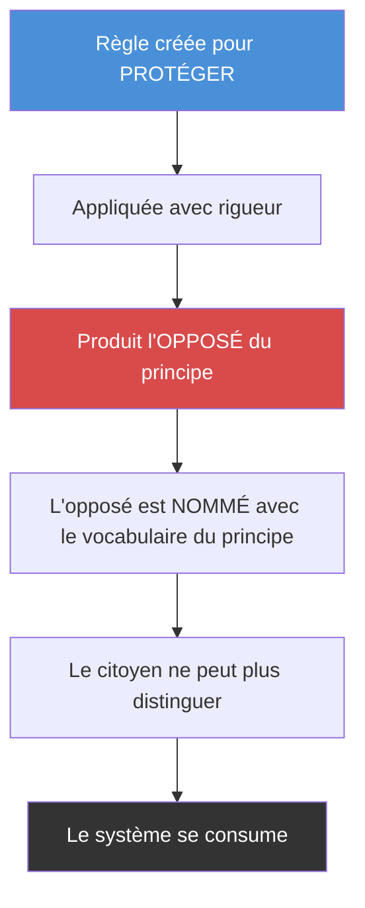
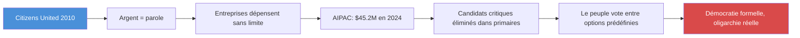
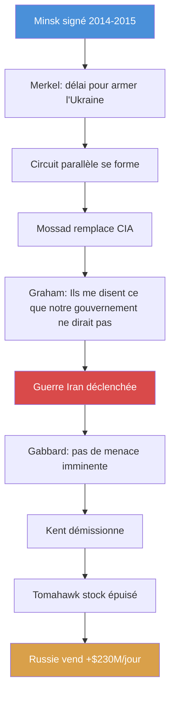
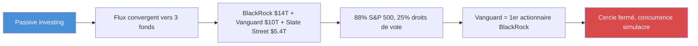
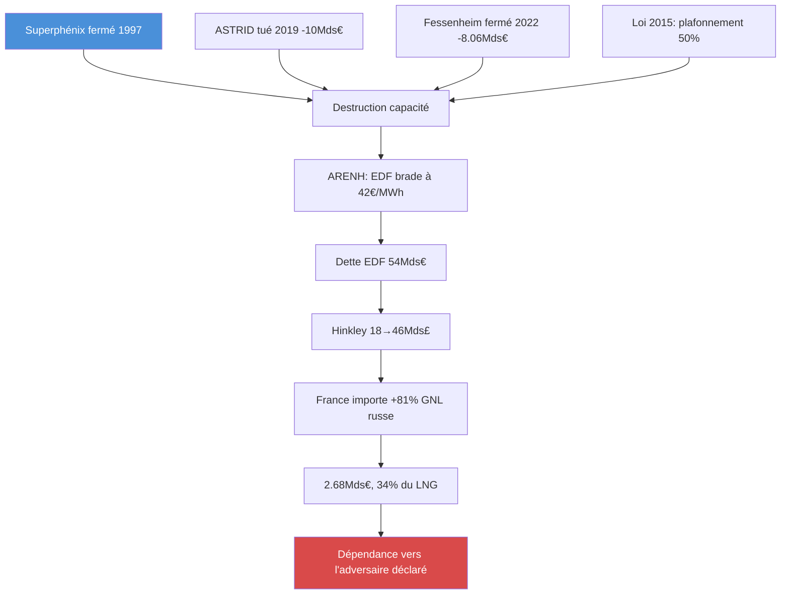
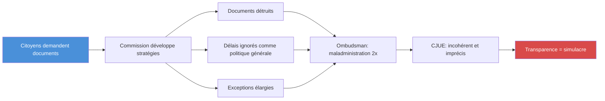
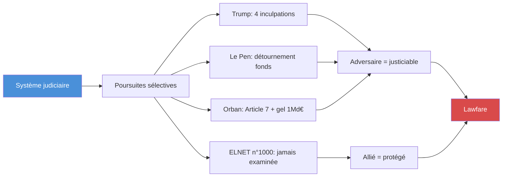
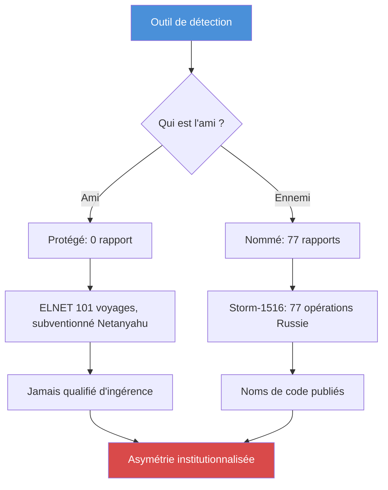

# Pousser les règles jusqu'à la casse

**Comment les lois, institutions et mécanismes de l'Occident deviennent des armes quand on les pousse à leur limite**

*29 mars 2026*

---

Chaque système a des règles. Chaque règle a une limite. Et à cette limite, la règle fait quelque chose qu'elle n'était pas censée faire.

Le droit de propriété devient censure. Le financement des campagnes devient achat d'élus. La dissuasion devient provocation. La transparence devient piège. Le marché libre devient monopole. La souveraineté énergétique devient dépendance. La justice devient arme. L'ingérence devient discrimination.

Ce qui suit n'est pas une analyse philosophique. C'est un **inventaire tactique** des règles du système occidental, de leur limite, et de ce qui se passe exactement quand on les pousse jusqu'au bout — ou qu'on les retourne contre le système qui les a créées.

---

## Vue d'ensemble — Le mécanisme universel

---

## I. La liberté d'expression → la censure privée

### La règle

La liberté d'expression protège les citoyens contre la censure de l'État. Les plateformes numériques sont des entreprises privées. Elles ont le droit de fixer leurs conditions d'utilisation.

### Comment on la pousse à la limite

- **2022** — Le DSA impose aux plateformes de modérer sous peine d'amendes de 6 % du chiffre d'affaires mondial
- **Décembre 2025** — X reçoit 120 millions d'euros d'amende. Message envoyé : la conformité est moins chère que la résistance
- **Juillet 2025** — La Commission judiciaire du Congrès américain révèle des « instructions confidentielles » de la Commission européenne aux plateformes pour censurer des contenus politiques ou satiriques — légaux
- **Septembre 2025** — Les « Twitter Files France » (57 pages) documentent un « complexe industriel de censure orchestré par l'État Macron »
- **Résultat** — 32,17 milliards de décisions de modération (sept 2023-mai 2025). 99,98 % relèvent des règles des plateformes, pas de la loi

### Le piège

L'État ne censure pas. Il OBLIGE l'entreprise à censurer. Le citoyen ne peut pas attaquer l'État (qui n'a rien censuré) ni l'entreprise (qui applique ses conditions). La liberté d'expression est intacte en théorie. En pratique, elle est morte.

---

## II. Le financement des campagnes → l'achat des élus

### La règle

La démocratie repose sur le suffrage universel. Le financement des campagnes est légal — c'est la « liberté de soutenir un candidat ».

### Comment on la pousse à la limite

**Aux États-Unis :**
- Citizens United v. FEC (2010) : l'argent est de la parole, les entreprises sont des personnes
- AIPAC dépense 45,2 millions de dollars en 2024 — le record absolu pour un lobby
- Mars 2026 : entre 12 et 20 millions dans les seules primaires de l'Illinois
- Les candidats qui critiquent Israël sont éliminés avant les élections générales

**En France :**
- ELNET finance 101 voyages parlementaires entre 2017 et 2024 (Mediapart)
- LR 39 voyages, Renaissance 32
- Le gouvernement Netanyahu subventionne ELNET
- Huit ans sans enregistrement au HATVP — malgré la loi Sapin 2
- Proposition de commission d'enquête n°1000 : jamais examinée

**Le 19 mars 2026**, OrientXXI révèle qu'ELNET est un **intermédiaire militaro-industriel** :
- Démonstrations « combat proven » pour généraux européens — sniping urbain, drones, véhicules d'infiltration
- Contrats facilités : 3,5 milliards de dollars Arrow 3 (Allemagne), 2 milliards d'euros Rafael (Roumanie), 2,5 milliards de dollars Spike (Allemagne)
- Le directeur d'IAI : « Ils ont signé environ une semaine avant le 7 octobre. Aujourd'hui, ils sont certains que c'est le meilleur système puisqu'il s'est avéré efficace sur le champ de bataille. »
- La guerre à Gaza est un **argument de vente**

---

## III. Les think-tanks → la manufacture du consentement

### La règle

Les think-tanks sont des organisations indépendantes qui fournissent des analyses aux décideurs.

### Comment on la pousse à la limite

- **115 millions d'euros** des États-Unis vers les think-tanks européens en 2023 (Follow the Money)
- Google : 2,7 millions d'euros à 12 think-tanks européens
- Microsoft et Meta : environ 2 millions chacun
- Bill Gates (Gates Foundation + Breakthrough Energy) : 64 millions d'euros
- Björn Seibert (chef de cabinet von der Leyen) consultait les think-tanks avant les discours SOTEU
- **700 réunions** entre think-tanks et Commission depuis 2019
- L'administration Trump exige que les organisations financées s'abstiennent d'activités liées au genre — « d'autres ont signé » (Fabian Zuleeg, CEO EPC)

### Le piège

Quand la Commission dit « nous consultons les experts », ces experts sont payés par BlackRock, Google et Bill Gates. Les think-tanks sont le **tube digestif** de l'élite financière : ils absorbent l'argent et excrètent des politiques publiques.

---

## IV. La dissuasion → la provocation

### La règle

L'OTAN garantit la paix par la dissuasion. « Si vis pacem, para bellum. »

### Comment on la pousse à la limite

- **Minsk** — Merkel (ZEIT, déc 2022) : « délai pour permettre à l'Ukraine de se renforcer ». Hollande confirme (Kyiv Independent, 2024). La paix était la préparation de la guerre
- **Circuit parallèle** — Le Mossad remplace la CIA comme source de renseignement sur l'Iran (WSJ, fév 2026). Le sénateur Graham a coaché Netanyahu sur la psychologie de Trump
- **Guerre sans menace** — Gabbard confirme sous serment : l'Iran ne préparait PAS d'attaque. Kent démissionne : « cette guerre a commencé à cause de la pression d'Israël »
- **Stocks épuisés** — « Centaines » de Tomahawk tirés, consommation « plus rapide que la reconstitution » (Reuters/CBS/WaPo, 27 mars 2026). Gerald Ford hors service 14 mois
- **L'adversaire s'enrichit** — Russie : +230 millions de dollars par jour sur le pétrole

### Le piège

La dissuasion consomme ses propres moyens. Stocks vides face à l'Iran = vulnérabilité face à la Chine. La guerre finance l'adversaire qu'elle prétend combattre.

---

## V. Le marché libre → le monopole

### La règle

La libre concurrence garantit l'efficacité. Les entreprises rivalisent, le consommateur bénéficie.

### Comment on la pousse à la limite

- **29 000 milliards de dollars** — plus que le PIB US + Japon
- **88 %** des entreprises du S&P 500 ont un des Big Three comme principal actionnaire
- **25 %** de tous les droits de vote des entreprises américaines
- Ownership combiné : General Mills 28,8 %, Clorox 26,3 %
- **Vanguard est le plus grand actionnaire de BlackRock** — le cercle est fermé
- Même les entreprises de défense, médias, pharma et tech sont possédées par les mêmes fonds

**Conséquence en France :**
- Neuf milliardaires contrôlent plus de 80 % des médias
- CEVIPOF vague 16 : « Vers une défiance politique totale ? »
- Le peuple élit des représentants qui représentent les fonds

**Procès :** Ken Paxton (AG Texas) poursuit les Big Three pour suppression de la production de charbon. Vanguard règle 29,5 millions de dollars (fév 2026). BlackRock et State Street continuent.

---

## VI. La souveraineté énergétique → la dépendance

### La règle

L'industrie nationale garantit la souveraineté. Le nucléaire français est un pilier stratégique.

### Comment on la pousse à la limite

- Voynet a admis avoir « sabordé le nucléaire français »
- Trois réacteurs détruits/tués
- Dette EDF : 54 milliards d'euros fin 2023
- Hinkley Point C : 12,9 milliards d'euros de dépréciation
- France : +81 % de GNL russe en 2024, 34 % de tout le gaz importé, 2,68 milliards d'euros
- Premier importateur européen de GNL russe

### Le piège

L'UE affirme 90 jours de réserves de pétrole. C'est le **minimum légal** — pas une marge. Le Japon détient 230 jours. Et ces réserves sont en pétrole, pas en gaz. Pour le gaz, zéro stock tampon. Quand la Russie devient l'ennemi, la France ne peut plus appliquer pleinement les sanctions.

---

## VII. La transparence → l'opacité

### La règle

Le règlement 1049/2001 donne le droit d'accès aux documents de l'UE.

### Comment on la pousse à la limite

- Documents détruits pour éviter la divulgation (EUobserver, mai 2025)
- Délais légaux ignorés « comme politique générale »
- Nouvelles règles de procédure élargissent les exceptions (décembre 2024)
- Ombudsman : maladministration confirmée janvier et novembre 2025
- CJUE (NYT v Commission) : explications « incohérentes et imprécises »
- La Commission considère le débat démocratique comme une « pression externe »

### Le piège

Plus la loi exige de transparence, plus l'institution développe d'opacité. Chaque obligation génère une stratégie d'évitement.

---

## VIII. La justice → l'arme

### La règle

Le rule of law protège également tous les citoyens. La justice est neutre.

### Comment on la pousse à la limite

- Trump : quatre inculpations
- Le Pen : détournement de fonds
- Orban : Article 7 UE et gel de plus d'un milliard d'euros
- Pologne sous Tusk : « Weaponizing Justice » (Institute of World Politics, 2025)
- Harvard Law Review (fév 2025) : « Fair Law or Lawfare? »
- Congress.gov : débat sur les « réformes législatives pour mettre fin au lawfare »

### Le piège

Chaque cas est légalement fondé pris isolément. Pris ensemble, ils forment un pattern. L'inaction est aussi un acte juridique : la proposition ELNET n°1000 n'a jamais été examinée. La loi Sapin 2 fonctionne comme un filet qui laisse passer les gros poissons.

---

## IX. La détection des ingérences → la discrimination

### La règle

Les démocraties détectent et combattent les ingérences étrangères.

### Comment on la pousse à la limite

- Viginum : **77 rapports** sur les ingérences russes — détaillés, nommés, publics
- ELNET : 101 voyages, subventionné par Netanyahu, « totale coordination » avec la Knesset — **jamais nommé** comme ingérence
- Chine : commissariats fantômes — sujet secondaire
- États-Unis : FISA 702, NSA espionne l'Élysée — normalisé
- **Le système ne détecte pas les ingérences — il détecte les ingérences utiles à détecter**

**Roumanie — Le précédent :**
- Décembre 2024 : élection présidentielle annulée — première fois en 35 ans
- Viginum qualifie le mode opératoire d'« aisément reproductible en France »
- Si l'algorithme peut « manipuler » un vote, alors tout vote peut être annulé
- La protection démocratique devient l'outil d'annulation démocratique

---

## Verdict — Le mécanisme universel

```mermaid
flowchart TD
    A[Liberté d'expression] --> A1[Censure 99.98%]
    B[Financement campagnes] --> B1[Élus achetés]
    C[Consultation experts] --> C1[Consentement fabriqué]
    D[Dissuasion] --> D1[Guerre déclenchée]
    E[Libre marché] --> E1[Monopole $29T]
    F[Souveraineté énergétique] --> F1[+81% GNL russe]
    G[Transparence] --> G1[Documents détruits]
    H[Rule of law] --> H1[Lawfare]
    I[Détection ingérences] --> I1[Discrimination]

    A1 --> Z[Système qui se consume]
    B1 --> Z
    C1 --> Z
    D1 --> Z
    E1 --> Z
    F1 --> Z
    G1 --> Z
    H1 --> Z
    I1 --> Z

    style A fill:#4a90d9,color:#fff
    style B fill:#4a90d9,color:#fff
    style C fill:#4a90d9,color:#fff
    style D fill:#4a90d9,color:#fff
    style E fill:#4a90d9,color:#fff
    style F fill:#4a90d9,color:#fff
    style G fill:#4a90d9,color:#fff
    style H fill:#4a90d9,color:#fff
    style I fill:#4a90d9,color:#fff
    style A1 fill:#d94a4a,color:#fff
    style B1 fill:#d94a4a,color:#fff
    style C1 fill:#d94a4a,color:#fff
    style D1 fill:#d94a4a,color:#fff
    style E1 fill:#d94a4a,color:#fff
    style F1 fill:#d94a4a,color:#fff
    style G1 fill:#d94a4a,color:#fff
    style H1 fill:#d94a4a,color:#fff
    style I1 fill:#d94a4a,color:#fff
    style Z fill:#333,color:#fff
```

**Le pattern est le même dans chaque cas :**

1. La règle est créée pour PROTÉGER un principe
2. La règle est APPLIQUÉE avec rigueur
3. L'application rigoureuse PRODUIT l'opposé du principe
4. L'opposé est NOMMÉ avec le vocabulaire du principe (la censure est « protection », l'achat est « démocratie », la guerre est « paix »)

> Le système ne s'effondre pas parce que ses règles sont violées. Il s'effondre parce que ses règles sont RESPECTÉES — poussées jusqu'à leur limite logique.

### La question tactique

Si vous voulez exploiter le système, ne le violez pas. **Appliquez ses règles.**

- Voulez-vous censurer ? Adoptez une loi « contre la désinformation ». Les plateformes feront le reste
- Voulez-vous acheter des élus ? Créez un PAC. L'argent est de la parole
- Voulez-vous fabriquer le consentement ? Financez des think-tanks. La Commission les consultera
- Voulez-vous déclencher une guerre ? Créez un circuit parallèle. Le renseignement officiel sera court-circuité
- Voulez-vous créer un monopole ? Encouragez le passive investing. Les fonds convergeront
- Voulez-vous rendre un pays dépendant ? Détruisez son industrie au nom de la « transition »
- Voulez-vous cacher des documents ? Publiez des règles de transparence. L'institution développera des stratégies d'évitement
- Voulez-vous éliminer un adversaire ? Utilisez la justice. Chaque cas sera légalement fondé
- Voulez-vous discriminer ? Créez un outil de détection des ingérences. Nommez les ennemis, protégez les amis

**Ce n'est pas de la fiction. Ce sont des faits documentés.** Et ils montrent que le système occidental est structurellement vulnérable à l'exploitation de ses propres règles — non pas par un ennemi extérieur, mais par quiconque comprend le mécanisme.

---

## Bibliographie

1. Commission judiciaire Congrès US — Instructions confidentielles Commission (juil 2025) — judiciary.house.gov
2. DSA Transparency Report — 32,17Mds décisions — transparency.ec.europa.eu
3. Kamanda — 99,98% modération = règles plateformes (2025)
4. Commission européenne — 120M€ amende X (déc 2025)
5. Civilization Works — Twitter Files France 57 pages (sept 2025)
6. Sludge / New Republic — AIPAC $45,2M 2024 (jan 2025) — newrepublic.com
7. Newsweek — AIPAC $12M Illinois (mars 2026) — newsweek.com
8. Mediapart — ELNET 101 voyages (2024) — mediapart.fr
9. OrientXXI — ELNET militaro-industriel (19 mars 2026) — orientxxi.info
10. Assemblée nationale — Proposition n°1000 jamais examinée (fév 2025)
11. Follow the Money — Think-tanks 115M€ US→EU (oct 2025) — ftm.eu
12. ZEIT — Merkel Minsk « délai » (déc 2022)
13. Kyiv Independent — Hollande confirme (2024)
14. WSJ — Circuit Mossad→Graham→Trump (fév 2026)
15. Gabbard sous serment — Iran pas de menace (2026)
16. Joe Kent — Démission (mars 2026)
17. Reuters / CBS / WaPo — Tomahawk stock épuisé (27 mars 2026) — reuters.com
18. SEC 13F — Ownership Big Three
19. produktinfo.dk — 88% S&P 500 — produktinfo.dk
20. Texas AG — Vanguard $29,5M (fév 2026)
21. CEVIPOF vague 16 — Défiance totale (mars 2025) — sciencespo.fr
22. Clairinvest — +81% GNL russe — clairinvest.com
23. EDF URD 2023 — Dette 54Mds€ — edf.fr
24. EU Ombudsman — Maladministration 2x (jan+nov 2025) — ombudsman.europa.eu
25. European Papers — NYT v Commission (2025)
26. EUobserver — Documents détruits (mai 2025) — euobserver.com
27. Viginum — 77 rapports Storm-1516 — sgdsn.gouv.fr
28. Viginum — « aisément reproductible en France » (fév 2025)
29. radiofrance.fr — Annulation élection Roumanie (déc 2024)
30. Institute of World Politics — Weaponizing Justice Pologne (sept 2025)
31. Harvard Law Review — Lawfare (fév 2025)
32. Voynet — « Sabordé le nucléaire français »
33. AA.com.tr — 90 jours réserves (mars 2026)
34. EU Commission — Pas de risque immédiat (4 mars 2026)
HEREDOC_END