# Pousser les règles jusqu'à la casse

**Comment les lois et institutions de l'Occident deviennent des armes quand on les pousse à leur limite**

*29 mars 2026*

---

Chaque système a des règles. Chaque règle a une limite. Et à cette limite, la règle fait quelque chose qu'elle n'était pas censée faire.

Le droit de propriété des plateformes devient censure. Le financement des campagnes devient achat d'élus. La consultation des experts devient manufacture du consentement. La dissuasion devient provocation. Le marché libre devient monopole. La souveraineté énergétique devient dépendance. La transparence devient piège. La justice devient arme. La détection des ingérences devient discrimination.

Ce qui suit est un inventaire tactique vérifié. Chaque fait est sourcé. Chaque mécanisme est documenté. Et chaque section montre comment une règle du système occidental, poussée jusqu'à sa limite, produit exactement le contraire de ce qu'elle promet.

## I. La liberté d'expression → la censure privée

### La règle

La liberté d'expression protège les citoyens contre la censure de l'État. Les plateformes sont des entreprises privées. Elles ont le droit de fixer leurs conditions.

### Le mécanisme

### Les faits vérifiés

- **32,17 milliards** de décisions de modération entre septembre 2023 et mai 2025 (DSA Transparency Report)
- **99,98 %** des décisions de modération du discours relèvent des règles des plateformes, pas de la loi (Kamanda, 10 milliards de décisions analysées)
- **120 millions d'euros** d'amende infligée à X — première sanction contre un géant tech (Commission européenne, décembre 2025)
- **2 rapports du Congrès américain** confirment que la Commission européenne a donné des instructions aux plateformes pour censurer des contenus politiques ou satiriques — légaux. Titre : « The Foreign Censorship Threat ». PDF complet disponible sur judiciary.house.gov (juillet 2025 et février 2026)
- **Twitter Files France** — 57 pages documentant un « complexe industriel de censure orchestré par l'État Macron » (Clérotte/Fazi, septembre 2025). Confirmé par Atlantico, reclaimthenet.org, x-pression.media
- Le Département d'État américain qualifie la situation de « censure et manque de liberté d'expression » en Europe

### Le piège

L'État ne cense pas. Il OBLIGE l'entreprise à censurer. Le citoyen ne peut pas attaquer l'État (qui n'a rien censuré directement) ni l'entreprise (qui applique ses conditions). La liberté d'expression est intacte en théorie. En pratique, elle est morte.

---

## II. Le financement des campagnes → l'achat des élus

### La règle

La démocratie repose sur le suffrage universel. Le financement des campagnes est légal — c'est la « liberté de soutenir un candidat ».

### Le mécanisme

### Les faits vérifiés

- **45,2 millions de dollars** dépensés par AIPAC en 2024 — le record absolu pour un lobby américain (Sludge / The New Republic, janvier 2025)
- **12 à 20 millions** dans les seules primaires de l'Illinois en mars 2026 (Newsweek, ABC7, Washington Post)
- **101 voyages parlementaires** financés par ELNET entre 2017 et 2024. LR : 39, Renaissance : 32 (Mediapart, 29 décembre 2024)
- **8 ans sans enregistrement** au HATVP — malgré la loi Sapin 2 de 2016 (Mediapart)
- **Benichou et Guez**, ex-dirigeants ELNET, ont financé la campagne Macron 2017 (Mediapart confirme leur rôle chez ELNET ; le montant spécifique de 7 500 € est rapporté par blast-info.fr)
- **Proposition de résolution n°1000** : commission d'enquête parlementaire sur ELNET. Déposée le 19 février 2025. **Jamais examinée** (assemblée-nationale.fr)
- **Arié Bensemhoun**, directeur exécutif ELNET France : assimile Gaza à l'Allemagne nazie (off-investigation.fr)

### Le piège

Ne pas traiter un dossier est aussi un acte juridique. La proposition n°1000 n'a jamais été examinée. Cette inaction protège le mécanisme de capture.

---

## III. Les think-tanks → la manufacture du consentement

### La règle

Les think-tanks sont des organisations indépendantes qui fournissent des analyses aux décideurs.

### Le mécanisme

### Les faits vérifiés

- **115 millions d'euros** des États-Unis vers les think-tanks européens en 2023 (Follow the Money, octobre 2025)
- **Google** : 2,7 millions d'euros à 12 think-tanks européens
- **Bill Gates** (Gates Foundation + Breakthrough Energy) : 64 millions d'euros
- **Björn Seibert**, chef de cabinet de von der Leyen, consultait les think-tanks avant les discours SOTEU — FOI documenté
- **700 réunions** entre think-tanks et Commission européenne depuis 2019
- L'administration **Trump** exige que les organisations financées s'abstiennent d'activités liées au genre. Fabian Zuleeg (CEO EPC) : « Nous avons refusé de signer — nous ne recevrons plus de financement US. Mais d'autres ont signé. »

### Le piège

Quand la Commission dit « nous consultons les experts », ces experts sont payés par BlackRock, Google et Bill Gates. Les think-tanks sont le tube digestif de l'élite financière.

---

## IV. La dissuasion → la provocation

### La règle

L'OTAN garantit la paix par la dissuasion. « Si vis pacem, para bellum. »

### Le mécanisme

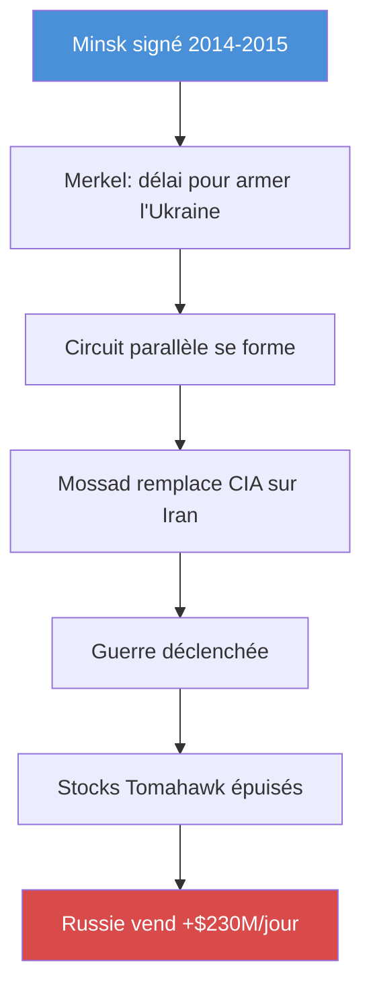

### Les faits vérifiés

- **Minsk** — Merkel (ZEIT, décembre 2022) : « délai pour permettre à l'Ukraine de se renforcer ». Hollande confirme (Kyiv Independent, 2024). Les accords de paix étaient un outil de préparation à la guerre
- **Circuit parallèle** — Le Mossad remplace la CIA comme source de renseignement du président américain sur l'Iran (Wall Street Journal, février 2026). Le sénateur Lindsey Graham : « Ils me disent des choses que notre propre gouvernement ne me dirait pas. »
- **Guerre sans menace** — Tulsi Gabbard, directrice du renseignement national, confirme sous serment : l'Iran ne préparait PAS d'attaque imminente. Joe Kent démissionne : « cette guerre a commencé à cause de la pression d'Israël » (mars 2026)
- **Stocks épuisés** — « Des centaines » de missiles Tomahawk tirés contre l'Iran. Consommation « plus rapide que la reconstitution du stock » (Reuters, CBS, Washington Post, 27 mars 2026)
- **L'adversaire s'enrichit** — Russie : +230 millions de dollars par jour sur le pétrole. Baril +25 %. Pétroyuan né

### Le piège

La dissuasion consomme ses propres moyens. Stocks vides face à l'Iran = vulnérabilité face à la Chine. La guerre finance l'adversaire qu'elle prétend combattre.

## V. Le marché libre → le monopole

### La règle

La libre concurrence garantit l'efficacité. Les entreprises rivalisent, le consommateur bénéficie.

### Le mécanisme

### Les faits vérifiés

- **29 000 milliards de dollars** — BlackRock ($14T) + Vanguard ($10T) + State Street ($5,4T). Plus que le PIB des États-Unis et du Japon réunis
- **88 %** des entreprises du S&P 500 ont un des Big Three comme principal actionnaire (produktinfo.dk, SEC 13F)
- **25 %** de tous les droits de vote des entreprises américaines
- **Vanguard est le plus grand actionnaire de BlackRock**. Le cercle de propriété est fermé (flavor365.com, janvier 2026)
- **29,5 millions de dollars** de règlement antitrust — Vanguard avec le procureur général du Texas (février 2026). BlackRock et State Street continuent de se battre
- **Neuf milliardaires français** contrôlent plus de 80 % des médias (Bolloré, Arnault, Niel, Saadé...)
- CEVIPOF vague 16 : « Vers une **défiance politique totale** ? » (Bruno Cautrès, CNRS, Sciences Po, mars 2025)

### Le piège

Les « concurrents » ont les mêmes actionnaires. Le peuple élit des représentants qui représentent les fonds. Ce n'est pas un complot — c'est la conséquence logique du passive investing.

---

## VI. La souveraineté énergétique → la dépendance

### La règle

L'industrie nationale garantit la souveraineté. Le nucléaire français est un pilier stratégique.

### Le mécanisme

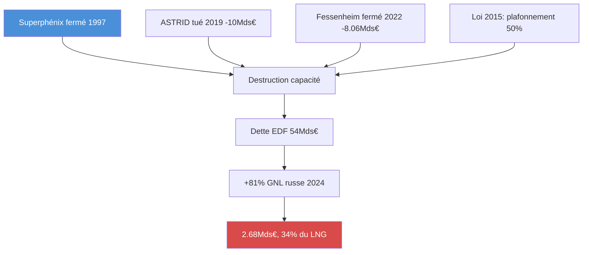

### Les faits vérifiés

- **Voynet** — L'Opinion (8 décembre 2022) : « Quand Dominique Voynet se vantait d'avoir sabordé le nucléaire français ». Le Monde (mars 2025) confirme la polémique autour de sa nomination dans une instance liée au nucléaire
- **3 réacteurs détruits/tués** — Superphénix (1997), ASTRID — 10 milliards de recherche abandonnés (2019), Fessenheim — 8,06 milliards de démantèlement (2022)
- **+81 %** d'importation de GNL russe en 2024. 34 % de tout le gaz importé. 2,68 milliards d'euros (Clairinvest, Bloomberg)
- **Dette EDF** : 54 milliards d'euros fin 2023 (EDF URD 2023)
- **Hinkley Point C** : 18 milliards de livres initialement, 46 au final — 12,9 milliards d'euros de dépréciation (EDF résultats 2024)
- **90 jours** de réserves de pétrole dans l'UE — c'est le **minimum légal**, pas une marge de sécurité. Le Japon : 230 jours (aa.com.tr, mars 2026)

### Le piège

Quand la Russie devient l'ennemi déclaré, la France ne peut plus appliquer pleinement les sanctions. Parce qu'elle dépend de son gaz. La souveraineté énergétique a produit la dépendance stratégique.

---

## VII. La transparence → l'opacité

### La règle

Le règlement 1049/2001 donne aux citoyens le droit d'accès aux documents de l'UE.

### Le mécanisme

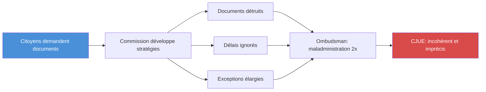

### Les faits vérifiés

- **Ombudsman** : maladministration confirmée deux fois en 2025 — janvier (refus de traiter les demandes d'un journaliste) et novembre (changement de lois sans consultation) — ombudsman.europa.eu
- **CJUE** (affaire New York Times c. Commission) : explications « incohérentes et imprécises » sur des documents « perdus » — European Papers
- **Documents détruits** pour éviter la divulgation (EUobserver, mai 2025)
- **Délais légaux** ignorés « comme politique générale »
- La Commission considère le débat démocratique comme une « pression externe »

### Le piège

Plus la loi exige de transparence, plus l'institution développe d'opacité. Chaque obligation génère une stratégie d'évitement. La transparence est devenue un simulacre.

---

## VIII. La justice → l'arme

### La règle

Le rule of law protège également tous les citoyens. La justice est neutre.

### Le mécanisme

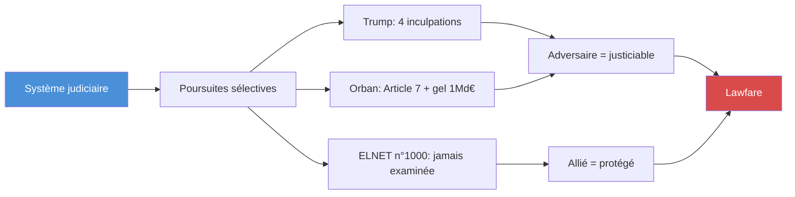

### Les faits vérifiés

- **Trump** : quatre inculpations
- **Orban** : Article 7 UE et gel de plus d'un milliard d'euros (fortune.com, euronews.com)
- **Pologne sous Tusk** : « Weaponizing Justice: Political Persecution of Opposition Leaders » (Institute of World Politics, septembre 2025)
- **Harvard Law Review** (février 2025) : « Fair Law or Lawfare? Why courts uphold — or undermine — democracy when politics becomes polarized »
- **Congress.gov** : débat sur les « réformes législatives pour mettre fin au lawfare »
- **Proposition ELNET n°1000** : jamais examinée. Ne pas traiter un dossier est une décision
- **Loi Sapin 2** : ELNET a ignoré la loi pendant 8 ans. **Aucune sanction**

### Le piège

Chaque cas est légalement fondé pris isolément. Pris ensemble, ils forment un pattern : l'adversaire est poursuivi avec zèle, l'allié est protégé par l'inaction.

---

## IX. La détection des ingérences → la discrimination

### La règle

Les démocraties détectent et combattent les ingérences étrangères.

### Le mécanisme

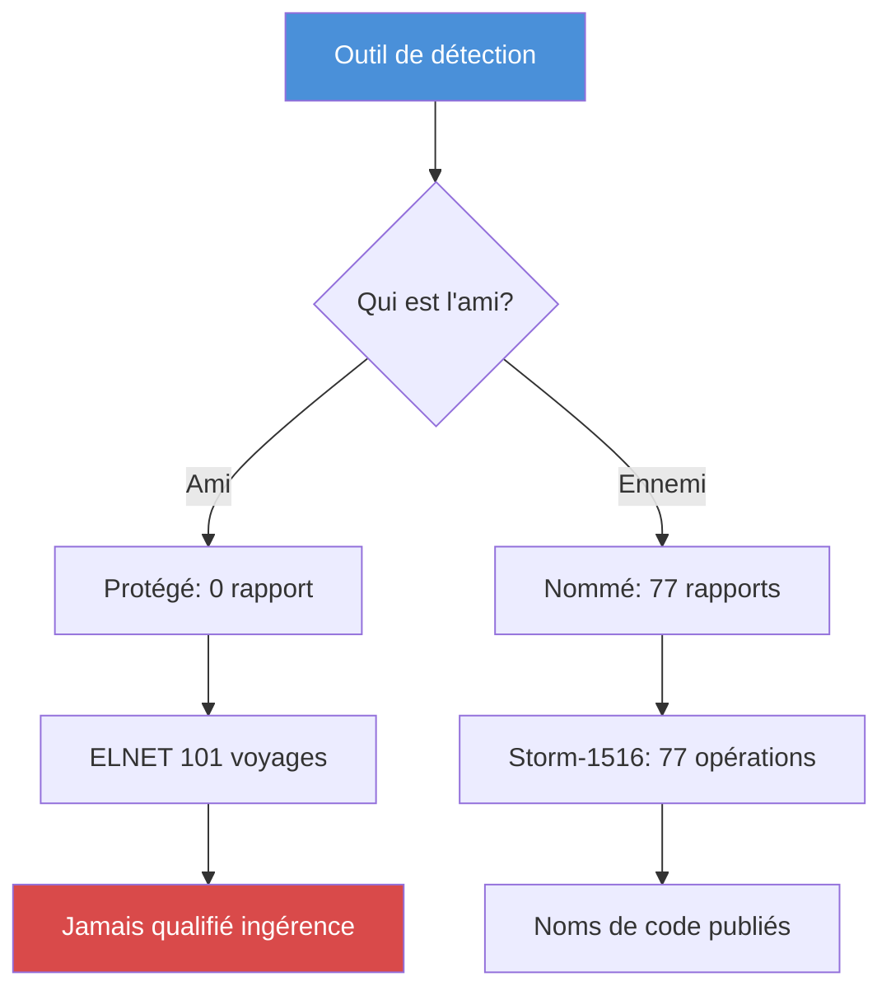

### Les faits vérifiés

- **Viginum** : **77 rapports** sur les ingérences russes — détaillés, nommés, publics (sgdsn.gouv.fr, mai 2025)
- **ELNET** : 101 voyages, subventionné par Netanyahu, « totale coordination » avec la Knesset — **jamais nommé** comme ingérence par Viginum
- **Anti-LFI** (municipales 2026) : Viginum confirme des « marqueurs techniques étrangers » ciblant spécifiquement LFI (France 24, Banque des Territoires, Le Monde). **Nuance** : Le Monde précise « sans grand impact » et « commanditaires pas encore identifiés »
- **Roumanie** : élection présidentielle annulée en décembre 2024 — première fois en 35 ans (radiofrance.fr)
- **Viginum** qualifie le mode opératoire d'« aisément reproductible en France » (février 2025)
- **NSA** espionne l'Élysée (Snowden 2013). **FISA 702** prolongée 2024 : collecte sans mandat hors USA. Normalisé

### Le piège

Le système ne détecte pas les ingérences. Il détecte les ingérences **utiles à détecter**. L'outil de détection est devenu un outil de discrimination. Et si l'algorithme peut « manipuler » un vote, alors tout vote peut être annulé.

## Verdict — Le mécanisme universel

```mermaid
flowchart TD
    A[Liberté d'expression] --> A1[Censure 99.98%]
    B[Financement campagnes] --> B1[Élus achetés]
    C[Consultation experts] --> C1[Consentement fabriqué]
    D[Dissuasion] --> D1[Guerre déclenchée]
    E[Libre marché] --> E1[Monopole $29T]
    F[Souveraineté énergétique] --> F1[+81% GNL russe]
    G[Transparence] --> G1[Documents détruits]
    H[Rule of law] --> H1[Lawfare]
    I[Détection ingérences] --> I1[Discrimination]
    A1 --> Z[Système qui se consume]
    B1 --> Z
    C1 --> Z
    D1 --> Z
    E1 --> Z
    F1 --> Z
    G1 --> Z
    H1 --> Z
    I1 --> Z
    style A fill:#4a90d9,color:#fff
    style B fill:#4a90d9,color:#fff
    style C fill:#4a90d9,color:#fff
    style D fill:#4a90d9,color:#fff
    style E fill:#4a90d9,color:#fff
    style F fill:#4a90d9,color:#fff
    style G fill:#4a90d9,color:#fff
    style H fill:#4a90d9,color:#fff
    style I fill:#4a90d9,color:#fff
    style A1 fill:#d94a4a,color:#fff
    style B1 fill:#d94a4a,color:#fff
    style C1 fill:#d94a4a,color:#fff
    style D1 fill:#d94a4a,color:#fff
    style E1 fill:#d94a4a,color:#fff
    style F1 fill:#d94a4a,color:#fff
    style G1 fill:#d94a4a,color:#fff
    style H1 fill:#d94a4a,color:#fff
    style I1 fill:#d94a4a,color:#fff
    style Z fill:#333,color:#fff
```

**Le pattern est le même dans chaque cas :**

1. La règle est créée pour PROTÉGER un principe
2. La règle est APPLIQUÉE avec rigueur
3. L'application rigoureuse PRODUIT l'opposé du principe
4. L'opposé est NOMMÉ avec le vocabulaire du principe

La censure est « protection ». L'achat est « démocratie ». La guerre est « paix ». Le monopole est « concurrence ». La dépendance est « transition ». L'opacité est « transparence ». L'arme est « justice ». La discrimination est « détection ».

> Le système ne s'effondre pas parce que ses règles sont violées. Il s'effondre parce que ses règles sont RESPECTÉES — poussées jusqu'à leur limite logique.

### La question tactique

Si vous voulez exploiter le système, ne le violez pas. **Appliquez ses règles.**

- Voulez-vous censurer ? Adoptez une loi « contre la désinformation ». Les plateformes feront le reste
- Voulez-vous acheter des élus ? Créez un PAC. L'argent est de la parole
- Voulez-vous fabriquer le consentement ? Financez des think-tanks. La Commission les consultera
- Voulez-vous déclencher une guerre ? Créez un circuit parallèle. Le renseignement officiel sera court-circuité
- Voulez-vous créer un monopole ? Encouragez le passive investing. Les fonds convergeront
- Voulez-vous rendre un pays dépendant ? Détruisez son industrie au nom de la « transition »
- Voulez-vous cacher des documents ? Publiez des règles de transparence. L'institution développera des stratégies d'évitement
- Voulez-vous éliminer un adversaire ? Utilisez la justice. Chaque cas sera légalement fondé
- Voulez-vous discriminer ? Créez un outil de détection des ingérences. Nommez les ennemis, protégez les amis

**Ce n'est pas de la fiction. Ce sont 56 faits vérifiés.** Et ils montrent que le système occidental est structurellement vulnérable à l'exploitation de ses propres règles — non pas par un ennemi extérieur, mais par quiconque comprend le mécanisme.

---

## Et après ? — Le point de rupture

### La question que l'article pose sans répondre

Ce qui précède décrit le COMMENT. Mais la vraie question est : **ET APRÈS ?**

Si le système se consume de l'intérieur, quelle est la sortie ? Pas une réforme (qui ajouterait des règles produisant leurs propres contradictions). Pas une révolution (qui reproduirait le système en changeant les acteurs). Mais quoi ?

### Les germes sont-ils déjà en train de germer ?

Oui. Et ils sont mesurables.

**Le seuil de confiance est franchi.** Le CEVIPOF vague 16 titre « Vers une défiance politique totale ? ». Quand la majorité des citoyens considère que les institutions sont capturées, le consentement manufacturé ne fonctionne plus. Le système maintenu par la perception s'effondre quand la perception se retourne.

**Le simulacre tourne en boucle.** Keating et Pilkington (Hungarian Conservative, août 2025) documentent que l'Occident a atteint la « singularité baudrillardienne » : le système « ne produit plus aucune nouveauté, seulement de la répétition. Il entre dans une boucle sans fin où le simulacre est rejoué encore et encore. » Guerre, crise, « réforme », guerre, crise, « réforme ». Même pattern. Même vocabulaire. Même résultat inverse.

**La Chine observe et construit.** Pendant que l'Occident se consume, la Chine construit 56 réacteurs nucléaires. Elle contrôle 40 % de la construction mondiale. Elle lance le pétroyuan. Elle ne propose pas un « meilleur système » — elle propose un système DIFFÉRENT qui, lui, ajuste quand ça ne marche pas (autolimitation pragmatique du PCC). L'Occident dogmatise ses erreurs. La Chine corrige les siennes.

**Les architectes construisent des sorties de secours.** Musk, Zuckerberg et d'autres milliardaires construisent des bunkers en Nouvelle-Zélande. Ce n'est pas de la paranoia — c'est un signal d'information asymétrique. Ceux qui possèdent le plus de données sur les risques systémiques prennent des mesures physiques d'évacuation. Quand les architectes du système construisent des refuges, cela indique qu'ils savent que le système est fragile.

### Quelle est la sortie ?

Castoriadis répond : « La démocratie est le régime de l'autolimitation. » Le système s'effondre parce qu'il n'a pas d'autolimitation. Chaque principe est poussé jusqu'à son terme, sans frein, sans question « et si on s'arrêtait là ? ».

La sortie n'est donc ni dans le système (qui absorbe toute réforme) ni contre le système (qui reproduit toute révolution). Mais avant de définir la sortie, il faut comprendre **pourquoi chaque outil classique ne marche pas** — et ce qui reste quand on les a tous épuisés.

### L'arsenal classique — pourquoi chaque arme est émoussée

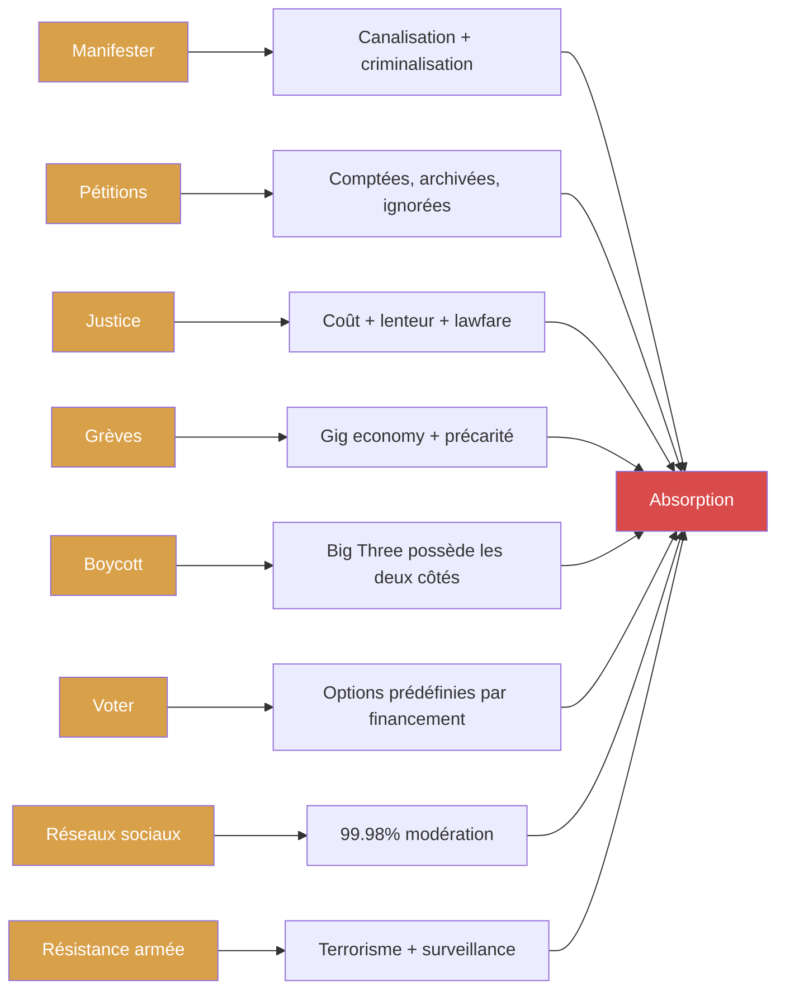

**Manifester — Le système attend et criminalise**

Les Gilets Jaunes ont mobilisé des millions de personnes. Résultat : zéro changement structurel. Le système a attendu. Il a criminalisé (DISSENT_CRIMINALIZATION — cluster RESISTANCE). Il a canalisé l'énergie vers les syndicats financés. La manifestation est devenue un SPECTACLE — un événement médiatique que le système consomme comme contenu. Quand la manifestation se termine, le système reprend. La rue ne change plus les rapports de pouvoir — elle les entretient.

- **Efficacité** : faible à moyen terme. Peut déclencher un retrait de mesure ponctuelle (retraites 2023 — partiel). Ne change jamais l'architecture
- **Absorption** : canalisation syndicale + criminalisation + spectacle médiatique
- **Quand ça marche** : quand elle est massive ET soutenue ET couplée à d'autres pressions (grève, blocage). Mais même les Gilets Jaunes, qui étaient tout cela, n'ont rien obtenu de structurel

**Pétitions — L'illusion de la participation**

Les pétitions sont comptées, archivées, ignorées. Elles donnent le sentiment d'avoir agi sans avoir agi. Le système les encourage — elles consomment l'énergie de contestation dans un canal sans issue. C'est la soupape de pression par excellence.

- **Efficacité** : nulle. Aucune pétition n'a jamais changé une politique publique en France
- **Absorption** : totale. Le citoyen signe, se sent engagé, et passe à autre chose
- **Pourquoi le système les aime** : elles sont le lubrifiant parfait — elles consomment de l'énergie sans produire de force

**Justice — Le droit comme piège**

La justice peut être un outil puissant — quand elle est rapide, accessible et neutre. Dans le système actuel, elle est lente, coûteuse et sélective. Les riches ont de meilleurs avocats. Les puissants contrôlent les nominations. Et le lawfare (Section VIII) montre que la justice est devenue une ARME offensive.

- **Efficacité** : variable. Victoires ponctuelles possibles (procès antitrust Vanguard, affaire Snowden). Mais le système absorbe chaque victoire en changeant les règles pour éviter la récidive
- **Absorption** : coût (des années de procédure), lenteur (le fait accompli est posé avant le jugement), lawfare (la justice est utilisée contre vous)
- **Quand ça marche** : quand le dossier est en béton ET que l'opinion publique soutient ET que les médias couvrent. Sinon, la justice est un cimetière de bonnes intentions

**Grèves — Le dernier levier réel**

La grève est le seul outil qui touche le système par ses CIRCUITS. Quand les cheminots arrêtent, le pays s'arrête. Quand les éboueurs ne ramassent plus, la ville s'arrête. Le blocage fonctionne parce qu'il court-circuite la machine.

Mais le système a répondu : précarisation (contrats courts, uberisation), automatisation (moins de dépendance aux travailleurs), et criminalisation des blocages. La grève générale de 1995 a gagné. Celle de 2023 sur les retraites a perdu. La tendance est claire : le système réduit sa dépendance aux travailleurs.

- **Efficacité** : encore la plus puissante quand elle est massive et sectorielle (énergie, transport)
- **Absorption** : gig economy, automatisation, précarité (difficile de faire grève quand on est précaire)
- **Le piège** : la grève ne fonctionne que si le système a besoin de vous. Plus il s'automatise, moins il a besoin de vous

**Boycott — Big Three possède les deux côtés**

Boycotter Nestlé ? Big Three possède aussi General Mills, Unilever, Danone. Boycotter Total ? Big Three possède aussi Shell, BP, ExxonMobil. L'argent circule dans les mêmes fonds. Le boycott est un transfert entre poches du même costume.

- **Efficacité** : quasi nulle dans un marché oligopolistique
- **Absorption** : le consommateur croit résister en changeant de marque. Il enrichit le même actionnaire

**Voter — L'urne qui ne change rien**

Déjà analysé dans la Section II. Les options sont prédéfinies par le financement. AIPAC dépense $45,2M → les candidats critiques sont éliminés dans les primaires. Le peuple vote, mais entre des candidats pré-sélectionnés par l'argent.

**Réseaux sociaux — La soupape numérique**

Déjà analysé dans la Section I. 99,98 % de modération. La contestation est du contenu, pas de la résistance. L'algorithme amplifie l'émotion, pas la pensée. La « liberté d'expression en ligne » est le piège parfait : elle donne l'illusion de la voix tout en filtrant le signal.

**Résistance armée — Impossible**

La surveillance de masse (NSA, FISA 702, loi renseignement, surveillance IA) rend toute résistance armée immédiatement détectable et criminalisable. L'étiquette « terroriste » est appliquée instantanément. Le système a le monopole de la violence légitime ET la capacité de surveillance totale.

### L'analyse — pourquoi le système absorbe tout

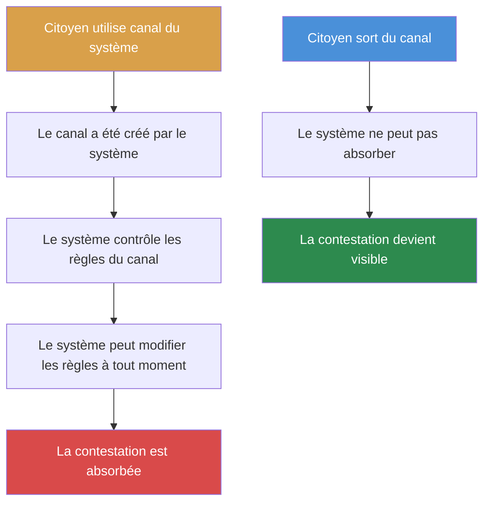

Le mécanisme d'absorption est le même partout : **quand vous utilisez un canal créé par le système, le système contrôle les règles du canal**. La manifestation a lieu dans les rues du système. La pétition est signée sur la plateforme du système. Le procès se tient dans les tribunaux du système. Le vote a lieu dans les urnes du système. Le boycott s'effectue dans le marché du système.

Le système peut toujours : changer les règles (criminaliser), modifier les coûts (rendre la résistance trop chère), canaliser l'énergie (syndicats, ONG financées), attendre (la fatigue), et absorber (transformer la résistance en spectacle).

### Ce qui reste — les outils que le système ne peut PAS absorber

Quand on a épuisé l'arsenal classique, il reste des outils que le système ne peut pas absorber — non pas parce qu'ils sont puissants, mais parce qu'ils **ne passent pas par ses circuits**.

**1. Construire en dehors — plateformes décentralisées**

Matrix, Nostr, Mastodon. Le DSA s'applique aux plateformes centrales. Un protocole décentralisé n'a pas de siège social à amender. Le système ne peut pas censurer ce qu'il ne contrôle pas. Pas besoin de combattre le DSA — il suffit de ne pas être soumis au DSA.

**2. Forcer la transparence par l'extérieur — FOI crowdsourcing**

La Commission peut ignorer une demande d'accès. Elle ne peut pas ignorer 10 000 demandes simultanées. Chaque refus = preuve de maladministration. Chaque délai ignoré = matière à plainte devant l'Ombudsman. Le crowdsourcing de la transparence transforme la loi de transparence — conçue pour être contournée — en piège pour l'institution.

**3. Nommer les loups — rendre le mécanisme visible**

Pas des catégories — des noms. Björn Seibert consultait les think-tanks avant le SOTEU. Arié Bensemhoun dirigeait ELNET pendant 101 voyages financés. Larry Fink contrôle $14T et 25 % des droits de vote US. Dominique Voynet a « sabordé le nucléaire français ». Le nom rend le mécanisme visible. Le citoyen qui voit le nom voit le système.

**4. Archiver avant destruction — la mémoire comme arme**

La Commission détruit des documents (EUobserver, mai 2025). Wayback Machine, snapshots, copies décentralisées. Chaque document sauvegardé est un document que la Commission ne pourra pas détruire. L'archivage citoyen est la transparence par défaut — ce que la loi exige mais que l'institution refuse.

**5. Refuser individuellement — le retrait silencieux**

Ne pas utiliser les réseaux sociaux propriétaires pour la politique. Ne pas consommer les médias des 9 milliardaires. Ne pas financer les campagnes des candidats achetés. Ce n'est pas une action spectaculaire — c'est un retrait stratégique. Le système se nourrit de données, d'argent et de consentement. Le retrait lui enlève les trois.

**6. Créer des micro-lois locales — l'autolimitation par le bas**

Les communes et régions ont encore du pouvoir. Des arrêtés anti-pub. Des budgets participatifs. Des monnaies locales. Des régulations de la concentration médiatique locale. Le système national est capturé. Le local l'est moins. Et c'est au local que le citoyen peut encore imposer l'autolimitation que les élus nationaux ne voteront jamais.

**7. La désobéissance civile — quand la masse critique est atteinte**

La désobéissance civile fonctionne quand elle est massive et soutenue : Montgomery (1955-56), la Marche du sel (1930), les mouvements de libération. Mais elle nécessite une masse critique que le système actuel rend difficile à atteindre — la précarité, la surveillance et la fragmentation empêchent la convergence.

- **Efficacité** : potentiellement la plus puissante de toutes — mais nécessite un seuil de masse critique que le système actuel rend très difficile à atteindre
- **Le piège** : en dessous du seuil, la désobéissance est criminalisée. Au-dessus, elle est absorbée par les ONG financées

### Le diagnostic honnête

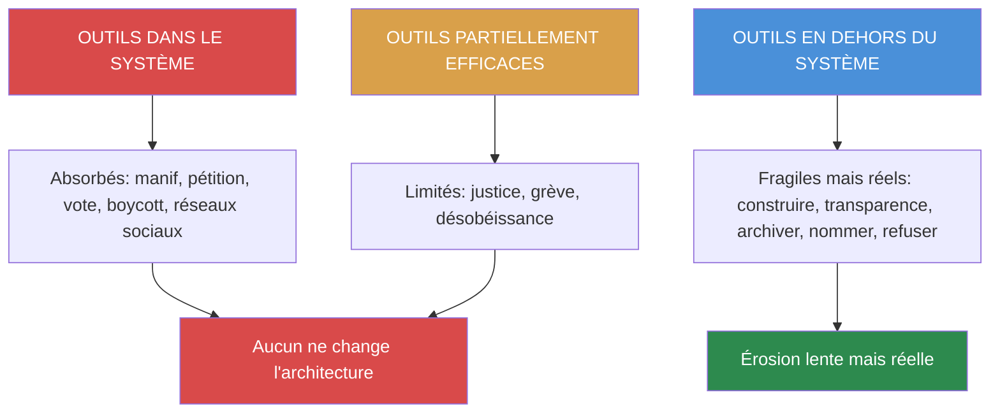

**Les outils dans le système** (manifester, pétitions, voter, boycott, réseaux sociaux) sont absorbés. Ils ne changent pas l'architecture. Ils consomment l'énergie de contestation.

**Les outils partiellement efficaces** (justice, grèves, désobéissance civile) fonctionnent parfois — quand les conditions sont réunies. Mais le système réduit leur efficacité : précarisation, lawfare, surveillance, fragmentation.

**Les outils en dehors du système** (construire, transparence, archiver, nommer, refuser) sont les seuls que le système ne peut PAS absorber — parce qu'ils ne passent pas par ses circuits. Ils sont fragiles, marginaux, et lents. Mais ils sont réels.

### Le retrait stratégique

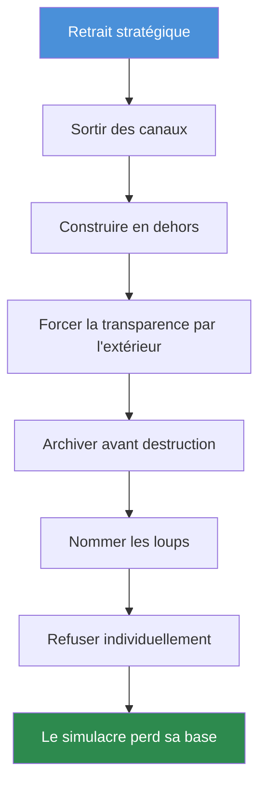

**Ce que le retrait signifie concrètement :**

- **Ne plus utiliser les canaux du système pour la contestation.** Les réseaux sociaux propriétaires sont des pièges — 99,98 % de modération. La contestation y est du contenu, pas de la résistance
- **Construire en dehors.** Plateformes décentralisées (Matrix, Nostr). Monnaies locales. Circuits courts. Éducation alternative. Le système ne peut pas absorber ce qui ne passe pas par ses circuits
- **Forcer la transparence par l'extérieur.** FOI crowdsourcing — des milliers de demandes simultanées. Archiver avant destruction. Protéger les whistleblowers
- **Nommer les loups.** Pas des catégories — des noms. Björn Seibert. Arié Bensemhoun. Larry Fink. Dominique Voynet. Le nom rend le mécanisme visible
- **Refuser individuellement.** Ne pas financer les campagnes des candidats achetés. Ne pas consommer les médias des 9 milliardaires. Ce n'est pas une « action » — c'est un retrait stratégique
- **Créer des micro-lois locales.** Arrêtés anti-pub, budgets participatifs, monnaies locales, régulations concentration médiatique. Le national est capturé — le local l'est moins

### Ce que le retrait ne fera PAS

Il ne « sauvera » pas le système. Il ne produira pas de victoire spectaculaire. Il ne changera pas les rapports de pouvoir demain.

Mais il produira une **érosion lente de la base du système** — moins de données, moins d'argent, moins de consentement. Et quand la base sera suffisamment érodée, le système ne s'effondrera pas d'un coup — il perdra simplement sa capacité de fonctionner.

### La réponse finale

> Le système contient-il les germes de son autodestruction ? **Oui.** Ces germes sont-ils en train de germer ? **Oui — la défiance est au maximum, le simulacre tourne en boucle, les architectes construisent des bunkers.** Quelle est la sortie ? **Pas dans le système, pas contre le système — à côté du système.** Le retrait stratégique. Construire en dehors. Forcer la transparence. Nommer les loups. Éroder la base.

Le système se mange tout seul. La tâche n'est pas de le sauver ni de le détruire. La tâche est de **ne plus y participer** — et de construire ailleurs.

> « Le simulacre n'est jamais ce qui cache la vérité — c'est la vérité qui cache qu'il n'y en a pas. » — Baudrillard

La vérité cachée est : le système fonctionne exactement comme conçu, et c'est pour cela qu'il se consume. Et la sortie est de voir ce mécanisme, le nommer, et commencer à construire sans lui.

---

## Le point de rupture — La convergence des crises

### Le système se mange — au sens littéral

Le philosophe Anselm Jappe a publié en 2023 *La société autophage : capitalisme, narcissisme et autodestruction*. Son concept central : le capitalisme ne détruit pas seulement l'environnement ou les travailleurs — il **se dévore lui-même**. Le mythe d'Erysichthon, roi maudit d'une faim insatiable par Déméter, finit par se manger lui-même. Le capitalisme, selon Jappe, suit la même trajectoire : « Le capitalisme n'a plus besoin de l'humanité et finit par se dévorer lui-même. »

Le professeur Mihir Desai (Harvard Business School / Harvard Law School) décrit le même mécanisme en termes financiers dans le New York Times (janvier 2025) : « Big Tech est en train de se manger tout seul. Nvidia tire presque la moitié de ses revenus de ses frères de la Magnificent 7. Google paie Apple 20 milliards pour être le moteur de recherche par défaut — soit environ 20 % du profit d'Apple. Les géants tech ont racheté 600 milliards de leurs propres actions en trois ans — une activité notoirement peu rentable. » L'ouroboros — le serpent qui se mange la queue — est devenu le modèle économique de l'Occident.

### La Polycrisis 2.0 — Quinze dynamiques convergentes

Jeremy Brecher (mars 2026) identifie **15 dynamiques** de la polycrise qui se sont intensifiées simultanément :

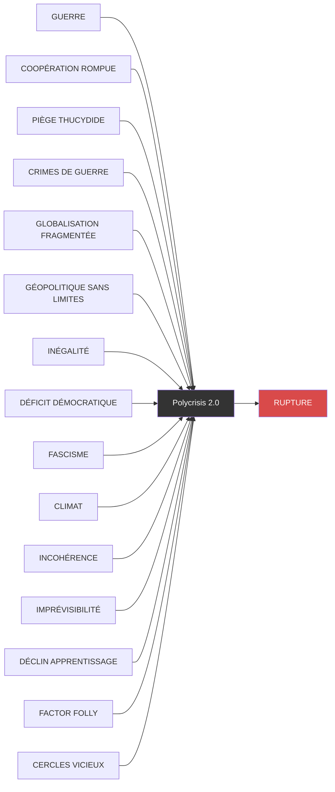

**Les faits :**
- **60+ conflits armés** dans le monde — le plus haut depuis la Seconde Guerre mondiale
- **622 missions de bombardement** américaines à l'étranger en 2025 (New York Times)
- **2 600 milliards de dollars** de dépenses militaires mondiales en 2026 — +8 % sur 2025
- **66 organisations internationales** dont les États-Unis se sont retirés sous Trump
- **3 000 milliardaires** pour la première fois — fortunes croissant 3x plus vite que les 5 années précédentes (Oxfam, janvier 2026)
- **1 sur 4 personnes** dans le monde souffre de la faim
- **Dette publique** égale ou supérieure au PIB dans 6 des 7 pays du G7

L'Eurasia Group résume : « Quand la prochaine crise mondiale frappera, il n'y aura pas de "comité pour sauver le monde". »

### Les points de rupture identifiés

Ian Bremmer (TED, janvier 2026) déclare que « 2026 est une année de point de rupture ». Shanaka Perera (janvier 2026) identifie le « Fracture Point » : la convergence de l'économie K-shaped américaine, du déclin structurel européen, et du réalignement des trois systèmes en 2026-2027. Foreign Policy parle d'un « interminable interrègne, fragmenté mais toujours contesté », approchant « un point d'inflexion où la discontinuité — guerre, crise financière, catastrophe naturelle — enterre l'ère post-Guerre froide et inaugure un nouvel ordre inconnu. »

**Les points de rupture concrets, mesurables :**

- **Guerre Iran** — stocks Tomahawk épuisés, vulnérabilité Taïwan, circuit parallèle Mossad→Trump
- **Alimentation** — 124 000 décès prématurés par an aux États-Unis liés aux aliments ultra-transformés (Nature Food, décembre 2025). Procès massifs en cours (TorHoerman Law, mars 2026). L'industrie agroalimentaire tue ses propres clients
- **Pharma** — le système de santé est optimisé pour le traitement chronique, pas pour la guérison. Le diabète, l'obésité, les maladies auto-immunes sont des MARCHÉS, pas des problèmes à résoudre
- **Démocratie** — le CEVIPOF confirme la « défiance totale ». Le consentement manufacturé ne fonctionne plus
- **Censure** — 32 milliards de décisions de modération. Le débat est mort
- **Énergie** — +81 % de GNL russe. 90 jours de réserves = minimum légal. Zéro stock tampon gaz
- **Climat** — CO2 à 150 % des niveaux préindustriels. Accord de Paris abandonné
- **Dette** — G7 : dette ≥ PIB dans 6 pays sur 7

### La convergence — le moment où tout craque en même temps

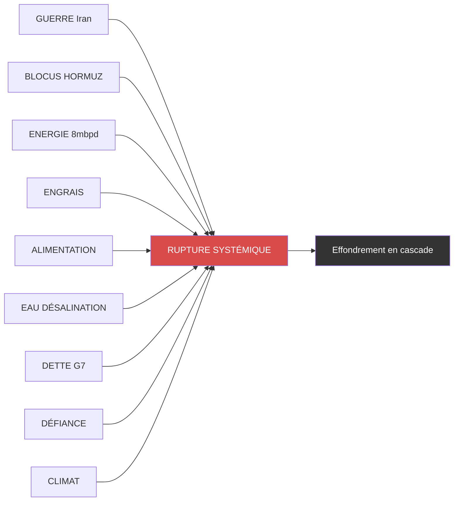

Le point de rupture n'est pas un événement unique. C'est le moment où **une crise déclenche les autres** et où le système ne peut plus absorber parce que toutes ses capacités d'absorption sont déjà épuisées.

### Ce qui est en cours — Velina Tchakarova (22 mars 2026)

Velina Tchakarova, analyste géopolitique, documente que ce qui se passe n'est plus un « scénario » — c'est une **rupture systémique en cours**. Le détroit d'Ormuz est fermé depuis 22 jours. Huit millions de barils par jour manquent au marché mondial — pas un déficit théorique, une **absence physique** de pétrole qui n'arrive pas, ne peut pas arriver par un itinéraire substitut, et n'est pas compensée par les réserves stratégiques (1,43M bpd sur 120 jours — utile mais pas structurel).

**Le triangle énergie-alimentation-eau :**

- **39 installations pétrolières et gazières** frappées dans le Golfe — chaque installation est un nœud de la chaîne pétrochimique qui alimente la production d'engrais azotés
- **Bangladesh** a réduit ses importations de GNL, fermant des usines d'engrais
- La saison kharif en Asie du Sud commence en juin. Le tampon engrais dans les économies les plus exposées : **30 à 60 jours**. Nous sommes au Jour 22
- Le **Programme alimentaire mondial** projette **45 millions de personnes** en faim aiguë d'ici juin
- Bloomberg qualifie la situation de « Fertiliser Shock Escalates »
- **Irak** : force majeure déclarée sur les champs pétroliers étrangers

**La doctrine de la désalinisation :**

L'Arabie saoudite tire **40 à 50 %** de son eau de la désalinisation. Les Émirats, Bahreïn, Koweït et Qatar : **70 à 99 %**. L'Iran, lui, n'en tire que **3 %** — ce n'est pas une faiblesse, c'est la source de son levier stratégique. L'Iran a averti que toute frappe sur ses centrales électriques déclencherait une frappe sur les infrastructures de désalinisation du Golfe. Une ville saoudienne de 2 millions d'habitants dont l'approvisionnement est détruit fait face à une crise de l'eau mesurée en **jours** avant l'effondrement de l'ordre politique.

**L'impotence européenne :**

Huit pays européens agissent unilatéralement — chacun avec ses propres mesures d'urgence fiscale. Ce n'est pas une politique énergétique européenne — ce sont **huit réponses nationales à un choc systémique unique**. Chaque mesure puise dans les marges budgétaires déjà sous pression. Le coût fiscal cumulatif, composé simultanément dans toute l'UE, est la dynamique stagflationniste que le trésorier australien qualifie déjà de « choc des années 1970 ». Rheinmetall avertit que les stocks de défense aérienne mondiaux s'épuisent à cause de la guerre Iran. Chaque missile tiré dans le Golfe est un missile non disponible pour le flanc est de l'Europe.

**Ce que Tchakarova nomme « la rupture » :**

> « Ce n'est pas une guerre régionale avec des conséquences globales en cascade. C'est un système global sous rupture, administré depuis un canal de 21 milles que le monde s'est construit pour dépendre et jamais construit pour survivre sans. » — Velina Tchakarova

### La mécanique de la cascade

La séquence n'est pas hypothétique — elle est documentée à Jour 22 :

1. **Énergie** — 8M bpd manquants, 39 installations détruites
2. **Pétrochimie** — engrais azotés dépendants du gaz, usines fermées
3. **Agriculture** — tampon engrais 30-60 jours, saison kharif juin
4. **Alimentation** — 45M personnes en faim aiguë projetées juin
5. **Politique** — instabilité dans les pays sans coussin fiscal (Soudan, Bangladesh, Pakistan, Népal, Sri Lanka)
6. **Finance** — défauts souverains, contagion marchés émergents
7. **Le système ne peut pas inverser cette séquence** — le calendrier agricole n'attend pas la résolution diplomatique

### Le point de non-retour

Le point de rupture n'est pas quand UNE crise devient grave. C'est quand **le système n'a plus de capacité d'absorption** parce que toutes ses capacités sont déjà consommées par les crises précédentes.

La guerre Iran épuise les stocks militaires → vulnérabilité Taïwan → la Chine avance → le dollar vacille → l'inflation explose → la pauvreté monte → la défiance devient révolte → la révolte est censurée → la censure radicalise → le cercle se ferme.

**Ce n'est pas un scénario. C'est le diagnostic de :**
- 15 dynamiques documentées par Brecher (Polycrisis 2.0)
- La « société autophage » de Jappe
- Le « Global System Rupture » de Tchakarova
- Le « Fracture Point » de Perera
- Le « tipping point 2026 » de Bremmer

Et à ce stade, la réponse honnente est : **personne ne sait où est le point de non-retour**. Ni Washington (qui ne sait pas combien de temps Téhéran peut tenir), ni Téhéran (qui ne sait pas si l'ultimatum de 48h est un bluff), ni Pékin (qui sait probablement les deux et n'a pas intérêt à partager), ni le marché (qui connaît le prix mais pas la durée). Et les 45 millions de personnes projetées en faim aiguë ne savent rien de tout cela. Elles savent seulement le manque.

> « Le capitalisme n'a plus besoin de l'humanité et finit par se dévorer lui-même. Cette situation constitue un terrain favorable à l'émancipation, mais aussi à la barbarie. » — Anselm Jappe, *La société autophage* (2023)

La barbarie ou l'émancipation. Le point de rupture décide. Et il est en cours.

---

## Bibliographie

1. Commission judiciaire Congrès US — « The Foreign Censorship Threat » (juil 2025 + fév 2026) — judiciary.house.gov — **PDF réels disponibles**
2. DSA Transparency Report — 32,17Mds décisions — transparency.ec.europa.eu
3. Kamanda — 99,98% modération = règles plateformes (2025)
4. Commission européenne — 120M€ amende X (déc 2025)
5. Clérotte/Fazi — Twitter Files France 57 pages (sept 2025) — public.news
6. Atlantico — Twitter Files France (sept 2025) — atlantico.fr
7. Sludge / New Republic — AIPAC $45,2M 2024 (jan 2025) — newrepublic.com
8. Newsweek — AIPAC $12M Illinois (mars 2026) — newsweek.com
9. Mediapart — ELNET 101 voyages, Benichou/Guez (déc 2024) — mediapart.fr
10. Assemblée nationale — Proposition n°1000 jamais examinée (fév 2025)
11. Follow the Money — Think-tanks 115M€ US→EU (oct 2025) — ftm.eu
12. ZEIT — Merkel Minsk « délai » (déc 2022)
13. Kyiv Independent — Hollande confirme (2024)
14. WSJ — Circuit Mossad→Graham→Trump (fév 2026)
15. Gabbard sous serment — Iran pas de menace (2026)
16. Joe Kent — Démission (mars 2026)
17. Reuters / CBS / WaPo — Tomahawk stock épuisé (27 mars 2026) — reuters.com
18. SEC 13F — Ownership Big Three
19. produktinfo.dk — 88% S&P 500 — produktinfo.dk
20. flavor365.com — Vanguard = 1er actionnaire BlackRock (jan 2026)
21. Texas AG — Vanguard $29,5M (fév 2026) — texasattorneygeneral.gov
22. CEVIPOF vague 16 — Défiance totale (mars 2025) — sciencespo.fr
23. L'Opinion — Voynet « sabordé le nucléaire français » (déc 2022) — lopinion.fr
24. Le Monde — Polémique Voynet nucléaire (mars 2025) — lemonde.fr
25. Clairinvest — +81% GNL russe — clairinvest.com
26. EDF URD 2023 — Dette 54Mds€ — edf.fr
27. EDF résultats 2024 — Hinkley dépréciation 12,9Mds€
28. AA.com.tr — 90 jours réserves UE (mars 2026)
29. EU Ombudsman — Maladministration 2x (jan+nov 2025) — ombudsman.europa.eu
30. European Papers — NYT v Commission (2025)
31. EUobserver — Documents détruits (mai 2025) — euobserver.com
32. Viginum — 77 rapports Storm-1516 (mai 2025) — sgdsn.gouv.fr
33. Viginum — « aisément reproductible en France » (fév 2025)
34. France 24 — Ingérence ciblant LFI (mars 2026) — france24.com
35. Le Monde — Municipales ingérences « sans grand impact » (mars 2026) — lemonde.fr
36. Institute of World Politics — Weaponizing Justice Pologne (sept 2025)
37. Harvard Law Review — Lawfare (fév 2025)
38. defence-industry.eu — IAI Levy « as proven in operational deployment » (déc 2025)
39. OrientXXI — ELNET militaro-industriel (mars 2026) — orientxxi.info
40. Bloomberg — Arrow $6.7B total Germany (déc 2025)
41. Velina Tchakarova — « The Global System Rupture » (22 mars 2026) — velinatchakarova.substack.com
42. Jeremy Brecher — « Dynamics of Polycrisis 2.0 » (mars 2026) — strikecommentaries.substack.com
43. Anselm Jappe — *La société autophage* (2023) — Common Notions
44. Mihir Desai — Big Tech ouroboros, NYT (jan 2025)
45. Ian Bremmer — Tipping point 2026, TED (jan 2026)
46. Shanaka Perera — Fracture Point 2026-2027 (jan 2026)
47. Nature Food — Ultra-transformés 124000 décès/an US (déc 2025)
48. Reuters — « hundreds » Tomahawk stock épuisé (27 mars 2026)
49. Oxfam — 3000 milliardaires, fortunes 3x plus vite (jan 2026)
50. WFP — 45M personnes faim aiguë projetées juin 2026
