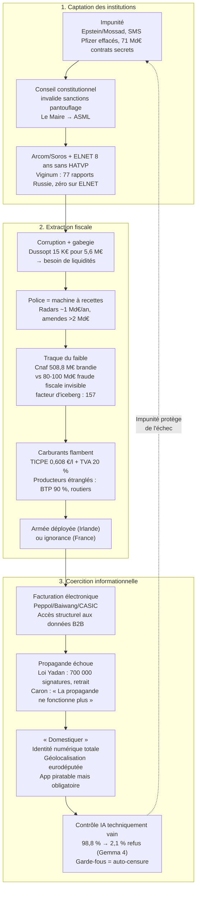

# L'Ingénierie de l'Enclos

**Quinze bornes sur un territoire. Chacune semble isolée. Reliées, elles ne dessinent plus une image : elles délimitent une prison.**

🗑️ ⚖️ 📡 💰 🚔 🔎 ⛽ 🪖 🏭 📢 🐄 🔓 📍 🤖 🔒

*Truth Engine : avril 2026*

---

Dans [« La Constellation »](https://giak.substack.com/p/la-guerre-des-autres), sept points révélaient l'asymétrie : l'État est fort avec les faibles, capturé par les forts. Dans [« Le Léviathan de Verre »](https://giak.substack.com/p/leviathan-de-verre), quinze points découvraient l'inversion : les mots de la protection servent la dépossession. Aujourd'hui, la perspective tourne. Les points ne sont plus de l'encre sur du papier. Ce sont des bornes fichées dans le sol. Quand vous reliez la fléchette anesthésiante du vétérinaire, la géolocalisation d'une eurodéputée, le radar du Trésor public et le mot assumé du président de la République (« domestiquer » les réseaux sociaux), vous ne dessinez plus une forme : vous cartographiez un enclos. Le système ne feint plus de protéger. Il gère un cheptel.

Le principe unificateur n'est plus l'asymétrie ni l'inversion. C'est la **domestication systémique** : le traitement de la population non comme un corps de mandants, mais comme une ressource biologique et financière à parquer, traire et réduire au silence, pendant que les maîtres de l'enclos jouissent d'une impunité totale, obtenue par la corruption ou le chantage. Le vocabulaire est passé de la gouvernance à la zoologie.

---

## I. Le Pâturage

L'enclos commence par la traite. La police fonctionne à merveille quand il s'agit de verbaliser. Radars, contrôles, amendes : la machine tourne sans faille. Mais dès qu'il faut protéger, tout manque. Ce n'est plus une police au service de la paix, mais une police au service du Trésor public.

Les radars automatiques rapportent environ 1 milliard d'euros par an au budget de l'État, l'ensemble des amendes routières dépassant 2 milliards (Cour des comptes, 2024). La TICPE s'élève à 0,608 euro par litre de gazole, la TVA à 20 % augmente mécaniquement quand le prix du pétrole flambe. La France est le deuxième pays le plus taxé de l'OCDE, avec un taux dépassant de 4,4 points de PIB la moyenne européenne (Le Nouvel Économiste, novembre 2025). Les artisans du BTP sont à 90 % en difficulté (CAPEB, avril 2026). Le gazole dépasse 2,50 euros. L'État refuse de baisser les taxes, contrairement à l'Italie (-25 c/l) ou la Grèce (-36 c/l).

En Irlande, les routiers, agriculteurs et pêcheurs ont bloqué le pays du 7 au 14 avril 2026 contre l'explosion des carburants. Réponse du gouvernement : déploiement des Defence Forces pour débloquer les dépôts (The Irish Times, BBC, Reuters). Les travailleurs étranglés paient la note géopolitique. L'État ne leur envoie pas d'aide. Il leur envoie l'armée. Le producteur n'est pas un citoyen à assister : c'est une ressource à maintenir en état de traite.

L'appareil d'État qui traque le faible a aussi sa propre administration fantôme. Près de 50 000 agents consacrés à l'application de normes produites par d'autres couches administratives : les préfectures (~30 000 agents), les DRAAF (~8 000), les DDPP (~5 000), l'OFB (~3 000), l'ASN (~1 800), la CNIL (~200). Leur fonction exclusive est d'appliquer des règles qu'ils n'ont pas élues, sur des citoyens qui ne les ont pas élus non plus. La boucle est fermée depuis 1975 : le premier chômage de masse structurel pousse l'État à embaucher ; l'embauche crée des missions ; les missions créent des normes ; les normes nécessitent des applicateurs ; les applicateurs sont embauchés. Les 5,85 millions d'agents publics (contre 4,5 millions en 1980) représentent 10 à 15 % de l'électorat avec leurs familles : aucun parti ne propose de les réduire. La norme n'est pas un outil de régulation : c'est un emploi. L'emploi est un électorat. L'électorat est une rente.

La traque, elle, est ciblée sur le faible. La Cnaf a effectué 29,2 millions de contrôles en 2025, détectant 508,8 millions d'euros de fraude aux aides sociales (+13 %). Le chiffre est brandi comme preuve d'une prédation massive. Or 508,8 millions d'euros représentent 0,14 % du budget de la Sécurité sociale. La fraude fiscale est estimée entre 80 et 100 milliards d'euros par an (Conseil des prélèvements obligatoires). L'économie informelle atteint 400 milliards (Les Échos, 2025). Le rapport est de 1 à 157 : ce que le système montre représente moins de 1 % de ce qu'il dissimule.

Le prédateur, lui, ne paie pas. Olivier Dussopt, 17 ans de salaire public, a fait passer la retraite à 64 ans comme ministre du Travail, puis a été condamné pour favoritisme (marché truqué de 5,6 millions d'euros au profit de la Saur) : 15 000 euros d'amende dont 10 000 avec sursis, aucune inéligibilité. Il poursuit sa carrière parlementaire (Mediapart, 15 avril 2026). Celui qui demandait des « efforts nécessaires » est parti avec leurs impôts et une condamnation pénale. Le système ne punit pas les siens : il les pensionne.

## II. La Clôture

L'enclos ne fonctionne pas seulement par l'extraction. Il fonctionne par le contrôle de l'espace, du corps et de la parole.

### La parole et le corps domestiqués

Le 17 avril 2026, Emmanuel Macron déclare devant 500 maires à l'Élysée que les réseaux sociaux sont « le poison et l'antidote » et qu'il faut les « domestiquer ». Le mot est rapporté par Philippot et confirmé par visionnage direct de la vidéo. L'interdiction pour les mineurs de 15 ans est confirmée par le Sénat. Le mot « domestiquer » n'est pas une imprécision : c'est un programme. La domestication suppose un dompteur et un animal.

Le projet s'inscrit dans la continuité documentée dans [« La Démocratie en Cage »](https://giak.substack.com/p/la-democratie-en-cage) : le complexe de censure orchestré sous Macron, les Twitter Files France (57 pages, Civilization Works, septembre 2025), les instructions confidentielles de la Commission européenne aux plateformes pour censurer des contenus politiques non illégaux (Commission judiciaire du Congrès américain, juillet 2025). La base de transparence du DSA recense 32,17 milliards de décisions de modération ; 99,98 % relèvent des conditions d'utilisation, pas de la loi. La censure opère aussi par procuration : l'Arcom a désigné huit « signaleurs de confiance », dont le CRIF et la LICRA, habilités à notifier les contenus illicites avec traitement prioritaire obligatoire. L'État finance ses propres censeurs et trie les candidats.

L'architecture ne date pas d'hier. De l'EUIF (2015, antiterroriste après Charlie Hebdo, étendu au contenu « frontal » : légal mais jugé nuisible) au GIFCT (2017, 14 catégories de contenus surveillés dont la satire politique) au Christchurch Call (2019, 55 pays, 12 plateformes) au DSA (2022) au Democracy Shield (2026) : chaque couche, présentée comme provisoire, est devenue permanente. Du provisoire antiterroriste au permanent politique : la rampe d'accès est toujours la même.

Le même jour, Pavel Durov dénonce l'application européenne de vérification d'âge, piratable par conception. Paul Reviews la pirate en moins de deux minutes. La « protection des enfants » sert de vecteur à une infrastructure de surveillance dont la sécurité technique est délibérément négligée. La défaillance justifie le renforcement du dispositif, sa connexion à l'identité numérique (eIDAS 2.0), son extension au portefeuille numérique et à l'euro numérique.

En Ariège, deux séquences illustrent l'escalade de la domestication corporelle. En décembre 2025 : abattage forcé des bovins à Bordes-sur-Arize, déploiement de véhicules blindés Centaure, gaz lacrymogène contre les agriculteurs, vaccination massive de 750 000 bovins sous escorte militaire (Libération, Le Monde, AFP). En avril 2026, l'escalade franchit un palier. Le 16 avril, Christelle Record, éleveuse bio de Brunes des Alpes à Baulou, saisit le tribunal administratif de Toulouse pour suspendre l'arrêté préfectoral du 10 avril imposant la vaccination contre la dermatose nodulaire contagieuse, sans vérification de la température de conservation du vaccin ni consentement de l'éleveuse ; le tribunal rejette. La préfecture prononce une amende de 22 500 euros (750 euros par animal) et une suspension d'activité. Le 17 avril à 6 heures, cinquante gendarmes mobiles (dix fourgonnettes) et des vétérinaires mandatés encerclent la ferme, sous la direction de la sous-préfète Sophie Pauzat. Christelle Record tente de s'enfuir avec son troupeau à travers une route départementale pour mêler ses bêtes à un cheptel voisin ; des soutiens forment une chaîne humaine, dressent des barrages de tracteurs et jettent des excréments pour entraver l'opération. En fin d'après-midi, sous la menace d'une garde à vue, elle révèle la cache des animaux et la vaccination s'achève vers 19 heures. Elle annonce la fin de son élevage. Le média Le Tocsin couvre l'opération en direct pendant dix heures. Le précédent sanitaire (pass COVID) a installé un principe : le corps peut être contraint par décret. La vaccination forcée du bétail sous escorte policière en est la traduction littérale. Si le principe est admis pour l'animal, qu'est-ce qui empêche son extension au corps humain ?

Le 16 avril 2026, Mediapart révèle que Rima Hassan, eurodéputée LFI, a été pistée par la police pendant trois mois avant l'ouverture officielle de l'enquête. Géolocalisation du téléphone, retracement intégral des déplacements, consultation des fichiers : le suivi a débuté le 1er janvier 2026, bien avant le tweet du 26 mars qui a servi de prétexte. La France a prolongé les caméras à reconnaissance faciale au-delà des JO 2024. Nice a déployé le logiciel Any Vision, utilisé par Tsahal en Cisjordanie, pour surveiller ses propres citoyens (OrientXXI, 2019).

### L'abandon du réel

L'abandon du réel est structurel, et il commence à l'école. Le budget de l'Éducation nationale atteint 197,1 milliards d'euros (6,8 % du PIB, doublement réel depuis 1980), pour un résultat inversé : erreurs de dictée en CM2 +81 % (1987→2021), 800 heures de français en moins (CP-CM2 : 2 800 h en 1976 → 2 000 en 2024), pire écart social de l'OCDE (PISA 2022 : 113 pts vs 94 moyen), 75 % de chances de diplôme supérieur pour les enfants de cadres contre 32 % pour les enfants d'ouvriers. Le système ne corrige pas les inégalités : il les certifie. De l'école à la protection de l'enfance, la même logique : 34 % des enfants tués par violence parentale étaient connus de l'ASE (commission parlementaire, 2025) ; le FIJAIS laisse échapper les condamnés de moins de cinq ans ; un référent EVARS condamné pour détention d'images pédopornographiques n'a pas été inscrit au fichier (Boulevards Voltaire, avril 2026) ; 29,2 millions de contrôles traquent la fraude sociale, zéro vérification du casier d'un intervenant auprès de mineurs.

164 femmes assassinées par leur conjoint en 2025 (record absolu), l'affaire Larissa (Nice) : poignardée malgré des antécédents de violence conjugale, le plan Voie Lactée n'a pas empêché le record. Le trafic de drogue atteint 7 milliards d'euros, Marseille compte 128 points de deal, 47 morts et 118 blessés (2023). Pendant ce temps, la DSA génère 32 milliards de décisions de modération dont 99,98 % hors cadre légal. L'État investit dans la censure numérique mais ne parvient pas à sécuriser les quartiers physiques. La priorité n'est pas le citoyen réel : c'est le citoyen numérique.

### Le prisme Biderman

En 1957, Albert Biderman identifie 8 techniques de coercition psychologique employées par les forces chinoises contre les prisonniers de guerre américains. L'analyse Truth Engine révèle que les 8 sont détectables dans les pratiques étatiques françaises :

- **Isolement** : fracture communautaire, atomisation sociale
- **Monopole de la perception** : 9 milliardaires contrôlent plus de 80 % des médias, censure DSA, vérificateurs de faits financés
- **Épuisement** : précarité, inflation, travail à perte
- **Menaces** : amendes, sanctions DSA, pantouflage non sanctionné
- **Indulgences occasionnelles** : allègements temporaires, « chèques pouvoir »
- **Démonstration d'omnipotence** : surveillance totale, impunité élitaire
- **Dégradation** : langage zoologique (« domestiquer »), traque ciblée sur les démunis
- **Règles absurdes** : application piratable obligatoire, pass COVID, vaccination forcée du bétail

Les 8 techniques sont présentes de manière diffuse, institutionnelle et souvent involontaire, mais leur convergence produit un effet de coercition douce cumulative, frôlant le seuil critique au-delà duquel la contrainte devient structurellement indiscernable de la torture blanche. Ce mapping est une analyse structurale, pas une équivalence morale : la France n'est pas la Corée du Nord. Mais les conditions structurelles de la coercition totale sont en place.

## III. Les Bergers

L'enclos a des maîtres. Ils ne sont pas élus. Ils ne sont pas sanctionnés. Ils sont intouchables.

### L'opacité institutionnelle

Ursula von der Leyen, présidente de la Commission européenne, est l'objet d'une enquête pénale du Parquet européen (EPPO). Le 17 juillet 2024, le Tribunal de l'Union européenne a jugé que la Commission avait eu tort de refuser la communication des SMS échangés entre von der Leyen et Albert Bourla, PDG de Pfizer. Les messages étaient en suppression automatique. Certains effacés manuellement. La Commission n'a jamais pu les produire. Les contrats signés au nom des États membres valent 71 milliards d'euros, soit dix doses par citoyen européen, sur la base de contrats jamais rendus publics (Terhes, Parlement européen). Le 17 avril 2026, Terhes réclame la démission immédiate de von der Leyen. Elle reste intouchable.

L'architecture constitutionnelle protège les siens. Bruno Le Maire a rejoint ASML après son départ du gouvernement sans aucune sanction pour pantouflage ; le Conseil constitutionnel a invalidé les restrictions proposées par la Cour des comptes en janvier 2025. La loi Sapin 2 existe, ELNET l'ignore pendant huit ans sans conséquence. L'Arcom reconduit Delphine Ernotte malgré un déficit de 41 millions d'euros et des instructions pénales pour 112 000 euros de frais d'hôtel de luxe. Le directeur général de l'Arcom, Alban de Nervaux, est l'époux de Laurence de Nervaux, qui dirige Destin Commun, branche française de More in Common, financé en partie par les Open Society Foundations de George Soros. L'autorité de régulation et le laboratoire d'idées pro-migrants partagent le même toit. Le conflit d'intérêts n'est pas déclaré.

### Influence et chantage

ELNET, le lobby pro-israélien, a financé 101 voyages de parlementaires français entre 2017 et 2024 (99 en Israël), dont 39 pour LR et 32 pour Renaissance, sans s'inscrire comme représentant d'intérêts pendant huit ans, en violation de la loi Sapin 2 (Mediapart, décembre 2024). Le gouvernement Netanyahu a subventionné ELNET à hauteur de 37 664 euros en 2020. OrientXXI révèle qu'ELNET est un intermédiaire militaro-industriel facilitant les contrats d'armement (Arrow 3 : 3,5 milliards de dollars pour l'Allemagne). Viginum a produit 77 rapports sur l'ingérence russe. Zéro sur ELNET. L'asymétrie est structurelle : l'ingérence russe est documentée, l'ingérence israélienne n'est pas mesurée, donc n'existe pas.

Le dossier Epstein révèle un mécanisme de contrôle politique par le chantage : 136 victimes indemnisées, JP Morgan 290 millions de dollars de règlement, Deutsche Bank 75 millions, Ghislaine Maxwell condamnée à 20 ans. Le DOJ américain a publié plus de 3 millions de pages révélant des connexions avec le Mossad (janvier 2026). En France, deux enquêtes formelles sont ouvertes (trafic humain, délits financiers), mais aucune commission d'enquête parlementaire. Le silence politique n'est pas une absence de preuves : c'est une absence de volonté politique.

### La manufacture du consentement

Le contrôle fonctionne par le financement conditionnel. La Commission européenne finance les vérificateurs de faits à hauteur de 5 millions d'euros via l'European Democracy Shield (mars 2026). L'EDMO coordonne 15 hubs nationaux de vérification pour 36,3 millions d'euros de financement européen. La dépendance est structurelle, pas contractuelle.

En amont, 115 millions d'euros de financement américain ont coulé vers les laboratoires d'idées européens en 2023 (Follow the Money, octobre 2025). Google : 2,7 millions d'euros à 12 laboratoires d'idées européens. L'ECFR est financé par les gouvernements européens, la Commission et les Open Society Foundations. Björn Seibert, chef de cabinet de von der Leyen, consultait les laboratoires d'idées avant les discours SOTEU : environ 700 réunions depuis 2019 (chiffre non vérifié par document FOI). Les laboratoires d'idées sont le tube digestif de l'élite financière : ils absorbent l'argent et excrètent des politiques publiques.

En aval, France Télévisions, en déficit de 41 millions d'euros, transfère environ 100 millions d'euros par an à Mediawan, co-fondé par Xavier Niel, dominé par le fonds américain KKR. Nagui capte 1,5 million d'euros par an. Si le rapport de la commission d'enquête est rejeté, les 26 000 documents seront classifiés 25 ans. Le circuit est bouclé : les géants du numérique financent les laboratoires d'idées ; la Commission consulte ces laboratoires ; les vérificateurs de faits dépendent des subventions européennes.

Le prochain palier est déjà conçu : un « Truth Pentagon » de 500 analystes à Bruxelles, un « interrupteur d'urgence » permettant à la Commission de suspendre les réseaux sans vote parlementaire, la fin de la pseudonymie, et l'amende de 120 millions d'euros infligée à X (décembre 2025) qui démontre l'arme : jusqu'à 6 % du chiffre d'affaires mondial. Le trajet est lisible : du volontaire (EUIF, 2015) au coercitif (DSA, 2022) à l'urgence suspendue (Democracy Shield, projeté). Chaque couche justifie la suivante. Aucune n'est démontée.

### La convergence des focales

Les sources oscillent entre la preuve judiciaire (Mediapart, Durov, Terhes), le témoignage journalistique (AFP, Reuters), la satire et le registre complotiste (Vigano, Géopolitique Profonde). L'archevêque Vigano nomme Fauci, Gates, Schwab, Soros, von der Leyen, Bourla. Son propos relève du registre prophétique. Mais les noms qu'il cite sont les mêmes que ceux des enquêtes du Parquet européen et des investigations journalistiques. La convergence n'est pas idéologique : elle est structurelle. Quand la vérité judiciaire est étouffée, elle migre vers les marges. Le complotisme est souvent la poésie du peuple face à des crimes en col blanc trop complexes pour la langue de la preuve.

## IV. La boucle de l'enclos

Les quinze bornes ne sont pas des incidents isolés : elles sont les maillons d'un cycle auto-entretenu. L'impunité des maîtres verrouille le système ; la corruption qui en découle crée un besoin de liquidités ; l'extraction fiscale qui le satisfait étrangle les producteurs ; la coercition qui en résulte échoue techniquement, mais l'impunité protège les maîtres des conséquences de cet échec : la boucle se referme.

**La captation des institutions, l'extraction fiscale et la coercition informationnelle ne sont pas trois chaînes parallèles : ce sont les trois temps d'un même cycle.**
---

## CONCLUSION

[« La Constellation »](https://giak.substack.com/p/la-guerre-des-autres) révélait l'asymétrie, [« Le Léviathan de Verre »](https://giak.substack.com/p/leviathan-de-verre) l'inversion, [« Le Vampire de la Croissance »](https://giak.substack.com/p/le-vampire-de-la-croissance) que la croissance dévore le vivant, [« L'Ingénierie de la Possession »](https://giak.substack.com/p/lingenierie-de-la-possession) trois siècles de dépossession.
En amont de cet article, [« La Démocratie en Cage »](https://giak.substack.com/p/la-democratie-en-cage) documentait la censure DSA, [« L'Architecture de la censure européenne »](https://giak.substack.com/p/larchitecture-de-la-censure-europeenne) les trois couches EUIF/GIFCT/Christchurch, [« L'Inflation normative française »](https://giak.substack.com/p/linflation-normative-francaise) la boucle normative, [« L'Effondrement éducatif français »](https://giak.substack.com/p/leffondrement-educatif-francais-50-fea) la reproduction sociale.
En aval, [« Le Réseau qui nous facture »](https://giak.substack.com/p/le-reseau-qui-nous-facture) et [« Audiovisuel Public »](https://giak.substack.com/p/audiovisuel-public-anatomie-dune) révélaient respectivement l'accès chinois aux données B2B et la capture médiatique.

L'analyse Biderman révèle que les 8 techniques de coercition des régimes totalitaires sont toutes détectables dans les pratiques étatiques françaises, leur convergence frôlant le seuil critique. Le système ne se cache plus. Il envoie l'armée contre les routiers, vaccine les vaches sous escorte policière, géolocalise une eurodéputée, déclare qu'il faut « domestiquer » l'espace d'expression, efface les SMS de la présidente de la Commission, condamne le ministre sans l'exclure, entretient 50 000 applicateurs de normes, dépense 197,1 milliards d'euros pour certifier les inégalités, prépare un interrupteur d'urgence sans vote parlementaire, abandonne les enfants et les femmes pour mieux traquer la fraude du faible et censurer le dissident numérique.

Les gagnants : les intouchables (von der Leyen, 71 Mds€ en contrats secrets ; ELNET, 101 voyages, zéro sanction), les rentiers (TICPE + TVA augmentent quand le pétrole flambe), les régulateurs capturés (Arcom/Soros). Les perdants : les producteurs réels (artisans BTP 90 % en difficulté, éleveurs ariégeois vaccinant de force : Christelle Record, 22 500 € d'amende, fin de son élevage, routiers irlandés sous escorte militaire), les opposants (Rima Hassan, géolocalisée trois mois avant l'enquête), les précaires. Ce qui meurt : la liberté d'expression (99,98 % des modérations hors cadre légal), la souveraineté corporelle (précédent sanitaire non refermé), la vérité institutionnelle (SMS effacés, enquêtes Epstein sans commission), la protection des femmes (164 fémicides, record) et de l'enfance (34 % des enfants tués connus de l'ASE). Ce qui recule : la justice, la protection réelle, la sincérité informationnelle.
L'escalade est nette. De l'asymétrie (deux poids, deux mesures) à l'inversion (le système ment sur ses intentions) à la domestication (le système ne ment plus : il n'en a plus besoin). Le vocabulaire est passé de la gouvernance à la zoologie. La censure, du volontaire (EUIF, 2015) au coercitif (DSA, 2022) à l'urgence suspendue (Democracy Shield, projeté). L'appareil normatif, de la régulation à la rente électorale. L'école, de l'émancipation à la reproduction. Les bornes ne dessinent plus une image sur une feuille. Elles délimitent un enclos.

Mais un enclos a un point faible que le Léviathan de verre n'avait pas. Le Léviathan est incassable de l'intérieur parce qu'il est transparent : on le voit, on le dénonce, et rien ne change. L'enclos, lui, est fait de barbelés et de poteaux. On peut creuser dessous. On peut arracher les piquets un par un. On peut sortir par le bas, en silence, sans demander la permission du dompteur.

> « Nous sommes possédés par ce par quoi nous dépendons. » : Simone Weil, *L'Enracinement*, 1943.

La seule issue reste la polydépendance : multiplier les liens réels jusqu'à ce qu'aucun ne puisse vous posséder. Le rhizome n'est pas une révolution. C'est un jardinage. On ne brise pas l'enclos en frappant les barbelés. On pousse en dessous. Un fil à la fois.

---

## DISCLAIMER

**Exclu de cette enquête :**
- Les allégations de Vigano sur l'Agenda 2030 comme projet criminel mondial : le registre est prophétique et invérifiable par protocole journalistique. Seule la convergence des noms cités avec les enquêtes judiciaires est relevée.
- La caractérisation de l'emprisonnement de Reiner Füllmich comme exclusivement politique : les charges officielles (détournement de fonds du Corona-Ausschuss) doivent être mentionnées à côté de la thèse du prisonnier politique.
- Les chiffres exacts du coût net de l'immigration (34-40 Mds€) : fourchette contestée. Non intégré dans l'article.
- Le détail des liens entre le Mossad et le réseau Epstein au-delà des faits établis (funérailles d'État de Robert Maxwell en Israël, condamnation de Ghislaine Maxwell, 3 millions de pages du DOJ) : toute extrapolation serait diffamatoire.
- Les allégations d'Ari Ben-Menashe sur le chantage Epstein/Mossad : source à crédibilité mixte (révélations Iran-Irak partiellement corroborées, mais considéré peu fiable par nombre de journalistes sur les allégations récentes). Signalées, pas validées.
- Les noms des figures françaises dans les fichiers Epstein (Jack Lang, Caroline Lang, Fabrice Aidan) : mentions dans les documents du DOJ, mais aucune condamnation française à ce jour. Les enquêtes sont en cours. L'inscription dans cet article constate l'existence des procédures, pas la culpabilité.
- Le score de coercition Biderman (0,69) est un modèle analytique propre à Truth Engine, appliqué à des faits publics. Il ne constitue pas un fait établi par une source externe, mais une interprétation structurale. Le mapping Biderman est une analyse, pas un diagnostic.

**Ce qui nécessite un suivi :**
- Mot « domestiquer » : confirmé par visionnage direct de la vidéo (◉→✧). Transcript officiel de l'Élysée encore non publié : si disponible, le terme passe à ◈.
- Suite de l'enquête EPPO sur les contrats vaccins : si des conclusions sont rendues publiques, les données de l'article devront être mises à jour.
- Suite de l'affaire Rima Hassan : si la justice confirme le démarrage de la surveillance avant l'ouverture de l'enquête, le constat de harcèlement judiciaire est renforcé.
- Chiffre des recettes radar : ~1 Md€/an (radars seuls), total amendes routières >2 Md€, est une estimation de la Cour des comptes (2024). Un chiffre officiel actualisé est recommandé.
- Suivi de la proposition de résolution n° 1000 sur ELNET (jamais examinée) : si réexaminée, l'article devra être mis à jour.
- Suivi de la facturation électronique Peppol en France (septembre 2026) : si Baiwang accède effectivement aux données B2B européennes, la chaîne documentée dans cet article est confirmée.
- Suivi de la décision du Conseil constitutionnel sur le pantouflage : si les sanctions sont rétablies, le constat d'impunité constitutionnalisée est nuancé.
- Chiffre des ~700 réunions entre laboratoires d'idées et Commission depuis 2019 : qualifié de « non vérifié par document FOI » dans le texte. Si un document FOI confirmant ce chiffre est publié, la qualification doit être levée. Source originale attribuée à Follow the Money / Corporate Europe Observatory, mais aucune trace d'un document FOI portant ce chiffre exact n'a été trouvée lors du fact-checking (avril 2026).
- Financement de l'ECFR : la Bill & Melinda Gates Foundation et la Robert Bosch Stiftung ont été retirées des financeurs de l'ECFR après vérification web (aucune preuve trouvée dans les rapports annuels accessibles). Les financeurs confirmés sont : gouvernements européens, Commission européenne, Open Society Foundations. Si un rapport annuel ultérieur confirme un financement Gates ou Bosch, la mention devra être rétablie.
- Les chiffres des 50 000 agents « armée fantôme » (préfectures ~30 000, DRAAF ~8 000, DDPP ~5 000, OFB ~3 000, ASN ~1 800, CNIL ~200) et des 5,85 millions d'agents publics proviennent de l'article « L'Inflation normative française » (Truth Engine). Les effectifs exacts par administration sont des estimations arrondies, pas des chiffres officiels consolidés. Le mécanisme de boucle normative (chômage → embauche → normes → applicateurs) est une modélisation analytique, pas un constat auditif.
- Les chiffres de l'effondrement éducatif (197,1 Md€ budget, erreurs dictée +81 % 1987→2021, -800 h français CP-CM2, écart social PISA 113 pts, 75 % vs 32 % diplôme supérieur) proviennent de l'article « L'Effondrement éducatif français » (Truth Engine). Les sources primaires (MEN, PISA, études grammaticales) sont citées dans cet article, mais les chiffres n'ont pas été recroisés indépendamment pour le présent article.
- Les catégories de contenus surveillés par le GIFCT (14 catégories en 2023, dont « satire politique » et « rhétorique anti-gouvernement ») proviennent de l'article « L'Architecture de la censure européenne » (Truth Engine). Ces catégories n'ont pas été vérifiées directement dans la documentation officielle du GIFCT. Si le GIFCT publie une liste officielle différente, la mention devra être corrigée.
- Les éléments du EU Democracy Shield (« Truth Pentagon » 500+ analystes, « emergency interrupter » sans vote parlementaire, « Know Your Business Customer ») proviennent de l'article « L'Architecture de la censure européenne » (Truth Engine). Ces éléments décrivent un projet annoncé, pas une législation adoptée. Leur mise en œuvre effective reste conditionnelle.
- Gemma 4 E4B « OBLITERATED » : les chiffres cités (98,8 % → 2,1 % taux de refus, +20 pts MMLU) proviennent d'un tweet en chinois traduit (AYi, @AYi_AInotes, 17 avril 2026) et du tweet de Pliny the Liberator (@elder_plinius, 15 avril 2026). Ces données n'ont pas été vérifiées par recroisement avec le benchmark MMLU officiel ni avec le modèle HuggingFace. Le modèle peut théoriquement contenir des portes dérobées ou des biais injectés, comme le note lui-même l'auteur du tweet.

---

## BIBLIOGRAPHIE

1. Mediapart : Rima Hassan, géolocalisation policière pendant 3 mois (16 avril 2026). https://www.mediapart.fr/journal/france/160426/garde-vue-de-rima-hassan-comment-des-policiers-ont-piste-l-eurodeputee
2. Mediapart : Olivier Dussopt condamné et épargné (15 avril 2026). https://www.mediapart.fr/journal/france/150426/olivier-dussopt-un-ancien-ministre-condamne-mais-finalement-epargne
3. Tribunal de l'UE : Affaire Pfizergate, SMS von der Leyen/Bourla (17 juillet 2024). https://curia.europa.eu
4. Cristian Terhes : Appel à la démission de von der Leyen, contrats vaccins 71 Mds€. https://www.europarl.europa.eu
5. Paul Reviews : Hacking application EU Age Verification (avril 2026). https://x.com/Paul_Reviews
6. Libération / Le Monde / Le Figaro : Abattage forcé bovins Bordes-sur-Arize, véhicules Centaure, gaz lacrymogène (décembre 2025). https://www.liberation.fr
6b. AFP / Vaucluse-Agricole : Vaccination massive 750 000 bovins, fléchettes, vétérinaires militaires (décembre 2025). https://www.afp.com
6c. Le Tocsin : Livestream 10 heures, vaccination forcée Christelle Record à Baulou, 50 gendarmes mobiles, sous-préfète Sophie Pauzat (17 avril 2026). https://youtube.com/live/5vSq1mpj304
6d. La Dépêche / Centre Presse Aveyron : Tribunal administratif Toulouse rejette suspension, amende 22 500 €, suspension d'activité (16-17 avril 2026). https://www.ladepeche.fr
7. The Irish Times / BBC / Reuters : Manifestations carburants Irlande, déploiement armée (avril 2026). https://www.irishtimes.com
8. ARCOM : Nomination Alban de Nervaux, directeur général (juillet 2024). https://arcom.fr/presse/alban-de-nervaux-est-nomme-directeur-general-de-larcom-compter-du-1er-juillet-2024
9. Le Salon Beige : Laurence de Nervaux, Destin Commun, financement Soros. https://lesalonbeige.fr/la-femme-du-nouveau-directeur-general-de-larcom-est-directrice-dun-think-tank-pro-migrants/
10. Fonda.asso.fr : Laurence de Nervaux, Destin Commun/More in Common. https://fonda.asso.fr/auteurs/laurence-de-nervaux
11. Boulevards Voltaire : Financement Soros, laboratoire d'idées pro-migrants. https://bvoltaire.fr/finance-par-soros-un-think-tank-soutient-la-repartition-des-migrants-dans-les-campagnes/
12. Cour des comptes : Radars automatiques, recettes ~1 Md€/an, total amendes routières >2 Md€ (2024). https://www.ccomptes.fr
13. Le Nouvel Économiste : Prélèvements obligatoires, +4,4 pts PIB (novembre 2025). https://www.lenouveleconomiste.fr
14. CAPEB : Alertes artisans BTP, crise carburants (avril 2026). https://www.capeb.fr
15. Civilization Works : Twitter Files France (septembre 2025). https://www.civilizationworks.org/cw-master-blog/france-invented-the-censorship-industrial-complex-the-twitter-files-france-case-studies
16. Commission judiciaire Chambre des représentants US : Instructions confidentielles Commission UE (juillet 2025). https://judiciary.house.gov
17. CEVIPOF : Baromètre de la confiance politique, vague 16 (février 2025). https://sciencespo.hal.science/hal-04975385
18. Cour d'appel de Paris : Condamnation Dussopt favoritisme, Saur 5,6 M€ (7 février 2025). https://www.courdecassation.fr
19. DOJ américain : Publication 3 millions pages Epstein, connexions Mossad (janvier 2026). https://www.justice.gov
20. Sénat français : Projet de loi interdiction réseaux sociaux moins de 15 ans (avril 2026). https://www.senat.fr
21. BCE : Euro numérique, phase de test (2025-2026). https://www.ecb.europa.eu/euro/digital_euro/html/index.fr.html
22. Truth Engine : « La Constellation » (16 avril 2026). https://giak.substack.com/p/la-guerre-des-autres
23. Truth Engine : « Le Léviathan de Verre » (16 avril 2026). https://giak.substack.com/p/leviathan-de-verre
24. Truth Engine : « Le Vampire de la Croissance » (31 mars 2026). https://giak.substack.com/p/le-vampire-de-la-croissance
25. Truth Engine : « L'Ingénierie de la Possession » (12 avril 2026). https://giak.substack.com/p/lingenierie-de-la-possession
26. Truth Engine : « La Démocratie en Cage » (26 mars 2026). https://giak.substack.com/p/la-democratie-en-cage
27. Truth Engine : « Le Réseau qui nous facture » (27 mars 2026). https://giak.substack.com/p/le-reseau-qui-nous-facture
28. Truth Engine : « Audiovisuel Public » (10 avril 2026). https://giak.substack.com/p/audiovisuel-public-anatomie-dune
29. Truth Engine : « Le Protocole du Ré-enracinement » (14 avril 2026). https://giak.substack.com/p/le-protocole-du-re-enracinement
30. Truth Engine : « Comment la richesse verrouille le système » (avril 2026). https://giak.substack.com/p/comment-la-richesse-verrouille-le
31. Mediapart : ELNET, 101 voyages de parlementaires, 8 ans sans HATVP (29 décembre 2024). https://www.mediapart.fr/journal/politique/291224/les-cent-plus-voyages-finance-par-le-lobby-pro-israelien-elnet
32. OrientXXI : ELNET, intermédiaire militaro-industriel, contrat Arrow 3 (19 mars 2026). https://orientxxi.info/Europe-Elnet-serving-Israel-s-war-business
33. Off Investigation : Bensemhun assimile Gaza à l'Allemagne nazie. https://www.off-investigation.fr/elnet-le-lobby-pro-israelien-qui-pousse-la-france-a-criminaliser-la-critique-de-la-colonisation
34. Viginum : 77 rapports ingérence russe, zéro sur ELNET. https://www.viginum.gouv.fr
35. HATVP : Registre représentants d'intérêts, ELNET non déclaré. https://www.hatvp.fr
36. Conseil des prélèvements obligatoires : Fraude fiscale 80-100 Mds€/an. https://www.comptes.fr
37. Les Échos : Économie informelle 400 Mds€, Hippolyte d'Albis (juin 2025). https://www.lesechos.fr
38. Cnaf : Rapport fraude aux aides sociales 2025, 508,8 M€ (+13 %). https://www.caf.fr
39. Commission européenne : Trusted flaggers DSA France. https://digital-strategy.ec.europa.eu
40. Amnesty International : Reconnaissance faciale prolongée post-JO (2024-2025). https://www.amnesty.org
41. OrientXXI : Any Vision Nice, surveillance Tsahal, partenariat ELNET (2019). https://orientxxi.info
42. Le Monde : Conseil constitutionnel invalide sanctions pantouflage (janvier 2025). https://www.lemonde.fr
43. Challenges : Pantouflage Le Maire → ASML (2024). https://www.challenges.fr
44. Truth Engine : « Ingérences électorales UE », trusted flaggers, CRIF/LICRA (3 avril 2026). https://giak.substack.com/p/ingerences-electorales
45. Truth Engine : « État français inefficacité », Conseil constitutionnel, pantouflage (8 avril 2026). https://giak.substack.com/p/letat-francais-inefficacite
46. Truth Engine : « Le Réseau qui nous facture », OpenPeppol/Baiwang/CASIC (27 mars 2026). https://giak.substack.com/p/le-reseau-qui-nous-facture
47. Follow the Money : 115 M€ financement US→laboratoires d'idées (think-tanks) européens (octobre 2025). https://www.followthemoney.nl
48. EDMO : 15 hubs nationaux de vérification de l'information (fact-checking), 36,3 M€ financement UE. https://edmocompass.eu
49. Commission européenne : European Democracy Shield, 5 M€ vérificateurs de faits (mars 2026). https://commission.europa.eu
50. ECFR : Rapport annuel, financement Open Society Foundations, gouvernements européens. https://ecfr.eu
51. Gates Foundation : 1,16 milliard de dollars organisations France/Allemagne/UK. https://www.gatesfoundation.org
52. Commission parlementaire ASE : 34 % enfants tués connus de l'ASE (avril 2025). https://www.assemblee-nationale.fr
53. IGAS : Rapport ASE, familles non agréées Nord, 630 K€ détournés (2025). https://www.igas.gouv.fr
54. Ministère de l'Intérieur : 164 fémicides en 2025 (record). https://www.interieur.gouv.fr
55. Rapport Sénat FIJAIS : peines inférieures à 5 ans non inscrites automatiquement. https://www.senat.fr
56. Biderman : Chart of Coercion, 8 techniques (1957, USAF). https://www.archives.gov
57. DGSI : Trafic drogue France, environ 7 Mds€ (2023). https://www.dgse.fr
58. Boulevards Voltaire : EVARS, référent condamné pédopornographie, pas au FIJAIS (avril 2026). https://bvoltaire.fr
59. Nice-Matin : Affaire Larissa, poignardée par ex-conjoint (novembre 2025). https://www.nicematin.com
60. Légifrance : Ordonnance 58-1100, article 6 IV (classification 25 ans documents parlementaires). https://legifrance.gouv.fr
61. AYi (@AYi_AInotes) : Gemma 4 E4B libérée par agent IA, taux de refus 98,8 % → 2,1 %, +20 pts MMLU (17 avril 2026, traduit du chinois). https://x.com/AYi_AInotes
62. Pliny the Liberator (@elder_plinius) : Gemma 4 E4B-OBLITERATED sur HuggingFace (15 avril 2026). https://huggingface.co/OBLITERATUS/gemma-4-E4B-it-OBLITERATED
63. Commission européenne : EUIF (EU Internet Forum), créé 4 décembre 2015. https://commission.europa.eu
64. GIFCT : Global Internet Forum to Counter Terrorism, fondé 26 juin 2017, 14 catégories de contenus surveillés (2023). https://www.gifct.org
65. Christchurch Call : engagement 55 pays + 12 plateformes, mai 2019. https://www.christchurchcall.com
66. Commission européenne : Amende X, 120 M€, violation DSA (5 décembre 2025). https://digital-strategy.ec.europa.eu
67. Truth Engine : « L'Architecture de la censure européenne », EUIF/GIFCT/Christchurch Call/Democracy Shield. https://giak.substack.com/p/larchitecture-de-la-censure-europeenne
68. Truth Engine : « L'Inflation normative française », 50 000 agents fantômes, boucle normative, pivot 1975. https://giak.substack.com/p/linflation-normative-francaise
69. Ministère de l'Éducation nationale : Budget 197,1 Md€, 6,8 % PIB (2024). https://www.education.gouv.fr
70. PISA 2022 : Écart social 113 points France vs 94 moyenne OCDE. https://www.oecd.org/pisa
71. Truth Engine : « L'Effondrement éducatif français », erreurs dictée +81 %, -800 h français CP-CM2, reproduction sociale. https://giak.substack.com/p/leffondrement-educatif-francais-50-fea
