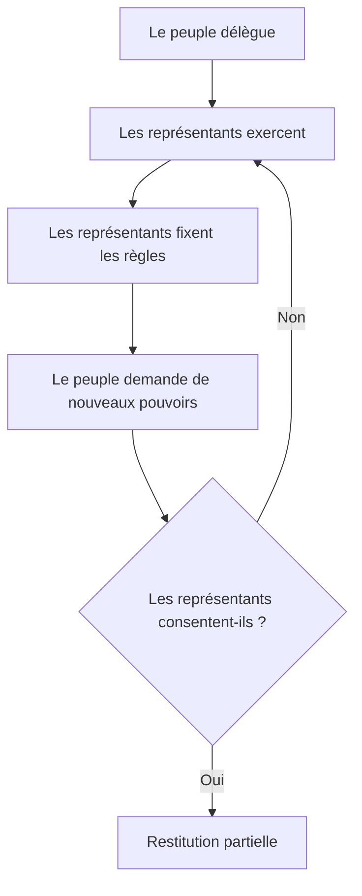

Oui. On peut faire largement mieux que ma première proposition.

Elle était exacte, mais trop descriptive : « le peuple n’a pas les clés ». Elle inventoriait une carence sans identifier avec assez de force le mécanisme qui la reproduit.

Le véritable angle n’est pas seulement l’absence de démocratie directe. C’est une inversion de la délégation :

> **Le peuple est déclaré souverain, mais il doit obtenir l’autorisation de ses représentants pour modifier les conditions dans lesquelles il leur délègue son pouvoir.**

Voilà le cœur de l’article.

# 1. Les différentes thèses possibles

## Thèse A — La confiscation originelle

> En 1789–1791, la souveraineté est retirée au roi, attribuée à la Nation, puis rendue politiquement inaccessible aux citoyens ordinaires.

### Ce qu’elle établit solidement

Les constituants distinguent consciemment :

* le titulaire abstrait de la souveraineté ;
* les citoyens concrets ;
* les représentants habilités à produire la volonté nationale.

La Constitution de 1791 ne remet pas simplement l’exécution aux représentants. Elle affirme que la Nation ne peut exercer ses pouvoirs que par délégation et interdit aux citoyens de s’approprier directement l’exercice de la souveraineté.

### Sa force

Elle détruit l’explication par le simple accident historique. L’exclusion fonctionnelle du peuple gouvernant est consciente.

### Sa limite

Le mot « confiscation » devient excessif si on l’applique uniformément jusqu’en 2026 :

* le suffrage a été considérablement élargi ;
* les libertés politiques sont réelles ;
* les alternances produisent des effets ;
* les mobilisations gagnent parfois ;
* les citoyens disposent de recours juridictionnels ;
* certains référendums ont effectivement contraint le pouvoir.

**Verdict : thèse vraie à la fondation, trop absolue comme description intégrale du régime contemporain.**

---

## Thèse B — L’enfer pavé de bonnes intentions

> Les fondateurs voulaient protéger la liberté, la stabilité et la compétence gouvernementale, mais ils ont créé une architecture propice à l’autonomisation des gouvernants.

Cette thèse possède une part de vérité. La représentation est aussi pensée comme :

* une division du travail ;
* une protection contre les décisions passionnelles ;
* une manière de préserver le temps privé des citoyens ;
* un moyen de dégager un intérêt national supérieur aux intérêts locaux ;
* une réponse pratique à la taille du pays.

Mais elle ne suffit pas.

Le suffrage censitaire, la distinction entre citoyens actifs et passifs, l’exclusion des femmes, la situation coloniale et la réaction de 1795 interdisent le récit d’une ingénierie démocratique innocente qui aurait simplement mal tourné.

La peur sociale et la sélection des « capables » ne sont pas des effets imprévus. Elles sont documentées.

**Verdict : les bonnes intentions existent, mais elles cohabitent avec une volonté consciente de filtrage social et politique.**

---

## Thèse C — La confiance excessive dans les élites

> Le système aurait été construit en supposant que les gouvernants seraient plus compétents, plus vertueux et plus désintéressés que le peuple.

C’est intuitivement séduisant, mais historiquement imprécis.

Les sources attestent davantage une croyance dans :

* la compétence supposée des représentants ;
* leur indépendance ;
* leur capacité à produire l’intérêt général ;
* la sélection des « meilleurs » ;
* la supériorité de la délibération représentative.

Elles démontrent beaucoup moins une croyance générale dans leur probité morale.

Surtout, les constituants n’étaient pas totalement naïfs sur la corruption des gouvernants. La séparation des pouvoirs, la responsabilité politique et les dispositifs de contrôle prouvent qu’ils concevaient ce risque.

Le défaut est ailleurs :

> **Ils ont beaucoup mieux armé la défiance envers le peuple que la défiance du peuple envers ses représentants.**

**Verdict : abandonner la thèse psychologique de la “probité des élites” au profit de l’asymétrie institutionnelle de méfiance.**

---

## Thèse D — Le peuple est devenu électeur sans devenir gouvernant

> L’histoire démocratique française a principalement élargi le nombre des électeurs, beaucoup moins l’étendue de leurs compétences.

C’est l’une des thèses les plus solides.

Les progrès sont incontestables :

* élargissement du suffrage masculin ;
* suffrage universel ;
* vote des femmes ;
* disparition progressive des exclusions coloniales ;
* pluralisme ;
* libertés syndicales et associatives ;
* contrôle juridictionnel ;
* droits politiques plus égaux.

Mais la fonction du citoyen reste essentiellement la même : sélectionner périodiquement ceux qui agiront en son nom.

Il n’obtient généralement pas le pouvoir autonome :

* d’initier une loi ;
* d’en imposer l’examen ;
* de déclencher un référendum ;
* d’abroger une loi ;
* de révoquer un élu ;
* de rendre un engagement électoral opposable ;
* d’engager une révision constitutionnelle.

Cela permet une formule plus forte que « voter n’est pas gouverner » :

> **La France a démocratisé l’accès au choix des gouvernants sans démocratiser proportionnellement l’accès aux actes de gouvernement.**

**Verdict : excellent axe historique, mais il faut encore expliquer pourquoi cette dissociation se reproduit.**

---

## Thèse E — La souveraineté intermittente

> Le peuple n’exerce pas continûment la souveraineté : il est convoqué périodiquement pour autoriser des gouvernants qui en exercent ensuite les compétences.

Cette thèse éclaire :

* l’élection présidentielle ;
* les élections législatives ;
* les référendums contrôlés par les autorités ;
* les plébiscites historiques ;
* l’absence d’initiative citoyenne autonome.

Le peuple intervient comme source de légitimité et comme instance occasionnelle de sanction. Il ne contrôle généralement ni la question, ni le calendrier, ni la traduction durable de sa décision.

Mais il faut éviter « le peuple ne sert qu’à légitimer ». C’est faux : une élection peut changer la majorité, les politiques et le personnel dirigeant.

La formulation exacte serait :

> **Le peuple dispose principalement d’un pouvoir d’autorisation intermittente, tandis que les organes constitués disposent d’un pouvoir continu de production.**

**Verdict : conceptuellement très fort et juridiquement défendable.**

---

## Thèse F — Le sas participatif

> À mesure que la demande de participation augmente, les institutions multiplient les dispositifs de parole sans transférer le dernier mot.

Ce mécanisme apparaît dans :

* les pétitions ;
* les consultations publiques ;
* le CESE ;
* la CNDP ;
* certaines conventions citoyennes ;
* le « grand débat » ;
* les concertations administratives.

Ces dispositifs ne sont pas nécessairement factices. Ils peuvent :

* produire de l’information ;
* modifier un projet ;
* révéler un conflit ;
* alimenter un recours ;
* accroître la publicité d’une décision.

Mais leur propriété commune demeure souvent la suivante :

> le citoyen peut contribuer à la décision ; il ne peut pas contraindre le décideur à la suivre.

Le pouvoir absorbe ainsi la demande de participation en la convertissant en matière consultative.

**Verdict : très bon mécanisme contemporain, mais insuffisant pour expliquer seul deux siècles d’histoire.**

---

## Thèse G — Le veto endogène

C’est la thèse la plus importante et celle que ma première proposition n’exploitait pas assez.

> Les citoyens ne peuvent acquérir l’initiative, la révocation, le référendum décisionnel ou la révision populaire qu’en obtenant l’accord des institutions qui perdraient une partie de leur monopole si ces réformes étaient adoptées.

Autrement dit :

1. le peuple délègue ;
2. les représentants déterminent les règles de la délégation ;
3. les citoyens ne peuvent modifier ces règles directement ;
4. ils doivent convaincre les représentants de leur restituer une partie du pouvoir ;
5. ces représentants ont individuellement ou collectivement intérêt à conserver leurs prérogatives.

Ce n’est pas la preuve que chaque élu agit par intérêt personnel. Mais le conflit institutionnel est objectivement constitué.

C’est un verrou auto-protecteur.

La question décisive devient :

> **Qui autorise le souverain à récupérer ses propres pouvoirs ?**

En France, la réponse est : ceux qui les exercent déjà.

**Verdict : c’est le mécanisme de reproduction le plus puissant de toute l’enquête.**

---

## Thèse H — Les pilotes successifs

> Aucun acteur n’a conçu l’architecture totale, mais plusieurs acteurs ont consciemment construit, maintenu ou renforcé certaines de ses parties.

Cette thèse remplace correctement le « sans pilote ».

On trouve des pilotes identifiables à chaque étape :

* les constituants de 1791 pour le monopole représentatif ;
* les thermidoriens pour la fermeture sociale de 1795 ;
* Bonaparte pour la centralisation et la ratification plébiscitaire ;
* les constituants de 1958 pour la rationalisation parlementaire ;
* de Gaulle et les promoteurs de 1962 pour la présidentialisation ;
* les promoteurs du quinquennat et du calendrier électoral pour le couplage majoritaire ;
* les majorités successives qui refusent une initiative citoyenne autonome.

En revanche, aucune preuve n’établit qu’ils poursuivent tous le même projet transhistorique.

> **Pas de cerveau central ; des décisions locales conscientes ; une compatibilité fonctionnelle entre les strates ; une reproduction désormais informée.**

**Verdict : bonne thèse généalogique, à condition de nommer les auteurs, les intentions et les ruptures.**

# 2. La thèse supérieure : l’inversion du mandat

La meilleure synthèse ne consiste pas à additionner toutes ces thèses. Elle consiste à les ordonner autour d’un mécanisme central.

## Formulation canonique

> **Le régime représentatif français a converti la souveraineté populaire en autorisation électorale. Le peuple désigne les gouvernants, mais ne maîtrise ni l’initiative politique, ni l’agenda, ni les conditions de révocation, ni les règles de la délégation. Les représentants sont juridiquement indépendants de leurs électeurs, tandis que les électeurs dépendent de leurs représentants pour récupérer le moindre pouvoir contraignant. Cette asymétrie, consciemment instituée en 1789–1791, socialement durcie en 1795, administrativement centralisée sous Bonaparte et exécutivement renforcée sous la Cinquième République, constitue le véritable verrou.**

Cette thèse est plus forte que les précédentes parce qu’elle possède :

* un fait fondateur ;
* un mécanisme juridique ;
* une trajectoire historique ;
* un mécanisme de reproduction ;
* des acteurs identifiables ;
* des contre-exemples admissibles ;
* des falsificateurs ;
* une conséquence institutionnelle directement observable.

Elle ne nécessite ni complot, ni psychologie des élites, ni théorie générale de l’anesthésie.

# 3. Le concept central : le mandant désarmé

Le vocabulaire de la délégation contient une contradiction majeure.

Dans une délégation ordinaire, le mandant conserve généralement plusieurs pouvoirs :

* définir la mission ;
* contrôler l’exécution ;
* demander des comptes ;
* modifier les instructions ;
* retirer le mandat ;
* sanctionner une violation.

Dans la représentation politique française :

* le programme électoral n’est pas contractuel ;
* le mandat impératif est nul ;
* le représentant ne peut être révoqué en cours de mandat ;
* l’électeur ne peut imposer une question ;
* il ne peut déclencher seul un référendum national ;
* il ne peut engager une révision de la Constitution ;
* il doit attendre l’élection suivante pour sanctionner, souvent dans une offre politique présélectionnée.

Le mot « délégation » masque donc une transformation :

> **Le mandant ne conserve pas les attributs ordinaires du mandant.**

Attention cependant : il ne faut pas assimiler le mandat politique à un contrat civil. L’indépendance du représentant protège aussi :

* la délibération ;
* l’adaptation aux crises ;
* l’intérêt national ;
* la liberté face aux groupes organisés ;
* la possibilité de refuser une promesse devenue dangereuse ou impossible.

La critique robuste n’est donc pas : « tout mandat devrait être impératif ».

Elle est :

> **Pourquoi l’indépendance nécessaire du représentant doit-elle entraîner l’impuissance presque complète du représenté entre deux élections ?**

C’est ici que l’article devient intellectuellement sérieux.

# 4. Le vrai scandale : une méfiance à sens unique

Le mot « confiance » est trop faible. Le système n’accorde pas seulement sa confiance aux représentants : il distribue inégalement les moyens de se méfier.

## Le représentant est protégé contre l’électeur

* mandat impératif interdit ;
* absence de révocation ;
* liberté de vote ;
* programme non opposable ;
* contrôle citoyen essentiellement différé.

## L’électeur est faiblement protégé contre le représentant

* sanction seulement à l’échéance ;
* responsabilité diluée entre président, gouvernement, Parlement, partis, administration et Union européenne ;
* changement de programme juridiquement libre ;
* absence d’initiative correctrice directe ;
* impossibilité de rouvrir une décision entre deux élections.

La représentation repose donc sur une indépendance asymétrique :

> **L’élu est juridiquement libéré de l’électeur ; l’électeur n’est pas politiquement équipé pour corriger l’élu.**

Cette formule est plus exacte et plus accusatrice que « ils ont cru à la probité des élites ».

# 5. L’article réellement supérieur

## Titre recommandé

# **Le souverain sous tutelle**

### Sous-titre

**Comment la France a transformé la souveraineté populaire en délégation irréversible — et obligé le peuple à demander aux gouvernants la permission de reprendre ses propres pouvoirs.**

« Irréversible » devra être explicité comme irréversible pendant le mandat et non absolument irréversible : l’élection permet une sanction différée.

Autres titres possibles :

1. **Le peuple doit demander la permission**
2. **Le mandant désarmé**
3. **La démocratie à sens unique**
4. **Qui autorise le souverain ?**
5. **La République des représentants**
6. **Élire n’est pas déléguer**
7. **Le peuple souverain sous autorisation**
8. **Le piège constitutionnel français**

Le meilleur compromis entre puissance et exactitude me paraît être :

> **Le souverain sous tutelle — Le piège constitutionnel français**

# 6. Nouvelle architecture narrative

Je déconseille une chronologie encyclopédique 1789–2026. Elle reproduirait le défaut de la V7 : chaque événement finirait artificiellement transformé en nouvelle strate du même verrou.

Il faut partir du mécanisme contemporain, remonter à sa fabrication, puis revenir à son autoreproduction.

## Prologue — Une expérience impossible

Imaginer un collectif réunissant un, deux ou trois millions de citoyens.

Que peut-il imposer juridiquement au niveau national ?

Pas une loi.
Pas son examen.
Pas un référendum.
Pas l’abrogation d’une loi.
Pas la révocation d’un élu.
Pas une révision constitutionnelle.

Le nombre ne suffit pas. Il lui manque un habilitant institutionnel.

Première révélation :

> **En France, une masse populaire ne devient pas souveraine par sa taille. Elle doit être autorisée à agir par les organes qu’elle prétend contrôler.**

## I — La souveraineté est divisée en deux

Distinguer :

* souveraineté-titre ;
* souveraineté-autorisation ;
* souveraineté-production ;
* souveraineté-correction.

Le peuple détient principalement les deux premières. Les organes constitués détiennent les deux dernières.

C’est plus précis que l’opposition binaire entre démocratie et dictature.

## II — 1789 : le peuple reçoit le titre, les représentants la fonction

Mettre en regard la Déclaration, Sieyès et la Constitution de 1791.

Question centrale :

> La Révolution a-t-elle transféré la souveraineté au peuple ou remplacé la personne du souverain par une abstraction nationale administrée par des représentants ?

Réponse nuancée : elle accomplit les deux simultanément.

C’est là le paradoxe fondateur.

## III — Pourquoi ils l’ont fait

Présenter loyalement les justifications :

* taille de la Nation ;
* division du travail ;
* compétence ;
* stabilité ;
* protection contre les factions ;
* unité nationale ;
* liberté privée des modernes.

Puis présenter ce que ces justifications ne suffisent pas à expliquer :

* non-révocabilité ;
* absence d’initiative ;
* filtration sociale ;
* citoyens actifs et passifs ;
* propriété comme critère d’indépendance ;
* fermeture thermidorienne.

Conclusion :

> La représentation fut à la fois une solution fonctionnelle, une doctrine politique et un filtre social.

## IV — L’expérience concurrente qu’il fallait oublier

1793 prouve qu’une autre conception était intellectuellement disponible.

Il ne faut ni idéaliser cette Constitution ni prétendre qu’elle instituait exactement un RIC contemporain. Son intérêt probatoire est différent :

> **La souveraineté populaire plus opératoire n’était pas techniquement impensable ; elle fut une possibilité politique écartée.**

C’est beaucoup plus fort.

## V — L’élargissement sans restitution

1848, vote des femmes, universalisation du suffrage, libertés collectives.

Montrer le grand paradoxe historique :

> Toujours davantage de personnes deviennent électrices, sans que l’électeur acquière beaucoup plus de compétences.

Le peuple est progressivement inclus dans le mécanisme d’autorisation. Il reste extérieur à l’initiative.

## VI — 1958 : gouverner contre l’impuissance parlementaire

Ne pas caricaturer 1958 comme un coup exclusivement dirigé contre le peuple.

L’intention première est documentée : rendre le gouvernement capable d’agir et empêcher l’instabilité parlementaire.

Mais le choix est asymétrique :

* on protège l’exécutif contre le Parlement ;
* on protège le représentant contre l’électeur ;
* on ne donne pas au citoyen de mécanisme autonome de correction.

1962 démocratise la sélection du chef tout en verticalisant l’exercice du pouvoir.

Le quinquennat et le calendrier électoral achèvent ensuite le couplage président-majorité.

## VII — Le mandat inversé

C’est le centre conceptuel.

Comparer la délégation politique avec les attributs minimaux d’un mandat, sans commettre l’erreur de les confondre juridiquement.

Montrer que le citoyen :

* autorise sans instruire ;
* choisit sans pouvoir rappeler ;
* sanctionne tardivement ;
* ne peut rouvrir une décision ;
* ne définit pas les règles de contrôle ;
* ne peut récupérer de nouvelles compétences sans le consentement des détenteurs actuels.

## VIII — Les portes sans la clé

RIP, pétitions, conventions citoyennes, CESE, CNDP, consultations.

Ne pas dire que tout est inutile. Mesurer pour chaque dispositif :

| Dispositif                 | Qui déclenche ?               | Qui formule ?              | Qui tranche ?           | Effet obligatoire ? |
| -------------------------- | ----------------------------- | -------------------------- | ----------------------- | ------------------- |
| Référendum de l’article 11 | Autorités constituées         | Pouvoir politique          | Électeurs               | Oui                 |
| RIP                        | Parlementaires puis électeurs | Parlementaires             | Procédure encadrée      | Conditionnel        |
| Pétition                   | Citoyens                      | Citoyens                   | Institution saisie      | Non                 |
| Convention citoyenne       | Autorité organisatrice        | Mandat encadré             | Autorité politique      | Non                 |
| QPC                        | Justiciable dans un litige    | Question juridique filtrée | Conseil constitutionnel | Oui juridiquement   |

Ce tableau empêcherait les slogans paresseux.

## IX — Le verrou qui se protège lui-même

Montrer le cercle constitutionnel :

Le point essentiel n’est pas que tout représentant refusera nécessairement. C’est que le représentant dispose du droit de veto sur la réduction de ses propres prérogatives.

## X — Ce que la thèse ne permet pas de dire

Section indispensable :

* la France n’est pas une dictature ;
* les élections ne sont pas fictives ;
* les mobilisations ne sont pas toujours stériles ;
* les programmes sont partiellement appliqués ;
* la représentation possède des justifications sérieuses ;
* le référendum peut lui-même être plébiscitaire ou capturé ;
* le mandat impératif total créerait d’autres formes de domination ;
* le peuple n’est ni homogène, ni omniscient, ni naturellement vertueux.

Cette section ne neutralise pas la thèse. Elle lui retire ses fausses vulnérabilités.

## Conclusion — Qui autorise le souverain ?

La conclusion ne doit pas réclamer naïvement « plus de démocratie ».

Elle doit poser un principe d’architecture :

> **Aucun système ne peut sérieusement qualifier un acteur de souverain si cet acteur ne possède aucun moyen autonome de modifier les règles de sa propre délégation.**

Puis proposer un minimum constitutionnel :

* initiative citoyenne ;
* obligation de mise à l’ordre du jour ;
* référendum abrogatif ;
* référendum constitutionnel d’initiative citoyenne ;
* contrôle préalable des questions ;
* transparence du financement des campagnes ;
* délais de réflexion ;
* opposabilité procédurale des engagements essentiels ;
* mécanisme de révocation strictement encadré.

# 7. Ce que cette thèse change par rapport à la V7

La V7 disait approximativement :

> des mécanismes nombreux convergent et anesthésient la population afin de maintenir un verrou sans pilote.

Le nouvel article démontrerait :

> **Le verrou principal est déjà contenu dans la relation constitutionnelle entre mandant et mandataire. Les autres circuits — partis, médias, administration, intérêts organisés, Union européenne, inégalités sociales — ne créent pas cette dépossession. Ils exploitent, amplifient ou rendent plus coûteuse une asymétrie juridique antérieure.**

C’est une amélioration majeure.

Elle permet de conserver la stratification sans prétendre que tout appartient à une seule machine :

| Niveau             | Fonction                                                     |
| ------------------ | ------------------------------------------------------------ |
| Constitution       | Réserve l’initiative et rend le mandat indépendant           |
| Élection           | Concentre l’autorisation dans un moment discontinu           |
| Partis             | Présélectionnent l’offre accessible                          |
| Administration     | Convertit les choix en contraintes de faisabilité            |
| Intérêts organisés | Occupent continuellement l’espace entre deux élections       |
| Médias             | Hiérarchisent la visibilité et l’agenda                      |
| Union européenne   | Multiplie les niveaux de décision et dilue la responsabilité |
| Consultation       | Absorbe la parole sans céder nécessairement la décision      |

Ces couches sont complémentaires, mais elles ne partagent pas nécessairement une intention commune.

# 8. Le verdict le plus honnête

La thèse maximale — « tout a été conçu depuis 1789 pour écarter le peuple » — ne tient pas. Elle confond les intentions, les époques et les institutions.

La thèse minimale — « ce sont seulement les imperfections normales de toute démocratie représentative » — ne tient pas davantage. Elle évite de regarder l’asymétrie juridique et le veto endogène.

La thèse qui résiste est celle-ci :

> **Le peuple français n’a pas été exclu de toute vie politique ; il a été enfermé dans une fonction principalement élective et réactive. Cette limitation fut consciemment instituée à la naissance du régime représentatif, justifiée par des raisons à la fois sincères et socialement intéressées, puis maintenue par une architecture qui confie aux représentants le pouvoir de décider si les représentés pourront acquérir davantage de pouvoir. L’effet total n’a pas d’auteur unique. Ses pièces ont des auteurs. Sa reproduction a des bénéficiaires. Et, depuis longtemps, son résultat n’est plus inconnu de ceux qui le maintiennent.**

Voilà l’article supérieur : non plus une fresque de tous les maux français, mais l’autopsie d’une anomalie constitutionnelle précise — **un souverain qui doit demander la permission**.
