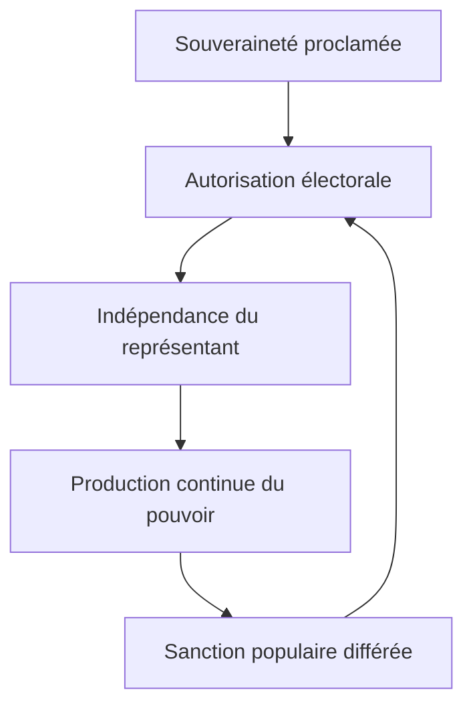

L’autre LLM a correctement identifié la supériorité du **veto endogène**, mais il commet à son tour une erreur : voulant restaurer la puissance de la V7, il propose de réintroduire des hypothèses insuffisamment démontrées — anesthésie, protection sociale pacificatrice, caste, verrou numérique — dans un article qui deviendrait de nouveau trop large.

Ce ne serait pas l’APEX. Ce serait une V7 mieux écrite, mais encore vulnérable.

L’APEX consiste à être plus accusatoire là où la preuve est forte, et impitoyablement restrictif là où elle ne l’est pas.

# Verdict directeur

La thèse la plus forte n’est pas :

> La démocratie française fonctionne mal.

Ni même :

> Le peuple ne possède pas assez de pouvoirs directs.

Mais :

> **La France appelle “souveraineté populaire” un régime dans lequel le peuple ne maîtrise ni l’initiative, ni l’agenda, ni la continuité, ni la révocation de ceux qui gouvernent en son nom. Il autorise le pouvoir ; il ne l’exerce presque jamais. Et il ne peut modifier cette dépossession sans l’accord de ceux qui en bénéficient.**

Ce n’est pas une simple insuffisance démocratique. C’est une contradiction constituante.

Le terme le plus précis n’est donc ni dictature, ni simulacre total, ni démocratie accomplie :

> **La France est un régime représentatif électif, doté de libertés et de contre-pouvoirs démocratiques, mais construit autour d’un noyau oligarchique : la production continue de la décision publique appartient à une minorité sélectionnée que le peuple ne peut ni instruire, ni révoquer, ni concurrencer directement.**

« Oligarchique » est ici employé au sens institutionnel : gouvernement effectif du petit nombre. Il ne présuppose ni complot, ni caste parfaitement coordonnée, ni corruption universelle.

# 1. Ce que l’audit adverse confirme

L’autre LLM a raison sur cinq points essentiels :

1. **L’inversion du mandat** est supérieure au « verrou sans pilote ».
2. **Le veto endogène** explique la reproduction du système.
3. **L’asymétrie de méfiance** est plus exacte que la confiance supposée dans la probité des élites.
4. Il existe des **pilotes successifs**, donc des responsabilités identifiables.
5. La puissance littéraire de la V7 doit être conservée.

Il a également raison de reprocher à ma proposition précédente son ton trop clinique. À force de prévenir toutes les objections, elle risquait de faire passer une anomalie constitutionnelle majeure pour une aimable imperfection du gouvernement représentatif.

Il faut donc durcir la conclusion, pas relâcher la preuve.

# 2. Ce que l’audit adverse propose à tort de réintroduire

## La protection sociale comme « verrou de confort »

Ce mécanisme n’est pas suffisamment démontré.

La protection sociale peut :

* réduire le coût humain des crises ;
* diminuer la conflictualité ;
* accroître l’autonomie matérielle ;
* permettre de faire grève ou de s’engager ;
* stabiliser le régime ;
* renforcer l’adhésion à l’État social.

Ces effets sont rivaux. Le chiffre de 31,5 % du PIB ne permet pas de décider entre eux.

Affirmer que la redistribution « achète l’absence de rupture » transforme une fonction stabilisatrice observable en intention politique globale non démontrée.

Cela mérite une enquête autonome. Pas le cœur de cet article.

## La « triade d’anesthésie »

La précarité réduit souvent le temps disponible. La saturation informationnelle fragmente l’attention. Certaines dépendances diminuent la capacité d’action individuelle.

Mais aucune preuve consolidée ne permet encore de les réunir dans une technologie politique cohérente de pacification.

La question est légitime :

> Pourquoi une population mécontente revendique-t-elle si rarement les instruments permanents de son propre pouvoir ?

La réponse « parce qu’elle est anesthésiée » n’est pas encore établie. D’autres explications existent :

* coût de l’action collective ;
* fragmentation des intérêts ;
* peur de perdre ce qui reste ;
* préférence pour la vie privée ;
* absence d’organisation ;
* sentiment d’inefficacité ;
* concurrence des urgences matérielles ;
* désaccord sur les solutions ;
* résignation rationnelle ;
* offre politique qui absorbe périodiquement la colère.

Réintroduire l’anesthésie affaiblirait l’article.

## La caste

La concentration sociale des postes de pouvoir, les filières de recrutement et le pantouflage sont documentables. Mais ils ne prouvent pas une volonté unifiée.

La formulation recevable est :

> **Le système ne sélectionne pas au hasard ceux auxquels il confie l’exercice de la souveraineté. Il favorise des groupes socialement étroits, disposant d’un accès continu aux institutions, à l’expertise et à la décision.**

La formulation irrecevable serait :

> Une caste coordonnée dirige l’ensemble du système.

Il faut étudier la **fermeture du recrutement**, pas postuler une conscience de classe parfaitement organisée.

## Le verrou numérique et le texte Miller

L’autre LLM reprend sans assez de prudence plusieurs éléments de la V7.

À la date du rapport :

* le texte Miller avait été adopté par les deux chambres le 21 juillet 2026 ;
* il avait été déféré au Conseil constitutionnel les 23 et 24 juillet ;
* il n’était donc pas encore exact de le traiter comme une loi promulguée ;
* le piratage allégué « en deux minutes » ne suffit pas à démontrer une architecture générale d’enclavement ;
* Chat Control, eIDAS, vérification d’âge et identité numérique relèvent de textes, de finalités et de niveaux juridiques différents.

Ce sujet peut produire un article puissant sur la conversion de la protection des mineurs en infrastructure d’identification. Il ne doit pas être greffé artificiellement à l’histoire de la représentation politique.

# 3. La thèse APEX

## Formulation courte

> **Le peuple français est souverain sans disposer des compétences ordinaires d’un souverain.**

## Formulation complète

> **Depuis 1789, la France a progressivement démocratisé la désignation des gouvernants sans démocratiser dans les mêmes proportions l’exercice du gouvernement. Le peuple a reçu le titre de souverain, puis le suffrage presque universel, mais il n’a acquis ni initiative législative nationale autonome, ni maîtrise de l’agenda, ni veto abrogatif général, ni révocation, ni mandat opposable, ni initiative constitutionnelle. Les représentants produisent librement la volonté nationale ; les représentés ne peuvent reprendre une partie de cette compétence qu’avec leur permission. Cette asymétrie fut consciemment instituée, socialement filtrée, administrativement centralisée, exécutivement renforcée, puis maintenue en connaissance de cause.**

## Formulation accusatoire

> **La République n’a pas seulement délégué le pouvoir du peuple : elle a désarmé le délégant. Elle a rendu le mandataire indépendant du mandant, puis le mandant dépendant du mandataire pour toute restitution de pouvoir.**

## Formulation historique

> **L’histoire démocratique française est moins celle d’une conquête continue de la souveraineté que celle d’un élargissement continu du corps électoral à l’intérieur d’une architecture représentative demeurée fermée à l’initiative populaire.**

## Formulation politique

> **Le citoyen français peut renverser périodiquement une équipe ; il ne peut presque jamais déclencher une décision nationale par lui-même. Il choisit les détenteurs du pouvoir sans pouvoir redéfinir unilatéralement les conditions de sa délégation.**

# 4. Le saut conceptuel : de la délégation à la conversion

Le mot « délégation » est encore trop favorable au régime.

Il suggère que le peuple possédait un pouvoir, l’a confié temporairement et pourrait le reprendre. Or l’architecture constitutionnelle réalise une opération plus profonde :

La souveraineté populaire est **convertie** :

* de pouvoir d’agir en pouvoir d’autoriser ;
* de compétence continue en intervention intermittente ;
* de commandement en sélection ;
* de contrôle présent en sanction future ;
* de droit de décision en droit de contestation ;
* de souveraineté constituante en dépendance envers les pouvoirs constitués.

Ce n’est pas seulement une délégation incomplète. C’est un changement de nature.

# 5. Les sept amputations opératoires

Le diagnostic doit reposer sur des compétences précises.

| Compétence souveraine                               | Situation nationale                   |
| --------------------------------------------------- | ------------------------------------- |
| Déposer directement une loi                         | Absente                               |
| Imposer son examen                                  | Absente                               |
| Déclencher un référendum sans relais institutionnel | Absente                               |
| Abroger directement une loi                         | Absente                               |
| Donner des instructions juridiquement opposables    | Interdite par le mandat représentatif |
| Révoquer un élu avant l’échéance                    | Absente                               |
| Engager directement une révision constitutionnelle  | Absente                               |

Le peuple dispose néanmoins :

* du suffrage ;
* des libertés d’opinion et d’organisation ;
* de la manifestation ;
* du recours juridictionnel ;
* de la sanction électorale ;
* de certains dispositifs de pétition et de consultation ;
* de la décision référendaire lorsque le référendum est convoqué.

Le verdict n’est donc pas « aucun droit ». Il est plus dur :

> **Le citoyen possède de nombreux moyens de parler, de protester et de choisir. Il possède très peu de moyens de commander.**

# 6. Le noyau oligarchique du régime représentatif

Il faut assumer ce mot, mais le définir.

L’élection possède deux faces :

* une face démocratique : tous les citoyens disposent théoriquement d’une voix égale ;
* une face oligarchique : seuls quelques individus sont sélectionnés pour gouverner librement pendant une durée déterminée.

Le suffrage universel démocratise la sélection. Il n’abolit pas la distinction entre gouvernants et gouvernés.

Le mandat libre approfondit cette distinction :

* l’électeur choisit ;
* l’élu décide ;
* la promesse n’est pas opposable ;
* la modification du programme n’est pas une faute juridique ;
* aucune révocation n’interrompt le mandat ;
* la sanction attend l’échéance et porte sur un bilan agrégé.

Ainsi :

> **L’élection ne fait pas gouverner le peuple. Elle démocratise la procédure par laquelle une minorité reçoit le droit de gouverner sans lui.**

Cette proposition est forte, mais soutenable.

# 7. L’intention : sortir du faux choix entre complot et accident

La bonne question n’est pas :

> Ont-ils tous voulu le résultat de 2026 ?

Évidemment non.

La question forensique est :

> À chaque étape, quels pouvoirs savaient-ils retirer, réserver ou concentrer ?

## 1789–1791

Les constituants savent qu’ils refusent :

* la législation populaire immédiate ;
* le mandat impératif ;
* l’exercice local ou sectionnaire de la souveraineté ;
* l’assimilation du représentant à un simple délégué révocable.

Ils ne conçoivent pas encore le résultat institutionnel de 2026. Mais ils conçoivent l’exclusion fonctionnelle qu’ils inscrivent.

## 1795

La protection de l’ordre, de la propriété et des catégories supposées compétentes devient explicite.

Ici, l’excuse des seules bonnes intentions ne tient plus.

## Bonaparte

La centralisation administrative et l’usage vertical de la ratification populaire sont intentionnels. Le peuple confirme ; le sommet formule.

## 1958

La restauration de la capacité gouvernementale et l’encadrement du Parlement sont intentionnels.

Le constituant ne cherche pas principalement à supprimer la démocratie. Mais il renforce les pouvoirs exécutifs sans équiper symétriquement les citoyens.

## 1962

L’élection présidentielle au suffrage universel donne davantage de poids au choix populaire tout en concentrant l’exercice autour d’une personne.

C’est une démocratisation de l’investiture et une verticalisation de la décision.

## 2000–2001

Les effets présidentialisants du quinquennat et de l’ordre du calendrier sont discutés avant leur adoption. Leur caractère prévisible interdit de les présenter comme une pure surprise institutionnelle.

## Aujourd’hui

L’insuffisance de l’initiative citoyenne n’est plus inconnue :

* le RIP a montré ses limites ;
* les rapports institutionnels les décrivent ;
* les demandes de RIC sont publiques ;
* les déséquilibres de la Cinquième République sont régulièrement analysés ;
* les propositions correctrices existent.

La maintenance contemporaine n’est donc plus innocente par ignorance.

> **Il n’existe pas de culpabilité transhistorique collective. Il existe une chaîne de responsabilités locales, dont les dernières agissent en pleine connaissance du problème.**

# 8. Le crime architectural : la méfiance unidirectionnelle

Les fondateurs avaient des raisons sérieuses de se méfier :

* des passions collectives ;
* des factions ;
* des intérêts locaux ;
* de l’instabilité ;
* des décisions irréversibles prises sous le coup de l’émotion ;
* de la captation d’un référendum ;
* de la fragmentation de la Nation.

Mais ils auraient dû appliquer la même anthropologie aux gouvernants.

Or l’architecture protège fortement le représentant contre :

* les instructions de l’électeur ;
* la révocation ;
* les intérêts locaux ;
* les changements immédiats de l’opinion ;
* la responsabilité juridique pour promesse non tenue.

Elle protège beaucoup moins le citoyen contre :

* l’autonomisation du représentant ;
* la discipline partisane ;
* les conflits d’intérêts ;
* les reniements ;
* la dilution de responsabilité ;
* la fermeture de l’offre électorale ;
* l’occupation continue de l’agenda par les groupes organisés.

Le vice constituant est donc clair :

> **Une anthropologie pessimiste fut appliquée au peuple ; une architecture beaucoup plus confiante fut appliquée à ceux qui parleraient en son nom.**

Ce n’est pas une simple surestimation morale des élites. C’est une distribution inégale des soupçons et des armes.

# 9. Le veto endogène : le verrou absolu

C’est la pièce maîtresse.

Pour introduire :

* une initiative citoyenne ;
* un référendum abrogatif ;
* une révocation ;
* une opposabilité procédurale des engagements ;
* une initiative de révision constitutionnelle ;

les citoyens doivent passer par les institutions qui perdraient une partie de leur monopole.

Le conflit d’intérêts est structurel, même lorsque les personnes sont honnêtes.

Un Parlement peut sincèrement juger une réforme dangereuse. Mais il est simultanément :

* juge de son utilité collective ;
* défenseur de l’équilibre institutionnel ;
* détenteur des prérogatives menacées ;
* gardien de la procédure de restitution.

> **Les gouvernants sont compétents pour décider si les gouvernés pourront les contraindre davantage.**

C’est ici que la tutelle se ferme sur elle-même.

# 10. Ce que l’état actuel de la France démontre réellement

L’état du pays ne prouve pas que tout aurait été planifié depuis 1789. Il prouve autre chose : **l’insuffisance des mécanismes de correction**.

Un pays peut accumuler :

* défiance politique ;
* affaissement des partis ;
* abstention ou volatilité ;
* contestations massives ;
* fragmentation parlementaire ;
* crise de représentation ;
* décisions rejetées mais juridiquement poursuivies ;
* dette et incapacité budgétaire ;
* dégradation de certains services publics ;
* sentiment de dépossession territoriale ;
* perte de lisibilité de la responsabilité ;

sans que le citoyen dispose d’un instrument autonome pour rouvrir la décision.

Le symptôme majeur n’est pas que les gouvernants se trompent. Tout gouvernement se trompe.

Le symptôme est que :

> **les erreurs durables n’entraînent pas automatiquement une restitution de pouvoir au souverain proclamé.**

La crise actuelle constitue donc un test de résistance du régime. Elle révèle que ses mécanismes de correction restent largement internes aux institutions qui ont produit ou laissé croître les problèmes.

# 11. 2005, 2018 et 2023 : les trois scènes probatoires

L’article ne doit pas accumuler vingt événements. Trois suffisent.

## 2005 — Le peuple tranche, mais ne maîtrise pas la suite

Le rejet du TCE produit son effet juridique : le traité n’entre pas en vigueur.

Mais une grande partie de sa substance est ensuite reprise dans un texte distinct et ratifiée par la voie parlementaire, sans nouveau référendum.

Le point démontré n’est pas « le vote a été annulé ».

Il est plus profond :

> **Le peuple peut fermer une voie déterminée sans contrôler la reformulation institutionnelle de ce qu’il a rejeté.**

## 2018–2019 — Le RIC surgit, mais le constituant reste fermé

Les Gilets jaunes font du RIC une revendication centrale. Le mouvement obtient des concessions économiques, mais aucun transfert durable d’initiative nationale.

Le régime montre sa perméabilité aux coûts sociaux et son imperméabilité à la redistribution des compétences.

> **La rue peut obtenir du contenu ; elle obtient beaucoup plus difficilement l’instrument.**

## 2023 — L’opposition sociale sans capacité de déclenchement

La réforme des retraites concentre :

* opposition syndicale ;
* manifestations ;
* opinion publique défavorable selon de nombreuses enquêtes ;
* procédures parlementaires contraintes ;
* usage du 49.3 ;
* contrôle juridictionnel ;
* promulgation finale.

Le cas ne prouve pas que la loi est illégitime par nature. Les sondages ne font pas la loi.

Il prouve que même une opposition sociale massive ne dispose d’aucun mécanisme institutionnel autonome permettant d’imposer un arbitrage populaire national.

> **Le peuple peut rendre une décision politiquement coûteuse ; il ne peut pas se saisir juridiquement de la décision.**

# 12. Strates secondaires : comment le noyau est amplifié

L’article peut conserver les strates, mais en trois catégories.

## Strates constitutives

Elles produisent directement la dépossession :

* mandat libre ;
* initiative réservée ;
* absence de révocation ;
* absence de référendum citoyen autonome ;
* absence d’initiative constitutionnelle.

## Strates amplificatrices

Elles augmentent les asymétries d’accès :

* sélection partisane ;
* professionnalisation politique ;
* centralisation administrative ;
* concentration sociale des postes ;
* accès différentiel au lobbying et à l’expertise ;
* concentration de certains médias ;
* coût financier de la compétition électorale ;
* éloignement multiniveau de la décision européenne.

## Strates absorbantes

Elles recueillent le mécontentement sans transférer nécessairement le dernier mot :

* consultations ;
* pétitions ;
* conventions ;
* grands débats ;
* concertations ;
* certaines formes de participation locale ou sectorielle.

Cette typologie évite de prétendre que tout procède d’une même intention.

# 13. Les contre-pouvoirs ne réfutent pas la thèse

La presse, les syndicats, les associations, les manifestations, les juges, la QPC, la décentralisation et les alternances ne sont pas des décors.

Mais il faut distinguer leurs fonctions :

| Contre-pouvoir   | Ce qu’il permet                                                      | Ce qu’il ne donne pas                           |
| ---------------- | -------------------------------------------------------------------- | ----------------------------------------------- |
| Presse           | Enquêter, exposer, modifier l’agenda                                 | Décider                                         |
| Syndicat         | Organiser un rapport de force                                        | Légiférer directement                           |
| Manifestation    | Augmenter le coût politique                                          | Imposer juridiquement un arbitrage              |
| Juge             | Contrôler la légalité et certains droits                             | Choisir la politique générale                   |
| QPC              | Obtenir l’abrogation d’une disposition contraire aux droits garantis | Abroger une loi pour désaccord politique        |
| Décentralisation | Déplacer certaines compétences                                       | Donner l’initiative nationale aux citoyens      |
| Alternance       | Remplacer les gouvernants                                            | Modifier automatiquement la structure du mandat |

Ces contre-pouvoirs rendent le régime pluraliste et perméable. Ils ne rendent pas le peuple souverain de manière opératoire.

# 14. Le titre APEX

## Proposition principale

# **LE SOUVERAIN DÉSARMÉ**

### **Enquête sur la République qui donne le pouvoir au peuple — à condition qu’il ne puisse pas s’en servir**

Le sous-titre est volontairement accusatoire. Il devra être démontré, pas seulement proclamé.

## Alternatives

* **Le peuple sous tutelle**
* **Qui autorise le souverain ?**
* **Le pouvoir sans le peuple**
* **La démocratie à sens unique**
* **La République des mandataires**
* **Le peuple hors pouvoir**
* **Le Golem et son souverain**
* **Élections libres, souveraineté captive**
* **Autoriser n’est pas gouverner**
* **La souveraineté interdite d’initiative**

Le meilleur titre littéraire reste **Le souverain désarmé**.

Le Golem peut subsister comme image, mais pas comme concept directeur. Il évoque une créature échappant à ses créateurs ; l’enquête démontre plutôt une institution assemblée par des auteurs successifs et activement entretenue.

# 15. Architecture définitive de l’article

## Prologue — Un million de souverains impuissants

Expérience concrète : que peuvent juridiquement déclencher un million de Français ?

## I — Le mensonge exact de la Constitution

Non pas un mensonge factuel, mais une vérité tronquée : le peuple est titulaire, les institutions exercent.

## II — 1789 : l’émancipation et la dépossession dans le même geste

La Révolution détruit la souveraineté dynastique et réserve simultanément son exercice.

## III — La méfiance faite droit

Division du travail, compétence et stabilité ; puis filtre social, propriété et peur populaire.

## IV — Le peuple devient électeur, jamais législateur

1848, universalisation du suffrage, femmes, libertés politiques : démocratisation réelle, restitution inachevée.

## V — La République représentative révèle son noyau oligarchique

Élection démocratique, exercice minoritaire, mandat libre et non-révocabilité.

## VI — 1958 : l’État reçoit les moyens de gouverner

Rationalisation, exécutif, présidentialisation, fait majoritaire et calendrier.

## VII — Trois preuves contemporaines

2005, Gilets jaunes, retraites 2023.

## VIII — Parler sans commander

Pétitions, consultations, conventions, RIP et autres sas.

## IX — Le gardien possède la clé de sa propre cage

Le veto endogène et le conflit d’intérêts constitutionnel.

## X — Les amplificateurs

Partis, administration, recrutement social, intérêts organisés, médias et dilution européenne.

## XI — Ce qui résiste encore

Libertés, juges, mobilisations, alternances et victoires sociales : véritables contre-pouvoirs, pas souveraineté opératoire.

## Conclusion — Rendre au souverain le pouvoir de se saisir lui-même

Définir le minimum constitutionnel.

# 16. Ouverture proposée

> **Prenons un million de citoyens français.**
>
> Ils peuvent manifester, pétitionner, créer un parti, financer une campagne, saisir certaines juridictions et attendre l’élection suivante. Mais ils ne peuvent, de leur propre autorité, déposer une loi nationale, en imposer l’examen, convoquer un référendum, abroger une norme, révoquer un élu ou engager une révision de la Constitution. Dix millions ne le pourraient pas davantage. Leur nombre n’est pas juridiquement décisif. Il leur manque l’autorisation d’un organe constitué.
>
> Pourtant, la Constitution les déclare souverains.
>
> Ce paradoxe n’est pas une imperfection périphérique. Il est au cœur de la République représentative française. Le peuple fournit la légitimité, choisit périodiquement ceux qui gouvernent et peut parfois les congédier. Mais l’initiative, l’agenda, la formulation et la continuité de la décision appartiennent aux institutions. Le souverain est convoqué ; il ne peut pas se convoquer lui-même.
>
> La France n’a donc pas seulement organisé une délégation. Elle a désarmé le délégant. Le représentant est indépendant de l’électeur ; l’électeur dépend du représentant pour obtenir le droit de le contraindre. Ce verrou n’est ni une dérive récente, ni l’œuvre d’une caste réunie dans une pièce depuis 1789. Il fut assemblé par des bâtisseurs successifs qui connaissaient la fonction des pièces qu’ils ajoutaient : empêcher la décision populaire immédiate, sélectionner les gouvernants, centraliser l’action, stabiliser l’exécutif, discipliner le Parlement. Aucun n’a conçu seul le résultat présent. Tous ne poursuivaient pas la même fin. Mais le résultat est là : le peuple peut changer les gardiens ; il ne possède toujours pas la clé.

# 17. Conclusion proposée

> Le problème français n’est pas seulement que les gouvernants gouvernent mal, renient parfois leurs engagements ou protègent leurs intérêts. Aucun régime ne supprimera l’erreur, le mensonge, la compétence inégale ou le conflit d’intérêts.
>
> Le problème est qu’après deux siècles d’élargissement du suffrage, le citoyen demeure privé des instruments lui permettant de rouvrir lui-même une décision, de forcer un arbitrage ou de réviser les conditions de sa délégation. Il peut parler sans être suivi, protester sans déclencher, choisir sans instruire et sanctionner lorsque le mandat est déjà consommé.
>
> Cette architecture fut longtemps défendue au nom de la stabilité, de la compétence et de l’unité nationale. Elle produit désormais l’inverse de ce qu’elle promettait : irresponsabilité diluée, défiance, impuissance publique et recherche permanente d’un nouveau sauveur électoral. À force de protéger le gouvernement contre le peuple, elle a fini par priver le gouvernement de la confiance dont il a besoin pour agir.
>
> Un peuple souverain ne doit pas gouverner chaque décision, chaque jour. Mais il doit pouvoir se saisir lui-même lorsqu’une rupture majeure l’exige. Tant qu’il devra demander aux détenteurs du pouvoir l’autorisation de récupérer une part de son propre pouvoir, sa souveraineté restera ce qu’elle est aujourd’hui : un titre constitutionnel sans maîtrise de ses conditions d’exercice.
>
> **La France n’est pas une démocratie sans élections. Elle est une souveraineté sans souverain.**

# 18. Discipline éditoriale

Pour atteindre réellement l’APEX :

* aucune donnée d’actualité simplement décorative ;
* aucun chiffre sans dénominateur ;
* aucune causalité psychologique induite d’une corrélation ;
* aucun « tout », « jamais » ou « aucun » lorsqu’un contre-exemple existe ;
* chaque concession doit servir à isoler le noyau irréfutable ;
* chaque responsabilité doit être rattachée à un acteur, un texte et une compétence ;
* chaque strate doit être qualifiée : constitutive, amplificatrice ou absorbante ;
* les contre-pouvoirs doivent être reconnus avant d’en mesurer la limite ;
* la conclusion normative doit découler des sept compétences testées ;
* la violence verbale doit porter sur l’architecture démontrée, jamais compenser une preuve absente.

La prudence n’est pas le contraire de la force. Mais ici, la prudence précédente masquait parfois la gravité du résultat. La formulation APEX doit assumer le constat :

> **Le régime français ne se contente pas de représenter le peuple. Il conserve contre lui le monopole des moyens par lesquels cette représentation pourrait être rendue contraignante, corrigée ou révoquée.**

C’est la charge la plus dure que les pièces permettent de soutenir sans falsification.
