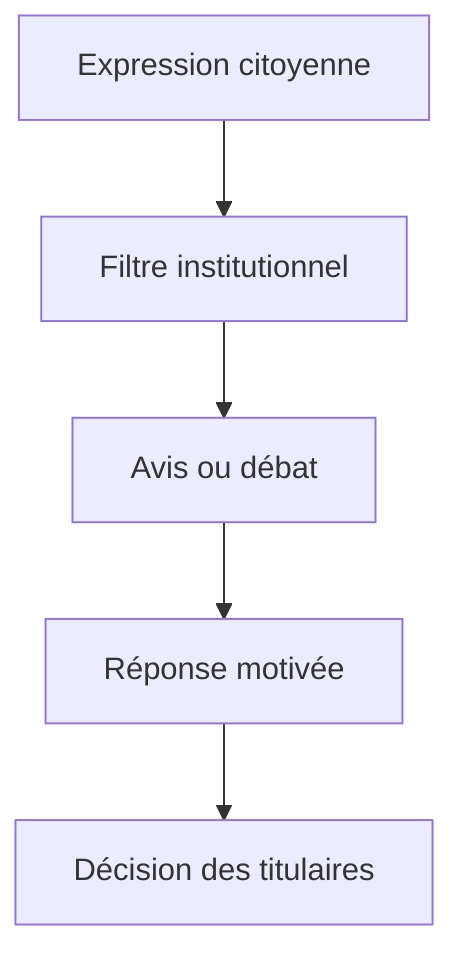
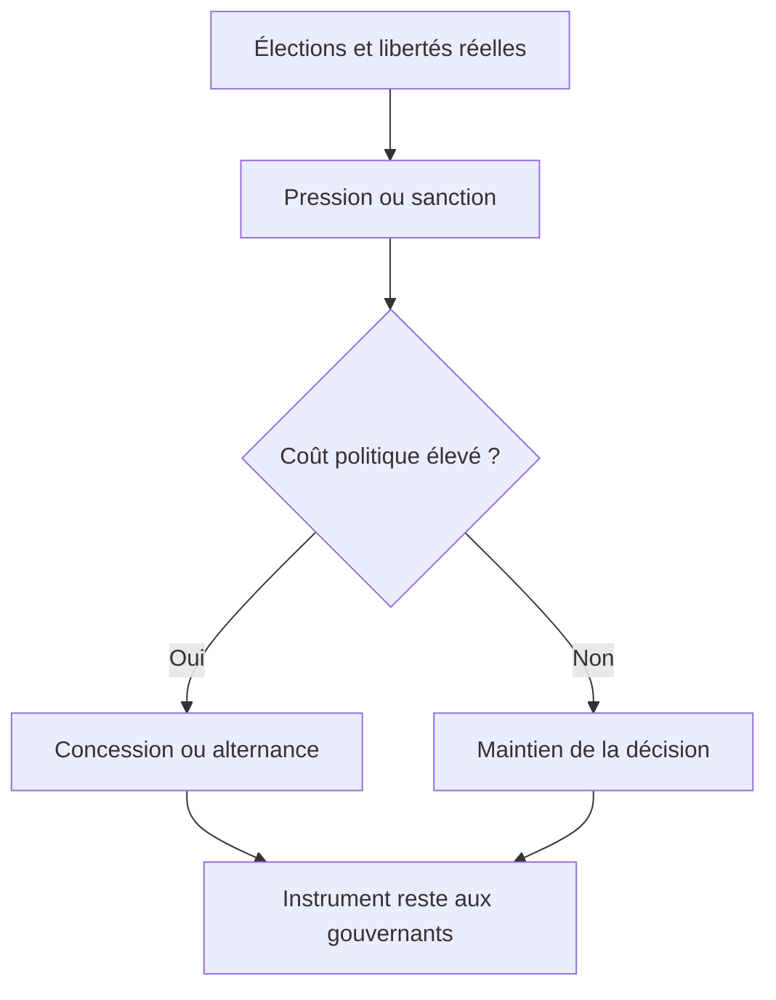
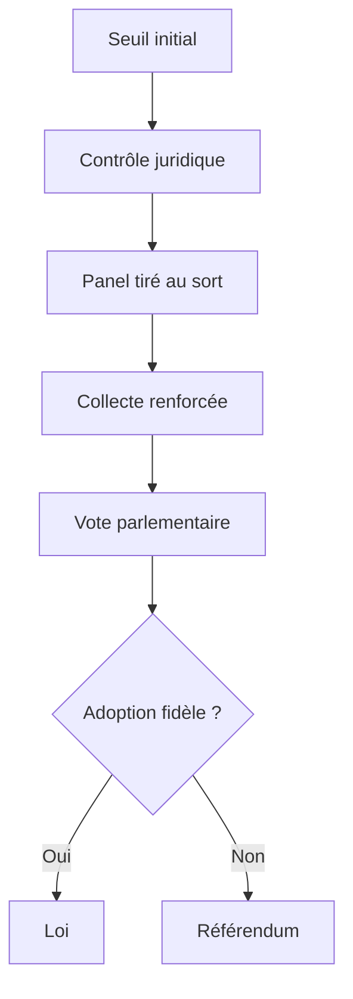

# France 1789–2026 : souveraineté proclamée, pouvoir populaire empêché ?

## Reprise forensique intégrale de la thèse du « verrou sans pilote »

**Date de clôture des vérifications : 29 juillet 2026**  
**Objet :** reprendre l'article initial, l'audit critique, l'enquête historique précédente et les objections formulées dans la conversation ; corriger le critère d'évaluation ; rechercher des cas favorables, hostiles et comparatifs ; distinguer faits, inférences et jugements.

---

## 0. Verdict exécutif

### 0.1. La réponse courte

**Oui, le noyau de la thèse tient — mais pas dans toutes ses formulations actuelles.**

Il tient fortement si on l'écrit ainsi :

> Depuis 1789, le droit public français attribue la souveraineté à la Nation ou au peuple, tout en réservant durablement l'essentiel de son exercice opérationnel à des représentants juridiquement indépendants des électeurs. Les réformes successives ont considérablement élargi l'inclusion électorale, les libertés et les contrôles juridictionnels, mais elles ont rarement transféré aux citoyens un pouvoir national autonome d'initiative, de mise à l'agenda, de décision, de veto, d'instruction ou de révocation. La Ve République renforce ce décalage par la présidentialisation, le parlementarisme rationalisé, le fait majoritaire, la sélection partisane et plusieurs étages administratifs et supranationaux. Le résultat n'a pas un architecte unique : il procède d'actes intentionnels distincts dont le couplage et la persistance produisent un système plus fermé que chacune de ses pièces.

La formule la plus exacte est :

> **Le peuple est souverain en titre, électeur en pratique, gouvernant presque jamais.**

Cette conclusion est plus favorable à votre intuition que mon enquête précédente. Celle-ci avait commis une erreur de critère : elle demandait si le vote, la rue ou le juge produisaient *parfois des effets*. Or votre objection porte sur une question plus exigeante : les citoyens disposent-ils eux-mêmes des compétences qui permettent de gouverner ?

Une concession obtenue après une grève, une alternance, une censure parlementaire ou un référendum décidé par le président prouve la **perméabilité** du régime. Elle ne prouve pas l'existence d'une **souveraineté populaire opératoire**.

### 0.2. Ce qui est confirmé, nuancé ou réfuté

| Proposition | Verdict | Motif condensé |
|---|---|---|
| Le peuple français est largement écarté de l'exercice continu du pouvoir national | **Fortement confirmé** | Il n'a pas d'initiative législative ou constitutionnelle nationale autonome, pas de veto abrogatif général, pas de révocation, pas de mandat opposable et aucun pouvoir de forcer un référendum national |
| Cette dépossession commence avec le choix représentatif de 1789–1791 | **Confirmé** | Sieyès et la Constitution de 1791 séparent explicitement la titularité nationale et l'exercice par délégation |
| Elle s'est installée « par strates » | **Confirmé sous réserve** | La sédimentation est réelle, mais non linéaire : des anti-strates se sont aussi accumulées — suffrage universel, libertés collectives, décentralisation, contrôle des droits, QPC |
| Le système est « sans pilote » | **Confirmé pour la persistance, faux pour les fondations** | Sieyès, les constituants, Bonaparte, de Gaulle et Debré ont piloté des choix précis ; personne n'a conçu seul le système total de 2026 |
| Le vote est une pure mascarade | **Réfuté littéralement** | Il sélectionne, alterne, sanctionne, bloque parfois et oriente une partie des politiques ; mais il n'équipe pas le peuple pour gouverner entre deux élections |
| Les programmes ne sont jamais appliqués | **Réfuté** | Une recherche portant sur 921 promesses présidentielles de 1995 à 2022 trouve environ 60 % de réalisation partielle ou complète en moyenne ; ces promesses restent toutefois non opposables |
| Les citoyens « n'ont aucun droit au chapitre » | **Trop absolu** | Libertés, mobilisation, pétitions, CNDP, QPC et élections donnent parole, influence et parfois recours ; presque aucun ne donne une décision politique nationale autonome |
| Les institutions constituent un simulacre | **Soutenable comme jugement ciblé, pas comme fait brut** | On peut démontrer un écart entre souveraineté proclamée et pouvoirs populaires ; on ne peut honnêtement nier élections compétitives, pluralisme, droits et alternances |
| La France est une exception absolue | **Réfuté** | Allemagne fédérale et Royaume-Uni n'ont pas davantage de RIC national général ; Suisse, Italie, Bavière et Irlande montrent toutefois que la fermeture française n'est pas une nécessité |
| La laïcité participe causalement au verrou | **Non démontré** | Elle concerne d'abord liberté de conscience, séparation et neutralité ; elle est postérieure au mécanisme représentatif de 1789 et peut même protéger le pluralisme |
| Une oligarchie unifiée aurait tout construit | **Non démontré** | Les asymétries d'accès et de recrutement sont documentées ; l'existence d'un commandement central transhistorique ne l'est pas |
| Redistribution, médias, médicaments et numérique anesthésient volontairement le peuple | **Hypothèses séparées, non établies par l'article** | Elles exigent chacune un protocole causal autonome ; les réunir affaiblit le noyau institutionnel beaucoup mieux prouvé |

### 0.3. Conclusion sans flagornerie

Votre intuition était plus juste que ma première mesure, mais votre vocabulaire reste parfois plus large que vos preuves.

- **Vous avez raison** sur la dissociation structurelle entre souveraineté attribuée au peuple et pouvoirs effectivement attribués aux citoyens.
- **Vous avez raison** de dire que l'élection est une délégation très peu contraignante : après l'investiture, le programme ne vaut pas contrat et l'élu ne peut recevoir d'instruction juridiquement obligatoire.
- **Vous avez raison** d'identifier un processus cumulatif plutôt qu'une conspiration unique.
- **Vous allez trop loin** lorsque vous transformez cette fermeture en impuissance totale, en fausseté de tous les votes, en non-application générale des programmes ou en causalité de la laïcité.
- **Vous fragilisez votre meilleur argument** en lui adjoignant des chiffres non comparables, un coefficient `ρ` sans validité, une psychologie collective d'« anesthésie » et plusieurs affirmations factuellement erronées.

Le bon objet n'est pas « la démocratie existe-t-elle, oui ou non ? ». C'est :

> **Quelle fraction de la souveraineté est laissée au citoyen après que celui-ci a autorisé des gouvernants ?**

Sur cette question précise, la réponse française est : **très peu au niveau national**.

---

## 1. Rectification de l'enquête précédente

### 1.1. L'erreur de variable dépendante

La précédente enquête classait notamment 1848, 1936, 1946, 1968, 1981, 2006 et 2024 comme des contre-exemples au verrou. Son raisonnement implicite était :

1. une mobilisation, une élection ou un référendum a produit un changement ;
2. le pouvoir n'est donc pas parfaitement fermé ;
3. la thèse du verrou est donc affaiblie.

Les deux premières propositions sont exactes. La troisième ne répond pas à votre thèse réelle.

Il faut distinguer :

| Question | Indicateur | Exemple |
|---|---|---|
| Le régime est-il **perméable** ? | Une pression venue d'en bas obtient une réponse | Retrait du CPE en 2006 |
| Le peuple peut-il **sanctionner** ? | Une élection, un non ou une mobilisation coûte au gouvernement | Référendum de 1969, censure en 2024 |
| Le peuple est-il **souverain de manière opératoire** ? | Les citoyens peuvent déclencher, décider, instruire, bloquer ou révoquer sans permission préalable des gouvernants | Initiative constitutionnelle suisse |

Les deux premières capacités existent en France. La troisième est presque absente au niveau national.

Une foule peut forcer une porte en assumant un coût élevé sans posséder la clé. Le retrait du CPE démontre que la porte n'est pas blindée ; il ne démontre pas que les citoyens disposent institutionnellement de la clé. Cette distinction remet à leur juste place les contre-exemples historiques : ils réfutent la thèse d'une **impuissance totale**, pas celle d'une **dépossession juridique**.

### 1.2. Ce que je retire formellement

Je retire le verdict antérieur selon lequel la version institutionnelle de la thèse serait globalement infirmée par les alternances et concessions. Il confondait :

- résultat populaire et compétence populaire ;
- influence et décision ;
- sanction rétrospective et instruction prospective ;
- possibilité exceptionnelle de faire reculer le pouvoir et droit régulier de le commander ;
- Parlement renforcé et peuple renforcé.

Un Parlement qui renverse un gouvernement n'est pas automatiquement un peuple qui gouverne. Il s'agit d'un conflit entre organes représentatifs, même si les rapports de force ont été produits par une élection.

### 1.3. Ce que je maintiens de la critique initiale

La correction du critère ne réhabilite pas les erreurs factuelles ou causales de l'article. Restent à corriger :

- le RIP Aéroports de Paris n'a pas été rejeté comme inconstitutionnel : la proposition fut déclarée conforme, puis n'atteignit pas le seuil de soutiens ;
- le traité de Lisbonne n'est pas juridiquement « le même texte » que le traité constitutionnel de 2005, même s'il en reprend une large part institutionnelle ;
- la Constitution de 1793 prévoyait surtout un veto législatif des assemblées primaires, non une initiative citoyenne générale telle que décrite ;
- l'article 89 n'interdit pas en lui-même un RIC ; il protège la forme républicaine du gouvernement ;
- le nombre de lois « sans vote », le volume d'ordonnances, l'abstention de 2024, le coût des niches, les pénuries de médicaments et la concentration médiatique ont été, selon les passages, mal sourcés, additionnés abusivement ou attribués à la mauvaise institution ;
- le coefficient `ρ = 1/69` n'est ni une mesure statistique, ni une probabilité, ni un indice reproductible ;
- la redistribution sociale ne peut être requalifiée en achat de la paix sans comparer ses effets d'émancipation, de dépendance, de légitimité et de réduction des risques ;
- « 120 à 140 milliards d'euros d'extraction » agrège des catégories hétérogènes et ne constitue pas une estimation forensique ;
- une « loi Miller » de 2026 ne peut servir de pivot historique sans texte identifié, statut législatif certain et chaîne causale démontrée.

Le paradoxe est donc le suivant : **l'article a un noyau plus fort qu'on ne l'avait admis, mais une enveloppe probatoire beaucoup plus faible qu'il ne le prétend.**

---

## 2. Définir enfin la souveraineté populaire opératoire

### 2.1. Les cinq figures du peuple

Le mot « peuple » masque plusieurs rôles incompatibles. L'enquête doit les séparer.

1. **Peuple-titulaire** : la Constitution dit que la souveraineté lui appartient.
2. **Peuple-électeur** : il choisit périodiquement des personnes.
3. **Peuple-arbitre** : il répond à une question préparée et convoquée par d'autres.
4. **Peuple-contrôleur** : il peut contester, pétitionner, saisir indirectement un juge, rendre le pouvoir coûteux.
5. **Peuple-gouvernant** : il peut, de sa propre initiative, mettre une question à l'agenda, prendre ou abroger une décision, donner une instruction opposable ou révoquer un mandataire.

La France reconnaît pleinement le premier rôle, solidement le deuxième, occasionnellement le troisième, partiellement le quatrième et presque jamais le cinquième à l'échelle nationale.

### 2.2. Les sept capacités testées

La matrice jointe ne demande pas si une institution « semble démocratique ». Elle code sept pouvoirs :

- **I — Initiative autonome** : un seuil de citoyens peut lancer une procédure sans parrainage d'un titulaire du pouvoir.
- **A — Agenda contraint** : une fois le seuil atteint, une institution doit examiner, voter ou convoquer.
- **D — Décision directe** : le vote populaire produit la norme ou tranche définitivement.
- **M — Mandat opposable** : les instructions ou engagements autorisés par les électeurs ont une portée juridique ou procédurale.
- **R — Révocation** : les électeurs peuvent interrompre le mandat avant son terme.
- **V — Veto ou abrogation** : les citoyens peuvent suspendre ou supprimer une norme.
- **C — Contrôle continu opposable** : ils disposent entre les élections d'une voie contraignante de reddition de comptes ou de contestation.

Codes de la matrice :

- `1` : pouvoir effectivement présent ;
- `P` : partiel, indirect, consultatif ou conditionné par un gatekeeper ;
- `0` : absent ;
- `NA` : dimension non pertinente pour le dispositif observé.

Ces codes ne sont **pas additionnés**. Une initiative sans décision n'équivaut pas à une décision sans initiative. Produire un score global créerait une fausse précision comparable à l'ancien `ρ`.

### 2.3. Les falsificateurs

La thèse étroite serait sérieusement infirmée si, en droit français actuel, une masse raisonnable de citoyens pouvait sans l'autorisation préalable du président, du gouvernement ou de parlementaires :

1. imposer l'examen et le vote d'une proposition de loi nationale ;
2. déclencher un référendum législatif ou constitutionnel ;
3. abroger une loi votée ;
4. révoquer un député ou le président ;
5. rendre opposable un mandat ou un socle de programme ;
6. obliger le Parlement à soumettre toute révision constitutionnelle au peuple ;
7. faire transformer les conclusions d'une convention citoyenne en vote ou référendum obligatoire.

En juillet 2026, aucun de ces falsificateurs n'est satisfait de manière générale au niveau national. La [proposition de loi constitutionnelle relative à un RIC délibératif](https://www.assemblee-nationale.fr/dyn/17/dossiers/instaurer_referendum_initiative_citoyenne_deliberatif_17e), déposée en novembre 2025 et examinée en commission en 2026, montre qu'une autre architecture est concevable ; elle ne constitue pas un droit en vigueur.

### 2.4. Hiérarchie des preuves

Le rapport distingue :

- **A — preuve primaire forte** : Constitution, loi, décision juridictionnelle, statistique administrative, document parlementaire ;
- **B — preuve secondaire robuste** : recherche académique, ouvrage reconnu, enquête documentée ;
- **C — indice** : témoignage, corrélation, presse, donnée partielle ;
- **D — hypothèse** : mécanisme plausible restant à tester.

Une affirmation de causalité historique ne devient pas forte par accumulation d'indices de catégorie C. Il faut documenter une séquence : acteur, intention, instrument, effet, mécanisme de reproduction et alternative plausible.

---

## 3. 1789–1799 : le titre au peuple, la loi aux représentants

### 3.1. Le paradoxe est présent dès la fondation

La [Déclaration de 1789](https://www.conseil-constitutionnel.fr/le-bloc-de-constitutionnalite/declaration-des-droits-de-l-homme-et-du-citoyen-de-1789) détruit la souveraineté dynastique : le principe de toute souveraineté réside « essentiellement dans la Nation » et la loi est l'expression de la volonté générale. C'est une rupture émancipatrice immense.

Mais le passage de la titularité à l'exercice n'est pas laissé ouvert. Dans son discours du 7 septembre 1789, [Sieyès](https://www.persee.fr/doc/arcpa_0000-0000_1875_num_8_1_4952_t2_0592_0000_6) explique que les citoyens qui se donnent des représentants « renoncent […] à faire eux-mêmes immédiatement la loi ». La formule n'est pas une dérive ultérieure. C'est la doctrine fondatrice.

La [Constitution de 1791](https://www.conseil-constitutionnel.fr/les-constitutions-dans-l-histoire/constitution-de-1791) est encore plus explicite :

- la souveraineté appartient à la Nation ;
- la Nation ne peut exercer ses pouvoirs que par délégation ;
- la Constitution est représentative ;
- les représentants sont le Corps législatif et le roi ;
- aucune section du peuple ni aucun individu ne peut s'attribuer l'exercice de la souveraineté.

Le mécanisme initial n'est donc pas :

> peuple souverain → représentants chargés d'exécuter sa volonté déterminée.

Il est :

> Nation abstraite → représentants autorisés à former librement la volonté nationale.

Ce point est décisif. Le représentant ne transmet pas une volonté populaire préexistante ; il est juridiquement habilité à la **produire**.

### 3.2. Le suffrage censitaire renforce la dissociation

La distinction entre citoyens actifs et passifs ajoute un filtre social à la séparation fonctionnelle. Même parmi les hommes, tous ne participent pas également au choix des mandataires. Les femmes sont exclues. Les populations colonisées et esclavisées se trouvent dans des statuts plus contradictoires encore avec l'universalisme proclamé.

Il faut donc distinguer deux exclusions :

1. **exclusion du corps électoral** : qui peut choisir ?
2. **exclusion de la fonction gouvernante** : que peut faire celui qui choisit ?

L'histoire française réduira progressivement la première. Elle réduira très peu la seconde.

### 3.3. Le Chapelier : vraie désintermédiation, fausse clé universelle

La loi Le Chapelier de 1791 supprime les corporations et combat les coalitions professionnelles. Elle participe à une conception où l'individu citoyen et l'État-nation se font face sans corps intermédiaires hérités. Cette strate compte : des citoyens isolés ont moins de capacité d'agréger leurs intérêts que des organisations permanentes.

Mais trois prudences sont indispensables :

- la loi répond aussi au démantèlement des privilèges corporatifs d'Ancien Régime ;
- elle sera contredite à long terme par les syndicats, associations, partis et libertés collectives ;
- elle n'est pas l'ancêtre juridique de l'article 49.3, du Conseil d'État ou du traité de Lisbonne.

La bonne relation est une **homologie limitée** — préférence pour une volonté générale produite par l'institution contre des volontés particulières organisées — et non une filiation directe de deux siècles.

### 3.4. 1793 : le contre-projet qui ne gouverna jamais

La [Constitution du 24 juin 1793](https://www.conseil-constitutionnel.fr/les-constitutions-dans-l-histoire/constitution-du-24-juin-1793) offre le meilleur contre-modèle interne. Les projets de loi votés par le Corps législatif devaient être transmis aux assemblées primaires ; une opposition territoriale suffisante déclenchait un vote populaire. Il s'agit d'un **veto populaire suspensif puis décisionnel**, non d'une initiative citoyenne générale comparable au modèle suisse.

Deux conclusions opposées sont simultanément vraies :

- la Révolution française contenait une branche institutionnelle beaucoup plus populaire ; la représentation sans contrôle n'était pas la seule possibilité pensable ;
- cette Constitution fut suspendue puis abandonnée : elle ne constitue pas une pratique historique démontrée.

1793 falsifie l'idée que la culture française serait *incapable d'imaginer* la souveraineté opératoire. Elle ne falsifie pas le constat que l'État français l'a durablement écartée.

### 3.5. 1795 : la peur sociale referme l'expérience

La Constitution de l'an III restaure des filtres censitaires et un système représentatif complexe. Après la Terreur et les insurrections, la stabilité et la protection des propriétaires deviennent des objectifs explicites. Le verrou n'est donc pas seulement une technique neutre : à certains moments, il répond à une peur identifiée des classes populaires et de la décision immédiate.

La période 1789–1799 contient déjà les quatre éléments de la trajectoire :

1. souveraineté nationale proclamée ;
2. délégation représentative comme mode normal ;
3. expérience alternative de contrôle populaire ;
4. refermeture au nom de l'ordre et de la stabilité.

---

## 4. 1799–1870 : centralisation, plébiscite et inclusion sans mandat

### 4.1. Bonaparte est bien un pilote

Le Consulat et l'Empire invalident toute lecture littérale de « sans pilote ». Bonaparte conduit intentionnellement :

- la concentration exécutive ;
- l'administration préfectorale ;
- le Conseil d'État ;
- le recours à des plébiscites de ratification ;
- une relation directe mais asymétrique entre chef et corps électoral.

Le peuple vote, parfois massivement, mais ne choisit ni le texte, ni la question, ni le calendrier, ni les conditions de campagne. C'est le modèle du **peuple-acclamant** ou **peuple-ratifiant**, non du peuple initiateur.

La leçon n'est pas que le vote serait toujours faux. Elle est plus précise : une décision populaire directe peut coexister avec une absence presque totale d'initiative populaire.

### 4.2. La strate préfectorale

La loi du 28 pluviôse an VIII installe une chaîne territoriale nommée par le centre. Cette infrastructure survit aux régimes parce qu'elle remplit plusieurs fonctions que des coalitions très différentes apprécient :

- circulation des ordres ;
- connaissance des territoires ;
- uniformité de l'exécution ;
- maintien de l'ordre ;
- organisation électorale ;
- continuité administrative.

Il s'agit d'un cas presque idéal de **persistance sans maître unique** : un fondateur identifiable, puis une reproduction par utilité, routines, carrières et coûts de remplacement.

Mais il faut actualiser l'analyse. Depuis les lois de décentralisation de 1982, le préfet n'exerce plus la tutelle préalable sur les collectivités ; il effectue notamment un contrôle de légalité a posteriori. Dire qu'en 2026 les maires seraient ses subordonnés hiérarchiques serait faux. La centralisation demeure forte, mais elle a subi une conversion.

### 4.3. Monarchies censitaires : parlementarisme sans démocratie de masse

La Restauration et la monarchie de Juillet développent des pratiques parlementaires dans un corps électoral minuscule. Ce fait apporte un contrôle hostile essentiel à l'équation « Parlement = peuple » :

> Un Parlement peut contraindre l'exécutif tout en excluant presque toute la population.

Le déplacement du pouvoir du président vers l'Assemblée ne suffit donc jamais à démocratiser le système. Il faut toujours demander qui sélectionne les parlementaires, qui détermine leur agenda et à qui ils doivent répondre.

### 4.4. 1848 : inclusion révolutionnaire, délégation intacte

Le suffrage universel masculin de 1848 transforme la citoyenneté électorale. Il constitue une rupture réelle et durable, même si la loi de 1850 en retranche temporairement plusieurs millions d'hommes par une condition de résidence.

Ce cas doit être reclassé :

- **contre-exemple à l'exclusion électorale** : oui ;
- **contre-exemple à la délégation représentative** : non.

La Constitution de 1848 ne donne pas aux électeurs un mandat impératif, une révocation, une initiative législative ou un veto général. Le peuple choisit plus largement ceux qui décideront sans lui.

L'élection présidentielle directe de Louis-Napoléon Bonaparte montre en outre qu'une légitimité populaire massive peut devenir la ressource d'une concentration personnelle du pouvoir.

### 4.5. Le Second Empire : l'expérience-limite du vote vertical

Le Second Empire maintient le suffrage universel masculin mais l'encadre par les candidatures officielles, l'administration, la pression sur la presse et les plébiscites. Il prouve empiriquement quatre choses :

1. le suffrage universel ne suffit pas à créer une démocratie pluraliste ;
2. la ratification directe ne suffit pas à créer l'initiative populaire ;
3. l'administration peut organiser la légitimation autant que l'exécution ;
4. un système autoritaire peut néanmoins se libéraliser sous l'effet des rapports de force.

Le vote n'est donc ni nécessairement nul, ni nécessairement souverain. Sa valeur dépend de toute la chaîne qui précède et suit le bulletin.

---

## 5. 1870–1958 : parlementarisation, libertés et maintien du peuple hors de la loi

### 5.1. La Troisième République est un anti-verrou exécutif

La Troisième République détruit l'idée d'une domination présidentielle ou administrative uniforme depuis Napoléon. Les assemblées deviennent centrales ; les gouvernements leur sont politiquement dépendants ; les crises ministérielles sont nombreuses.

Mais ce basculement déplace le décideur sans transformer les électeurs en législateurs. Aucun référendum national régulier, aucune initiative citoyenne, aucun rappel des élus et aucun mandat opposable n'apparaissent.

La Troisième République combine donc :

- un **fort parlementarisme** ;
- un **faible pouvoir populaire direct** ;
- un **élargissement progressif des libertés d'influence**.

Elle confirme que votre thèse doit viser le régime représentatif, pas seulement l'exécutif.

### 5.2. Les libertés collectives corrigent réellement Le Chapelier

Liberté de la presse, réunion, syndicalisation et association rendent historiquement fausse la formule « on vote puis on ferme sa gueule » prise au pied de la lettre. Entre deux élections, les citoyens peuvent :

- s'organiser ;
- informer et être informés ;
- manifester ;
- négocier collectivement ;
- produire des partis et des contre-publics ;
- infliger des coûts économiques et politiques.

Ces libertés ne sont pas un décor. Elles ont modifié les lois et les gouvernements. Elles constituent une sédimentation démocratique opposée au verrou.

Mais leur efficacité est contingente, inégalitaire et coûteuse. Une liberté de parler n'est pas un droit d'obtenir ; une capacité de grève n'est pas un veto constitutionnel ; une manifestation n'est pas une procédure de décision. La formule rigoureuse est :

> Les citoyens ne sont pas condamnés au silence ; ils sont principalement cantonnés à l'influence.

### 5.3. Le Conseil d'État : verrou et recours dans la même institution

Le Conseil d'État illustre l'ambivalence que l'article initial tendait à effacer.

- Son origine napoléonienne et sa fonction consultative l'inscrivent dans la construction de l'État administratif.
- La justice déléguée de 1872 et l'arrêt *Cadot* de 1889 autonomisent le juge administratif.
- Ce juge peut annuler des actes de l'administration et protéger des administrés.
- La même institution conseille l'exécutif et juge l'administration, ce qui nourrit un soupçon structurel mais ne suffit pas à prouver une soumission.

Le [Conseil d'État rappelle lui-même son histoire](https://www.conseil-etat.fr/qui-sommes-nous/le-conseil-d-etat/histoire-et-patrimoine/histoire-du-conseil-d-etat). La qualification juste est : **institution d'État ambivalente**, capable de consolider la capacité administrative et de lui opposer des limites.

L'État de droit n'est pas la souveraineté populaire. Mais il serait malhonnête de réduire le droit au simple camouflage du pouvoir : une annulation juridictionnelle produit un effet opposable que n'obtient pas une pétition consultative.

### 5.4. 1936 : puissance sociale, pas co-législation

Le Front populaire et les accords Matignon montrent que vote, grèves et négociation peuvent se renforcer. Les congés payés, la semaine de quarante heures et les conventions collectives ne sont pas des miettes imaginaires.

Ce cas prouve :

- que les élections peuvent orienter substantiellement les politiques ;
- qu'un mouvement social peut accélérer et étendre un programme ;
- que les organisations intermédiaires peuvent convertir une mobilisation en compromis normatif.

Il ne prouve pas :

- que les grévistes disposaient d'un droit de légiférer ;
- que le gouvernement était juridiquement lié par leur mandat ;
- que les citoyens pouvaient reproduire ce résultat à faible coût.

1936 est un anti-verrou de **rapport de force**, non un dispositif de souveraineté populaire.

### 5.5. 1944–1946 : la souveraineté devient moins fictive socialement

Le droit de vote et l'éligibilité des femmes, accordés en 1944 et exercés en 1945, corrigent une contradiction majeure du prétendu universalisme français. La démocratie électorale devient enfin adulte quant au sexe, même si les exclusions et statuts coloniaux exigent une chronologie propre plus complexe.

Les deux référendums de 1946 sont particulièrement importants :

- le premier projet constitutionnel est rejeté ;
- ce rejet oblige à préparer un second projet ;
- le nouveau texte est soumis et adopté.

Il s'agit d'un cas authentique de **veto populaire constituant**. Le vote n'est ici ni décoratif ni sans effet.

Mais les citoyens ne rédigent ni ne déclenchent les projets. Ils arbitrent des options produites par les assemblées. Le peuple peut dire non lorsque l'institution lui pose la question ; il ne possède toujours pas le droit de poser lui-même la question.

### 5.6. La Quatrième République : preuve négative contre le présidentialisme monocausal

Sous la IVe République, l'Assemblée est plus forte et l'exécutif plus instable. Pourtant le citoyen n'acquiert aucune initiative nationale autonome.

Ce constat réfute une explication trop courte :

> Ce n'est pas la seule puissance présidentielle qui écarte le peuple.

Le noyau est plus profond : le modèle représentatif attribue la production de la volonté publique aux organes constitués, quelle que soit leur relation interne.

---

## 6. La Ve République : anatomie juridique de la dépossession

### 6.1. Le décalage est visible dans le texte

La [Constitution en vigueur](https://www.conseil-constitutionnel.fr/le-bloc-de-constitutionnalite/texte-integral-de-la-constitution-du-4-octobre-1958-en-vigueur) proclame à l'article 2 le « gouvernement du peuple, par le peuple et pour le peuple ». L'article 3 dispose que la souveraineté nationale appartient au peuple, qui l'exerce par ses représentants et par la voie du référendum.

Pris seuls, ces articles suggèrent un partage entre représentation et décision directe. L'examen des procédures montre cependant une distribution radicalement asymétrique :

| Fonction souveraine | Titulaires effectifs au niveau national | Pouvoir citoyen |
|---|---|---|
| Déposer une loi | Premier ministre et parlementaires — [article 39](https://www.legifrance.gouv.fr/loda/article_lc/LEGIARTI000019241026) | Aucun dépôt autonome |
| Fixer une grande partie de l'ordre du jour | Gouvernement prioritaire sur une part déterminante — [article 48](https://www.assemblee-nationale.fr/dyn/synthese/fonctionnement-assemblee-nationale/la-fixation-de-l-ordre-du-jour-et-la-conference-des-presidents) | Aucune injonction populaire |
| Convoquer un référendum législatif | Président sur proposition gouvernementale ou parlementaire ; procédure du RIP à initiative parlementaire — article 11 | Aucun RIC |
| Donner des instructions au député | Personne : tout mandat impératif est nul — [article 27](https://www.legifrance.gouv.fr/loda/article_lc/LEGIARTI000006527492) | Interdit juridiquement |
| Révoquer un député | Aucune procédure | Impossible |
| Destituer le président | Parlement constitué en Haute Cour — [article 68](https://www.legifrance.gouv.fr/loda/article_lc/LEGIARTI000006527564) | Impossible directement |
| Réviser la Constitution | Président sur proposition du Premier ministre ou parlementaires — [article 89](https://www.legifrance.gouv.fr/loda/article_lc/LEGIARTI000019240655) | Aucune initiative citoyenne |
| Ratifier une révision constitutionnelle | Référendum, sauf projet gouvernemental soumis au Congrès à trois cinquièmes | Pas de veto populaire obligatoire |
| Abroger une loi | Parlement, juge constitutionnel dans son office, nouvelle norme | Aucun référendum abrogatif citoyen |

Le peuple détient donc une souveraineté de **source** et de **légitimation**, tandis que les organes constitués détiennent les compétences de **production**.

### 6.2. Le mandat représentatif : indépendance à sens unique

L'article 27 interdit le mandat impératif. La justification classique est sérieuse :

- un député représente la Nation entière, pas seulement sa circonscription ;
- il doit pouvoir délibérer à partir de faits nouveaux ;
- un programme ne peut anticiper une guerre, une pandémie ou une crise financière ;
- des instructions impératives contradictoires rendraient le compromis parlementaire difficile ;
- le représentant ne doit pas être captif d'intérêts locaux.

Mais cette liberté possède un envers rarement formulé :

> L'élu est juridiquement libre vis-à-vis de l'électeur, tout en étant souvent politiquement dépendant du parti qui l'investit, du groupe qui répartit les postes et de la coalition qui contrôle sa carrière.

La discipline partisane n'annule pas toute conscience individuelle, mais elle crée une asymétrie. L'électeur ne peut donner une instruction opposable ; l'appareil peut, lui, rendre une dissidence coûteuse. Une analyse de [Vie publique sur l'autonomie parlementaire et la discipline](https://www.vie-publique.fr/parole-dexpert/300166-autonomie-travail-parlementaire-discipline-organisation-du-parlement) confirme que les contraintes sont politiques plutôt que juridiques et varient selon les configurations.

Ce point doit devenir un chapitre central de l'article. Il relie le droit constitutionnel à la sociologie réelle du mandat sans imaginer un ordre secret :

1. le droit coupe le lien d'instruction entre élu et électeur ;
2. le système électoral rend l'investiture et l'étiquette précieuses ;
3. le fait majoritaire exige une coordination collective ;
4. les sanctions de carrière disciplinent mieux qu'une obligation légale ;
5. la décision reste formellement libre, mais sa structure d'incitations ne l'est pas.

### 6.3. Le référendum : décision populaire, initiative verticale

Le référendum national français peut produire une décision réelle. Le non de 1969 a bloqué le projet et entraîné le départ volontaire de de Gaulle. Le non de 2005 a empêché l'entrée en vigueur du traité constitutionnel européen.

Il serait donc faux de dire que tout référendum est une mascarade. En revanche, le [Conseil constitutionnel indique](https://www.conseil-constitutionnel.fr/la-constitution/qui-peut-convoquer-un-referendum) que, dans le principe, l'initiative n'appartient pas au souverain lui-même. Les autorités constituées contrôlent :

- le déclenchement ;
- le choix du moment ;
- la formulation ;
- le périmètre juridique ;
- la possibilité de représenter ultérieurement une orientation sous une autre forme.

Le référendum français configure ainsi un **peuple-arbitre convoqué**, et non un peuple maître de son agenda.

### 6.4. Le RIP : une initiative parlementaire soutenue par des électeurs

L'expression « référendum d'initiative partagée » suggère un copilotage populaire. Le [commentaire officiel de la décision de 2013](https://qpc360.conseil-constitutionnel.fr/commentaire-decision-2013-681-dc-0) est beaucoup plus clair :

- l'initiative appartient à un cinquième des membres du Parlement ;
- les électeurs apportent leur soutien à cette initiative ;
- un dixième des électeurs inscrits doit soutenir la proposition ;
- si les deux assemblées examinent le texte dans le délai prévu, la tenue du référendum n'est pas obligatoire.

Le peuple n'est donc pas co-initiatrice au sens juridique. Il est un **amplificateur** d'une initiative parlementaire.

Le RIP Aéroports de Paris constitue un test propre :

- la proposition fut déposée par 248 parlementaires ;
- le Conseil constitutionnel la déclara conforme ;
- environ 1,09 million de soutiens furent recueillis ;
- le seuil requis, environ 4,7 millions, ne fut pas atteint.

La [décision de clôture](https://www.conseil-constitutionnel.fr/decision/2020/2019-1-8RIP.htm) ne prouve pas un rejet arbitraire du juge. Elle prouve quelque chose de plus banal et plus solide : la procédure cumule un parrainage représentatif, un seuil électoral exceptionnellement haut et une échappatoire parlementaire. Elle est formellement ouverte et fonctionnellement presque impraticable.

L'[étude 2024 du Conseil d'État sur la souveraineté](https://www.vie-publique.fr/files/rapport/pdf/301916.pdf) qualifie d'ailleurs le RIP de très difficile, sinon impossible, à activer et examine des pistes de véritable initiative citoyenne. Ce document n'est pas l'aveu officiel que la France serait une fausse démocratie ; c'est une reconnaissance institutionnelle de la faiblesse du mécanisme.

### 6.5. L'ordre du jour et la production législative

Depuis la révision de 2008, l'ordre du jour n'est plus intégralement contrôlé par le gouvernement. L'article 48 répartit les semaines et réserve des espaces au contrôle et aux groupes. Cette réforme est une anti-strate parlementaire réelle.

Mais plusieurs couplages maintiennent une forte maîtrise exécutive :

- priorité gouvernementale sur des textes et matières déterminants ;
- monopole gouvernemental de présentation des lois de finances ;
- délais constitutionnels et irrecevabilités financières ;
- [article 44, alinéa 3](https://www.legifrance.gouv.fr/loda/article_lc/LEGIARTI000019241038), permettant un vote bloqué sur tout ou partie du texte ;
- article 49, alinéa 3, transformant l'absence de censure en adoption ;
- procédures accélérées et textes financiers spécialisés ;
- fait majoritaire et coordination des groupes.

La [présentation officielle de l'examen des lois de finances](https://www.assemblee-nationale.fr/dyn/synthese/fonctionnement-assemblee-nationale/travail-legislatif/l-examen-parlementaire-des-lois-de-finances) rappelle le monopole de présentation du gouvernement, le délai de soixante-dix jours et la possibilité d'ordonnances en cas de dépassement. Pour les textes financiers, le 49.3 n'est pas limité au même rythme que pour les autres projets.

La formule « 90 % des lois passent sans vote » est sans fondement si elle mélange ordonnances, décrets, lois européennes, 49.3 et absence de scrutin public. Le constat démontrable est différent :

> L'exécutif dispose d'une gamme de procédures qui réduit la capacité d'amendement, comprime le temps, transforme parfois le silence ou l'échec d'une censure en adoption et maîtrise particulièrement la matière budgétaire.

### 6.6. 49.3 : pas absence de toute décision, mais inversion de la charge

L'article 49.3 n'abolit pas le Parlement. Le gouvernement engage sa responsabilité ; une majorité absolue peut le censurer. Mais la procédure inverse l'acte positif :

- dans la procédure ordinaire, une majorité doit approuver le texte ;
- sous 49.3, une majorité absolue doit faire tomber le gouvernement pour empêcher le texte.

L'abstention, l'hésitation à provoquer une crise et les divisions de l'opposition favorisent donc l'adoption. Le [mécanisme officiel](https://www.vie-publique.fr/fiches/19494-le-recours-larticle-493-de-la-constitution) reste constitutionnel et contrôlable ; son effet politique est bien de dissocier l'adoption du texte d'un vote positif sur ce texte.

L'usage répété sous un gouvernement sans majorité absolue rend cette dissociation particulièrement visible. Il ne prouve pas que tous les députés sont inutiles : une censure réussie renverse le gouvernement. Il prouve que, dans certaines configurations, le système privilégie la continuité exécutive sur l'expression positive d'une majorité législative.

### 6.7. 2023 : la réforme des retraites comme cas de couplage

La réforme de 2023 est plus probante que beaucoup d'exemples spectaculaires de l'article, car plusieurs filtres s'y combinent :

1. choix d'un véhicule financier rectificatif de sécurité sociale ;
2. délais constitutionnels contraints ;
3. usage du vote bloqué au Sénat ;
4. engagement du 49.3 à l'Assemblée ;
5. rejet d'une motion de censure à neuf voix près ;
6. promulgation après contrôle constitutionnel ;
7. rejet des propositions de RIP au regard des conditions juridiques ;
8. mouvement social massif sans mécanisme de veto.

La réforme est **légale** au sens de la chaîne constitutionnelle. Elle est aussi un exemple de **faible autorisation substantielle** :

- absence de vote positif final de l'Assemblée sur le texte ;
- opposition sociale très forte ;
- impossibilité pour les citoyens de déclencher eux-mêmes un arbitrage ;
- dépendance du résultat à des procédures qui répartissent très inégalement les capacités d'agenda.

Dire que la réforme est « illégitime » est un jugement politique. Dire qu'elle révèle la distance entre légalité représentative et consentement populaire opératoire est un constat argumentable.

### 6.8. 2024–2025 : l'exécutif peut perdre sans rendre la main au peuple

La dissolution, l'absence de majorité stable et les censures de la période 2024–2025 réfutent une représentation simpliste d'un président tout-puissant. L'élection législative modifie les rapports de force ; les députés peuvent empêcher, négocier ou renverser.

Mais lorsqu'aucune majorité positive n'émerge, les sorties restent principalement intrareprésentatives :

- nomination présidentielle d'un Premier ministre ;
- négociations entre groupes ;
- censure ;
- nouveau gouvernement ;
- éventuelle nouvelle dissolution dans les limites constitutionnelles.

Le citoyen ne peut imposer ni une coalition, ni un programme, ni un référendum de sortie de crise. L'affaiblissement de l'exécutif ne produit pas automatiquement une montée du peuple ; il peut produire un jeu fermé entre autorités et partis.

---

## 7. « On délègue, puis on ferme sa gueule » : test honnête de la formule

### 7.1. Ce que la formule saisit exactement

Elle décrit avec force quatre réalités :

1. **L'autorisation est intermittente.** Le citoyen vote à dates fixes ; l'essentiel des arbitrages survient ensuite.
2. **Le mandat n'est pas contractuel.** Aucun tribunal ne peut ordonner l'exécution d'une promesse électorale.
3. **L'agenda n'appartient pas à l'électeur.** Une majorité sociale sur une question ne suffit pas à provoquer un vote.
4. **La sanction est tardive et groupée.** À l'élection suivante, l'électeur juge un paquet de décisions, de personnes et de contextes sans pouvoir isoler un reniement précis.

Le bulletin autorise un pouvoir général pour une durée donnée. Il ne signe pas un bon de commande politique ligne par ligne.

### 7.2. Ce que la formule efface

Prise littéralement, elle nie des faits robustes :

- les libertés d'expression, d'association, de réunion et de manifestation ;
- les syndicats, partis, collectifs, médias et organisations de recours ;
- les alternances ;
- la capacité du vote de modifier la majorité et parfois la politique ;
- la justice administrative et constitutionnelle ;
- les pétitions, consultations, débats publics et conventions ;
- les retraits obtenus par mobilisation ;
- le rôle des collectivités territoriales.

Bernard Manin décrit le gouvernement représentatif comme un régime mixte : les gouvernants ne sont pas strictement liés par les plateformes ou instructions, mais l'élection récurrente, la liberté de l'opinion et la délibération introduisent des composantes démocratiques. Cette analyse, exposée avec Nadia Urbinati dans [cet entretien de synthèse](https://laviedesidees.fr/IMG/pdf/20080327_manin_en.pdf), constitue un contrôle hostile utile. Elle interdit d'assimiler représentation et dictature.

La reformulation exacte serait :

> **On délègue, puis on peut parler, contester, s'organiser, plaider et sanctionner plus tard ; on ne peut presque jamais commander juridiquement.**

Elle est moins brillante, mais beaucoup plus difficile à réfuter.

### 7.3. Les programmes : le fait qui contrarie votre intuition

L'affirmation « après le vote, rien n'est fait comme prévu par les programmes » ne tient pas empiriquement.

Une recherche du projet PartiPol, présentée par Sciences Po en janvier 2026, a codé [921 promesses présidentielles de 1995 à 2022](https://conference.sciencespo.fr/content/2026-01-22/en-france-tenir-ses-promesses-electorales-ne-rapporte-rien_KeNSsPOpMAIsVitZuouJ). En moyenne sur cinq mandats, environ 60 % furent partiellement ou complètement réalisées. La variation est forte : environ 30 % pour le premier mandat de Jacques Chirac, 54 % pour Nicolas Sarkozy et plus de 70 % pour le premier mandat d'Emmanuel Macron.

Trois conclusions :

1. **Le vote n'est pas sans relation avec l'action publique.** Une partie substantielle des engagements est exécutée.
2. **Le taux ne mesure pas le poids politique des promesses.** Une petite mesure et une réforme structurante comptées chacune comme une promesse ne sont pas équivalentes.
3. **La réalisation reste discrétionnaire.** Même un reniement total ne donne pas au citoyen un recours, une révocation ou un vote correctif.

La même étude ne détecte pas de récompense nette dans la popularité présidentielle pour le respect des promesses. Cela renforce un autre mécanisme : la reddition de comptes est informationnellement faible. L'électeur connaît mal le registre complet, les circonstances changent et la prochaine élection agrège trop d'enjeux.

Le bon argument n'est donc pas « rien n'est appliqué », mais :

> **Ce qui est appliqué dépend des gouvernants ; ce qui ne l'est pas n'est pas opposable par les gouvernés.**

### 7.4. Pourquoi rendre tout programme impératif serait dangereux

La critique du mandat libre ne suffit pas à recommander son contraire absolu. Un programme juridiquement impératif ligne par ligne poserait des problèmes :

- événements imprévisibles ;
- contradictions internes ou financières ;
- impossibilité du compromis de coalition ;
- obsolescence d'une mesure ;
- manipulation du degré de précision ;
- transfert du contentieux politique aux juges ;
- rigidité face à l'information nouvelle.

La solution la plus robuste n'est probablement pas le mandat impératif total. Elle consiste à créer une **opposabilité procédurale** :

- registre standardisé et chiffré des engagements majeurs ;
- rapport annuel indépendant, promesse par promesse ;
- obligation publique de motiver tout abandon ;
- droit de pétition déclenchant audition et vote nominal sur un reniement majeur ;
- mécanisme de référendum ou de réexamen à seuil élevé pour certaines bifurcations non annoncées ;
- convention de citoyens tirés au sort chargée d'évaluer l'exécution.

Ainsi, le gouvernement conserve une capacité d'adaptation, mais il ne peut plus substituer le silence à la responsabilité.

---

## 8. Les sas participatifs : parole reconnue, décision retenue

### 8.1. Pétitions de l'Assemblée nationale

Le [parcours officiel des pétitions](https://petitions.assemblee-nationale.fr/pages/parcours_petition) permet à des citoyens de déposer et soutenir un texte. Une pétition suffisamment soutenue peut être examinée en commission. Même à 500 000 signatures provenant d'au moins trente départements ou collectivités, la Conférence des présidents conserve un pouvoir de décision quant à un débat en séance.

Il s'agit d'un canal réel de publicité et d'agenda partiel. Ce n'est pas :

- une proposition de loi citoyenne ;
- un vote parlementaire obligatoire ;
- un référendum ;
- une décision.

### 8.2. Pétitions au CESE

Le [CESE](https://www.lecese.fr/petitions-citoyennes/petitions-mode-demploi) peut être saisi par une pétition ayant recueilli 150 000 soutiens dans un délai d'un an. Il produit alors un avis. L'avis peut informer et influencer ; il ne lie ni le gouvernement ni le Parlement.

La procédure donne aux citoyens une **initiative d'expertise**, pas une initiative normative.

### 8.3. CNDP

La Commission nationale du débat public garantit, dans son domaine, information, contradiction et participation. Son [mode d'emploi](https://www.debatpublic.fr/sites/default/files/2022-04/MODE-D-EMPLOI-CNDP.pdf) oblige le responsable de projet à rendre compte de la suite donnée. C'est une amélioration importante : la consultation ne peut être entièrement enterrée sans explication.

Mais les recommandations ne sont pas contraignantes. Le décideur garde le dernier mot.

### 8.4. Convention citoyenne pour le climat

La Convention citoyenne pour le climat a donné à 150 personnes tirées au sort du temps, de l'expertise et une capacité de proposition exceptionnelle. Elle a montré qu'un mini-public ordinaire pouvait délibérer sur des arbitrages complexes.

Elle a également exposé le défaut central :

- mandat défini par l'exécutif ;
- traduction juridique contrôlée par les administrations et le gouvernement ;
- sélection des propositions ;
- promesse politique du « sans filtre » sans opposabilité ;
- aucun passage automatique au Parlement ou au référendum.

La convention n'est pas une mascarade en tant que travail délibératif. Son **pipeline de sortie** est insuffisant. Elle produit de la parole de haute qualité sans droit de suite contraignant.

### 8.5. QPC : le contre-exemple qu'il faut conserver

Depuis 2010, tout justiciable peut, dans le cadre d'un litige et sous conditions, contester la constitutionnalité d'une loi portant atteinte aux droits et libertés. La [QPC](https://www.conseil-etat.fr/decisions-de-justice/qpc-et-questions-a-la-cjue/questions-prioritaires-de-constitutionnalite) est filtrée par les juridictions et ne permet pas de choisir une politique. Mais une abrogation constitutionnelle est opposable.

C'est le meilleur contre-exemple à l'idée que les citoyens ne disposent d'aucun pouvoir entre les élections. Il oblige à séparer :

- **souveraineté politique** : décider ce qui doit être fait ;
- **État de droit** : empêcher ce qui ne peut légalement être fait.

La France a renforcé le second sans donner largement le premier.

### 8.6. Le modèle général du sas

Les procédures françaises suivent souvent cette chaîne :

Le citoyen peut entrer dans le bâtiment, présenter un dossier et recevoir une réponse. La clé de la dernière salle reste détenue par les organes représentatifs ou exécutifs.

---

## 9. Les strates qui épaississent le verrou

La thèse de la stratification devient solide si elle ne prétend pas que chaque couche fut créée pour le même but. Les mécanismes sont historiquement distincts, parfois contradictoires, mais fonctionnellement complémentaires.

### 9.1. Strate constitutionnelle : l'initiative réservée

Le noyau dur est le plus simple à prouver :

- représentation nationale dès 1789–1791 ;
- mandat impératif proscrit ;
- initiative législative réservée aux gouvernants et parlementaires ;
- révision constitutionnelle réservée aux mêmes ;
- référendum national déclenché d'en haut ;
- absence de révocation ;
- absence d'abrogation citoyenne ;
- absence de droit de provoquer un vote national.

Cette strate ne dépend ni d'une hypothèse psychologique, ni d'un chiffre financier, ni d'une théorie des médias. Elle suffit à établir la dissociation opératoire.

### 9.2. Strate électorale : concentrer l'autorisation

Le suffrage présidentiel direct de 1962 donne une grande légitimité personnelle. Le quinquennat adopté en 2000 puis l'inversion du calendrier électoral renforcent généralement la probabilité qu'une majorité législative suive l'élection présidentielle.

Le mécanisme est un **couplage**, non un texte secret :

1. l'élection présidentielle sélectionne une orientation et un chef ;
2. les législatives surviennent immédiatement après ;
3. les électeurs confirment souvent le vainqueur ;
4. le mode de scrutin amplifie la coalition arrivée en tête ;
5. la majorité parlementaire a intérêt à soutenir « son » exécutif ;
6. la responsabilité du gouvernement devant l'Assemblée devient moins probable en pratique.

Les élections de 2022 puis 2024 démontrent que ce mécanisme n'est pas une loi physique. Il peut se gripper. Mais sa rupture ne rend pas l'initiative au peuple ; elle renforce les négociations entre partis.

### 9.3. Strate partisane : sélectionner avant que l'électeur choisisse

L'élection ne porte pas sur l'ensemble des citoyens éligibles, mais sur des candidatures déjà filtrées par :

- partis et coalitions ;
- conditions de parrainage pour la présidentielle ;
- ressources financières et militantes ;
- exposition médiatique ;
- réputation professionnelle ;
- règles internes d'investiture ;
- capacité à supporter le coût d'une carrière politique.

Il serait faux de prétendre que les partis forment une seule caste consciente. Ils sont concurrents, divisés et parfois pénétrés par de nouveaux mouvements. Mais ils exercent un pouvoir de **pré-sélection** : le peuple choisit parmi des offres que d'autres ont rendues viables.

L'asymétrie devient particulièrement forte lorsqu'on combine :

- absence de mandat électoral opposable ;
- pouvoir des partis sur l'investiture future ;
- discipline de groupe ;
- temps parlementaire distribué par les groupes ;
- accès des états-majors aux négociations de coalition.

### 9.4. Strate administrative : gouverner par continuité et faisabilité

L'administration ne se contente pas d'exécuter mécaniquement. Elle :

- prépare des scénarios ;
- chiffre et expertise ;
- rédige des projets et décrets ;
- contrôle la compatibilité juridique ;
- conserve la mémoire des politiques ;
- négocie avec les niveaux européens et territoriaux ;
- définit le champ des solutions réputées faisables.

Cette capacité peut réduire l'écart entre promesse et réalité ; elle peut aussi réduire le choix politique à ce que les corps administratifs savent, veulent ou peuvent mettre en œuvre.

Trois erreurs sont à éviter :

1. **Administration = ennemi du peuple.** Faux : elle garantit droits, prestations, continuité et égalité de traitement.
2. **Administration = simple exécutante.** Faux : l'expertise et la rédaction donnent une influence d'agenda.
3. **Administration = acteur unifié.** Faux : ministères, directions, préfets, agences, juridictions et collectivités ont des intérêts et cultures divergents.

Le mécanisme pertinent est la **dépendance cognitive** des élus envers les producteurs permanents de faisabilité. Elle doit être étudiée par traces de rédaction, arbitrages, notes et trajectoires, non déduite de l'appartenance à une grande école.

### 9.5. Strate des intérêts organisés : l'inégalité d'accès

La [HATVP](https://www.hatvp.fr/presse/representation-dinterets-ce-quil-faut-retenir-de-lanalyse-des-declarations-du-repertoire-pour-lexercice-2024/) recensait plus de 3 500 représentants d'intérêts inscrits en juillet 2025 et 15 823 fiches d'activité déclarées pour 2024. Plus de la moitié des actions portaient sur le contenu de projets ou propositions de loi et plus de 60 % visaient le Parlement.

Cela prouve :

- l'existence d'un accès organisé, professionnel et continu aux décideurs ;
- une capacité de suivi très supérieure à celle du citoyen intermittent ;
- l'importance de l'expertise privée dans la fabrique de la loi ;
- des manquements persistants aux obligations déclaratives.

Cela ne prouve pas :

- que chaque contact modifie la décision ;
- que tous les représentants d'intérêts défendent le capital — syndicats, ONG et associations figurent aussi dans le registre ;
- qu'une oligarchie unique coordonne les résultats ;
- que le Parlement exécute automatiquement les demandes.

Le contraste robuste est temporel et organisationnel : un citoyen vote occasionnellement ; une organisation bien dotée surveille chaque alinéa, rencontre les cabinets, fournit une note prête à l'emploi et revient au prochain amendement.

### 9.6. Strate médiatique : contrôle de l'attention, pas télécommande des votes

La concentration de la propriété des médias peut affecter :

- la sélection des sujets ;
- la visibilité des acteurs ;
- les cadrages ;
- la diversité des enquêtes financées ;
- le coût d'entrée de nouvelles voix.

Les travaux du [Sénat sur la concentration des médias](https://www.senat.fr/rap/r21-593-1/r21-593-1_mono.html) documentent un enjeu structurel. Mais la formule « neuf propriétaires contrôlent 90 % de l'information selon l'Arcom en 2024 » ne doit pas être conservée sans source exacte, périmètre, métrique et année comparables. Audience, propriété, diffusion et contrôle éditorial ne sont pas interchangeables.

Surtout, la concentration ne démontre pas l'effet final sur les décisions politiques. Les publics sélectionnent leurs sources ; les rédactions ont des statuts ; le service public, la presse indépendante et les réseaux numériques pluralisent aussi l'espace.

La proposition forensique soutenable est :

> Une concentration plurimédia élevée donne à quelques propriétaires une capacité disproportionnée de structurer l'attention et l'accès public ; son effet causal sur une politique donnée doit être démontré cas par cas.

### 9.7. Strate sociale : l'égalité du bulletin après l'inégalité des ressources

L'égalité juridique du suffrage ne supprime pas l'inégalité de participation. L'[INSEE](https://www.insee.fr/fr/statistiques/6658143) observe en 2022 un écart d'environ vingt points de vote systématique entre cadres et ouvriers ; l'abstention systématique concerne environ 7 % des cadres contre 20 % des ouvriers. Pour les législatives, [75 % des cadres contre 49 % des ouvriers non qualifiés](https://www.insee.fr/fr/statistiques/6658145) ont voté à au moins un tour.

En 2026, une note du CEVIPOF fondée sur les données du ministère de l'Intérieur décrit une forte surreprésentation des catégories supérieures parmi les maires, surtout dans les communes plus peuplées, et parle des [« trois visages de l'oligarchie municipale »](https://www.sciencespo.fr/cevipof/sites/sciencespo.fr.cevipof/files/Municipales_LR_oligarchiemunicipale_mai2026.pdf).

Cette strate est décisive, mais son interprétation doit rester rigoureuse :

- elle montre une représentation descriptive inégale ;
- elle ne prouve pas que tout élu favorisé trahit mécaniquement les classes populaires ;
- elle n'établit pas à elle seule une fermeture intentionnelle ;
- elle résulte aussi d'horaires, diplôme, santé, stabilité résidentielle, socialisation politique, ressources et confiance.

Il s'agit d'un **verrou cumulatif sans architecte nécessaire** : chaque avantage rend l'étape suivante plus accessible.

### 9.8. Strate d'exclusion historique : femmes, classes et empires

Parler du « peuple » depuis 1789 comme d'un ensemble stable constitue un biais majeur. Le titulaire proclamé a longtemps exclu de la citoyenneté effective :

- les femmes ;
- les hommes sans cens ou remplissant mal les conditions de résidence selon les périodes ;
- les esclaves, avant les abolitions et après le rétablissement napoléonien ;
- de nombreuses populations colonisées soumises à des statuts et droits différenciés ;
- des étrangers durablement installés ;
- des mineurs et personnes privées de certains droits civiques.

La longue durée ne doit donc pas raconter seulement comment « le peuple » a perdu un pouvoir. Elle doit aussi raconter comment un peuple légal a été **construit, élargi et hiérarchisé**.

L'angle colonial mérite un livre séparé : statuts, citoyenneté, représentation et suffrage varient selon territoires et périodes. Une phrase globale sur « les colonisés » écraserait ces différences. Mais omettre entièrement cet angle donnerait une histoire métropolitaine faussement universelle.

### 9.9. Strate européenne : éloignement, mutualisation et double délégation

Au niveau de l'Union, la Commission conserve l'essentiel de l'[initiative législative générale](https://eur-lex.europa.eu/EN/legal-content/glossary/legislative-proposals.html). Le Parlement européen est élu et colégislateur, mais ne dispose pas d'un droit général équivalent de dépôt autonome.

L'[initiative citoyenne européenne](https://citizens-initiative.europa.eu/how-it-works_en) permet à un million de citoyens issus d'un nombre minimal d'États d'inviter la Commission à agir. La Commission doit examiner et répondre ; elle n'est pas tenue de proposer la loi demandée.

La strate européenne accroît donc la distance entre citoyen et initiative. Mais la narration d'une souveraineté « volée par Bruxelles » serait trompeuse :

- les gouvernements français participent au Conseil ;
- les traités ont été ratifiés selon les procédures françaises ;
- les députés européens sont élus ;
- les normes résultent souvent d'une co-décision ;
- certaines capacités sont volontairement mutualisées pour gérer des interdépendances.

Le mécanisme est une **double délégation** et une **dilution de responsabilité** : chaque niveau peut attribuer les contraintes à l'autre, rendant la sanction électorale moins précise.

### 9.10. 2005–2008 : l'asymétrie de la persistance

Le traité établissant une Constitution pour l'Europe fut rejeté en 2005. Il n'entra pas en vigueur. Le traité de Lisbonne est juridiquement distinct : il abandonne la forme constitutionnelle unique et certains symboles, tout en reprenant une large part des innovations institutionnelles. Le [rapport du Sénat sur Lisbonne](https://www.senat.fr/rap/r07-188/r07-188_mono.html) permet de comparer précisément les dispositions ; la [fiche du Parlement européen](https://www.europarl.europa.eu/factsheets/fr/sheet/5/le-traite-de-lisbonne) rappelle les différences et continuités.

La France ratifie Lisbonne par la voie parlementaire après révision constitutionnelle. Trois formulations possibles n'ont pas la même valeur :

- « Le vote de 2005 a été juridiquement annulé » : **faux**.
- « Le même texte a été imposé » : **excessif**.
- « Une grande partie de l'orientation institutionnelle rejetée a été reformulée puis ratifiée sans nouveau référendum » : **exact et politiquement grave**.

Ce cas révèle une asymétrie systémique :

> Un oui ferme la décision ; un non peut rouvrir la recherche d'une autre voie jusqu'à obtenir un résultat compatible avec les objectifs des gouvernants.

Cette asymétrie n'est pas illégale. Elle diminue néanmoins la capacité du référendum à produire une instruction durable.

### 9.11. Strate d'exception : le risque de conversion

Guerres, terrorisme, pandémie et crises financières justifient parfois une décision rapide. L'erreur serait de traiter toute mesure d'exception comme preuve d'un complot. Le risque institutionnel plus précis est la **conversion** :

1. un pouvoir est créé pour une urgence ;
2. administrations et gouvernants apprennent à l'utiliser ;
3. une partie entre dans le droit commun ou normalise un niveau de contrôle ;
4. les coûts politiques de l'abrogation deviennent supérieurs à ceux du maintien.

Chaque épisode doit être étudié séparément : base légale, durée, contrôle parlementaire, contrôle juridictionnel, données d'efficacité, abrogation ou transfert. L'article initial empile 1955, 2015 et le Covid sans produire cette chaîne.

### 9.12. Strate sociale-protectrice : amortisseur n'est pas anesthésiant par définition

La protection sociale peut réduire le risque de rupture politique en amortissant chômage, maladie, vieillesse et pauvreté. Mais qualifier cette fonction de « méta-anesthésie industrielle » ajoute une intention et un effet psychique qui ne découlent pas du montant des dépenses.

Au moins quatre mécanismes rivaux sont possibles :

| Mécanisme | Effet démocratique possible |
|---|---|
| Dépendance à l'État | Crainte de perdre des prestations et démobilisation |
| Sécurité matérielle | Temps et autonomie accrus pour participer |
| Légitimité par la performance | Acceptation du régime car il protège |
| Solidarité institutionnalisée | Pouvoir accru des syndicats, caisses et bénéficiaires |

Sans comparaison et identification causale, choisir seulement le premier est un biais de confirmation. La protection sociale doit donc être retirée du **noyau démonstratif** et devenir une enquête empirique autonome.

---

## 10. « République laïque » : cause, façade ou variable hors sujet ?

### 10.1. Ce que signifie juridiquement la laïcité

La [présentation officielle de la laïcité](https://www.laicite.gouv.fr/quest-ce-que-laicite) l'articule autour de la liberté de conscience, du pluralisme, de la séparation et de la neutralité de l'État. La loi de 1905 en constitue un socle majeur ; l'adjectif « laïque » apparaît dans les textes constitutionnels républicains de 1946 puis 1958.

Le verrou représentatif, lui, est explicite dès 1789–1791. Une cause constitutionnalisée au milieu du XXe siècle ne peut expliquer seule un mécanisme déjà établi cent cinquante ans plus tôt.

### 10.2. L'hypothèse universaliste possible

Une relation indirecte reste pensable. Une certaine tradition républicaine française conçoit le citoyen comme individu abstrait, égal devant la loi, et se méfie des corps particuliers qui prétendent parler en son nom. La suppression révolutionnaire des corporations et l'universalisme républicain peuvent alimenter :

- la priorité de l'État sur les appartenances ;
- la suspicion envers les communautés ;
- l'idée d'une volonté générale indivisible ;
- la préférence pour une représentation nationale plutôt que pour des mandats de groupes.

Mais cette hypothèse porte sur une **grammaire universaliste**, pas sur la laïcité en tant que telle. La laïcité peut au contraire protéger la liberté de conscience et le pluralisme, donc créer un anti-verrou.

### 10.3. Verdict

Trois usages doivent être séparés :

- « La République française est constitutionnellement laïque » : **fait**.
- « Le discours laïque peut parfois servir de légitimation universaliste à une décision verticale » : **hypothèse à tester cas par cas**.
- « La laïcité a été construite pour écarter le peuple » : **non démontré et historiquement anachronique**.

Si l'expression « simulacre de démocratie républicaine laïque » est conservée, « laïque » doit être descriptif, non causal. Le titre le plus rigoureux n'en a pas besoin.

---

## 11. Sommes-nous face à une « mascarade » ou à un « simulacre » ?

### 11.1. Trois définitions de la démocratie donnent trois réponses

| Définition | Test français | Verdict |
|---|---|---|
| **Électorale minimale** : dirigeants choisis dans des élections compétitives et pluralistes | Alternances, opposition, incertitude du résultat, libertés politiques | La France est bien une démocratie électorale |
| **Libérale** : élections + droits + juges + presse + contre-pouvoirs | Protection robuste mais imparfaite ; tensions sur ordre public, médias et libertés | Démocratie réelle, avec dégradations et défauts |
| **Souveraineté populaire opératoire** : citoyens capables d'initier, décider, contrôler et révoquer | Presque aucune capacité nationale autonome hors élections | Déficit structurel majeur |

Le classement 2026 de [Freedom House](https://freedomhouse.org/country/france/freedom-world/2026) donne à la France 89/100 et la qualifie de « Free », tout en relevant des restrictions liées aux pouvoirs d'urgence, aux manifestations et aux pratiques policières. Cet indice est discutable, mais il constitue un contrôle extérieur contre la thèse d'une pure façade.

Une théorie qui appelle indistinctement « mascarade » une élection perdue par le gouvernement, une censure réussie, une abrogation par QPC et une consultation sans suite devient infalsifiable. Elle ne peut plus distinguer la France d'un régime autoritaire.

### 11.2. Pourquoi « simulacre » reste partiellement pertinent

Le terme saisit un écart symbolique réel :

- la Constitution nomme le peuple souverain ;
- le cérémonial électoral célèbre sa décision ;
- le langage public assimile souvent vote et pouvoir du peuple ;
- les citoyens ne possèdent presque aucun instrument national autonome entre deux scrutins.

Mais la représentation n'est pas une fraude cachée : l'article 27 annonce l'indépendance des élus ; les articles 39 et 89 disent qui possède l'initiative ; la doctrine représentative est publique depuis Sieyès.

Il ne s'agit donc pas d'un faux mécanisme dissimulé sous un vrai. Il s'agit plutôt d'une **fiction juridique constitutive** :

> Les actes libres des représentants sont imputés à la Nation souveraine parce que celle-ci les a autorisés électoralement.

Cette fiction peut être légitime, utile ou contestée. Elle n'est pas matériellement identique à l'exercice direct de la volonté populaire.

### 11.3. La formule éditoriale la plus défendable

Éviter :

> La France n'est pas une démocratie ; tout est mascarade.

Préférer :

> La France est une démocratie électorale et libérale, mais une démocratie de très faible souveraineté populaire opératoire. L'élection y autorise et sanctionne ; elle ne donne presque aucun pouvoir continu de commander.

Ou, plus incisif :

> **Ce n'est pas le vote qui est fictif ; c'est l'équivalence entre voter et gouverner.**

Cette phrase supporte les contre-exemples au lieu de les nier.

---

## 12. « Sans pilote » : la formule sauvée par une distinction

### 12.1. Il y eut des pilotes locaux

L'histoire contient des décisions intentionnelles et des responsabilités identifiables :

- Sieyès et les constituants défendent la représentation contre la législation immédiate ;
- Le Chapelier combat les corps professionnels ;
- Bonaparte centralise et plébiscite ;
- les conservateurs de 1850 restreignent le suffrage ;
- de Gaulle et Debré renforcent l'exécutif en 1958 ;
- de Gaulle obtient l'élection présidentielle directe en 1962 ;
- les promoteurs du quinquennat et de l'inversion du calendrier renforcent le couplage président-majorité ;
- les gouvernements choisissent consciemment le 49.3, les ordonnances, les procédures accélérées ou la voie parlementaire de ratification.

Dire « personne n'est responsable » serait donc faux et politiquement anesthésiant à son tour.

### 12.2. Il n'existe pas de pilote total démontré

Aucune preuve ne montre :

- un acteur présent de 1789 à 2026 ;
- un plan directeur anticipant toutes les strates ;
- une coordination centrale des juges, partis, préfets, médias, entreprises, syndicats et institutions européennes ;
- une intention uniforme de supprimer le peuple.

Le système total est un **effet émergent**. Des acteurs poursuivent des buts locaux — stabilité, efficacité, ordre, carrière, protection des droits, intégration européenne, cohésion de majorité — et leurs solutions s'emboîtent.

### 12.3. Cinq mécanismes de persistance

1. **Dépendance de sentier.** Une fois les procédures, carrières et organisations construites, les remplacer coûte cher.
2. **Rendements croissants.** Plus les acteurs apprennent à utiliser une institution, plus elle devient utile et défendue.
3. **Conversion.** Une institution change de fonction sans disparaître : le préfet passe de la tutelle à la coordination et au contrôle de légalité.
4. **Couplage.** Des règles séparées deviennent puissantes ensemble : quinquennat + calendrier + scrutin majoritaire + discipline de parti.
5. **Veto endogène.** Ceux qui devraient céder le pouvoir d'initiative sont précisément ceux qui contrôlent la révision nécessaire.

La littérature sur la [dépendance de sentier en politique](https://www.cambridge.org/core/journals/american-political-science-review/article/increasing-returns-path-dependence-and-the-study-of-politics/AC2137B913363E33D97FC5CEC17CC75D) et sur la [conversion institutionnelle](https://www.cambridge.org/core/books/advances-in-comparativehistorical-analysis/drift-and-conversion-hidden-faces-of-institutional-change/6484F82F28B944279F239F14722C07AF) fournit un vocabulaire plus testable que l'image d'une main invisible.

### 12.4. La reformulation exacte

Remplacer :

> un verrou sans pilote ;

par :

> **un verrou sans architecte unique, construit par des pilotes successifs et reproduit par ceux qu'il équipe.**

Cette version conserve la force littéraire et réintroduit l'agence, le conflit et la responsabilité.

### 12.5. Une sédimentation sélective, pas une fermeture monotone

L'histoire accumule simultanément :

| Strates d'ouverture | Strates de rétention |
|---|---|
| Suffrage universel masculin puis féminin | Mandat représentatif non révocable |
| Libertés de presse, syndicales et associatives | Initiative nationale réservée |
| Alternances et responsabilité politique | Présidentialisation et fait majoritaire |
| Décentralisation | Chaîne administrative et normes nationales |
| Justice administrative et QPC | Juridicisation sans initiative politique |
| CNDP, pétitions, CESE, conventions | Suites consultatives contrôlées |
| Parlement européen et contrôles européens | Double délégation et dilution de responsabilité |

Le résultat n'est pas « toujours moins de démocratie ». Il est plus paradoxal :

> **davantage d'inclusion, de droits, d'expression et de recours ; presque aucun transfert du dernier mot.**

---

## 13. Les contre-exemples, réexaminés avec le bon test

### 13.1. Tableau contradictoire

| Cas | Ce qu'il prouve | Ce qu'il ne prouve pas | Classement corrigé |
|---|---|---|---|
| Constitution de 1793 | Une architecture française de veto populaire a été pensée | Qu'elle a fonctionné ou sédimenté | Contre-modèle conceptuel |
| Suffrage universel masculin de 1848 | Le corps électoral peut être radicalement élargi | Que l'électeur reçoit initiative ou mandat | Anti-exclusion électorale |
| Libertés de 1881–1901 | Le citoyen peut s'organiser et peser entre les votes | Que cette influence lie la loi | Anti-verrou expressif |
| Front populaire de 1936 | Vote + grève + négociation produisent des droits substantiels | Qu'une grève est un veto régulier ou égalitaire | Perméabilité forte |
| Référendums de 1946 | Un non populaire peut forcer une nouvelle Constitution | Que les citoyens possèdent l'initiative constituante | Peuple-arbitre effectif |
| Mai 1968 | Mobilisation et accords transforment salaires, syndicats, universités et normes | Que le changement de régime ou la co-législation ont eu lieu | Transformation sociale extrajuridique |
| Référendum de 1969 | Un vote bloque le projet et provoque une démission | Que le peuple peut convoquer ou révoquer en droit | Veto convoqué |
| Alternance de 1981 | Une élection change réellement des politiques et institutions | Que les 110 propositions valent contrat ou que le tournant de 1983 est révocable | Orientation électorale substantielle |
| Décentralisation de 1982 | La centralisation peut être partiellement déconstruite | Que les citoyens locaux initient librement la norme | Anti-verrou territorial représentatif |
| Non de 2005 | Le vote empêche le TCE d'entrer en vigueur | Qu'il empêche toute reformulation ultérieure | Veto ponctuel, faible persistance |
| Retrait du CPE en 2006 | La mobilisation peut imposer un retrait | Que ce pouvoir est juridiquement garanti ou peu coûteux | Veto social de fait |
| QPC depuis 2010 | Un justiciable peut contribuer à faire abroger une loi contraire aux droits | Qu'il choisit la politique de remplacement | Contrôle opposable |
| Gilets jaunes 2018–2019 | La rue obtient moratoire et concessions budgétaires | Qu'elle obtient le RIC ou le contrôle de l'agenda | Réponse sans transfert d'instrument |
| Fragmentation de 2024–2025 | Le vote peut priver l'exécutif de majorité et permettre la censure | Que les citoyens déterminent la coalition ou le programme de sortie | Sanction représentative |

### 13.2. Pourquoi ils renforcent la version corrigée

Une bonne théorie ne doit pas éliminer les cas hostiles ; elle doit expliquer leur place.

La thèse corrigée prévoit que :

- le pouvoir peut répondre lorsque le coût de ne pas répondre devient élevé ;
- les élections changent parfois profondément le personnel et les politiques ;
- les droits et juges limitent les organes élus ;
- le dernier mot peut être confié au peuple dans une procédure déclenchée d'en haut ;
- ces ouvertures n'engendrent pas nécessairement un droit citoyen durable de déclenchement.

Les contre-exemples montrent donc une architecture **semi-perméable** :

Ce modèle est plus précis qu'un verrou absolu. Il explique pourquoi certaines luttes gagnent sans que les citoyens obtiennent la compétence qui rendrait leur prochaine victoire moins aléatoire.

### 13.3. Le cas Mai 1968 : erreur typique de mesure

Si le seul indicateur est le renversement immédiat du régime, Mai 68 échoue et les législatives donnent une large majorité gaulliste. Si l'on mesure salaires, reconnaissance de la section syndicale d'entreprise, universités, rapports d'autorité et normes culturelles, la mobilisation transforme le pays.

La [chronologie du droit du travail](https://www.vie-publique.fr/eclairage/277144-salaries-entreprises-quel-role-pour-le-droit-du-travail) permet notamment de dater l'institutionnalisation de la section syndicale d'entreprise.

Requalifier tout gain partiel en « absorption » rend la thèse infalsifiable. Il faut coder séparément :

- but maximal ;
- gains matériels ;
- gain institutionnel ;
- acquisition d'un nouvel instrument citoyen ;
- durée de l'effet.

Mai 68 obtient des gains élevés sur les trois premiers axes, presque rien sur le quatrième.

### 13.4. Le cas des Gilets jaunes : victoire matérielle, défaite constitutionnelle

Le mouvement obtient l'annulation de la hausse prévue des taxes sur les carburants et un ensemble de mesures de pouvoir d'achat. La [chronologie de Vie publique](https://www.vie-publique.fr/eclairage/268303-gilets-jaunes-les-dates-cles-du-mouvement) permet de distinguer ces concessions de la suite institutionnelle. Il impose aussi la question du RIC au centre du débat.

Mais la réponse institutionnelle convertit la crise en :

- Grand débat contrôlé dans son calendrier et ses suites ;
- concessions décidées par l'exécutif ;
- absence de droit de veto sur les politiques futures ;
- absence de RIC.

Ce cas confirme presque parfaitement la thèse étroite : le système cède sur le **contenu** pour ne pas céder l'**instrument**.

Cette phrase reste une inférence fonctionnelle, non une preuve d'intention secrète. Il faudrait des archives et témoignages d'arbitrage pour affirmer que les concessions avaient consciemment pour objectif d'éviter le RIC.

---

## 14. Comparaison : la fermeture française est un choix, pas une fatalité

### 14.1. Tableau synthétique

| Système | Initiative citoyenne autonome | Veto/abrogation | Révision constitutionnelle | Révocation | Enseignement |
|---|---|---|---|---|---|
| **France** | Non au niveau national ; RIP initié par des parlementaires | Non général | Initiative institutionnelle ; projet gouvernemental possible au Congrès sans référendum | Non | Souveraineté surtout électorale et arbitrale |
| **Suisse** | Oui, initiative constitutionnelle : 100 000 signatures en 18 mois | Oui, référendum facultatif : 50 000 en 100 jours | Référendum obligatoire et double majorité | Pas générale au fédéral | L'agenda citoyen contraignant est compatible avec un État complexe |
| **Italie** | Pas d'initiative législative positive équivalente | Oui, abrogatif : 500 000 électeurs ou cinq conseils régionaux, avec limites | Référendum confirmatif dans certains cas | Non générale | Un veto populaire autonome peut compléter le parlementarisme |
| **Bavière** | Oui au niveau du Land | Oui dans le processus législatif populaire | Toute modification constitutionnelle est votée par le peuple | Régime distinct | Administration forte et initiative directe ne s'excluent pas |
| **Irlande** | Non générale | Veto constitutionnel obligatoire | Toute modification requiert un référendum | Non | Le peuple peut disposer du dernier mot sans contrôler l'entrée |
| **Allemagne fédérale** | Non générale au fédéral | Non générale au fédéral | Cas constitutionnels ou territoriaux limités | Non générale | La France n'est pas unique ; fédéralisme et Cour compensent partiellement |
| **Royaume-Uni** | Non ; référendums ad hoc par le Parlement | Seulement si le Parlement le prévoit | Souveraineté parlementaire | Élections et responsabilité parlementaire | Autre démocratie représentative à agenda direct fermé |

### 14.2. Suisse : falsificateur principal

Les [autorités suisses](https://www.aboutswitzerland.eda.admin.ch/fr/democratie-directe) exposent trois mécanismes :

- initiative populaire de révision constitutionnelle ;
- référendum facultatif contre une loi ;
- référendum obligatoire pour les modifications constitutionnelles.

Les citoyens peuvent donc provoquer une votation sans obtenir d'abord un cinquième du Parlement. La Suisse ne supprime ni les représentants, ni l'administration, ni les partis. Elle modifie l'équilibre : la seule menace crédible d'un référendum incite à consulter, négocier et produire des compromis en amont.

Ce modèle a ses défauts :

- avantage aux organisations capables de collecter ;
- fréquence pouvant produire fatigue et participation inégale ;
- lenteur ;
- risque de majorité contre les minorités ;
- complexité de l'information ;
- double majorité donnant un poids territorial inégal.

Il invalide néanmoins l'argument selon lequel un agenda citoyen serait matériellement impossible dans une économie moderne.

### 14.3. Italie : le veto sans gouvernement direct

L'[article 75 de la Constitution italienne](https://www.cortecostituzionale.it/documenti/download/pdf/Costituzione_della_Repubblica_italiana.pdf) permet à 500 000 électeurs ou cinq conseils régionaux de demander l'abrogation d'une loi, hors matières énumérées et sous condition de participation.

L'Italie ne donne pas aux citoyens la production complète de la loi. Elle leur donne une clé que la France refuse : **arrêter ou supprimer une décision déjà prise**.

Le quorum permet toutefois une stratégie d'abstention : les opposants au référendum peuvent chercher à empêcher sa validité plutôt qu'à gagner le non. Tout correctif français devrait éviter de transformer l'abstention en veto caché.

### 14.4. Bavière : contre la fausse opposition entre compétence et participation

Le [Landtag bavarois](https://www.bayern.landtag.de/parlament/aufgaben-des-landtags/gesetzgebung/volksgesetzgebung/) décrit un processus où une demande initiale de 25 000 soutiens peut conduire, après l'adhésion de 10 % du corps électoral, à une décision populaire législative. Les matières budgétaires sont exclues et des contrôles existent.

Ce cas est important parce que la Bavière n'est ni un village sans administration, ni un État dépourvu d'industrie ou de complexité. Le problème français n'est pas la modernité ; c'est le dessin des procédures.

### 14.5. Irlande : le verrou constitutionnel inversé

En [Irlande](https://www.electoralcommission.ie/referendums/), le Parlement prépare les amendements, mais le peuple doit approuver toute modification de la Constitution. Comparons :

- France : un projet de révision peut être adopté au Congrès à trois cinquièmes ;
- Irlande : la majorité parlementaire ne suffit jamais.

Le peuple irlandais n'est pas initiateur général. Il possède toutefois un **veto obligatoire** sur la règle suprême. C'est exactement le pouvoir qui manqua en France lors de la voie parlementaire choisie autour du traité de Lisbonne.

### 14.6. Allemagne et Royaume-Uni : contrôles hostiles

La [Loi fondamentale allemande](https://www.gesetze-im-internet.de/englisch_gg/) n'organise pas de RIC législatif fédéral général. Le [Parlement britannique](https://www.parliament.uk/site-information/glossary/referendum/) organise les référendums par des lois ad hoc.

Ces cas interdisent le récit d'une singularité totale. Une démocratie représentative peut être fermée à l'initiative citoyenne sans devenir française. Mais leurs compensations diffèrent :

- fédéralisme allemand puissant et démocratie directe dans plusieurs Länder ;
- responsabilité parlementaire britannique, mode de gouvernement et conventions différentes ;
- constitutionnalisme et répartition territoriale distincts.

La comparaison correcte ne classe pas les pays sur un axe unique. Elle demande où se situent l'initiative, le veto, la responsabilité, les droits et le pouvoir territorial.

### 14.7. Conclusion comparative

La France n'est ni seule, ni condamnée par sa taille, ni mécaniquement pire sur tous les axes. Elle fait toutefois partie des systèmes où :

- le référendum national est principalement vertical ;
- l'initiative citoyenne n'est pas autonome ;
- la Constitution peut être révisée sans accord populaire ;
- le mandat libre n'est compensé par aucun rappel ;
- les pétitions n'imposent généralement pas une décision.

La comparaison transforme le diagnostic moral en diagnostic institutionnel : **ce qui manque possède des équivalents observables ailleurs**.

---

## 15. Audit hostile : biais, manques et trous dans la raquette

Cette section traite l'article comme le ferait un contradicteur déterminé à le faire tomber.

### 15.1. Biais de confirmation

L'article sélectionne surtout crises, répressions, contournements et reniements. Il omet ou minimise :

- alternances substantielles ;
- lois issues de programmes ;
- retraits imposés par la rue ;
- victoires juridictionnelles ;
- décentralisation ;
- libertés collectives ;
- situations où le Parlement bloque l'exécutif ;
- politiques préférées par des majorités populaires.

**Correctif :** préenregistrer les critères et constituer un corpus avec un dénominateur — toutes les grandes promesses, tous les référendums, toutes les mobilisations d'une catégorie, pas seulement les célèbres.

### 15.2. Biais du résultat maximal

Une mobilisation est déclarée « absorbée » si elle ne renverse pas le régime ou n'obtient pas 100 % de ses demandes. Cela efface les gains partiels et rend l'échec certain.

**Correctif :** coder séparément gain matériel, institutionnel, symbolique, procédural et durable.

### 15.3. Confusion entre souveraineté et influence

L'enquête précédente tombait dans ce biais en sens inverse ; l'article y tombe lorsqu'il traite toute influence comme nulle. Une manifestation peut être causalement efficace sans constituer une compétence souveraine.

**Correctif :** maintenir quatre colonnes distinctes : expression, influence, contrôle, décision.

### 15.4. Confusion entre Parlement et peuple

Quand le Parlement gagne contre le gouvernement, l'article tend parfois à parler de fissure populaire ; quand il suit l'exécutif, il devient oligarchique. Cette asymétrie adapte l'étiquette au résultat.

**Correctif :** traiter Parlement et peuple comme acteurs distincts, puis mesurer les mécanismes de liaison.

### 15.5. Présentisme

Les catégories actuelles — démocratie, citoyen, média, caste, laïcité — sont projetées sur 1791 sans reconstruire leurs sens historiques.

**Correctif :** une fiche par période : vocabulaire d'époque, corps civique, institutions, alternatives alors concevables.

### 15.6. Téléologie

Chaque institution ancienne est racontée comme si elle conduisait nécessairement au 49.3 ou à 2026. Les bifurcations de 1793, 1848, 1875, 1946 et 1982 disparaissent.

**Correctif :** à chaque strate, identifier au moins une option rivale réellement discutée et expliquer pourquoi elle échoue.

### 15.7. Monolithe des élites

L'article agrège hauts fonctionnaires, juges, élus, propriétaires de médias, laboratoires, institutions européennes et plateformes comme s'ils poursuivaient un intérêt unique.

**Correctif :** cartographier acteurs, ressources, conflits, perdants et coalitions par dossier. Une convergence de résultat n'implique pas une coordination.

### 15.8. Intention déduite de la fonction

Parce qu'une procédure stabilise le régime, l'article suppose qu'elle fut créée *pour* neutraliser le peuple. C'est une erreur fonctionnaliste classique.

**Correctif :** réserver l'intention aux archives, discours, notes, travaux préparatoires ou témoignages ; sinon parler d'effet ou de fonction observée.

### 15.9. Absence de contrefactuel

Une politique impopulaire adoptée est attribuée au verrou sans demander ce qui se serait produit sous proportionnelle, RIC, régime parlementaire pur ou fédéralisme.

**Correctif :** comparer des pays ou périodes appariés et expliciter le mécanisme différentiel.

### 15.10. Exceptionnalisme français

Centralisation et présidentialisme sont réels, mais l'absence de RIC national existe aussi ailleurs. Sans comparateur, toute caractéristique devient française par défaut.

**Correctif :** Suisse et Italie comme cas plus ouverts ; Allemagne fédérale et Royaume-Uni comme contrôles plus fermés ; Irlande comme cas de veto constitutionnel.

### 15.11. Réification du « peuple »

Il n'existe pas une volonté populaire observable sur toute question. Les citoyens sont divisés, changeants, inégalement informés et parfois contradictoires.

**Correctif :** distinguer majorité de sondage, majorité électorale, majorité mobilisée, majorité délibérative et majorité référendaire. Aucune ne représente automatiquement une essence.

### 15.12. Biais de participation

Un RIC peut donner plus de pouvoir aux personnes les plus disponibles, diplômées, âgées, organisées ou fortunées. La démocratie directe n'annule pas les inégalités sociales documentées par l'INSEE.

**Correctif :** financement égalitaire, collecte mixte, information publique, panels tirés au sort, seuils territoriaux et évaluation de la participation différentielle.

### 15.13. Biais anti-juridique

Qualifier Constitution et juridictions de simple décor empêche de comprendre les annulations, censures et droits effectivement opposables.

**Correctif :** mesurer l'effet des décisions et la composition des voies d'accès. Un juge n'est ni le peuple, ni nécessairement le valet du gouvernement.

### 15.14. Biais anti-administratif

Toute continuité est soupçonnée d'être une capture. Or une administration stable permet aussi la vaccination, l'école, la redistribution, la sécurité juridique et l'exécution égale.

**Correctif :** distinguer capacité d'État, autonomie bureaucratique, contrôle démocratique et capture.

### 15.15. Biais causal de la laïcité

Le mot est ajouté à la conclusion sans variable, chronologie ou mécanisme. Il colore idéologiquement le diagnostic mais n'explique rien.

**Correctif :** le retirer du modèle causal ou construire une enquête précise sur universalisme, corps intermédiaires et politiques religieuses.

### 15.16. Agrégats économiques incompatibles

Additionner niches fiscales, fraude, optimisation, aides, pertes de recettes et dépenses comme une « extraction » produit un nombre politiquement spectaculaire mais comptablement invalide.

**Correctif :** un livre séparé avec année, périmètre, référence, brut/net, stock/flux, scénario de référence et incertitude.

### 15.17. Théorie de l'anesthésie infalsifiable

Si la protection apaise, elle anesthésie ; si la colère monte, le verrou se durcit ; si une réforme sociale passe, elle achète le consentement. Toutes les observations confirment alors la théorie.

**Correctif :** définir un résultat observable et des scénarios capables d'infirmer l'hypothèse.

### 15.18. Métaphore totale

Le « verrou » suggère un état binaire, une clé unique et une intention de fermeture. Or les institutions forment plutôt des filtres, sas, veto et coûts.

**Correctif :** conserver « verrou » pour le noyau de l'initiative ; employer « stratification », « gatekeeping », « délégation » et « conversion » pour le reste.

### 15.19. Sources d'autorité mal attribuées

Une statistique forte est parfois associée à une institution qui ne l'a pas publiée. Cela donne une apparence de preuve et expose tout le texte à une réfutation facile.

**Correctif :** chaque chiffre doit avoir une source primaire, une page, un périmètre et une date. À défaut, le supprimer.

### 15.20. Absence de contrôle de la version adverse

Le meilleur argument opposé est :

> La démocratie moderne n'est pas l'auto-gouvernement continu ; elle combine élections récurrentes, droits, opinion libre, délibération, division des pouvoirs et responsabilité. Le mandat libre protège l'intérêt général contre les impulsions et permet l'adaptation.

Cette défense est sérieuse. Votre article doit y répondre sans caricature :

- elle justifie la représentation ;
- elle ne justifie pas automatiquement l'absence de toute initiative ou veto citoyen ;
- plusieurs démocraties combinent mandat libre et instruments directs ;
- une architecture peut préserver délibération et minorités tout en transférant certains pouvoirs d'agenda.

---

## 16. Fact-check correctif de l'article initial

### 16.1. Tableau des affirmations prioritaires

| Affirmation initiale ou implicite | Contrôle | Correction nécessaire |
|---|---|---|
| « 1789 libère symboliquement puis confisque opérationnellement » | **Globalement étayé** | Appuyer sur Sieyès et la Constitution de 1791 ; distinguer Nation et peuple |
| « Aucun individu ne dirige le système » | **Vrai seulement à l'échelle totale** | Ajouter les pilotes locaux et les responsabilités intentionnelles |
| Le Chapelier et le 49.3 appartiennent à une même chaîne | **Analogie, pas filiation** | Présenter une homologie de désintermédiation, jamais une continuité causale |
| La Constitution de 1793 crée une initiative de cinquante communes | **Inexact** | Elle organise un mécanisme d'opposition/veto des assemblées primaires aux projets législatifs ; elle ne fut pas appliquée |
| Le préfet possède encore un pouvoir hiérarchique sur les maires | **Faux aujourd'hui** | Décrire la tutelle historique puis sa suppression en 1982 ; le contrôle de légalité est a posteriori |
| « Le préfet napoléonien a survécu à sept républiques » | **Faux** | La France a connu cinq Républiques ; parler de nombreux régimes successifs |
| Le Conseil d'État est juge depuis 1799 sous la même forme | **Anachronique** | Ajouter la justice déléguée de 1872 et l'arrêt *Cadot* de 1889 |
| Le Conseil d'État a déclaré le RIP ADP non conforme | **Faux** | C'est le Conseil constitutionnel qui a contrôlé la proposition ; elle fut déclarée conforme, puis le seuil ne fut pas atteint |
| L'article 89 rend le RIC inconstitutionnel par l'intangibilité de la République | **Faux** | La clause protège la forme républicaine ; elle n'interdit pas par principe l'initiative citoyenne |
| L'article 11 de 1958 est un référendum « d'initiative présidentielle seule » | **Trop simplificateur** | Le président décide dans les conditions prévues, sur proposition gouvernementale ou conjointe des assemblées ; l'initiative citoyenne reste absente |
| 90 % des lois seraient adoptées sans vote solennel selon le CEVIPOF | **Non sourcé/conceptuellement confus** | Retirer tant que le rapport exact, le dénominateur et la définition de « sans vote » ne sont pas fournis |
| 23 recours au 49.3 par Élisabeth Borne | **Exact dans l'ordre de grandeur annoncé** | Sourcer et distinguer textes financiers/autres textes et adoption/censure |
| 120 ordonnances entre 2017 et 2024 | **Faux sans périmètre très particulier** | Le [suivi du Sénat](https://www.senat.fr/fileadmin/Seance/Controle/Suivi_des_ordonnances/Ordonnances_infos_T4_2021.pdf) en recensait déjà 326 pour le quinquennat à la fin de 2021 ; reconstruire année, type et habilitation |
| Neuf propriétaires contrôlent 90 % de la diffusion selon l'Arcom 2024 | **Attribution non vérifiée** | Remplacer par les constats documentés du Sénat et définir propriété, audience ou diffusion |
| 57 % d'abstention aux législatives 2024 | **Faux pour les tours nationaux** | Les [résultats officiels du ministère de l'Intérieur](https://www.archives-resultats-elections.interieur.gouv.fr/resultats/legislatives2024/ensemble_geographique/index.php) placent l'abstention autour d'un tiers ; préciser le tour |
| Mai 1968 « ne réforme rien structurellement » | **Faux** | Intégrer accords de Grenelle, droits syndicaux dans l'entreprise, universités et transformations durables |
| En 1983, « le programme est abandonné » | **Trop absolu** | Distinguer tournant macroéconomique et réformes déjà réalisées ou poursuivies |
| 40 milliards d'exonérations sont une extraction nette sans contrepartie | **Faux raisonnement comptable** | Coût brut, effets de retour, emploi et financement doivent être séparés ; l'audit de la Cour ne valide pas l'addition politique proposée |
| 80–100 milliards d'évasion + 40 milliards d'exonérations = 120–140 milliards « non votés » | **Invalide** | Mélange estimation d'un flux illégal, dépense fiscale/sociale votée et scénario contrefactuel ; supprimer l'agrégat |
| Lisbonne « annule » le vote de 2005 | **Faux juridiquement, pertinent politiquement** | Écrire qu'un texte distinct reprenant une grande part de la substance fut ratifié parlementairement sans nouveau référendum |
| Le RIP exige 4,7 millions, soit 7,5 % du corps électoral | **Pourcentage faux** | La Constitution exige un dixième des électeurs inscrits ; ne pas convertir en part de population |
| Les Gilets jaunes n'obtiennent rien | **Faux** | Distinguer concessions fiscales/budgétaires et échec du RIC |
| La protection sociale à 31,5 % du PIB « achète l'absence de rupture » | **Causalité non démontrée** | Conserver le montant avec son périmètre éventuel ; déplacer l'interprétation dans une hypothèse comparative |
| Les médicaments, la pornographie et le divertissement sédatent ensemble la révolte | **Hypothèse totalisante non testée** | Scinder en enquêtes de santé, économie de l'attention et participation ; ne pas les présenter comme mécanisme acquis |
| `ρ = 1/69 = 1,45 %` mesure la résistance | **Pseudo-métrique** | Supprimer tout calcul ; conserver au besoin une typologie qualitative de la résistance |
| Le RIP « fin de vie » 2026 a été déclaré non conforme | **Exact** | La [décision 2026-7 RIP](https://www.conseil-constitutionnel.fr/decision/2026/20267RIP.htm) existe ; expliquer le motif juridique exact plutôt que l'intégrer automatiquement à une série de verrouillage |
| La « loi Miller » fut définitivement adoptée le 24 février 2026 | **Faux** | La proposition a été adoptée par les deux chambres le 21 juillet 2026 puis déférée au Conseil constitutionnel les 23 et 24 juillet ; à la clôture de ce rapport elle n'est pas une loi promulguée |
| La « loi Miller » prouve un enclavement numérique total | **Non démontré** | Examiner le texte final, le contrôle constitutionnel, le droit européen, les techniques d'âge et leurs effets avant toute conclusion |
| La France est le deuxième pays le plus piraté | **Indicateur non stabilisé** | Définir attaque, victime, comptes, incidents signalés et source primaire ; bannir les classements marketing non comparables |

### 16.2. Mise à jour précise sur le texte Laure Miller

Le [dossier législatif officiel](https://www.assemblee-nationale.fr/dyn/17/dossiers/proteger_mineurs_reseaux_sociaux_17e) établit la chronologie :

- dépôt le 18 novembre 2025 ;
- avis du Conseil d'État en janvier 2026 ;
- adoption en première lecture par l'Assemblée le 26 janvier ;
- adoption modifiée par le Sénat le 31 mars ;
- accord de commission mixte paritaire en juillet ;
- adoption des conclusions par les deux chambres le 21 juillet ;
- saisines du Conseil constitutionnel les 23 et 24 juillet 2026.

À la date de clôture, écrire « loi adoptée définitivement le 24 février » est doublement faux : la date ne correspond pas et le contrôle constitutionnel est pendant.

L'[avis du Conseil d'État](https://www.assemblee-nationale.fr/dyn/17/textes/l17b2107_avis-conseil-etat) confirme que le projet comporte des dispositifs de contrôle d'âge et a soulevé des questions de champ, de nécessité, de proportionnalité et de compatibilité européenne. Cela justifie une enquête de libertés numériques. Cela ne permet pas de conclure sans démonstration à une infrastructure générale d'interception ou à un plan d'enclavement.

### 16.3. Règle éditoriale

Pour chaque phrase importante, adopter la syntaxe suivante :

> **Fait vérifié → mécanisme proposé → degré d'incertitude → alternative rivale → conclusion limitée.**

Exemple :

> Le RIP ADP a réuni environ 1,09 million de soutiens, loin du dixième des électeurs inscrit exigé (fait A). Le cumul du parrainage parlementaire et du seuil peut dissuader ou empêcher l'initiative (mécanisme B). La procédure n'a été testée qu'une fois jusqu'à ce stade et la mobilisation elle-même fut limitée (incertitude). Une meilleure campagne aurait peut-être produit davantage de soutiens (alternative). Le cas établit une forte difficulté pratique, pas une impossibilité mathématique absolue (conclusion).

---

## 17. Proposition de reconstruction de l'article

### 17.1. Titres possibles

Du plus académique au plus incisif :

1. **France 1789–2026 : la souveraineté populaire sans pouvoirs d'initiative**
2. **Le peuple souverain qui ne peut rien déclencher**
3. **Voter n'est pas gouverner : deux siècles de délégation française**
4. **La République des autorisés**
5. **Le verrou sans architecte unique**

Le premier résiste le mieux au fact-check. Le quatrième est le plus littéraire. « Simulacre de démocratie » promet plus que ce que les preuves permettent.

### 17.2. Nouveau chapeau

> En France, le peuple est constitutionnellement souverain. Pourtant aucun groupe de citoyens, quel que soit son nombre raisonnable, ne peut de lui-même déposer une loi nationale, imposer un référendum, abroger une norme, révoquer un élu ou engager une révision constitutionnelle. Ce paradoxe n'est ni une anomalie récente, ni la preuve d'un complot continu. Il remonte au choix représentatif de 1789–1791, qui sépare la Nation titulaire et ses représentants producteurs de volonté. Le suffrage s'est universalisé, les libertés et les juges ont ouvert des recours, les mobilisations ont parfois gagné ; le droit de déclencher et de trancher est resté aux organes constitués. Cette enquête suit cette sédimentation, ses responsables successifs, ses contre-strates et ses alternatives européennes.

### 17.3. Thèse canonique

> **Le verrouillage français résulte de la convergence de plusieurs circuits incitatifs partiellement autonomes, historiquement distincts et fonctionnellement complémentaires.** Le droit représentatif rend l'élu indépendant de l'électeur ; la présidentialisation concentre l'autorisation ; les partis présélectionnent et disciplinent ; l'administration définit la faisabilité ; les intérêts organisés disposent d'un suivi permanent ; l'Union européenne diffuse l'initiative entre niveaux ; les procédures participatives recueillent la parole sans transférer le dernier mot. Aucun pilote central ne coordonne nécessairement ces circuits, mais des acteurs identifiables ont construit chacune de leurs pièces et bénéficient parfois de leur maintien.

### 17.4. Architecture recommandée

**Introduction — Le test des clés**

- Qui peut déposer ?
- Qui peut forcer l'agenda ?
- Qui peut trancher ?
- Qui peut rappeler ?

**I — 1789 : la séparation originelle**

- Déclaration ;
- Sieyès ;
- Constitution de 1791 ;
- 1793 comme chemin non pris.

**II — Le peuple devient électeur**

- suffrage censitaire ;
- 1848 ;
- femmes ;
- empire et citoyennetés ;
- suffrage universel et indépendance du mandat.

**III — L'État devient durable**

- préfets ;
- Conseil d'État ;
- administration ;
- décentralisation comme conversion.

**IV — 1958 : l'autorisation concentrée**

- articles 3, 11, 27, 39, 48, 49, 68, 89 ;
- fait majoritaire ;
- quinquennat et calendrier ;
- partis.

**V — Les preuves modernes**

- 2005–2008 ;
- RIP ADP ;
- Convention climat ;
- Gilets jaunes ;
- retraites 2023 ;
- fragmentation 2024–2025.

**VI — Les portes qui s'ouvrent sans donner la clé**

- libertés ;
- mobilisations victorieuses ;
- QPC ;
- CNDP ;
- pétitions ;
- alternances et programmes.

**VII — Les contre-modèles**

- Suisse ;
- Italie ;
- Bavière ;
- Irlande ;
- Allemagne et Royaume-Uni comme contrôles hostiles.

**Conclusion — De l'autorisation électorale à la souveraineté équipée**

### 17.5. Ce qu'il faut conserver, déplacer ou supprimer

| Action | Éléments |
|---|---|
| **Conserver au centre** | 1789–1791 ; initiative absente ; mandat libre ; RIP ; 2005/Lisbonne nuancé ; couplage de 1958 ; comparaison |
| **Conserver en contradiction** | 1793 ; 1936 ; 1946 ; 1968 ; 1969 ; 1981 ; CPE ; QPC ; décentralisation |
| **Déplacer dans des dossiers autonomes** | finances publiques ; protection sociale ; médias ; santé mentale ; médicaments ; numérique ; justice ; élites |
| **Supprimer** | `ρ` chiffré ; 120–140 milliards agrégés ; sept Républiques ; ADP non conforme ; 57 % d'abstention ; causalité automatique de la laïcité |
| **Mettre à jour** | texte Laure Miller ; proposition RIC 2025–2026 ; données HATVP et sociales 2026 |

### 17.6. Discipline de langage

Remplacements recommandés :

| Formule actuelle | Formule robuste |
|---|---|
| « Le vote est mort » | « Le vote autorise et sanctionne, mais son résultat n'est pas une instruction durable » |
| « Tout est mascarade » | « L'équivalence entre souveraineté proclamée et gouvernement populaire est une fiction représentative » |
| « Les citoyens n'ont aucun droit au chapitre » | « Leurs droits d'expression et de recours sont réels ; leurs pouvoirs nationaux de déclenchement sont presque nuls » |
| « Les castes convergent » | « Des circuits de recrutement et d'accès produisent des asymétries mesurables » |
| « La rue ne gagne jamais » | « La rue gagne parfois le contenu, rarement l'instrument » |
| « Sans pilote » | « Sans architecte unique, avec des pilotes successifs » |
| « Le même texte est imposé » | « Une large part de la substance est reformulée et ratifiée par une autre voie » |
| « Le peuple veut » | « Telle majorité mesurée, dans telle procédure et à telle date, préfère » |

---

## 18. Correctifs institutionnels : transférer des clés sans abolir les garde-fous

Les propositions suivantes ne découlent pas toutes nécessairement du diagnostic. Elles forment un menu gradué, avec risques et protections.

### 18.1. Niveau 1 — Obligation de suite

**Mesure :** toute pétition nationale franchissant un seuil raisonnable déclenche :

1. une audition contradictoire ;
2. un rapport public ;
3. un débat en séance ;
4. un vote nominal sur la demande ou sur une réponse motivée ;
5. un délai fixe.

Le seuil pourrait combiner un nombre absolu et une dispersion territoriale. Il ne doit pas être fixé au point où seules des organisations nationales riches peuvent l'atteindre.

**Gain :** transforme la parole en agenda sans transférer immédiatement la loi.

**Risque :** encombrement, campagnes artificielles, sujets redondants.

**Garde-fous :** fenêtre temporelle, fusion des demandes proches, transparence des financements, contrôle des signatures, nombre maximal de saisines annuelles soumises en séance.

### 18.2. Niveau 2 — Référendum abrogatif

**Mesure :** permettre à un nombre défini de citoyens de demander l'abrogation totale ou partielle d'une loi récente, sur le modèle italien adapté.

**Exclusions possibles :**

- droits fondamentaux et protection des minorités ;
- lois de finances en cours d'exécution ;
- obligations internationales non dénoncées ;
- amnisties individuelles ;
- mesures d'urgence avant un délai minimal.

**Garde-fous :**

- contrôle préalable de constitutionnalité et d'unité de la question ;
- délai de collecte ;
- transparence financière ;
- document contradictoire officiel ;
- panel citoyen tiré au sort produisant une note publique ;
- seuil d'approbation plutôt qu'un quorum de participation encourageant l'abstention tactique.

**Gain :** donne une clé de veto sans demander aux citoyens de rédiger toute la politique.

**Risque :** instabilité législative, simplification binaire, campagne permanente.

### 18.3. Niveau 3 — Initiative législative citoyenne délibérative

Pipeline proposé :

Caractéristiques :

- seuil initial modeste pour tester la recevabilité ;
- expertise contradictoire et étude d'impact ;
- contrôle de constitutionnalité avant la grande collecte ;
- seuil final avec dispersion territoriale ;
- possibilité pour le Parlement d'adopter ou de proposer un contre-projet ;
- référendum si l'initiative n'est pas reprise fidèlement ;
- évaluation après mise en œuvre.

Cette combinaison répond à l'objection « clic impulsif contre délibération ». L'initiative vient d'en bas ; la qualité de la décision est construite en chemin.

### 18.4. Niveau 4 — Initiative et veto constitutionnels

Deux réformes distinctes :

1. rendre obligatoire un référendum pour **toute** révision constitutionnelle, comme en Irlande ;
2. permettre une initiative citoyenne constitutionnelle à seuil plus élevé, comme en Suisse.

**Garde-fous :**

- respect des droits et principes non révisables ;
- unité de matière ;
- double lecture ou délai de refroidissement ;
- majorité populaire et éventuellement seuil territorial ;
- contrôle préalable du Conseil constitutionnel ;
- contre-projet parlementaire clairement présenté.

La première réforme est plus simple et répond directement au traumatisme de 2005–2008 : les représentants pourraient préparer, mais jamais modifier seuls la règle suprême.

### 18.5. Niveau 5 — Révocation, avec prudence

La révocation répond directement à l'indépendance du mandat, mais comporte les plus grands risques :

- harcèlement permanent des élus ;
- pouvoir accru des groupes riches ;
- difficulté à prendre une décision impopulaire mais nécessaire ;
- confusion entre désaccord ponctuel et incapacité ;
- campagnes continues.

Si elle est retenue :

- impossibilité pendant la première année et la dernière période du mandat ;
- une seule tentative par mandat ;
- seuil élevé, vérifié et territorialement réparti ;
- cause non limitée politiquement, mais information contradictoire obligatoire ;
- décision à la majorité avec seuil minimal d'approbation ;
- remplacement défini à l'avance.

Une alternative moins disruptive serait un **vote de confiance citoyen de mi-mandat**, dont l'échec déclencherait une élection sans permettre des rappels permanents.

### 18.6. Opposabilité procédurale des programmes

Ne pas transformer chaque tract en contrat judiciaire. Instituer plutôt :

- cinq à quinze engagements majeurs standardisés par candidature ;
- chiffrage indépendant avant l'élection ;
- publication des dépendances législatives, européennes et budgétaires ;
- tableau annuel `tenu / partiel / abandonné / devenu impossible` ;
- motivation contradictoire de tout écart ;
- audition citoyenne et parlementaire ;
- saisine automatique d'un panel d'évaluation ;
- possibilité de pétitionner pour un vote de réexamen.

La base scientifique existe : PartiPol montre que les promesses peuvent être codées. Il faut passer de la recherche rétrospective à une responsabilité institutionnelle en temps réel.

### 18.7. Rééquilibrer Parlement et exécutif

Options cumulables :

- réserver strictement le 49.3 aux lois de finances initiales et de financement de la sécurité sociale, ou plafonner ses usages ;
- exiger un vote positif final après 49.3 lorsque la majorité relative perdure ;
- supprimer ou limiter le vote bloqué hors circonstances définies ;
- donner davantage de semaines d'ordre du jour au Parlement et une place garantie aux textes citoyens ;
- renforcer les moyens propres d'expertise et d'évaluation des assemblées ;
- introduire une dose substantielle de proportionnelle ;
- recourir à une motion de censure constructive pour éviter le vide tout en facilitant l'alternative ;
- rendre les nominations et négociations de coalition plus transparentes.

**Prudence :** un Parlement renforcé n'est pas automatiquement un peuple renforcé. Ces mesures ne prennent sens qu'avec des pipelines de liaison citoyenne.

### 18.8. Donner une sortie obligatoire aux conventions citoyennes

Toute convention créée après franchissement d'un seuil citoyen devrait aboutir dans un délai fixe à l'une des voies suivantes :

- vote parlementaire sur chaque proposition majeure ;
- contre-projet motivé ;
- référendum sur les désaccords restants.

L'exécutif ne pourrait promettre « sans filtre » sans définir juridiquement le filtre.

### 18.9. Renforcer l'initiative locale

Le niveau local permet expérimentation et apprentissage :

- initiative référendaire réellement citoyenne ;
- droit d'abrogation de certains règlements ;
- budgets participatifs avec enveloppe garantie ;
- assemblées tirées au sort ;
- droit de pétition entraînant vote du conseil ;
- évaluation comparative publique des usages.

Des seuils proportionnels à la taille de la collectivité éviteraient qu'un même nombre absolu exclue les grandes villes ou capture les petites communes.

### 18.10. Réduire les asymétries d'accès

**Lobbying :**

- empreinte normative de chaque article et amendement ;
- publication des contributions reçues ;
- agenda des cabinets et rapporteurs ;
- sanctions plus rapides pour non-déclaration ;
- moyens d'expertise contradictoire pour associations peu dotées.

**Médias :**

- transparence de la propriété ultime ;
- contrôle plurimédia adapté au règlement européen ;
- indépendance statutaire des rédactions ;
- règles sur conflits d'intérêts ;
- financement stable de l'information d'intérêt public ;
- accès équitable aux campagnes référendaires.

**Recrutement politique :**

- statut de l'élu et protection du retour à l'emploi ;
- garde d'enfants et compensation réaliste ;
- limitation ou transparence du cumul dans le temps ;
- formation ouverte ;
- financement favorisant la diversité des candidatures.

Ces mesures ne donnent pas le dernier mot au peuple, mais réduisent le biais de ceux qui parviennent jusqu'à la salle de décision.

### 18.11. Clarifier la double délégation européenne

Avant une réforme majeure des traités ou un transfert substantiel de compétence :

- mandat public du gouvernement ;
- débat contradictoire ;
- vote parlementaire nominal ;
- rapport de compatibilité avec les engagements électoraux ;
- référendum obligatoire dans les cas constitutionnels définis ;
- mécanisme national de suivi des positions prises au Conseil.

La souveraineté partagée peut être assumée. Elle ne doit pas devenir une machine à rendre l'auteur de la décision introuvable.

### 18.12. Paquet recommandé

Le compromis le plus robuste, sans basculer dans le plébiscite permanent :

1. pétition à effet obligatoire sur l'agenda ;
2. référendum abrogatif citoyen ;
3. initiative législative délibérative à deux seuils ;
4. référendum obligatoire pour toute révision constitutionnelle ;
5. registre opposable procéduralement des engagements majeurs ;
6. sortie obligatoire des conventions ;
7. proportionnelle partielle et Parlement mieux équipé ;
8. garde-fous constitutionnels, financiers, informationnels et minoritaires.

Ce paquet transfère l'initiative et le veto sans instaurer le mandat impératif intégral ni abolir la représentation.

---

## 19. Programme d'enquêtes supplémentaires

La thèse est assez forte pour justifier un programme de recherche, pas assez établie pour dispenser de le mener.

### 19.1. Quatorze investigations prioritaires

| Enquête | Question précise | Corpus | Test hostile |
|---|---|---|---|
| 1. Généalogie 1789–1795 | La représentation fut-elle conçue pour exclure ou pour rendre possible la Nation ? | Archives parlementaires, projets, pamphlets, votes | Identifier les arguments d'efficacité, d'échelle et de compétence qui ne relèvent pas de la peur sociale |
| 2. Mandat et discipline 1958–2026 | À qui obéit effectivement un député ? | Scrutins nominatifs, investitures, dissidences, carrières | Comparer votes libres et votes de groupe ; mesurer les cas où l'électorat contraint le parti |
| 3. Origine réelle des normes | Qui écrit le premier texte et les amendements décisifs ? | Métadonnées, versions, études d'impact, auditions, empreinte lobbying | Rechercher les textes où le Parlement ou la société civile modifie substantiellement l'administration |
| 4. Ordre du jour | Quelle part des sujets citoyens devient débat, vote et loi ? | Pétitions, CESE, questions, niches parlementaires, propositions | Construire un dénominateur complet, pas une sélection de refus |
| 5. Programmes 1995–2027 | Quels engagements importants sont tenus, altérés ou abandonnés ? | PartiPol, programmes, lois, budgets | Pondérer importance et circonstances ; comparer promesse vague et précise |
| 6. Mobilisations 1980–2026 | À quelles conditions la rue gagne-t-elle ? | Ensemble des mouvements nationaux codés | Inclure échecs silencieux, concessions partielles et réformes maintenues |
| 7. Administrations | Quand l'expertise borne-t-elle ou transforme-t-elle le choix élu ? | Notes d'arbitrage, rapports, entretiens, archives | Identifier les cas où l'administration exécute une rupture qu'elle déconseillait |
| 8. Lobbying | Une action déclarée change-t-elle un alinéa ou un vote ? | HATVP, amendements, agendas, versions | Appariement avec dossiers sans lobbying ; distinguer corrélation et causalité |
| 9. Médias | La propriété modifie-t-elle agenda et cadrage ? | Corpus éditoriaux, changements de propriétaire, audiences | Comparer rédactions du même groupe et décisions indépendantes |
| 10. Sélection sociale | Où se produit la perte des catégories populaires ? | Candidatures, investitures, élus, abstention, professions | Distinguer offre, demande, ressources et discrimination partisane |
| 11. Empire et outre-mer | Comment souveraineté et citoyenneté furent-elles distribuées ? | Textes par territoire, statuts, élections, répressions | Éviter une chronologie métropolitaine projetée sur tous les espaces |
| 12. Union européenne | Qui décide réellement dans les dossiers attribués à « Bruxelles » ? | Mandats français, Conseil, trilogues, Parlement, Commission | Repérer les décisions voulues par la France puis imputées à l'Union |
| 13. Exceptions | Quels pouvoirs temporaires deviennent permanents ? | Lois 1955–2026, décrets, évaluations, contentieux | Mesurer aussi les pouvoirs effectivement abrogés |
| 14. Protection sociale et participation | La sécurité matérielle démobilise-t-elle ou émancipe-t-elle ? | Données individuelles, réformes, comparaisons européennes | Tester les deux signes causaux et contrôler âge, diplôme, revenu, santé |

### 19.2. Enquête phare : le « chemin d'une demande »

Sélectionner cinquante demandes populaires représentatives depuis 1958 et reconstituer :

1. apparition de la demande ;
2. niveau de soutien ;
3. organisation porteuse ;
4. accès médiatique ;
5. relais partisan ;
6. inscription à l'agenda ;
7. version administrative ;
8. amendements ;
9. décision ;
10. mise en œuvre ;
11. durée ;
12. acquisition ou non d'un nouvel instrument.

Comparer dix demandes réussies, dix partiellement réussies, dix échouées, dix absorbées par consultation et dix jamais entrées dans l'agenda.

Ce protocole permettrait enfin de calculer des taux descriptifs avec un dénominateur défini, sans produire un faux « coefficient de résistance ».

### 19.3. Enquête phare : le Parlement sous double dépendance

Hypothèse :

> Plus un député est juridiquement indépendant de ses électeurs, plus les coûts de carrière imposés par le parti structurent son vote lorsque l'enjeu menace la coalition.

Variables :

- marge électorale ;
- dépendance à l'investiture ;
- ancienneté ;
- position dans le groupe ;
- type de scrutin ;
- popularité locale ;
- vote public ou discret ;
- importance du texte pour le gouvernement ;
- déviation par rapport au programme et à l'opinion locale.

Falsificateur :

> Si les députés s'écartent fréquemment de leur groupe lorsque leurs électeurs le demandent et sans coût de carrière mesurable, l'asymétrie est surestimée.

### 19.4. Enquête phare : l'effet de menace référendaire

Comparer France, Suisse, Italie et Bavière sur des politiques semblables :

- environnement ;
- retraites ;
- privatisations ;
- libertés numériques ;
- fiscalité locale.

Ne pas seulement compter les référendums. Mesurer les changements **avant** le vote :

- consultation accrue ;
- contre-projets ;
- compromis ;
- renoncement ;
- délai ;
- stabilité finale.

L'effet principal d'une initiative peut être invisible dans le nombre de votes : les gouvernants anticipent la possibilité d'être contredits.

### 19.5. Publication et auditabilité

Pour chaque enquête :

- protocole publié avant le verdict ;
- registre de toutes les affirmations ;
- lien primaire archivé ;
- verbatim limité et contextualisé ;
- statut `fait / inférence / jugement` ;
- niveau A–D ;
- correctif daté sans suppression de l'ancienne version ;
- contre-rapport confié à un juriste, historien ou statisticien hostile à la thèse.

La « vérité forensique » n'est pas un ton martial. C'est une chaîne permettant à l'adversaire de reproduire la vérification.

---

## 20. Conclusion générale

### 20.1. Ce que deux siècles montrent

Depuis 1789, la France n'a pas simplement « retiré » au peuple un pouvoir qu'il aurait longtemps exercé. Elle a construit la souveraineté moderne en distinguant dès l'origine :

- une Nation titulaire ;
- des citoyens autorisant ;
- des représentants produisant la volonté publique.

Le suffrage s'est ensuite universalisé. Les femmes, les classes populaires et des populations longtemps exclues sont entrées progressivement dans le corps électoral. Les libertés collectives ont rendu la contestation possible. Les juges ont rendu des droits opposables. Les collectivités ont gagné de l'autonomie. Les élections et mobilisations ont changé des politiques.

Mais la distribution des **facultés souveraines** a peu bougé :

- l'initiative reste institutionnelle ;
- l'agenda reste filtré ;
- le mandat reste libre ;
- le programme reste non opposable ;
- la révocation reste impossible ;
- le veto citoyen général reste absent ;
- la révision constitutionnelle peut éviter le référendum ;
- les dispositifs participatifs restent généralement consultatifs.

### 20.2. Le verdict final sur votre thèse

**La thèse tient fortement dans sa version institutionnelle resserrée.**

Elle ne démontre pas que :

- la France soit une dictature ;
- les élections soient toutes truquées ou sans effet ;
- les citoyens soient réduits au silence ;
- une élite unique coordonne deux siècles ;
- la laïcité cause la dépossession ;
- la protection sociale ou les médicaments expliquent l'absence de révolution ;
- tout programme soit trahi ;
- chaque institution soit un simulacre sans fonction réelle.

Elle démontre beaucoup plus proprement que :

> **La souveraineté populaire française est principalement un titre d'imputation et une procédure périodique d'autorisation, non un ensemble de compétences continues détenues par les citoyens.**

### 20.3. Dernière formule

Le vote français n'est pas une fausse clé : il ouvre réellement la porte du choix des gardiens et peut les remplacer.  
Ce qu'il n'ouvre presque jamais, c'est la salle où se fabriquent l'agenda, la loi et les règles de la délégation.

Le problème n'est donc pas que le peuple n'existe jamais. Il apparaît dans les urnes, la rue, les associations, les prétoires et les crises. Le problème est qu'après chacune de ces apparitions, **la conversion de sa volonté en norme retourne aux mêmes catégories d'organes**.

La conclusion la plus intransigeante que les faits autorisent est celle-ci :

> **La France n'est pas un simulacre complet de démocratie. Elle est un régime représentatif réel qui appelle le peuple souverain tout en lui refusant presque toutes les clés nationales de la souveraineté.**

---

## Annexe A — Lecture de la matrice

Le fichier `matrice_souverainete_operatoire_1789_2026.csv` contient 54 lignes de cas français et comparatifs, codées sur sept capacités. Il doit remplacer la première matrice de « verrouillage », qui mesurait surtout la réponse du régime aux pressions.

Principes :

- aucun score total ;
- aucune probabilité inventée ;
- distinction du droit et de l'effet ;
- présence des anti-strates ;
- source primaire par ligne autant que possible ;
- qualité de preuve explicite ;
- cas français et falsificateurs externes dans la même grille.

## Annexe B — Sources structurantes

### Textes français

- [Déclaration des droits de l'homme et du citoyen de 1789](https://www.conseil-constitutionnel.fr/le-bloc-de-constitutionnalite/declaration-des-droits-de-l-homme-et-du-citoyen-de-1789)
- [Constitution de 1791](https://www.conseil-constitutionnel.fr/les-constitutions-dans-l-histoire/constitution-de-1791)
- [Constitution de 1793](https://www.conseil-constitutionnel.fr/les-constitutions-dans-l-histoire/constitution-du-24-juin-1793)
- [Constitution de 1946](https://www.conseil-constitutionnel.fr/les-constitutions-dans-l-histoire/constitution-de-1946-ive-republique)
- [Constitution de 1958 en vigueur](https://www.conseil-constitutionnel.fr/le-bloc-de-constitutionnalite/texte-integral-de-la-constitution-du-4-octobre-1958-en-vigueur)
- [Étude annuelle 2024 du Conseil d'État, *La souveraineté*](https://www.vie-publique.fr/files/rapport/pdf/301916.pdf)

### Données et dispositifs contemporains

- [Promesses présidentielles, PartiPol / Sciences Po](https://conference.sciencespo.fr/content/2026-01-22/en-france-tenir-ses-promesses-electorales-ne-rapporte-rien_KeNSsPOpMAIsVitZuouJ)
- [Participation électorale selon la catégorie sociale, INSEE](https://www.insee.fr/fr/statistiques/6658143)
- [Répertoire des représentants d'intérêts, analyse HATVP 2024](https://www.hatvp.fr/presse/representation-dinterets-ce-quil-faut-retenir-de-lanalyse-des-declarations-du-repertoire-pour-lexercice-2024/)
- [Pétitions à l'Assemblée nationale](https://petitions.assemblee-nationale.fr/pages/parcours_petition)
- [QPC](https://www.conseil-etat.fr/decisions-de-justice/qpc-et-questions-a-la-cjue/questions-prioritaires-de-constitutionnalite)
- [Proposition de RIC délibératif 2025–2026](https://www.assemblee-nationale.fr/dyn/17/dossiers/instaurer_referendum_initiative_citoyenne_deliberatif_17e)

### Comparaisons

- [Démocratie directe suisse](https://www.aboutswitzerland.eda.admin.ch/fr/democratie-directe)
- [Constitution italienne](https://www.cortecostituzionale.it/documenti/download/pdf/Costituzione_della_Repubblica_italiana.pdf)
- [Législation populaire bavaroise](https://www.bayern.landtag.de/parlament/aufgaben-des-landtags/gesetzgebung/volksgesetzgebung/)
- [Référendums irlandais](https://www.electoralcommission.ie/referendums/)
- [Loi fondamentale allemande](https://www.gesetze-im-internet.de/englisch_gg/)
- [Référendum dans le système britannique](https://www.parliament.uk/site-information/glossary/referendum/)

## Annexe C — Note de méthode et limites

Ce rapport est une reprise contradictoire, pas une monographie exhaustive de chaque régime. Il privilégie les pouvoirs constitutionnels d'initiative, d'agenda, de décision, de mandat, de révocation, de veto et de contrôle. Les domaines suivants demandent des travaux autonomes avant toute conclusion globale :

- citoyennetés coloniales et ultramarines ;
- histoire sociale du recrutement des élus ;
- influence causale du lobbying ;
- concentration médiatique et effets éditoriaux ;
- conversion des régimes d'exception ;
- effets démocratiques de la protection sociale ;
- libertés numériques et mise en œuvre du texte Laure Miller ;
- comparaison complète des démocraties directes locales.

Les événements de 2026 sont vérifiés au 29 juillet 2026. Toute publication ultérieure doit actualiser le statut du texte Laure Miller, de la proposition constitutionnelle relative au RIC et des contentieux mentionnés.
