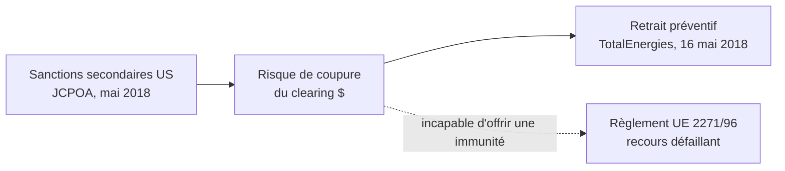
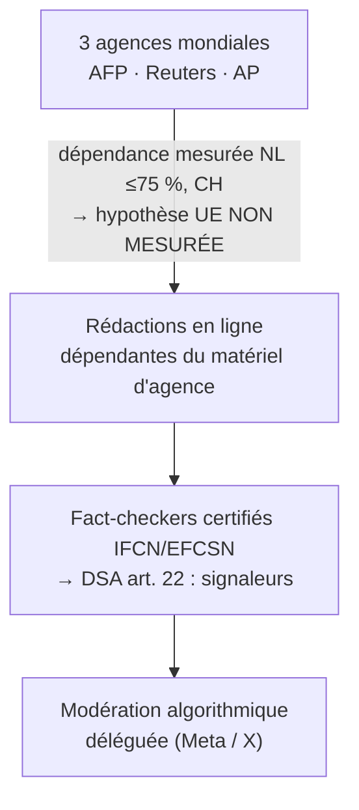

# Plan des figures du masterwork — candidatures, décisions, priorités

**Article** : `01_TARGET/ARTICLE_MASTERWORK_SOUVERAINETE_2026.md` (état `94c93001…`, 320 lignes)
**Date** : 2026-09-14 · **Statut** : plan en attente de décision d'auteur · remplace la production directe de fig06
**Réflexe corrigé** : une figure ne se produit pas parce qu'un contenu existe ; elle se produit quand **la structure du raisonnement est visuelle**. Une liste de 14 lignes de texte dans un cadre n'est pas un schéma — fig06 produite le 14/09 est **retirée** (`svg/` et `png/`, générateur conservé en archive), sa méthode (porte de mesure, contrôles pixels) reste acquise.

---

## 1. Candidature par candidature (lecture intégrale de l'article)

### C1 — Prologue : le paradoxe de la souveraineté impotente (l. 9-24)
- **Contenu** : 4 atouts de puissance affichés face à 4 réalités forensiques constatées.
- **Structure visuelle réelle** : **miroir à deux colonnes** — l'ordre affiché à gauche, l'inventaire documenté à droite. Confrontation terme à terme.
- **Ce que le lecteur gagne** : la thèse de l'article en une image, avant toute lecture. Le paradoxe est *vu*, pas seulement énoncé.
- **Décision proposée** : **FIGURE — priorité 1.** Deux panneaux miroir + bande centrale de tension (« l'écart entre le rang et la prise »). Chaque cellule porte son renvoi [76] [80] [81] [10] [44].
- **Coût** : moyen. Fonction : accroche Substack.

### C2 — Partie I.2 : la chaîne de la sur-conformité (l. 60-63, cadre monospace existant)
- **Contenu** : sanctions secondaires US → risque de coupure clearing → retrait préventif TotalEnergies ; le règlement de blocage UE 2271/96 incapable d'offrir une immunité.
- **Structure visuelle réelle** : **chaîne causale à trois maillons avec un recours défaillant** (la branche UE qui promet une protection et n'en offre pas).
- **Ce que le lecteur gagne** : le mécanisme *over-compliance* — aucun ordre, une autosatisfaction de contrainte — devient lisible en trois flèches. C'est le schéma le plus « mécanique » de l'article.
- **Décision proposée** : **FIGURE — priorité 2.** Trois nœuds chaînés + recours latéral barré (trait pointillé, mention « incapable d'offrir une immunité »).
- **Coût** : faible. Fonction : épure du monospace existant, qui reste dans l'audit bundle.

### C3 — Partie II.1 : la chaîne bornée d'Alstom (l. 88-105, cadre monospace existant)
- **Contenu** : étau → cession → signature → coût → rachat.
- **Structure visuelle réelle** : **frise chronologique bornée** — la chaîne des pièces s'arrête à l'engagement du dirigeant ; le dessin d'ensemble reste hors champ.
- **Décision proposée** : **déjà produite — fig05, validée** (porte de mesure, contrôles pixels, SUIVI §6.22). Rien à refaire. Priorité d'insertion : 3.
- **Coût** : nul (existe). Fonction : ancrage narratif de la partie II.

### C4 — Partie III.3 : la chaîne de distribution de la vérité (l. 134-140, cadre monospace existant)
- **Contenu** : agences → rédactions dépendantes → fact-checkers certifiés → signaleurs DSA art. 22 → modération déléguée aux plateformes.
- **Structure visuelle réelle** : **cascade à quatre étages** — la vérité descend une chaîne de dépendances jusqu'au filtrage délégué.
- **Ce que le lecteur gagne** : c'est le seul endroit de l'article où un *flux* se transmet d'institution en institution ; l'empilement typographique du monospace écrase cette verticalité.
- **Décision proposée** : **FIGURE — priorité 2 bis.** Quatre étages verticaux, chaque étage nommant son estudette/pièce ([29] [30] [34] [35] [31]). **Attention fidélité** : le texte de la partie III.3 dit explicitement que la généralisation européenne n'est **pas mesurée** — la figure doit porter cette borne (mention « hypothèse non mesurée au niveau UE » sur le premier étage), sans quoi elle réintroduirait le défaut F-A corrigé en F11.
- **Coût** : moyen. Fonction : rend visible la captation cognitive, sujet du verrou III.

### C5 — Partie V : la matrice des quatre verrous (l. 194-212)
- **Contenu** : 14 instruments × 4 verrous, chaque ligne portée par une pièce ; aucune pièce de chaînage entre verrous.
- **Structure visuelle réelle** : **un inventaire, pas un mécanisme**. Les lignes n'ont entre elles ni flèche, ni hiérarchie, ni transformation — seulement deux attributs (verrou, pièce). La preuve visuelle utile de la partie V est *négative* : montrer quatre blocs **sans liaison entre eux**.
- **Décision proposée** : **FIGURE, mais autrement — priorité 1 bis.** Une matrice n'est graphique que si elle montre le motif récurrent : quatre bandes de verrous, chaque instrument aligné **vers sa pièce**, et **aucune arête entre bandes** — le vide entre les quatre blocs étant la thèse (« l'inventaire ne démontre pas un système »). Les lignes restent du texte court (instrument + pièce), mais la disposition en quatre blocs disjoints, avec le vide central annoté, porte une information que la liste linéaire ne porte pas. Version actuelle de fig06 (liste unique) : retirée. **Variante rejetée** : synthèse en un seul visuel « les 4 verrous entourent un État » — métaphore non sourcée, interdite par la charte.
- **Coût** : moyen-élevé (composition). Fonction : synthèse finale, companion de la matrice markdown conservée dans l'article.

### C6 — Épilogue : la boucle de l'impuissance apprise (l. 219-231)
- **Contenu** : accepter le clearing → s'étonner des embargos ; abandonner les champions → racheter dix ans plus tard ; confier les données → parler d'autonomie ; tolérer le pantouflage → s'étonner de l'abstention.
- **Structure visuelle réelle** : **quatre couples action/paradoxe** — un mécanisme répété quatre fois. Tentant, mais c'est de la **rhétorique parallèle**, pas un mécanisme : les quatre couples ne forment pas un cycle, aucune flèche ne les relie, et une figure en cercle suggérerait une boucle causale que l'article ne prétend pas établir.
- **Décision proposée** : **PAS DE FIGURE.** Le texte frappe assez ; le visuel n'ajouterait que de la décoration, au mieux, et une fausse causalité circulaire, au pire.

### C7 — Partie IV.1 : la cartographie des mobilités (l. 172-180, tableau markdown existant)
- **Contenu** : 5 trajectoires acteur → fonction → entité privée → enjeu.
- **Structure visuelle réelle** : des **trajectoires individuelles**, chacune documentée, mais sans mécanisme commun dessinable sans inventer un moteur (la « capture cognitive » est précisément ce que la partie IV.2 dit non prouvable pénalement). Un diagramme de flux suggérerait un circuit là où l'article établit des trajectoires.
- **Décision proposée** : **PAS DE FIGURE.** Le tableau markdown reste (le corpus Substack n'en publie pas, mais cette partie est un appareil de preuve, pas une narration) ; les trajectoires sont déjà lisibles ligne à ligne.

---

## 2. Programme retenu (si décision d'auteur conforme)

| Priorité | Figure | Emplacement | Fichiers | État |
|---|---|---|---|---|
| 1 | **F1 — Le paradoxe** (miroir 2 colonnes) | Prologue, face au cadre monospace l. 13-24 | `fig06_paradoxe_miroir.svg` + PNG + `gen_fig06_paradoxe_miroir.py` | **retirée 14/09** — résumé en image (voir §5), archivée |
| 1 bis | **F2 — Les quatre verrous sans chaînage** (4 blocs disjoints, vide central annoté) | Partie V, companion de la matrice | `fig07_verrous_sans_chainage.svg` + PNG + `gen_fig07_verrous_sans_chainage.py` | **retirée 14/09** — inventaire en image (voir §5), archivée |
| 2 | **F3 — La chaîne de la sur-conformité** (3 nœuds + recours barré) | I.2, face au monospace l. 60-63 | `fig08_sur_conformite.svg` + PNG + `gen_fig08_sur_conformite.py` | **produite 14/09** |
| 2 bis | **F4 — La cascade de la vérité** (4 étages + borne entre étages 1 et 2) | III.3, face au monospace l. 134-140 | `fig09_cascade_verite.svg` + PNG + `gen_fig09_cascade_verite.py` | **produite 14/09** |
| 3 | **F5 = fig05 actuelle** (chaîne bornée Alstom) | II.1 | `fig05_alstom_chaine_bornee.svg` + PNG + `gen_fig05.py` | **produite 13/09, validée** |
| — | C6 épilogue, C7 mobilités | — | — | rejetées (voir décisions §1) |

**Règle de production, inchangée** : générateur déterministe, chaque chaîne mesurée avec les fontes réelles, échec sur tout débordement, contrôles pixels après rendu, chaque cellule traçable vers une phrase de l'article et son renvoi. Aucune figure n'introduit un fait, une liaison ou une métaphore que le texte n'établit.

## 3. Aperçus de composition (ASCII / Mermaid) — avant toute production

Ces aperçus fixent la **composition** validée par l'auteur ; ce ne sont pas les textes définitifs (tout texte final passera la porte de mesure fig05). Chaque cellule reste traçable vers une phrase de l'article et son renvoi.

### F1 — Miroir du paradoxe (prologue) — priorité 1

```
┌────────────────────────────────┐        ┌────────────────────────────────┐
│  ATOUTS AFFICHÉS               │        │  RÉALITÉS DOCUMENTÉES          │
├────────────────────────────────┤        ├────────────────────────────────┤
│  Dissuasion nucléaire          │   ≠    │  Cloud UE : 70 %, 3 US  [80]   │
│  2ᵉ exportateur d'armes  [81]  │   ≠    │  Alstom cédé sous FCPA  [44]   │
│  Défense 57,1 Md€ (2026) [76]  │   ≠    │  BNP : 8,97 Md$         [10]   │
│  Siège permanent ONU           │   ≠    │  Pantouflage de conseillers    │
└────────────────────────────────┘        └────────────────────────────────┘
      bandeau : « L'ÉCART ENTRE LE RANG ET LA PRISE »
```

### F2 — Les quatre verrous sans chaînage (partie V) — priorité 1 bis, remplace fig06-liste

```
┌─ VERROU I · INFRASTRUCTURE ───┐ · · · · ┌─ VERROU II · LAWFARE ─────────┐
│ 6 instruments                 │ aucune  │ 2 instruments                 │
│ péage $ · sur-conformité ·    │ arête   │ Alstom (FCPA) ·               │
│ EUCS · eIDAS · Doppelgänger…  │ ni pièce│ Rockhopper (ISDS)             │
└───────────────────────────────┘         └───────────────────────────────┘
            ──────  AUCUNE PIÈCE DE CHAÎNAGE ENTRE LES VERROUS  ──────
┌─ VERROU III · NORMATIF ───────┐ · · · · ┌─ VERROU IV · ÉLITES ─────────┐
│ 4 instruments                 │ aucune  │ 2 instruments                │
│ New IP · Sénat 578 · agences  │ arête   │ Bailey (GE) · Djebbari ·     │
│ · DSA art. 22                 │ ni pièce│ Farkas · Kroes · ELNET       │
└───────────────────────────────┘         └──────────────────────────────┘
```

L'information graphique portée : **le vide**. Les pointillés entre blocs sont le message (« l'inventaire ne démontre pas un système »), que la liste linéaire ne montrait pas.

### F3 — La chaîne de la sur-conformité (I.2) — priorité 2

```
┌─────────────────────────┐      ┌─────────────────────────┐      ┌─────────────────────────┐
│ Sanctions secondaires   │      │ Risque de coupure       │      │ Retrait préventif       │
│ US (JCPOA, mai 2018)    │ ───> │ du clearing $           │ ───> │ TotalEnergies (16 mai)  │
└─────────────────────────┘      └───────────┬─────────────┘      └─────────────────────────┘
                                             ·
                                   ┌─────────┴─────────┐
                                   │ Règlement UE      │  ← recours DÉFAILLANT (pointillé)
                                   │ 2271/96           │
                                   │ « incapable       │
                                   │  d'offrir une     │
                                   │  immunité »       │
                                   └───────────────────┘
```



### F4 — La cascade de la vérité (III.3) — priorité 2 bis

```
┌── ÉTAGE 1 ───────────────────────────────────────────────────┐
│ 3 agences mondiales (AFP / Reuters / AP)                     │
└───────────────────────────────┬──────────────────────────────┘
        ⚠ dépendance mesurée NL (≤75 %) et CH — hypothèse UE NON MESURÉE
                                ▼
┌── ÉTAGE 2 ───────────────────────────────────────────────────┐
│ Rédactions en ligne dépendantes du matériel d'agence         │
└───────────────────────────────┬──────────────────────────────┘
                                ▼
┌── ÉTAGE 3 ───────────────────────────────────────────────────┐
│ Fact-checkers certifiés (IFCN / EFCSN) → DSA art. 22 :       │
│ signaleurs de confiance                                      │
└───────────────────────────────┬──────────────────────────────┘
                                ▼
┌── ÉTAGE 4 ───────────────────────────────────────────────────┐
│ Modération algorithmique déléguée aux plateformes (Meta / X) │
└──────────────────────────────────────────────────────────────┘
```



La borne F11 est **dans** la figure (entre étages 1 et 2), pas en note — c'est elle qui empêche la figure de réintroduire le défaut corrigé.

### F5 = fig05 (II.1) — déjà produite

```
┌(a) ÉTAU┐→┌(b) CÉSION┐→┌(c) SIGNATURE┐→┌(d) COÛT┐→┌(e) RACHAT┐
└────────┘  └───────────┘  └──────────────┘  └─────────┘  └──────────┘
      CONTRAINTE DOCUMENTÉE ≠ DESSEIN ÉTABLI
```

### Les deux rejets, vus en négatif

```
Épilogue (rejeté) :  A → B → C → D → A   ← cercle suggéré, aucune flèche dans le texte
Partie IV (rejeté) : [État] ⇉ [privé]    ← moteur suggéré, l'article établit des trajectoires,
                                            pas un circuit
```

## 4. Question d'insertion (décision d'auteur, après production)
- Les trois monospace restent-ils dans le texte de l'article (l'audit en a besoin) et les figures ne vivent que dans la version Substack ? Ou les monospace cèdent-ils leur place ?

## 5. Révision v2 — après retour d'auteur (même jour)

**Retour d'auteur** : fig08 et fig09 illustrent un mécanisme, une architecture ; fig06 et fig07 « ne sont que de bêtes illustrations et résumés du texte ». On peut faire mieux, ou trouver d'autres idées. Une figure ne se justifie pas par la présence d'un contenu, mais par son **utilité propre** : elle doit donner au lecteur ce que la prose ne lui donne pas.

**Verdict sur la critique, après re-lecture** : acceptée. F1 (fig06-miroir) et F2 (fig07-blocs) reposent sur des structures **statiques** — une juxtaposition et un inventaire. Une figure ne peut montrer que la prose montre moins bien : un **mécanisme** (qui se déroule), une **transformée** (un état qui devient un autre), une **procédure de lecture** (un usage). Un résumé en image est une décoration. fig06-miroir et fig07-blocs sont archivées (`archive/`).

**Nuance gardée en acte** : F4 et F5 restent aux limites de la même critique (F4 est une suite d'étages, F5 une frise) ; ce sont des **transitions documentées** d'un état au suivant, mais c'est le point à surveiller dans toute itération. F3 reste la figure la plus solide : une cause sans ordre produit un effet, avec un recours défaillant — de la mécanique pure.

**Le critère, formulé une fois pour toutes** : une figure est justifiée si et seulement si elle répond à l'une de ces trois questions — **(a)** quel mécanisme se déroule (causes, effets, recours) ? **(b)** quel état devient quel autre état (transformée documentée) ? **(c)** comment le lecteur doit-il se servir de ce que l'article établit (usage, bornes, lecture) ? Une figure qui répond à « que dit le texte ? » est rejetée a priori.

### C8 — La grille de lecture des verrous (article entier) — candidature nouvelle, la plus forte

- **Ce que la prose ne donne pas** : l'article documente quatre verrous et des garde-fous, mais **ne montre nulle part comment s'en servir**. Le lecteur repart avec des dossiers, pas un instrument. Or l'article fournit de fait une méthode : pour toute dépendance nouvelle, quatre questions à poser, et trois trajectoires possibles selon les réponses.
- **Structure visuelle réelle** : une **grille de décision** — quatre questions filtres (les quatre verrous : y a-t-il un canal sous juridiction étrangère ? une procédure pénale ou d'arbitrage mobilisable ? une instance de norme ou de certification capturable ? une trajectoire de carrière en jeu ?) aboutissant aux trois issues documentées par l'article : **verrou levé** (Photonis [24], New IP [28], TCE [50], VIGINUM [77], Lituanie [16] [17] — l'article nomme ses trois conditions : outil dédié, volonté politique, coût acceptable) ; **verrou subi** (Alstom, BNP, TotalEnergies, Health Data Hub) ; **verrou non clos** (EUCS, DSA art. 22, mobilités HATVP — où la pièce manque).
- **Ce que le lecteur gagne** : la thèse devient **manipulable** — il peut la tester sur n'importe quel cas futur, y compris hors de l'article. C'est une utilité que la prose ne remplit pas.
- **Fidélité** : les conditions et les trois issues sont mot pour mot celles de la partie V (« un outil institutionnel dédié, une volonté politique explicite, un coût de résistance jugé acceptable »). Aucun fait nouveau ; des exemples déjà cités changent de fonction (ils deviennent des *types*).
- **Forme** : quatre entrées → filtre en quatre étages → trois sorties étiquetées. Les sorties « levé » portent leurs garde-fous et leurs trois conditions.

```
   UN CAS, UNE DÉPENDANCE, UNE DÉCISION SOUVERAINE
          │
   ┌──────┴────────────────────────────────────────────┐
   │  Q1  un canal (paiement, cloud, standard) échappe- │
   │      t-il à la juridiction nationale ?             │  → VERROU I
   │  Q2  une procédure pénale ou d'arbitrage peut-elle │
   │      viser l'actif ou le dirigeant ?               │  → VERROU II
   │  Q3  une instance de norme ou de certification est-│
   │      elle capturable en amont ?                    │  → VERROU III
   │  Q4  une trajectoire post-fonction est-elle en jeu │
   │      sans pacte prouvable ?                        │  → VERROU IV
   └──────┬────────────────────────────────────────────┘
          │  trois issues documentées par la partie V
   ┌──────┴────────────────┬───────────────────────────┐
   ▼                       ▼                           ▼
 VERROU LEVÉ            VERROU SUBI                VERROU NON CLOS
 outil dédié + volonté  Alstom · BNP ·             EUCS · DSA art. 22 ·
 + coût acceptable      TotalEnergies · HDH        mobilités HATVP
 [24][28][50][77]       [10][44][11]               (la pièce manque)
```

### C9 — L'angle mort du droit pénal (partie IV.2) — candidature nouvelle

- **Ce que la prose ne donne pas** : la partie IV.2 explique **en trois phrases denses** pourquoi le droit n'attrape pas les mobilités (pacte préexistant exigé par 432-11 [78] ; contrôle effectif exigé par 432-13 [79], dans un délai qui borne la reprise sans exiger la surveillance dans les trois ans ; capture cognitive progressive hors champ [40] ; harmonisation européenne qui ne touche pas la prise illégale d'intérêts [42]). C'est un raisonnement **structuré** (faits constitutifs → exigences probatoires → écart) rendu en prose linéaire ; c'est là qu'une figure montre ce que le texte écrase.
- **Structure visuelle réelle** : **deux colonnes en miroir inversé** — à gauche les faits constitutifs que la HATVP documente (orientations d'arbitrages **sans pacte formel**), à droite les éléments que le pénal **exige** (un pacte, un contrôle effectif, un lien temporel), et **entre les deux, l'espace vide étiqueté** : l'angle mort. S'y ajoute la ligne de portée : la directive 2026/1021 [42] harmonise le noyau pénal mais laisse la prise illégale d'intérêts au volet prévention — l'angle mort est **appelé à persister**.
- **Ce que le lecteur gagne** : il **voit** pourquoi « pas de poursuite » n'est pas « pas de problème » — l'incomplétude devient spatiale au lieu d'être argumentative. Fait tomber la lecture comploteuse (pas de traître à poursuivre) **et** la lecture naïve (le droit suffirait s'il le voulait).
- **Fidélité** : chaque bloc est une phrase de la partie IV.2 et son renvoi. Le vide central ne symbolise qu'une chose : l'écart entre exigences probatoires et phénomène documenté — c'est le titre même du §IV.2 (« le point aveugle »).
- **Forme** : colonne « CE QUE LES PIÈCES DOCUMENTENT » / vide central « L'ANGLE MORT » / colonne « CE QUE LE PÉNAL EXIGE », avec bandeau de portée directive en bas.

```
┌ CE QUE LES PIÈCES DOCUMENTENT ┐   L'ANGLE    ┌ CE QUE LE PÉNAL EXIGE ┐
│ orientations d'arbitrages     │    MORT      │ 432-11 : pacte        │
│ sans pacte formel     [40]    │  aucune des  │   préexistant    [78] │
│ pantouflage sans poursuite    │   deux mains │ 432-13 : contrôle     │
│ Bailey · Djebbari  [58][37]   │ ◄─ ─ ─ ─ ►   │   effectif       [79] │
│ Farkas · Kroes     [36][39]   │  (espace non │ 432-13 : lien avec les│
│ prise illégale d'intérêts hors│  couvert par │   fonctions      [79] │
│ le noyau harmonisé       [42] │  la preuve)  │ délai 3 ans : borne la│
└───────────────────────────────┘              │   reprise        [79] │
                                               └───────────────────────┘
  PORTE É ARTICULÉE : la directive 2026/1021 [42] harmonise le noyau pénal,
  laisse la prise illégale d'intérêts au volet prévention → l'angle mort persiste
```

### C10 — Autres pistes examinées et écartées (pour mémoire)
- **Cartographie des investigations** (qui a documenté quoi : Assemblée nationale, Sénat, HATVP, VIGINUM, CJUE…) : résumé en image — rejeté par le critère.
- **Frise comparative des dix ans Alstom (2010-2026)** : F5 la couvre déjà.
- **Radar de vulnérabilité sectorielle** : inventerait une métrique que l'article refuse explicitement — rejeté.

### État des candidatures après révision v2

| Candidature | Décision v2 |
|---|---|
| F1 miroir du paradoxe (fig06) | **retirée** — résumé en image, archivée |
| F2 verrous sans chaînage (fig07) | **retirée** — inventaire en image, archivée |
| F3 sur-conformité (fig08) | **conservée** — mécanisme pur (critère a) |
| F4 cascade de la vérité (fig09) | **conservée sous surveillance** — transitions documentées (critère b) ; à ne garder que si l'auteur la juge utile à la lecture |
| F5 chaîne bornée Alstom (fig05) | **conservée** — enchaînement documenté (critère b), validée |
| **C8 grille de lecture** | **produite 14/09 — priorité 1** : `fig10_grille_de_lecture.svg` + PNG + `gen_fig10_grille_de_lecture.py` ; empreintes `c66806e0…` / `73bc70d6…` |
| **C9 angle mort du droit** | **produite 14/09 — priorité 2** : `fig11_angle_mort.svg` + PNG + `gen_fig11_angle_mort.py` ; empreintes `f0cb6281…` / `6f8dbd0f…` |
| C10 pistes diverses | écartées, motifs ci-dessus |
- La matrice markdown de la partie V : conservée en parallèle de F2 (recommandé : oui — F2 montre le motif, la matrice porte le détail auditable) ?
