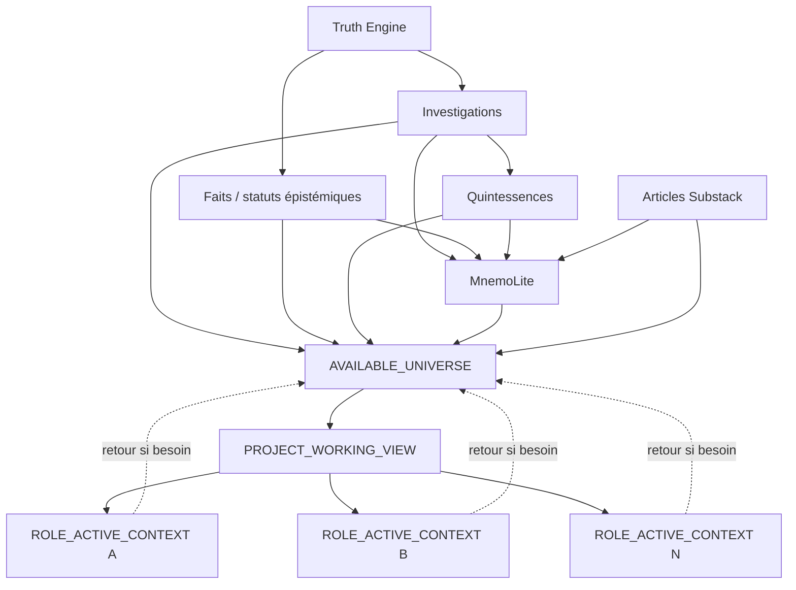
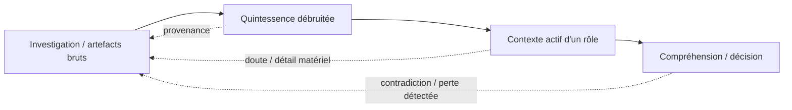
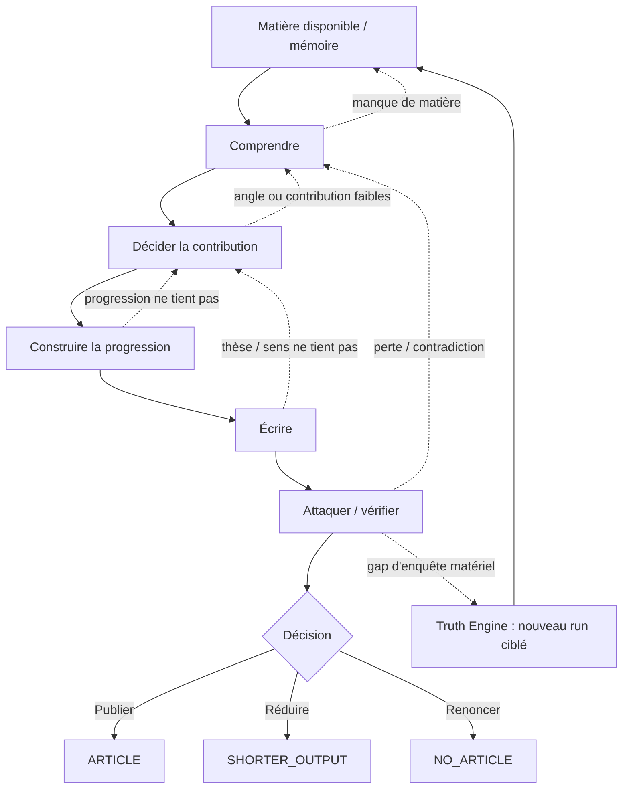

# VISION.md

# Vision du protocole Article from Truth Engine

**Statut : fondation candidate V4.4**  
**Portée : but, frontières d'autorité, propriétés à préserver. Pas d'architecture d'exécution.**

---

## 1. Mission

Truth Engine enquête.

Il transforme un lead initial en **runs d'investigation bornés**, traçables et falsifiables. Un run peut débroussailler, approfondir, contredire, mettre à jour ou reprendre une zone déjà explorée. Plusieurs runs peuvent travailler le même objet ; un même run peut couvrir plusieurs thèmes, mécanismes ou questions.

Donc :

```text
RUN_FINAL != SUBJECT_EXHAUSTED
```

Une investigation `FINAL` est finalisée sous le contrat et la version de Truth Engine qui l'ont produite. Elle n'est ni exhaustive, ni vérité absolue, ni représentation complète du sujet.

Le protocole Article intervient en aval. Sa mission est :

> **Transformer la matière d'enquête disponible en une compréhension éditoriale sans perdre ce que le travail d'investigation a matériellement gagné.**

Puis seulement :

> **Décider ce qui mérite d'être publié, pourquoi cela compte, et comment le transmettre sans dépasser ce que les preuves autorisent.**

Le protocole Article n'est ni un second Truth Engine, ni un moteur de résumé, ni une claim matrix mise en prose, ni une machine à faire passer des gates.

---

## 2. La matière disponible n'est pas le contexte actif

La matière utile peut comprendre :

- investigations Truth Engine ;
- faits et statuts épistémiques ;
- quintessences ;
- sources et traces disponibles ;
- objets récupérés via MnemoLite ;
- articles Substack déjà publiés.

Trois niveaux doivent rester distincts :

```text
AVAILABLE_UNIVERSE
!=
PROJECT_WORKING_VIEW
!=
ROLE_ACTIVE_CONTEXT
```

- **AVAILABLE_UNIVERSE** : tout ce qui est récupérable et potentiellement pertinent ;
- **PROJECT_WORKING_VIEW** : vue de travail révisable du sujet courant ;
- **ROLE_ACTIVE_CONTEXT** : contexte réduit pour une tâche cognitive précise.

Une vue réduite n'est jamais canonique. Une pièce exclue doit rester récupérable si une contradiction, une nouvelle hypothèse ou un doute la rend pertinente.

### Schéma canonique 1 - Écosystème, mémoire et niveaux de contexte



---

## 3. MnemoLite : mémoire transversale, jamais preuve par lui-même

MnemoLite est la couche de **mémoire sémantique et de récupération transversale**. Il permet de retrouver et relier des faits, investigations, quintessences, synthèses, articles et autres objets utiles.

Mais MnemoLite n'est pas la source de vérité de ces objets. Les artefacts et preuves canoniques restent autoritaires dans leurs domaines.

Invariants :

```text
MEMORY != EVIDENCE
MEMORY_TYPE != EPISTEMIC_STATUS
RETRIEVED_MEMORY != INDEPENDENT_CORROBORATION
MEMORY_CAN_SEED_DISCOVERY
MEMORY_CANNOT_CONFIRM_ITSELF
```

Tout objet mémoire matériel doit conserver suffisamment de provenance pour distinguer au minimum :

- son type ;
- son origine ;
- son statut épistémique lorsqu'il en possède un ;
- sa date ou version utile ;
- le chemin vers l'artefact ou la preuve canonique.

Principe :

> **La mémoire économise la découverte, jamais l'inspection nécessaire à une affirmation probatoire.**

MnemoLite peut être incomplet ou indisponible. Le protocole doit alors dégrader honnêtement : utiliser les artefacts disponibles, signaler la perte de continuité, et ne bloquer que si cette perte empêche une décision matérielle.

Le corpus Substack reste une mémoire éditoriale spécifique : il sert à mesurer ce que le lecteur a déjà pu lire, pas à prouver les affirmations du nouvel article.

---

## 4. Quintessence : débruiter sans devenir une nouvelle autorité

Une investigation Truth Engine contient du raisonnement utile, mais aussi de la plomberie nécessaire à l'exécution : logs, routing, détails d'outils, répétitions, incidents techniques et métadonnées locales.

La quintessence sert à **libérer du budget cognitif** pour les rôles aval.

Elle doit conserver ce qui peut changer :

- compréhension ;
- confiance ;
- scope ;
- mécanismes et relations ;
- contradictions et réfutations ;
- gaps et connaissance négative ;
- statut épistémique ;
- décision éditoriale ;
- narration ou conclusion.

Elle peut retirer ce dont la disparition ne peut raisonnablement changer aucun de ces éléments.

Mais :

```text
QUINTESSENCE != SOURCE
QUINTESSENCE != INVESTIGATION
QUINTESSENCE != NEW_AUTHORITY
```

Une quintessence est une **vue débruitée, traçable et réversible**. Tout élément matériel doit pouvoir être remonté vers l'investigation ou la preuve sous-jacente. En cas de doute, un rôle peut revenir au brut.

### Schéma canonique 2 - Débruitage réversible



---

## 5. Comprendre avant de sélectionner l'article

La réduction de contexte ne doit jamais devenir **sélection avant compréhension**.

Le travail aval doit pouvoir reconstruire, selon le sujet :

- fonctionnement normal ;
- histoire utile ;
- acteurs et responsabilités ;
- règles ;
- flux et ressources ;
- mécanismes ;
- contradictions ;
- contre-hypothèses ;
- limites et inconnues matérielles.

Les claims contrôlent la preuve. Ils ne remplacent pas la compréhension.

```text
CLAIM != DISCOVERY
CLAIM_SET != SUBJECT_UNDERSTANDING
```

La compréhension peut émerger d'une investigation, de plusieurs investigations qui se chevauchent, d'une contradiction entre elles, ou d'une relation retrouvée via la mémoire.

---

## 6. Réinvestigation : répétition utile, pas répétition aveugle

La répétition d'une investigation n'est pas un défaut. Truth Engine travaille naturellement par approfondissements successifs.

L'invariant correct est :

```text
NO_BLIND_REINVESTIGATION
```

Une nouvelle investigation est légitime si elle a un but explicite et un gain d'information attendu, par exemple :

- approfondir ;
- diversifier l'angle ;
- tester une hypothèse ou contre-thèse ;
- traiter un gap ;
- mettre à jour ;
- suivre une nouvelle piste ;
- vérifier une contradiction.

Un rôle aval peut donc demander un retour amont. La reprise doit rester locale autant que possible et ne rejouer que ce qui dépend matériellement de la modification.

### Schéma canonique 3 - Graphe de travail et BACK



Ce schéma décrit des **responsabilités**, pas une liste obligatoire d'agents ni un ordre irréversible.

---

## 7. Contribution éditoriale

Une masse d'enquête ne justifie pas automatiquement un article.

La décision d'auteur doit pouvoir répondre :

> **Qu'est-ce que cet article apporte de nouveau, d'important et d'explicatif ?**

Mémo :

```text
CONTRIBUTION
=
NOUVEAUTÉ
+
IMPORTANCE
+
POUVOIR EXPLICATIF
```

Cette formule n'est pas un score numérique.

Si la contribution est insuffisante, les sorties légitimes sont : approfondir, produire plus court, intégrer ailleurs, ou ne pas publier.

---

## 8. Le produit final

L'article doit être :

```text
AUTONOMOUS_ENOUGH
+
CUMULATIVE
+
AUDITABLE
```

- **Autonome assez** : un lecteur froid comprend l'objet sans devoir lire tout le Substack.
- **Cumulatif** : un lecteur assidu identifie ce qui est réellement nouveau.
- **Auditable** : les affirmations matérielles peuvent remonter vers une investigation, un fait et une preuve appropriée.

L'article doit faire sentir le rendement de l'enquête sans exposer sa bureaucratie.

La conclusion doit répondre :

1. qu'avons-nous compris de plus ?
2. qu'est-ce que cela change ?
3. jusqu'où peut-on l'affirmer ?

---

## 9. Invariants fondateurs

1. `RUN_FINAL != SUBJECT_EXHAUSTED`.
2. Identité technique d'un run `!=` couverture sémantique pure.
3. `AVAILABLE_UNIVERSE != PROJECT_WORKING_VIEW != ROLE_ACTIVE_CONTEXT`.
4. Une vue active reste révisable ; elle ne devient jamais le canon du savoir disponible.
5. MnemoLite est mémoire/retrieval, pas preuve ni canon universel.
6. `MEMORY != EVIDENCE` et `MEMORY_CANNOT_CONFIRM_ITSELF`.
7. Les statuts épistémiques matériels survivent jusqu'à l'article.
8. La quintessence est débruitée, traçable, réversible et non autoritaire.
9. `NO_EARLY_FLATTENING` : la réduction ne précède pas la compréhension nécessaire.
10. `NO_BLIND_REINVESTIGATION` : répéter est permis ; répéter sans but ne l'est pas.
11. L'auteur décide de la contribution avant la prose longue.
12. L'article doit être autonome assez, cumulatif et auditable.
13. Les reprises sont locales par défaut ; les replays globaux exigent une raison matérielle.
14. Le protocole sait publier, réduire, réinvestiguer ou renoncer, puis s'arrêter.

---

## 10. Définition du succès

Le protocole réussit si :

- le contexte réduit n'a pas occulté une pièce qui change la décision ;
- MnemoLite accélère la récupération sans blanchir une interprétation en preuve ;
- les quintessences réduisent le bruit sans modifier une décision matérielle par rapport au brut ;
- les statuts épistémiques et contradictions utiles survivent ;
- le lecteur comprend réellement l'objet ;
- un lecteur assidu identifie une contribution nouvelle et importante ;
- le même article n'aurait pas pu être produit presque à l'identique sans le travail profond de Truth Engine ;
- le système sait s'arrêter.

> **Le protocole ne sert pas à fabriquer un article conforme. Il sert à ne pas perdre l'enquête en devenant un article.**
