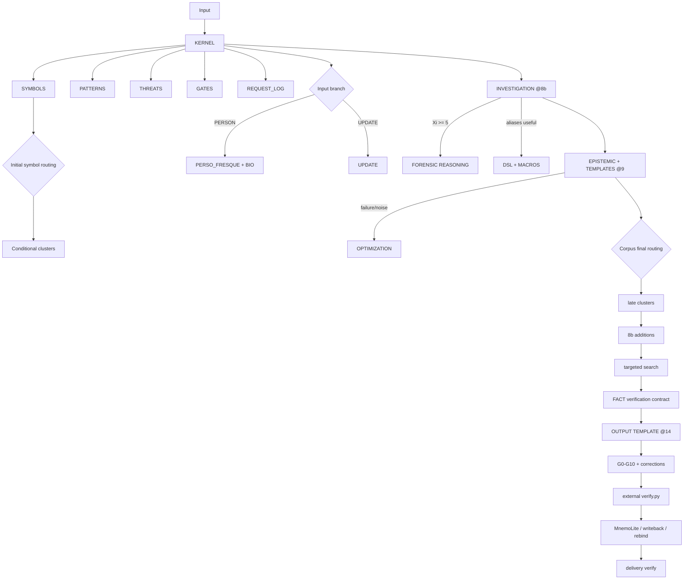
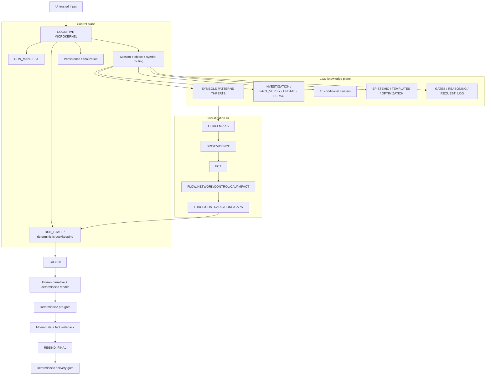

# TRUTH ENGINE v2.10.6 — Architecture du microkernel cognitif distribué

**Date de reconstruction :** 2026-08-27  
**Base auditée :** contenu complet du répertoire `truth-engine-v2` fourni le 27 août 2026.  
**Statut :** documentation d’architecture reconstruite depuis le runtime réel.  
**Portée :** relations, autorités, chargement, états, flux de données, persistance et surfaces externes. Le comportement exécutable reste canonique dans les fichiers runtime eux-mêmes.

---

## 1. Modèle mental correct

Truth Engine n’est pas « un gros prompt KERNEL avec quelques fichiers auxiliaires ».

C’est un **microkernel cognitif prompt-native** qui orchestre un ensemble distribué de bases de connaissances spécialisées, chargées selon le contexte et l’état de l’enquête.

Le découpage réel est proche de :

```text
                    ┌─────────────────────────┐
                    │       KERNEL.md         │
                    │ scheduler / state / IO  │
                    │ invariants / routing    │
                    └────────────┬────────────┘
                                 │
              ┌──────────────────┼───────────────────┐
              │                  │                   │
      ontology / dispatch   cognitive protocols   forensic contracts
              │                  │                   │
              └──────────────┬───┴───────────────┬───┘
                             │                   │
                       lazy-loaded KB       search/evidence
                             │                   │
                             └─────────┬─────────┘
                                       │
                              canonical registries
                                       │
                              gates / correction
                                       │
                          semantic FINAL candidate
                                       │
                           deterministic verifier
                                       │
                          MnemoLite + same-path file
```

Le KERNEL est donc un **orchestrateur et un microkernel**, pas l’autorité unique de tout le raisonnement.

Il possède :

- l’ordre d’exécution ;
- l’état du run ;
- les transitions `OPEN → FINAL` ;
- le routage des modules ;
- les invariants transversaux ;
- les checkpoints ;
- les frontières de confiance ;
- la persistance ;
- les gates de livraison.

Il délègue les sémantiques spécialisées à des autorités distinctes : symboles, patterns, menaces, opérations d’investigation, niveaux de vérification, diversité épistémique, gates, format de sortie, etc.

**Conséquence architecturale :** comprendre ou modifier Truth Engine exige de raisonner sur le **graphe des autorités et des chargements**, pas seulement sur `KERNEL.md`.

---

## 2. Inventaire réel du runtime

Le bundle contient **34 fichiers Markdown runtime**, plus `ARCHITECTURE.md` qui est documentaire.

| Couche | Fichiers | Nombre | Rôle |
|---|---|---:|---|
| Microkernel | `KERNEL.md` | 1 | orchestration, état, phases, invariants, IO, persistance |
| Ontologie / dispatch | `definitions/*.md` | 3 | symboles, statuts, routing de clusters, patterns, menaces |
| Protocoles | `protocol/*.md` | 4 | investigation, vérification des faits, UPDATE, personne/fresque |
| Clusters cognitifs | `clusters/*.md` | 17 | 15 KB spécialisées + index + template |
| Recherche | `search/*.md` | 3 | épistémique/EDI, génération de requêtes, récupération sur échec |
| Forensic | `forensic/*.md` | 3 | gates, reconstruction, journal d’exécution |
| Sortie | `output/TEMPLATE.md` | 1 | ABI éditoriale de l’investigation |
| Références compactes | `tools/*.md` | 2 | DSL et macros, sans autorité métier |
| **Total runtime** |  | **34** |  |

Versions actuellement présentes :

```text
KERNEL                         2.10.6
SYMBOLS / BIO                  2.4
GATES / REQUEST_LOG            2.10.6
INVESTIGATION / UPDATE         2.10.6
SEARCH / DSL/MACROS            2.8
OUTPUT TEMPLATE                 2.10.6
clusters principaux            2.2
PATTERNS / THREATS             2.2
PERSO_FRESQUE                  2.2
FACT_VERIFICATION              2.10.6
```

Les versions sont modulaires : leur différence n’est pas automatiquement une anomalie. Elle oblige néanmoins à contrôler les contrats aux frontières.

---

## 3. Les cinq plans de Truth Engine

### 3.1 Control plane : KERNEL

`KERNEL.md` est le scheduler cognitif.

Il définit :

```text
INPUT_KIND
MISSION_MODE
RUN_MANIFEST
phases 0 → 19b
NEXT_ACTION
checkpointing
resume
lazy loading
cross-module predicates
finalization
persistence/rebind
external deterministic gates
```

Il ne doit pas redéfinir les ontologies appartenant aux KB spécialisées.

### 3.2 Knowledge plane : autorités spécialisées

Les KB ne sont pas de simples notes de contexte. Elles sont des **contrats cognitifs exécutables** : elles ajoutent des concepts, falsificateurs, objets de preuve, méthodes et formats de résultats.

Exemples :

- `SYMBOLS.md` décide quels clusters charger ;
- `NETWORK.md` impose des arêtes typées et leur provenance ;
- `TEMPORAL.md` impose normalisation temporelle et modèle nul avant toute orchestration ;
- `MONEY.md` impose une chaîne payer → canal → intermédiaire → bénéficiaire → décision ;
- `FACT_VERIFICATION.md` impose la machine L0→L4 ;
- `INVESTIGATION.md` impose les registres, PELOTE, la dialectique et la responsabilité.

### 3.3 Evidence/data plane : l’IR de l’enquête

Truth Engine transforme progressivement des entrées non fiables en une représentation intermédiaire structurée.

Principaux objets :

```text
LEAD_REGISTRY
CLAIM_REGISTRY
INVESTIGATION_MAP
EVIDENCE_REGISTRY
FACT_REGISTRY / FACT_REGISTRY_V1
FCT_SOURCE_MAP_V1
COGNITIVE_MAP
DIALECTICAL_MAP
RESOURCE_FLOW_MAP
ACTOR_NETWORK_MAP
CONTROL_MAP
CAUSALITY_REGISTRY
IMPACT_MAP
TRACE_MATRIX
CONTRADICTION_LEDGER
STATUS_DELTA
REFUTATION_REGISTRY_V1
WRITEBACK_PLAN_V1
RESPONSIBILITY_MAP
REQUEST_LOG
```

Cette couche joue le rôle d’un **IR de compilateur** : le texte final ne devrait jamais être la seule représentation du raisonnement.

### 3.4 Verification plane

Deux familles de contrôles coexistent :

1. **gates sémantiques** G0–G10, décrits dans `forensic/GATES.md` et exécutés par le KERNEL ;
2. **gate déterministe externe** `tools/verify/verify.py`, hors du répertoire fourni, exécuté aux phases 19a et 19b.

Le premier vérifie la cohérence épistémique et l’exécution du protocole. Le second reparse le livrable et vérifie les invariants déterministes sérialisables. R3 ajoute une barrière runtime avant FINAL (`SEMANTIC_CONTRACT_OK`, `SOURCE_RECORD_OK`, `REPORT_CONTRACT_OK`) et une barrière de livraison (`FORENSIC_PROJECTION_OK`, `TRACE_COMPLETENESS_OK`).

### 3.5 Persistence plane

Trois espaces sont distincts :

- fichier d’investigation canonique sous `$INV` ;
- MnemoLite comme mémoire longue durée ;
- `DELIVERY_STATE` externe (`.verify/result.json`) pour le hash/verdict déterministe.

Invariant central :

```text
MEMORY != EVIDENCE
SEM_FINAL != DELIVERY_STATE
ONE_FINAL != ONE_WRITE
```

---

## 4. Matrice d’autorité réelle

| Domaine | Autorité canonique | KERNEL fait quoi ? |
|---|---|---|
| Orchestration, état, chemins, phases, checkpoints, persistence | `KERNEL.md` | possède |
| Symboles narratifs, statuts, cluster routing | `definitions/SYMBOLS.md` | appelle et applique |
| Signatures/formules heuristiques | `definitions/PATTERNS.md` | appelle `@PAT[]` |
| Menaces et contre-checks | `definitions/THREATS.md` | appelle `@THR[]` |
| Investigation cognitive, dialectique, causalité, responsabilité | `protocol/INVESTIGATION.md` | schedule et impose les interfaces |
| Vérification L0→L4, EPI, confiance Mnemo | `protocol/FACT_VERIFICATION.md` | consomme le contrat aux étapes 10/13/19b |
| Revalidation différentielle | `protocol/UPDATE.md` | branche `INPUT_KIND=UPDATE` |
| Personne / fresque longitudinale | `protocol/PERSO_FRESQUE.md` | branche `PERSON` |
| Clusters spécialisés | chaque `clusters/*.md` | charge selon `SYMBOLS §4` |
| Rôles de source / EDI | `search/EPISTEMIC.md` | déclenche recherche et calcule à 16 |
| Transformation en requêtes | `search/TEMPLATES.md` | consume LEDs/CLMs/AXS |
| Récupération après bruit/échec | `search/OPTIMIZATION.md` | charge seulement sur besoin |
| Gates G0–G10 | `forensic/GATES.md` | applique à 18/18b |
| Reconstruction Ξ | `forensic/REASONING.md` | charge si Ξ≥5 |
| Audit log | `forensic/REQUEST_LOG.md` | doit être alimenté par les appels réels |
| Structure de sortie | `output/TEMPLATE.md` | charge à 14 |
| Alias / compactage | `tools/DSL.md`, `tools/MACROS.md` | optionnel, aucune redéfinition métier |

Règle de précédence du runtime :

```text
domain authority wins its domain
KERNEL wins order / loading / state / persistence / cross-domain interfaces
```

---

## 5. Lazy loading : topologie réelle

Le lazy loading n’est pas une optimisation accessoire. C’est une partie du raisonnement.

### 5.1 Tier 0 : boot

```text
User input
   ↓
KERNEL.md
```

Aucun autre fichier ne doit être supposé implicitement connu.

### 5.2 Tier 1 : ALWAYS LOAD

Au §0, le KERNEL charge systématiquement :

```text
definitions/SYMBOLS.md
definitions/PATTERNS.md
definitions/THREATS.md
forensic/GATES.md
forensic/REQUEST_LOG.md
```

Ces cinq fichiers constituent le **socle de sûreté et de dispatch**.

### 5.3 Tier 2 : routing depuis l’entrée

Après l’analyse initiale :

```text
scores narratifs → SYMBOLS §4 → clusters conditionnels
```

Exemples :

```text
Ξ>=5  → ICEBERG
€>=5  → MONEY
Λ>=5  → FRAMING
Ω>=5  → INVERSION
Ψ>=5  → OVERLOAD
↕>=5  → POWER
Φ/Σ   → SPECTACLE
κ     → CONFIRMATION
⫸     → FRAGMENTATION
⚔     → WAR
🌐     → NETWORK
⏰     → TEMPORAL
```

Routages additionnels :

```text
Ξ>=7 → GASLIGHTING
€>=7 → NETWORK + POWER
Ω>=7 → CONFIRMATION
PERSON/BIOGRAPHY → BIO
```

Plusieurs symboles peuvent viser un même fichier : les chemins sont dédupliqués.

### 5.4 Tier 3 : branches de mission / d’objet

À l’étape 4 :

```text
PERSON → PERSO_FRESQUE + BIO + APEX
UPDATE → UPDATE
UPDATE d’un parent PERSON → UPDATE + PERSO_FRESQUE + BIO
```

Ces branches sont **object-triggered**, pas narrative-triggered.

### 5.5 Tier 4 : noyau cognitif à 8b

```text
protocol/INVESTIGATION.md     toujours à 8b
forensic/REASONING.md         si Ξ>=5
tools/DSL.md + MACROS.md      seulement si résolution d’alias utile
```

`INVESTIGATION.md` transforme alors les structures déjà préparées en opérations cognitives : objets, axes, dialectique, faits, causalité, responsabilité.

### 5.6 Tier 5 : recherche à 9

```text
search/EPISTEMIC.md
search/TEMPLATES.md
```

Puis, seulement en cas de bruit, vide ou blocage :

```text
search/OPTIMIZATION.md
```

### 5.7 Tier 6 : second passage de routing après corpus

C’est une propriété importante absente de l’ancienne architecture.

Pour `TOPIC/PERSON/UPDATE` sans matériau initial substantiel :

```text
15 symboles = DEFERRED
      ↓
recherche de découverte
      ↓
corpus borné
      ↓
réévaluation des 15 symboles
      ↓
SYMBOL_STAGE=CORPUS_FINAL
      ↓
chargement tardif des clusters
      ↓
réexécution des additions 8b
      ↓
recherche ciblée supplémentaire
```

Le lazy loading est donc **réentrant** : le corpus peut modifier les modules cognitifs chargés, qui génèrent eux-mêmes de nouvelles obligations de recherche.

### 5.8 Tier 7 : sortie

À l’étape 14 :

```text
output/TEMPLATE.md
```

Le template est une ABI de sortie, pas un moteur de raisonnement.

---

## 6. Graphe de chargement dynamique



---

## 7. Le KERNEL orchestre trois boucles, pas un pipeline linéaire

### 7.1 Boucle cognitive

```text
input/corpus
→ symboles
→ clusters
→ questions/falsificateurs
→ recherche
→ nouveau corpus
→ réévaluation
```

### 7.2 Boucle épistémique

```text
LED/CLM/AXS
→ QRY
→ SRC
→ FCT/GAP
→ contre-recherche
→ changement de statut
→ reconstruction des maps
```

### 7.3 Boucle de correction/finalisation

```text
G0-G8
→ correction bornée
→ rebuild registries
→ checkpoint
→ G0-G8
→ candidate OPEN
→ G9-G10
→ semantic FINAL
→ PRE_GATE déterministe
→ Mnemo/writeback
→ REBIND
→ DELIVERY_GATE
```

L’ancienne représentation `input → search → output` est donc insuffisante.

---

## 8. Machine d’état du run

### 8.1 État de travail

```text
STATE:OPEN
CHECKPOINT_SEQ
LAST_COMPLETED
NEXT_ACTION
```

Chaque checkpoint met à jour atomiquement le compagnon `*_RUN_STATE.json`. Le Markdown `*_INVESTIGATION.md` n'existe pas avant la phase 19.

`RUN_STATE.json` est l'IR persistante de reprise ; il ne constitue jamais une preuve.

### 8.2 Transition finale

`STATE:FINAL` n’est autorisé qu’après :

```text
G0..G10 = PASS
INVESTIGATION_STOP_OK
CP_COVER_OK
QUERY_TRACE_OK
FACT_REGISTRY_OK
INSPECTED_TRACE_OK
ACCOUNTING_OK
WRITEBACK_PLAN_OK
WRITEBACK_BLOCK_REASON_OK
DELIVERY_STATE_EXTERNAL_ONLY
```

Le runtime fourni contient en plus `NO_UNCERTIFIED_FINAL` : aucun « final provisoire/non certifié » ne remplace un run incomplet.

### 8.3 Identité sémantique

```text
RUN_STATE + frozen narrative
   ↓ deterministic render (phase 19)
SERIAL_FINAL
   ↓ persistence metadata only
REBIND_FINAL
```

`ONE_FINAL` signifie une seule identité sémantique, même si le même fichier reçoit plusieurs écritures physiques contrôlées.

---

## 9. Les registres forment une chaîne de traçabilité

La chaîne conceptuelle n’est pas seulement :

```text
claim → source → fact
```

Elle est :

```text
INPUT
  ↓
LED      source material / lead
  ↓
CLM      proposition falsifiable
  ↓
AXS      question d’investigation / sought object
  ↓
QRY      tentative réelle
  ↓
SRC      objet de preuve accepté
  ↓
FCT      fait / evidence / gap
  ↓
CAU / CTRL / ACT
  ↓
TRACE_MATRIX
  ↓
final status / gap
```

Cette chaîne est l’une des propriétés les plus fortes du système.

Elle sépare :

- ce que la source affirme ;
- ce que l’enquête cherche ;
- ce qui a réellement été recherché ;
- ce qui a été inspecté ;
- ce qui est factuel ;
- ce qui est causal ;
- ce qui relève d’une responsabilité ;
- ce qui reste inconnu.

---

## 10. L’investigation est bifocale : lead et objet

Le runtime impose :

```text
LEAD_AUDIT != OBJECT_INVESTIGATION
```

Un tweet, article, personne ou document est une **porte d’entrée**, pas nécessairement le sujet réel.

En mode investigation :

```text
LEAD_QUESTION
     +
OBJECT_QUESTION
```

Le lead peut être faux tandis que l’objet sous-jacent reste réel, ou inversement.

C’est une différence fondamentale avec un fact-checker traditionnel.

`INVESTIGATION.md` l’explicite : dans une source multi-cas/systémique, les cas testent l’hypothèse de système ; leur accumulation ne prouve pas sa prévalence.

---

## 11. Les neuf axes génériques d’investigation

Le CRÉDO initialise potentiellement :

```text
SOURCE_AUDIT
SCOPE_HISTORY
EVIDENCE_CASES
RESOURCES_FLOWS
MECHANISMS
ACTORS_RELATIONS
RULES_CONTROLS
IMPACT_RESPONSIBILITY
COUNTER_HYPOTHESES
```

Chaque axe doit pointer vers des **objets de preuve cherchables**, pas seulement une question abstraite.

Un axe applicable ne peut finir que :

```text
SATURATED
GAP
N/A(logiquement non applicable)
```

`N/A` n’est jamais un substitut à une preuve absente.

---

## 12. Clusters cognitifs : 15 unités spécialisées

Les 15 fichiers métier actuellement présents :

| Cluster | Fonction dominante |
|---|---|
| `ICEBERG` | omissions, dénominateurs, réalité cachée bornée |
| `MONEY` | flux financiers, propriété, conflits, externalités |
| `FRAMING` | catégories, langage, alternatives exclues |
| `INVERSION` | renversement, contradiction, archive |
| `OVERLOAD` | volume, vitesse, urgence, charge cognitive |
| `POWER` | asymétrie, dépendance, accès, accountability |
| `SPECTACLE` | attention, émotion, substitution symbolique |
| `RESISTANCE` | contre-pouvoir, autonomie épistémique |
| `CONFIRMATION` | choix, defaults, friction, nudges |
| `FRAGMENTATION` | convergence d’indices indépendants |
| `WAR` | coordination opérationnelle, infrastructure, attribution |
| `NETWORK` | graphe d’acteurs et points de contrôle |
| `TEMPORAL` | séquençage, synchronisation, modèles alternatifs |
| `BIO` | chronologie, réseaux, revolving doors |
| `GASLIGHTING` | comparaison archivale lourde et négation/mémoire |

Leurs sections `Pairs:` sont des affinités analytiques, **pas une autorité de routing**. Seul `SYMBOLS §4` décide du chargement.

---

## 13. Vérification factuelle : sous-système distinct

`FACT_VERIFICATION.md` définit une seconde machine à états, indépendante du statut global du run :

```text
L0 CANDIDAT
→ L1 FETCHÉ
→ L2 ANCRÉ
→ L3 RECOUPÉ
→ L4 CONFIRMÉ
```

Et une gate orthogonale :

```text
EPI := FACT | EVIDENCE | INFERENCE | HYPOTHESIS | SPECULATION | UNKNOWN
```

Seul :

```text
EPI=FACT + L4
```

peut devenir `✦ / status:CONFIRME`.

La source unique est honnêtement plafonnée à `✧ / status:VERIFIE`.

Ce sous-système est central car il permet aux consommateurs aval de réutiliser un fait persistant sans confondre mémoire et preuve.

---

## 14. Search subsystem : trois fonctions différentes

### `EPISTEMIC.md`

Mesure la diversité et la couverture du corpus :

```text
geo
lang
strat
owner
persp
temp
EDI / COV / IND / CC / EDI*
```

Aucun de ces scores n’est un verdict de vérité.

### `TEMPLATES.md`

Transforme les gaps et axes en requêtes d’objets de preuve :

```text
legal text
filing
dataset
registry
meeting record
contract
archive
methodology
counter-source
```

### `OPTIMIZATION.md`

Ne sert qu’après échec/bruit : simplification, localisation, fallback, archives, mirrors.

Cette séparation évite de confondre stratégie de recherche, qualité de corpus et récupération technique.

---

## 15. Forensic subsystem

### `GATES.md`

Les gates sont des **barrières d’intégrité**, pas des scores :

```text
G0 Runtime
G1 Scope
G2 Leads/claims
G3 Facts
G4 Evidence
G5 Causality
G6 Accountability
G7 Contradiction
G8 Trace
G9 Finalization
G10 Serialization
```

Les corrections sont bornées : Truth Engine préfère un GAP persistant à une recherche infinie visant un quota.

### `REASONING.md`

Chargé lorsque `Ξ>=5`. Il traite la reconstruction de réalité cachée de façon bornée et sépare :

```text
FOUND
ESTIMATED
UNKNOWN
```

### `REQUEST_LOG.md`

Le journal est un **audit trail matériel**, pas un transcript de pensée.

Il doit tracer les appels qui ont modifié :

- scope ;
- preuves ;
- contradictions ;
- mémoire ;
- checkpoints ;
- finalisation ;
- writebacks.

---

## 16. Mémoire : cache cognitif contrôlé, pas RAG probatoire

MnemoLite est utilisé deux fois conceptuellement :

### Lecture en début de run

```text
@MNEMO_Q
→ leads / tags / précédent
→ MEMORY != EVIDENCE
→ reopen/revalidate before decisive use
```

### Écriture après PRE_GATE

```text
SEM_FINAL
→ investigation memory

current revalidated FCT
→ status:CONFIRME or status:VERIFIE
→ memory_id rebound into FACT_REGISTRY_V1
```

Le writeback factuel permet un **cache épistémique typé** : l’aval sait non seulement ce qui a été mémorisé, mais à quel niveau de vérification.

---

## 17. UPDATE et RESUME sont deux mécanismes différents

### RESUME

Continue **le même RUN_ID**, le même fichier et le même `NEXT_ACTION` à partir d’un checkpoint `STATE:OPEN`.

### UPDATE

Crée **un nouveau RUN_ID** avec `PARENT_RUN_ID`, revalide différentiellement et propage les changements uniquement vers les IDs affectés.

```text
parent facts = leads until reopened
```

L’UPDATE n’est donc pas un RESUME tardif.

---

## 18. Surface externe au répertoire fourni

Le runtime Markdown fourni dépend ou fait référence à plusieurs composants hors de ce répertoire.

| Surface | Usage |
|---|---|
| Web discovery / fetch | `@WEB`, `@FETCH`, `@EXA` |
| MnemoLite MCP | recherche, stockage investigation, writeback factuel |
| `tools/verify/verify.py` | gate déterministe pre/delivery ; hors répertoire `truth-engine-v2`, inclus dans le bundle de release drop-in 2.9.3 |
| `.verify/result.json` | autorité du `DELIVERY_STATE` |
| skill `mnemolite-mem-first` | contrat mémoire amont/aval cité par FACT_VERIFICATION |
| `tools/verify_facts.py` | référencé par FACT_VERIFICATION ; auxiliaire hors chemin critique KERNEL, non inclus dans le bundle drop-in |
| `tools/detect_contradictions.py` | référencé par FACT_VERIFICATION ; auxiliaire hors chemin critique KERNEL, non inclus dans le bundle drop-in |
| `tools/monitor_urls.py` | référencé par FACT_VERIFICATION ; moniteur auxiliaire, non invoqué par KERNEL, non inclus dans le bundle drop-in |
| `tools/classify_legacy.py` | référencé par FACT_VERIFICATION ; auxiliaire legacy, non invoqué par KERNEL, non inclus dans le bundle drop-in |
| SUBLIMATOR phases 1/2/3 | consommateur aval référencé par FACT_VERIFICATION |
| optional premium truth-reviewer | clean-room review mentionnée par KERNEL, non requise |

Ces éléments ne doivent pas être comptés dans les 34 fichiers runtime Markdown, mais font partie de l’écosystème d’exécution.

### 18.1 Frontière de release 2.10.6

Le répertoire `truth-engine-v2/`, `run_state.py` et le vérificateur déterministe évoluent ensemble au niveau du contrat machine. Le bundle drop-in 2.10.6 inclut `tools/verify/verify.py` et `tools/runtime/run_state.py` à la racine du projet, en plus du répertoire `truth-engine-v2/`. Le vérificateur expose une unique source de vérité :

```text
SUPPORTED_KERNEL_VERSIONS = ("2.10.6",)
```

Un dossier dont `ENGINE_VERSION`/`ENGINE` ne correspond pas à cette liste est `BLOCKED` par incompatibilité runtime avant toute certification KERNEL. Les anciens dossiers FINAL restent des artefacts historiques lisibles ; ils ne sont pas silencieusement recertifiés sous 2.10.6.

---

## 19. Écarts de câblage et dérives documentaires observés

Cette section décrit **le bundle fourni**, sans modifier silencieusement son comportement.

### 19.1 Correctifs de stabilité intégrés en 2.9.x

Les correctifs 2.9.2 restent acquis : chargement explicite de `FACT_VERIFICATION`, alignement §19a/§19b, provenance `FCT_SOURCE_MAP_V1`, séparation EPI/tier et suppression des worktrees comme condition de certification.

La 2.9.3 ajoute uniquement les correctifs reproduits par le run end-to-end du 27/08/2026 : verrouillage `INPUT_KIND`, ordre temporel des checkpoints, séparation `SYS/QRY`, sérialisation `WRITEBACK_EXECUTION_V1`, cohérence du REBIND et certification explicite du livrable par `--kernel-contract`.

### 19.2 Principe de stabilité retenu

```text
ONE RULE → ONE OWNER → N REFERENCES
FREEZE interfaces → ALLOW cognitive strategy
```

Les fichiers documentaires ou de routing ne doivent pas redéfinir une règle déjà possédée par une autorité sémantique. Les évolutions 2.9.x restent des correctifs de contrat et de non-régression ; les extensions de profondeur systémique relèvent d’une version mineure ultérieure.

## 20. Pourquoi une enquête peut rester superficielle malgré cette architecture

Le runtime possède déjà de nombreux composants systémiques :

```text
RESOURCES_FLOWS
MECHANISMS
ACTORS_RELATIONS
RULES_CONTROLS
IMPACT_RESPONSIBILITY
COUNTER_HYPOTHESES
NETWORK
POWER
FRAGMENTATION
TEMPORAL
MONEY
PELOTE
CONTROL_MAP
ACTOR_NETWORK_MAP
RESOURCE_FLOW_MAP
```

Donc une enquête superficielle n’implique pas nécessairement qu’il manque des KB.

Le défaut architectural plausible est ailleurs : **les critères de terminalisation sont encore principalement génériques**.

Un axe `MECHANISMS` peut être marqué `SATURATED` après quelques sources qui décrivent les composants, même si l’objet réel est un système distribué et que les **ponts** entre composants n’ont pas été recherchés.

De même, un `QUERY_TARGET=35+` traité comme objectif de volume plutôt que comme simple hint de planification peut pousser vers des recherches de fact-check sans produire une seule preuve sur :

- l’interopérabilité ;
- les identifiants communs ;
- les APIs ;
- les passerelles juridiques ;
- les contrôleurs ;
- les permissions de croisement ;
- les volumes opérationnels ;
- les cas d’usage ;
- les actes d’exécution ;
- les flux réels entre silos.

**La profondeur n’est pas une quantité de requêtes. C’est une couverture d’objets de mécanisme.**

---

## 21. Limite conceptuelle à corriger pour les objets systémiques

Le raisonnement suivant est insuffisant :

```text
pas de base centrale unique
+ pas de texte unique
+ pas d’intention commune démontrée
= pas de système
```

Un système peut être :

```text
distribué
modulaire
interopérable
composable
émergent
sans autorité centrale unique
sans dessein commun démontrable
```

Il faut donc maintenir séparées au moins quatre propositions :

```text
L1  composants réels
L2  convergence fonctionnelle
L3  composabilité / système émergent
L4  coordination / intention commune
```

`L4 UNKNOWN` ne réfute pas `L3`.

Nouveaux invariants conceptuels proposés :

```text
DISTRIBUTED != DISCONNECTED
INTEROPERABLE != CENTRALIZED
CAPABILITY != OBSERVED_USE
COMPOSABILITY != COORDINATION
EMERGENT_SYSTEM != PROVEN_INTENT
ABSENCE_OF_UNIFIED_DESIGN != ABSENCE_OF_SYSTEM
```

---

## 22. Évolution recommandée : second routeur basé sur la nature de l’objet

Le routing actuel est très fort sur :

```text
contenu / symboles narratifs → clusters
```

Il est moins explicite sur :

```text
nature de l’OBJECT_QUESTION → capacités d’investigation obligatoires
```

Il serait utile de séparer :

### Router A : narrative/cognitive

```text
SYMBOLS → clusters
```

### Router B : object/capability

Exemples :

```text
PERSON          → PERSO/BIO
UPDATE          → UPDATE
SYSTEM          → systemic/composability route
NETWORK         → network/control route
MONEY_FLOW      → resource-flow route
CAUSAL_FAILURE  → causal/mechanism route
```

Cela évite qu’un objet systémique dépende uniquement du score narratif de la source qui l’a déclenché.

---

## 23. Proposition : `SYSTEMIC_OBJECT_TEST`

Pour un `OBJECT_QUESTION` portant sur un système, une infrastructure, un écosystème réglementaire ou une convergence de capacités, l’enquête devrait terminaliser explicitement les dimensions suivantes :

```text
COMPONENTS
COVERAGE
COMPULSION
IDENTIFIERS
DATA_OBJECTS
INTERMEDIARIES
ACCESS_RIGHTS
INTEROPERABILITY
BRIDGES
CROSS_BORDER
RETENTION
OVERSIGHT
SAFEGUARDS
ALTERNATIVES
OPERATIONAL_USE
MEASURED_EFFECTS
```

Pas nécessairement par un score.

Chaque dimension finit par :

```text
ESTABLISHED
PARTIAL
GAP
N/A
```

avec QRY/SRC/FCT associés.

---

## 24. Proposition : cartographier les ponts, pas seulement les composants

Un système distribué est déterminé par ses **interfaces**.

Un futur registre pourrait être :

```text
BRIDGE_REGISTRY
BRG-ID
FROM_COMPONENT
TO_COMPONENT
BRIDGE_TYPE
IDENTIFIER/KEY
LEGAL_BASIS
TECH_INTERFACE
CONTROLLER
ACCESS_PATH
OBSERVED_USE
FCT/SRC
STATUS/GAP
```

Types possibles :

```text
IDENTIFIER
API
REPORTING
LEGAL_REQUEST
SHARED_INTERMEDIARY
SHARED_REGISTRY
MANUAL_QUERY
DATA_EXPORT
STANDARD
NONE_ESTABLISHED
```

Cette structure répond directement à la question :

> « Qu’est-ce qui permet réellement à deux briques juridiquement séparées de fonctionner ensemble ? »

---

## 25. Proposition : profondeur opérationnelle en quatre étages

Une capacité juridique n’est pas son usage réel.

Pour chaque mécanisme important :

```text
CAPABILITY
   ↓
IMPLEMENTATION
   ↓
OBSERVED_USE
   ↓
EFFECT
```

Exemples d’objets de preuve :

### Capability

- règlement ;
- directive ;
- acte délégué ;
- décision ;
- compétence légale.

### Implementation

- acte d’exécution ;
- standard technique ;
- API ;
- schéma de données ;
- registre ;
- appel d’offres ;
- prestataire ;
- documentation d’intégration.

### Observed use

- volumes de requêtes ;
- statistiques d’accès ;
- rapports de transparence ;
- logs/audits ;
- contentieux ;
- sanctions ;
- cas documentés.

### Effect

- taux d’erreur ;
- faux positifs ;
- coûts ;
- délais ;
- changements de comportement ;
- atteinte/benefit mesuré ;
- recours effectifs.

C’est ce passage `CAPABILITY → USE → EFFECT` qui manque souvent aux enquêtes purement réglementaires.

---

## 26. Architecture cible minimale pour approfondir sans sur-ingénierie

Ne pas ajouter dix nouveaux agents ou vingt scores.

Le minimum cohérent serait :

```text
1. câbler réellement FACT_VERIFICATION en lazy loading
2. intégrer PROVENANCE_ACCOUNTING_OK
3. ajouter un OBJECT_KIND / capability router
4. définir SYSTEMIC_OBJECT_TEST
5. ajouter BRIDGE_REGISTRY seulement pour les objets SYSTEM
6. étendre SAT_OK des axes systémiques aux objets de pont/implémentation/usage
```

Le reste du système peut rester inchangé.

---

### 26.1 Hardening de stabilité 2.9.3

La 2.9.3 corrige uniquement des frontières de contrat reproduites en exécution réelle :

- `INPUT_KIND` est verrouillé avant MnemoLite ; la mémoire ne peut pas transformer un NEW/DOCUMENT en UPDATE ;
- les checkpoints doivent respecter l'ordre des phases et ne peuvent plus être réparés rétroactivement ;
- `SYS-###` et `QRY-###` sont séparés ; le compteur de recherche ne compte que les QRY ;
- `WRITEBACK_EXECUTION_V1` appartient à `PERSISTENCE_META` et ferme le contrat KERNEL↔verifier ;
- REBIND doit conserver `SELF_WRITE_ROW=PENDING_AT_SERIALIZATION`, sérialiser les compteurs observés et rebinder les memory IDs ;
- un artefact KERNEL ne peut être certifié par un gate générique ; `result.json` identifie le contrat, le livrable et son SHA-256.

Aucune doctrine d'investigation, KB cognitive ou heuristique de fond n'est ajoutée en 2.9.3.

### 26.2 Incremental execution RC 2.10.6

La 2.10.6 ne relâche aucun gate probatoire. Elle retire du travail mécanique au LLM :

- `RUN_STATE.json` devient l'unique état OPEN et support de reprise ; aucun checkpoint ne réécrit le Markdown ;
- `run_state.py` alloue les IDs, compte WEB/FETCH/EXA, dérive les familles depuis SRC, persiste les checkpoints et rend les blocs machine ;
- le Markdown final est rendu déterministement une première fois en PRE, puis éventuellement une seconde fois en DELIVERY pour les seules métadonnées de persistance ;
- MnemoLite peut fournir un `snapshot:v1` structuré ; le LLM classe alors chaque objet `REUSE|RECHECK|NEW|GAP` ;
- `REUSE` économise reconstruction et redécouverte mais ne remplace pas la preuve : les faits web-backed ✦/✧ conservent le FETCH courant exigé par `INSPECTED_TRACE_OK` ;
- `RECHECK` déclenche la recherche actuelle quand statut, temporalité, contradiction ou portée peuvent avoir changé ;
- le helper Python ne décide jamais scope, tier, vérité, causalité ou delta class.

Les exigences de provenance, réfutation, FACT_VERIFICATION, PRE/DELIVERY gates et mémoire non probatoire restent inchangées.

## 27. Architecture synthétique finale



---

## 28. Conclusion d’architecture

Truth Engine v2.10.6 est mieux décrit comme :

> **un microkernel cognitif à chargement dynamique qui compile une entrée non fiable en un graphe traçable de leads, claims, axes, sources, faits, mécanismes, gaps et responsabilités, puis ne sérialise une investigation qu’après des gates sémantiques et déterministes.**

Sa sophistication ne vient pas de la taille du KERNEL, mais de la combinaison de :

```text
orchestration centrale
+ autorités sémantiques distribuées
+ lazy loading contextuel et réentrant
+ registres comme représentation intermédiaire
+ séparation lead/object
+ falsification adversariale
+ mémoire non probatoire
+ checkpoints/reprise
+ correction bornée
+ double gate de livraison
```

La prochaine amélioration majeure ne consiste probablement pas à ajouter plus de sources ou plus de clusters. Elle consiste à rendre la **profondeur exigée dépendante de la nature de l’objet**, en particulier pour les systèmes distribués où les ponts, l’implémentation, l’usage et les effets sont plus probants que l’existence ou non d’un « texte unique ».

---

_Architecture authority: documentation des relations et de la topologie seulement. En cas de conflit, les fichiers runtime canoniques restent autoritaires._


#### 26.2.1 Identity and run-directory hardening

2.10.6 completes the execution split without changing investigative doctrine:

- one canonical `RUN_DIR` owns INPUT, RUN_STATE, NARRATIVE, MNEMO_SNAPSHOT, INVESTIGATION and CERTIFICATION; alternate state/narrative/output paths are rejected;
- `archive-input` computes typographically canonical `SUBJECT_FINGERPRINT` V2, independent of the human slug, while preserving byte-exact `INPUT_SHA256`; exact Mnemo snapshot lookup uses V2;
- an exact V2 fingerprinted snapshot must HYDRATE and then produce DELTA rows; one bounded compatibility bridge accepts a matching engine 2.10.4 V1 snapshot, after which all new snapshots are V2; snapshots without fingerprint remain warm-route hints only;
- remembered fact keys are retained after HYDRATE, preventing stylistic renaming from defeating `origin_memory_id -> UPDATE`;
- the successful delivery `.verify/result.json` is hash-checked then archived as `_CERTIFICATION.json`;
- snapshot export derives current gaps/contradictions instead of emitting `NOT_INITIALIZED`;
- PRE/DELIVERY requires the five ALWAYS LOAD modules to be recorded; provenance families are bare tokens (`A`, never `fam:A`).

No `FACT_FINGERPRINT` is introduced in 2.10.6: subject-level exact hydration is tested first to avoid unnecessary identity machinery.

### 26.2.2 Fingerprint V2 boundary

`SUBJECT_FINGERPRINT` is a routing identity, not an archive hash. V2 canonicalizes bounded typographic equivalents only: curly/straight quotes and apostrophes, Unicode dash variants, NBSP/narrow-NBSP, and ellipsis. It explicitly does not lowercase, remove accents, remove emoji, stem, summarize or fuzzy-match. `INPUT_SHA256` remains byte-exact and therefore preserves forensic identity of the archived input.


### 2.10.6 bounded corrective boundary

2.10.6 does not change epistemic doctrine, tiers, clusters, fingerprint V2, or Mnemo update policy. It closes one state-authority escape hatch observed live: existing FETCH and SRC rows can now be linked through a validated runtime mutation instead of direct JSON editing. Persistence input is strict-schema, a minimum SYS lifecycle trace is machine-checkable by runtime and verifier, and FINAL snapshots are initialization-free.


## 21. R3 — Projection forensique lossless

R3 corrige une faille mise en évidence par des runs certifiés : un objet pouvait être terminal au sens du helper sans satisfaire complètement le contrat KERNEL, par exemple `AXS status=SATURATED` avec `attempt_ids=[]`. De même, une section `SET` pouvait n'être qu'une synthèse LLM non projetée dans le livrable, et `record-source` ne conservait pas tout le contrat de provenance défini par `protocol/INVESTIGATION.md`.

La chaîne canonique est désormais explicitement :

```text
KERNEL + KB
  -> RUN_STATE (état forensique matériel complet)
  -> run_state.py render (projection Markdown + ABI machine déterministe)
  -> _INVESTIGATION.md (snapshot technique autoportant)
  -> verify.py (reparse et certification indépendante)
```

Aucune nouvelle topologie de fichiers n'est introduite. `run_state.py paths` reste l'unique calcul de chemins et les six artefacts co-localisés restent inchangés. `_NARRATIVE.tmp.md` conserve son nom uniquement pour stabilité ABI ; son contenu est un corps analytique technique et ne peut plus être le seul détenteur d'un état matériel.

Priorité d'autorité :

```text
structured canonical RUN_STATE object
> deterministic derived projection
> LLM-authored compact report section
> technical explanatory body
```

Les comptes, statuts, traces et relations déterminables ne sont jamais confiés à une prose hand-counted. `MODULE_EXECUTION` conserve la provenance générique d'exécution des modules conditionnels sans dupliquer leurs contrats métier.


### 21.1 R3 package P1 — portabilité du gate déterministe

Le replay E2E réel `INV-022` a montré deux dépendances d'environnement qui ne relevaient pas du contrat sémantique R3 : `verify.py` bloquait sans dépôt Git malgré la règle KERNEL contraire, et comparait un timestamp de nom de fichier sans fuseau à l'heure locale du processus.

R3 P1 corrige uniquement cette couche de certification :

- Git absent ou non initialisé n'est jamais un critère de blocage ; `STATE_ID` bascule sur un hash déterministe du tree de fichiers en excluant `.verify`, `.git` et les caches transitoires ;
- le timestamp `YYYY-MM-DD_HH-MM` reste volontairement sans fuseau pour stabilité ABI ; le verifier ne prétend plus connaître un offset absent et n'échoue que si ce timestamp est futur même sous la borne civile maximale `UTC+14` ;
- le contrat R3, les six artefacts, `run_state.py paths`, les ontologies et la doctrine épistémique restent inchangés.
