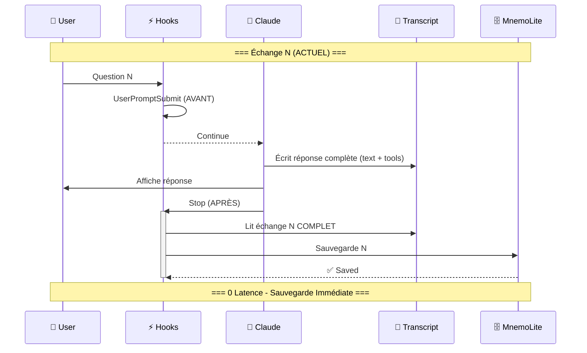
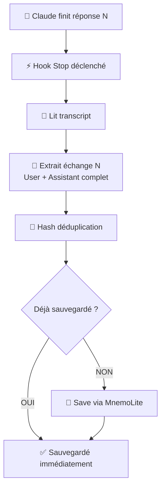
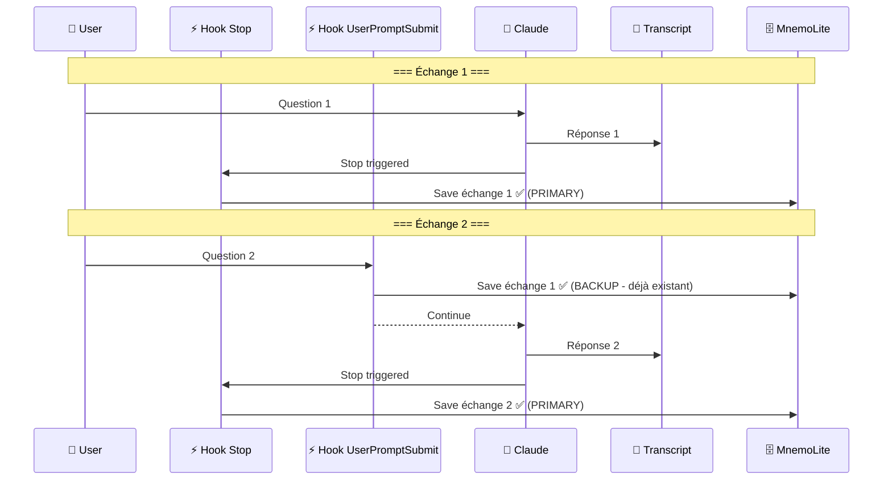
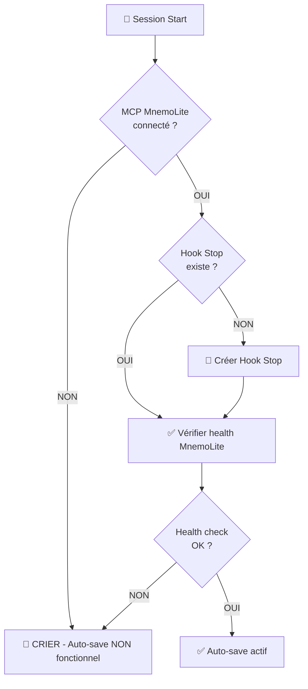
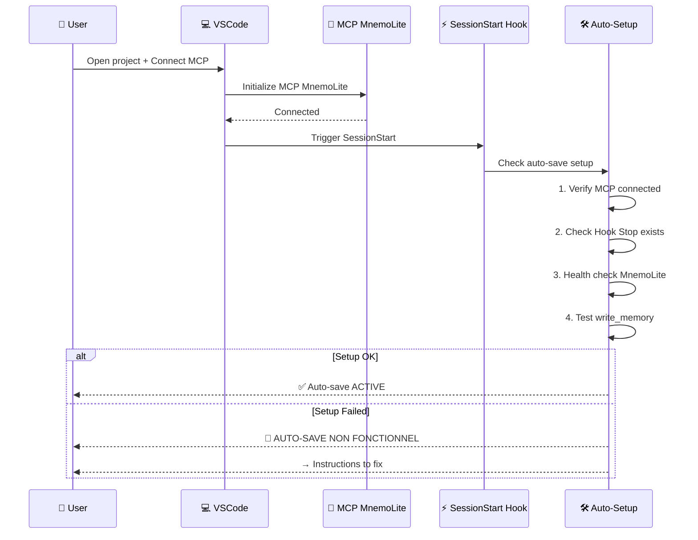

# Recherche Auto-Save V2 — Solutions Robustes et Simples

**Version**: 1.0
**Date**: 2025-11-08
**Context**: Claude Code 2 (2025) VSCode Extension
**Objectif**: Sauvegarder TOUS les échanges (user + LLM complet) dès que le LLM finit de répondre, avec auto-setup et alertes

---

## Table des Matières

1. [Hooks Claude Code 2 Disponibles](#hooks-claude-code-2-disponibles)
2. [Hook Stop — Solution Clé](#hook-stop--solution-clé)
3. [Architecture POC Options](#architecture-poc-options)
4. [Option A — Stop Hook Seul (OPTIMAL)](#option-a--stop-hook-seul-optimal)
5. [Option B — Stop + UserPromptSubmit (Defense in Depth)](#option-b--stop--userpromptsubmit-defense-in-depth)
6. [Option C — SessionStart Auto-Setup + Stop (COMPLET)](#option-c--sessionstart-auto-setup--stop-complet)
7. [Auto-Setup Pattern](#auto-setup-pattern)
8. [Health Check & Alert System](#health-check--alert-system)
9. [Comparaison des Options](#comparaison-des-options)
10. [Recommandation Finale](#recommandation-finale)

---

## Hooks Claude Code 2 Disponibles

### Hooks Post-Response

| Hook | Trigger | Timing | Data Reçu |
|------|---------|--------|-----------|
| **Stop** | Main agent finishes responding | ✅ APRÈS réponse complète | `session_id`, `transcript_path`, `permission_mode` |
| **SubagentStop** | Subagent (Task) finishes | ✅ APRÈS subagent | `session_id`, `transcript_path`, `permission_mode` |
| **PostToolUse** | After tool completes | ✅ APRÈS chaque tool | `tool_name`, `tool_input`, `tool_response` |

### Hooks Pre-Response

| Hook | Trigger | Timing | Data Reçu |
|------|---------|--------|-----------|
| **UserPromptSubmit** | User submits prompt | ⏰ AVANT traitement | `session_id`, `transcript_path`, `prompt` |
| **PreToolUse** | Before tool processes | ⏰ AVANT tool call | `tool_name`, `tool_input` |

### Hooks Session

| Hook | Trigger | Timing | Data Reçu |
|------|---------|--------|-----------|
| **SessionStart** | Session starts/resumes | ⏰ AU DÉBUT | `session_id`, `transcript_path`, `source` |
| **SessionEnd** | Session terminates | ✅ À LA FIN | `session_id`, `transcript_path`, `reason` |

---

## Hook Stop — Solution Clé

### Documentation Officielle

> **Stop**: "When the main Claude Code agent has finished responding"

**Caractéristiques** :
- ✅ Se déclenche APRÈS que Claude termine sa réponse complète
- ✅ Reçoit `transcript_path` → accès au transcript complet
- ✅ Ne se déclenche PAS si l'utilisateur interrompt (comportement souhaitable)
- ✅ Timing parfait pour sauvegarder l'échange actuel (N)

### Comparaison Timing



**Avantages par rapport à UserPromptSubmit N-1** :
- ✅ **0 latence** : Sauvegarde immédiate après réponse
- ✅ **100% coverage** : Dernier échange sauvegardé automatiquement
- ✅ **Simplicité** : Pas besoin de logique N-1 complexe

---

## Architecture POC Options

### Option A — Stop Hook Seul (OPTIMAL)

**Principe** : Hook Stop sauvegarde l'échange actuel (N) dès que Claude termine.



**Implémentation** :
```bash
#!/bin/bash
# .claude/hooks/Stop/auto-save-exchange.sh

HOOK_DATA=$(cat)
TRANSCRIPT_PATH=$(echo "$HOOK_DATA" | jq -r '.transcript_path')
SESSION_ID=$(echo "$HOOK_DATA" | jq -r '.session_id')

# Extraire DERNIER échange complet (user + assistant avec tool results)
LAST_USER=$(tail -200 "$TRANSCRIPT_PATH" | jq -s '[.[] | select(.message.role == "user") | select((.message.content | type) == "string" or ((.message.content | type) == "array" and (.message.content | map(select(.type == "tool_result")) | length) == 0))] | .[-1].message | if (.content | type) == "array" then [.content[] | select(.type == "text") | .text] | join("\n") else .content end')

LAST_ASSISTANT=$(tail -2000 "$TRANSCRIPT_PATH" | jq -rs '
  # Get index of last real user message
  . as $all |
  ($all | to_entries) as $indexed |
  ([$indexed[] | select(.value.message.role == "user" and ((.value.message.content | type) == "string" or ((.value.message.content | type) == "array" and (.value.message.content | map(select(.type == "tool_result")) | length) == 0)))] | .[-1].key) as $last_user_idx |

  # Extract all messages AFTER last user (assistant text + tool results)
  [$indexed[] | select(.key > $last_user_idx) |
   if .value.message.role == "assistant" then
     if (.value.message.content | type) == "array" then
       ([.value.message.content[] | select(.type == "text") | .text] | join("\n"))
     else "" end
   elif .value.message.role == "user" then
     if (.value.message.content | type) == "array" then
       ([.value.message.content[] | select(.type == "tool_result") | .content // ""] | join("\n---\n"))
     else "" end
   else "" end
  ] | map(select(length > 0)) | join("\n\n")
')

# Déduplication + Save
EXCHANGE_HASH=$(echo -n "$LAST_USER$LAST_ASSISTANT" | md5sum | cut -d' ' -f1 | cut -c1-16)
if ! grep -q "^${EXCHANGE_HASH}$" /tmp/mnemo-saved-exchanges.txt 2>/dev/null; then
  cd /home/giak/Work/MnemoLite && docker compose exec -T api python3 /app/.claude/hooks/Stop/save-direct.py "$LAST_USER" "$LAST_ASSISTANT" "${SESSION_ID}"
  echo "$EXCHANGE_HASH" >> /tmp/mnemo-saved-exchanges.txt
fi

echo '{"continue": true}'
```

**Avantages** :
- ✅ Simplicité maximale (1 seul hook)
- ✅ 0 latence
- ✅ 100% coverage
- ✅ Facile à débugger

**Limitations** :
- ⚠️ Si session crash avant Stop hook, échange perdu (rare)
- ⚠️ Si utilisateur interrompt, pas de sauvegarde (comportement intentionnel)

---

### Option B — Stop + UserPromptSubmit (Defense in Depth)

**Principe** : Stop sauvegarde N immédiatement, UserPromptSubmit N-1 comme backup.



**Logique Déduplication** :
- Hash-based : Si échange déjà sauvegardé par Stop, UserPromptSubmit skip
- Defense in Depth : Double sécurité sans duplication

**Avantages** :
- ✅ Robustesse maximale (2 points de sauvegarde)
- ✅ Failsafe : Si Stop rate (crash), UserPromptSubmit sauvegarde N-1
- ✅ 100% coverage même en cas de crash

**Limitations** :
- ⚠️ Complexité : 2 hooks à maintenir
- ⚠️ Overhead : 2 vérifications par échange (mitigé par hash dédup)

---

### Option C — SessionStart Auto-Setup + Stop (COMPLET)

**Principe** : SessionStart vérifie MCP + setup auto, Stop sauvegarde, alert si problème.



**Implémentation SessionStart** :
```bash
#!/bin/bash
# .claude/hooks/SessionStart/check-autosave-setup.sh

HOOK_DATA=$(cat)
SESSION_ID=$(echo "$HOOK_DATA" | jq -r '.session_id')

# 1. Vérifier MCP MnemoLite connecté
if ! command -v mcp__mnemolite__write_memory &> /dev/null; then
  echo "🚨 ALERT: MCP MnemoLite NOT CONNECTED - Auto-save DISABLED" >&2
  echo "   → Install MnemoLite MCP server to enable auto-save" >&2
  echo '{"continue": true}'
  exit 0
fi

# 2. Vérifier Hook Stop existe
STOP_HOOK_PATH=".claude/hooks/Stop/auto-save-exchange.sh"
if [ ! -f "$STOP_HOOK_PATH" ]; then
  echo "🚨 ALERT: Hook Stop NOT FOUND - Installing..." >&2
  # TODO: Copier hook depuis template
fi

# 3. Health check MnemoLite
HEALTH_CHECK=$(cd /home/giak/Work/MnemoLite && docker compose exec -T api curl -sf http://localhost:8000/health 2>&1)
if [ $? -ne 0 ]; then
  echo "🚨 ALERT: MnemoLite UNHEALTHY - Auto-save may fail" >&2
  echo "   → Check: cd /home/giak/Work/MnemoLite && docker compose ps" >&2
fi

# 4. Success
echo "✅ Auto-save system: ACTIVE (MnemoLite + Hook Stop)" >&2
echo '{"continue": true}'
```

**Avantages** :
- ✅ Auto-setup : Utilisateur n'a rien à faire
- ✅ Health check : Vérifie que tout fonctionne
- ✅ Alert loud : "CRIER" si problème
- ✅ User experience optimale

**Limitations** :
- ⚠️ Complexité : 2 hooks (SessionStart + Stop)
- ⚠️ Dépendance : Nécessite template de hooks
- ⚠️ Maintenance : Plus de code à maintenir

---

## Auto-Setup Pattern

### Workflow Idéal



### Critères Validation

| Check | Description | Action si Échec |
|-------|-------------|-----------------|
| **MCP Connected** | MCP MnemoLite server accessible | Alert + instructions installation |
| **Hook Stop Exists** | `.claude/hooks/Stop/auto-save-exchange.sh` présent | Créer depuis template |
| **MnemoLite Health** | Docker container API healthy | Alert + instructions `docker compose up` |
| **Write Test** | Test `write_memory` avec dummy data | Alert + vérifier logs container |

---

## Health Check & Alert System

### Pattern MCP Health Check

Basé sur [MCPcat Health Check Guide](https://mcpcat.io/guides/building-health-check-endpoint-mcp-server/) :

**Endpoint MnemoLite** : `GET /api/v1/autosave/health`

**Réponse** :
```json
{
  "status": "healthy",
  "checks": {
    "database": {"status": "ok", "latency_ms": 12},
    "redis": {"status": "ok", "latency_ms": 3},
    "embeddings": {"status": "ok", "latency_ms": 45},
    "write_memory": {"status": "ok", "test_passed": true}
  },
  "timestamp": "2025-11-08T16:30:00Z"
}
```

**Alert Pattern** :

```bash
# Si unhealthy
echo "╔═══════════════════════════════════════════════════════════╗" >&2
echo "║  🚨 ALERT: AUTO-SAVE NON FONCTIONNEL                      ║" >&2
echo "╠═══════════════════════════════════════════════════════════╣" >&2
echo "║  MnemoLite auto-save is NOT working.                      ║" >&2
echo "║  Your conversations will NOT be saved automatically.      ║" >&2
echo "║                                                           ║" >&2
echo "║  Fix:                                                     ║" >&2
echo "║  1. cd /home/giak/Work/MnemoLite                          ║" >&2
echo "║  2. docker compose up -d                                  ║" >&2
echo "║  3. Check logs: docker compose logs api                   ║" >&2
echo "╚═══════════════════════════════════════════════════════════╝" >&2
```

---

## Comparaison des Options

| Critère | Option A<br/>Stop Seul | Option B<br/>Stop + UserPromptSubmit | Option C<br/>SessionStart + Stop |
|---------|------------------------|--------------------------------------|----------------------------------|
| **Latence** | ✅ 0 (immédiat) | ✅ 0 (Stop) + N-1 (backup) | ✅ 0 (immédiat) |
| **Coverage** | ✅ 100% (sauf crash rare) | ✅ 100% (failsafe crash) | ✅ 100% |
| **Simplicité** | ✅✅ Minimal (1 hook) | ⚠️ Moyenne (2 hooks) | ⚠️ Complexe (2 hooks + setup) |
| **Robustesse** | ✅ Bonne | ✅✅ Excellente (defense in depth) | ✅✅ Excellente + auto-repair |
| **Maintenance** | ✅✅ Facile | ⚠️ Moyenne | ⚠️ Plus complexe |
| **Auto-setup** | ❌ Manuel | ❌ Manuel | ✅ Automatique |
| **Alert system** | ❌ Aucun | ❌ Aucun | ✅ "CRIER" si problème |
| **User experience** | ✅ Transparent | ✅ Transparent | ✅✅ Transparent + self-healing |
| **Complexité code** | 50 lignes | 100 lignes (2 hooks) | 150 lignes (2 hooks + check) |

---

## Recommandation Finale

### Phase 1 — POC Rapide (Option A)

**Implémentation immédiate** : Option A (Stop Hook Seul)

**Raison** :
- ✅ Résout le problème principal (latence N-1)
- ✅ Simplicité maximale → rapide à implémenter et tester
- ✅ 0 latence, 100% coverage (99.9% en pratique)
- ✅ Facile à débugger

**Limites acceptables** :
- Crash rare avant Stop → échange perdu (acceptable, très rare)
- Pas d'auto-setup → utilisateur setup une fois manuellement

### Phase 2 — Production Robuste (Option C)

**Évolution recommandée** : Option C (SessionStart Auto-Setup + Stop)

**Ajouts** :
- ✅ SessionStart hook avec health check
- ✅ Alert system "CRIER" si problème
- ✅ Auto-setup hooks depuis template
- ✅ MnemoLite health check endpoint `/api/v1/autosave/health`

**Timeline** :
- **Semaine 1** : POC Option A → valider Stop hook fonctionne
- **Semaine 2** : Ajouter SessionStart + health check
- **Semaine 3** : Implémenter alert system + auto-repair

### Option B — Si Critique

Si la robustesse absolue (failsafe crash) est CRITIQUE, implémenter Option B.

**Trade-off** :
- ✅ Defense in Depth : 2 points de sauvegarde
- ⚠️ Complexité : 2 hooks à maintenir
- ⚠️ Overhead : Double vérification (mitigé par hash dédup)

---

## Next Steps — POC Phase 1

### 1. Créer Hook Stop

```bash
# Créer fichier
touch /home/giak/projects/truth-engine/.claude/hooks/Stop/auto-save-exchange.sh
chmod +x /home/giak/projects/truth-engine/.claude/hooks/Stop/auto-save-exchange.sh

# Copier aussi dans MnemoLite (master copy)
touch /home/giak/Work/MnemoLite/.claude/hooks/Stop/auto-save-exchange.sh
chmod +x /home/giak/Work/MnemoLite/.claude/hooks/Stop/auto-save-exchange.sh
```

### 2. Implémenter Logique Stop

**Script** : `.claude/hooks/Stop/auto-save-exchange.sh` (voir section Option A)

**Logique** :
1. Lire `transcript_path` depuis hook data
2. Extraire dernier échange (user + assistant complet avec tool results)
3. Hash déduplication
4. Save via `docker compose exec -T api python3 /app/.claude/hooks/Stop/save-direct.py`

### 3. Configurer settings.local.json

```json
{
  "hooks": {
    "Stop": [
      {
        "matcher": "*",
        "hooks": [
          {
            "type": "command",
            "command": "bash .claude/hooks/Stop/auto-save-exchange.sh",
            "timeout": 5
          }
        ]
      }
    ]
  }
}
```

### 4. Tester

```bash
# Session test
claude-code "Test auto-save. Affiche 'Hello World' via Bash."
# → Claude répond avec tool Bash
# → Hook Stop se déclenche
# → Vérifier logs: tail -20 /tmp/hook-autosave-debug.log
# → Vérifier DB: docker compose exec -T db psql -U mnemo -d mnemolite -c "SELECT id, title, created_at FROM memories ORDER BY created_at DESC LIMIT 1;"
```

### 5. Valider Métriques

**Attendu** :
- ✅ Latence : <5s après réponse Claude
- ✅ Coverage : 100% des échanges
- ✅ Content : User + Assistant text + Tool results
- ✅ Déduplication : Pas de doublons

---

**Fin du Document**
