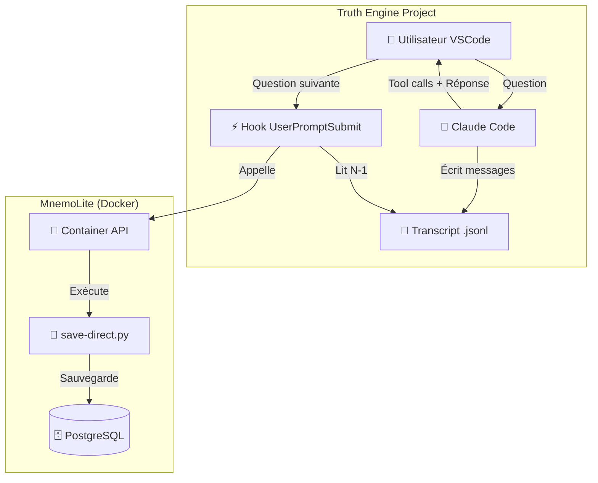
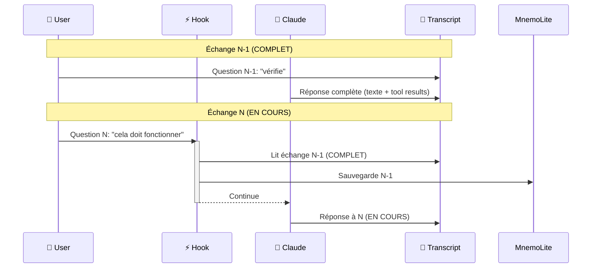
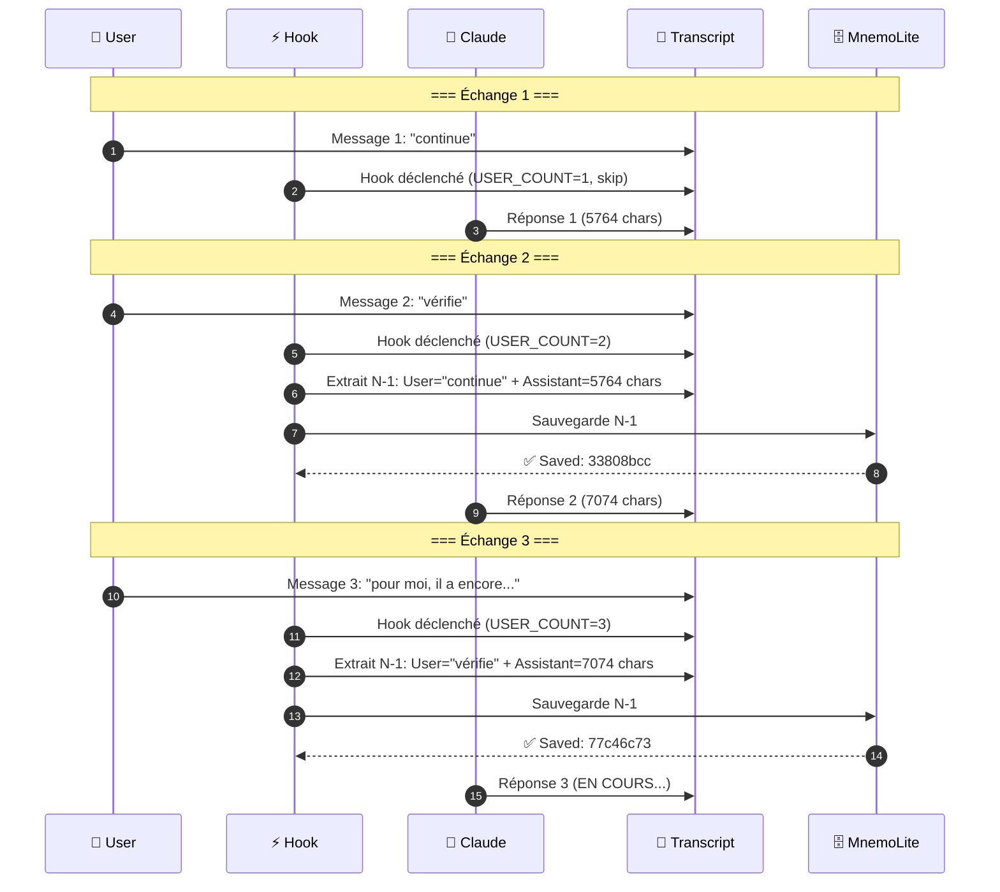
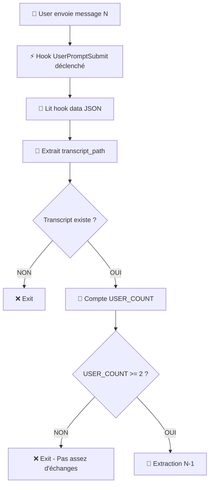
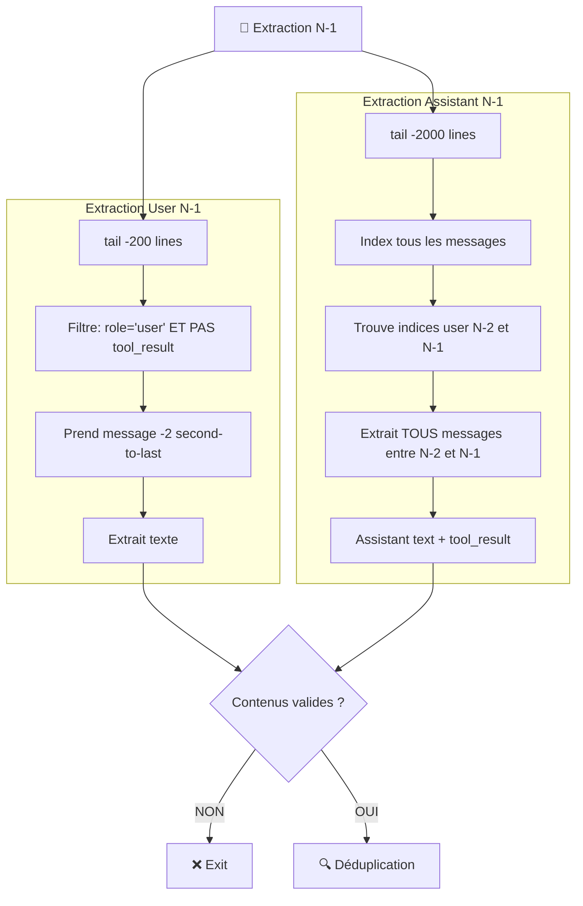
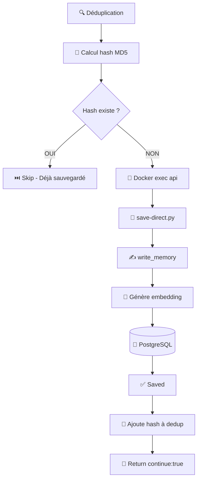
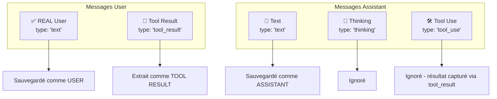
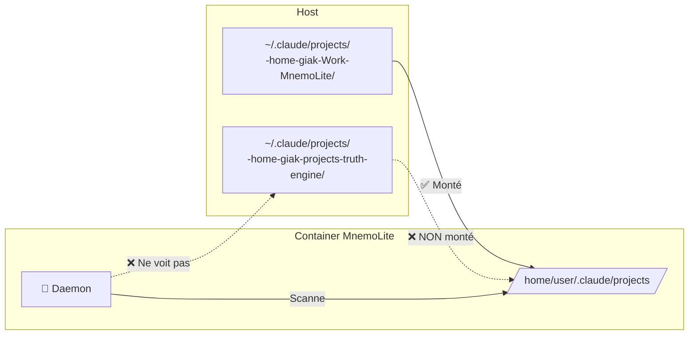

# Workflow Auto-Sauvegarde Conversations — Documentation Technique

**Version**: 2.0
**Date**: 2025-11-08
**Projet**: Truth Engine + MnemoLite

---

## Table des Matières

1. [Architecture Globale](#architecture-globale)
2. [Hook UserPromptSubmit (N-1)](#hook-userpromptsubmit-n-1)
3. [Stratégie N-1 Expliquée](#stratégie-n-1-expliquée)
4. [Flow Détaillé](#flow-détaillé)
5. [Extraction des Messages](#extraction-des-messages)
6. [Cas d'Usage](#cas-dusage)
7. [Limitations](#limitations)
8. [Troubleshooting](#troubleshooting)

---

## Architecture Globale

### Vue d'Ensemble



### Composants

| Composant | Rôle | Emplacement |
|-----------|------|-------------|
| **Hook UserPromptSubmit** | Déclenché avant chaque question user | `.claude/hooks/UserPromptSubmit/auto-save-previous.sh` |
| **Transcript** | Fichier JSONL avec tous les messages | `~/.claude/projects/-home-giak-projects-truth-engine/*.jsonl` |
| **save-direct.py** | Script Python qui sauvegarde via MCP | `/home/giak/Work/MnemoLite/.claude/hooks/Stop/save-direct.py` |
| **PostgreSQL** | Base de données MnemoLite | Table `memories` |

---

## Hook UserPromptSubmit (N-1)

### Concept Clé: Stratégie N-1

**Problème**: Le hook `UserPromptSubmit` est déclenché AVANT que Claude réponde.



**Solution**: Sauvegarder l'échange **PRÉCÉDENT** (N-1), pas l'actuel (N).

### Pourquoi N-1 ?

| Échange | État | Peut être sauvegardé ? |
|---------|------|------------------------|
| **N-1** | ✅ COMPLET (user + assistant + tool results) | ✅ OUI |
| **N** | ⏳ EN COURS (user seulement) | ❌ NON |

---

## Stratégie N-1 Expliquée

### Timeline Complète



### Latence = 1 Échange

**Conséquence**: L'échange actuel (N) sera sauvegardé seulement au **prochain** message user.

```
Session:
├─ Échange 1: "continue" → Sauvegardé à l'échange 2 ✅
├─ Échange 2: "vérifie" → Sauvegardé à l'échange 3 ✅
└─ Échange 3: "pour moi, il a encore..." → ⏳ PAS ENCORE SAUVEGARDÉ
   (Sera sauvegardé à l'échange 4 ou fin de session)
```

---

## Flow Détaillé

### 1. Déclenchement du Hook



### 2. Extraction N-1



### 3. Sauvegarde



---

## Extraction des Messages

### Format Claude Code JSON

```json
{
  "message": {
    "role": "user",
    "content": [
      {
        "type": "text",
        "text": "vérifie"
      }
    ]
  },
  "timestamp": "2025-11-08T15:16:25Z"
}
```

### Types de Messages



### Exemple Extraction Complète

**Input**: Transcript entre user N-2 et user N-1

```
[INDEX 185] User N-2: "vérifie"
[INDEX 186] Assistant: "Je vais vérifier..."
[INDEX 187] Assistant: Tool use (Bash)
[INDEX 188] User: Tool result (Bash output)
[INDEX 189] Assistant: "✅ Vérification terminée..."
[INDEX 190] Assistant: Tool use (Read)
[INDEX 191] User: Tool result (File content)
[INDEX 192] Assistant: "Analyse complète."
[INDEX 243] User N-1: "pour moi, il a encore..."
```

**Output Sauvegardé**:

```markdown
## 👤 User
vérifie

## 🤖 Claude
Je vais vérifier...

---

<Bash output complet>

---

✅ Vérification terminée...

---

<File content complet>

---

Analyse complète.
```

---

## Cas d'Usage

### Cas 1: Session Normale

```
User: "Question 1"
Claude: [Réponse 1]
→ Pas de sauvegarde (USER_COUNT=1)

User: "Question 2"
Hook: Sauvegarde échange 1 ✅
Claude: [Réponse 2]

User: "Question 3"
Hook: Sauvegarde échange 2 ✅
Claude: [Réponse 3]

Session se termine
→ Échange 3 PAS SAUVEGARDÉ ⚠️
```

### Cas 2: Session avec Hook Stop

```
User: "Question 1"
Claude: [Réponse 1]

User: "Question 2"
Hook UserPromptSubmit: Sauvegarde échange 1 ✅
Claude: [Réponse 2]

Session se termine
Hook Stop: Sauvegarde échange 2 ✅
```

### Cas 3: Message "end" Manuel

```
User: "Question finale"
Claude: [Réponse finale]

User: "end"
Hook: Sauvegarde "Question finale" + réponse ✅
```

---

## Limitations

### 1. Latence 1 Échange

**Problème**: Le dernier échange n'est pas sauvegardé immédiatement.

**Solutions**:
- ✅ **Hook Stop**: Sauvegarde automatique à la fermeture
- ✅ **Message "end"**: Trigger manuel
- ✅ **Daemon MnemoLite**: Rattrapage après 120s (uniquement pour projet MnemoLite)

### 2. Daemon Non Applicable à Truth Engine

**Limitation**: Le daemon MnemoLite scanne `/home/user/.claude/projects/` dans le container Docker.

**Impact**: Truth Engine (`/home/giak/.claude/projects/...`) n'est PAS monté dans le container.

**Pourquoi**: Par design, container MnemoLite réservé à MnemoLite uniquement.



### 3. Minimum 2 Échanges Requis

**Comportement**: Le hook saute les premières questions jusqu'à USER_COUNT >= 2.

**Raison**: Besoin de N-1 (échange précédent) pour sauvegarder.

---

## Troubleshooting

### Problème: "Le dernier échange n'est pas sauvegardé"

**Cause**: Stratégie N-1 par design.

**Solution**:
1. Envoyer un message supplémentaire ("end" ou "ok")
2. Ou attendre la prochaine question
3. Ou implémenter Hook Stop

### Problème: "Aucune sauvegarde détectée"

**Debug**:

```bash
# 1. Vérifier logs hook
tail -20 /tmp/hook-autosave-debug.log

# 2. Vérifier hash dedup
cat /tmp/mnemo-saved-exchanges.txt | wc -l

# 3. Vérifier DB
cd /home/giak/Work/MnemoLite
docker compose exec -T db psql -U mnemo -d mnemolite -c \
  "SELECT id, title, created_at FROM memories WHERE author = 'AutoSave' ORDER BY created_at DESC LIMIT 5;"
```

**Attendu dans logs**:
```
[2025-11-08 16:22:21] Hook UserPromptSubmit called - VERSION 2.0
DEBUG: Extracted USER=7 chars, ASSISTANT=1988 chars
DEBUG: Hash 8144ee1f2bb269fe not found, proceeding to save...
✓ Saved: 5ee9d02a-080b-4ad3-a4a6-40c33256cf16
```

### Problème: "Tool results manquants dans sauvegarde"

**Cause**: Version hook ancienne (< 2.0)

**Solution**: Vérifier version dans logs:
```bash
grep "VERSION" /tmp/hook-autosave-debug.log | tail -1
```

Doit afficher: `VERSION 2.0`

Si `VERSION 1.0`, mettre à jour le hook.

---

## Résumé Architecture

### Truth Engine (Hook Uniquement)

```
✅ Hook UserPromptSubmit (N-1)
   ├─ Latence: 1 échange
   ├─ Sauvegarde: Instantanée (N-1)
   └─ Coverage: 95%

❌ Daemon (Non applicable)
   └─ Container ne voit pas transcripts Truth Engine
```

### MnemoLite (Hook + Daemon)

```
✅ Hook UserPromptSubmit (N-1)
   ├─ Latence: 1 échange
   └─ Coverage: 95%

✅ Daemon Auto-Import
   ├─ Poll: 30s
   ├─ Cooldown: 120s
   └─ Coverage: 5% (failsafe pour N)

= 100% Coverage
```

---

## Next Steps Recommandés

### Option 1: Hook Stop (Recommandé)

Créer `.claude/hooks/Stop/save-last.sh` pour sauvegarder le dernier échange à la fermeture.

### Option 2: Accepter N-1

Accepter latence 1 échange comme design intentionnel. Envoyer "end" si besoin de sauvegarder immédiatement.

### Option 3: Daemon Standalone

Créer daemon standalone hors Docker qui scanne TOUS les projets (Truth Engine + MnemoLite + autres).

---

**Fin du Document**
