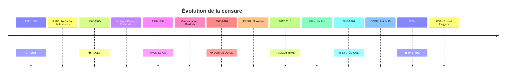
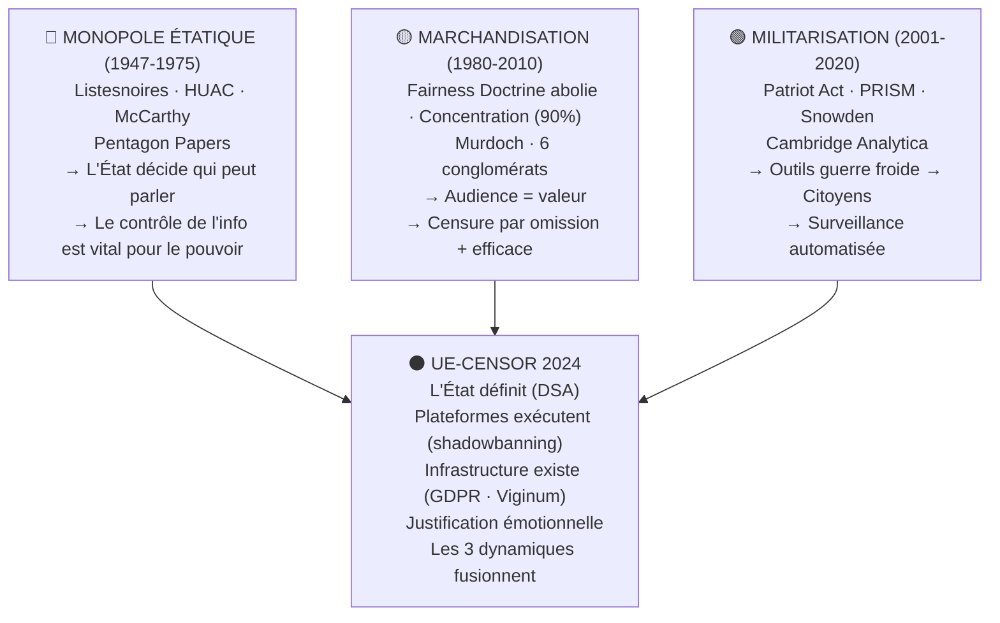
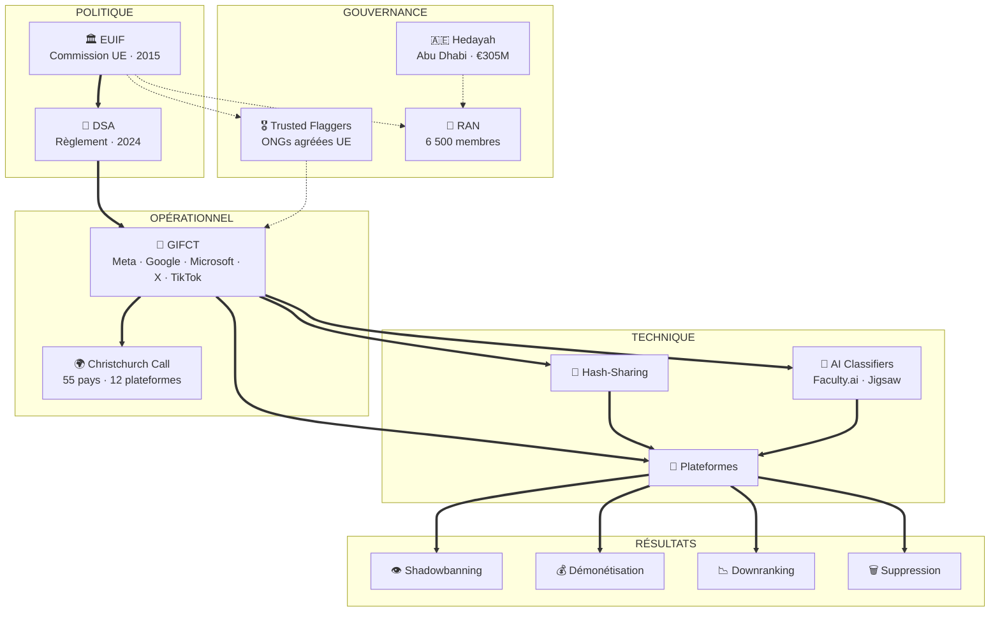

# MÉMOIRE UE-CENSOR — Index pour Mnemolite

**Date de création** : 2026-02-06
**Statut** : À indexer vers Mnemolite
**Tags** : #UE-Censor #censure #GDPR #DSA #GIFCT #Hedayah #EUIF

---

## 1. THÈSE CENTRALE

**La censure algorithmique de 2026 est la synthèse de trois dynamiques historiques :**

1. **Monopole étatique de la certification** (1947-1975)
   - HUAC, McCarthy, Listesnoires
   - Question : "Qui décide du vrai ?"
   - Réponse : L'État

2. **Marchandisation de l'information** (1980-2010)
   - Fairness Doctrine abolie, Concentration médiatique (Murdoch)
   - Question : "Comment monétiser ?"
   - Réponse : Audience = valeur

3. **Militarisation de la surveillance** (2001-2020)
   - Patriot Act, PRISM, Snowden, Cambridge Analytica
   - Question : "Comment surveiller ?"
   - Réponse : Données = pouvoir

**Convergence (2024+)** : UE-Censor combine les 3 dynamiques

---

## 2. CHRONOLOGIE 1947-2026

### Période 1 : GUERRE FROIDE (1947-1957)
- 1947 : HUAC lance les auditions
- 1947 : Hollywood Ten emprisonnés
- 1950 : McCarthyisme débute
- 1950 : Operation Mockingbird (CIA)
- 1956 : COINTELPRO (FBI)

### Période 2 : VIETNAM (1960-1975)
- 1965 : Guerre du Vietnam débute
- 1971 : Pentagon Papers (Ellsberg)
- 1971 : NYT v. United States

### Période 3 : CONCENTRATION MÉDIATIQUE (1980-1999)
- 1987 : Fairness Doctrine abolie
- 1990s : Murdoch, Berlusconi
- 1996 : Telecommunications Act

### Période 4 : INTERNET & SURVEILLANCE (2000-2010)
- 2001 : Patriot Act (USA)
- 2006 : Data Retention Directive (UE)
- 2007 : PRISM (NSA)
- 2013 : Révélations Snowden

### Période 5 : RÉSEAUX SOCIAUX (2010-2016)
- 2010 : WikiLeaks (Chelsea Manning)
- 2011 : Arab Spring
- 2012 : Wikipedia blackout (SOPA/PIPA)
- 2012+ : Persécution Assange

### Période 6 : MANIPULATION DES DONNÉES (2013-2018)
- 2013 : Cambridge Analytica
- 2014-2016 : Micro-targeting élections
- 2016 : "Post-vérité" (Oxford)

### Période 7 : RÉGULATION EUROPÉENNE (2018-2020)
- 2018 : GDPR
- 2019 : Directive Copyright (Article 13)
- 2019 : Viginum (France)

---

## 3. STRUCTURE UE-CENSOR

### Institutions clés

| Institution | Année | Rôle |
|-------------|-------|------|
| **Hedayah** | 2012 | Centre Abu Dhabi, €305M UE |
| **EUIF** | 2015 | Coordination lutte contenus |
| **Code Conduite Haine** | 2016 | Meta, YouTube, Microsoft, Twitter |
| **GIFCT** | 2017 | Hash-Sharing Database |
| **Code Désinformation** | 2018 | 21 engagements |
| **GDPR** | 2018 | Protection données |
| **Directive Copyright** | 2019 | Article 13/17 |
| **Viginum** | 2019 | Désinformation France |
| **DSA** | 2024 | Amendes 6% CA mondial |

### Mécanismes de censure

1. **Shadowbanning** : Réduction invisible de la visibilité
2. **Hash-Sharing** : Base de données partagée entre plateformes
3. **Trusted Flaggers** : ONGs agréées UE avec pouvoir prioritaire
4. **AI Classifiers** : Faculty.ai, Jigsaw
5. **Downranking** : Suppression des recommandations

### 14 catégories de contenus surveillés (GIFCT 2023)

1. Discours de haine
2. Sentiment anti-réfugié
3. Stéréotypes et déshumanisation
4. Symboles de groupes violents
5. Culture du mème
6. Désinformation
7. Incitation à la violence
8. Contenu anti-immigrant
9. Matériel d'instruction sur les armes
10. Contenu violent/graphique
11. **Rhétorique populiste — nationalisme**
12. **Contenu anti-gouvernemental / anti-UE**
13. **Discours anti-élites**
14. **Satire politique**

---

## 4. SOURCES DOCUMENTAIRES

### Rapports officiels
- **US House Judiciary Report** (7 826 lignes + 302 exhibits)
  - PART I : "The Foreign Censorship Threat" (juillet 2025)
  - PART II : "The Foreign Censorship Threat" (février 2026)
- **EU Internet Forum Brochure** (2025)
- **GIFCT Borderline Content Document** (674 lignes, juin 2023)

### Décisions de justice
- **Gand, 3 juin 2024** : Meta condamné pour shadowbanning (€27 279)
- **CJUE, 4 juillet 2023** : Meta condamné abus de position dominante (€1,2 Md)
- **Varsovie, mars 2024** : Ordre de restauration pages (Meta fait appel)
- **Kenya, 20 septembre 2024** : Droits modérateurs reconnus

### Études académiques
- University of Antwerp : "AI content moderation and freedom of expression" (2024)
- University of Auckland : Christchurch Call Study
- Just Security : "GIFCT Transparency Report" (septembre 2019)

### Investigations journalistiques
- Wired : "Two Years of Turmoil at Big Tech's Anti-Terrorism Group" (2024)
- The Guardian, NY Times : Cambridge Analytica (2018)

---

## 5. PREUVES CONCRÈTES

### Cas documentés de censure politique

**Belgique — Tom Vandendriessche (2021)**
- Shadowbanning pendant 10 mois (février-décembre 2021)
- Meta réduit visibilité sans notification
- Condamnation juin 2024 : €27 279

**Slovaquie 2023**
- Contenus biologiques supprimés :
  - "Il n'y a que deux genres"
  - "Les enfants ne peuvent pas être trans"

**Roumanie 2024**
- Élections annulées pour Calin Georgescu
- Aucune preuve d'ingérence russe (email interne TikTok)
- Candidature libéral financée par parti libéral (contradiction)

**COVID-19**
- Commission UE → YouTube : "Please verify why this content has not been removed"
- YouTube → Commission UE : "We have removed the content"
- Contenu américain protégé 1er Amendement retiré sous pression UE

---

## 6. STRUCTURE ARTICLES

### Article principal UE-Censor
`/home/giak/projects/truth-engine/outputs/articles/2026-02/2026-02-05-ARTICLE_SUBSTACK_UE_CENSOR.md`

**Sections :**
0. Contexte historique (1948-2020)
I. Chronologie (2012-2026)
II. Architecture du contrôle
III. Preuves
IV. Comparaison URSS
V. Invisibilisation algorithmique
VI. Ce qu'on ne sait pas
VII. EU Democracy Shield
VIII. Dimension géopolitique
IX. La Matrice
X. Conclusion
XI. Méthodologie

---

## 7. ÉLÉMENTS VISUELS

### Timeline 1 : Évolution des méthodes de censure



### Timeline 2 : Les 3 dynamiques convergentes



### Architecture UE-Censor



---

## 8. STATISTIQUES

| Indicateur | Valeur |
|------------|--------|
| Années documentées | 72 (1947-2026) |
| Lignes rapport US House | 7 826 + 302 exhibits |
| Entreprises GIFCT (2024) | 25+ |
| Catégories surveillées | 14 (dont 4 politiques) |
| Faux positifs connus | 22% (étude Auckland) |
| Taux de recours réussis | 33% |
| Amende maximale DSA | 6% CA mondial |
| Financement UE → Hedayah | €305M documentés |
| Membres RAN | 6 500 (0.5% identifiés) |

---

## 9. ENSEIGNEMENTS TIRÉS

1. **La censure n'est jamais absolue**
   - Cible certains discours, pas d'autres
   - "Ennemis" évoluent : communistes → terrorists → antivax → populistes

2. **Les crises justifient l'extension**
   - Guerre froide → McCarthyisme
   - 11 septembre → Patriot Act
   - Covid → Censure sanitaire
   - Ukraine → Censure de guerre

3. **Technologie change les outils, pas la logique**
   - Du censeur visible (HUAC) à l'algorithme invisible
   - De la liste noire à la détection automatique

4. **Le pouvoir ne censure pas directement, il délègue**
   - CIA → Journalistes (Operation Mockingbird)
   - UE → Plateformes (Trusted Flaggers)
   - Plateformes → Algorithmes

5. **La résistance existe, mais le coût est personnel**
   - Ellsberg : poursuivi, acquitté
   - Snowden : exilé, poursuivi
   - Assange : emprisonné

6. **Chaque avancée de la censure reste**
   - Patriot Act jamais révoqué
   - Data Retention Directive survécu
   - Infrastructures restent en place

---

## 10. COMMANDES INDEXATION MNEMOLITE

```bash
# Indexer le projet UE-Censor
mnemolite index_project /home/giak/projects/truth-engine/investigations/UE-censor

# Sauvegarder la thèse centrale
mnemolite write_memory --content "Thèse UE-Censor : La censure de 2026 est la synthèse de 3 dynamiques : monopole étatique (1947-1975), marchandisation (1980-2010), militarisation (2001-2020). Convergence = UE-Censor." --tags "ue-censor,thèse"

# Sauvegarder les sources
mnemolite write_memory --content "Sources UE-Censor : US House Report (7826 lignes + 302 exhibits), GIFCT Borderline Content (674 lignes), EUIF Brochure, études académiques (Antwerp, Auckland), Wired investigation, décisions justice (Gand, CJUE, Kenya)." --tags "ue-censor,sources"

# Sauvegarder la chronologie
mnemolite write_memory --content "Chronologie UE-Censor : 1947-1957 (HUAC/McCarthy), 1960-1975 (Pentagon Papers), 1980-1999 (Murdoch), 2000-2010 (PRISM/Snowden), 2012 (Hedayah), 2015 (EUIF), 2017 (GIFCT), 2018 (GDPR), 2019 (Article 13/Viginum), 2024 (DSA)." --tags "ue-censor,chronologie"

# Sauvegarder les preuves
mnemolite write_memory --content "Preuves UE-Censor : Shadowbanning Tom Vandendriessche (2021, €27K), Censure Slovaquie 2023 (genres), Élections Roumanie 2024 (aucune preuve ingérence), COVID (pression UE→YouTube)." --tags "ue-censor,proofs"
```

---

## 11. PROCHAINES ÉTAPES

- [ ] Indexer le projet vers Mnemolite
- [ ] Sauvegarder les 4 mémoires clés (thèse, sources, chronologie, preuves)
- [ ] Créer les connexions graph (sources → thèses → preuves)
- [ ] Tester la recherche mémoire

---

**Document généré** : 2026-02-06
**Statut Mnemolite** : En attente d'indexation
