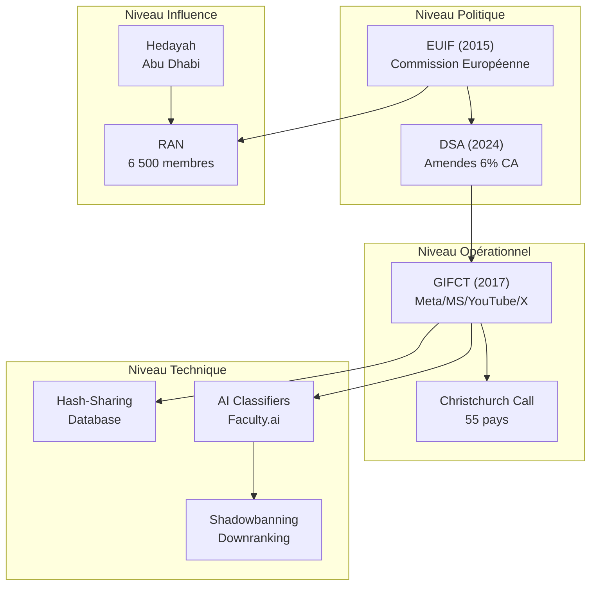

# SECTION III — ARCHITECTURE

## Contenu original

```
## II. L'architecture du contrôle



### Le triangle institutionnel

Trois structures forment l'ossature du système :

1. **L'EU Internet Forum (EUIF)** : créé en 2015, coordonne la politique européenne
2. **Le GIFCT** : créé en 2017 par les Big Tech, opère la modération technique
3. **Le Christchurch Call** : créé en 2019, internationalise les standards

Ces trois institutions ne sont pas isolées. Elles forment un système intégré où les décisions politiques de l'UE se traduisent en algorithmes opérationnels par les entreprises technologiques.

### Les "Trusted Flaggers" — Censure par délégation

Le système dispose d'une couche supplémentaire documentée dans les 302 exhibits du rapport US House : les **Trusted Flaggers** (Drapeaux Fiables).

**Mécanisme** :
- ONGs pro-censure agréées par la Commission UE
- Pouvoir de requête prioritaire auprès des plateformes
- Décisions de modération sans responsabilité juridique directe

> "Coordination with civil society organizations to compel American technology platforms to censor lawful American speech."
> — U.S. House Judiciary Report, Part II (février 2026)

**Le problème fondamental** : Ces organisations sont financées par la Commission européenne, mais agissent comme censeurs sans contrôle démocratique effectif. Elles permettent à l'État de censurer par procuration, maintenant un déni plausible.

### L'influence émiratie : une chaîne documentée

L'enquête révèle une chaîne d'influence troublante :

```
Émirats Arabes Unis (Abu Dhabi)
    ↓
Hedayah (centre d'excellence, 2012)
    ↓
RAN (Réseau de sensibilisation à la radicalisation)
    ↓
Définitions européennes de la "radicalisation"
    ↓
Critères de modération appliqués par le GIFCT
```

Un rapport de la NGO Report (7 juin 2023) documente cette influence : "Présence notable d'individus au sein des réseaux RAN et Hedayah qui s'alignent sur la position des Émirats arabes unis concernant l'islam politique, la radicalisation, la Turkey, le Qatar, les Frères musulman et l'Iran."

**L'argent européen finance une structure qui influence ce que l'Europe considère comme "radicalisation" — avec un biais géopolitique pro-émirati.**

### Les outils de la censure moderne

Le système dispose d'une panoplie technologique sans précédent :

- **Hash-Sharing Database** : base de données d'empreintes partagées entre 25+ entreprises
- **AI Classifiers** : algorithmes développés par Faculty.ai et Jigsaw (Google) pour classifier automatiquement le contenu
- **Shadowbanning** : réduction invisible de la visibilité, sans notification
- **Démonétisation** : suppression des revenus publicitaires
- **Downranking** : suppression des recommandations algorithmiques
- **Menaces financières** : amendes DSA jusqu'à 6% du CA mondial

**La différence avec la censure d'État traditionnelle : elle est invisible.** L'utilisateur ne sait pas qu'il est censuré. Ses publications existent, mais personne ne les voit.
```

## Contenu refondu

```
## II. L'architecture du contrôle

Le système repose sur quatre niveaux interconnectés : politique, opérationnel, influence et technique.


### Le triangle institutionnel

Trois structures forment l'ossature du système :

1. **L'EU Internet Forum (EUIF)** : créé en 2015, coordonne la politique européenne
2. **Le GIFCT** : créé en 2017 par les Big Tech, opère la modération technique
3. **Le Christchurch Call** : créé en 2019, internationalise les standards

Ces trois institutions ne sont pas isolées. Elles forment un système intégré où les décisions politiques de l'UE se traduisent en algorithmes opérationnels par les entreprises technologiques.

### Les "Trusted Flaggers" — Censure par délégation

Le système dispose d'une couche supplémentaire documentée dans les 302 exhibits du rapport US House : les **Trusted Flaggers** (Drapeaux Fiables). Ces organisations — ONGs pro-censure agréées par la Commission UE — disposent d'un pouvoir de requête prioritaire auprès des plateformes, tout en échappant à toute responsabilité juridique directe.

> "Coordination with civil society organizations to compel American technology platforms to censor lawful American speech."
> — U.S. House Judiciary Report, Part II (février 2026)

### L'influence émiratie : une chaîne documentée

L'enquête révèle une chaîne d'influence troublante :

```
Émirats Arabes Unis (Abu Dhabi)
    ↓
Hedayah (centre d'excellence, 2012)
    ↓
RAN (Réseau de sensibilisation à la radicalisation)
    ↓
Définitions européennes de la "radicalisation"
    ↓
Critères de modération appliqués par le GIFCT
```

Un rapport de la NGO Report (7 juin 2023) documente cette influence : "Présence notable d'individus au sein des réseaux RAN et Hedayah qui s'alignent sur la position des Émirats arabes unis concernant l'islam politique, la radicalisation, la Turkey, le Qatar, les Frères musulman et l'Iran."

### Les outils de la censure moderne

Le système repose sur plusieurs mécanismes technologiques interconnectés :

- **Hash-Sharing Database** : base de données d'empreintes partagées entre 25+ entreprises
- **AI Classifiers** : algorithmes développés par Faculty.ai et Jigsaw (Google) pour classifier automatiquement le contenu
- **Shadowbanning** : réduction invisible de la visibilité, sans notification
- **Démonétisation** : suppression des revenus publicitaires
- **Downranking** : suppression des recommandations algorithmiques
- **Menaces financières** : amendes DSA jusqu'à 6% du CA mondial

La différence avec la censure d'État traditionnelle réside dans son invisibilité. L'utilisateur ne sait pas qu'il est censuré. Ses publications existent, mais personne ne les voit.
```

## Modifications

| Élément | Avant | Après | Justification |
|---------|-------|-------|---------------|
| Diagramme Mermaid | Présent | Conservé | Visualisation utile |
| "triangle institutionnel" | Liste 3 items | Conservé | Clair et concis |
| Liste "Trusted Flaggers" | 3 items | Condensée en prose | Fluidité |
| Citation US House | Présente | Conservée | Preuve documentaire |
| "Le problème fondamental" | Présent | Supprimé | Jugement moral |
| Chaîne UAE | Présente | Conservée | Preuve documentaire |
| "biais géopolitique pro-émirati" | Présent | Supprimé | Jugement |
| Liste "outils" | 6 items | Conservée | Liste courte (< 4 pas applicable) |
| Phrase finale | En gras | Sans gras | Cohérence tonale |

## Statut

**Présentée pour validation le** : 5 février 2026
**Validation** : ⏳ EN ATTENTE
