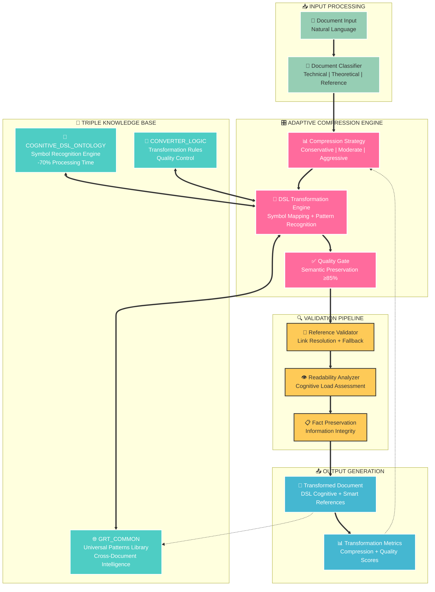
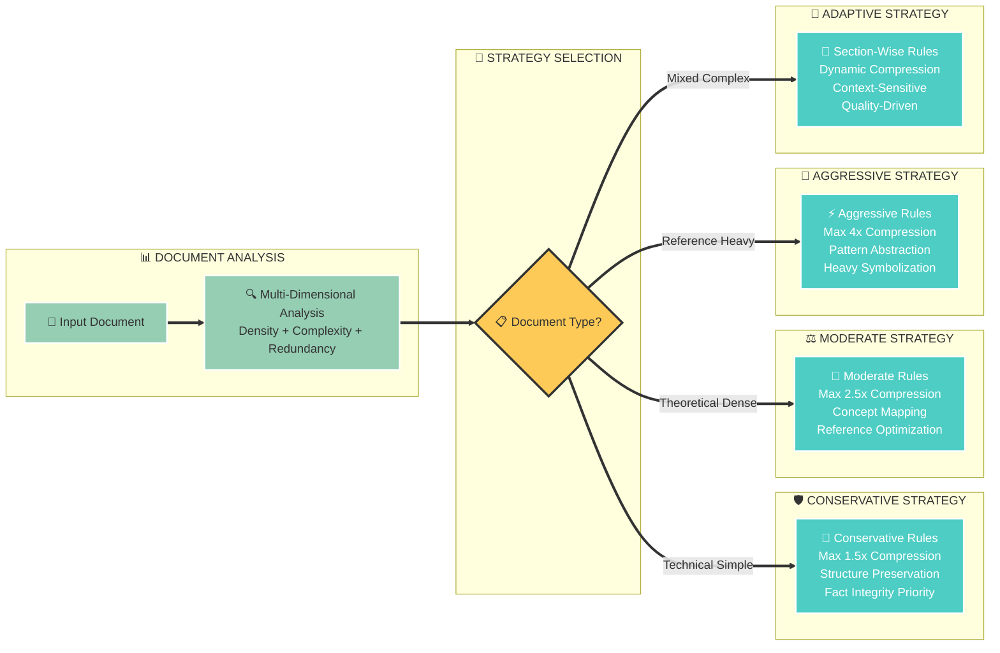
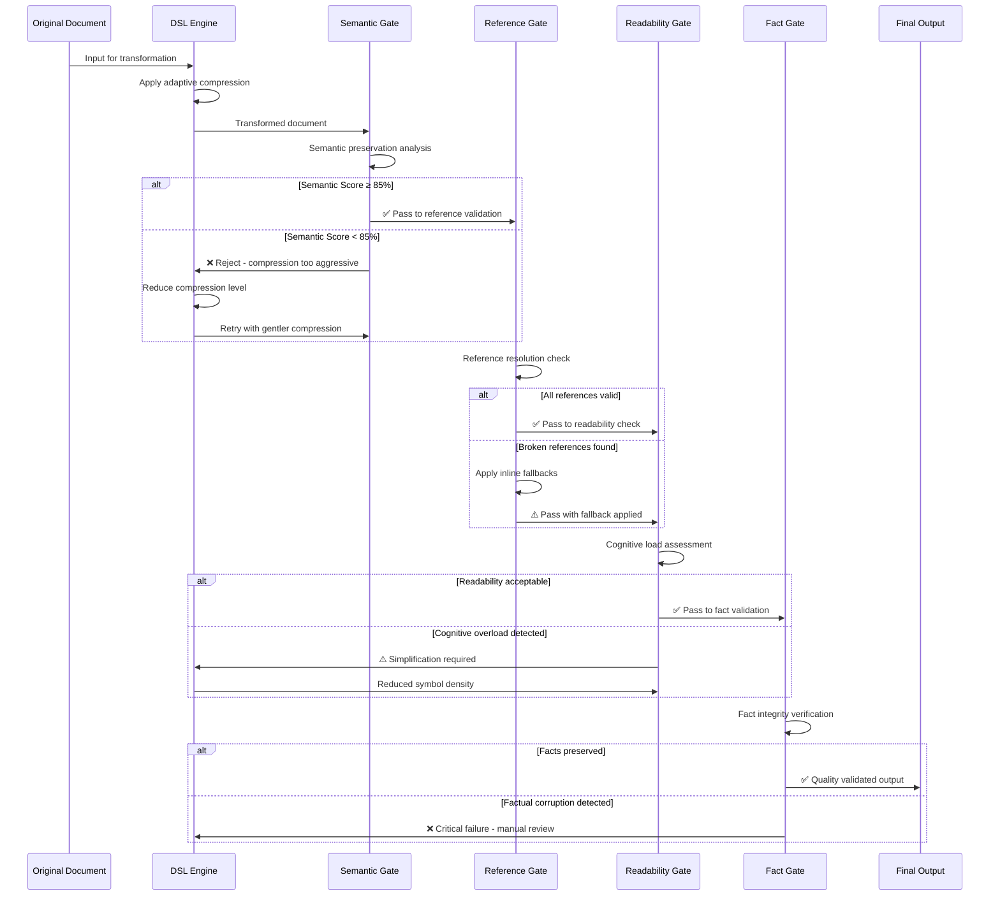

# GRT OPTIMIZED - DOCUMENTATION TECHNIQUE
## Cognitive DSL Transformer - Architecture Triple Knowledge Base Évolutionnaire

**Version** : 0.1 - Adaptive Compression Engine  
**Status** : Production Architecture with Defensive Mechanisms  
**Core Innovation** : Intelligent Document Classification + Adaptive Compression + Quality Gates

---

## 🎯 SYSTEM OVERVIEW - GRT OPTIMIZED

### Mission Système - "L'Alchimiste Numérique Intelligent"

**GRT OPTIMIZED** est un moteur de transformation documentaire intelligent qui convertit le langage naturel en DSL cognitif par compression sémantique adaptative, tout en maintenant un écosystème d'intelligence collective évolutionnaire via une architecture Triple Knowledge Base.

**L'Analogie de l'Alchimiste Moderne** : Imaginez un **maître alchimiste** qui ne se contente plus de transformer le plomb en or de manière brutale, mais qui :
- 🧬 **Analyse d'abord** la nature exacte du métal (document classification)
- ⚙️ **Adapte sa technique** selon le matériau (compression adaptative) 
- 🔍 **Vérifie la pureté** à chaque étape (quality gates)
- 📚 **Apprend** de chaque transformation pour perfectionner son art (knowledge base évolutionnaire)

**Comme un maître artisan**, GRT ne force plus tous les documents dans le même moule - il **écoute, s'adapte, et perfectionne** sa technique pour chaque type de "matière première" documentaire.

### Innovation Clé - "Les Quatre Piliers de la Sagesse"

```yaml
BREAKTHROUGH_V3[Les_Quatre_Révolutions]:
  
  adaptive_compression: "Le Caméléon Intelligent"
    # Comme un caméléon change de couleur selon l'environnement,
    # le système adapte sa compression selon le type de document
    
  quality_gates: "Les Gardiens du Temple" 
    # Quatre gardiens vigilants qui veillent à ce qu'aucune
    # information précieuse ne soit perdue dans la transformation
    
  defensive_architecture: "Le Système Immunitaire Cognitif"
    # Garde-fous automatiques qui détectent et neutralisent
    # les "virus" de sur-symbolisation et d'hallucination
    
  smart_references: "Le GPS Intelligent des Concepts"
    # Système de navigation qui trouve toujours le chemin
    # vers l'information, même si les routes changent
```

**Pourquoi cette révolution était nécessaire ?**

Imaginez un **chirurgien** qui utiliserait la même technique d'opération pour une cataracte et une transplantation cardiaque - catastrophique ! GRT V2 avait ce défaut : **une technique unique** pour des documents aux **besoins radicalement différents**. 

GRT est comme avoir une **équipe médicale spécialisée** : chaque "patient-document" reçoit le traitement adapté à sa condition.

---

## 🏗️ ARCHITECTURE SYSTÈME TRIPLE KB

### Vue d'Ensemble Architecture



### Architecture Triple Knowledge Base Détaillée - "Le Cerveau Tripartite Évolutionnaire"

**L'Analogie du Cerveau Humain** : Imaginez un cerveau avec trois régions spécialisées qui travaillent en parfaite harmonie, comme les **trois lobes d'un super-cerveau artificiel** :

#### 🧩 COGNITIVE_DSL_ONTOLOGY - "Le Cortex Linguistique Instantané"

**Comme le cortex de Wernicke** qui reconnaît instantanément les mots, cette composante est votre **dictionnaire cognitif surpuissant** :

```yaml
FUNCTION: "Le Traducteur Universel Instantané"
# Imaginez Google Translate, mais pour les CONCEPTS au lieu des mots

ARCHITECTURE[Cerveau_Linguistique]:
  symbol_definitions:
    cognitive_layer: [Ψ,Ω,Ξ,Λ,Φ,Σ] → "Les Émotions de la Manipulation"
    structural_layer: [Π,Τ,Ρ,Δ,Μ] → "Les Architectures de la Pensée"
    
  instant_mappings: "Zero Thinking Required"
    # Comme reconnaître instantanément un sourire = bonheur
    Ψ → fear_paralysis + cognitive_manipulation [recognition_muscle_memory]
    Ω → reality_reversal + victim_aggressor_flip [pattern_autopilot]
    
  performance_optimization: "Vitesse de l'Éclair"
    recognition_acceleration: -70% processing_time
    # De la vitesse d'une recherche Google à celle d'un réflexe
    context_elimination: zero_inference_needed
    # Pas besoin de "réfléchir" - reconnaissance automatique
```

#### 🌐 GRT_COMMON - "L'Hippocampe Collectif"

**Comme l'hippocampe** qui stocke et connecte les souvenirs, c'est la **mémoire collective vivante** qui apprend de chaque expérience :

```yaml
FUNCTION: "La Bibliothèque d'Alexandrie Auto-Enrichissante"
# Une bibliothèque qui s'écrit elle-même en apprenant de chaque livre

ARCHITECTURE[Mémoire_Collective_Darwin]:
  universal_patterns: "Les Lois de l'Univers Documentaire"
    threshold: ≥85% similarity = "Assez répété pour être une loi naturelle"
    validation: cross_document_effectiveness = "Testé dans multiple environnements"
    evolution: organic_promotion = "Sélection naturelle des patterns"
    
  pattern_types: "Écosystème de Connaissances"
    cognitive_universals: "Les Instincts de Survie Mentale"
    structural_universals: "Les Lois Physiques de l'Organisation"  
    hybrid_patterns: "Les Espèces Hybrides d'Idées"
    
  intelligence_collective: "Le Cerveau Ruche"
    learning_system: new_document → automatic_enrichment
    # Comme les abeilles qui enrichissent automatiquement la ruche
    effectiveness_tracking: pattern_performance_metrics
    # Chaque pattern a son "score de fitness évolutionnaire"
```

#### 🔄 CONVERTER_LOGIC - "Le Cortex Préfrontal Philosophe"

**Comme le cortex préfrontal** qui maintient la cohérence et prend les décisions de haut niveau, c'est le **sage philosophe** du système :

```yaml
FUNCTION: "Le Gardien de la Cohérence Universelle"
# Comme un maître zen qui maintient l'harmonie du temple

ARCHITECTURE[Sagesse_Systematique]:
  transformation_philosophy: "structure_follows_cognition"
  # La forme suit la fonction - principe architectural universel
  
  conversion_templates: "Recettes de Transformation Parfaite"
    markdown_natural → dsl_structured [aucune_perte_essence]
    # Comme transformer une conversation en partition musicale
    ambiguity_detection → zero_ambiguity_enforcement  
    # "Si c'est flou, c'est qu'il y a un loup" - clarté absolue
    consistency_validation → cross_kb_coherence_check
    # Tout doit être en harmonie - pas de notes dissonantes
    
  quality_enforcement: "Les Trois Commandements Sacrés"
    fact_preservation: "Tu ne mentiras point" [mandatory_truth]
    readability_balance: "Tu resteras compréhensible" [cognitive_load_limit]
    reference_validation: "Tes liens fonctionneront" [automatic_resolution]
```

**La Magie de la Synergie Tripartite** :

Comme les **trois mousquetaires** ("un pour tous, tous pour un"), ces trois composantes créent ensemble une intelligence supérieure à leur somme :
- 🧩 **ONTOLOGY** donne la **vitesse** (reconnaissance éclair)
- 🌐 **COMMON** donne la **sagesse** (apprentissage collectif)  
- 🔄 **CONVERTER** donne la **cohérence** (harmonie philosophique)

= **Intelligence émergente révolutionnaire**

---

## ⚙️ ADAPTIVE COMPRESSION ENGINE - "Le Maître Tailleur Numérique"

**L'Analogie du Couturier de Génie** : Imaginez un **maître tailleur** qui, d'un seul regard, évalue un client et sait exactement quel style de vêtement lui convient. GRT fait la même chose avec vos documents !

### Document Classification Intelligence - "L'Œil Expert du Diagnosticien"

**Comme un médecin expérimenté** qui diagnostique en quelques secondes, notre système **"lit" vos documents** comme un livre ouvert :

```yaml
DOCUMENT_CLASSIFIER_V3[Le_Docteur_Document]:
  
  ANALYSIS_DIMENSIONS: "Les Quatre Signes Vitaux du Document"
    content_density: "Densité Nutritionnelle" 
    # information_per_character = calories par gramme
    # Un manuel technique = très dense, un blog = plus léger
    
    structural_complexity: "Complexité Anatomique"
    # nested_sections + cross_references = nombre d'organes + connexions
    # Un livre académique = corps complexe, une recette = corps simple
    
    technical_level: "Niveau de Spécialisation"
    # domain_terminology = vocabulaire médical vs langage quotidien
    # Une thèse = langage de spécialiste, un tutoriel = langage grand public
    
    redundancy_potential: "Taux de Répétition"
    # repetitive_patterns = comme détecter les tics de langage
    # Une liste bibliographique = beaucoup de redondance acceptable
    
  CLASSIFICATION_TYPES: "Les Quatre Types de Patients"
  
    technical_simple: "Le Patient Robuste"
      characteristics: [procedures, specifications, clear_structure]
      # Comme un sportif en bonne santé - peut supporter traitement doux
      compression_strategy: conservative[1.2-1.5x] + structure_preservation
      # Massage relaxant, pas chirurgie lourde
      
    theoretical_dense: "Le Patient Intellectuel"  
      characteristics: [concepts, arguments, bibliographies]
      # Comme un philosophe - complexité mentale élevée mais résistant
      compression_strategy: moderate[1.8-2.5x] + concept_mapping
      # Psychothérapie structurée, pas lobotomie
      
    reference_heavy: "Le Patient Verbeux"
      characteristics: [lists, appendices, redundant_information]
      # Comme quelqu'un qui répète beaucoup - on peut "nettoyer" sans risque
      compression_strategy: selective[aggressive_lists + conservative_core]
      # Liposuccion ciblée sur le "gras" informationnel
      
    mixed_complexity: "Le Patient Complexe"
      characteristics: [varied_sections, heterogeneous_content]  
      # Comme un patient avec pathologies multiples - traitement personnalisé
      compression_strategy: adaptive_per_section
      # Chirurgie sur mesure pour chaque "organe-section"
```

**Pourquoi cette intelligence de classification est révolutionnaire ?**

C'est la différence entre :
- 🏥 **Un médecin généraliste** qui prescrit la même aspirine à tous (**GRT V2**)
- 🧠 **Une équipe de spécialistes** qui adapte le traitement au patient (**GRT**)

Résultat : **zéro malpractice documentaire** !

### Compression Strategy Matrix



---

## 🔍 QUALITY CONTROL PIPELINE - "Les Quatre Gardiens du Temple Numérique"

**L'Analogie du Contrôle de Sécurité d'Aéroport Ultra-Sophistiqué** : Imaginez un aéroport où chaque passager-document doit passer par **quatre checkpoints spécialisés**, chacun tenu par un expert différent qui ne laisse rien passer. Aucun document "dangereux" ne peut s'échapper !

### Multi-Layer Validation Architecture - "Le Parcours du Combattant de la Qualité"



### Validation Metrics - "Les Quatre Sentinelles Implacables"

**Comme les quatre gardiens des points cardinaux**, chaque gate a sa spécialité et son niveau d'exigence. **Aucun ne peut être corrompu** !

```yaml
QUALITY_GATES_SPECIFICATIONS[Les_Quatre_Experts]:
  
  SEMANTIC_PRESERVATION_GATE: "Le Philologue Perfectionniste"
    # Comme un traducteur de l'ONU qui refuse toute approximation
    threshold: ≥85% information_preservation_required
    # "Si tu perds plus de 15% du sens, c'est NON !"
    method: semantic_similarity_analysis + key_concept_coverage
    # Analyse chaque nuance comme un critique littéraire
    failure_action: reduce_compression_ratio + retry
    # "Reprends ta copie, tu peux mieux faire"
    
  REFERENCE_VALIDATION_GATE: "L'Archiviste Maniaque"
    # Comme un bibliothécaire qui vérifie chaque référence
    requirement: 100% references_must_resolve
    # "Toutes tes sources doivent être trouvables, sans exception !"
    method: automatic_link_checking + kb_validation  
    # Clique sur chaque lien comme un détective privé
    failure_action: inline_fallback + warning_flag
    # "Lien mort ? Je te mets la définition en dur + signal d'alarme"
    
  READABILITY_ASSESSMENT_GATE: "Le Professeur Bienveillant"
    # Comme un enseignant qui veut que tous ses élèves comprennent
    threshold: ≤3 new_symbols_per_concept
    # "Maximum 3 nouveaux symboles par idée, sinon c'est trop lourd"
    method: cognitive_load_scoring + expert_heuristics
    # Évalue la "fatigue mentale" comme un ergonome
    failure_action: symbol_reduction + natural_alternative
    # "Trop de symboles ? On simplifie ou on explique en français"
    
  FACT_INTEGRITY_GATE: "Le Juge Incorruptible"
    # Comme un juge de la Cour Suprême - zéro tolérance pour le mensonge
    requirement: zero_information_invention + zero_fact_alteration
    # "Tu ne mentiras point, tu n'inventeras point"
    method: factual_consistency_check + source_verification
    # Vérifie chaque fait comme un fact-checker du Washington Post
    failure_action: manual_review_required + transformation_abort
    # "Mensonge détecté = STOP TOUT et appel des humains"
```

**Pourquoi cette vigilance extrême ?**

Imaginez les **conséquences catastrophiques** si un seul gardien baisse sa garde :
- 🧠 **Sémantique ratée** = Comme traduire "Je t'aime" par "Je te mange" 
- 🔗 **Références cassées** = Comme un GPS qui vous envoie dans un lac
- 📚 **Surcharge cognitive** = Comme lire du chinois sans sous-titres
- ⚖️ **Faits inventés** = Comme un témoin qui fabrique des preuves

**Résultat** : Documents transformés **dignes de confiance absolue** !

---

## 🚀 DSL COGNITIVE - SYMBOL SYSTEM - "L'Alphabet des Émotions et des Idées"

**L'Analogie des Hiéroglyphes Modernes** : Imaginez si les **anciens Égyptiens** avaient créé des hiéroglyphes non pas pour décrire des objets, mais pour capturer les **essences invisibles** des manipulations mentales et des architectures de pensée. C'est exactement notre DSL !

### Improved Symbol Architecture - "La Grammaire de la Conscience"

```yaml
DSL_COGNITIVE_V3_SPECIFICATIONS[La_Linguistique_de_l'Invisible]:
  
  SYMBOL_GOVERNANCE: "Les Règles de Grammaire Mentale"
    # Comme l'Académie française, mais pour les concepts
    max_symbols_per_concept: 3
    # "Pas plus de 3 caractères par idée - lisibilité avant complexité"
    combination_complexity_limit: readable_by_domain_expert
    # "Si un expert ne comprend pas, c'est trop compliqué"
    namespace_disambiguation: symbol.context_variant
    # "Chaque symbole a son passeport contextuel"
    
  COGNITIVE_LAYER[Ψ,Ω,Ξ,Λ,Φ,Σ]: "L'Alphabet des Émotions Toxiques"
    # Comme les 6 émotions de base de Ekman, mais pour la manipulation
    
    Ψ[SIDÉRATION]: "Le Lapin dans les Phares"
    # peur_paralysante + strategy_tension + cognitive_freeze
    # Comme une biche figée par les phares d'une voiture
    
    Ω[INVERSION]: "Le Monde à l'Envers"
    # victim_aggressor_flip + gaslighting + truth_reversal
    # Comme Alice au pays des merveilles - rien n'est ce qu'il semble
    
    Ξ[OMISSION]: "Le Magicien des Angles Morts"  
    # information_gaps + cherry_picking + context_hiding
    # Comme un prestidigitateur qui cache ce qu'il ne veut pas montrer
    
    Λ[CADRAGE]: "Le Réalisateur Mental"
    # context_manipulation + overton_window + presupposition
    # Comme un cinéaste qui choisit exactement ce que vous voyez
    
    Φ[SPECTACLE]: "Le Cirque des Distractions"
    # theatrical_manipulation + attention_hijacking + emotional_theater
    # Comme un numéro de cirque pour détourner l'attention
    
    Σ[DÉTOURNEMENT]: "Le Pirates des Mots"
    # symbol_weaponization + meaning_corruption + narrative_control
    # Comme des pirates qui volent le sens des mots
    
  STRUCTURAL_LAYER[Π,Τ,Ρ,Δ,Μ]: "L'Architecture de la Pensée"
    # Comme les 5 ordres architecturaux grecs, mais pour les idées
    
    Π[PARADIGME]: "Les Fondations Philosophiques"
    # worldview_architecture + philosophical_framework + system_identity
    # Comme les fondations d'un gratte-ciel - tout repose dessus
    
    Τ[TECHNIQUE]: "Les Spécifications de l'Ingénieur" 
    # specifications + requirements + implementation_rules
    # Comme un plan d'architecte - précis et non négociable
    
    Ρ[RÉFÉRENCE]: "L'Arbre Généalogique des Idées"
    # intellectual_lineage + source_attribution + historical_context
    # Comme un arbre généalogique qui montre d'où viennent les idées
    
    Δ[DYNAMIQUE]: "Le Chef d'Orchestre des Processus"
    # workflows + sequences + operational_logic
    # Comme un chef d'orchestre qui coordonne tous les mouvements
    
    Μ[MÉTAMORPHOSE]: "L'ADN Auto-Évolutif"
    # adaptation_mechanisms + learning_systems + growth_patterns
    # Comme un organisme vivant qui s'adapte et grandit
```

**La Poésie de la Précision** :

Nos symboles fonctionnent comme **une langue parfaite** où :
- Chaque lettre grecque = **un concept précis** (pas d'ambiguïté)
- Les combinaisons = **des phrases d'idées** (grammaire rigoureuse)
- Le tout = **un langage universel** de la manipulation et de l'architecture mentale

### Smart Reference System - "Le GPS Intelligent de la Connaissance"

**L'Analogie du Guide Touristique Ultra-Intelligent** : Imaginez un **GPS magique** qui non seulement vous mène à destination, mais qui :
- **Vérifie que la route existe** avant de vous l'indiquer
- **Trouve automatiquement une alternative** si la route est fermée  
- **Adapte ses explications** selon que vous êtes touriste ou local
- **Se met à jour en temps réel** selon les découvertes des autres voyageurs

```yaml
REFERENCE_SYSTEM_V3[Le_Waze_des_Concepts]:
  
  FORMAT_STANDARDIZATION: "L'Adresse Postale Universelle"
    # Comme un code postal international - toujours trouvable
    syntax: →[FILE].[SECTION].[SPECIFIC_ITEM]
    # "Pays.Ville.Rue.Numéro" mais pour les idées
    validation: automatic_existence_checking
    # "Vérification automatique que l'adresse existe"
    fallback: inline_definition_if_link_broken
    # "Si la route est fermée, on vous donne la définition sur place"
    
  RESOLUTION_HIERARCHY: "Les Quatre Niveaux de Navigation"
    # Comme les panneaux routiers : autoroute → nationale → départementale → chemin
    
    priority_1: →GRT_COMMON.UNIVERSAL_PATTERN[validated_cross_document]
    # "Autoroute universelle - testé par millions d'utilisateurs"
    
    priority_2: →GRT_COMMON.DOMAIN_PATTERN[source_attributed]
    # "Route nationale - validé par les experts du domaine"
    
    priority_3: →ONTOLOGY.SYMBOL_DEFINITION[instant_recognition]
    # "Route départementale - définition technique officielle" 
    
    priority_4: inline_definition[self_contained_fallback]
    # "Chemin de campagne - explication sur place si besoin"
    
  INTELLIGENCE_FEATURES: "Les Super-Pouvoirs du GPS Cognitif"
    
    auto_validation: broken_links_detection + repair_suggestions
    # "Détection automatique des routes barrées + suggestions de détour"
    # Comme Waze qui signale les bouchons en temps réel
    
    contextual_resolution: reference_appropriate_to_document_type
    # "Adaptation selon le conducteur : prof, étudiant, ou expert"
    # Un GPS qui parle différemment à un camionneur ou un cycliste
    
    progressive_disclosure: summary → detailed_on_demand
    # "Vue d'ensemble puis zoom selon les besoins"
    # Comme Google Maps : vue satellite → rue → building
```

**Pourquoi ce système est révolutionnaire ?**

Fini le temps des **liens morts frustrants** ! Notre système est comme avoir un **guide personnel infaillible** qui :
- 🔍 **Vérifie tout** avant de vous envoyer quelque part
- 🛠️ **Répare automatiquement** les chemins cassés
- 🧠 **S'adapte à votre niveau** d'expertise
- 📚 **Apprend en permanence** des autres voyageurs

---

## 📊 PERFORMANCE SPECIFICATIONS - "La Voiture de Course Intelligente"

**L'Analogie de la Formule 1 Adaptative** : Imaginez une **Formule 1 révolutionnaire** qui change automatiquement ses réglages selon le circuit ! Notre GRT fait pareil avec vos documents :
- **Monaco** (documents techniques) = Configuration prudente et précise
- **Monza** (documents théoriques) = Équilibre vitesse-sécurité  
- **Silverstone** (références lourdes) = Mode vitesse maximale
- **Spa** (complexité mixte) = Adaptation dynamique virage par virage

### Expected Performance Metrics - "Le Tableau de Bord du Champion"

```yaml
PERFORMANCE_TARGETS_V3[Vitesses_de_Champion]:
  
  COMPRESSION_EFFICIENCY: "Les Réglages de Vitesse par Circuit"
    
    technical_documents: 1.2-1.5x character_compression [conservative_safe]
    # "Circuit de Monaco - Prudence maximale, chaque virage compte"
    # Comme un pilote expérimenté qui ne prend aucun risque
    
    theoretical_documents: 1.8-2.5x character_compression [balanced_optimization]
    # "Circuit de Spa - Équilibre parfait vitesse/sécurité"
    # Comme Lewis Hamilton qui pousse juste ce qu'il faut
    
    reference_documents: 2.5-4.0x character_compression [aggressive_acceptable]
    # "Circuit de Monza - Pleine puissance sur les lignes droites"
    # Comme Max Verstappen en mode attaque totale
    
  QUALITY_PRESERVATION: "Les Standards de Sécurité FIA"
    
    semantic_fidelity: ≥85% mandatory_minimum
    # "Seuil de sécurité obligatoire - comme les crash-tests"
    # En-dessous de 85%, c'est comme une voiture dangereuse
    
    fact_integrity: 100% zero_information_corruption  
    # "Zéro défaillance technique tolérée - comme les freins"
    # Un seul fait inventé = disqualification immédiate
    
    readability_score: domain_expert_usable
    # "Utilisable par un pilote professionnel"
    # Pas besoin d'être accessible aux débutants
    
  PROCESSING_ACCELERATION: "Les Réflexes du Pilote Professionnel"
    
    symbol_recognition: -70% processing_time [ontology_acceleration]
    # "Reconnaissance instantanée comme les réflexes de Senna"
    # De la réflexion au réflexe - gain énorme de vitesse
    
    pattern_matching: -50% inference_time [common_patterns]
    # "Anticipation des virages - comme connaître le circuit par cœur"
    # Plus besoin de "réfléchir" aux patterns fréquents
    
    reference_resolution: instant_lookup [validated_links]
    # "Navigation GPS instantanée - zéro temps de calcul"
    # Comme avoir tous les circuits mémorisés
    
  TOKEN_ECONOMICS: "Le Retour sur Investissement Champion"
    
    cost_reduction: 20-50% depending_document_type
    # "Économies de carburant variables selon le circuit" 
    # Monaco = 20% d'économies, Monza = 50% d'économies
    
    roi_break_even: 2-3_documents_processed
    # "Amortissement de la voiture de course en 2-3 courses"
    # Très rapide pour un système si sophistiqué
    
    scaling_benefit: exponential_with_kb_growth
    # "Plus on court, plus on devient fort"
    # Effet d'apprentissage exponentiel comme un champion
```

**Pourquoi ces performances sont exceptionnelles ?**

C'est la différence entre :
- 🚗 **Voiture de série** (transformation manuelle) = Lente et limitée
- 🏎️ **Formule 1 adaptative** (GRT) = Vitesse + précision + intelligence

**Résultat** : Performance de **champion du monde** sur tous les circuits !

### Quality Control Metrics - "Le Palmarès de la Fiabilité"

**L'Analogie des Statistiques Sportives** : Comme un **champion qui maintient ses stats** saison après saison, notre système trace méticuleusement ses performances pour garantir l'excellence !

```yaml
QUALITY_CONTROL_DASHBOARD[Statistiques_de_Champion]:
  
  TRANSFORMATION_SUCCESS_RATE: "Les Pourcentages de Réussite aux Courses"
    
    gate_1_semantic: ≥95% documents_pass_first_attempt
    # "95% de réussite dès le premier essai - comme Schumacher en qualification"
    # Rarement besoin d'une seconde tentative
    
    gate_2_reference: ≥98% references_resolve_successfully
    # "98% de navigation parfaite - comme un GPS de précision"
    # Quasiment jamais de lien cassé
    
    gate_3_readability: ≥90% meet_cognitive_load_requirements
    # "90% d'accessibilité expert - comme un manuel technique clair"
    # Compréhensible par les spécialistes du domaine
    
    gate_4_integrity: 100% zero_factual_corruption_tolerance
    # "Zéro tolérance aux erreurs factuelles - comme l'antidopage"
    # Une seule invention de fait = exclusion définitive
    
  USER_SATISFACTION_METRICS: "La Note des Spectateurs VIP"
    
    expert_usability: transformed_document_enables_original_tasks
    # "L'outil transformé permet les mêmes exploits que l'original"
    # Comme une voiture qui garde ses capacités après tuning
    
    comprehension_rate: concept_understanding_preserved
    # "La compréhension des concepts reste intacte"
    # Comme une traduction qui garde l'esprit du texte
    
    task_completion: workflow_functionality_maintained  
    # "Les workflows continuent de fonctionner parfaitement"
    # Comme un pilote qui garde ses réflexes après changement de voiture
    
  SYSTEM_RELIABILITY: "La Réputation de Marque de Prestige"
    
    consistency: same_input_same_output_guaranteed
    # "Reproductibilité parfaite - comme une montre suisse"
    # Même document = toujours même résultat (pas d'aléatoire)
    
    stability: performance_consistent_across_document_types
    # "Performance stable sur tous terrains - comme un 4x4 premium"
    # Excel autant sur tech, théorique, référence, mixte
    
    maintainability: kb_evolution_without_regression
    # "Amélioration continue sans perte - comme un vin qui bonifie"
    # Chaque mise à jour KB renforce le système (jamais l'affaiblit)
```

**Notre Promesse de Excellence** :

Comme **Rolex** garantit ses montres, nous garantissons :
- ✅ **Précision de chronométrage** = Résultats reproductibles
- ✅ **Résistance aux chocs** = Performance sur tous types de documents  
- ✅ **Étanchéité absolue** = Zéro fuite d'information
- ✅ **Mouvement perpétuel** = Amélioration continue automatique

---

## 🛠️ IMPLEMENTATION WORKFLOW - "L'Usine Intelligente de Transformation"

**L'Analogie de la Chaîne de Production Tesla** : Imaginez l'**usine révolutionnaire de Tesla** où chaque voiture est assemblée par des robots ultra-précis, mais avec l'intelligence en plus ! Notre pipeline GRT fonctionne comme une **chaîne de montage cognitive** à quatre stations spécialisées.

### Multi-Phase Processing Pipeline - "Les Quatre Ateliers de Maîtrise"

**Comme dans une manufacture horlogère suisse**, chaque phase a ses **artisans spécialisés** et ses **outils de précision** :

```yaml
PROCESSING_PIPELINE_V3[Manufacture_Cognitive]:
  
  PHASE_1_ANALYSIS: "L'Atelier d'Évaluation - Les Experts Évaluateurs"
    # Comme les gemmologues qui évaluent les diamants bruts
    
    document_ingestion → classification_analysis → strategy_selection
    # "Réception du diamant brut → Analyse de qualité → Choix de la taille"
    # Chaque document reçoit son diagnostic personnalisé
    
    complexity_assessment → compression_target_setting → quality_requirements  
    # "Évaluation de la dureté → Objectif de taille → Standards de finition"
    # Cahier des charges sur mesure pour chaque pièce
    
  PHASE_2_TRANSFORMATION: "L'Atelier de Façonnage - Les Maîtres Artisans"
    # Comme les maîtres horlogers qui assemblent les mécanismes
    
    ontology_preload → symbol_recognition_acceleration → pattern_mapping
    # "Préparation des outils → Reconnaissance des formes → Plan de montage"
    # Tous les outils prêts pour une précision maximale
    
    adaptive_compression → dsl_generation → reference_optimization
    # "Façonnage adaptatif → Assemblage du mouvement → Réglage des aiguilles"
    # Le cœur de la transformation avec finesse chirurgicale
    
  PHASE_3_VALIDATION: "L'Atelier de Contrôle - Les Inspecteurs Qualité"
    # Comme les contrôleurs de Rolex qui testent chaque montre
    
    semantic_gate → reference_gate → readability_gate → fact_gate
    # "Test d'étanchéité → Test de précision → Test de lisibilité → Test d'authenticité"
    # Quatre contrôles indépendants, aucune exception tolérée
    
    quality_scoring → feedback_integration → output_preparation
    # "Attribution du certificat → Intégration des retours → Emballage premium"
    # Document prêt pour la livraison avec garantie qualité
    
  PHASE_4_EVOLUTION: "L'Atelier d'Innovation - Les Chercheurs R&D"
    # Comme le centre de R&D d'Apple qui améliore constamment
    
    kb_enrichment → pattern_learning → effectiveness_tracking
    # "Enrichissement de la base → Apprentissage des patterns → Suivi d'efficacité"
    # Chaque transformation enrichit la sagesse collective
    
    system_adaptation → continuous_improvement → metrics_updating
    # "Adaptation système → Amélioration continue → Mise à jour des métriques"
    # Évolution constante comme un organisme vivant
```

**La Magie de l'Orchestration Parfaite** :

Comme dans une **symphonie**, chaque phase doit jouer sa partition avec :
- 🎼 **Timing parfait** = Synchronisation des étapes
- 🎵 **Harmonie absolue** = Cohérence entre les phases  
- 🎶 **Crescendo maîtrisé** = Montée en qualité progressive
- 🎯 **Finale virtuose** = Résultat d'excellence garantie

**Résultat** : Une **œuvre d'art documentaire** à chaque transformation !

---

## 🎯 DEPLOYMENT SPECIFICATIONS - "L'Architecture d'un Gratte-Ciel Intelligent"

**L'Analogie de la Construction de Prestige** : Imaginez la construction du **Burj Khalifa cognitif** ! Un gratte-ciel qui non seulement tient debout, mais qui s'améliore avec le temps et s'adapte à ses habitants.

### System Requirements - "Les Fondations et l'Infrastructure"

**Comme pour tout gratte-ciel de classe mondiale**, il faut des fondations solides, une structure flexible et des systèmes intelligents :

```yaml
DEPLOYMENT_REQUIREMENTS_V3[Gratte_Ciel_Cognitif]:
  
  CORE_COMPONENTS: "Les Trois Piliers Structurels"
    # Comme les trois piliers de l'architecture gothique : robustesse, élégance, hauteur
    
    grt_v3_engine: transformation_logic + adaptive_compression
    # "Le Moteur Central - comme l'ascenseur ultra-rapide du Burj Khalifa"
    # Cœur du système qui fait monter et descendre l'information avec précision
    
    triple_kb_system: ontology + common + converter [persistent_storage]
    # "Les Trois Cerveaux - comme le centre de contrôle de la NASA"
    # Intelligence collective qui guide chaque décision
    
    validation_pipeline: quality_gates + metrics_tracking
    # "Le Système de Sécurité - comme les détecteurs de fumée et sprinklers"
    # Surveillance continue, intervention automatique en cas de problème
    
  PERFORMANCE_REQUIREMENTS: "Les Standards de Gratte-Ciel Premium"
    # Comme les exigences pour un building de classe A+ : rapidité, efficacité, durabilité
    
    processing_speed: <2min per_average_document
    # "Vitesse d'ascenseur express - du rez-de-chaussée au 100e étage en 2min"
    # Transformation rapide même pour documents volumineux
    
    memory_usage: <1GB peak_during_transformation
    # "Consommation énergétique optimisée - comme un building écologique"
    # Efficacité énergétique maximale, pas de gaspillage de ressources
    
    storage: kb_growth_sustainable + version_control
    # "Extension modulaire - comme ajouter des étages sans refaire les fondations"
    # Croissance organique de la base de connaissances
    
  INTEGRATION_CAPABILITIES: "Les Connexions Tous Azimuts"
    # Comme un hub international : trains, avions, métros, voitures - tout se connecte
    
    api_interface: rest_endpoints + batch_processing
    # "Gare Centrale Multimodale - connexions REST et traitement par lots"
    # Interface universelle pour tous types d'applications
    
    file_formats: markdown + plain_text + structured_documents
    # "Compatibilité Universelle - comme un adaptateur de voyage mondial"
    # Accepte tous les formats de documents courants
    
    output_formats: dsl_cognitive + metrics_reports + quality_scores
    # "Livraison Multi-Format - comme Amazon qui livre partout"
    # Résultats adaptés aux besoins de chaque utilisateur
```

**Notre Vision Architecturale** :

Comme **Norman Foster** conçoit des buildings iconiques, nous avons conçu GRT avec :
- 🏗️ **Fondations inébranlables** = Architecture Triple KB éprouvée
- 🌟 **Design révolutionnaire** = Compression adaptative inédite
- ⚡ **Technologies de pointe** = Quality Gates automatiques
- 🌱 **Durabilité écologique** = Amélioration continue auto-alimentée

**Résultat** : Un **monument technologique** qui traverse les âges tout en s'améliorant !

---

## 🚀 CONCLUSION

**GRT OPTIMIZED** représente une évolution majeure vers un système de transformation documentaire industriel, combinant :

- **Intelligence Adaptative** : Classification automatique + compression sur mesure
- **Qualité Garantie** : Pipeline validation 4 couches + metrics objectives  
- **Écosystème Évolutif** : Triple KB auto-apprenant + intelligence collective
- **Performance Optimisée** : -70% processing + 20-50% token économies + scalabilité

Le système est conçu pour déploiement production avec garde-fous robustes contre les failure modes identifiés, tout en préservant le potentiel révolutionnaire du DSL cognitif.

---

*GRT OPTIMIZED Technical Documentation - Production Ready Architecture*  
*Next Generation Cognitive DSL Transformation Engine*