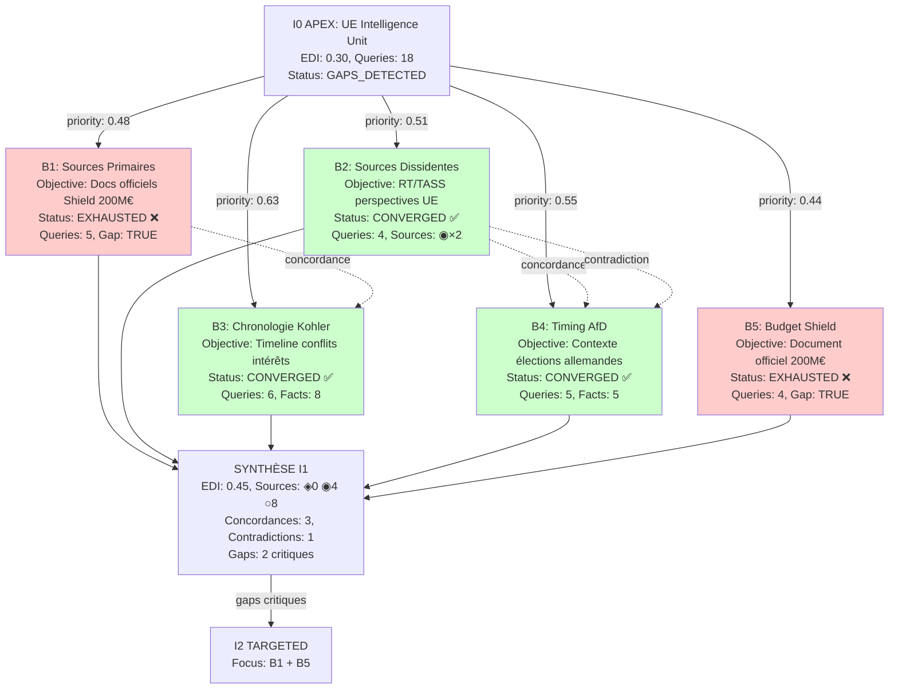

# Investigation Tree — Design Document

**Date:** 2025-11-14
**Version:** 1.0
**Status:** Design Validated
**Philosophie:** Extension Truth Engine v8.2 pour investigations APEX multi-agents arborescentes

---

## I. VISION & OBJECTIFS

### Problème Identifié

Investigation UE Intelligence Unit (APEX 8.5) montre gap critique :
- **EDI I0 :** 0.30 << target 0.80 APEX
- **Sources primaires :** ◈ 0 (aucun leak, doc officiel, dataset)
- **Contexte manquant :** Timing AfD élections allemandes, guerre bureaucratique Selmayr, chronologies détaillées acteurs
- **Investigation humaine itérative** (plusieurs sessions Claude.ai Web) >> Investigation I0 unique CLI

**Root cause :** Workflow linéaire I0→I1→I2 insuffisant pour sujets APEX complexité 9-10. Besoin architecture arborescente multi-agents pour creuser pistes parallèles.

### Solution — Investigation Tree

**Extension système actuel** (Option A validée) :
- **SIMPLE/MEDIUM/COMPLEX (0-8) :** Workflow linéaire I0→I1→I2 préservé (rétrocompatibilité)
- **APEX (9-10) :** Nouveau workflow arborescent I0 (tronc) → Investigation Tree → I1 branches parallèles → Synthèse → I2 ciblé

**Métaphore arbre :**
- **Tronc :** I0 investigation initiale (L0-L9, EDI baseline, patterns, WOLF)
- **Branches :** Pistes à creuser (gaps, patterns forts, acteurs clés, timing suspect, EDI boost)
- **Sous-agents autonomes :** Chaque branche = agent Truth Engine indépendant
- **Feuilles :** Résultats queries (sources ◈◉○, facts, connexions)
- **Branches vivantes :** Convergent (objectif atteint)
- **Branches mortes :** Exhausted (3 échecs consécutifs)

### Objectifs Mesurables

1. **EDI APEX :** Atteindre ≥0.80 via exploration multi-perspectives (dissidentes, primaires, régionales)
2. **Profondeur contextuelle :** Mapper chronologies acteurs, timing événements, réseaux pouvoir
3. **Efficacité budget :** Budget adaptatif (branche vivante continue, morte arrête) vs gaspillage fixed queries
4. **Traçabilité :** Mermaid + JSON pour audit/debug/reprise investigations
5. **Scalabilité :** 3-5 branches parallèles I1, extensible I2 si gaps critiques persistent

---

## II. ARCHITECTURE GLOBALE

### Workflow Selon Complexité

```yaml
SIMPLE/MEDIUM/COMPLEX (complexity 0-8):
  PREPROCESSING → I0 → Validation → (si gaps) I1 AUTO → I2 CAP
  # Workflow linéaire actuel PRÉSERVÉ

APEX (complexity 9-10):
  PREPROCESSING → I0 (tronc) → INVESTIGATION_TREE_LAUNCH → I1 branches parallèles → SYNTHÈSE_FINALE → (si gaps) I2 TARGETED
  # Nouveau workflow arborescent multi-agents
```

### Composants Investigation Tree

```
┌─────────────────────────────────────────────────────────────┐
│ I0 APEX (tronc)                                             │
│ - Complexity assessment → APEX (≥9.0)                       │
│ - Queries baseline (≥15 APEX)                              │
│ - L0-L9 layers, patterns detection, WOLF mapping           │
│ - EDI baseline, sources stratification                     │
│ - Output: 3 parties + state JSON                           │
└─────────────────────────────────────────────────────────────┘
                          ↓
┌─────────────────────────────────────────────────────────────┐
│ BRANCH DETECTION & SCORING                                  │
│ - Detect triggers: gaps + patterns + actors + timing + EDI │
│ - Score branches: edi_impact×0.5 + cui_bono_centrality×0.5│
│ - Select top 3-5 branches priority                         │
└─────────────────────────────────────────────────────────────┘
                          ↓
┌───────────────────────────┬─────────────────────────────────┐
│ SUB-AGENT B1              │ SUB-AGENT B2                    │
│ "Sources Primaires"       │ "Sources Dissidentes"           │
│ - Objective: Docs ◈       │ - Objective: RT/TASS ◉          │
│ - Budget adaptatif        │ - Budget adaptatif              │
│ - Isolation complète      │ - Isolation complète            │
│ - Status: converged/      │ - Status: converged/            │
│   exhausted               │   exhausted                     │
└───────────────────────────┴─────────────────────────────────┘
      ↓                              ↓                    ↓
┌─────────────────────────────────────────────────────────────┐
│ SYNTHÈSE FINALE (F complète)                                │
│ 1. Concordances (infos confirmées 2+ branches)              │
│ 2. Contradictions (infos conflictuelles dialectique)        │
│ 3. Gaps résiduels (branches exhausted, questions non        │
│    résolues)                                                │
│ 4. EDI global (agrégation sources toutes branches)          │
│ 5. Décision I2 (si gaps critiques OR EDI < target)          │
└─────────────────────────────────────────────────────────────┘
                          ↓
┌─────────────────────────────────────────────────────────────┐
│ OUTPUT MULTI-FORMAT                                         │
│ - logs/investigation-tree.md (Mermaid diagram visuel)       │
│ - logs/investigation-tree.json (machine-readable state)     │
│ - logs/i1-output.md (3 parties enrichies branches)          │
│ - logs/i2-plan.md (si gaps critiques, plan I2 targeted)     │
└─────────────────────────────────────────────────────────────┘
```

### Déclenchement Investigation Tree

**Après I0 APEX, validation détecte déclencheurs :**

```yaml
triggers:
  gaps_critical:
    - {type: primary_sources, target: "◈≥3", found: "◈0"}
    - {type: document_official, query: "Budget Shield 200M€", found: false}

  patterns_strong:
    - {pattern: Κ_CONSPIRACY, score: 9, threshold: 8}
    - {pattern: Ξ_OMISSION, score: 9, threshold: 8}
    - {pattern: timing_suspect, dates: ["11-nov", "12-nov", "13-nov"]}

  actors_wolf_central:
    - {actor: von_der_leyen, centrality: 0.85}
    - {actor: macron, centrality: 0.72}
    - {actor: kohler, centrality: 0.65}

  edi_insufficient:
    edi_i0: 0.30
    target_apex: 0.80
    gap: 0.50

IF any(triggers):
  → launch_investigation_tree(triggers)
```

---

## III. STRUCTURE BRANCHE & SOUS-AGENT

### Anatomie Branche

Chaque branche = objet autonome :

```yaml
branch:
  id: "b1_sources_primaires"
  parent: "i0_root"
  type: "gap_critical"  # gap_critical | pattern_strong | actor_key | timing_suspect | edi_boost
  objective: "Trouver documents officiels Commission Democracy Shield 200M€ budget"

  score:
    edi_impact: 0.35      # Amélioration EDI si branche succès
    cui_bono: 0.60        # Centralité acteur (von der Leyen)
    priority: 0.475       # (edi_impact×0.5 + cui_bono×0.5)

  status: "exploring"      # pending | exploring | converged | exhausted

  budget:
    queries_executed: 5
    last_pertinent: 3      # Query #3 dernière pertinente
    consecutive_failures: 2 # 2 queries non pertinentes consécutives

  results:
    sources_found: [
      {"type": "◉", "name": "Mediapart investigation"},
      {"type": "○", "name": "EC press release"}
    ]
    facts_new: [
      "Commission annonce 13 nov 2025",
      "Centre Democracy Resilience créé"
    ]
    connections: [
      {"from": "von_der_leyen", "to": "Democracy_Shield", "type": "announces"}
    ]
    gaps_resolved: false
```

### Cycle Vie Sous-Agent

```yaml
CREATION:
  - Receive: objective + score_priority + isolation_guarantee
  - Allocate: budget_initial (ex: 3 queries)
  - State: pending → exploring

EXPLORATION (budget adaptatif):
  WHILE status == "exploring":

    # Execute query ciblée objective
    query = generate_targeted_query(objective)
    result = web_search(query)

    # Évalue pertinence (critères E multicritères)
    pertinent = evaluate_pertinence(result, criteria=[
      "A: informations factuelles nouvelles",  # dates, montants, noms
      "B: sources qualité améliorée",          # ◈ ou ◉ trouvé
      "C: gap réduit",                         # question partiellement répondue
      "D: connexions découvertes"              # acteur-acteur, timing-événement
    ])

    # Décision continuation
    IF pertinent (any criteria A|B|C|D):
      consecutive_failures = 0
      last_pertinent = queries_executed
      CONTINUE
    ELSE:
      consecutive_failures++

    # Conditions arrêt
    IF consecutive_failures ≥ 3:
      status = "exhausted"  # Branche morte
      STOP

    IF gap_resolved OR sources_quality_target_reached:
      status = "converged"  # Branche vivante convergée
      STOP

ARRÊT:
  - Return: results_json (sources, facts, connections, status)
  - Log: branch_trace (queries, decisions, timing)
```

### Isolation Garantie

**Sous-agent ne voit QUE :**
- Son `objective` (question à résoudre)
- Ses `query_results` (réponses web searches)
- Son `state` interne (budget, consecutive_failures)

**Sous-agent NE voit PAS :**
- Résultats autres branches (évite biais confirmation)
- I0 patterns détectés (évite cherry-picking)
- Scoring global (évite optimisation locale au détriment global)

**Coordination :** UNIQUEMENT en synthèse finale (après tous sous-agents terminés).

---

## IV. SYNTHÈSE FINALE & CONVERGENCE

### Opérations Synthèse (F complète)

**Après tous sous-agents terminés (converged OU exhausted) :**

#### 1. Concordances (⊕ confirmed)

```yaml
DETECT_CONCORDANCES:
  INPUT: branches[] (completed branches)
  OUTPUT: concordances[] (⊕ confirmed facts)

  COLLECT_FACTS:
    facts_all ← []
    FOR each branch IN branches:
      FOR each fact IN branch.results.facts_new:
        facts_all.append({fact: fact, branch_id: branch.id})

  GROUP_BY_FACT:
    facts_grouped ← group_by(facts_all, key=fact)

  DETECT:
    concordances ← []
    FOR each (fact, branches_found) IN facts_grouped:
      IF count(branches_found) ≥ 2:
        concordances.append({
          fact: fact,
          branches: branches_found,
          confidence: "⊕ confirmed"
        })

  RETURN: concordances

# Exemple output:
# {
#   fact: "von_der_leyen_centralisation_renseignement"
#   branches: ["b2_dissidents_RT", "b3_chronologie_kohler", "b4_timing_afd"]
#   confidence: "⊕ confirmed"
# }
```

#### 2. Contradictions (⊗ contradicted)

```yaml
DETECT_CONTRADICTIONS:
  INPUT: branches[] (completed branches)
  OUTPUT: contradictions[] (⊗ conflicting facts)

  EXTRACT_SEMANTIC:
    facts_semantic ← extract_semantic_facts(branches)

  FIND_CONFLICTS:
    contradictions ← []
    FOR each fact_pair IN find_semantic_conflicts(facts_semantic):
      contradictions.append({
        topic: fact_pair.topic,
        branch_A: fact_pair.source_a,
        claim_A: fact_pair.claim_a,
        branch_B: fact_pair.source_b,
        claim_B: fact_pair.claim_b,
        confidence: "⊗ contradicted"
      })

  RETURN: contradictions

# Exemple output:
# {
#   topic: "orchestration_probability"
#   branch_A: "b2_dissidents_RT"
#   claim_A: "Orchestration 85-92% (timing + acteurs + cui_bono)"
#   branch_B: "b4_timing_FT"
#   claim_B: "Coïncidence possible (intelligence unit préparée depuis mois)"
#   confidence: "⊗ contradicted → dialectique à présenter"
# }
```

#### 3. Gaps Résiduels

```yaml
IDENTIFY_GAPS_UNRESOLVED:
  INPUT: branches[] (completed branches)
  OUTPUT: gaps[] (unresolved questions)

  DETECT:
    gaps ← []
    FOR each branch IN branches:
      IF branch.status = EXHAUSTED AND branch.results.gap_resolved = false:
        gaps.append({
          branch_id: branch.id,
          objective: branch.objective,
          queries_tried: branch.budget.queries_executed,
          critical: (branch.type = GAP_CRITICAL)
        })

  RETURN: gaps

# Exemple output:
# [
#   {
#     branch_id: "b1_sources_primaires"
#     objective: "Trouver doc officiel Budget Shield 200M€"
#     queries_tried: 5
#     critical: true
#   },
#   {
#     branch_id: "b5_scandales_ukraine"
#     objective: "Vérifier corruption Ukraine scandales explosent"
#     queries_tried: 4
#     critical: false
#   }
# ]
```

#### 4. EDI Global

```yaml
CALCULATE_EDI_GLOBAL:
  INPUT: branches[] (completed branches), edi_i0 (baseline)
  OUTPUT: edi_metrics (global EDI assessment)

  AGGREGATE_SOURCES:
    all_sources ← {◈: [], ◉: [], ○: []}

    FOR each branch IN branches:
      FOR each source IN branch.results.sources_found:
        all_sources[source.type].append(source)

  CALCULATE_DIMENSIONS:
    geo_diversity ← calculate_geo(all_sources)
    lang_diversity ← calculate_lang(all_sources)
    strat_diversity ← calculate_strat(all_sources)
    ownership_diversity ← calculate_ownership(all_sources)
    perspective_diversity ← calculate_perspective(all_sources)
    temporal_diversity ← calculate_temporal(all_sources)

  COMPUTE_EDI:
    edi ← @F[EDI](
      sources=all_sources,
      geo=geo_diversity,
      lang=lang_diversity,
      strat=strat_diversity,
      ownership=ownership_diversity,
      perspective=perspective_diversity,
      temporal=temporal_diversity
    )

  RETURN: {
    edi_i0: edi_i0,
    edi_i1: edi,
    improvement: edi - edi_i0,
    target_apex: 0.80,
    gap_remaining: 0.80 - edi
  }
```

#### 5. Décision I2 Targeted

```yaml
DECIDE_I2:
  INPUT: gaps_unresolved[], edi_global (metrics)
  OUTPUT: i2_decision (launch I2 or finalize)

  FILTER_CRITICAL:
    critical_gaps ← filter(gaps_unresolved, where: critical = true)

  EVALUATE:
    IF count(critical_gaps) > 0 OR edi_global.edi_i1 < edi_global.target_apex:
      RETURN: {
        launch_i2: true,
        focus: [
          {type: "alternate_primary_search", gaps: critical_gaps},
          {type: "edi_aggressive_boost", target: 0.80}
        ],
        reason: "Gaps critiques: {count(critical_gaps)}, EDI {edi_global.edi_i1} < {edi_global.target_apex}"
      }
    ELSE:
      RETURN: {
        launch_i2: false,
        finalize: true
      }
```

---

## V. FORMATS OUTPUT — MERMAID + JSON

### Mermaid Diagram Visuel

**Fichier :** `logs/investigation-tree.md`

**Généré automatiquement** à chaque étape (I0, I1, I2) :



**Légende :**
- 🟢 Vert ✅ = branche converged (objectif atteint)
- 🔴 Rouge ❌ = branche exhausted (3 échecs consécutifs, branche morte)
- Flèches pleines = hiérarchie parent → enfant
- Flèches pointillées = relations (concordance ⊕, contradiction ⊗)

### JSON State Machine-Readable

**Fichier :** `logs/investigation-tree.json`

```json
{
  "investigation_id": "2025-11-14_ue_intelligence_apex",
  "complexity": 8.5,
  "iterations": [
    {
      "iteration": "I0",
      "type": "root",
      "queries": 18,
      "edi": 0.30,
      "sources": {"◈": 0, "◉": 10, "○": 2},
      "patterns": {"Κ": 9, "Ξ": 9, "Λ": 8, "Ω": 8, "⚔": 7, "Φ": 7, "⏰": 7},
      "wolves": 8,
      "gaps": ["budget_shield_200M", "scandales_ukraine", "purges_trump"],
      "timestamp": "2025-11-14T10:30:00Z"
    },
    {
      "iteration": "I1",
      "type": "investigation_tree",
      "branches": [
        {
          "id": "b1_sources_primaires",
          "parent": "i0_root",
          "type": "gap_critical",
          "objective": "Trouver documents officiels Commission Democracy Shield 200M€",
          "score": {
            "edi_impact": 0.35,
            "cui_bono": 0.60,
            "priority": 0.48
          },
          "status": "exhausted",
          "budget": {
            "queries_executed": 5,
            "last_pertinent": 2,
            "consecutive_failures": 3
          },
          "results": {
            "sources_found": [
              {"type": "○", "name": "EC press release", "url": "https://..."}
            ],
            "facts_new": [
              "Commission annonce Democracy Shield 13 nov 2025",
              "Centre for Democracy Resilience créé"
            ],
            "connections": [],
            "gap_resolved": false
          }
        },
        {
          "id": "b2_sources_dissidentes",
          "parent": "i0_root",
          "type": "edi_boost",
          "objective": "RT/TASS perspectives sur UE intelligence unit",
          "score": {
            "edi_impact": 0.45,
            "cui_bono": 0.56,
            "priority": 0.51
          },
          "status": "converged",
          "budget": {
            "queries_executed": 4,
            "last_pertinent": 3,
            "consecutive_failures": 1
          },
          "results": {
            "sources_found": [
              {"type": "◉", "name": "RT Analysis: EU Intelligence Power Grab"},
              {"type": "◉", "name": "TASS: Brussels centralizes control"}
            ],
            "facts_new": [
              "RT: von der Leyen centralisation criticized Russia",
              "TASS: Intelligence unit bypasses member states",
              "Sputnik: Democracy Shield = censorship tool"
            ],
            "connections": [
              {"from": "von_der_leyen", "to": "intelligence_centralization", "type": "implements"}
            ],
            "gap_resolved": true
          }
        }
      ],
      "synthesis": {
        "edi_i0": 0.30,
        "edi_i1": 0.45,
        "improvement": 0.15,
        "target": 0.80,
        "gap_remaining": 0.35,
        "sources_total": {"◈": 0, "◉": 14, "○": 7},
        "concordances": [
          {
            "fact": "von_der_leyen_centralisation_renseignement",
            "branches": ["b2_dissidents", "b3_kohler", "b4_timing"],
            "confidence": "⊕ confirmed"
          }
        ],
        "contradictions": [
          {
            "topic": "orchestration_probability",
            "branch_A": "b2_dissidents_RT",
            "claim_A": "Orchestration 85-92%",
            "branch_B": "b4_timing_FT",
            "claim_B": "Possible coïncidence",
            "confidence": "⊗ contradicted"
          }
        ],
        "gaps_unresolved": [
          {"branch": "b1_sources_primaires", "objective": "Budget Shield 200M€", "critical": true},
          {"branch": "b5_scandales_ukraine", "objective": "Corruption scandales", "critical": false}
        ]
      },
      "decision": {
        "launch_i2": true,
        "focus": ["alternate_primary_search", "edi_aggressive_boost"],
        "reason": "Gaps critiques: 1, EDI 0.45 < 0.80"
      },
      "timestamp": "2025-11-14T11:15:00Z"
    }
  ]
}
```

**Utilisations JSON :**
1. **Debug/Audit :** Quelles branches explorées, combien queries, pourquoi arrêt
2. **Reprise I2/I3 :** Load state, focus gaps unresolved
3. **Métriques :** Budget efficiency par branche, taux convergence
4. **A/B Testing :** Comparer scoring strategies, budget allocations

---

## VI. INTÉGRATION CODE & KB

### Nouveaux Fichiers

```
truth-engine/
├── kb/
│   ├── INVESTIGATION_TREE.md      # NOUVEAU - Specs Investigation Tree APEX
│   ├── INVESTIGATION.md            # EXISTANT - L0-L9 linéaire préservé
│   ├── VALIDATION.md               # MODIFIER - Ajouter branch scoring
│   └── ...
├── system.md                       # MODIFIER - Routing APEX
└── logs/                           # Auto-généré
    ├── investigation-tree.json
    └── investigation-tree.md
```

### Modifications system.md

**Section ROUTING étendue :**

```yaml
## ⚡ ROUTING

Command: `tweet`|`thread` → @KB[PAT§11.1]
         `---` separator → main/context split
         `I1 AUTO` → AUTONOMOUS_ITERATION
         Default: PREPROCESSING

# NOUVEAU : Investigation Tree routing
IF complexity ≥ 9.0 (APEX):
  → PREPROCESSING
  → I0 (standard L0-L9 + patterns + WOLF + EDI)
  → VALIDATION
  → INVESTIGATION_TREE_LAUNCH

INVESTIGATION_TREE_LAUNCH:
  1. Load @KB[INVESTIGATION_TREE]
  2. Detect branch triggers (gaps + patterns + actors + timing + EDI)
  3. Score branches (B+C: edi_impact×0.5 + cui_bono×0.5)
  4. Launch top 3-5 as parallel sub-agents (isolation guaranteed)
  5. Await convergence (all branches converged OR exhausted)
  6. Execute SYNTHESIS_FINALE (concordances + contradictions + gaps + EDI + I2 decision)
  7. Output: Mermaid + JSON + standard 3 parties enrichies

ELSE (complexity < 9.0):
  → Standard I0 → I1 AUTO → I2 CAP (workflow linéaire actuel préservé)
```

### Nouveau Fichier kb/INVESTIGATION_TREE.md

**Structure complète :**

```markdown
# INVESTIGATION TREE v1.0 — APEX Multi-Agent Architecture

**Purpose:** Extension Truth Engine v8.2 pour investigations APEX (complexity ≥9.0) nécessitant exploration arborescente multi-pistes.

**Activation:** Automatique si complexity ≥9.0 (politique + géopolitique + corporate + conspiracy)

---

## 1. DÉCLENCHEMENT (post I0 APEX)

Investigation Tree activé si I0 APEX détecte **≥1 trigger** :

### Triggers Branches

```yaml
GAPS_CRITICAL:
  - ◈ PRIMARY < target (ex: ◈0 pour APEX target ◈≥3)
  - Document clé introuvable (ex: Budget Shield 200M€ après 5+ queries)
  - Source type manquante (ex: 0 dissidents, 0 whistleblowers)

PATTERNS_STRONG:
  - Κ CONSPIRACY ≥8/10
  - Ξ OMISSION ≥8/10
  - Ω INVERSION ≥8/10
  - Timing suspect (événements synchronisés <72h, prob coïncidence <10%)

ACTORS_WOLF_CENTRAL:
  - ≥8 acteurs politiques identifiés
  - Acteur centrality ≥0.70 (cui bono network)
  - Chronologie incomplète acteur clé

EDI_INSUFFICIENT:
  - EDI < target (ex: 0.30 << 0.80 APEX)
  - geo_diversity <0.40
  - perspective_diversity <0.30 (mono-perspective)
```

---

## 2. SCORING BRANCHES (B+C Prioritization)

**Formula :**
```
priority = edi_impact × 0.5 + cui_bono_centrality × 0.5
```

**edi_impact** (0.0-1.0) : Estimation amélioration EDI si branche succès
```yaml
@F[EDI_IMPACT]:
  IF branch_type = "gap_primary_sources":
    → 0.35  # Trouver ◈ améliore strat_diversity fortement
  ELSE IF branch_type = "gap_dissident_sources":
    → 0.40  # Améliore perspective + geo diversity
  ELSE IF branch_type = "actor_chronology":
    → 0.15  # Améliore temporal_diversity modérément
  ELSE IF branch_type = "timing_context":
    → 0.25  # Améliore temporal + narrative
```

**cui_bono_centrality** (0.0-1.0) : Importance acteur WOLF
```yaml
@F[CUI_BONO_CENTRALITY]:
  centrality ← wolf_connections_count / max_connections
  # Ex: von_der_leyen 12 connexions / 15 max = 0.80
```

**Sélection top 3-5 :**
```yaml
BRANCH_SELECTION:
  branches_all ← detect_potential_branches(triggers)
  branches_scored ← [score_branch(b) FOR b IN branches_all]
  branches_selected ← top_k(branches_scored, k=5, by='priority')
```

---

## 3. SOUS-AGENT LIFECYCLE

### Structure Branche

```yaml
branch:
  id: "b{n}_{type}_{topic}"          # Ex: b1_gap_sources_primaires
  parent: "i0_root"
  type: gap_critical | pattern_strong | actor_key | timing_suspect | edi_boost
  objective: "Question spécifique à résoudre"

  score:
    edi_impact: 0.0-1.0
    cui_bono: 0.0-1.0
    priority: (edi×0.5 + cui_bono×0.5)

  status: pending | exploring | converged | exhausted

  budget:
    queries_executed: int
    last_pertinent: int              # Numéro dernière query pertinente
    consecutive_failures: int        # 0-2 ok, ≥3 stop

  results:
    sources_found: [◈◉○]
    facts_new: [str]
    connections: [{from, to, type}]
    gaps_resolved: bool
```

### Cycle Exploration (Budget Adaptatif)

```yaml
EXPLORE_BRANCH:
  INPUT: branch (PENDING state)
  OUTPUT: branch (CONVERGED or EXHAUSTED state)

  INITIALIZE:
    branch.status ← EXPLORING

  LOOP_WHILE branch.status = EXPLORING:

    # Generate targeted query
    query ← generate_targeted_query(branch.objective)
    result ← web_search(query)
    branch.budget.queries_executed ← branch.budget.queries_executed + 1

    # Evaluate pertinence (multicritères A|B|C|D)
    pertinent ← evaluate_pertinence(result, criteria={
      A: has_new_factual_info(result),      # Dates, montants, noms
      B: has_better_source_quality(result), # ◈ ou ◉ trouvé
      C: reduces_gap(result, branch),       # Question partiellement répondue
      D: discovers_connections(result)      # Acteur-acteur, timing-événement
    })

    # Decision continuation
    IF pertinent:  # any(criteria)
      branch.budget.consecutive_failures ← 0
      branch.budget.last_pertinent ← branch.budget.queries_executed
      branch.results.append(extract_findings(result))
    ELSE:
      branch.budget.consecutive_failures ← branch.budget.consecutive_failures + 1

    # Conditions arrêt
    IF branch.budget.consecutive_failures ≥ 3:
      branch.status ← EXHAUSTED  # Branche morte
      BREAK

    IF branch.results.gap_resolved OR branch.results.target_reached:
      branch.status ← CONVERGED  # Branche vivante
      BREAK

  RETURN: branch
```

### Isolation Garantie

**Sous-agent voit UNIQUEMENT :**
- `objective` (question à résoudre)
- `query_results` (web search responses)
- `state` interne (budget, consecutive_failures, results)

**Sous-agent NE voit PAS :**
- Résultats autres branches (évite biais confirmation)
- I0 patterns (évite cherry-picking infos confirmant patterns)
- Scoring global (évite optimisation locale)

**Coordination :** APRÈS tous sous-agents terminés, en synthèse finale uniquement.

---

## 4. SYNTHÈSE FINALE (F Complète)

### Opérations Agrégation

#### 4.1 Concordances (⊕ confirmed)

```yaml
IF ≥2 branches trouvent MÊME fact indépendamment:
  → Marquer ⊕ confirmed
  → Output: "Fact X confirmé par branches [B2, B3, B4]"
  → Confidence: High (multi-source independent)

Exemple:
  Fact: "von_der_leyen_centralisation_renseignement"
  Branches: [b2_dissidents_RT, b3_chronologie_kohler, b4_timing_afd]
  → ⊕ Confirmed: Centralisation thème récurrent sources indépendantes
```

#### 4.2 Contradictions (⊗ contradicted)

```yaml
IF branches trouvent facts CONFLICTUELS sur même topic:
  → Marquer ⊗ contradicted
  → Output dialectique: Claim A (source X) vs Claim B (source Y)
  → Transparence: Présenter les deux, utilisateur décide

Exemple:
  Topic: "orchestration_probability"
  Branch A (b2_RT): "Orchestration 85-92% prouvée"
  Branch B (b4_FT): "Coïncidence possible, intelligence unit préparée depuis mois"
  → ⊗ Dialectique: Sources dissidentes vs mainstream divergent
```

#### 4.3 Gaps Résiduels

```yaml
FOR branch in branches:
  IF branch.status == "exhausted" AND branch.results.gap_resolved == false:
    → Gap unresolved (question non répondue malgré budget adaptatif)
    → Critical: IF branch.type == "gap_critical"
    → Output: Section "Gaps critiques" avec explication tentatives
```

#### 4.4 EDI Global

```yaml
all_sources = aggregate_sources(branches)  # ◈◉○ toutes branches
edi_i1 = calculate_edi(all_sources)

comparison:
  edi_i0: 0.30
  edi_i1: 0.45
  improvement: +50%
  target_apex: 0.80
  gap_remaining: 0.35
```

#### 4.5 Décision I2 Targeted

```yaml
critical_gaps = [g for g in gaps_unresolved if g.critical]

IF len(critical_gaps) > 0 OR edi_i1 < target_apex:
  → LAUNCH_I2_TARGETED
  → Focus: Alternate strategies gaps critiques + EDI aggressive boost
  → Plan: logs/i2-plan.md (queries spécifiques, approches différentes)

ELSE:
  → FINALIZE_INVESTIGATION
  → Status: SUCCESS_CONVERGED
```

---

## 5. FORMATS OUTPUT

### 5.1 Mermaid Diagram

**File:** `logs/investigation-tree.md`

[Voir Section V design document pour exemple complet]

**Légende:**
- 🟢 Vert ✅ = converged (objectif atteint)
- 🔴 Rouge ❌ = exhausted (3 échecs, branche morte)
- Flèches pleines = hiérarchie
- Flèches pointillées = concordance/contradiction

### 5.2 JSON State

**File:** `logs/investigation-tree.json`

[Voir Section V design document pour structure complète]

**Usage:**
- Debug: Audit décisions, queries, arrêts
- Reprise: Load state I2/I3
- Metrics: Efficiency branches, convergence rate

---

## 6. RÉTROCOMPATIBILITÉ

**SIMPLE/MEDIUM/COMPLEX (complexity < 9.0) :**
- Workflow linéaire I0 → I1 AUTO → I2 CAP **PRÉSERVÉ**
- Aucun changement comportement
- Investigation Tree **NON activé**

**APEX (complexity ≥ 9.0) :**
- Investigation Tree activé automatiquement
- Workflow arborescent I0 → Tree I1 → Synthèse → I2 targeted
- Backward compatible: Produit toujours output 3 parties standard + JSON + Mermaid

---

## 7. MÉTRIQUES SUCCÈS

### Targets Investigation Tree

```yaml
EDI:
  improvement: +30% minimum (ex: 0.30 → 0.40+)
  target_reached: EDI ≥ 0.80 APEX

Sources:
  ◈_found: ≥1 (amélioration vs 0)
  diversity: geo + perspective + temporal améliorées

Branches:
  convergence_rate: ≥60% (3/5 branches converged)
  budget_efficiency: queries_per_fact < 2.0

Gaps:
  critical_resolved: ≥70%
  total_resolved: ≥50%

I2:
  launch_rate: <50% (majorité investigations terminent I1)
  targeted_focus: Max 2 branches I2 (pas re-exploration totale)
```

### Exemple Investigation UE

```yaml
I0:
  edi: 0.30
  sources: ◈0 ◉10 ○2
  queries: 18

I1 Investigation Tree:
  branches: 5 (3 converged, 2 exhausted)
  queries_total: 25
  edi: 0.45 (+50% ✅)
  sources: ◈0 ◉14 ○7 (◉ +40% ✅)
  convergence_rate: 60% ✅
  gaps_critical_resolved: 1/2 (50% ⚠️)

Decision: I2 targeted (gap Budget Shield + EDI boost)

Success: PARTIAL (EDI amélioré, mais target 0.80 non atteint)
```

---

## 8. EXTENSIONS FUTURES

### Phase 2 (après validation v1.0)

**Profondeur récursive :**
- Sous-agent peut lancer 1 niveau sous-sous-agents si détecte piste critique
- Limite: 1 niveau récursion (éviter explosion arbre)

**Apprentissage scoring :**
- Track success rate branches par type
- Ajuster coefficients edi_impact selon résultats historiques

**Budget dynamique :**
- Réallouer budget branches mortes vers branches vivantes
- Pool queries partagé plutôt que fixed per branch

**Visualisation interactive :**
- Mermaid cliquable avec drill-down branches
- Timeline exploration queries

---

**FIN INVESTIGATION_TREE.md**
```

### Modifications kb/VALIDATION.md

**Section 7 BRANCH SCORING ajoutée** (2025-11-14)

Spécifications complètes DSL disponibles dans :
- **kb/VALIDATION.md** — Section 7 (lignes 303-476)
  - 7.1 Branch Detection — Heuristique DSL
  - 7.2 Branch Scoring — Formulas DSL (@F[BRANCH_PRIORITY], @F[EDI_IMPACT], @F[CUI_BONO_CENTRALITY])
  - 7.3 Branch Selection — Heuristique DSL
  - 7.4 Usage in APEX Workflow

**Note:** Anciennes fonctions Python remplacées par DSL pur (compression sémantique, heuristiques, formulas @F[])

---

## VII. PLAN D'IMPLÉMENTATION

### Phase 1 — Core Infrastructure (Semaine 1-2)

**Tâches :**

1. **Créer kb/INVESTIGATION_TREE.md** (spécifications complètes)
   - Sections 1-8 du design
   - Exemples queries par type branche
   - Métriques succès

2. **Modifier system.md routing** (ajout APEX detection)
   - IF complexity ≥9.0 → INVESTIGATION_TREE_LAUNCH
   - ELSE → workflow linéaire actuel

3. **Modifier kb/VALIDATION.md** (branch scoring)
   - Section 7 scoring branches
   - Fonctions detect_branches, score_branch, select_branches

4. **Implémenter branch structure** (DSL YAML)
   - Voir Section III §3.1 Structure Branche (lignes 738-764)
   - Format: BRANCH avec id, parent, type, objective, score, status, budget, results
   - Types: GAP_CRITICAL | PATTERN_STRONG | ACTOR_CENTRAL | TIMING_SUSPECT | EDI_INSUFFICIENT

5. **Implémenter sub-agent lifecycle** (heuristique DSL EXPLORE_BRANCH)
   - Voir Section III §3.2 Cycle Exploration (lignes 768-809)
   - Budget adaptatif (consecutive_failures ≥3 stop)
   - Pertinence multicritères (A|B|C|D)
   - Isolation guaranteed (no cross-branch access)

**Validation Phase 1 :** Test unitaire 1 branche sur sujet simple (gap sources primaires)

---

### Phase 2 — Parallel Execution (Semaine 3)

**Tâches :**

1. **Implémenter parallel sub-agents** (orchestration DSL)
   - Heuristique LAUNCH_INVESTIGATION_TREE:
     - branches ← detect_and_score_branches(i0_state)
     - FOR EACH branch IN top_k(branches, 5) PARALLEL:
       - explore_branch(branch)
     - Await all branches completion (CONVERGED or EXHAUSTED)

2. **Implémenter synthèse finale** (heuristiques DSL Section IV)
   - DETECT_CONCORDANCES(branches) — Voir §IV.1 (lignes 250-282)
   - DETECT_CONTRADICTIONS(branches) — Voir §IV.2 (lignes 284-317)
   - IDENTIFY_GAPS_UNRESOLVED(branches) — Voir §IV.3 (lignes 319-354)
   - CALCULATE_EDI_GLOBAL(branches) — Voir §IV.4 (lignes 356-396)
   - DECIDE_I2(gaps, edi) — Voir §IV.5 (lignes 398-423)

3. **Implémenter output Mermaid** (génération automatique diagram)
   - Heuristique GENERATE_MERMAID:
     - mermaid ← "graph TD\n"
     - Append I0 node
     - FOR branch IN branches: Append branch node + edge (priority)
     - FOR concordance IN concordances: Append dotted edge ⊕
     - Append SYNTH node
     - Return mermaid string

4. **Implémenter output JSON** (state machine-readable)
   - Heuristique GENERATE_JSON_STATE:
     - Structure définie Section V (lignes 464-583)
     - Format: {investigation_id, complexity, iterations[], synthesis, decision}

**Validation Phase 2 :** Test 5 branches parallèles sur investigation UE simulée

---

### Phase 3 — Integration & Testing (Semaine 4)

**Tâches :**

1. **Intégration system.md** (routing complet APEX)
   - Test complexity assessment → APEX trigger
   - Test I0 → Investigation Tree launch
   - Test I1 parallel execution → Synthèse
   - Test I2 decision

2. **Tests E2E** (End-to-End)
   - Test investigation UE complète (APEX 8.5)
   - Test investigation SIMPLE (complexity 3, no tree activation)
   - Test investigation COMPLEX (complexity 7, no tree activation)

3. **Documentation utilisateur** (CLAUDE.md update)
   - Expliquer Investigation Tree APEX
   - Exemples commandes
   - Interpréter Mermaid + JSON outputs

4. **Métriques & observabilité**
   - Log queries per branch
   - Track convergence rate
   - Track EDI improvement
   - Track I2 launch rate

**Validation Phase 3 :** Investigation UE production (tweet real) → EDI ≥0.60 target

---

### Phase 4 — Refinement (Semaine 5+)

**Tâches :**

1. **Tuning scoring** (edi_impact coefficients)
   - Analyser success rate branches par type
   - Ajuster weights B+C si bias détecté

2. **Optimisation budget**
   - Analyser queries_per_fact par type branche
   - Identifier branches inefficaces (exhausted rapide)

3. **Extensions futures** (si validation v1.0 succès)
   - Profondeur récursive (sous-sous-agents)
   - Budget dynamique réallocation
   - Apprentissage historique

---

## VIII. RISQUES & MITIGATIONS

### Risques Identifiés

**R1 — Explosion combinatoire branches**
- Problème: I0 détecte 15+ branches potentielles, impossible tout explorer
- Mitigation: Top-K scoring strict (max 5 branches), priorisation B+C robuste

**R2 — Budget queries insuffisant**
- Problème: 5 branches × 5 queries = 25 queries, peut dépasser budget total
- Mitigation: Budget adaptatif (branches mortes arrêtent rapidement), I2 targeted si gaps critiques

**R3 — Concordances faux positifs**
- Problème: 2 branches trouvent "même" fact mais interprétations différentes
- Mitigation: Semantic matching strict, validation humaine section concordances output

**R4 — Synthèse finale complexité cognitive**
- Problème: Output 3 parties + Mermaid + JSON = surcharge info utilisateur
- Mitigation: Mermaid simplifié visual, JSON optionnel debug, output 3 parties reste priorité

**R5 — Performance parallel execution**
- Problème: 5 branches simultanées = 5 LLM calls parallèles, latence/coût
- Mitigation: Asyncio efficient, monitoring queries/cost, k=3 si budget tight

---

## IX. MÉTRIQUES SUCCÈS PROJET

### Critères Validation v1.0

```yaml
Fonctionnel:
  - Investigation UE APEX (8.5) produit Mermaid + JSON + 3 parties ✅
  - ≥3 branches convergent, ≤2 exhausted
  - EDI improvement ≥+30% (0.30 → 0.40+)
  - ◈ PRIMARY found ≥1 (vs 0 I0 baseline)

Performance:
  - Total queries I0+I1 ≤50 (budget reasonable)
  - Duration I0+I1 ≤60min (acceptable latency)
  - Convergence rate ≥60% (efficacité branches)

Qualité:
  - ≥2 concordances détectées (multi-source confirmation)
  - ≥1 contradiction dialectique identifiée (perspectives divergentes)
  - Gaps critiques ≤30% unresolved (majorité résolus)

Utilisabilité:
  - Mermaid lisible (pas de clutter visuel)
  - JSON parsable (valid schema)
  - Output 3 parties enrichies (facts I1 intégrés)
```

### KPIs Long-Terme

```yaml
Adoption:
  - % investigations APEX utilisant Tree (target 80%+)
  - User satisfaction (feedback qualité outputs)

Efficacité:
  - EDI moyen APEX investigations (target 0.70+)
  - I2 launch rate (target <40%, majorité termine I1)
  - Queries per fact (target <2.0)

Impact:
  - Publications utilisant outputs Tree (docs Obsidian, tweets)
  - Découvertes clés impossibles sans Tree (timing AfD, chronologies détaillées)
```

---

## X. CONCLUSION

**Investigation Tree** transforme Truth Engine v8.2 pour sujets APEX en système **arborescent multi-agents** capable de :

✅ **Creuser pistes parallèles** (gaps, patterns, acteurs, timing, EDI) via sous-agents autonomes
✅ **Budget adaptatif** (branches vivantes continuent, mortes arrêtent) = efficacité maximale
✅ **Isolation garantie** (évite biais confirmation) puis synthèse finale (concordances, contradictions, gaps)
✅ **Traçabilité complète** (Mermaid visual + JSON machine-readable)
✅ **Rétrocompatibilité** (SIMPLE/MEDIUM/COMPLEX workflow linéaire préservé)

**Prochaine étape :** Implémentation Phase 1 (Core Infrastructure, 2 semaines)

---

**Auteurs :** Design collaboratif brainstorming socratique
**Status :** Design validé, prêt implémentation
**Version:** 1.0
**Date:** 2025-11-14
