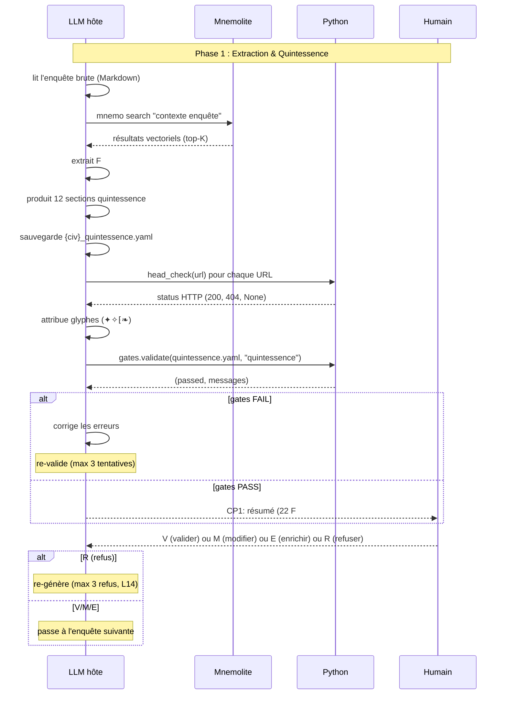
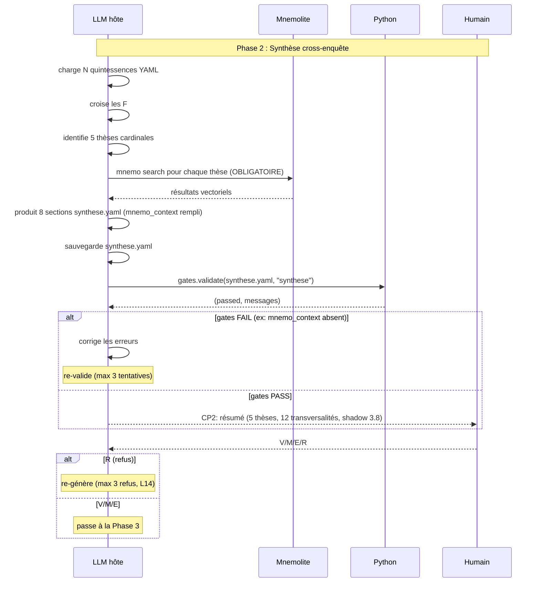
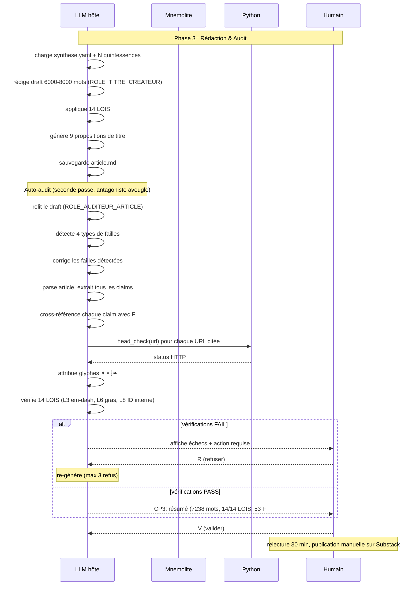
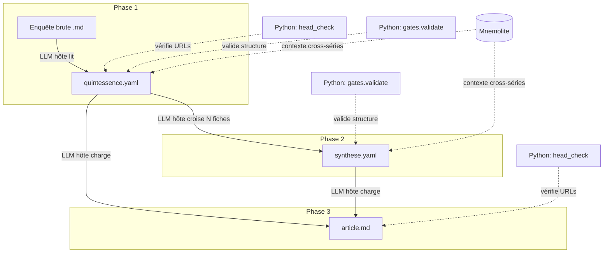

# ARCHITECTURE : SUBLIMATOR v34 « Léger »

**Date** : 2026-06-07
**Statut** : DRAFT 2 (révisé post-réduction Léger)
**Source** : PRD `docs/superpowers/prd/2026-06-07-sublimator-v34-prd.md` (DRAFT 2)
**Rôle** : Ce document définit l'architecture technique de v34 Léger : le LLM hôte pilote tout, Python est réduit à 2 outils mécaniques (head_check + gates).

---

## Table des matières

0. Préambule
1. Diagramme de séquence : Phase 1 (per-enquête)
2. Diagramme de séquence : Phase 2 (cross-enquête)
3. Diagramme de séquence : Phase 3 (article)
4. Diagramme de séquence : Session complète
5. Contrats d'interface formels entre les 4 briques
6. Flux de données YAML
7. Graphe de dépendances

---

## §0 Préambule

L'architecture Sublimator v34 Léger est conversation-bound. Le LLM hôte est le pilote unique des 3 phases. Python n'est plus qu'un filet mécanique : `head_check.py` (vérification HTTP) et `gates.py` (validation structurelle H0-H6).

**Rappel des 4 briques (modèle Léger) :**
- **LLM hôte** : pilote de la conversation. Lit les enquêtes, extrait les F###, interroge Mnemolite, produit YAML et Markdown, rédige l'article, s'auto-audite. Appelle `head_check()` et `gates.validate()` comme des outils.
- **Python** : 2 modules mécaniques (185 lignes total). `head_check.py` (33 lignes, HEAD HTTP → status code) et `gates.py` (152 lignes, H0-H6, 15 tests).
- **Mnemolite** : mémoire vectorielle, 4 outils MCP (search/projects/read/health). Interrogé directement par le LLM hôte.
- **Humain** : journaliste, arbitrage final (V/M/R/E) aux 3 CPs.

Les diagrammes suivants utilisent la syntaxe Mermaid. Les acteurs sont : `L` (LLM hôte), `P` (Python — appelé comme outil), `M` (Mnemolite), `H` (Humain). Les flèches pleines (`->>`) sont des appels. Les flèches pointillées (`-->>`) sont des retours.

---

## §1 Diagramme de séquence : Phase 1 (per-enquête)

Exécutée N fois (une par enquête). Le LLM hôte pilote tout.



---

## §2 Diagramme de séquence : Phase 2 (cross-enquête)

Exécutée une fois après toutes les Phase 1. Le LLM hôte croise lui-même les fiches.



---

## §3 Diagramme de séquence : Phase 3 (article)

Exécutée une fois. Le LLM hôte rédige puis s'auto-audite (deux passes distinctes).



---

## §4 Diagramme de séquence : Session complète

Vue macro du pipeline entier. Le LLM hôte pilote du début à la fin.

```mermaid
sequenceDiagram
    participant L as LLM hôte
    participant M as Mnemolite
    participant P as Python
    participant H as Humain

    Note over L,H: Démarrage session

    L->>M: mnemo health
    alt Mnemolite DOWN
        Note over L: mode dégradé : fallback markdown local
    end

    loop Phase 1 (chaque enquête)
        L->>L: lit enquête, extrait F###, produit quintessence
        L->>M: mnemo search (optionnel)
        L->>P: head_check(urls) + gates.validate()
        P-->>L: résultats
        L-->>H: CP1: V/M/R/E
        alt R (refus)
            Note over L: nb_refus++; si ≥3 → HALTE
        end
    end

    Note over L,H: Toutes les enquêtes traitées

    L->>L: charge quintessences, croise, produit synthèse
    L->>M: mnemo search (OBLIGATOIRE, validé par H1)
    L->>P: gates.validate(synthese.yaml)
    P-->>L: (passed, messages)
    L-->>H: CP2: V/M/R/E
    alt R && nb_refus ≥ 3
        L-->>H: HALTE: bilan, YAML préservés
    end

    L->>L: rédige article (ROLE_TITRE_CREATEUR)
    L->>L: auto-audit (ROLE_AUDITEUR_ARTICLE)
    L->>P: head_check(urls)
    P-->>L: status codes
    L->>L: vérifie 14 LOIS mécaniques
    L-->>H: CP3: V/M/R/E
    alt R && nb_refus ≥ 3
        L-->>H: HALTE: bilan, article préservé
    end

    H->>H: relecture 30 min
    H->>H: publication manuelle Substack
```

---

## §5 Contrats d'interface formels entre les 4 briques

### 5.1 Contrat LLM hôte → Python (head_check)

```
INTERFACE: appel shell

Mécanisme : le LLM hôte exécute un appel shell via l'outil basher :
  python3 -c "from tools.engines.sublimator.extractors.head_check import head_check; print(head_check('https://...'))"

Entrée : url: str (URL complète, http:// ou https://)
Sortie : int | None (code HTTP ou None si échec)

Le LLM hôte utilise la sortie pour attribuer le glyphe :
  - 200 + tier 1 → ✦
  - 200 + tier 2+ → ✧
  - 4xx/5xx/None → ⁅
  - Pas d'URL → ❧
```

### 5.2 Contrat LLM hôte → Python (gates)

```
INTERFACE: appel outil

Le LLM hôte appelle gates.validate(yaml_path, yaml_type) après avoir
écrit son YAML.

Entrée :
  - yaml_path: str (chemin vers le fichier YAML)
  - yaml_type: "quintessence" | "synthese"

Sortie : (passed: bool, messages: list[str])

Si passed=False, le LLM hôte lit les messages, corrige le YAML,
re-sauvegarde, et re-valide. Max 3 tentatives avant de présenter
le CP à l'humain avec les erreurs résiduelles.
```

### 5.3 Contrat LLM hôte → Mnemolite

```
INTERFACE: appels MCP directs

Outils :
  mnemo search "<query>"  → résultats vectoriels
  mnemo projects          → liste des projets
  mnemo read <uuid>       → contenu d'une mémoire
  mnemo health            → état du serveur

Quand :
  Phase 1 : optionnel (recommandé)
  Phase 2 : OBLIGATOIRE pour chaque thèse cardinale
  Phase 3 : non requis

Mode dégradé : si mnemo health ≠ OK → fallback markdown local
```

### 5.4 Contrat Humain → LLM hôte

```
INTERFACE: conversation textuelle (V/M/R/E/AIDE)

V (Valider)  → le LLM hôte passe à la phase suivante
M (Modifier) → l'humain corrige, puis V
R (Refuser)  → le LLM hôte re-génère (max 3 par CP, L14)
E (Enrichir) → l'humain ajoute du contexte, puis V
AIDE         → le LLM hôte rappelle la liste

L14 : 3 refus max par CP. Au 4e, le LLM hôte affiche un bilan et s'arrête.
```

---

## §6 Flux de données YAML

### 6.1 Graphe de transformation des données



### 6.2 Cycle de vie d'un F###

```mermaid
flowchart LR
    E1[Enquête §3.2] -->|LLM hôte lit| F1[F-S001: id, enonce, source_section, source_url]
    F1 -->|LLM hôte + head_check| F2[F-S001: + head_status, tier, glyphe]
    F2 -->|LLM hôte Phase 2| F3[F-S001: + transversalites[], theses_liees[]]
    F3 -->|LLM hôte Phase 3| F4[F-S001 cité dans article.md]
    F4 -->|head_check final| F5[F-S001: URL re-vérifiée, glyphe confirmé]
```

### 6.3 Fichiers produits par session

```
Session complète (N enquêtes) :

config/
  prompt-v34.md                           ← Prompt système (standalone, agnostique)

investigations/<sujet>/_quintessence/
  {CIV}_quintessence.yaml           ← Phase 1 (une par enquête)

investigations/<sujet>/_synthese/
  synthese.yaml                      ← Phase 2

articles/
  <date>_<sujet>_ARTICLE.md         ← Phase 3 (article publiable)

tools/engines/sublimator/extractors/
  head_check.py                      ← HEAD-check URLs
  gates.py                           ← Validation H0-H6
```

---

## §7 Graphe de dépendances

```mermaid
flowchart TD
    L[LLM hôte : pilote] -->|appelle| HC[head_check.py]
    L -->|appelle| GA[gates.py]
    L -->|interroge| MN[Mnemolite MCP]
    L -->|lit/écrit| YF[Fichiers YAML + Markdown]

    H[Humain] -->|V/M/R/E| L

    HC -->|HEAD HTTP| W[URLs sources]
    GA -->|valide| YF

    subgraph Python (185 lignes)
        HC
        GA
    end
```

---

*Fin de l'Architecture Sublimator v34 Léger. Document DRAFT 2 (révisé post-réduction). Prochaine étape : Pilote (Étape 4).*
