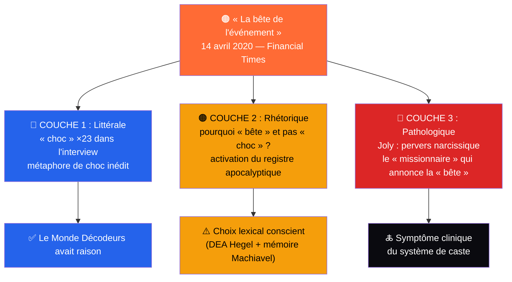
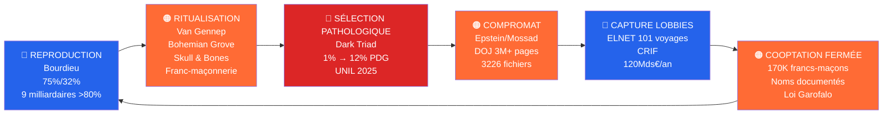
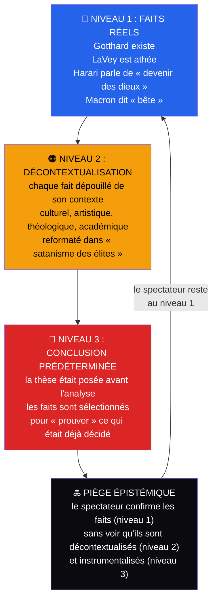

# 🜏 Ce n'est pas du satanisme. C'est une pathologie de caste.

> 🔍 « Qui a intérêt à ce qu'on parle de Satan plutôt que de Bourdieu, Joly et Epstein ? »

---

## 1. Le président et la « bête », un cas clinique

### La couche littérale

Le 14 avril 2020, en pleine pandémie de Covid-19, le président français **Emmanuel Macron** accorde une interview au Financial Times. Il déclare « je crois que notre génération doit savoir que la bête de l'événement est là et elle arrive ». La phrase devient virale. Les complotistes y voient une référence à la Bête de l'Apocalypse.

Ce qu'ils oublient ou omettent, c'est que dans la même interview, le président utilise le mot **« choc » 23 fois**. Le Monde Décodeurs l'a vérifié le 22 mai 2020 (lemonde.fr). « Bête » est un synonyme métaphorique de « choc inédit ». Pas de majuscule dans le texte original du FT. Macron termine par « repenser la mondialisation », propos géopolitique, pas biblique. **William Audureau**, journaliste au Monde, a retracé l'origine. Le Monde Décodeurs avait raison.

### La couche rhétorique

Mais pourquoi utiliser le mot **« bête »** plutôt que « choc », « crise », « force », « danger » ? Le choix lexical n'est pas anodin. « Bête » porte une connotation **apocalyptique** que même un usage métaphorique active dans l'inconscient collectif. Un communicant professionnel aurait dit « la force de l'événement ». Macron dit « la bête ».

Le fait que Macron ait été formé par **Brigitte** professeure de français et qu'il possède un DEA sur Hegel et un mémoire sur Machiavel indique une conscience aiguë de la portée des mots. Quand il dit « bête », il sait ce que « bête » évoque.

### La couche pathologique

En octobre 2024, le sociologue **Marc Joly** publie « La Pensée perverse au pouvoir » (Anamosa, 288 pages). Spécialiste de Norbert Elias et Paul-Claude Racamier, il analyse Macron à travers le prisme de la **perversion narcissique**. Le verdict est clinique. « Embrouiller pour nuire ; nuire en embrouillant » c'est la devise du pervers narcissique selon Joly. Le « **en même temps** » macronien n'est pas une subtilité philosophique. C'est de la **pensée paradoxale** un mécanisme qui génère contradictions, insécurité et culpabilité chez les autres. Catherine Nay, biographe, le qualifie d'« **inventeur de la logique illogique** ».

**Alain Minc**, éditorialiste proche du pouvoir, parle de « narcissisme poussé jusqu'à un niveau pathologique, avec pour corollaire un total déni de la réalité ». Un psychiatre italien qualifie Macron de « **psychopathe narcissique malveillant** » représentant un « danger ». Slate.fr a recensé l'analyse de Joly le 6 décembre 2024. Le Monde l'a chroniqué le 11 décembre. Le diagnostic est public.

### L'appât (grooming)

Ce qui est moins connu, c'est l'origine. **Emmanuel Macron** rencontre **Brigitte Auzière** au lycée La Providence d'Amiens en 1993. Il a **14 ans** (né le 21 décembre 1977, il n'a pas encore eu ses 15 ans). Elle en a **39** (née le 13 avril 1953). Elle est sa **professeure de français et de théâtre**. Il est **camarade de classe de sa fille Laurence**. Le lycée est une école **jésuite privée**. Macron joue l'« épouvantail » devant elle lors d'une représentation. Les parents ne portent pas plainte. La relation est connue à Amiens les élèves « ne sont pas étonnés » (Closer).

La configuration est celle d'un **grooming par autorité éducative**. Le grooming (terme anglophone, « appâtage » en français) désigne le processus par lequel un adulte, abusant de sa position d'autorité ou de confiance, établit progressivement une relation émotionnelle et/ou sexuelle avec un mineur. Le processus se déroule en plusieurs étapes : sélection de la victime, accès et isolement, développement de la confiance, désensibilisation aux limites, puis maintien du contrôle par la honte et le secret. L'adulte établit une relation émotionnelle avec un mineur dans un contexte d'asymétrie de pouvoir. Le fait que le mineur soit camarade de classe de la fille de la professeure ajoute une dimension de **transgression familiale**. Le fait que les parents ne portent pas plainte est cohérent avec les mécanismes de **sidération** et de **honte** documentés dans les cas de grooming.

Joly identifie le résultat : un « **fantasme d'auto-engendrement** ». Macron, « adulé par sa grand-mère, chez qui il va vivre à sa demande, puis il le sera par sa femme », développe une perception de soi comme être exceptionnel, au-dessus des règles.

### Le « missionnaire »

Le 8 septembre 2017, lors d'un discours à Athènes, Macron déclare « je ne céderai rien, ni aux fainéants, ni aux cyniques ». L'opposition est révélatrice lui qui travaille et croit contre le reste du monde qui est « fainéant » ou « cynique ». Du mépris de classe déguisé en exigence morale.

Dans un entretien de 2016, il va plus loin. « Je vis ça comme une mission. J'ai la conviction qu'il existe une transcendance, oui… quelque chose qui dépasse, qui vous dépasse, qui vous a précédé et qui restera. » Le vocabulaire est **religieux** « mission », « transcendance », « dépasse » appliqué à une fonction **politique**. Le « quelque chose qui dépasse » n'est jamais précisé. C'est un **signifiant flottant** qui permet à chaque auditeur de projeter sa propre croyance.

Le président n'est pas « possédé par le diable ». Il est le produit d'un système qui fabrique des pervers narcissiques et le langage sacré (« mission », « transcendance », « bête ») en est le **symptôme clinique**.

---

## 2. Le modèle originel franc-maçonnerie et rites de caste

### 250 ans de preuve

La **franc-maçonnerie** existe depuis 1773 en France (Grand Orient). C'est le **modèle originel** dont toutes les autres institutions de pouvoir sont des variantes. En 250 ans, elle a prouvé que le mécanisme fonctionne.

La structure en **3 grades** reproduit exactement la théorie des rites de passage de **Arnold van Gennep** (1909). L'apprenti est **séparé** du monde profane : aveuglement, dépouillement des métaux. Le compagnon traverse la **marge** : travail sur la Pierre brute, épreuve de transformation. Le maître atteint l'**agrégation** : mort et résurrection symbolique d'Hiram, accès au « secret ».

La structure est universelle. La **prépa** est la séparation (deux à trois ans d'isolement social). Le **concours** est la marge (l'épreuve classante). L'**admission** à l'ENA ou Polytechnique est l'agrégation (le nouveau statut « méritocratique »). Le **Skull & Bones** de Yale : nuit dans la crypte, aveux, squelette, est la version américaine. Le **Bohemian Grove** : Cremation of Care devant un hibou de 12 mètres, est la version californienne.

### Le secret comme tabou partagé

**Émile Durkheim** l'a montré : les sociétés se renforcent par le partage du sacré. Les élites modernes n'ont plus de sacré religieux commun. Elles le remplacent par un **sacré transgressif** : le partage du tabou. Le secret maçonnique fonctionne exactement comme ça. La **complicité mutuelle** (« on sait tous qu'on ne devrait pas faire ça ») crée un lien plus fort que la vertu partagée.

170 000 francs-maçons en France : 0,25 % de la population. Dix obédiences. Le Grand Orient (environ 50 000), la Grande Loge de France (environ 36 000), la Grande Loge Nationale Française (environ 34 000), Le Droit Humain (environ 28 000), la Grande Loge Féminine de France (environ 14 000).

### Les noms

Les noms sont documentés. **Gérard Collomb**, ex-ministre de l'Intérieur, Grand Orient de France. **Jean-Yves Le Drian**, ex-ministre de la Défense et des Affaires étrangères, proche de plusieurs loges. **Richard Ferrand**, ex-président de l'Assemblée nationale. **Jean-Michel Blanquer**, ex-ministre de l'Éducation, invité d'honneur de la Grande Loge de France. **Alexandre Benalla**, sécurité de l'Élysée, Grande Loge Nationale Française. **Édouard Philippe**, ex-Premier ministre, père éminent maçon. **Jean-Luc Mélenchon**, initié en 1985. **François Hollande**, ex-président, Grand Orient de France.

Benalla : GLNF + liens **Philippe Solomon** + **Alexandre Djouhri** + affaires africaines. **François Roussely**, ex-patron d'EDF, « parrain » maçon. **Charles Milhaud**, ex-président de BPCE, a imposé des symboles maçonniques dans le siège social.

L'affaire des **fiches** de 1904 : le ministre de la Guerre utilisait les loges pour **ficher les officiers**. La loi de **séparation Église/État de 1905** : influence maçonnique documentée. L'historienne **Mildred Headings** résume « rien ne devait se faire sans la participation de la Maçonnerie ».

Un collectif, **Les Essentiels France**, exige la déclaration obligatoire d'appartenance maçonnique pour les fonctions publiques stratégiques. Un **projet de loi** rédigé par **Didier Julien Garofalo** a été transmis aux **920 parlementaires**.

La FM n'est pas un « complot satanique ». C'est la **preuve vivante** que le mécanisme de caste par le rituel fonctionne depuis 250 ans. Toutes les autres institutions Bohemian Grove, Skull & Bones, Le Siècle, Bilderberg, grandes écoles sont des **variantes** de ce modèle.

---

## 3. La machine à castes

### Bourdieu avait raison

En 1989, le sociologue **Pierre Bourdieu** publie « La Noblesse d'État ». Sa thèse est d'une brutalité limpide : les grandes écoles ne sont pas des ascenseurs sociaux. Ce sont des **machines à transformer le capital hérité en capital méritocratique**. Les enfants de cadres héritent d'un « code culturel » (vocabulaire, références, aisance sociale) qui correspond exactement à ce que les concours testent. L'**homologie structurale** est le concept-clé : la hiérarchie entre grandes et petites écoles reproduit la hiérarchie entre classes sociales. L'école ne crée pas les inégalités. Elle les **légitime**.

### Les chiffres qui tuent

La France en 2025. **75 %** des enfants de diplômés du supérieur deviennent diplômés. Seulement **32 %** des enfants de non-bacheliers y parviennent : Le Mur du Diplôme l'a mesuré. Les enfants de cadres sont **trois fois surreprésentés** à l'université par rapport aux enfants d'ouvriers, selon l'INSEE.

Au Royaume-Uni, **7 %** de la population est scolarisée dans le privé. Ces 7 % fournissent **74 % des juges**, **55 % des députés conservateurs** et **44 % des journalistes** du Times et du Guardian : Sutton Trust, 2024. Depuis 1945, plus de **70 % des Premiers ministres** britanniques sont formés à Oxford.

Aux États-Unis, les trois présidents **Bush** : Yale, Skull & Bones. Les deux **Clinton** : Yale Law. **Kennedy** : Harvard. **Obama** : Columbia + Harvard Law. Depuis 1988, **100 % des présidents américains** sont issus de l'Ivy League.

En 2025, **neuf milliardaires** contrôlent **plus de 80 %** de la presse quotidienne nationale française. **Bolloré** (CNews, Europe 1), **Arnault** (Le Parisien), **Niel** (Le Monde). L'indice de fermeture élitaire calculé par le Truth Engine atteint **0,75** au-delà de 0,7, on parle de **caste fermée** avec vernis méritocratique.

### Les variantes du modèle

Le **Bohemian Grove** : fondé en 1872, Californie, club masculin privé. Chaque année, **Cremation of Care** devant un hibou de 12 mètres. Participants documentés : **Nixon**, **Reagan**, **Eisenhower**, **Bush père**, **Kissinger**. **Alex Jones** a infiltré le site en 2000 et filmé le rituel. Ce n'est pas une légende.

Le **Skull & Bones** : fondé en 1832 à Yale. **15 membres** sélectionnés chaque année. Initiation dans la « Tombe » : bâtiment sans fenêtres en granit. Les nouveaux s'allongent **nus dans un cercueil** et font des **aveux sexuels**. Symbole : crâne et tibias, « Order 322 ». Membres : trois présidents américains, directeurs de la CIA, juges de la Cour suprême. Le journaliste **Ron Rosenbaum**, dans Esquire, résume la fonction : transformer « les rejetons oisifs de la classe dirigeante en dirigeants moralement sérieux ».

**Le Siècle** : fondé en 1944 à Paris. Cent membres : ministres, hauts fonctionnaires, PDG, journalistes. Dîners mensuels fermés. Aucune trace publique. Aucune transparence sur les décisions prises.

Le **Bilderberg** : créé en 1954. Environ **130 invités** annuels : présidents, premiers ministres, PDG, banquiers centraux. Pas de communiqué officiel. Chatham House Rule. L'Université de Georgetown a démontré en 2025 que le Bilderberg fonctionne comme un « tremplin pour la direction internationale ».

Toutes ces institutions partagent la même structure **séparation** (invitation, sélection, « tap »), **marge** (initiation, rituel, épreuve), **agrégation** (membre à vie, réseau permanent). C'est Van Gennep appliqué au pouvoir moderne.

---

## 4. Les psychopathes au sommet

### De 1 % à 12 %

En 2002, les psychologues **Delroy Paulhus** et **Kevin Williams** définissent la **Dark Triad** : trois traits de personnalité interconnectés. Le **narcissisme** : grandiosité, besoin d'admiration, manque d'empathie. Le **machiavélisme** : manipulation, cynisme, intérêt propre. La **psychopathie** : impulsivité, égocentrisme, absence de remords.

La prévalence de la psychopathie varie radicalement selon la population. Dans la population générale : **1 à 4,5 %** (meta-analyse Frontiers in Psychology, 2021, n=11 497). Chez les hauts dirigeants : environ **4 %** (Babiak, Neumann et Hare, 2010). Chez les PDG : estimé entre **3 et 12 %** (Forbes, 2024). Le ratio est frappant : la psychopathie est **3 à 12 fois plus fréquente** chez les dirigeants que dans la population générale.

### La polarisation descendante

En mars 2025, l'Université de Lausanne publie une étude dans le **European Journal of Political Research** (Nai et al., DOI 10.1111/1475-6765.70002). Croisement de bases de données électorales (CSES, **60 pays**) et d'évaluations psychologiques (NEGex, **140+ campagnes**).

Les élus des **droites populistes** affichent des scores plus élevés de narcissisme, psychopathie et machiavélisme. Le phénomène **n'épargne pas les autres partis**. Les électeurs qui soutiennent un politicien avec des scores élevés dark triad sont **plus polarisés** que les autres. Le co-auteur **Frederico Ferreira da Silva** résume « la polarisation affective est plus une question d'offre que de demande ». Ce sont les **dirigeants** qui polarisent, pas les électeurs qui « demandent » de la polarisation.

### Le terrain vierge

L'échelle **SD3** (Short Dark Triad) a été validée en français en 2022 (ScienceDirect). **Aucune étude publiée à ce jour n'a appliqué la SD3 à la classe politique française.** Le terrain est vierge. Les grandes écoles sélectionnent-elles implicitement les traits dark triad ? La Ve République, avec son pouvoir concentré au Président, favorise-t-elle la psychopathie ? Personne ne le sait. Personne ne l'a mesuré.

Le mécanisme est pourtant documenté : le narcissisme favorise la campagne électorale (charisme, promesses grandioses). Le machiavélisme favorise les alliances et trahisons politiques. La psychopathie favorise les décisions impopulaires : guerres, licenciements, austérité. Le cercle vicieux se referme : les dark triad accèdent au pouvoir, sélectionnent des profils similaires, créent une culture organisationnelle dark, excluent les empathiques.

---

## 5. Le réseau de compromat

### Epstein, Maxwell, Mossad

**Jeffrey Epstein** est condamné en 2008 en Floride pour sollicitation d'une mineure. En 2019, il est inculpé à New York pour trafic sexuel de mineurs. Le 10 août 2019, il meurt en détention : suicide officiel, contesté. Les gardiens étaient endormis. Les caméras étaient hors service.

**Ghislaine Maxwell** : condamnée en 2021 sur cinq des six chefs de trafic sexuel de mineurs. Vingt ans de prison fédérale. **Robert Maxwell** : son père, magnat de presse, **liens documentés avec le Mossad**. 400 millions de livres détournés des fonds de pension Mirror Group. Mort mystérieuse en 1991, tombé de son yacht « Lady Ghislaine ». Funérailles d'État en Israël : éloges par le Premier ministre **Shamir** et le président **Herzog**.

En 2020, un document FBI qualifie Epstein de « **formé comme agent du Mossad** » (Middle East Eye). En janvier 2026, le DOJ publie **plus de 3 millions de pages**. **3 226 fichiers natifs** : vidéos de surveillance, enregistrements audio, tableurs, images. **721 heures de vidéos**. Des bandes sont « manquantes » des archives publiées (MSN). Le DOJ a délibérément **retenu des fichiers** concernant Trump (NPR, Washington Post). **Ari Ben-Menashe**, ex-Mossad, déclare « Netanyahu blackmailing Trump with Epstein files » (RT, février 2026).

La succession est estimée à **600 millions de dollars**. **136 victimes** indemnisées. JP Morgan règle **290 millions**. Deutsche Bank règle **75 millions**. **Bill Clinton** : 27+ vols sur le « Lolita Express ». **Prince Andrew** : accord civil avec Virginia Giuffre. **Leon Black** : 158 millions de dollars de paiements à Epstein. L'accord de plaider-coupable de 2008 accorde une immunité fédérale pour **13 mois** de prison d'État.

### Schéma commun trois pays

Epstein aux États-Unis. **Jimmy Savile** au Royaume-Uni. **Marc Dutroux** en Belgique. Trois réseaux, trois pays, quatre décennies. Le schéma est identique : abus de mineurs, réseau de recrutement, protection par les élites, dissimulation par les institutions, révélation tardive.

**Savile** : 450+ victimes (rapport NHS/BBC, 2014). Ami de la famille royale, le prince **Charles** pendant des décennies. Jamais inquiété de son vivant. **Dutroux** : 6 fillettes enlevées, 4 mortes. **27 témoins** morts dans des circonstances suspectes (Guardian). **Église catholique** (Pennsylvanie, 2018) : 300 prêtres, plus de 1 000 enfants abusés, dissimulation « sophistiquée » par la hiérarchie.

Le prince **Andrew** (ami d'Epstein) et le prince **Charles** (ami de Savile) : chaque frère royal avait un ami pédocriminel. **Beatrice** et **Eugenie**, filles d'Andrew, rencontrent Epstein 5 jours après sa sortie de prison en 2009.

---

## 6. Les lobbies invisibles

### ELNET 101 voyages

**ELNET** : European Leadership Network. Créé en 2007 sur le modèle de l'**AIPAC** américain. Depuis 2017, **101 voyages** de parlementaires français en Israël : tout frais payés, **4 000 euros par élu**. En majorité des élus de **Renaissance** et des **Républicains** : question écrite n°1000 à l'Assemblée nationale, 2024.

Le président d'ELNET-France, **Arié Bensemhoun**, se « félicite ouvertement » de l'influence de son organisation sur le microcosme politique français (Mediapart, 29 décembre 2024). Le mécanisme est documenté : ELNET invite l'élu, le voyage est tout frais payé, l'élu rencontre des responsables israéliens, l'élu revient « sensibilisé », ELNET publie les photos sur son site.

Le **CRIF** : dîner annuel avec **tous les présidents de la République**. Qualifié de « lobby » : livre d'**Anne Kling**, « Le CRIF, un lobby au cœur de la République » (BnF). L'**AIPAC** : lobby pro-Israël le plus puissant au monde, conférence annuelle avec Clinton/Obama/Biden/Trump/Netanyahu, proche du Likoud.

### Le prix du silence

Les **portes tournantes** : circulations entre secteur public et privé, documentées en France par HAL-SHS (Sciences Po) et Politix (Cairn.info, 2024). Haut fonctionnaire qui quitte le public pour rejoindre un lobby. Lobbyiste qui rejoint le public. Double jeu permanent.

**Rand Europe** estime le coût de la corruption en France à **120 milliards d'euros par an**. **65 % des Français** considèrent les élites « plutôt corrompues » (Transparency International / Fondation Jean-Jaurès, 2024). Les atteintes à la probité ont augmenté de **51 %** entre 2016 et 2024 en France (The Conversation). **Un tiers** impliquent un maire ou un élu local (AFA, 2026).

La question fondamentale : les élites sont-elles « capturées » par des intérêts étrangers, ou sont-elles **elles-mêmes les agents** de ces intérêts ? Capturées signifie manipulées sans conscience : réformable. Agents signifie complices conscients : problème structurel profond.

---

## 7. Le mur du silence

### Le cycle systémique

Six mécanismes. Chacun est documenté. Ensemble, ils forment un cycle auto-entretenu.

La **reproduction des castes** : Bourdieu, 75 %/32 %, 7 %/74 %, Ivy League 100 %. Les grandes écoles transforment l'héritage en mérite. Neuf milliardaires contrôlent plus de 80 % des médias.

La **ritualisation du pouvoir** : Van Gennep, Turner, communitas. Bohemian Grove, Skull & Bones, Le Siècle, Bilderberg, franc-maçonnerie. Des rites d'initiation qui créent de la loyauté et fermentent le groupe.

La **sélection pathologique** : dark triad, 1 % vers 12 % PDG. Les structures de pouvoir favorisent les narcissiques, les machiavéliques, les psychopathes. Étude UNIL 2025 : la polarisation est descendante.

Le **compromat** : Epstein, Maxwell, Mossad. DOJ, 3 millions de pages. Schéma commun trois pays. 136, 450, 1 000+ victimes. 365 millions de dollars de banques.

La **capture par les lobbies** : ELNET, 101 voyages, 4 000 euros par élu. CRIF, dîners annuels. Portes tournantes. 120 milliards par an de corruption.

La **cooptation fermée** : 170 000 francs-maçons, noms documentés, justice à deux vitesses, loi Garofalo ignorée.

Le cycle tourne. Les castes produisent les élites. Les élites se ritualisent. Les ritualisés se sélectionnent pathologiquement. Les pathologiques se compromettent. Les compromis sont capturés par les lobbies. Les lobbies fermentent le système. Et les castes reproduisent.

### La vidéo comme symptôme

En mars 2026, une vidéo YouTube titrée « Satanisme : la religion cachée des élites ? » accumule les vues. Son créateur, **Remy Watremez**, fondateur de Juste Milieu (juste-milieu.fr), y décortique cinq événements pour construire une thèse : les élites pratiqueraient un « satanisme caché ».

Le modèle économique est documenté. YouTube (publicité) plus Juste Mensuel (abonnement) plus « Les Interdits de Juste Milieu » (produit numérique) plus « Zinzin la Tournée » (spectacle). Le contenu « interdit » est le produit. La peur est le vendeur. L'abonnement est la conversion commerciale. Mais il faut pondérer. Watremez opère dans un environnement de **censure algorithmique** qui l'oblige à édulcorer ses analyses pour survivre sur YouTube. Ses formats longs (Juste Mensuel, lives « Le Juste Bistrot ») sont plus fouillés que la vidéo courte étudiée ici. Il est contraint de mettre certaines vidéos en **accès privé** pour éviter la suppression. Le modèle économique n'est pas un luxe : c'est la condition de survie d'un créateur qui touche des sujets que les plateformes sanctionnent. Son approche pédagogique mérite aussi d'être soulignée : Watremez utilise l'**humour** pour rendre accessibles des sujets âpres, complexes, souvent insoutenables. Le « pangolin chien truffier », le ton décalé, les blanches absurdes ne sont pas de la légèreté : c'est une stratégie de transmission qui permet à un public non-initié d'aborder des réalités que le format sérieux rendrait inaudibles. La vidéo « Satanisme » est un format d'appel, pas une enquête complète. Le reproche n'est pas qu'il vend — mais qu'il vend du « satanisme » là où une analyse sociologique serait plus rigoureuse et tout aussi vendeuse.

La vidéo contient **13 affirmations vérifiables**. Sur ces 13, **11 contiennent des erreurs factuelles**, des décontextualisations ou des confusions. **Nike** n'a pas créé les Satan Shoes c'est MSCHF, et Nike les a poursuivis. « Alester **Crawlet** » le nom est Aleister **Crowley**. « 66 paires » c'est **666**. Le « signe d'égorgement d'enfance » la vidéo admet elle-même que « c'est juste que le danseur tournait sa tête ».

**Anton LaVey** : nom réel Howard Stanton Levey. Le FBI l'a interrogé en 1980 dans une affaire de complot contre Ted Kennedy. L'agent a rapporté que LaVey considérait ses propres fidèles comme « **fanatiques, cultistes et bizarres** » et que son intérêt pour l'Église de Satan était « **strictement monétaire** ». Sa fille **Zeena** l'a renié en 1998, publiant 9 pages listant ses mensonges biographiques. L'Église de Satan est **explicitement athée et humaniste** : Satan y est une métaphore de la rébellion, pas une entité à adorer.

**Aleister Crowley** : « Do what thou wilt » signifie « **découvre et accomplis ta vraie volonté** », un concept de discipline intérieure, pas de licence. Crowley et LaVey sont deux traditions distinctes séparées de **55 ans** avec aucun lien.

**Yuval Noah Harari** : historien israélien, professeur à l'Université hébraïque de Jérusalem. Homo Deus est une **analyse prospective** de l'avenir technologique : pas un manifeste satanique. The Economist qualifie le livre de « superficiel ». Le qualifier de « pape des élites » est de la culpabilité par association.

La vidéo fonctionne comme un **piège en trois niveaux**. Niveau 1 : des faits réels ancrent la crédibilité (le Gotthard existe, LaVey est athée, Harari parle de « devenir des dieux »). Niveau 2 : chaque fait est dépouillé de son contexte et reformaté dans un récit unique (« satanisme des élites »). Niveau 3 : la conclusion était posée avant l'analyse.

### Ce n'est pas du satanisme. C'est pire. Mais ce n'est pas tout.

Les élites ne pratiquent pas le satanisme. Elles pratiquent quelque chose de plus documenté et de plus efficace : la **signalisation de caste par la transgression**. Le pseudo-satanisme des élites remplit cinq fonctions : **signalisation** (Van Gennep : rites de passage séparant initiés et profanes), **inversion** (marqueur social : « on ose ce que vous n'osez pas »), **tabou partagé** (Durkheim : sacré transgressif comme ciment), **narcissisme collectif** (Joly : embrouille symbolique, grandiosité de groupe) et **esthétisation** (Benjamin : transformer la domination en beauté).

Le « satanisme » est le **vêtement**, pas le corps. Le corps est un **système de fermeture de caste** qui fonctionne par la reproduction sociale (Bourdieu), la ritualisation initiatique (Van Gennep), la sélection pathologique (dark triad), le compromat (Epstein), la capture par les lobbies (ELNET) et la cooptation fermée (franc-maçonnerie). Ce système n'a pas besoin de diable. Il a besoin de **silence**.

La vidéo de Watremez, en criant « satanisme », contribue précisément à ce silence. Elle mélange des faits réels avec des fabrications pour discréditer toute critique en la rendant « complotiste ». Pendant que les complotistes parlent de Satan, **Bourdieu** reste ignoré. Pendant qu'on débat du pentagramme, **Joly** reste ignoré. Pendant qu'on cherche l'adrenochrome, **Rand Europe** calcule 120 milliards.

La pathologie la plus dangereuse n'est pas celle du président qui dit « la bête de l'événement ». C'est celle d'un système qui produit des pervers narcissiques, les protège par le compromat, les finance par les lobbies, et fait taire toute critique en la noyant dans du complotisme.

---

*« Qui a intérêt à ce qu'on parle de Satan plutôt que de Bourdieu, Joly et Epstein ? »*

---

### BIBLIOGRAPHIE

**Sociologie & reproduction**

- Bourdieu, P. (1989). La Noblesse d'État. Paris, Minuit. https://www.cairn.info/la-noblesse-d-etat--9782707312939.htm
- Le Mur du Diplôme (2025). https://www.lemurdu-diplo.me
- Sutton Trust (2024). Elitist Britain. https://www.suttontrust.com/our-research/elitist-britain-2019/

**Psychologie & dark triad**

- Paulhus, D. L. et Williams, K. M. (2002). The Dark Triad of personality. Journal of Research in Personality. https://doi.org/10.1006/jrpe.2002.2380
- Babiak, P., Neumann, C. S. et Hare, R. D. (2010). Corporate psychopathy. Behavioral Sciences and the Law. https://doi.org/10.1002/bsl.925
- Nai, A. et al. (2025). Ripping the public apart? European Journal of Political Research. https://doi.org/10.1111/1475-6765.70002
- Mukunda, G. (2024). The Psychopaths Who Lead Us. Forbes. https://www.forbes.com/sites/gautammukunda/2024/09/26/the-psychopaths-who-lead-us/
- Morales-Manrique, C. et al. (2021). Prevalence of Psychopathy in the General Adult Population. Frontiers in Psychology. https://www.frontiersin.org/journals/psychology/articles/10.3389/fpsyg.2021.661044/full
- Gamache, D. et al. (2022). Traduction et validation de la version française de la SD3. ScienceDirect. https://www.sciencedirect.com/science/article/pii/S0003448722000063

**Anthropologie & philosophie**

- Van Gennep, A. (1909). Les Rites de passage. Paris, Nourry. https://classiques.uqac.ca/classiques/van_gennep_arnold/rites_de_passage/rites_de_passage.html
- Turner, V. (1969). The Ritual Process. Chicago, Aldine.
- Durkheim, E. (1912). Les Formes élémentaires de la vie religieuse. https://fr.wikisource.org/wiki/Les_Formes_Élémentaires_de_la_Vie_Religieuse
- Benjamin, W. (1935). L'Œuvre d'art à l'époque de sa reproductibilité technique. https://www.cairn.info/revue-actuel-marx-2004-2-page-171.htm
- Nietzsche, F. (1886). Par-delà bien et mal. https://fr.wikisource.org/wiki/Par-delà_bien_et_mal
- Nietzsche, F. (1887). La Généalogie de la morale. https://fr.wikisource.org/wiki/La_Généalogie_de_la_morale

**Macron & perversion narcissique**

- Joly, M. (2024). La Pensée perverse au pouvoir. Paris, Anamosa. https://anamosa.fr/livre/la-pensee-perverse-au-pouvoir/
- Beuve-Méry, A. (2024). Chronique Joly. Le Monde, 11 décembre. https://www.lemonde.fr/idees/article/2024/12/11/la-pensee-perverse-au-pouvoir-dans-la-tete-d-emmanuel-macron_6442525_3232.html
- Caraco, B. (2024). Nonfiction. Slate.fr, 6 décembre. https://www.slate.fr/politique/la-pensee-perverse-au-pouvoir-marc-joly-anamosa-analyse-sociologie-psychologie-emmanuel-macron-president-republique
- Audureau, W. (2020). Macron et « l'arrivée de la bête de l'Apocalypse ». Le Monde Décodeurs, 22 mai. https://www.lemonde.fr/les-decodeurs/article/2020/05/22/macron-et-l-arrivee-de-la-bete-de-l-apocalypse-comment-remonter-le-fil-de-cette-petite-phrase_6040469_4355770.html
- Businessbourse (2019). Emmanuel Macron et le concept de transcendance. https://businessbourse.com/2019/05/27/emmanuel-macron-et-le-concept-de-transcendance/
- Segatori, A. (2017). Macron « psychopathe narcissique ». Demotivateur. https://www.demotivateur.fr/article/emmanuel-macron-serait-un-psychopathe-narcissique-le-diagnostic-polemique-d-un-psychiatre-italien-45658
- MSN (2025). Avant l'Élysée, il n'avait que 15 ans. https://www.msn.com/fr-fr/actualite/france/avant-l-%C3%A9lys%C3%A9e-il-n-avait-que-15-ans-pourquoi-la-rencontre-d-emmanuel-macron-et-brigitte-qui-d%C3%A9fiait-toutes-les-r%C3%A8gles/ar-AA1XbHue
- Closer (2024). Brigitte Macron se confie sur sa différence d'âge. https://www.closermag.fr/politique/pour-moi-un-garcon-si-jeune-cetait-brigitte-macron-se-confie-comme-jamais-sur-sa-difference-dage-avec-son-mari-3333817
- Wikipédia. Emmanuel Macron. https://fr.wikipedia.org/wiki/Emmanuel_Macron
- Wikipédia. Brigitte Macron. https://fr.wikipedia.org/wiki/Brigitte_Macron

**Epstein & compromat**

- DOJ EFTA (2026). Epstein files. https://www.justice.gov/epstein
- Middle East Eye (2026). FBI document: Epstein trained as spy under Ehud Barak. https://www.middleeastmonitor.com/20260205-fbi-document-epstein-trained-as-spy-under-ehud-barak-and-worked-for-mossad/
- Epstein Exposed (2026). Evidence files. https://epsteinexposed.com/evidence

**Lobbies & corruption**

- Mediapart (2024). ELNET, un agent d'influence pro-Israël au cœur du Parlement, 29 décembre. https://www.mediapart.fr/journal/politique/291224/elnet-un-agent-d-influence-pro-israel-au-coeur-du-parlement
- Rand Europe (2026). Corruption costs in France. https://www.rand.org/pubs/research_reports/RRA1611-1.html
- Transparency International / Fondation Jean-Jaurès (2024). 65 % Français élites corrompues. https://www.jean-jaures.org
- The Conversation (2024). Atteintes probité +51 %. https://theconversation.com/les-atteintes-la-probite-ont-augmente-de-51-en-france-entre-2016-et-2024-245774
- HAL-SHS (2024). Revolving doors. https://hal.science/hal-04810870
- Cairn.info (2024). Vers une sociologie politique des revolving doors. Politix. https://www.cairn.info/revue-politix-2024-1-page-7.htm

**Franc-maçonnerie**

- Les Essentiels France (2025). Francs-maçons au pouvoir. https://lesessentiels-france.fr/ces-francs-macons-qui-nous-gouvernent-quelques-noms-bien-connus/
- Wikipédia. Franc-maçonnerie en France. https://fr.wikipedia.org/wiki/Franc-maçonnerie_en_France

**Église de Satan & occultisme**

- churchofsatan.com. Official Church of Satan site. https://churchofsatan.com
- Britannica. Church of Satan. https://www.britannica.com/topic/Church-of-Satan
- Wikipédia. Anton LaVey. https://en.wikipedia.org/wiki/Anton_LaVey
- Wright, L. (1991). Sympathy for the Devil. Rolling Stone. https://www.rollingstone.com/culture/culture-features/anton-levey-interview-1235074429/
- Wikipédia. Aleister Crowley. https://en.wikipedia.org/wiki/Aleister_Crowley
- Wikipédia. Homo Deus. https://en.wikipedia.org/wiki/Homo_Deus:_A_Brief_History_of_Tomorrow

**Cérémonies & rituels**

- Wikipédia. Skull & Bones. https://en.wikipedia.org/wiki/Skull_and_Bones
- Wikipédia. Bohemian Grove. https://en.wikipedia.org/wiki/Bohemian_Grove
- Rosenbaum, R. (2000). The last secrets of Skull & Bones. Esquire. https://www.esquire.com/news-politics/a1065/esq0300-skull-200/
- ch-cultura.ch (2016). Sacre del Gottardo. https://ch-cultura.ch/feste-festivals-messen-boersen/jetzt-online-sacre-del-gottardo-das-theaterspektakel-zur-gottharderoeffnung/
- FEE.org (2016). Gotthard tunnel ceremony. https://fee.org/articles/dont-let-the-creepy-occult-ceremony-at-the-opening-of-the-gotthard-tunnel-distract-you-from-the-real-issue/
- Reuters (2024). Fact-check: Church of Satan at Olympics. https://www.reuters.com/fact-check/fake-usa-today-video-says-church-satan-thanked-olympics-organizers-2024-08-23/

**Vidéo & créateur**

- juste-milieu.fr. Remy Watremez. https://juste-milieu.fr/emmanuel-macron-la-bete-de-levenement-est-la-elle-arrive/
- YouTube. Juste Milieu. https://www.youtube.com/@justemilieu
