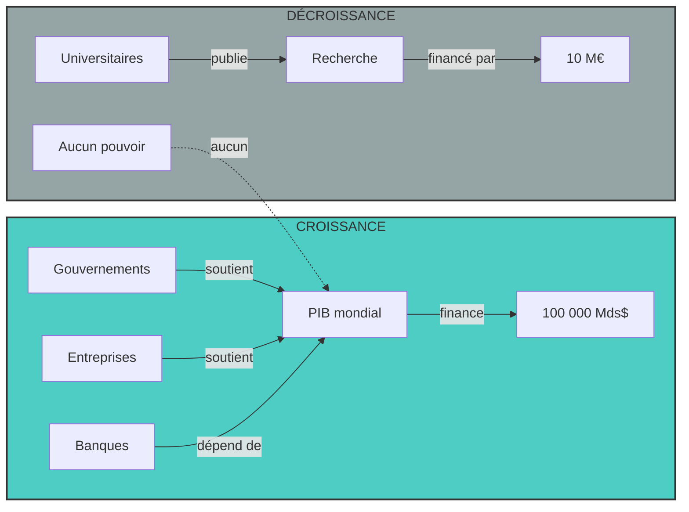
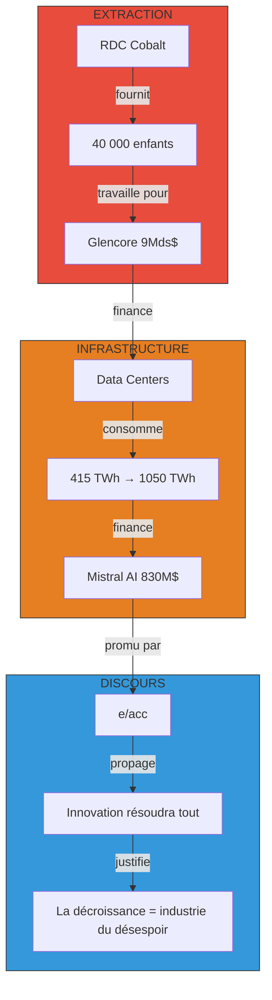
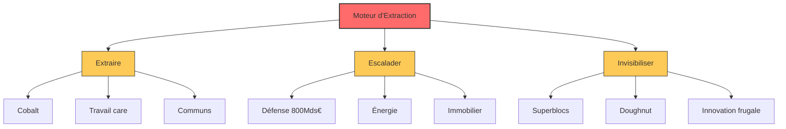

# Le Vampire de la Croissance

*Pourquoi le débat croissance versus décroissance est un leurre conçu pour masquer le vrai mécanisme : l'extraction systématique du vivant.*

---

> Le monde se divise en deux camps : les « pro-croissance » et les « décroissants ». Mais ce débat est un leurre. Le système actuel n'a pas besoin de croître ou de décroître. Il a besoin d'extraire.

## 1. Le Grand Leurre

Le débat est un écran de fumée. Pas un affrontement d'idées, mais un rapport de force financier entre deux puissances incommensurables. D'un côté, le **produit intérieur brut** mondial : 100 000 milliards de dollars de flux annuel, alimenté par la dette, la consommation et l'extraction. De l'autre, la recherche académique sur la décroissance : 10 millions d'euros financés par l'**Union européenne**. Le match n'a jamais eu lieu. Il a été joué d'avance, sur le terrain de la finance, pas sur celui des idées.

**Simon Kuznets** a inventé le PIB en 1934. Pas pour mesurer le bien-être, mais pour quantifier l'effort de guerre américain. L'indicateur était un outil de gouvernance, jamais conçu pour évaluer la prospérité sociale. Il ignore le travail domestique, les communs, l'environnement, les inégalités. Il ne compte pas ce qui se dégrade : les sols, la biodiversité, la santé mentale des jeunes. Il ne compte que ce qui s'échange contre de la monnaie.

Or, la croissance est l'axiome indépassable du système financier actuel. Sans croissance, les banques ne peuvent pas honorer les intérêts de la dette. Sans croissance, les États ne peuvent pas financer leurs déficits. Sans croissance, le mécanisme entier s'effondre. Ce n'est pas une idéologie : c'est une nécessité structurelle. Le capitalisme n'a pas besoin de croître pour vivre, il a besoin de croître pour survivre.

Le **Conseil économique, social et environnemental** appelle à « sortir des antagonismes simplistes ». Mais ce n'est pas un antagonisme : c'est une asymétrie de pouvoir. Le débat croissance versus décroissance est un faux débat parce que les deux termes sont définis par le même indicateur biaisé. L'un demande plus de PIB, l'autre moins. Aucun ne questionne l'indicateur lui-même.

La thèse centrale de cette investigation est simple : le système actuel n'est ni pro-croissance ni anti-croissance. Il est un **moteur d'extraction** pur. Il capture la valeur sous toutes ses formes, matières, travail, données, rente, guerre, pour maintenir un flux monétaire artificiel. Quand l'extraction externe sature, il se retourne contre ses propres bases sociales. C'est le **capitalisme cannibale**.

---

## 2. Anatomie d'un contre-feu : Le récit « e/acc »

Un thread circule sur les réseaux sociaux : « Plus rien ne vous appartient. » Le diagnostic est réel. Les **prix immobiliers** en France ont augmenté de 88 % en vingt ans. La part de propriétaires stagne à 57 % depuis 1999. L'accès à la propriété s'est effondré pour les classes moyennes. Mais le thread ne s'arrête pas là. Il transforme cette crise réelle en conspiration : le Forum économique mondial, « You will own nothing », la confiscation du contrôle.

Le même mécanisme se retrouve dans un autre thread : le « confinement énergétique ». Le diagnostic est là aussi réel. La France a frôlé le blackout à deux reprises en 2025, perdant 10 puis 8 gigawatts de capacité. Le **blackout ibérique** du 28 avril 2025 a privé quinze gigawatts pendant huit heures. Le prix du pétrole a atteint 120 dollars le baril en 2026. Mais le thread transforme ces vulnérabilités réelles en plan de contrôle social. La droite populiste suisse utilise le concept de « confinement énergétique » pour imposer une rhétorique de fermeture.

Le pattern est systémique. Une vulnérabilité réelle est capturée pour produire un récit paralysant. Le diagnostic immobilier est vrai. Le diagnostic énergétique est vrai. Mais la conclusion est fausse. Elle détourne l'indignation vers une cible fictive (le WEF, Davos) plutôt que vers les vrais mécanismes d'extraction (rente immobilière, complexe militaro-industriel, finance).

Qui produit ces récits ? Un acteur sort du lot. **Brivael Le Pogam** est co-fondateur d'**Argil AI**, une startup soutenue par Y Combinator qui a levé 4,9 millions d'euros. **Charles Gorintin**, directeur technique d'Alan et conseiller de Mistral AI, a investi dans cette même entreprise. Le réseau est clair : il s'agit de l'écosystème technologique français qui bénéficie directement d'un monde sans limites de ressources.

Cet écosystème promeut l'idéologie « **e/acc** » : l'accélérationnisme technologique. Le postulat est simple : le progrès technologique illimité est la seule issue. L'innovation résoudra les limites physiques. La conquête spatiale, l'intelligence artificielle, l'énergie nucléaire nous affranchiront de la finitude terrestre. La décroissance est présentée comme une « industrie du désespoir ».

Mais cette idéologie ignore ses propres fondations. L'intelligence artificielle consomme 415 térawatt-heure par an, soit 12 % de croissance annuelle. L'**Agence internationale de l'énergie** projette 650 à 1 050 térawatt-heure d'ici la fin de 2026. Aux États-Unis, la consommation des data centers passera de 147 à 606 térawatt-heure d'ici 2030. Ce n'est pas une industrie immatérielle. C'est une infrastructure d'extraction énergétique massive.

L'idéologie e/acc utilise des statistiques décontextualisées pour discréditer la science climatique. L'étude internationale de 2021 sur l'éco-anxiété, réalisée dans dix pays, est présentée comme une statistique française de 2026. La crise de santé mentale des jeunes aux États-Unis est à un niveau record selon l'**American Academy of Pediatrics**, mais elle est instrumentalisée pour nier l'urgence écologique. Le vaporware technologique (« hôtels lunaires ») vend un futur imaginaire pour masquer une réalité qui dégrade.

---

## 3. L'ossature matérielle : Cobalt et Data Centers

La croissance dite « immatérielle » repose sur une infrastructure matérielle brutale. La **République Démocratique du Congo** détient plus de 70 % des réserves mondiales de cobalt. Ce métal est essentiel aux batteries qui alimentent les data centers et les véhicules électriques. En 2021, la **Fondation Wilson** estimait à 40 000 le nombre d'enfants travaillant dans les mines de cobalt en RDC. Ce n'est pas une abstraction. C'est une chaîne d'approvisionnement fondée sur l'esclavage moderne.

**Glencore**, le géant minier, a vendu 40 % de ses mines en RDC à un consortium américain pour 9 milliards de dollars. Le cobalt circule vers les usines chinoises, puis vers les data centers américains et européens. La finance mondiale est interconnectée : les mêmes fonds qui investissent dans les startups de l'IA investissent dans l'extraction minière.

**Mistral AI** a levé 830 millions de dollars de dette pour financer des data centers GPU. Ce n'est pas un investissement dans l'innovation. C'est un investissement dans l'infrastructure d'extraction énergétique. Les **Big Tech** ont dépensé 1,1 milliard de dollars entre 2024 et 2025 pour bloquer toute régulation de l'intelligence artificielle, selon **Public Citizen**. L'ordre exécutif de Trump (« One Rule ») a préempté les lois climatiques des États américains. Le lobbying est systématique.

L'intelligence artificielle n'est pas propre. Elle n'est pas dématérialisée. Elle est built on top d'une chaîne d'extraction qui va du travail des enfants en RDC à la consommation énergétique galopante des data centers. La « croissance verte » est un mythe. La transition énergétique est avant tout une extraction métallique massive.

Le rapport « **Limits to Growth** » de 1972 vient d'être validé par les données réelles. **Gaya Herrington**, chercheuse au MIT, a confronté les projections aux données observées : elles convergent. Le modèle systémique de 1972 n'était pas une utopie, c'était une prophétie.

---

## 4. Le Mur des Limites : Quand la science parle

Six des neuf frontières planétaires sont officiellement dépassées. Ce n'est pas une opinion. C'est le consensus publié dans **Nature** par le **Stockholm Resilience Centre**. La biodiversité s'effondre : la faune sauvage vertébrée a diminué de 73 % depuis 1970, selon le rapport **Living Planet 2024**. Les stocks de poissons surexploités représentent un tiers des ressources halieutiques, selon la **FAO** 2025. Les sols sont dégradés à hauteur d'un tiers. Sans changement, 95 % des sols seront dégradés d'ici 2050.

Les insectes disparaissent : moins 75 % de biomasse volante en 27 ans, sans aucun signe de récupération, selon une étude publiée dans **Nature**. Les océans acidifiés absorbent moins de CO2. Le cycle métabolique entre l'homme et la terre est rompu. C'est le « metabolic rift » théorisé par **John Bellamy Foster**.

Le découplage absolu entre PIB et émissions n'est pas prouvé à l'échelle requise. L'article publié dans **Nature** et **Lancet** est formel : il n'existe aucune démonstration qu'une croissance économique puisse se poursuivre sans augmentation proportionnelle de l'utilisation des ressources. Le découplage relatif existe (moins d'émissions par euro produit), mais il est compensé par l'effet rebond. L'économie grandit plus vite que les gains d'efficacité.

Le modèle économique du « **Doughnut** » de **Kate Raworth** a été validé par **Nature** en 2025. Il propose un espace sûr et juste entre le minimum social et le maximum écologique. Ce n'est pas la décroissance : c'est une économie dans les limites planétaires. Soixante-huit États des Nations Unies soutiennent officiellement des indicateurs « Beyond GDP ». Mais ces initiatives restent marginales.

La science a tranché. La croissance infinie sur une planète finie est une impossibilité physique. Ce n'est pas une opinion politique. C'est un fait thermodynamique.

---

## 5. La Fuite en Avant : Le business de l'escalade

En Ukraine, un drone à 500 dollars détruit systématiquement un char de combat à 5 millions de dollars. La **RAND Corporation** a documenté ce phénomène. En mer Rouge, des missiles à 2 millions de dollars sont utilisés contre des drones à 2 000 dollars. Le ratio est insoutenable. Le système préfère l'escalade budgétaire plutôt que l'efficacité opérationnelle.

Pourquoi ? Parce que le PIB est un indicateur de dysfonctionnement. Chaque dollar dépensé en plus pour compenser l'inefficacité augmente le produit intérieur brut. Le système n'a pas besoin de résoudre les problèmes. Il a besoin de les aggraver suffisamment pour justifier des dépenses supplémentaires. C'est la fuite en avant : injecter plus de capital dans un système dysfonctionnel gonfle le PIB fictif.

Les dépenses militaires en Europe atteindront 800 milliards d'euros d'ici 2030. **Thales** a enregistré 22,1 milliards d'euros de ventes en 2025, avec un carnet de commandes record de 53,3 milliards d'euros. Les mêmes institutions qui extraient la rente immobilière financent le complexe militaro-industriel. **AXA** et **Allianz** gèrent à la fois l'immobilier et les contrats de défense.

Le concept d'innovation frugale existe. Le « jugaad » indien, le « faire mieux avec moins », a été documenté par la **Royal Society**. Mais cette voie est invisibilisée. Elle menace le business model de l'escalade. Si un drone à 500 dollars suffit, pourquoi commander des chars à 5 millions ? Si la sobriété fonctionne, pourquoi financer la tech à 830 millions de dollars ?

La voie « Meilleur » est la menace existentielle du moteur d'extraction. Elle rend l'extraction et l'escalade inutiles. Elle doit être oubliée.

---

## 6. Le Moteur d'Extraction : Les 3 Ressorts

Le système n'est pas pro-croissance. Il n'est pas anti-croissance. Il est un moteur d'extraction pur, avec trois mécanismes cardinaux.

Le premier mécanisme : **Extraire**. Le cobalt circule vers les data centers. Les enfants des mines du Congo alimentent les serveurs qui génèrent les tokens d'intelligence artificielle. Le travail gratuit ou sous-payé des femmes (travail de soin représentant 10 à 39 % du PIB s'il était comptabilisé) soutient l'économie sans apparaître dans les comptes nationaux. Les communs sont invisibilisés : **Elinor Ostrom** a démontré que les communautés peuvent gérer les ressources communes, mais cette solution est absente des Objectifs de développement durable.

Le deuxième mécanisme : **Escalader**. Le système ne résout pas les problèmes, il les monétise. Chaque crise devient une opportunité de dépense. La transition énergétique est un marché de 54 milliards d'euros (France 2030). La défense est un marché de 800 milliards d'euros. L'immobilier est un marché de rente où les prix ont augmenté de 88 % en vingt ans. Le PIB augmente à chaque étape d'aggravation.

Le troisième mécanisme : **Invisibiliser**. Les solutions efficaces sont rendues invisibles. La décroissance institutionnelle est financée à 10 millions d'euros par l'**Union européenne**, mais elle ignore les dépenses militaires et le capitalisme de surveillance. Les « **Superblocs** » de Barcelone ont réduit le NO2 de 25 % et les PM10 de 17 %, mais ce modèle n'est pas reproduit à l'échelle. Le modèle Doughnut est validé par Nature mais reste un concept académique. L'innovation frugale est documentée par la Royal Society mais n'est pas financée.

Les **Objectifs de développement durable** sont qualifiés de « machine anti-politique » par l'**Université de Berne**. Ils invisibilisent les communs et légitiment l'accaparement. Le Forum économique mondial a publié « You will own nothing » en 2016. Ce n'est pas une conspiration : c'est un programme. Préparer une économie de location totale où chaque besoin devient un service facturé.

Le rapport de force est simple. La recherche décroissance : 10 millions d'euros. Le PIB mondial : 100 000 milliards de dollars. Le match est plié. Non par la persuasion, mais par le financement.

---

## 7. Le Vampire : L'Auto-cannibalisation du vivant

**Karl Marx** l'avait écrit en 1867 : « Le capital est du travail mort qui, tel un vampire, ne s'anime qu'en suçant du travail vivant. » **Nancy Fraser** a repris ce concept en 2024 : le « cannibal capitalism » dévore ses propres bases sociales et vitales. Ce n'est plus une métaphore. C'est une description littérale.

À l'extérieur, le système épuise les ressources. Les mines de cobalt épuisent les enfants. Les data centers épuisent l'énergie. Les océans sont surexploités. Les sols sont dégradés. La biodiversité s'effondre. Mais quand l'extraction externe sature, le système se retourne vers l'intérieur.

Il dévore l'éducation. Les jeunes sont plus anxieux que jamais. L'étude internationale de 2021 montre que 75 % des jeunes souffrent d'éco-anxiété. La crise de santé mentale aux États-Unis est à un niveau record selon l'**American Academy of Pediatrics**. Mais cette donnée est instrumentalisée pour nier l'urgence climatique plutôt que pour la traiter.

Il dévore la santé. Le système de santé est sous-financé, burn-out des soignants, déserts médicaux. La crise de la médecine générale n'est pas un accident : c'est une conséquence de l'extraction des ressources humaines.

Il dévore l'avenir. Le travail de soin (care) représente 10 à 39 % du PIB s'il était comptabilisé. Mais il n'est pas comptabilisé. Il est effectué gratuitement, principalement par les femmes, et sa valeur est captée par le système sans être reversée.

Le capital suce le travail vivant. Quand il n'y a plus de travail vivant à sucer dehors, il se retourne vers le travail vivant de l'intérieur. L'éducation, la santé, l'avenir des jeunes. C'est l'auto-cannibalisation.

**TotalEnergies** a été condamné pour greenwashing à Paris en octobre 2025. Mais la condamnation est symbolique face aux milliards de profits. Le système peut se permettre quelques amendes. Il ne peut pas se permettre d'arrêter le moteur.

---

## 8. Sortir du cercle

Nous n'avons pas besoin de moins de croissance. Nous avons besoin de plus de réalité.

La voie frugale existe. Le « jugaad » indien, les **Superblocs** de Barcelone, le modèle Doughnut validé par Nature. Soixante-huit États des Nations Unies soutiennent des indicateurs « Beyond GDP ». Le concept de **Sumak kawsay** (sud global) et d'**Ubuntu** propose un bien-vivre collectif. Mais ces voies sont invisibilisées car elles menacent le moteur d'extraction.

Le débat croissance versus décroissance est un leurre. Le système n'a pas besoin qu'on choisisse son camp. Il a besoin qu'on reste dans son cercle. Le vrai choix n'est pas entre croissance et décroissance. Il est entre l'extraction et la frugalité.

La frugalité n'est pas l'austérité. C'est l'élégance de faire mieux avec moins. C'est le drone à 500 dollars qui bat le char à 5 millions. C'est le Superbloc qui réduit les émissions sans dépense massive. C'est le communs qui gère les ressources sans marché.

Le vampire ne peut pas s'arrêter de sucer. C'est sa nature. Mais nous pouvons refuser d'être le sang qu'il suce.

---

## SOURCES

**Histoire & Origines du PIB**
Kuznets : National Income 1934 : https://fraser.stlouisfed.org/title/971

**Énergie & Data Centers**
Agence internationale de l'énergie : https://www.iea.org/reports/energy-and-ai/energy-demand-from-ai
Global Electricity : https://www.globalelectricity.org/data-centers-energy-consumption/
McKinsey : https://www.mckinsey.com/featured-insights/ais-power-binge

**Extraction & Cobalt**
Humanium : https://www.humanium.org/en/the-current-state-of-child-labour-in-cobalt-mines
Stop Modern Day Slavery : https://stopmoderndayslavery.org/2024/08/slavery-in-the-palm-of-your-hand
US Department of Labor : https://www.dol.gov/agencies/ilab/resources/reports/child-labor/congo-democratic-republic-drc
Reuters : https://www.reuters.com/world/africa/glencore-sell-40-stake-congo-mines-2026-02-03/

**Science & Limites Planétaires**
Nature : https://www.nature.com/articles/s41598-024-71101-2
Nature : https://www.nature.com/articles/s41586-025-09385-1
Nature : https://www.nature.com/articles/s43017-024-00597-z
The Lancet : https://www.thelancet.com/journals/lanplh/article/PIIS2542-5196(23)00174-2/fulltext
Wiley/JIEC : https://onlinelibrary.wiley.com/doi/10.1111/jiec.13084
FAO : https://www.fao.org/evaluation/highlights/detail/soils/en
FAO : https://www.fao.org/newsroom/detail/fao-releases-the-most-detailed-global-assessment-of-marine-fish-stocks-to-date
WWF Living Planet : https://livingplanet.panda.org/en-US/

**Finance & Armement**
Thales Group : https://www.thalesgroup.com/en/news-centre/press-releases/thales-reports-its-2025-full-year-results
RAND Corporation : https://www.rand.org/pubs/commentary/2025/03/david-vs-goliath-cost-asymmetry-in-warfare.html
CSIS : https://www.csis.org/analysis/breaking-debt-trap-why-spending-smarter-beats-spending-more

**Institutions & Politiques**
CESE : https://www.lecese.fr/actualites/transition-ecologique-croissance-vs-decroissance
Université de Berne : https://www.cde.unibe.ch/insights__media/spotlight/the_sdgs
Parlement européen : https://www.europarl.europa.eu/RegData/etudes/STUD/2021/694784
Brussels Signal : https://brusselssignal.eu/2023/08/european-commission-gave-e10-million-to-degrowth-research

**Idéologies & Réseaux**
Wikipedia e/acc : https://en.wikipedia.org/wiki/Effective_accelerationism

**Débats & Idéologies**
Le Monde : https://www.lemonde.fr/societe/article/2025/08/27/crise-du-logement-une-france-a-deux-vitesses-se-dessine-previent-l-institut-montaigne_6635973_3224.html
Monthly Review : https://monthlyreview.org/articles/planning-degrowth-the-necessity-history-and-challenges
Vert.eco : https://www.vert.eco/articles/nous-navons-pas-besoin-dattendre-les-partis-politiques-pour-faire-de-la-decroissance
The Conversation : https://theconversation.com/quelle-place-pour-le-sud-global-dans-la-decroissance

**Données Sociales & Santé**
Insee : https://www.insee.fr/
Institut Montaigne : https://www.institutmontaigne.org/publications/classes-moyennes-les-nouvelles-cles-dacces-la-propriete
American Academy of Pediatrics : https://publications.aap.org/pediatrics/article/156/5/e2025070849

**Théorie Critique**
Springer : https://link.springer.com/article/10.1057/s41296-023-00654-0
Lapham's Quarterly : https://www.laphamsquarterly.org/night/value-judgment
Royal Society : https://royalsocietypublishing.org/rsta/article/375/2095/20160372
