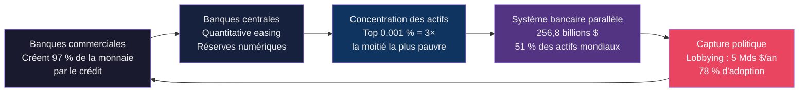
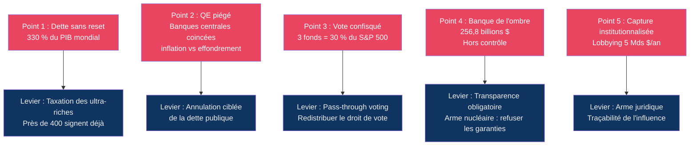

# 🔒 Comment la richesse verrouille le système

*🔍 Trois alternatives existent. Aucune n'est adoptée. Cette investigation identifie les cinq points de rupture du circuit financier qui les bloque.*

## Introduction

Le système économique mondial produit des résultats qui contredisent ses propres promesses. Il promet la prospérité et **concentre la richesse entre quelques mains**. Il promet la souveraineté du peuple et **livre le pouvoir à ceux qui financent les campagnes**. Il promet le progrès et **épuise les limites planétaires**. Il promet la transparence et **organise la surveillance de masse**.

Ce n'est pas un dysfonctionnement. C'est le fonctionnement normal d'une structure conçue pour **extraire, concentrer et se protéger**.

Cette investigation part d'un constat : trois alternatives au modèle dominant sont étayées par la recherche. L'économie circulaire, la gouvernance des biens communs, la décroissance. Chacune dispose d'un corpus de données, d'études validées par les pairs, de résultats mesurés. Aucune n'est déployée à grande échelle. L'Union européenne consacre 10 millions d'euros au projet Post-Growth Deal. Ses dépenses de défense visent 800 milliards d'euros. **Soit 80 000 fois plus.**

Pourquoi ce blocage ? La réponse est dans les chiffres : **la concentration de richesse qui rend ces alternatives nécessaires est précisément ce qui les rend impossibles.**

La question de cette investigation est donc autre : comment les règles du système peuvent-elles être poussées jusqu'à leur point de rupture, ou retournées contre la structure elle-même ?

Un système n'est jamais invulnérable. Il contient ses propres contradictions. Cette investigation identifie **cinq points de rupture** — un par maillon du circuit financier qui verrouille le statu quo. Chaque point de rupture est un mécanisme du système qui, poussé à son terme, peut se retourner contre lui-même.

## Le circuit

Pour comprendre le piège, il faut suivre l'argent. Pas l'argent des salaires, ni celui des impôts. L'argent que les banques créent à partir de rien.

### L'arnaque originelle : la monnaie créée ex nihilo

Ce n'est pas une théorie marginale. **Les banques centrales elles-mêmes le confirment.** La Banque d'Angleterre l'écrit en 2014 : « Banks do not act simply as intermediaries, lending out deposits that savers place with them... but are instead money creators. » (Les banques n'agissent pas comme de simples intermédiaires prêtant l'argent des épargnants... elles sont des créatrices de monnaie.) L'économiste Richard Werner le démontre expérimentalement la même année : il emprunte 200 000 euros à une banque et observe que la banque crée un dépôt à son nom — sans transférer de fonds depuis un autre compte. « Money out of nothing. » (De l'argent à partir de rien.)

Le mécanisme est le suivant : l'argent est censé représenter une valeur réelle — du travail, un bien, un service, quelque chose de concret et mesurable. Mais la monnaie créée par les banques n'est adossée à rien de tout cela. Elle est adossée à une **promesse** — la promesse de l'emprunteur de rembourser. Et cette promesse est créée avec **intérêts**.

Le piège est mathématique : **la banque crée le capital du prêt, mais pas les intérêts.** Il y a donc toujours **plus de dettes que de monnaie** dans le système. Pour payer les intérêts de la dette existante, il faut créer encore plus de dette. Le système exige une croissance infinie de la dette pour ne pas s'effondrer. C'est ce que le politologue James O'Connor nomme en 1988 la « seconde contradiction du capitalisme » : le système doit détruire les bases réelles de la valeur — travail, ressources, environnement — pour nourrir une abstraction, la dette, qui n'a de sens que si elle croît sans fin.

Ce mécanisme n'est pas une invention moderne. Il apparaît en Mésopotamie vers 2500 avant notre ère, comme le documente l'économiste Michael Hudson. Les taux sont fixés par les temples : 20 % par an pour l'argent, 33,3 % pour l'orge. Ils restent stables pendant des siècles — non pas parce que le marché les impose, mais parce qu'ils relèvent d'une construction administrative. Les civilisations anciennes savent que ce mécanisme est destructeur. Les rois mésopotamiens proclament régulièrement des annulations de dettes agraires — l'*amargi* sumérien, l'*andurarum* akkadien, le *misharum* babylonien — pour empêcher l'effondrement social. Solon à Athènes, en 594 avant notre ère, libère les esclaves pour dettes et annule les dettes (*seisachtheia*). Rome interdit totalement l'intérêt par la *Lex Genucia* en 340 avant notre ère.

Toutes les grandes religions condamnent l'usure. Le judaïsme l'appelle *neshekh* — « une morsure ». L'islam interdit le *riba* — « l'excès, l'addition ». Le christianisme prohibe l'usure pendant quinze siècles. Dante place les usuriers dans le même cercle de l'enfer que les habitants de Sodome. Aristote résume : « Une pièce de monnaie ne peut en engendrer une autre. » Adam Smith lui-même, que l'on présente comme le père du libéralisme, défend un plafond des taux d'intérêt. Keynes écrit qu'un gouvernement sage doit maintenir le taux d'intérêt bas « par la loi, la coutume et même les sanctions de la loi morale ».

Le tournant survient vers 1620, avec la Réforme protestante. L'usure passe d'un crime public à une affaire de conscience privée. Le capitalisme naissant a besoin de crédit. L'interdiction est levée.

La différence cruciale entre le système moderne et les civilisations anciennes est là : les Mésopotamiens, les Grecs, les Romains, les civilisations médiévales disposaient de mécanismes de réinitialisation — annulations de dettes, jubilés, plafonds de taux. **Le système moderne n'en a plus.** Il exige une croissance infinie de la dette pour ne pas s'effondrer. La dette mondiale atteint **330 % du produit intérieur brut mondial** (Institut de la finance internationale, 2025). Les intérêts ne sont jamais créés — il faut donc toujours plus de dette.

Les banques commerciales créent ainsi environ **97 % de la masse monétaire**. Le reste — les « réserves de banque centrale » — représente 3 %. Et c'est là que les banques centrales appuient sur l'accélérateur.

### Le moteur : l'assouplissement quantitatif des banques centrales

Quand les banques centrales lancent un programme d'assouplissement quantitatif (*quantitative easing*), elles ne distribuent pas de chèques aux citoyens. Elles créent de la monnaie numériquement sous forme de « réserves de banque centrale » — la Banque d'Angleterre le dit explicitement : « the money we used to buy bonds did not come from government taxation or borrowing. Instead, we can create money digitally. » (L'argent que nous avons utilisé pour acheter des obligations ne provenait ni de l'impôt ni de l'emprunt d'État. Nous pouvons créer de la monnaie numériquement.) Avec cette monnaie, elles achètent des obligations d'État et des titres hypothécaires. Les prix des obligations montent, leurs rendements baissent. Les taux d'emprunt deviennent artificiellement bas.

Mais le mécanisme crucial est ailleurs. Quand une banque centrale achète pour un milliard d'euros d'obligations à un gestionnaire d'actifs, ce gestionnaire se retrouve avec un milliard de liquidités. Il ne va pas les garder en caisse. Il va les investir dans d'autres actifs : actions, immobilier, obligations d'entreprises. Les prix de ces actifs montent. Les ménages et les institutions qui les détiennent voient leur patrimoine augmenter. C'est ce que la Banque d'Angleterre appelle l'« effet de richesse » — et elle admet qu'il est « highly concentrated » (fortement concentré). **Les 10 % les plus riches captent la quasi-totalité des gains.** Le Fonds monétaire international décrit le mécanisme : l'assouplissement quantitatif raccourcit la structure de maturité de la dette publique — il remplace la dette longue par de la monnaie centrale, ce qui abaisse les taux et pousse les investisseurs vers des actifs plus risqués. Les banques centrales sont détenues par les banques membres : JPMorgan et Citigroup sont actionnaires de la Réserve fédérale américaine.

**Cet argent ne va pas dans l'économie réelle. Il va dans les actifs. Et qui détient les actifs détient le pouvoir de vote dans les entreprises.**

### La concentration : qui détient les actifs détient le pouvoir

Le 0,001 % de la population mondiale — 60 000 personnes — détient **3 fois la richesse de la moitié la plus pauvre**. Le top 10 % possède 75 % de la richesse mondiale. Le bas 50 % : 2 %. 43,4 % de la richesse mondiale est concentrée dans le top 1 % mondial. 54 400 milliards de dollars. BlackRock, Vanguard et State Street détiennent plus de 50 % des actions américaines. Ils contrôlent environ 30 % du pouvoir de vote au sein des entreprises du S&P 500 — sur chaque résolution importante, fusion, nomination de dirigeants ou stratégie climatique, **ces trois fonds ont le dernier mot**. Trois fonds contrôlent 74 % du marché des fonds indiciels cotés. Ces mêmes trois fonds possèdent environ 20 % de chaque géant technologique.

Mais les actifs ne suffisent pas à absorber tout ce capital. Le capital excédentaire déborde du circuit régulé pour alimenter un système parallèle — la banque de l'ombre (*shadow banking*).

### L'ombre : le système bancaire parallèle

Le système bancaire parallèle — le *shadow banking* — atteint **256,8 billions de dollars**. Il représente 51 % des actifs financiers mondiaux et croît au double du rythme du système bancaire régulé. De quoi s'agit-il ? D'un réseau d'institutions qui font le même travail que les banques — prêter, transformer des échéances, créer du crédit — mais **sans les mêmes règles**. Aucune exigence de fonds propres. Aucun test de résistance. Aucune supervision directe des banques centrales. Aucune garantie des dépôts. Les instruments sont les accords de rachat (*repos*, prêts à court terme garantis par des obligations), les fonds du marché monétaire (qui vendent des parts remboursables à vue, substituts des dépôts bancaires), les véhicules d'investissement structurés (qui empruntent à court terme pour investir à long terme). Le mécanisme est le même que celui qui a provoqué la crise de 2008 : transformation de maturité, opacité, effet de levier. Les produits dérivés de gré à gré — des contrats négociés directement entre deux parties, sans passer par une bourse réglementée — atteignent 846 billions de dollars en valeur notionnelle. **Ensemble : 1 100 billions de dollars. Le produit intérieur brut mondial : 105 billions de dollars.** Les institutions financières non bancaires américaines détiennent 2,5 fois les actifs des banques.

Et l'ombre finance la capture.

### La capture : quand l'argent achète les lois

L'étude de Martin Gilens et Benjamin Page (Princeton, 2014) démontre que les politiques publiques américaines ne présentent **aucune corrélation avec les préférences de l'électorat moyen** — qu'un citoyen ordinaire soutienne ou rejette une loi n'a aucun effet statistique sur son adoption. En revanche, la corrélation est forte avec les préférences des élites économiques : quand les 10 % les plus riches soutiennent une loi, elle a **78 % de chances d'être adoptée**.

Mais Gilens et Page ne sont que la pointe visible. Le secteur de la santé a investi un record de 868 millions de dollars dans le lobbying en 2025 (OpenSecrets). Le lobbying total a dépassé 5 milliards de dollars en 2025 pour la première fois — une hausse de 14 % en un an. Face à l'*Inflation Reduction Act*, qui autorise l'assurance-maladie américaine à négocier les prix des médicaments, l'industrie engage des centaines de lobbyistes pour saboter le dispositif. Les portes tournantes sont systémiques : un tiers des nominés du Département de la Santé et des Services sociaux entre 2004 et 2020 ont rejoint l'industrie privée (*Health Affairs*, 2023). Le financement des campagnes électorales lie les élus à leurs donateurs. La capture n'est pas un accident. C'est la conséquence inévitable d'un système où l'influence politique s'achète comme un actif financier.

La concentration de richesse alimente la capture politique. La capture politique verrouille la concentration de richesse. La boucle est bouclée.

Les alternatives existent. Elles sont étayées par la recherche, mais elles restent lettre morte. La question n'est plus de savoir pourquoi. La question est : où sont les points de rupture ?

## Les cinq points de rupture

Le circuit est fermé. Mais chaque maillon contient sa propre contradiction. Les voici.

### Premier point de rupture : la dette sans réinitialisation

Le système commence par une arnaque mathématique : **la banque crée le capital du prêt, mais pas les intérêts.** Il y a donc toujours plus de dettes que de monnaie. Les civilisations anciennes le savaient — elles proclamaient des annulations de dettes agraires. Le système moderne n'en a plus.

La dette mondiale atteint **330 % du produit intérieur brut mondial** (Institut de la finance internationale, 2025). En France, elle atteint 114 % du produit intérieur brut. La pression fiscale monte. Et avec elle, la demande de taxation des ultra-riches. Près de 400 millionnaires et milliardaires dans 24 pays ont signé une lettre ouverte au Forum économique mondial de Davos en janvier 2026 : « Tax us. Tax the super rich. » (Taxez-nous. Taxez les super-riches.) — membres du collectif Patriotic Millionaires, qui inclut les héritiers Disney et le promoteur immobilier Jeffrey Gural. Ils exigent la fin du « contrôle » des oligarques mondiaux par la fiscalité. Une taxe de 3 % sur les centimillionnaires — ceux dont la fortune dépasse 100 millions de dollars — rapporterait 750 milliards de dollars par an. **Le taux d'imposition effectif des milliardaires est inférieur à celui de la classe moyenne.**

Le levier : exiger la taxation des ultra-riches en s'appuyant sur leur propre demande. Près de 400 d'entre eux ont déjà signé. La dette publique rend la réforme fiscale inévitable — la seule question est de savoir qui paiera.

### Deuxième point de rupture : l'assouplissement quantitatif piégé

Le mécanisme a été décrit plus haut : les banques centrales créent de la monnaie pour acheter des obligations, les gestionnaires d'actifs réinvestissent dans les actions et l'immobilier, les prix montent, les 10 % les plus riches captent les gains. Mais ce mécanisme contient une contradiction que personne ne nomme.

Les banques centrales détiennent désormais une part massive de la dette publique qu'elles ont achetée via l'assouplissement quantitatif. La Banque du Japon détient plus de 50 % des obligations d'État japonaises. La Réserve fédérale américaine en détient environ 20 %. La Banque centrale européenne détient un tiers de la dette de la zone euro. **Cette dette, les banques centrales la détiennent... envers elles-mêmes.** Les intérêts que les États paient sur ces obligations reviennent aux banques centrales, qui les reversent aux... États. C'est un circuit fermé.

Le piège est le suivant : les banques centrales sont coincées entre deux impossibilités. Si elles montent les taux pour combattre l'inflation, elles font exploser le service de la dette publique — les États ne peuvent plus payer. Si elles maintiennent les taux bas, elles alimentent les bulles spéculatives et l'inflation qui appauvrissent les classes populaires. **Dans les deux cas, le système craque.**

Mais ce circuit fermé contient une issue que personne n'exploite : **les banques centrales peuvent annuler la dette publique qu'elles détiennent.** Cette annulation ne coûte rien — c'est de l'argent qu'elles se doivent à elles-mêmes. La dette est un chiffre dans leurs livres. L'effacer est une décision comptable, pas un transfert de richesse.

Le levier : exiger l'annulation ciblée de la dette publique détenue par les banques centrales. Cette annulation libérerait des marges budgétaires colossales — sans impôt nouveau, sans transfert de richesse. En zone euro, la BCE détient environ 5 000 milliards d'euros de dette publique. Les intérêts annuels sur cette dette représentent des dizaines de milliards d'euros économisés. Cet argent pourrait financer la transition écologique, les services publics, la protection sociale. La seule barrière est politique, pas technique.

### Troisième point de rupture : le pouvoir de vote confisqué

Trois fonds détiennent le pouvoir de vote de la moitié des entreprises américaines. Mais derrière ces chiffres se cache un mécanisme que la plupart des investisseurs ignorent.

Quand un petit épargnant achète des parts d'un fonds indiciel — un fonds de pension, une assurance-vie, un plan d'épargne entreprise — il pense devenir actionnaire. **Il ne l'est pas.** Le fonds détient les actions à sa place. Et le droit de vote attaché à ces actions ? Il est exercé par le gestionnaire du fonds, pas par l'épargnant. L'épargnant ne sait même pas que son vote a été délégué. Il ne reçoit aucune consultation. Aucune information. Son pouvoir de vote a disparu dans les tuyaux de la finance indexée.

C'est ce que les juristes appellent le « vote en blanc automatisé » : des millions de petits porteurs qui, collectivement, détiendraient un pouvoir considérable s'ils votaient, mais dont les voix sont absorbées silencieusement par trois gestionnaires de fonds.

Le levier : exiger le « pass-through voting » — l'obligation pour les fonds indiciels de transmettre le droit de vote aux détenteurs de parts. Techniquement, c'est faisable. Plusieurs plateformes le proposent déjà pour les actions individuelles. Étendu aux ETF, cela redistribuerait instantanément le pouvoir de vote de dizaines de millions de petits porteurs. La Commission de surveillance des marchés financiers américaine a proposé une réforme en ce sens. Elle a été bloquée par l'industrie financière. **La réactiver ne coûte rien — elle rend simplement aux gens ce qui leur appartient.**

### Quatrième point de rupture : le système bancaire parallèle hors de contrôle

Deux cent cinquante-six billions de dollars. Cinquante et un pour cent des actifs financiers mondiaux. Croissance au double du système régulé. Mais derrière ces chiffres se cache une vulnérabilité que le système lui-même ignore.

Le système bancaire parallèle ne crée pas de monnaie — **il crée de la confiance. Et la confiance est fragile.** Tout le mécanisme repose sur les accords de rachat (*repos*) : des prêts à court terme garantis par des obligations. Chaque jour, des milliers de milliards de dollars circulent via les repos. C'est le carburant du système. Si un prêteur doute de la qualité de la garantie, il retire son argent. Les emprunteurs ne peuvent pas rouler leur dette. Le mécanisme s'emballe — comme en 2008, quand le marché des repos s'est gelé en quelques jours, provoquant l'effondrement de Lehman Brothers et le sauvetage d'urgence de l'ensemble du système.

La vulnérabilité est là : le *shadow banking* dépend d'un marché de l'ombre qu'il ne contrôle pas. Il suffit d'un doute, d'une contrepartie qui fait défaut, d'une garantie qui perd sa valeur — et tout le château s'écroule. Les banques centrales le savent. C'est pourquoi elles interviennent systématiquement pour sauver le système. Mais chaque sauvetage reporte le problème et grossit la bulle.

Le levier : imposer la centralisation et la transparence de tous les accords de rachat sur des plateformes publiques. Chaque prêt, chaque garantie, chaque contrepartie serait enregistré et visible. Après 2008, le *Dodd-Frank Act* a créé des chambres de compensation pour certains dérivés. Étendre ce mécanisme aux *repos* tuerait l'opacité du *shadow banking* — et avec elle, son avantage concurrentiel principal : l'invisibilité. Les banques centrales peuvent aussi refuser d'accepter comme garantie les titres issus du *shadow banking* non régulé. **C'est l'arme nucléaire. Elle existe. Elle n'a jamais été utilisée.**

### Cinquième point de rupture : la capture institutionnalisée

Les préférences de l'électorat moyen n'ont aucun effet sur les politiques publiques. Le lobbying a dépassé 5 milliards de dollars en 2025. Un tiers des nominés du Département de la Santé ont rejoint l'industrie privée. Mais derrière ces chiffres se cache une vulnérabilité que le système ne peut pas réparer.

**La capture institutionnalisée est visible. Elle est documentée. Elle est de plus en plus dénoncée. Et c'est précisément cette visibilité qui la rend vulnérable.**

Le *British Medical Journal* a documenté en 2024 que la *Food and Drug Administration* autorise ses employés à influencer l'agence « en coulisses » après leur départ. OpenSecrets publie chaque année les données de lobbying. Les journalistes d'investigation traquent les portes tournantes. Les organisations non gouvernementales cartographient les conflits d'intérêts. La capture survit dans l'opacité — mais l'opacité se réduit.

**Le vrai levier n'est pas la transparence. C'est l'arme juridique.** Les conflits d'intérêts ne sont pas illégaux — ils sont institutionnalisés. Mais ils violent des principes constitutionnels fondamentaux : l'égalité d'accès au processus législatif, l'impartialité des régulateurs, la souveraineté du peuple. Chaque scandale de porte tournante, chaque dollar de lobbying révélé, chaque financement de campagne exposé est une munition juridique.

Le levier : attaquer la capture sur le terrain constitutionnel. En France, la Haute Autorité pour la transparence de la vie publique peut déjà sanctionner les conflits d'intérêts. Aux États-Unis, le *Lobbying Disclosure Act* existe mais n'est presque jamais appliqué. Le faire respecter est la première étape. Interdire les portes tournantes pendant cinq ans est la deuxième. Plafonner les dépenses électorales est la troisième. Chaque mesure existe déjà dans certains pays. Aucune n'est appliquée systématiquement. La pression pour les appliquer monte — parce que la capture est visible, et que la visibilité est le premier pas vers la rupture.

Chaque maillon du circuit contient son propre point de rupture. La dette sans réinitialisation. L'assouplissement quantitatif piégé. Le pouvoir de vote confisqué. Le système bancaire parallèle hors de contrôle. La capture institutionnalisée.

## Les alternatives monétaires

Le circuit est verrouillé. Mais les solutions alternatives ne sont pas des utopies. Elles existent. Elles sont testées. Certaines fonctionnent depuis des décennies. Aucune n'est déployée à grande échelle — précisément parce que le circuit les bloque.

### La monnaie pleine : rendre la création monétaire aux banques centrales

Le principe est simple : **seule la banque centrale crée la monnaie.** Les banques commerciales ne peuvent plus prêter ce qu'elles n'ont pas. Elles deviennent de simples intermédiaires entre épargnants et emprunteurs — le rôle qu'on leur attribuait avant que le système ne dérive.

En Suisse, l'initiative *Vollgeld* (monnaie pleine) a été soumise au vote populaire en 2018. Elle a été rejetée à 71 % — non pas parce que le mécanisme était irréaliste, mais parce que l'ensemble du secteur financier suisse a fait campagne contre. Au Royaume-Uni, l'organisation *Positive Money* porte le même projet depuis 2010. L'économiste Irving Fisher le défendait déjà en 1935, après la Grande Dépression : « La création monétaire est une fonction gouvernementale. Elle ne devrait pas être déléguée à des entités privées cherchant le profit. »

L'obstacle n'est pas technique. Il est politique : **les banques commerciales perdraient leur privilège de créer 97 % de la monnaie.**

### Les banques publiques : le crédit au service de l'intérêt général

Le principe : des banques détenues par l'État ou les collectivités locales créent du crédit pour financer l'intérêt public — logements, infrastructures, transition écologique — plutôt que le profit des actionnaires.

La Bank of North Dakota existe depuis 1919. C'est la seule banque publique d'État aux États-Unis. Elle détient les dépôts de l'État du Dakota du Nord et les prête aux agriculteurs, aux étudiants et aux petites entreprises de l'État. **Résultat : le Dakota du Nord a survécu à la crise de 2008 sans sauvetage fédéral.** En Allemagne, les *Sparkassen* — des banques municipales publiques — gèrent 30 % des dépôts du pays et financent l'économie locale. Elles n'ont pas de spéculation à leur bilan.

En France, la Caisse des dépôts et consignations est une institution publique qui gère le Livret A et finance le logement social. Mais son rôle est limité. Étendre le modèle des banques publiques à l'échelle nationale est techniquement faisable. Politiquement, c'est un combat.

### Les monnaies complémentaires : créer de la monnaie sans dette

Le principe : des monnaies locales, créées sans dette, circulent dans une économie réelle déconnectée du système bancaire.

Le WIR en Suisse existe depuis 1934. C'est une monnaie complémentaire utilisée par 80 000 entreprises suisses. Elle est créée sans dette, utilisée pour les échanges entre entreprises, et n'est pas soumise aux cycles du crédit bancaire. Pendant les crises, le volume des transactions WIR augmente — les entreprises se tournent vers elle quand le crédit bancaire se tarit. Le WIR est étudié par la Banque des règlements internationaux.

Le Sardex en Sardaigne, créé en 2008, fonctionne sur le même principe : un réseau d'entreprises qui échangent des biens et services sans passer par la monnaie bancaire. En 2023, le réseau comptait plus de 5 000 entreprises et un volume d'échanges de 500 millions d'euros.

Ces monnaies ne remplacent pas l'euro. Elles le complètent. Mais elles prouvent qu'une économie peut fonctionner sans dépendre entièrement du crédit bancaire.

### La monnaie numérique de banque centrale : contourner les banques commerciales

Le principe : la banque centrale crée une monnaie numérique directement accessible aux citoyens, sans passer par les banques commerciales. Chaque citoyen aurait un compte à la banque centrale.

La Chine teste le yuan numérique (*e-CNY*) depuis 2020. Plus de 260 millions de portefeuilles ont été ouverts. La Banque centrale européenne étudie un euro numérique. La Réserve fédérale américaine explore un dollar numérique.

Le risque : la surveillance. Une monnaie numérique de banque centrale pourrait permettre à l'État de tracer chaque transaction, de limiter les dépenses, de contrôler l'économie. C'est l'arme absolue du contrôle. Mais le même mécanisme pourrait être utilisé pour distribuer un revenu de base, financer directement la transition écologique, ou contourner les banques commerciales qui refusent de prêter aux ménages modestes.

La question n'est pas technique. Elle est politique : qui contrôle la monnaie numérique, et dans quel but ?

### L'annulation ciblée de la dette : la décision comptable

Le principe : les banques centrales annulent la dette publique qu'elles détiennent. **Cette annulation ne coûte rien** — c'est de l'argent qu'elles se doivent à elles-mêmes. La dette est un chiffre dans leurs livres. L'effacer est une décision comptable, pas un transfert de richesse.

La Banque du Japon détient plus de 50 % des obligations d'État japonaises. La Réserve fédérale américaine en détient environ 20 %. La Banque centrale européenne détient un tiers de la dette de la zone euro. Annuler cette dette libérerait des dizaines de milliards d'euros d'intérêts chaque année — autant de marges budgétaires pour les États.

La Banque d'Angleterre a déjà annulé une partie de sa dette en 2023, sans que le ciel ne tombe. La Réserve fédérale reverse chaque année ses bénéfices au Trésor américain — environ 100 milliards de dollars par an. **C'est la preuve que le mécanisme fonctionne.**

L'obstacle n'est pas économique. Il est idéologique : annuler la dette, c'est admettre que le système de la dette est une construction politique, pas une loi de la nature.

Cinq alternatives. Cinq mécanismes. Aucun n'est utopique. Tous sont bloqués — non pas par la réalité, mais par le circuit.

## Le verdict

Ce n'est pas un complot. C'est une structure. Cinq maillons. Cinq contradictions. Cinq points de rupture.

Le premier maillon — la dette — exige une croissance infinie que la réalité physique ne peut pas soutenir. Le deuxième — l'assouplissement quantitatif — piège les banques centrales entre l'inflation et l'effondrement. Le troisième — le pouvoir de vote confisqué — transforme des millions de petits porteurs en actionnaires fantômes. Le quatrième — le système bancaire parallèle — repose sur un marché de la confiance qui peut se geler en quelques jours. Le cinquième — la capture institutionnalisée — est visible, documentée, et de plus en plus contestée.

Ces cinq contradictions ne sont pas indépendantes. Elles se renforcent mutuellement. La dette alimente l'assouplissement quantitatif. L'assouplissement quantitatif alimente la concentration. La concentration alimente le système bancaire parallèle. Le système bancaire parallèle alimente la capture. La capture verrouille la dette.

Le circuit est fermé. Mais un circuit fermé est aussi un circuit sous tension. Chaque maillon qui se tend tire sur les autres. La question n'est pas de savoir si le circuit va céder. La question est de savoir quel maillon cédera en premier.

Les alternatives monétaires existent. La monnaie pleine. Les banques publiques. Les monnaies complémentaires. La monnaie numérique de banque centrale. L'annulation ciblée de la dette. Aucune n'est utopique. Toutes sont bloquées — non pas par la réalité, mais par le circuit. Elles ne seront pas adoptées par le système lui-même. Elles ne seront adoptées que si le circuit se brise. Et le circuit se brisera — par la dette, par les taux, par le vote, par la confiance, ou par la transparence.

Le piège est bouclé. Mais il peut sauter.

---

## Sources

### Concentration de richesse

- **World Inequality Report 2026** — https://wid.world/document/world-inequality-report-2026/
- **Guardian** — https://www.theguardian.com/inequality/2025/dec/10/just-0001-hold-three-times-the-wealth-of-poorest-half-of-humanity-report-finds
- **Gilens et Page (Princeton, 2014)** — https://www.cambridge.org/core/journals/perspectives-on-politics/article/testing-theories-of-american-politics-elites-interest-groups-and-average-citizens/62327F513959D0A304D4893B382B998B
- **Federal Reserve (Survey of Consumer Finances 2025)** — https://www.federalreserve.gov/econres/scfindex.htm

### Système bancaire et financier

- **Federal Reserve Bank of New York (QE et richesse)** — https://www.newyorkfed.org/research/staff_reports/sr1108
- **FMI (Assouplissement quantitatif)** — https://www.imf.org/en/publications/wp/issues/2024/05/17/new-perspectives-on-quantitative-easing-and-central-bank-capital-policies-549168
- **Banque des règlements internationaux (dérivés de gré à gré)** — https://www.bis.org/publ/otc_hy2512.htm
- **Reuters / Financial Stability Board (banque de l'ombre)** — https://www.reuters.com/sustainability/boards-policy-regulation/shadow-banking-growing-double-rate-traditional-lenders-fsb-says-2025-12-16/

### Lobbying et capture politique

- **OpenSecrets (Lobbying record 2025)** — https://www.tucsonsentinel.com/nationworld/report/020226_record_lobbying/lobbying-firms-took-record-5-billion-2025/
- **Health Affairs (Portes tournantes HHS 2023)** — https://www.healthaffairs.org/doi/10.1377/hlthaff.2023.00418
- **British Medical Journal (FDA 2024)** — https://www.bmj.com/content/386/bmj.q1418.short

### Création monétaire et histoire de l'usure

- **Banque d'Angleterre (Création monétaire, 2014)** — https://www.bankofengland.co.uk/quarterly-bulletin/2014/q1/money-creation-in-the-modern-economy
- **Richard Werner (Théorie de la création du crédit)** — https://www.sciencedirect.com/science/article/pii/S1057521914001070
- **Michael Hudson (Taux d'intérêt 2500 av. J.-C.)** — https://michael-hudson.com/2000/03/how-interest-rates-were-set-2500-bc-1000-ad/

### Fiscalité et alternatives

- **Patriotic Millionaires (Lettre ouverte Davos 2026)** — https://patrioticmillionaires.org/press/nearly-400-millionaires-and-billionaires-across-24-countries-are-demanding-davos-leaders-to-tax-them-more-tax-us-tax-the-super-rich/
- **Priceonomics (Rendement du lobbying)** — https://priceonomics.com/the-rate-of-return-to-lobbying/
- **Positive Money (Monnaie pleine)** — https://positivemoney.org/
- **Bank of North Dakota** — https://bnd.nd.gov/