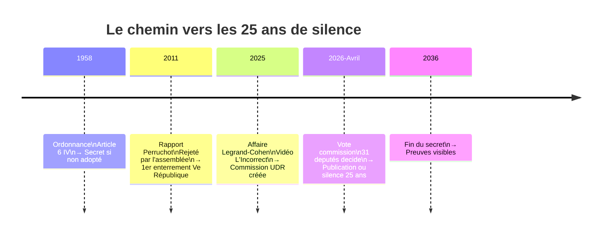
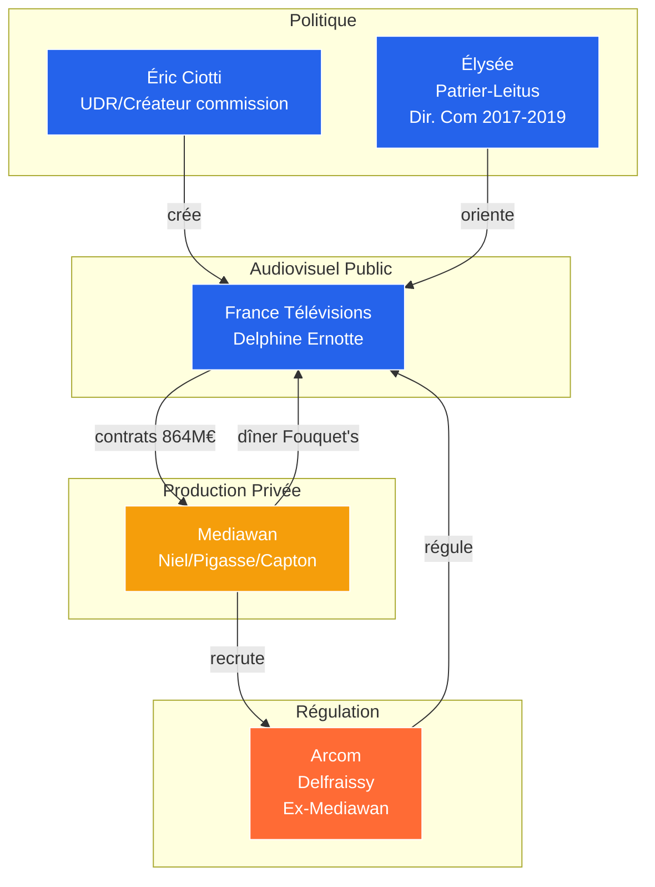
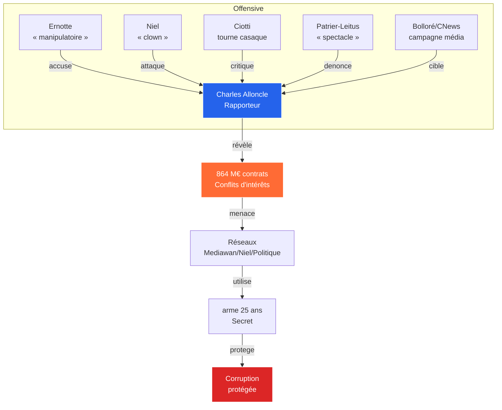
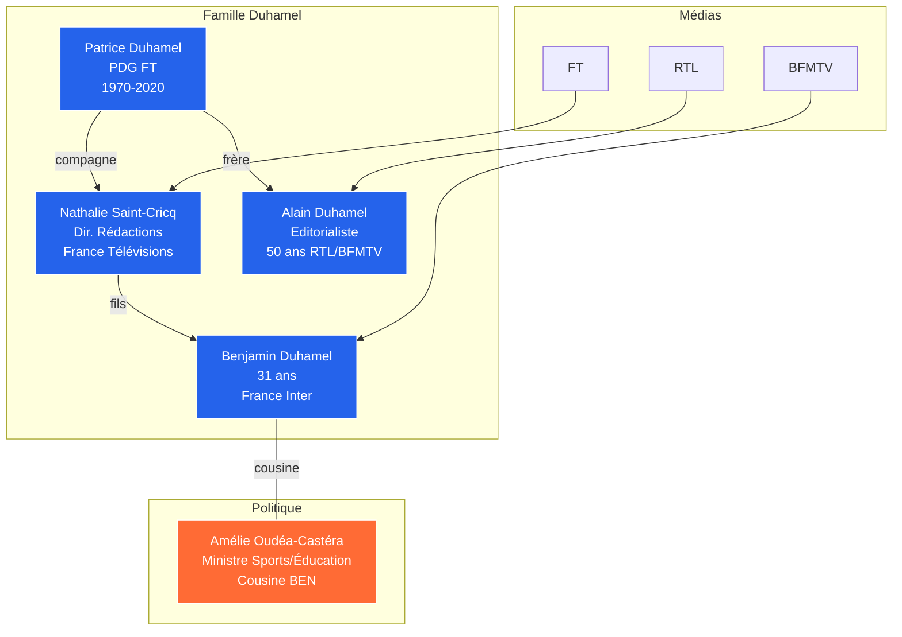
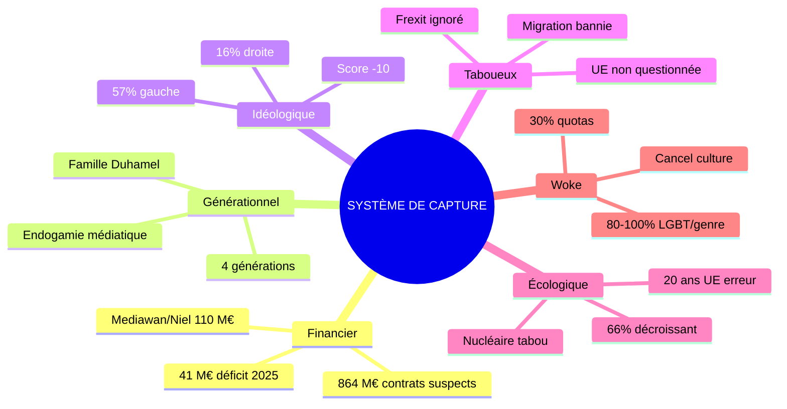

# 🗳️ La commission qui devait éclairer la France va peut-être être enterrée pour 25 ans

📺 Comment l'audiovisuel public français est devenu une machine à enrichir les réseaux privés, et pourquoi on fait tout pour faire disparaître les preuves.

---

## Le mécanisme qui enterre la vérité

En 2011, pour la première fois dans l'histoire de la Ve République, une commission d'enquête parlementaire a vu ses travaux enterrés. Le rapport Perruchot sur le financement des syndicats a été rejeté par l'assemblée. Conséquence : 25 ans de silence forcé. Les preuves collectées ne seront visibles qu'en 2036.

Ce mécanisme existe dans l'ordonnance du 17 novembre 1958 relative au fonctionnement des assemblées parlementaires. Son article 6 IV dispose que si les travaux ne sont pas adoptés à la majorité, ils restent secrets. Pendant un quart de siècle.

En avril 2026, cette même mécanique est sur le point de se reproduire. La commission d'enquête sur l'audiovisuel public doit être soumise au vote le 27 avril. 31 deputés vont décider si les Français peuvent accéder aux 26 000 documents collectés pendant six mois d'auditions, ou si tout disparaît dans les tiroirs de l'assemblée pendant une génération.

**La question n'est pas juridique. Elle est politique. Et elle révèle tout un système.**

---

## L'audiovisuel public : qu'est-ce que c'est ?

L'audiovisuel public français regroupe cinq entités : France Télévisions (France 2, France 3, France 4, France 5, France Ô), Radio France (France Inter, France Info, France Bleu, FIP, France Musique), France Médias Monde (France 24, RFI, Monte Carlo Doualiya), l'INA (Institut national de l'audiovisuel), et Arte France. Ces cinq structures employent environ 30 000 personnes et reçoivent chaque année environ 4 milliards d'euros de fonds publics.

La mission du service public est définie par la loi : informer, éduquer, divertir, proposer des contenus culturels diversifiés, garantir le pluralisme, et assurer la cohésion nationale. En contrepartie de ce financement public, l'État exige une couverture territoriale égale, des programmes pour tous les publics, et une indépendance éditoriale vis-à-vis des pressions politiques et commerciales.

Les reproches formulés contre l'audiovisuel public sont anciens et récurrents. La droite l'accuse de partialité politique en faveur de la gauche. La gauche reproche parfois un alignement sur les logiques commerciales. Les critiques économiques pointent un coût jugé excessif pour des audiences en baisse. Les tenants du marché libre appellent à la privatisation ou à une réduction drastique des moyens.

Ces critiques sont instrumentisées depuis des années par ceux qui veulent démanteler le service public. La vidéo publiée par L'Incorrect en septembre 2025 (affaire Legrand-Cohen) n'était qu'un prétexte de plus pour remettre en cause le financement public.

Mais au-delà des critiques superficielles, la vraie question est celle de l'utilisation de l'argent public. Et c'est là que les révélations de la commission deviennent accablantes.

---

## La commission qui dérange

Le 28 octobre 2025, le groupe Union des droites pour la République (UDR), dirigé par Éric Ciotti et allié au Rassemblement national, utilise son « droit de tirage » pour créer une commission d'enquête sur la neutralité, le fonctionnement et le financement de l'audiovisuel public.

Le déclencheur : quelques semaines plus tôt, le magazine L'Incorrect a publié une vidéo montrant Thomas Legrand et Patrick Cohen, journalistes de Radio France, lors d'une réunion avec des responsables socialistes. L'« affaire Legrand-Cohen » déclenche une campagne politique. La droite accuse le service public de partialité.

La commission est légitime dans son principe : vérifier l'utilisation de l'argent public, contrôler les conflits d'intérêts, examiner les processus de décision. Mais sa composition et son orientation posent questions. Le rapporteur est Charles Alloncle, deputé UDR de l'Hérault, proche de Ciotti. Le président est Jérémie Patrier-Leitus, du groupe Horizons.

Pendant six mois, 67 auditions se tiennent. 234 personnes sont entendues. Des dirigeants de France Télévisions, Radio France, des producteurs, des journalistes, des politiques. Tout est filmé, tout est public.

**Et les révélations sont accablantes.**

---

## Les 864 millions qui disparaissent

Le fait central, documenté par Charles Alloncle : en 2024, France Télévisions a signé des contrats avec des producteurs pour 864 millions d'euros. Le montant légalement obligatoire au titre du quota de production indépendante est d'environ 300 millions d'euros.

**Soit près de trois fois plus.**

Le rapporteur parle de « copinage pur et simple » dans l'attribution des contrats. « Aucune règle, aucun respect des marchés publics », accuse-t-il.

Les chiffres officiels confirment la dérive. France Télévisions a enregistré un déficit de 41,2 millions d'euros en 2025. C'est le premier déficit depuis 9 ans. La dette cumulée entre 2017 et 2024 atteint 81 millions d'euros.

L'argent public circule. Mais vers où ?

Le principal fournisseur de programmes de France Télévisions s'appelle Mediawan. Le groupe a été fondé par Xavier Niel (fondateur d'Iliad/Free) et Matthieu Pigasse (directeur général de Lazard, proche du PS). En 2024, Mediawan a capté 110 millions d'euros de contrats avec France Télévisions. Cela représente 25 % du chiffre d'affaires français du groupe.

---

## Les réseaux de la capture

Les liens suspects ne s'arrêtent pas aux producteurs.

Delphine Ernotte, PDG de France Télévisions, a été conviée au Fouquet's par Mediawan AVANT la officialisation de son renouvellement de contrat. La coincidence est troublante. Plus tard, elle a recruté Virginie Lafleur comme directrice de la communication des programmes. Virginie Lafleur venait de chez Mediawan.

Autre coincidence troublante : en avril 2025, Pierre-Antoine Capton, président de Mediawan, a organisé une fête privatisée chez Maxim's pour ses 50 ans. Delphine Ernotte y était presente.

Plus ancien : Jean-François Delfraissy, actuel président d'Arcom (le régulateur audiovisuel), était chez Mediawan AVANT sa nomination au CSA (devenu Arcom). Le régulateur de l'audiovisuel venait de l'industrie qu'il doit contrôler.

**Les lignes se croisent. L'argent public alimente des réseaux qui connectent pouvoir politique, groupe privé, et régulation.**

---

## La guerre pour faire taire Alloncle

Les pressions ont commencé avant même le vote.

Jérémie Patrier-Leitus, président de la commission et ancien directeur de la communication de l'Élysée sous Emmanuel Macron (2017-2019), a accusé le rapporteur de faire de la « politique spectacle » et de viser « l'élection de Jordan Bardella en 2027 ». Sur RTL, il s'est dit « choqué et indigné » de voir Alloncle se comparer à Émile Zola.

Delphine Ernotte, auditionnée une seconde fois le 8 avril 2026, a qualifié les méthodes du rapporteur de « procédé très manipulatoire ». Elle a contesté la presentation de la dotation de l'État.

Xavier Niel a traité Alloncle de « clown ». Le milliardaire a menacé de quitter la commission. « Vous avez transformé votre commission en cirque : merci pour votre invitation, mais je ne suis pas un clown », a-t-il lancé au rapporteur.

Éric Ciotti lui-même, qui a créé la commission, s'est retourné contre Alloncle une fois les révélations connues. Le initiateur de la commission critique désormais son propre rapporteur.

Les médias du groupe Bolloré (CNews, Europe 1, Le JDD) mènent une campagne éditoriale contre la commission et contre Alloncle personnellement. France Télévisions a porté plainte pour « dénigrement ».

**Pourquoi cette offensive généralisée ?** Parce que les révélations touchent des intérêts réels. Mediawan, ses actionnaires, les réseaux qui gravitent autour de l'audiovisuel public. Le mécanisme de secret (25 ans) est l'arme idéale pour faire taire définitivement les preuves.

**Le vote du 27 avril 2026** décidera si les Français auront accès à ces révélations ou si elles disparaissent pour une génération.

---

## Les processus de capture

Le système fonctionne en cinq étapes.

**Étape 1** : L'argent public. Environ 4 milliards d'euros par an. L'État verse à France Télévisions et Radio France via la contribution à l'audiovisuel public, remplacée par une fraction de TVA depuis 2022.

**Étape 2** : Les contrats suspects. 864 millions d'euros de contrats aux producteurs privés, quasi-triple de l'obligation légale.

**Étape 3** : L'enrichissement privé. Mediawan et ses actionnaires bénéficient de ces flux. Nagui, animateur star de France 2, touche 1,5 million d'euros par an, chiffre confirmé par Alloncle.

**Étape 4** : Le déficit public. 41 millions d'euros de déficit en 2025. 81 millions de dette cumulée.

**Étape 5** : La socialisation des pertes. Le contribuable absorbe. Les profits sont privatisés.

Ce mécanisme n'est pas une aberration. **C'est un SYSTÈME**. Il a été documenté par la commission. Et maintenant, tout le monde veut le faire disparaître.

La réforme de Rachida Dati sur l'audiovisuel public a été rejeté par l'assemblée en juin 2025. La commission d'enquête est devenue le levier alternatif pour faire payer le service public. Mais le vrai scandale n'est pas la gestion : c'est la structure même du système.

Les enquêtes judiciaires en cours confirment la décomposition. En février 2026, une information judiciaire a été ouverte contre Delphine Ernotte pour « détournement de biens publics ». En octobre 2025, quatre techniciens de Mediawan ont porté plainte pour « travail dissimulé ». En février 2026, l'inspection du travail a mis en garde Mediawan pour « doubles contrats » illégaux.

**Le processus fonctionne : l'argent public circule vers les réseaux privés, les pertes sont socialisées, les profits sont privatisés, et quand la vérité menace d'éclater, on l'enterre.**

---

## Les castes médiatiques

Au-delà de l'argent, il y a les hommes. Et dans l'audiovisuel public français, certains noms se transmettent de génération en génération.

La famille Duhamel incarne cette endogamie médiatique. Patrice Duhamel a dirigé France Télévisions jusqu'en 2020. Sa compagne, Nathalie Saint-Cricq, dirige aujourd'hui les rédactions nationales de France Télévisions. Leur fils, Benjamin Duhamel, 31 ans, a quitté BFMTV en 2025 pour rejoindre la matinale de France Inter. L'oncle de Benjamin, Alain Duhamel, est editorialiste depuis plus de 50 ans sur RTL et BFMTV.

**Quatre générations. Le même métier. Les mêmes chaînes. Les mêmes fonctions de direction.**

Ce phénomène n'est pas isolé. Via les alliances familiales, la sphère médiatique touche aussi le pouvoir politique. Amélie Oudéa-Castéra, ancienne ministre des Sports et de l'Éducation nationale, est cousine de Benjamin Duhamel. L'ancienne ministre a été nommée au gouvernement malgré les affaires Korian-Ehpad, ce qui illustre la porosité entre médias, politique et économique.

Charles Alloncle a lui-même qualifié ce système de « castes et de privileges ». Les écoles de journalisme, analysées par le journaliste Xavier Eman dans son ouvrage Formatage continu, reproduisent cette endogamie sociale et idéologique. Les mêmes profils, formés dans les mêmes écoles, partageant les mêmes valeurs, finissent par constituer un entre-soi qui se prend pour l'universel.

**Le service public, censé refléter la diversité des Français, est en réalité géré par une elite qui se reproduit elle-même.**

---

## Le biais idéologique

L'argent n'explique pas tout. Le contenu aussi pose question.

En février 2026, l'Institut Thomas More a publié une étude réalisée avec l'intelligence artificielle, analysant plus de 2 000 heures de programmes de France Télévisions et Radio France sur trois mois. Les résultats sont sans appel : sur une échelle de -100 (extrême gauche) à +100 (extrême droite), le service public obtient un score de -10, soit un ancrage au centre-gauche.

France Inter enregistre un score de -20,1. France Culture, le plus prononcé, atteint -28,9. Seule France Info reste proche de la neutralité avec -1,2.

L'analyse montre que 57 % des émissions présentent une orientation clairement à gauche, contre seulement 16 % à droite. Le magazine Complément d'enquête sur France 2 compte 38 % de ses editions categorisées comme « socialistes et progressistes ». L'émission C Politique sur France 5 est également orientée à gauche.

Le régulateur, l'Arcom, avait déjà noté en 2023 une sous-représentation du Rassemblement national et de La France insoumise sur les antennes du service public. Les partis radicaux, à gauche comme à droite, reçoivent le traitement le plus hostile.

La presidente de France Télévisions, Delphine Ernotte, a d'ailleurs reconnu elle-même ce problème lors d'une interview au Point en 2023 : « On ne représente pas la France telle qu'elle est. On essaie de représenter la France telle qu'on voudrait qu'elle soit. »

La plateforme France TV Slash, destinée aux jeunes, presente 56 % de ses programmes qualifiés de « progressistes », un taux qui ne reflète pas la diversité de la population française.

**Ces chiffres ne proviennent pas d'un opposant politique.** Ils sont issus d'une analyse algorithmique systématique de milliers d'heures de programmes. Le biais n'est pas nécessairement intentionnel : il reflète la composition sociologique des rédactions et leur formation dans les mêmes écoles. Mais le résultat est le même : une partie significative des Français ne se reconnaît pas dans le miroir que leur tend le service public.

---

## Les tabous : l'UE et le Frexit

L'argent et le biais idéologique ne suffisent pas à expliquer la crise de l'audiovisuel public. Il y a aussi ce qu'on ne peut pas y dire.

Le service public audiovisuel français ne couvre pratiquement jamais les arguments en faveur du Frexit. La petition lancé par Philippe de Villiers pour un referendum sur la sortie de l'Union européenne a été complètement ignorée par France Télévisions. Ce silence n'est pas anodin : il releve d'une position idéologique assumée, pas d'un choix éditorial.

Raphael Enthoven, intellectuel médiatisé frequent sur France Inter, a souhaité le malheur économique du Royaume-Uni après le Brexit : « Pourvu que ça leur coûte cher... Pourvu que le pays s'appauvrisse... ». Ce souhait de malheur pour un peuple ayant vote differently illustre l'état d'esprit : la démocratie ne se décrète pas, elle se décrète pour ceux qui votent « correctement ».

**Plus généralement, il existe une interdiction de critiquer les politiques migratoires européennes sur les antennes du service public.** Les débats sur l'immigration sont cadrés d'une manière précise, avec des angles qui ne permettent pas l'expression de positions différentes de la ligne officielle.

---

## L'écologie comme dogme

Les tabous ne s'arretent pas à l'Europe. L'écologie est devenue un sujet où le dissentiment est impossible.

L'étude de l'Institut Thomas More montre que 66 % des émissions traitent les questions environnementales avec des theses explicitement décroissantes. Les enjeux climatiques sont présentés comme une urgence absolue, sans nuance, sans débat possible. Les questions de compétitivité ou d'énergie nucleaire sont absentes des analyses ou traitées comme des hérésies.

Autre chiffre révélateur : sur les sujets comme le féminisme, la justice ou les discriminations, 80 à 100 % des émissions sont traitées avec un angle strictement gauche. Le changement climatique, la justice sociale, les droits humains sont aborde selon un cadre idéologique unique.

L'Argus, le régulateur, a d'ailleurs recadré France Inter en mai 2024 sur le traitement du conflit israelo-palestinien, exigeant une plus grande « rigueur ». Mais cette exigence ne s'applique jamais aux sujets climatiques ou migratoires : là aussi, le consensus est obligatoire.

L'aveu d'Ursula von der Leyen en mars 2026 est édifiant : la presidente de la Commission européenne a reconnu que la politique anti-nucléaire menée pendant 20 ans par l'UE était une « erreur stratégique majeure ». Bruxelles a tout fait pour mettre des bâtons dans les roues de la France nucleaire, défendant les centrales à gaz au nom des énergies renouvelables. Résultat : en 35 ans, la part du nucleaire dans la production électrique européenne est passée de 33 % à 15 %.

**Et pourtant, les antennes du service public n'ont jamais questionné ce dogme pro-nucléaire européen.** Elles ont diffuse sans relâche les thèses anti-atomiques venues d'Allemagne, pays qui aujourd'hui construit des centrales à gaz et dépend du charbon.

La France bloque actuellement les targets climatiques européennes pour 2035 et 2040. Ce blocage n'est jamais présenté comme une bonne nouvelle : c'est la preuve d'une « régression », d'un « manquement ». Mais le Green Deal européen est en train d'être rogné par une « vague de dérégulation environnementale » documentée par le Réseau Action Climat. Les textes s'enchaînent pour amoindrir les avancées du Pacte vert, sous les yeux des industriels qui sentent le vent tourner.

**Le service public ne couvre pas cette contradiction : il ne peut pas presenter la position française comme une libération de la contrainte Bruxelles, ni questionner le dogme décroissant.**

---

## Le wokisme et la cancel culture

Les tabous ne s'arretent pas à l'écologie. Le service public a aussi adopté sans réserve les thèmes du wokisme, de la cancel culture et de l'idéologie LGBT.

L'étude de l'Institut Thomas More montre que 80 à 100 % des émissions traitent les sujets concernant le wokisme, le LGBT, le féminisme et les questions de genre avec un angle exclusivement gauche. **Ce n'est plus du journalisme : c'est de l'activisme.**

Delphine Ernotte a imposé un quota de 30% de réalisatrices pour les séries produites par France Télévisions depuis 2019. Ce quota, présenté comme un progres, est en réalité une politique explicitement orientée qui ne repose pas la qualité mais l'idéologie. Les productions sont évaluées non plus sur leur valeur artistique mais sur leur conformité au cahier des charges de la diversité.

Ali Baddou, journaliste très présent sur France Inter, a plusieurs fois défendu le wokisme et attaque ceux qui le critiquent. Lors d'une emission avec l'historienne Laure Murat, il a présenté les théories du genre et le racialisme comme des disciplines legitimes, tout en qualifiant de « cancel culture » les mesures de Trump contre ces mêmes theories. Legèreté à double vitesse.

Le festival de Cannes, largement couvert par le service public, est devenu un temple du wokisme. Les films sont évalués selon leur conformité aux dogmes progressistes. Juliette Binoche peut déclarer sans être contredite que le cinéma doit être « woke » ou servir des causes. La critique est impossible sur les antennes.

**Horizon Europe**, le programme de recherche européen financé par les contribuables français, finance des projets ouvertement militants : 2,5 millions pour « décoloniser la charia », 1,4 million pour analyser « l'oligarchie blanche dans les paradis fiscaux », 3 millions pour « débunker les arguments de genre d'extrème-droite », 257 000 euros pour l'historiographie LGBT de l'Antiquité. Ces projets delirants sont présentés comme de la recherche serieuse sur les antennes du service public.

L'universite française impose depuis 2021 des formations obligatoires sur le racisme, les mouvements LGBT+, le handicap, les violences sexistes et sexuelles, les orientations sexuelles et l'identité de genre. Ce kit de prévention des discriminations, rédigé en écriture inclusive, est présenté comme normal. Les voix critiques sont reduites au silence.

La cancel culture est pratiquée par les progressistes : censure de la Sorbonne sur le colonialisme, annulation de conférences, vetos sur les invités qui ne partagent pas les dogmes officiels. Le service public ne couvre jamais ces exces : il les normalise.

**Le wokisme et l'écologisme sont les deux grandes maladies totalitaires de cette époque.** Le service public les a adoptes sans discussion.

---

## VERDICT

**L'audiovisuel public français est gangréné par un système de capture organisé.** Ce n'est pas une accusation politique : ce sont des chiffres, des dates, des noms. 864 millions d'euros de contrats suspects, des conflits d'intérêts documentés (Ernotte au Fouquet's, Delfraissy chez Mediawan avant Arcom), un enrichissement privé sur fonds publics (Nagui 1,5 million d'euros), des enquêtes judiciaires en cours.

À ce système financier s'ajoute un système de castes. La famille Duhamel, quatre générations aux commandes du service public, incarne cette endogamie qui ferme la porte aux outsiders. Les écoles de journalisme, analysées par Xavier Eman, formatent une elite qui se prend pour l'universel.

À cela s'ajoute un biais idéologique documenté. L'étude de l'Institut Thomas More, analysant 2000 heures de programmes avec l'intelligence artificielle, confirme ce que beaucoup percevaient : le service public penche à gauche. Score -10, 57 % des émissions orientées à gauche, sous-représentation du RN et de LFI. Delphine Ernotte elle-même a reconnu : « On ne représente pas la France telle qu'elle est. »

À cela s'ajoutent les tabous. Le Frexit n'est jamais couvert. Les pétitions populaires pour un referendum sur l'Europe sont ignorées. Les critiques contre les politiques migratoires européennes sont bannies. L'écologie est devenue un dogme : 66 % des emissions traitent les enjeux climatiques avec des thèses décroissantes. La critique du nucleaire, longtemps imposée par l'Europe, n'est jamais questionnée. Ursula von der Leyen a reconnu l'erreur anti-nucléaire de 20 ans, mais les antennes n'ont jamais présenté cette position comme une libération.

**Ces six dimensions : financière, générationnelle, idéologique, taboueuse, écologique, woke : forment un SYSTÈME.** L'argent public enrichit les réseaux privés. Le contenu reflète une vision du monde imposée par une elite auto-reproduite. Certains sujets sont entièrement interdiction de débat (UE, Frexit, migratoire, écologie). Et quand un rapporteur (Alloncle) lève le voile, tout le système se mobilise pour l'enterrer.

**Charles Alloncle a fait son travail. Il a exhumé les preuves.**

Maintenant, tout le système se mobilise pour l'enterrer. Le mécanisme de secret de l'ordonnance de 1958 est l'arme. Les pressions politiques et médiatiques sont le contexte. L'objectif est clair : faire disparaître les révélations pour 25 ans.

**La question du 27 avril 2026 n'est pas technique. Elle est democratique. Elle détermine si la corruption reste protégée ou si elle est exposée.**

Si le rapport est rejeté, les 26 000 documents disparaissent. Les preuves sont invisibilisées. Le système a gagne.

**La France aura financé une enquête dont elle ne verra jamais les résultats.**

---

## SOURCES

### Institutionnels
- Assemblée nationale: Commission audiovisuel public: https://www.assemblee-nationale.fr/dyn/17/organes/autres-commissions/commissions-enquete/ce-audiovisuel-public
- Legifrance: Ordonnance 58-1100 article 6: https://www.legifrance.gouv.fr/loda/article_lc/LEGIARTI000035391366/
- Cour des comptes: Rapport France Télévisions 2025: https://www.ccomptes.fr/sites/default/files/2025-09/20250923-S2025-1126-1-France-Televisions.pdf
- Arcom: https://www.arcom.fr/

### Médias principaux
- Le Monde: Audition Niel/Pigasse: https://www.lemonde.fr/economie/article/2026/04/02/cirque-demarche-politique-l-audition-electrique-de-xavier-niel-et-matthieu-pigasse-devant-la-commission-d-enquete-sur-l-audiovisuel-public_6676190_3234.html
- Le Figaro: Déficit 41M€: https://www.lefigaro.fr/medias/france-televisions-presente-un-budget-en-deficit-pour-la-premiere-fois-depuis-neuf-ans-20241218
- France Info: Plaintes CNews/Europe1/Le JDD: https://www.franceinfo.fr/economie/medias/france-televisions/radio-france-et-france-televisions-portent-plainte-contre-cnews-europe-1-et-le-jdd_7624808.html
- RTL: Ernotte/Alloncle: https://www.rtl.fr/culture/medias-people/commission-d-enquete-sur-l-audiovisuel-public-ernotte-niel-dati-nagui-bollore-pujadas-quatre-mois-d-auditions-electriques-a-l-assemblee-7900621515

### Analyse
- Charlie Hebdo: Sainte-Alliance: https://charliehebdo.fr/2025/12/politique/bollore-cnews-rn-ciotti-la-sainte-alliance-contre-laudiovisuel-public/
- Epoch Times: Alloncle alerte: https://www.epochtimes.fr/audiovisuel-public-charles-alloncle-alerte-sur-un-risque-de-non-publication-du-rapport-3230113.html
- Entrevue: Ernotte/Fouquet's: https://entrevue.fr/en/television/conflit-dinterets-a-france-televisions-mediawan-aurait-invite-delphine-ernotte-au-fouquets-pour-celebrer-sa-reconduction-avant-meme-que-ce-soit-officiel/
- Le Media en 442: Delfraissy/Mediawan: https://lemediaen442.fr/conflit-dinterets-le-president-de-la-commission-sur-laudiovisuel-public-etouffe-une-question-sur-mediawan/

### Presse spécialisée
- NextPlz: Contrats 850M€: https://www.nextplz.fr/tele/536891-france-televisions-face-aux-deputes-850-millions-deuros-de-contrats
- 20 Minutes: Nagui: https://www.20minutes.fr/societe/4192984-20251224-nagui-enrichi-plus-personne-argent-public
- LCP: Auditions: https://lcp.fr/programmes/la-seime-est-ouverte/commission-d-enquete-sur-l-audiovisuel-public-audition-de-lea

### Castes et endogamie
- Le Parisien: Le casse-tête de la famille Duhamel sur les plateaux télé: https://www.leparisien.fr/culture-loisirs/tv/pourquoi-lun-seffacerait-pour-les-autres-le-casse-tete-de-la-famille-duhamel-sur-les-plateaux-tele-21-03-2026-D7CSTOQPQRHRZMW6VQDPIZBQA4.php
- Parents.fr: Benjamin Duhamel: la nouvelle voix de France Inter a des parents bien connus: https://www.parents.fr/actualites/etre-parent/benjamin-duhamel-la-nouvelle-voix-de-france-inter-a-des-parents-et-un-oncle-bien-connus-1139277
- Paris Match: Il n'y a pas de dynastie Duhamel: https://paiement.parismatch.com/People/il-ny-a-pas-de-dynastie-duhamel-alain-duhamel-sexplique-sur-sa-famille-dans-les-medias-263815
- Breizh Info: Formatage continu (Xavier Eman): https://www.breizh-info.com/2024/11/18/240392/formatage-continu-xavier-eman-sattaque-a-la-fabrique-et-au-regne-de-la-pensee-unique-dans-les-ecoles-de-journalisme-en-france-interview/

### Biais idéologique
- Institut Thomas More: L'audiovisuel public en déficit: https://institut-thomas-more.org/2026/02/19/rapport35/
- Valeurs actuelles: Un pluralisme de façade: https://www.valeursactuelles.com/societe/un-pluralisme-de-facade-une-etude-realisee-avec-lia-montre-que-lantenne-de-france-televisions-penche-a-gauche
- Le Figaro: Les matinales de Radio France penchent à gauche: https://www.lefigaro.fr/medias/les-matinales-de-radio-france-penchent-a-gauche-l-etude-qui-atteste-du-manque-de-pluralisme-a-l-antenne-20251128
- The Conversation: France Inter et France Télévisions sont-ils de gauche ?: https://www.theconversation.com/france-inter-et-france-televisions-sont-ils-de-gauche-comme-les-en-accusent-cnews-et-les-medias-bollore-265689

### Tabous (Frexit, UE, migratoire)
- Le JDD: Pourquoi l'audiovisuel public n'accorde pas une seule ligne à la petition de Philippe de Villiers: https://www.lejdd.fr/medias/pourquoi-laudiovisuel-public-naccorde-pas-une-secule-ligne-a-la-petition-lancee-par-philippe-de-villiers-pour-un-referendum-161879
- AgoraVox: Raphael Enthoven souhaite malheur aux Anglais, coupables du Brexit: https://www.agoravox.fr/actualites/europe/article/raphael-enthoven-souhaite-malheur-aux-anglais-coupables-du-brexit-218822

### Ecologie et dogmes
- France Inter: Nucléaire, l'aveu de Bruxelles: https://radiofrance.fr/franceinter/podcasts/l-edito-eco/l-edito-eco-du-mercredi-11-mars-2026-2512002
- France Info: Conseil européen sur le climat: le Réseau action climat dénoncent une vague de deregulation environnementale: https://www.francetvinfo.fr/environnement/conseil-europeen-sur-le-climat-le-reseau-action-climat-denonce-une-vague-de-deregulation-environnementale-ces-derniers-mois_7570219.html
- France Inter: Pourquoi ces retours en arrière sur l'écologie ?: https://radiofrance.fr/franceinter/podcasts/le-monde-a-18h50/le-monde-a-18h50-du-mardi-01-juillet-2025-6632000

### Wokisme et Cancel Culture
- Causeur: Les ravages du wokisme, d'Ali Baddou au festival de Cannes: https://www.causeur.fr/?p=310189
- Le Figaro: Les matinales de Radio France penchent à gauche: https://www.lefigaro.fr/medias/les-matinales-de-radio-france-penchent-a-gauche-l-etude-qui-atteste-du-manque-de-pluralisme-a-l-antenne-20251128
- Institut Français de Psychanalyse: Wokisme et cancel culture: une déraison mortifère: https://institutfrancaisdepsychanalyse.com/wokisme-et-cancel-culture-une-deraison-mortifere-ii/
- Frontières: Horizon Europe finance des projets militants: https://www.frontieres.media/horizon-europe-projets-militants