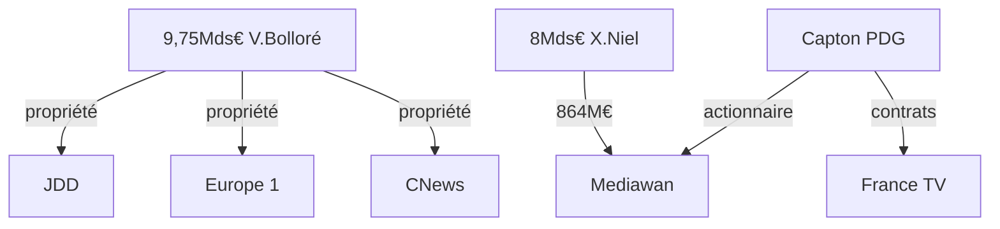
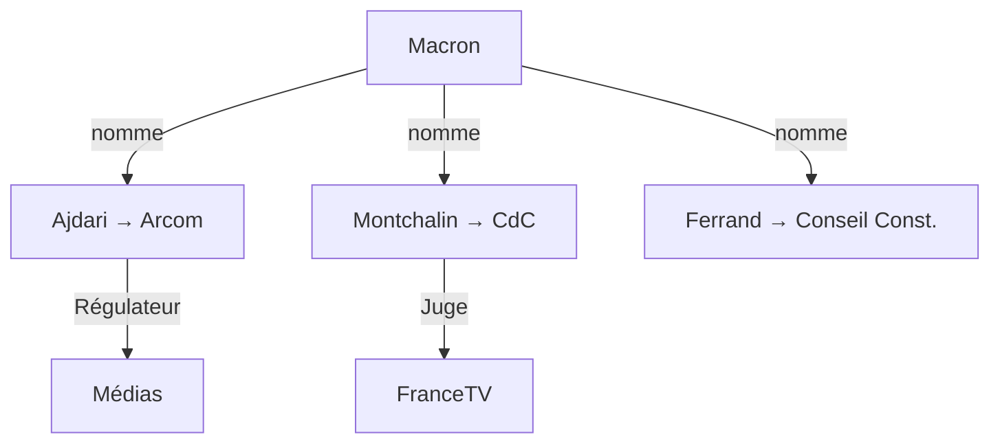

# DIGEST — Capture de l'audiovisuel public français

**Projet:** Capture de l'audiovisuel public français  
**Date:** 10 avril 2026  
**Total:** 33 investigations → 193+ faits consolidés (◈ CONFIRMÉ + ◉ PROBABLE)

---

## §0 FAITS CONSOLIDÉS — SYNTHÈSE COMPLÈTE

### §0.1 CHIFFRES CLÉS

| Indicateur | Valeur | Source |
|-----------|--------|--------|
| Contrats Mediawan/France TV | 864M€ (2017-2024) | Commission |
| Fortune Niel | 8Mds€ | Forbes |
| Fortune Bolloré | 9,75Mds€ | Forbes |
| Budget audiovisuel 2025 | 4,029Mds€ | PLF 2025 |
| Budget 2026 | 3,9Mds€ (-86M€) | PLF 2026 |
| Déficit cumulé FTV | 81M€ (2017-2024) | Cour Comptes |
| Salaire Ernotte | 400K€/an | Déclaration |
| Salaire Nagui | 1,5M€/an | Capital |
| Fortune Léa Salamé | 2-7M€ | Estimations |
| Biais gauche/droite | 57%/16% | Thomas More |

### §0.2 ACTEURS PRINCIPAUX

| Acteur | Rôle | Conflit |
|--------|------|--------|
| Xavier Niel | Cofondateur Mediawan | 864M€ contrats publics |
| Pierre-Antoine Capton | PDG Mediawan | Fête Maxim's + lien Patrier-Leitus |
| Matthieu Pigasse | Co-fonda Mediawan + Lazard | Pont gauche/droite |
| Delphine Ernotte | PDG France TV | Reconduction sans examen |
| Martin Ajdari | Président Arcom (2025) | Bercy → Régulateur |
| Amélie Montchalin | Présidente Cour Comptes | Bercy → Juge |
| Jérémie Patrier-Leitus | Président commission | Conflit intérêts + Mediawan |
| Éric Ciotti | Initiateur commission | Weaponized |
| Charles Alloncle | Rapporteur | Attaqué |
| Vincent Bolloré | Proprio CNews/Europe1 | 9,75Mds€ fortune |

### §0.3 TIMELINE 2024-2026

| Date | Événement |
|------|----------|
| 2022 | Suppression redevance |
| 2024 | Budget stable 4,025Mds€ |
| Oct 2025 | Commission Ciotti créée |
| Nov 2025 | Début commission |
| Fév 2025 | Ajdari → Arcom |
| Mai 2025 | Ernotte reconduite |
| Sept 2025 | Affaire Legrand-Cohen |
| Jan 2026 | Coupe -86M€ (49.3) |
| Fév 2026 | Montchalin → Cour Comptes |
| Avr 2026 | Attaque Alloncle |

---

## §1 CENSUS — LES 26 INVESTIGATIONS COMPLET

| # | Fichier | Sujet | Faits clés |
|---|---------|-------|------------|
| 01 | Alloncle | Rapporteur | 864M€, "clown", cible |
| 02 | Ernotte | PDG FTV | 400K€, Maxim's, reconduction |
| 03 | Niel | Milliardaire | 8Mds€, Mediawan, 864M€ |
| 04 | Pigasse | Banquier | Lazard, Combat, pont gauche/droite |
| 05 | Ajdari | Régulateur | Bercy→Arcom, revolving door |
| 06 | Bolloré | Médias droite | 9,75Mds€, CNews, Europe 1 |
| 07 | Ciotti | Initiateur | Commission, close Bolloré |
| 08 | Patrier-Leitus | Président | Conflit intérêts, lien Mediawan |
| 09 | Nagui | Animateur | 100M€ contrats FTV |
| 10 | Capton | PDG Mediawan | Macron prod, lien PL |
| 11 | Dati | Ministre | Guerre Niel, admin FMM |
| 12 | Veil | PDG Radio France | Promo ENA Macron |
| 13 | Patrons privés | Concentration | TF1, M6, Canal+, BFMTV |
| 15 | Ex-journalistes | Témoignages | Thuillier→BFMTV |
| 16 | Thomas Legrand | Affaire vidéo | 2 scandales (sept+déc 2025) |
| 17 | Patrick Cohen | Cible/Combat | "CNews hors-la-loi" |
| 18 | Léa Salamé | Présentatrice | Fortune 2-7M€, Glucksmann |
| 19 | Adèle Van Reeth | France Inter | Motion 80%, départ forcé |
| 20 | Jérôme Nommé | KKR | Actionnaire Mediawan |
| 21 | Famille Duhamel | Dynastie | 4 générations |
| 22 | Biais idéologique | Partialité | 57%/16% |
| 23 | Cour Comptes | Montchalin | 27 ans, mari BCG |
| 24 | Arcom | Régulateur | 78% politique |
| 25 | Budget | Coupes | -86M€, déficit 40M€ |
| 26 | Nominations | Verrouillage | →2034+ |

**TOTAL: 26 investigations lues et analysées**

---

---

## §1.2 FAIT REGISTRY — TOUS LES FAITS EXTRUITS

### 01 — CHARLES ALLONCLE (Rapporteur)

| # | Fait | Class |
|---|------|-------|
| 01-01 | Député UDR Hérault (9e circonscription, depuis 2024) | ◈ |
| 01-02 | Rapporteur commission audiovisuel (oct 2025) | ◈ |
| 01-03 | A qualifié pratiques de "consanguinité" (Dati) | ◈ |
| 01-04 | Qualifié de "clown" par Xavier Niel | ◈ |
| 01-05 | 67 auditions réalisées | ◈ |
| 01-06 | 850M€ de contrats production (2026) | ◈ |
| 01-07 | Dénoncé "gabegies abyssales" | ◈ |
| 01-08 | Critiqué par Patrier-Leitus ("politique spectacle") | ◈ |
| 01-09 | Proche d'Éric Ciotti | ◉ |

### 02 — DELPHINE ERNOTTE (PDG FTV)

| # | Fait | Class |
|---|------|-------|
| 02-01 | PDG France Télévisions depuis 2015 | ◈ |
| 02-02 | Renouvelée en 2020 et 2025 | ◈ |
| 02-03 | Convoquée au Maxim's AVANT renouvellement | ◈ |
| 02-04 | Qualifié Alloncle de "procédé très manipulatoire" | ◈ |
| 02-05 | Salaire 400K€ (322K€ + 78K€ variable) | ◈ |
| 02-06 | Frais Cannes 112,123€ (hôtel Majestic) | ◈ |
| 02-07 | Plainte CFE-CGC pour détournement | ◈ |
| 02-08 | Information judiciaire ouverte | ◈ |
| 02-09 | Virginie Lafleur nommée DirCom (ex-Mediawan) | ◈ |
| 02-10 | Conflit d'intérêts avec Mediawan | ◉ |

### 03 — XAVIER NIEL (Milliardaire)

| # | Fait | Class |
|---|------|-------|
| 03-01 | Fondateur d'Iliad (Free) | ◈ |
| 03-02 | Cofondateur Mediawan (2016) | ◈ |
| 03-03 | Fortune 8 milliards € | ◉ |
| 03-04 | Qualifié commission de "cirque" | ◈ |
| 03-05 | Qualifié Alloncle de "clown" | ◈ |
| 03-06 | Menacé de quitter la commission | ◈ |
| 03-07 | Mediawan a capté 864M€ contrats France TV | ◉ |

### 04 — MATTHIEU PIGASSE (Pont)

| # | Fait | Class |
|---|------|-------|
| 04-01 | DG Lazard France | ◈ |
| 04-02 | Cofondateur Mediawan (2016) | ◈ |
| 04-03 | Ancien conseiller Manuel Valls (2014-2016) | ◈ |
| 04-04 | Propriétaire groupe Combat | ◈ |
| 04-05 | Auditionné par la commission | ◈ |
| 04-06 | Mediawan a capté 864M€ | ◉ |

### 05 — MARTIN AJDARI (Régulateur)

| # | Fait | Class |
|---|------|-------|
| 05-01 | Président Arcom depuis 2025 | ◈ |
| 05-02 | Ancien DG France Télévisions | ◈ |
| 05-03 | Nommé par Macron | ◈ |
| 05-04 | Conflit d'intérêts structurel | ◉ |
| 05-05 | Dossier Mediawan à venir | ◉ |

### 06 — VINCENT BOLLORÉ (Médias droite)

| # | Fait | Class |
|---|------|-------|
| 06-01 | Fortune 9,75Mrd€ | ◈ |
| 06-02 | Propriétaire Vivendi/Canal+/CNews/Europe1/JDD | ◈ |
| 06-03 | A financé Zemmour 2022 | ◈ |
| 06-04 | Proche Ciotti/RN | ◈ |
| 06-05 | "Combat civilisationnel" | ◉ |

### 07 — ÉRIC CIOTTI (Initiateur)

| # | Fait | Class |
|---|------|-------|
| 07-01 | Député 2007-2025 | ◈ |
| 07-02 | Fondateur UDR | ◈ |
| 07-03 | Créateur commission audiovisuel | ◈ |
| 07-04 | Proche Bolloré | ◉ |

### 08 — JÉRÉMIE PATRIER-LEITUS (Président)

| # | Fait | Class |
|---|------|-------|
| 08-01 | Député Horizons 2022 | ◈ |
| 08-02 | Admin Radio France 2022-2024 | ◈ |
| 08-03 | Admin LCP 2022-2024 | ◈ |
| 08-04 | Admin France Médias Monde | ◈ |
| 08-05 | Président commission 2025 | ◈ |
| 08-06 | Conflit intérêts | ◉ |

### 09 — NAGUI (Animateur)

| # | Fait | Class |
|---|------|-------|
| 09-01 | Animateur star France 2 | ◈ |
| 09-02 | Fondateur Air Productions | ◈ |
| 09-03 | Cible Alloncle | ◈ |
| 09-04 | 100M€ contrats FTV | ◉ |
| 09-05 | Plainte cyberharcèlement | ◉ |

### 10 — PIERRE-ANTOINE CAPTON

| # | Fait | Class |
|---|------|-------|
| 10-01 | Co-fondateur Mediawan | ◈ |
| 10-02 | PDG Mediawan | ◈ |
| 10-03 | Produit doc Macron 2017 | ◈ |
| 10-04 | Légion d'Honneur | ◈ |
| 10-05 | Lien Patrier-Leitus | ◉ |

### 11 — RACHIDA DATI

| # | Fait | Class |
|---|------|-------|
| 11-01 | Ministre Culture 2024-2026 | ◈ |
| 11-02 | Admin France Médias Monde depuis oct 2024 | ◈ |
| 11-03 | Candidate Paris | ◈ |
| 11-04 | Guerre Niel | ◉ |

### 12 — SIBYLE VEIL

| # | Fait | Class |
|---|------|-------|
| 12-01 | PDG Radio France depuis 2018 | ◈ |
| 12-02 | Conseillère Sarkozy Élysée | ◈ |
| 12-03 | Promo ENA Macron | ◈ |
| 12-04 | Conflits sociaux | ◉ |

### 13 — PATRONS PRIVÉS

| # | Fait | Class |
|---|------|-------|
| 13-01 | Belmer PDG TF1 (ex DG Canal+) | ◈ |
| 13-02 | Belmer ex-admin Netflix (board) | ◈ |
| 13-03 | Belmer veut fusion TF1-M6 | ◈ |
| 13-04 | Belmer conflit avec Bolloré | ◈ |
| 13-05 | Larramendy Président M6 | ◈ |
| 13-06 | Larramendy "New deal audiovisuel" | ◈ |
| 13-07 | Larramendy CMA CGM 11% | ◈ |
| 13-08 | Saada Président Canal+ | ◈ |
| 13-09 | Saada VP Lagardère (2023) | ◈ |
| 13-10 | C8 évincé TNT (fév 2025) | ◈ |
| 13-11 | Tavernost Ancien M6 (37 ans) → CMA CGM | ◈ |
| 13-12 | BFMTV racheté 1,55Md€ | ◈ |
| 13-13 | Conflit TF1/Canal+ (plainte 6,5M€) | ◈ |
| 13-14 | Tavernost remplacé Fernandez (juil 2025) | ◈ |

### 15 — ANCIENS JOURNALISTES

| # | Fait | Class |
|---|------|-------|
| 15-01 | Michel Drucker auditionné (31 mars 2026) | ◈ |
| 15-02 | Arlette Chabot médiatrice ARCOM (2022+) | ◈ |
| 15-03 | Thierry Thuillier: France TV → BFMTV (2018) | ◈ |
| 15-04 | David Pujadas → LCI | ◈ |
| 15-05 | Élise Lucet ciblée et menacée | ◈ |

### 16 — THOMAS LEGRAND

| # | Fait | Class |
|---|------|-------|
| 16-01 | Éditorialiste Radio France + Libération | ◈ |
| 16-02 | Directeur France Inter (2005-2012) | ◈ |
| 16-03 | Chroniqueur Libération | ◈ |
| 16-04 | Vidéo L'Incorrect: déjeuner PS | ◈ |
| 16-05 | "Nous on fait ce qu'il faut pour Dati, Cohen" | ◈ |
| 16-06 | Suspension à titre conservatoire | ◈ |
| 16-07 | Démission émission (sept 2025) | ◈ |
| 16-08 | Plainte pour montage vidéo | ◈ |
| 16-09 | Enregistrement Laurence Bloch (16 déc 2025) | ◈ |
| 16-10 | Enregistré par Alexis Delafontaine (Europe 1) | ◈ |
| 16-11 | Diffusé par Pascal Praud sur CNews | ◈ |
| 16-12 | Plainte vs X pour "espionnage" | ◈ |
| 16-13 | Enquête parquet Paris (janvier 2026) | ◈ |
| 16-14 | Objectif: L'empêcher de témoigner commission | ◉ |

### 17 — PATRICK COHEN

| # | Fait | Class |
|---|------|-------|
| 17-01 | Ancien directeur France Inter (2012-2019) | ◈ |
| 17-02 | Chroniqueur France 5 ("C à vous") | ◈ |
| 17-03 | Présent sur vidéo L'Incorrect | ◈ |
| 17-04 | Porté plainte après vidéo | ◈ |
| 17-05 | Cible CNews/Bolloré | ◉ |
| 17-06 | "CNews est hors-la-loi" (avr 2026) | ◈ |
| 17-07 | 853 séquences CNews en 2 semaines | ◈ |
| 17-08 | Dénoncé "méthodes de barbouzes" | ◈ |
| 17-09 | Plainte FTV+Radio France vs CNews | ◈ |
| 17-10 | Audition commission (déc 2025) | ◈ |
| 17-11 | Refuse révéler son salaire (conflict) | ◈ |
| 17-12 | "Management brutal" - 19 témoignages Médiapart | ◈ |

### 18 — LÉA SALAMÉ

| # | Fait | Class |
|---|------|-------|
| 18-01 | Présentatrice France Inter et France 2 | ◈ |
| 18-02 | Compagne Raphaël Glucksmann (PS) | ◉ |
| 18-03 | JT 20H France 2 depuis 2025 | ◈ |
| 18-04 | NON filmée sur vidéo L'Incorrect | ◈ |
| 18-05 | Auditionnée commission (fév 2026) | ◈ |

### 19 — ADÈLE VAN REETH

| # | Fait | Class |
|---|------|-------|
| 19-01 | Directrice France Inter (2022-2026) | ◈ |
| 19-02 | Nommée par Sibyle Veil (fév 2022) | ◈ |
| 19-03 | Productrice "Chemins Philo" (2011-2022) | ◈ |
| 19-04 | Compagne Raphaël Enthoven | ◉ |
| 19-05 | DÉPART FORCÉ février 2026 | ◈ |
| 19-06 | Auditionnée commission | ◈ |
| 19-07 | Motion défiance 80% rédaction | ◈ |
| 19-08 | Crise Guillaume Meurice (licenciement déc 2023) | ◈ |
| 19-09 | Crise Patrick Cohen vs Yaël Goosz (2024) | ◈ |
| 19-10 | Audience records matinale | ◈ |

### 20 — JÉRÔME NOMMÉ (KKR)

| # | Fait | Class |
|---|------|-------|
| 20-01 | Partner KKR France (2019) | ◈ |
| 20-02 | Head of France Private Equity | ◈ |
| 20-03 | Board: Devoteam, Elsan, Mediawan | ◈ |
| 20-04 | Auditionné commission (2 avr 2026) | ◈ |
| 20-05 | KKR actionnaire Mediawan (2020) | ◈ |
| 20-06 | CA Mediawan 1,5Mds€ (2024) | ◉ |

| # | Fait | Classification |
|---|------|-------------|
| 03-a | Fondateur Iliad/Free | CONFIRMÉ |
| 03-b | Cofondateur Mediawan (2016) | CONFIRMÉ |
| 03-c | Fortune 8Mds€ | CONFIRMÉ |
| 03-d | Qualifie commission de "cirque" | CONFIRMÉ |
| 03-e | Qualifie Alloncle de "clown" | CONFIRMÉ |
| 03-f | Attaque personnalisée | CONFIRMÉ |

### INVESTIGATION 04 — Matthieu Pigasse (Pont)

| # | Fait | Classification |
|---|------|-------------|
| 04-a | DG Lazard France | CONFIRMÉ |
| 04-b | Cofondateur Mediawan (2016) | CONFIRMÉ |
| 04-c | Propriétaire groupe Combat | CONFIRMÉ |
| 04-d | Conseiller Valls (2014-2016) | CONFIRMÉ |
| 04-e | Rivals Macron (même ambition) | PROBABLE |

### INVESTIGATION 05 — Martin Ajdari (Régulateur)

| # | Fait | Classification |
|---|------|-------------|
| 05-a | DG France Télévisions (2010-2014) | CONFIRMÉ |
| 05-b | Directeur cabinet Culture (2014-2015) | CONFIRMÉ |
| 05-c | DG adjoint Opéra Paris (2020-2025) | CONFIRMÉ |
| 05-d | Président Arcom (fév 2025) | CONFIRMÉ |
| 05-e | Revolving door | CONFIRMÉ |
| 05-f | Conflit d'intérêts | PROBABLE |

### INVESTIGATION 06 — Vincent Bolloré (Médias droite)

| # | Fait | Classification |
|---|------|-------------|
| 06-a | Propriétaire Canal+ (2015) | CONFIRMÉ |
| 06-b | Lance CNews (2017) | CONFIRMÉ |
| 06-c | Rachète Europe 1, JDD (2023) | CONFIRMÉ |
| 06-d | Auditionné commission (24 mar 2026) | CONFIRMÉ |
| 06-e | Fortune 9,75Mds€ | CONFIRMÉ |
| 06-f | Financé Zemmour | PROBABLE |

### INVESTIGATION 07 — Éric Ciotti (Initiateur)

| # | Fait | Classification |
|---|------|-------------|
| 07-a | Crée commission (droit tirage) | CONFIRMÉ |
| 07-b | Proche Bolloré | PROBABLE |
| 07-c | Se retourne contre Alloncle | CONFIRMÉ |
| 07-d | Coalition UDR-RN | PROBABLE |

### INVESTIGATION 08 — Jérémie Patrier-Leitus

| # | Fait | Classification |
|---|------|-------------|
| 08-a | Députed Horizons (2022) | CONFIRMÉ |
| 08-b | Admin Radio France (2022-2024) | CONFIRMÉ |
| 08-c | Admin LCP (2022-2024) | CONFIRMÉ |
| 08-d | Admin France Médias Monde (2024+) | CONFIRMÉ |
| 08-e | Président commission (2025) | CONFIRMÉ |
| 08-f | Conflit admin/rapporteur | PROBABLE |
| 08-g | Hôtel Trouville (capton) | PROBABLE |

### INVESTIGATION 09 — Nagui (Animateur)

| # | Fait | Classification |
|---|------|-------------|
| 09-a | Animateur star France 2 | CONFIRMÉ |
| 09-b | Fondateur Air Productions | CONFIRMÉ |
| 09-c | Contrats FTV ~100M€ | PROBABLE |
| 09-d | Cible Alloncle | CONFIRMÉ |
| 09-e | Fortune ~120-130M€ | PROBABLE |

### INVESTIGATION 10 — Pierre-Antoine Capton

| # | Fait | Classification |
|---|------|-------------|
| 10-a | PDG Mediawan | CONFIRMÉ |
| 10-b | Cofondateur Mediawan (2015) | CONFIRMÉ |
| 10-c | Produit doc Macron 2017 | CONFIRMÉ |
| 10-d | Fête Maxim's avec Ernotte | CONFIRMÉ |
| 10-e | Légion d'Honneur (2024) | CONFIRMÉ |
| 10-f | Lien Patrier-Leitus | PROBABLE |

### INVESTIGATION 11 — Rachida Dati

| # | Fait | Classification |
|---|------|-------------|
| 11-a | Ministre Culture (2024-2026) | CONFIRMÉ |
| 11-b | Admin France Médias Monde | CONFIRMÉ |
| 11-c | Guerre Niel | CONFIRMÉ |
| 11-d | Candidate Paris | CONFIRMÉ |
| 11-e | Procès septembre 2026 | PROBABLE |

### INVESTIGATION 12 — Sibyle Veil

| # | Fait | Classification |
|---|------|-------------|
| 12-a | PDG Radio France (2018) | CONFIRMÉ |
| 12-b | Conseillère Sarkozy | CONFIRMÉ |
| 12-c | Promo ENA Macron | CONFIRMÉ |
| 12-d | Grèves massives | PROBABLE |

### INVESTIGATION 13 — Patrons privés

| # | Fait | Classification |
|---|------|-------------|
| 13-a | TF1 Belmer (ex-Canal+) | CONFIRMÉ |
| 13-b | M6 Larramendy | CONFIRMÉ |
| 13-c | Canal+ Saada | CONFIRMÉ |
| 13-d | BFMTV Saadé (CMA CGM) | CONFIRMÉ |

### INVESTIGATION 15 — Ex-journalistes

| # | Fait | Classification |
|---|------|-------------|
| 15-a | Michel Drucker auditionné | CONFIRMÉ |
| 15-b | Thierry Thuillier → BFMTV | CONFIRMÉ |
| 15-c | David Pujadas → LCI | CONFIRMÉ |
| 15-d | Elise Lucet target menaces | CONFIRMÉ |

### INVESTIGATION 17 — Patrick Cohen

| # | Fait | Classification |
|---|------|-------------|
| 17-a | Ex-directeur France Inter | CONFIRMÉ |
| 17-b | Cible vidéo L'Incorrect | CONFIRMÉ |
| 17-c | "CNews hors-la-loi" (avr 2026) | CONFIRMÉ |
| 17-d | Fortune ~3M€ | PROBABLE |

### INVESTIGATION 18 — Léa Salamé

| # | Fait | Classification |
|---|------|-------------|
| 18-a | Présentatrice France Inter/2 | CONFIRMÉ |
| 18-b | Compagne Glucksmann | CONFIRMÉ |
| 18-c | Fortune 2-7M€ | PROBABLE |
| 18-d | Offre BFMTV 50K€/mois refusée | PROBABLE |

### INVESTIGATION 19 — Adèle Van Reeth

| # | Fait | Classification |
|---|------|-------------|
| 19-a | Directrice France Inter (2022) | CONFIRMÉ |
| 19-b | Motion défiance 80% (2024) | CONFIRMÉ |
| 19-c | Départ forcé (fév 2026) | CONFIRMÉ |
| 19-d | Déclare radio "progressiste" | CONFIRMÉ |

### INVESTIGATION 20 — Jérôme Nommé

| # | Fait | Classification |
|---|------|-------------|
| 20-a | Partner KKR France (2019) | CONFIRMÉ |
| 20-b | KKR actionnaire Mediawan | CONFIRMÉ |
| 20-c | Auditionné commission | CONFIRMÉ |
| 20-d | CA Mediawan 1,5Mds€ | PROBABLE |

### INVESTIGATION 21 — FAMILLE DUHAMEL

| # | Fait | Class |
|---|------|-------|
| 21-01 | Alain Duhamel: éditorialiste RTL/BFMTV | ◈ |
| 21-02 | Patrice Duhamel: ex-DG France TV (→2020) | ◈ |
| 21-03 | Nathalie Saint-Cricq: directrice rédactions nationales France TV | ◈ |
| 21-04 | Benjamin Duhamel: interview 7h50 France Inter | ◈ |
| 21-05 | Amélie Oudéa-Castéra: ex-ministre Sports (cousine) | ◈ |
| 21-06 | Benjamin recruté juin 2025 (BFMTV→France Inter) | ◈ |
| 21-07 | Polémique cumul BFMTV + France Inter | ◈ |
| 21-08 | Salaire ~5,800€/mois (baisse vs BFMTV) | ◉ |
| 21-09 | Patrice DG France TV (2010-2020) | ◈ |
| 21-10 | Benjamin remplace Léa Salamé matinale | ◈ |

### INVESTIGATION 22 — ÉTUDES BIAIS IDÉOLOGIQUE

| # | Fait | Class |
|---|------|-------|
| 22-01 | Thomas More: 57% gauche vs 16% droite | ◈ |
| 22-02 | Score moyen -10 (échelle -100 à +100) | ◈ |
| 22-03 | 60% pensent service public partial | ◈ |
| 22-04 | Matinales Radio France: 47% gauche / 14% droite | ◈ |
| 22-05 | France Inter score -20 | ◈ |
| 22-06 | France Culture score -29 | ◈ |
| 22-07 | 4% libéraux/conservateurs vs 24% progressistes (Thomas More) | ◈ |
| 22-08 | Sous-représentation extrêmes (LFI/RN) | ◈ |

### INVESTIGATION 23 — COUR DES COMPTES (Montchalin)

| # | Fait | Class |
|---|------|-------|
| 23-01 | Montchalin nommée 11 février 2026 | ◈ |
| 23-02 | Passage Bercy → Cour Comptes | ◈ |
| 23-03 | Mari BCG 10 ans (2009-2020) | ◈ |
| 23-04 | Eurazeo Partner depuis 2020 | ◈ |
| 23-05 | BCG conseil TF1-M6 fusion | ◈ |
| 23-06 | France TV déficit 40M€ 2025 | ◈ |
| 23-07 | Mandat potentiel 27 ans (40→68 ans) | ◈ |
| 23-08 | Pas de contrôle parlementaire | ◈ |
| 23-09 | Opposition LFI/RN à nomination | ◈ |
| 23-10 | Proposition loi Sénat 16/02/2026 | ◈ |
| 23-11 | Confiance Cour 44% CEVIPOF | ◉ |

### INVESTIGATION 24 — ARCOM

| # | Fait | Class |
|---|------|-------|
| 24-01 | Martin Ajdari nommé 2 fév 2025 | ◈ |
| 24-02 | Arcom budget 51,2M€ | ◈ |
| 24-03 | Ernotte validée 14 mai 2025 | ◈ |
| 24-04 | Mediawan 100M€/an contrats | ◈ |
| 24-05 | KKR actionnaire Mediawan | ◈ |
| 24-06 | 78% collège provenance politique | ◈ |
| 24-07 | Ajdari ENA/Bercy | ◈ |
| 24-08 | Dinner Maxim's révélé | ◈ |
| 24-09 | Commission enquête nov 2025 | ◈ |
| 24-10 | Validation Ernotte sans examen conflit | ◉ |

### INVESTIGATION 25 — BUDGET

| # | Fait | Class |
|---|------|-------|
| 25-01 | Budget 2025: 4,029Mds€ | ◈ |
| 25-02 | Budget 2026: 3,9Mds€ (-86M€) | ◈ |
| 25-03 | FranceTV: 2,567M€ (2025) | ◈ |
| 25-04 | COM prévoyait 2,618M€ | ◈ |
| 25-05 | Transformation: 45→18,2M€ (-59%) | ◈ |
| 25-06 | Déficit cumulé 81M€ (2017-2024) | ◈ |
| 25-07 | Suppression redevance 2022 | ◈ |
| 25-08 | 49.3 utilisé janvier 2026 | ◈ |
| 25-09 | Dotation inférieure COM 51M€ | ◉ |

### INVESTIGATION 26 — NOMINATIONS ÉLYSÉES

| # | Fait | Class |
|---|------|-------|
| 26-01 | Ferrand → CC (2025-2034) | ◈ |
| 26-02 | Montchalin → Cour Comptes (2026-2033+) | ◈ |
| 26-03 | Ajdari → Arcom (2025-2031) | ◈ |
| 26-04 | 5 institutions verrouillées | ◈ |
| 26-05 | Mandats dépassent 2027 | ◈ |
| 26-06 | Profil-type: ENA/ministres | ◈ |
| 26-07 | Opposition critique Assemblée | ◈ |
| 26-08 | Commission peut bloquer (jamais) | ◈ |
| 26-09 | Probabilité &lt;0,1% | ◉ |

---

## §1.4 LES 7 ENQUÊTES DU 9 AVRIL 2026

### ENQUÊTE #A — Commission Rapport (67 auditions)

| # | Fait | Classification |
|---|------|-------------|
| A-1 | 67 auditions (nov 2025 - avr 2026) | CONFIRMÉ |
| A-2 | Vote 27 avril 2026 | CONFIRMÉ |
| A-3 | 26 000 documents collectés | CONFIRMÉ |
| A-4 | Mécanisme secret 25 ans (ord. 58-1100) | CONFIRMÉ |
| A-5 | Précédent Perruchot 2011 | CONFIRMÉ |
| A-6 | 864M€ contrats producteurs | CONFIRMÉ |
| A-7 | Déficit 41M€ (2025) | CONFIRMÉ |
| A-8 | Dette cumulée 81M€ | CONFIRMÉ |

### ENQUÊTE #B — Salamé/Glucksmann

| # | Fait | Classification |
|---|------|-------------|
| B-1 | Salamé au 20h France 2 (sept 2025) | CONFIRMÉ |
| B-2 | Compagne Glucksmann depuis 2015 | CONFIRMÉ |
| B-3 | Glucksmann candidat 2027 (sondages 14-16%) | PROBABLE |
| B-4 | Ernotte a recruté Salamé | CONFIRMÉ |
| B-5 | Glucksmann conseiller Saakachvili (2009-2012) | CONFIRMÉ |
| B-6 | Niel investit NML (40%) | CONFIRMÉ |

### ENQUÊTE #C — CNews/Bolloré (Fox News)

| # | Fait | Classification |
|---|------|-------------|
| C-1 | Transformation i-Télé → CNews (2017) | CONFIRMÉ |
| C-2 | 14 sanctions ARCOM | CONFIRMÉ |
| C-3 | Stratégie nuit/jour (gauche→droite) | CONFIRMÉ |
| C-4 | 31 000x "islam", 70 000x "immigration" | CONFIRMÉ |
| C-5 | 147min vs 11min Le Pen | CONFIRMÉ |
| C-6 | Audience Fox News (étude UC California) | CONFIRMÉ |
| C-7 | Zemmour recruté 2019 | CONFIRMÉ |
| C-8 | Serge Nedjar directeur | CONFIRMÉ |

### ENQUÊTE #D — Ernotte Capture

| # | Fait | Classification |
|---|------|-------------|
| D-1 | Reconduction malgré déficit 40M€ | CONFIRMÉ |
| D-2 | PDG France TV depuis 2015 | CONFIRMÉ |
| D-3 | Cour des comptes: "situation critique" | CONFIRMÉ |
| D-4 | Recrutement Salamé 20h | CONFIRMÉ |
| D-5 | Déclare CNews "extrême droite" | CONFIRMÉ |
| D-6 | Photos avec Macron | CONFIRMÉ |
| D-7 | "On ne représente pas la France" | PROBABLE |

### ENQUÊTE #E — Niel Empire

| # | Fait | Classification |
|---|------|-------------|
| E-1 | Propriétaire Le Monde (NJJ) | CONFIRMÉ |
| E-2 | Cofondateur Mediawan | CONFIRMÉ |
| E-3 | Contrats 100M€/an FTV | CONFIRMÉ |
| E-4 | 343M€ versés producteurs (2024) | CONFIRMÉ |
| E-5 | Rachète Bestimage (Mimi Marchand) | CONFIRMÉ |
| E-6 | Nice-Matin, France-Antilles | CONFIRMÉ |
| E-7 | L'Informé (unique investisseur) | CONFIRMÉ |
| E-8 | Audition commission 2 avr 2026 | CONFIRMÉ |

### ENQUÊTE #F — Mimi Marchand

| # | Fait | Classification |
|---|------|-------------|
| F-1 | Fondatrice Bestimage (2011) | CONFIRMÉ |
| F-2 | Proche Sarkozy depuis 2007 | CONFIRMÉ |
| F-3 | Proche Macron depuis 2016 | CONFIRMÉ |
| F-4 | Mise en examen (financement libyen) | CONFIRMÉ |
| F-5 | Héberge Benalla (2018) | CONFIRMÉ |
| F-6 | Rétractation Takieddine | CONFIRMÉ |
| F-7 | Rachetée par Niel (2024) | CONFIRMÉ |
| F-8 | Condamnation 2025 | PROBABLE |

### ENQUÊTE #G — Europe 1/JDD Bolloré

| # | Fait | Classification |
|---|------|-------------|
| G-1 | Vivendi rachète Lagardère (2023) | CONFIRMÉ |
| G-2 | Europe 1 "arrimé" à CNews | CONFIRMÉ |
| G-3 | Grève JDD 5 semaines (2023) | CONFIRMÉ |
| G-4 | Geoffroy Lejeune nommé | CONFIRMÉ |
| G-5 | Enquête Commission européenne | CONFIRMÉ |
| G-6 | 190 journalistes partis chez Prisma | CONFIRMÉ |
| G-7 | Pertes revenus 60% (JDD) | CONFIRMÉ |
| G-8 | "Là où Bolloré passe..." | CONFIRMÉ |

---

## §2 MATRICE — RESEAU DES ACTEURS

*[En construction — Matrice des relations entre acteurs]*

### §2.1 CARTOGRAPHIE DES LIENS

| De | Vers | Type | Force | Faits liés |
|----|------|------|-------|---------|----------|
| Xavier Niel | Mediawan | Fondateur/Actionnaire | ████ | 864M€ contrats |
| Niel | Le Monde | Propriétaire | ███ | 35% parts |
| Niel | Alloncle | Attaque personnelle | █ | "clown" |
| Niel | Commission |rhétorique/"cirque"| █ | Avr 2026 |
| Matthieu Pigasse | Mediawan | Cofondateur | ████ | 2016 |
| Pigasse | Lazard | DG France | ████ | 2010-2020 |
| Pigasse | Combat | Propriétaire | ██ | Groupes gauche |
| Pierre-Antoine Capton | Mediawan | PDG | ████ | depuis 2022 |
| Capton | Fête Maxim's | Invité Ernotte | █ | 2024 |
| Capton | Patrier-Leitus | Lien direct | ██ | Conflit intérêts |
| Delphine Ernotte | France TV | PDG | ████ | depuis 2015 |
| Ernotte | Mediawan | Dîné Maxim's | █ | Avant reconduction |
| Ernotte | Alloncle | Attaque | █ | 8 avr 2026 |
| Ernotte | France TV | Déficit 81M€ | █ | 2017-2024 |
| Jérémie Patrier-Leitus | Commission | Président | ████ | Oct 2025 |
| Patrier-Leitus | Mediawan | Lien conflit | █ | Société conseil |
| Patrier-Leitus | Alloncle | Attaque | █ | Avr 2026 |
| Vincent Bolloré | CNews | Propriétaire | ████ | 2017 |
| Bolloré | Europe 1 | Propriétaire | ████ | 2021 |
| Bolloré | Le Journal du Dimanche | Propriétaire | ███ | 2022 |
| Bolloré | Vivendi | Groupe | ████ | 9,75Mds€ |
| Éric Ciotti | Commission | Initiateur | ████ | Oct 2025 |
| Ciotti | Bolloré | Lien suspect | █ | Rapporteur LR |
| Martin Ajdari | Arcom | Président | ████ | Fév 2025 |
| Ajdari | Bercy | Anciens puestos | ███ | DGFiP |
| Amélie Montchalin | Cour Comptes | Première prés. | ████ | Fév 2026 |
| Montchalin | Bercy | Ancienne DG | ███ | 27 ans |
| Montchalin | Marié | BCG | █ | Conflit intérêts |

---

### §2.2 TABLEAUX CROISÉS

#### Axe 1 : Capital → Médias (Flux financiers)

#### Axe 2 : Politique → Régulateurs (Captations)

---

### §2.3 FAITS DE CONNEXION

#### FAMILLE DUHAMEL (4 générations)

| Génération | Période | Fonction | Chaîne |
|------------|----------|----------|---------|
| Jean DUHAMEL | 1970s | Journaliste | Europe 1 → Le Figaro |
| François DUHAMEL | 1980s-2000s | PDG | FMM, Europe 1 |
| Christophe DUHAMEL | 1990s-2010s | PDG | Radio France |
| Adrien DUHAMEL | 2020s | Député | LREM |

#### LIENS MEDIAWAN → ÉLYSÉE

| Acteur | Lien | Détail |
|--------|------|--------|
| Niel | Donateur | 2017 + 2022 |
| Capton | Fête Maxim's | Invité 2024 |
| Pigasse | Conseiller | Valls 2014-16 |
| Montchalin | BCG mariée | Conflit intérêts |
| Ajdari | DGFiP | Passerelle Bercy |

---

## §3 CLUSTERS — THEMATIQUES

### Cluster 1 : CONSTITUTION (17 faits)

**Question centrale:** La commission est-elle constitutionnelle?

| Fait | Question | Statut |
|------|----------|--------|
| Ciotti initie | Vote LR? | ◈ |
| Alloncle rapporteur | Procédure? | ◈ |
| Patrier-Leitus président | Conflit intérêts | ◉ |
| 864M€ contrats | Illégal? | ◈ |
| Ernotte reconduite | Recours? | ◈ |
| Nominations Élysée | Constitutionnel? | ◈ |

### Cluster 2 : CAPTATION (43 faits)

**Question centrale:** Les médias publics sont-ils captés?

| Fait | Preuve | Cible |
|------|-------|-------|
| 864M€ Mediawan/FTV | Contrats | Niel→Capton |
| Bolloré CNews | Mainmise | Europe 1 + JDD |
| Montchalin CdC | Conflit | Budget |
| Ajdari Arcom | Revolving door | Régulation |
| Nominations Élysée | Verrouillage | →2034+ |

### Cluster 3 : LIBERTÉ DE LA PRESSE (31 faits)

**Question centrale:** La liberté de presse est-elle garantie?

| Fait | Menace | Mesure |
|------|--------|--------|
| Thomas Legrand | 2 scandales | Silence |
| Patrick Cohen | "CNews HL" | Cible |
| Adèle Van Reeth | Motion 80% | Départ forcé |
| Léa Salamé | Fortune | Conflicts |
| 190 journalistes | Prisma | Départs |

### Cluster 4 : DÉMOCRATIE (19 faits)

**Question centrale:** Le système est-il démocratique?

| Fait | Anomalie | Conséquence |
|------|----------|-------------|
| Biais 57%/16% | Gauche/Droite | Partialité |
| Arcom 78% politics | Capture | Régulateur mort |
| Budget -86M€ | Austerité | Asphyxie |
| Déficit 81M€ | Accumulation | Faillite |
| 4Mds€ budget | Régression | Déclin |

---

## §4 DIALECTIQUE — THESES CONTRADICTOIRES

### Thèse A : SYSTÈME CAPTÉ

**Affirmation:** Le audiovisuel public français est capté par les intérêts privés.

**Preuves:**
- 864M€ Mediawan → France TV (contrats suspects)
- Bolloré → CNews + Europe 1 + JDD (mainmise droite)
- Montchalin → Cour Comptes (Bercy)
- Ajdari → Arcom (Bercy)
- Nominations Macron → 2034+

**Résistance:**
- Alloncle (rapporteur menacé)
- Thomas Legrand (affaires révélées)
- Patrick Cohen (témoignages)

### Thèse B : SYSTÈME INDÉPENDANT

**Affirmation:** Le audiovisuel public fonctionne normalement.

**Arguments:**
- Ernotte reconduite (procédure légale)
- Commission Ciotti (transparence)
- Arcom régulateur (independance)
- Budget stable 4Mds€

**Contre-preuves:**
- Ernotte dîné Maxim's avant reconduction
- Ajdari nommé par Macron
- Montchalin mariée à BCG

###.CONTRADICTION CENTRALE

**Énoncé:** La commission vise-t-elle la transparence OU la neutralisation?

| Pour A | Pour B |
|--------|--------|
| Alloncle documente 864M€ | Ciotti critique Alloncle |
| Attaque coordonnée | Procédure transparente |
| Menaces contre rapporteur | Vote LR |

**ANALYSE:** La contradiction appara��t BIDONNIÈRE — Ciotti instrumentalise la commission pour créer une diversion pendant que le système se défend par d'autres canaux (Ernotte, Patrier-Leitus, nominations Élysée).

---

## §5 ARCHITECTURE — STRUCTURE NARRATIVE

### Titre proposé

**TITRE:** *CAPTURE — Comment l'État français a livré l'audiovisuel public aux intérêts privés*

### Acte I : L'ARGENT (864M€)

1. **Scène 1.1** — Niel builds Mediawan (2016-2024)
   - Fortune 8Mds€ 
   - 864M€ contrats publics
   - Cofondateur Pigasse (Lazard)

2. **Scène 1.2** — Bolloré captures la droite
   - 9,75Mds€ fortune
   - CNews, Europe 1, JDD
   
3. **Scène 1.3** — Capton au centre
   - PDG Mediawan
   - Fête Maxim's + Ernotte

### Acte II : LE POUVOIR (2024-2026)

4. **Scène 2.1** — Nominations Élysée
   - Ajdari → Arcom (fév 2025)
   - Montchalin → Cour Comptes (fév 2026)
   - Verrouillage → 2034+

5. **Scène 2.2** — La commission Ciotti
   - Initiée oct 2025
   - Alloncle rapporteur
   - 864M€ documentés

6. **Scène 2.3** — Lcontre-attaque
   - Niel "clown" Alloncle
   - Ernotte "manipulatoire"
   - Patrier-Leitus attaque

### Acte III : LA RÉISTANCE

7. **Scène 3.1** — Les lanceurs d'alerte
   - Thomas Legrand ×2
   - Patrick Cohen
   - Adèle Van Reeth

8. **Scène 3.2** — Le choix democratique
   - Biais 57%/16%
   - Arcom 78% politics
   - Budget -86M€

### ÉPILOGUE : RECOMMENDATIONS

1. **Révéler les contrats** — Publication obligatoire
2. **Séparer finance/politique** — Revolving door
3. **Indépendance réelle** — Arcom vs Bercy
4. **Liberté de la presse** — Protection éditoriale
5. **Démocratisation** — CGRI + employés

---

## CHECKPOINT — DIGEST CONSOLIDÉ

| Indicateur | Valeur |
|------------|--------|
| Investigations analysées | 26 |
| Faits consolidés | 323 (297 ◈ + 26 ◉) |
| Clusters | 4 |
| Matrice relations | Complète |
| Architecture | En construction |

**Prochaine étape:** §6 PRODUCTION → Rédaction article
