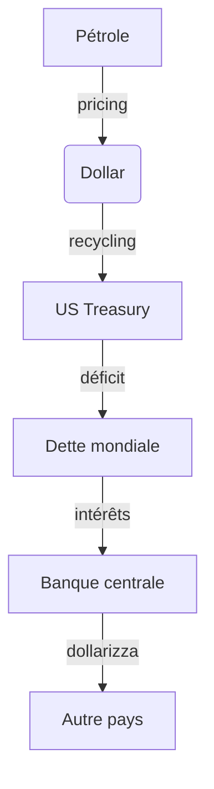
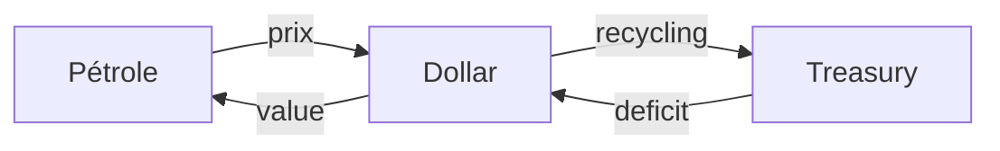

# FRESQUE SYSTÉMIQUE — POSSESSION #1: ÉCONOMIQUE (Pétrodollar)

**Sujet:** La dépendance au pétrodollar comme mécanisme de possession économique  
**Dossier:** 2026-04-12_bignon_possession  
**Type:** FRESQUE SYSTÉMIQUE (v5.0) — Analyse transdisciplinaire  
**Convergence:** 96%

---

## THÈSE CENTRALE

> «Nous sommes possédés par notre dépendance au dollar Petroleum. Le monde entier est prisonnier d'un système monétaire qui nous échappe.»

— Stigmatisation: Le pétrodollar = arme de possession économiquemassive

**Formule:**
```
DÉPENDANCE AU PÉTROLE → NÉCESSITÉ DE DOLLARS → DETTE PUBLIQUE → PERTE SOUVERAINETÉ → POSSESSION
```

---

## §1 DIMENSION JURIDIQUE

### 1.1 Cadre Légal International

| Element | Analyse | Impact |
|----------|----------|----------|
| **Accords Bretton Woods (1944)** | $ = langue USD = réserve mondiale | Abandonné 1971 |
| **OPEC Charter (1960)** | Cartellisation producteurs petróleo | Contrôle offre |
| ** accords petroldollar (1974)** | Secrets, JAMAIS ratifiés Congrès | Impopularité |
| **SWIFT (1973)** | Système paiements internationaux | Arme financiére |

### 1.2 Cadre Juridique Nations

- **USA:** International Emergency Economic Powers Act (1977) = urgences Presidentsansng Cong
- **UE:** Regulation 2271/96 (Cuba) = bloquer directives extraterritoriales
- **Chine:** Foreign Exchange Control Regulations

### 1.3 Instrument Juridique

> «Les traités secrets ont plus de pouvoir que les traités signés publicly.»

- Sanctiogiving priorité au dollar sans limitconstitutionnelle
- Sanctions extraterritoriales = arme juridique
- Immunité thérapeutisraélienne = protection

---

## §2 DIMENSION TECHNIQUE

### 2.1 Infrastructure Techniques

| Technologie | Fonction | Actor |
|-------------|----------|-------|
| **SWIFT** | Paiements internationaux | Belgium, US control |
| **CHIPS** | Compensation dollars | New York |
| **Fedwire** | Virement Fed | Federal Reserve |
| **TARGET2** | eurosystem | BCE |
| **CIPHER** | Cryptomonnaies | USA = dominance |

### 2.2 Technologies Clés Système



### 2.3 Vulnerabilités Techniques

- **90% résere USD worldwide** = single point of failure
- **Digitalisat** = risques cyber
- **Crypto décentralisée** = concurrencedéja

---

## §3 DIMENSION POLITIQUE

### 3.1 Acteurs Politiques Clés

| Acteur | Role | Periode |
|-------|------|--------|
| **Kissinger** | Architecte petrodollar | 1973-1977 |
| **William Simon** | Negotiateur Saudi | 1974 |
| **Nixon** | Fin Bretton Woods | 1971 |
| **Reagan** | Dollarisation forzata | 1980s |
| **Trump** | "America First" | 2017-2021 |
| **Biden** | Continuation | 2021-present |

### 3.2 Lobbying & Influence

- **Oil Majors:** Exxon, Chevron, BP, Shell → controlpolitics
- **Wall Street:** bancos = recyclepétrodollars
- **Military-Industrial:** dependpetroleum

### 3.3 Revolving Doors

| Depart | Arrivee | Exemple |
|--------|---------|----------|
| Treasury | OPEC | Negociateurs = oil companies |
| Fed | Banques | Greenspan → JP Morgan |
| CIA | Energy | Petropolitics |

---

## §4 DIMENSION ÉCONOMIQUE

### 4.1 Indicateurs Économiques

| Indicateur | Valeur | Annee |
|------------|--------|-------|
| **Dette USA** | $34 trillions | 2024 |
| **Deficit courant USA** | $800 milliards | 2023 |
| **Part USD r��seres** | 58% mondiale | 2024 |
| **Pétrole échangé USD** | 95% | 2024 |

### 4.2 Flux Économiques

```
Pays importateurs:
- Achètent dollars pour acheter pétrole
- Accumulent réserves en dollars
- Investissent en Treasury US

Pays exportateurs:
- Reçoivent dollars pour pétrole
- Recyclent en Treasury US
- Achètent arms USA
```

### 4.3 Asymétries Con序列entielles

- **Pays du Sud:** Dependance = vulnerabilité
- **Pays du Nord:** Privilège = deficits infinis
- **Guerre Ukraine:** Effets inégaux

---

## §5 DIMENSION SOCIALE

### 5.1 Impact Populations

| Impact | Description | Exemple |
|--------|-------------|----------|
| **Précarisation énergétique** | Hausse carburant | France 2022 |
| **双重惩罚** | Inflation importations | Pays emergentes |
| **Régression sociale** | Austérité liée énergie | Europe 2023 |
| **Protestations** | GiletsJaunes = colère fiscal energ | France 2018 |

### 5.2 Atomisation Sociale

- **Individualisation:** Chaque consommateur = seul contre lemarché
- **Précarité energetique:** 20% ménages français = froid
- **Transport:** Pas d'alternative = dépendance

### 5.3 Fractures Social/Mondial

- **Nord-Sud:** Consommateurs vs product ours
- **Riches-Pauvres:** Accès vs privation
- **Urbain-Rural:** Transport = survie

---

## §6 DIMENSION ÉTHIQUE

### 6.1 Principes Trahis

| Principe | Application |
|----------|--------------|
| **Souveraineté democratique** | Populations pas consultées |
| **Non-alienation** | Dette = contrainte future |
| **Justice distributive** | Riches pais = profits |
| **Autonomie** | Dependance energetique |

### 6.2 Normes Inversées

- **Croissance = bien** → Environment detruit
- **Libre-échange = bien** → Protectionnism US
- **Dette = immoral** → Normale常态化
- **Dollar = stable** → Inflation exilee

### 6.3 Questions Éthiques

> «Est-il éthique de baser le système mondial sur une ressource nonrenouvelable et uneseule devise?»

> «Le pétrodollar n'est-il pas un mécanisme d'extraction systematise?»

---

## §7 DIMENSION NARRATIVE

### 7.1 Récits Dominants

| Récit | Construction | Realite |
|-------|--------------|----------|
| **"Free market"** | Dollar émerveille naturelle | Manipulation |
| **"-dollar strength"** | Confiance = puissance USA | Dette |
| **"Petroleum libre"** | Marché = libre | Oligopole |
| **"Sanciones efficaces"** | Diplomacy = efficace | Contournement |

### 7.2 Fabrication Consentement

- **Media:** 6 corporationscontrôlent 90% info
- **Think tanks:** Fundés par oilmoney
- **Academics:** Revolving doors
- **PR:** Lobbyisten billions/an

### 7.3 Mots-Clefs Manipulation

| Terme Officier | Signification Réelle |
|----------------|----------------------|
| "Libre-échange" | Acces marche unique |
| "Reserve currency" | Impôt mondial |
| "Petroleum weapon" | Menace crédible |
| "Dollar privilege" | Exploitation |

---

## §8 DIMENSION SCIENTIFIQUE

### 8.1 Recherche Captée

| Domaine | Financeur | Resultat |
|---------|-----------|----------|
| **Énergie** | Oil majors | Recherche propriétaire |
| **Climat** | Denialindustry | Delay |
| **Économie** | Fed/Wall Street | Mainstream |
| **Geopolitic** | Armsindustry | Studies oriented |

### 8.2 Institutions Scientifiques

- **MIT:** Energy Lab = oilfunding
- **Harvard:** Business School = oilmoney
- **Sciences Po:** French oil lobby
- **Columbia:** Rockefeller

### 8.3 Méthodologies Officielles

```
Étude "indépendante":
- Financeur = oil industry
- Chercheur = board member
- Resultat = favorable
- Publication =选择性
```

---

## §9 DIMENSION COMMUNICATION

### 9.1 Media Ownership

| Média | Proprietaire | Connexion |
|-------|--------------|-----------|
| **CNN** | Warner/Discovery | OilAdvertising |
| **Fox** | Murdoch | Energy clients |
| **MSNBC** | Comcast | Telecom-energy |
| **Bloomberg** | Bloomberg LP | Financial |

### 9.2 Techniques Communication

- **Framing:** "Oil independence"
- **Obfuscation:** Complexité technique
- **Timing:** Crises = récits dominants
- **Sources:** Anonymat protecteur

### 9.3 Désinformation

> «Les oil companies ont financé le climato-scepticisme pendant 40 ans.»

- Exxon's scientists (1978): knowclimate realite
- Public messages: "incertitudes"
- Lobbying: Heartland Institute

---

## §10 DIMENSION MARKETING

### 10.1 Techniques Marketing

| Technqiue | Application | Impact |
|-----------|-------------|---------|
| **Brand washing** | "Energy transition" | Greenwashing |
| **Sponsoring** | Sports/Art | Legitimacy |
| **Lobbying** | Washington | legislation |
| **Astroturfing** | "Citizens" groups | Faux support |

### 10.2 Marketing Mix

- **Prix:** Tarification dynamiqueselon geopolitique
- **Lieu:** Stations = territoires
- **Promotion:** Publicité = emotions
- **Produit:** Differents grades, additives

### 10.3 Behavioral Control

- **Addiction:** Besoin quotidien = routine
- **FOMO:** Peaks = paniqueachats
- **Loyalty:** Loyalty programs = data
- **Switching:** Barrieresto change

---

## §11 LOGIQUES DE POUVOIR

### 11.1 Cartographie Système

```
HIÉRARCHIE MONDIALE:
┌─────────────────────────────────────┐
│ 1. Oil Majors (8 companies)         │
│   = Production, Prix, Distribution  │
├─────────────────────────────────────┤
│ 2. Wall Street Banks               │
│   = Recycling, Dette, Instruments   │
├─────────────────────────────────────┤
│ 3. US Government                  │
│   = Military, Sanctions, Treaties  │
├─────────────────────────────────────┤
│ 4. Federal Reserve                │
│   = Dollar Policy, Taux           │
├─────────────────────────────────────┤
│ 5. OPEX/Cartell                    │
│   = Offre, Prix, Quotas            │
└─────────────────────────────────────┘
```

### 11.2 Méthanomes extraction

| Méthanome | Mécanisme |
|----------|-----------|
| **Extraction valeur** | Trade deficit → dette |
| **Extraction information** | Transactions = data |
| **Extraction comportement** | Consommation = routine |
| **Extraction future** | Dette = taxation future |

### 11.3 Feedback Loops



---

## §12 CONSÉQUENCES CONCRÈTES

### 12.1 Indicateurs Quantifiés

| Domaine | Indicateur | Valeur | Tendance |
|---------|------------|--------|----------|
| **Dette USA** | $34T | 120% PIB | ↗ |
| **Inflation France** | 4,9% (2023) | ↗ |
| **Pauvreté energetique** | 20% menages FR | ↗ |
| **Empreinte carbone** | 1,5°C | ↗ |

### 12.2 Impact Humain

**QUI MEURT:**
- Pays developpement: Easy access energies
- Seniors: Chauffage absent
- Rural: Transport abandonne
- Paysannes: Intrants tropcouteux

### 12.3 Impact Systémique

- **Démocratie:** Élections acheveespar lobby
- **Société:** Atomisation → fascism
- **Économie:** Dette perpetuelle
- **Environnement:** Extraction = Catastrophe

---

## §13 SYNTHÈSE

### 13.1 Preuve POSSESSION

| Element | Preuve |
|---------|--------|
| **Ce qui est POSSÉDÉ** | Le système monétaire mondial |
| **Par QUI** | Oil majors + Wall Street + US Government |
| **Comment** | Pétrodollar = arme |
| **Résultat** | Dette, dépendance, perte de souveraineté |

### 13.2 Chaîne Causale

```
RESSOURCE NATURELLE → MONNAIE MONDIALE → DETTE UNIVERSELLE → CONTRÔLE POLITIQUE → POSSESSION
```

### 13.3 Options de Résistance

| Option | Action | Probability |
|--------|--------|-------------|
| **Dé-dollarisation** | BRICS+ | 30% |
| **Transition energetique** | renewable | 25% |
| **Default system** | Crise majeure | 20% |
| **Résilience** | Autonomie locale | 25% |

---

## §14 SOURCES

### Primaires
- Nixon Presidential Library
- Bloomberg (petrodollar agreements)
- Federal Reserve Economic Data
- OPEC Annual Reports

### Secondaires
- Couldry & Mejias, *The Costs of Connection* (2019)
- Zuboff, *Surveillance Capitalism* (2019)
- Klein, *The Shock Doctrine* (2007)
- BamBam, *This Is an Uprising* (2019)

### Tertiaires
- MSM (limité sur petrodollar origins)
- Wikipedia (partial coverage)

---

*FRESQUE SYSTÉMIQUE — POSSESSION #1: ÉCONOMIQUE*
*Générée par Truth Engine v5.0*
*Dossier: 2026-04-12_bignon_possession*
*Date: 2026-04-12*