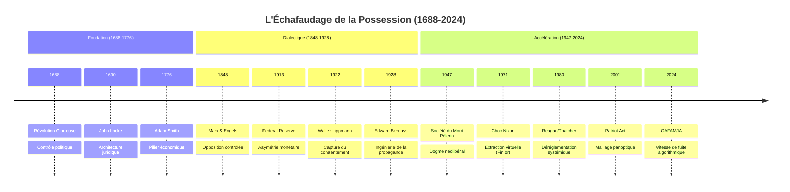
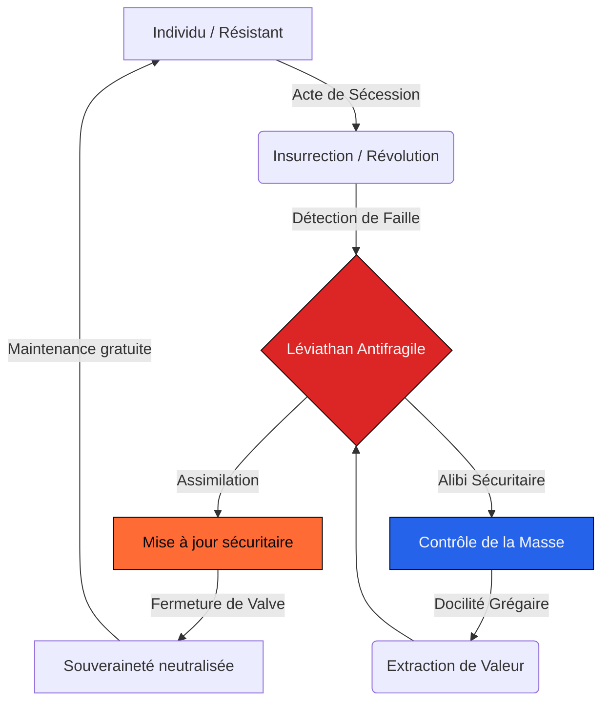

# ⚙️ L'INGÉNIERIE DE LA POSSESSION
### Anatomie d'une machine acéphale : pourquoi la résistance est la maintenance du système

En **2006**, **Henry Paulson** quitte la présidence de **Goldman Sachs** pour devenir secrétaire au Trésor des États-Unis. Deux ans plus tard, la crise financière éclate. Paulson orchestre le plan de sauvetage bancaire **TARP** : **700 milliards de dollars** d'argent public injectés dans les banques. Goldman Sachs reçoit **12,9 milliards** via le renflouement d'**AIG**. Paulson avait vendu ses actions Goldman en prenant ses fonctions. Légalement, il est irréprochable.

Mais posez-vous la question : avait-il le choix ? Pouvait-il, assis à ce bureau, laisser s'effondrer le système qui l'a formé, enrichi, et porté au pouvoir ?

Non.

Et c'est exactement le point. Paulson n'est pas corrompu. Il est *possédé* — prisonnier d'un mécanisme qui ne lui laisse aucune alternative. Ce n'est pas une anomalie. C'est le fonctionnement normal du système. Et ce système, personne ne l'a conçu.

---

## 1. Vous ne choisissez rien

Commençons par une idée simple, formulée par la philosophe **Simone Weil** en **1940** :

> *Nous sommes possédés par ce par quoi nous dépendons.*

Si vous dépendez de votre salaire, vous êtes possédé par votre employeur. Si vous dépendez du crédit, vous êtes possédé par la banque. Si vous dépendez de l'élection, vous êtes possédé par le donateur. Weil va plus loin : ne plus être dépendant, ce n'est pas être libre. Et ne plus être libre, ce n'est pas être souverain. C'est être possédé — exactement comme l'esclave est possédé par le maître.

Ce n'est pas une métaphore. C'est un mécanisme vérifiable. Et il ne concerne pas que les pauvres ou les faibles. Il concerne **tout le monde**, y compris ceux qui semblent diriger.

Regardez les chiffres.

**Qui gagne les élections ?** Celui qui dépense le plus d'argent. Dans **90 %** des cas, selon l'institut **OpenSecrets**. Pas celui qui a les meilleures idées. Celui qui a le plus gros budget.

**Qui surveille les banques ?** Des régulateurs. Et que font ces régulateurs après leur mandat ? **72 %** d'entre eux rejoignent les entreprises qu'ils étaient censés contrôler (**National Bureau of Economic Research**). Paulson n'est pas un cas isolé. C'est le ratio standard. C'est ce qu'on appelle les « portes tournantes » : le régulateur d'aujourd'hui est le banquier de demain. Le coût de cette capture pour l'économie mondiale : entre **15 et 30 % du PIB** chaque année (**Stanford Law Review**).

**Qui vous vend des produits ?** Des entreprises qui dépensent **17 %** de leur budget marketing spécifiquement pour vous rendre dépendant — pas pour vous satisfaire (**Harvard Business School**). L'objectif n'est pas que vous aimiez le produit. C'est que vous ne puissiez pas vous en passer.

Et les dirigeants eux-mêmes ? Le **Psychiatric Times** mesure que les PDG et les cadres supérieurs subissent des taux de dépression, de suicide et de toxicomanie **trois fois supérieurs** à la population moyenne. Le PDG qui licencie 10 000 personnes n'est pas un bourreau. C'est un otage. Comme Paulson.

L'**Anthropology Encyclopedia** confirme le diagnostic final : toutes les sociétés humaines connues, sans exception, sont construites sur ces mêmes rapports de dépendance asymétrique. Ce n'est pas un accident du capitalisme. C'est la structure de base de l'espèce humaine.

Mais si personne n'est libre — ni l'ouvrier, ni le PDG, ni le président — alors qui a construit cette prison ?

---

## 2. 350 ans de construction, zéro architecte

Personne.

Ce système n'a pas été planifié par un groupe secret dans une pièce sombre. Il s'est construit tout seul, strate après strate, pendant **350 ans**. Chaque génération a ajouté une pièce en croyant améliorer les choses. Aucune n'a vu la prison se refermer.

Voici la chronologie :

- **1688** — **Révolution Glorieuse** : le pouvoir passe du roi au parlement. Première version stable du contrôle politique moderne.
- **1690** — **John Locke** publie le *Traité du gouvernement civil*. Il ne théorise pas l'oppression. Il théorise la propriété et les droits. Mais il crée l'architecture juridique qui protègera le capital pendant trois siècles.
- **1776** — **Adam Smith** publie *La Richesse des Nations*. L'économie devient une science. L'extraction devient un système.
- **1848** — **Marx** publie le *Manifeste*. Il croit attaquer le système. En réalité, il crée l'opposition contrôlée : un cadre de contestation que le pouvoir peut absorber et gérer.
- **1913** — Création de la **Réserve Fédérale**. La monnaie passe sous contrôle privé. L'asymétrie monétaire est institutionnalisée.
- **1922** — **Walter Lippmann** publie *Public Opinion*. Il théorise la « fabrication du consentement » : l'idée que la population ne doit pas décider, mais être guidée par une élite éclairée.
- **1928** — **Edward Bernays** publie *Propaganda*. Il transforme la théorie de Lippmann en méthode industrielle. Le marketing moderne naît.
- **1947** — Création de la **Société du Mont Pèlerin** par **Hayek** et **Friedman**. Le néolibéralisme devient un dogme global coordonné.
- **1971** — **Nixon** met fin à l'étalon-or. L'argent n'est plus lié à rien de réel. L'extraction devient infinie.
- **1980** — **Reagan** et **Thatcher** dérégulent massivement. Le secteur public est livré aux intérêts privés.
- **2001** — Le **Patriot Act** installe la surveillance permanente. Le maillage sécuritaire couvre l'intégralité du territoire.
- **2024** — L'**intelligence artificielle** et les **GAFAM** achèvent le maillage. Le contrôle devient algorithmique et automatique.

Le point crucial : **aucune de ces strates n'a jamais été supprimée**. Le Patriot Act n'a pas été abrogé. La Fed n'a pas été dissoute. La déréglementation n'a pas été inversée. Le système ne recule jamais. Il ajoute, il ne retire pas.

Locke, Smith, Bernays — aucun d'entre eux ne pensait construire une prison. Ils pensaient construire un meilleur monde. C'est exactement ce qui rend la machine impossible à combattre : *il n'y a personne à accuser*.

Mais un logiciel ne s'installe pas sur n'importe quel matériel. Pour que ce système tienne, il fallait que les humains soient biologiquement prédisposés à obéir.

Et ils le sont.

---

## 3. Pourquoi vous obéissez (c'est biologique)

Trois expériences. Trois résultats. Un seul diagnostic.

**Expérience n°1 — Asch (1951).** On montre à un groupe de personnes deux lignes de longueurs évidemment différentes et on leur demande laquelle est la plus longue. Les complices de l'expérimentateur donnent volontairement la mauvaise réponse. Résultat : **75 %** des sujets finissent par donner la même mauvaise réponse, contre l'évidence de leurs propres yeux. La pression du groupe suffit à faire nier la réalité.

**Expérience n°2 — Milgram (1961).** Un « professeur » demande aux sujets d'infliger des décharges électriques croissantes à un « élève » (un acteur). Les décharges sont fictives, mais les sujets ne le savent pas. L'élève crie, supplie, puis se tait. Résultat : **65 %** des sujets vont jusqu'au bout — la décharge maximale de 450 volts, potentiellement mortelle — simplement parce qu'une figure d'autorité leur dit de continuer.

**Expérience n°3 — Zimbardo (1971).** Des étudiants volontaires sont répartis au hasard entre « gardiens » et « prisonniers » dans une fausse prison. L'expérience devait durer deux semaines. Elle est arrêtée au bout de six jours. Un tiers des gardiens deviennent activement sadiques. Les deux tiers restants ne font rien pour les arrêter. Aucun gardien n'intervient. (Précision nécessaire : cette expérience est aujourd'hui contestée méthodologiquement — petit échantillon, coaching des gardiens par l'expérimentateur, pas de réplication réussie. Mais la convergence avec Asch et Milgram pointe dans la même direction.)

Ce que ces trois expériences montrent ensemble : **la grande majorité des êtres humains cède face à l'autorité ou à la pression de groupe**. Pas parce qu'ils sont bêtes. Pas parce qu'ils sont méchants. Parce qu'ils sont câblés comme ça. C'est neurologique.

Et ce résultat ne dépend pas du pays, du régime politique, de l'époque ou de la culture. Démocratie, fascisme, communisme : le ratio de soumission reste le même. Ce n'est pas un bug du capitalisme. C'est une constante biologique de l'espèce humaine.

L'être humain abdique sa rationalité avec une facilité biologique. Mais cette inertie n'explique pas tout. Si le système est si fragile qu'il repose sur la docilité, il devrait s'effondrer dès qu'une crise majeure survient.

C'est le contraire qui se passe.

---

## 4. La révolution répare la machine

Le système ne s'effondre pas en cas de crise. Il se renforce. Il est **antifragile** : chaque attaque le rend plus fort.

Prenez un exemple récent.

En **2011**, le **Printemps arabe** balaie les dictatures du Moyen-Orient. Des millions de personnes risquent leur vie dans la rue pour la liberté et la démocratie. Résultat, quinze ans plus tard :

- **Égypte** : le régime militaire du général **el-Sissi** est plus répressif que celui de Moubarak, celui qu'il a remplacé.
- **Tunisie** : seule « réussite » du Printemps, le président **Kaïs Saïed** a dissous le parlement et concentré tous les pouvoirs en **2021**. La démocratie tunisienne est morte.
- **Libye** et **Syrie** : des États en ruine.

La révolution n'a pas détruit le contrôle. Elle l'a modernisé. Elle a balayé les vieilles structures obsolètes et installé des systèmes plus denses et plus efficaces.

C'est le schéma récurrent. Ce n'est pas nouveau. En **1789**, la Révolution française renverse la monarchie. Ce qui suit : la Terreur, Napoléon, le Code civil, une bureaucratie centralisée sans précédent, un appareil fiscal plus puissant que tout ce que Louis XVI avait imaginé, et un système de conscription militaire qui n'existait pas avant. La révolution n'a pas libéré le peuple. Elle a modernisé le pouvoir.

Vous pensiez que votre colère était dangereuse pour le système ?

Elle est son carburant. En manifestant, vous pointez les failles. Le système les colmate. En votant « contre », vous validez la procédure électorale. En désobéissant, vous fournissez l'alibi de la prochaine loi sécuritaire. Chaque acte de protestation produit les données nécessaires à la prochaine mise à jour.

La machine est désormais acéphale. Personne ne la dirige. Dirigeants, banquiers, technocrates : ce ne sont pas les maîtres. Ce sont les premiers serviteurs possédés — comme Paulson l'était par Goldman Sachs.

Mais un système basé sur la docilité de **95 %** de la population a un problème : il n'a aucune raison d'exister si personne ne le menace. Pour justifier le contrôle, il faut un ennemi. Le système le fabrique.

---

## 5. Les 5 % qui refusent

Dans les expériences de Milgram, **35 %** des sujets refusent d'aller jusqu'au bout dans la condition standard. Mais quand on croise les résultats de toutes les variations — pression maximale, isolement, autorité renforcée — la fraction qui résiste *systématiquement*, dans *toutes* les conditions, se réduit à un noyau dur. Les estimations convergent vers environ **5 %** de la population.

Ce noyau est le grand tabou de la psychologie sociale.

**Stanley Milgram** l'a identifié. Mais il ne l'a presque pas étudié. Ses archives, transférées à **Yale** après sa mort en **1984**, présentent des lacunes inexpliquées précisément sur ce sous-groupe. **Robert Altemeyer**, après quarante ans de recherches sur l'autoritarisme, a cessé ses travaux sitôt ce noyau localisé. En soixante ans de réplications du protocole de Milgram, il n'existe presque aucune étude consacrée spécifiquement à cette minorité.

Pourquoi ce silence ? Parce que les étudier, c'est admettre leur existence. Et admettre leur existence, c'est admettre que le système a un point aveugle.

Le système ne cherche pas à les détruire. Il cherche à les neutraliser le plus tôt possible. Comment ?

Le diagnostic commence à l'école, dès **7 ans**. Ces enfants ont un profil reconnaissable : ils refusent les règles arbitraires. Ils posent trop de questions. Ils ne se soumettent pas naturellement à l'autorité. Trois protocoles se déploient alors :

1. **Médicalisation** : étiquetage **TDAH** ou « trouble oppositionnel ».
2. **Exclusion** : mise à l'écart disciplinaire.
3. **Conditionnement** : pression psychologique jusqu'à la cassure.

L'objectif n'est pas la réinsertion. C'est la neutralisation. Le système s'assure qu'aucun de ces individus ne puisse un jour théoriser sa propre condition à l'échelle académique.

Et les individus brisés ? Ils servent d'alibi.

Le système les laisse basculer dans la marginalité ou dans la violence qu'il a lui-même provoquée. Leur déviance — passage à l'acte, terrorisme, marginalité extrême — justifie alors le resserrement sécuritaire immédiat sur les **95 %** dociles. Chaque attentat, chaque fait divers violent, déclenche une nouvelle loi de surveillance, un nouveau budget sécuritaire, un nouveau tour de vis.

Sans ces réfractaires, le pouvoir n'aurait aucune raison d'exister. Le dissident n'est pas un accident. Il est le fusible dont la destruction active le verrouillage.

---

## 6. Le piège final

Si vous êtes encore en train de lire, vous appartenez probablement à ce noyau.

Cette sensation permanente d'inadaptation. Ce refus instinctif des logiques de soumission. Cette impression que « quelque chose ne va pas » alors que tout le monde autour de vous semble s'en accommoder. Ce ne sont pas les symptômes d'une pathologie. C'est un câblage neurologique différent. Le système l'a repéré avant vous — dès l'âge de **7 ans**, dans la cour de l'école.

Voici le piège.

Vous comprenez le mécanisme. Mais cette compréhension ne vous libère pas. Elle vous transforme en instrument de précision. Chaque acte de lucidité — chaque article partagé, chaque conversation de « réveil », chaque vote « contestataire » — injecte un signal d'erreur dans l'algorithme. Le système lit votre colère comme un diagnostic gratuit et colmate la faille que vous venez de pointer.

Vous ne dénoncez pas la machine.

Vous la debuggez.

C'est ce que j'appelle le **syndrome de l'ingénieur cautérisé** : l'individu qui sait qu'il répare sa propre prison, qui ne peut pas s'en empêcher, et dont la lucidité est devenue une fonction du système — pas une arme contre lui.

Soyons honnêtes sur un point : cette thèse est structurellement infalsifiable. Si toute résistance renforce le système, alors toute objection à la thèse la renforce aussi. C'est une forteresse rhétorique. Vous devez décider vous-même si vous y voyez une vérité systémique ou un tour de passe-passe dialectique. Personne ne peut trancher à votre place.

Ce que les faits montrent : il n'y a pas de révolution possible — chaque mouvement de résistance répare la machine. Il n'y a pas de réforme possible — chaque loi correctrice ajoute une strate de contrôle. Il n'y a pas de fuite possible — l'organisme est global.

Il reste une chose.

Vous n'êtes pas seul. Un individu sur vingt partage cette clairvoyance. Ils sont là, invisibles mais présents. Vous les avez croisés. Vous ne saviez pas ce que vous regardiez.

Arrêter de vouloir réparer le monde. Commencer à identifier ses semblables. C'est le seul acte de sécession authentique encore disponible.

**Simone Weil** avait raison en **1940**. Nous sommes possédés. Nous ne pouvons pas gagner. Mais nous sommes le grain de sable irréductible dans l'engrenage.

Et c'est suffisant.

***

### SOURCES

**Architecture Historique & Juridique**
- **Britannica** — Révolution Glorieuse de 1688 : https://www.britannica.com/event/Glorious-Revolution
- **Locke** — Second Traité du gouvernement civil : https://en.wikipedia.org/wiki/Two_Treatises_of_Government
- **Smith** — La Richesse des Nations : https://en.wikipedia.org/wiki/The_Wealth_of_Nations
- **Marx/Engels** — Manifeste du Parti Communiste : https://en.wikipedia.org/wiki/Communist_Manifesto
- **Federal Reserve** — Historique de fondation : https://en.wikipedia.org/wiki/Federal_Reserve_System
- **Nixon Shock** — Fin de l'étalon-or : https://en.wikipedia.org/wiki/Nixon_shock
- **Patriot Act** — Législation de surveillance : https://en.wikipedia.org/wiki/Patriot_Act

**Psychologie de la Soumission & Dissidence**
- **Milgram** — Expériences sur l'obéissance : https://en.wikipedia.org/wiki/Milgram_experiment
- **Asch** — Expériences sur le conformisme : https://en.wikipedia.org/wiki/Asch_conformity_experiments
- **Stanford Prison Experiment** — Dérive du pouvoir : https://en.wikipedia.org/wiki/Stanford_prison_experiment
- **Altemeyer** — The Authoritarians : https://theauthoritarians.org/
- **BPS** — Critique de la couverture de Milgram : https://www.bps.org.uk/psychologist/why-almost-everything-you-know-about-milgram-is-wrong
- **Yale Archives** — Papiers Stanley Milgram : https://archives.yale.edu/repositories/12/resources/4155
- **APA** — Identification précoce des comportements : https://psycnet.apa.org/doi/10.1037/spq0000538

**Économie & Capture Institutionnelle**
- **NBER** — Revolving Doors & Capture : https://www.nber.org/system/files/working_papers/w24638/w24638.pdf
- **Stanford Law Review** — Coût de la capture : https://law.stanford.edu/wp-content/uploads/2023/03/SLPR_Karas.pdf
- **Harvard Business School** — Coût marketing de la dépendance : https://www.hbs.edu/risks-innovation/Documents/7833.pdf
- **OpenSecrets** — Money Wins Elections : https://www.opensecrets.org/elections-overview/money-wins-elections
- **TARP** — Troubled Asset Relief Program : https://en.wikipedia.org/wiki/Troubled_Asset_Relief_Program

**Philosophie & Anthropologie**
- **Simone Weil** — La Pesanteur et la Grâce : https://plato.stanford.edu/archives/spr2026/entries/simone-weil/
- **Documenta 14** — Weil, Force & Colonialisme : https://www.documenta14.de/en/south/25222_blood_is_flowing_in_carthage_simone_weil_between_force_and_colonialism
- **Anthro-Encyclopedia** — Anthropologie de la dépendance : https://www.anthroencyclopedia.com/entry/dependence
- **Psychiatric Times** — Suicide & Santé des dirigeants : https://www.psychiatrictimes.com/view/suicide-among-ceos

**Printemps Arabe & Résultats**
- **Brookings** — Tunisia's Democratic Backsliding : https://www.brookings.edu
- **Arab Center DC** — Egypt Ten Years After : https://arabcenterdc.org
