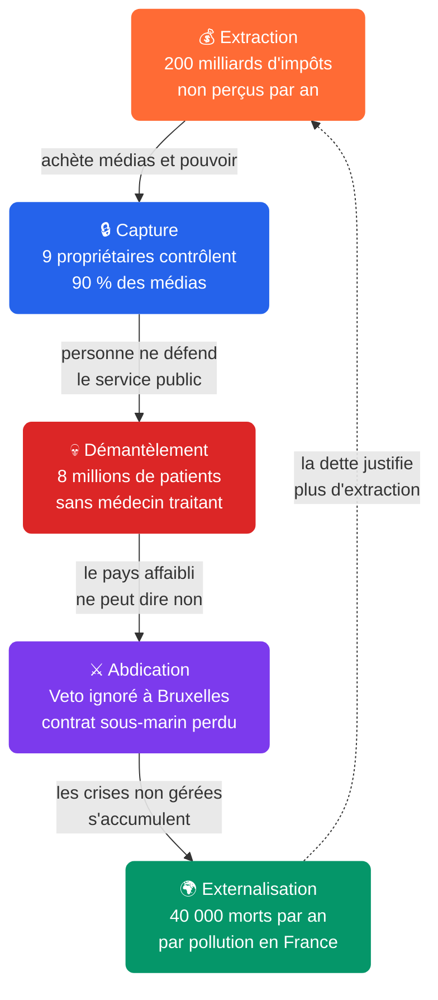

# 🔄 Le Changement de Régime : Pourquoi ce système ne peut pas se réformer

*🔄 Le constat que personne en haut ne changera rien. La démonstration que le verrouillage est structurel. Et ce que ça implique pour le reste.*

*📖 Cet article est le centre de navigation de l'enquête **Le Changement de Régime** — 17 articles, 40 enquêtes pré-publiées, 746 faits vérifiés. Chaque § renvoie vers l'article qui approfondit. Cliquez sur ce qui vous concerne.*

---

## §0 : Le tableau de bord

> **+200 Md€ par an** disparaissent des caisses publiques — évasion, niches, gaspillage.
> **20 familles** en captent la moitié — 704 Md€ de fortune cumulée.
> **9 milliardaires** contrôlent 90 % de l'audience médiatique nationale.
> **8 millions de Français** sont sans médecin traitant.
> **57 % des électeurs** ne votent plus — l'abstention comme veto silencieux.
> **100 000 fermes** ont disparu en dix ans — un suicide d'agriculteur tous les deux jours.
> **70 % des données françaises** sont stockées sur des serveurs américains.

Ce n'est pas une liste de problèmes séparés. C'est **un seul système** : 5 tensions verrouillées qui se renforcent mutuellement. La suite de ce HUB montre la mécanique, article par article.

---

## §1 : Les 5 parois du piège

Les 5 tensions ne sont pas des problèmes parallèles. Elles sont liées en cascade causale : l'extraction nourrit la capture, la capture permet le démantèlement, le démantèlement affaiblit le pays et force l'abdication, l'abdication empêche toute résilience — et les crises non gérées creusent la dette qui justifie plus d'extraction.

### Tension 1 : Extraction — ~200 milliards de recettes publiques non perçues chaque année

**~200 milliards d'euros par an. L'équivalent de 1,3 fois le déficit public annuel.**

Cette somme se décompose en quatre flux distincts : évasion fiscale 80-100 Md€/an (CCFD, Oxfam), niches fiscales 90-100 Md€/an (Cour des comptes), baisses d'impôts structurelles depuis 2017 40-50 Md€/an (Haut Conseil des Finances Publiques), et gaspillage public 24-48 Md€/an (comités Théodule, mille-feuille territorial, subventions sans contrôle, doublons institutionnels). **Ces quatre flux sont de nature juridique et temporelle différente :** la fraude (illégal), l'optimisation (légal mais abusif), les choix politiques (niches, baisses d'impôts) et l'inefficacité administrative (gaspillage). Leur somme donne un **ordre de grandeur**, pas un total arithmétique — mais l'ordre de grandeur est suffisant pour poser la question du transfert systématique de la richesse nationale vers une minorité. Ces quatre flux convergent : **l'État perd chaque année davantage que son déficit, parce qu'il a renoncé à capter sa propre richesse.**

*→ L'article **[S2 : L'Argent qui disparaît](https://giak.substack.com/p/largent-qui-disparait-80-a-100-milliards)** documente les 80-100 Md€ d'évasion et les 30-45 Md€ de gaspillage institutionnel.*
*→ **[S3 : La Dette instrumentalisée](https://giak.substack.com/p/la-dette-instrumentalisee-3-200-milliards)** montre que la dette n'est pas la cause du problème mais l'enregistrement comptable de ce transfert.*

### Tension 2 : Capture — cet argent achète le silence

9 propriétaires privés contrôlent 90 % de l'audience médiatique nationale (Arcom, baromètre du pluralisme 2024). Bolloré possède Canal+, CNews, C8, Europe 1, le JDD, Paris Match. Niel contrôle Le Monde. Drahi possédait BFM TV. Arnault possède Les Échos. Au Parlement : 28 recours au 49.3 en 3 ans, 120 ordonnances, 90 % des lois adoptées sans vote. À la justice : 0,20 % du PIB contre 0,30 % de moyenne européenne.

*→ **[S15 : Le Verrou](https://giak.substack.com/p/le-verrou-28-recours-au-493-57-dabstention)** détaille les 28×49.3, les 120 ordonnances, les 40 conventions d'impunité et la mainmise médiatique.*
*→ **[S1 : La Caste Parasite](https://giak.substack.com/p/la-caste-parasite-qui-gouverne-la)** identifie les 20 familles et le système de reproduction des élites.*

### Tension 3 : Démantèlement — personne ne peut défendre le service public

**Santé :** 8 millions de Français sans médecin traitant (CNAM, 2025). **École :** −43 points en mathématiques PISA, la plus forte baisse de l'OCDE. **Logement :** 4,2 millions de mal-logés, 735 morts à la rue en 2023. Ce n'est pas un échec de politique : c'est la conséquence d'un système qui transfère les ressources du public vers le privé depuis 40 ans.

*→ **[S4 : Le Système de Santé démantelé](https://giak.substack.com/p/le-systeme-de-sante-demantele-8-millions)** (8M sans médecin, 100 000 lits supprimés).*
*→ **[S5 : Les Visages de la Pauvreté](https://giak.substack.com/p/les-visages-de-la-pauvrete-98-millions)** (9,8M de Français, 15,4 %, travailleurs pauvres).*
*→ **[S7 : L'École et l'Éducation sacrifiées](https://giak.substack.com/p/lecole-sans-transmission-43-points)** (−43 points PISA, 4 000 postes non pourvus).*
*→ **[S9 : Le Logement, la machine à créer de la rareté](https://giak.substack.com/p/le-logement-la-machine-a-creer-de)** (4,2M mal-logés, −40 % construction).*

### Tension 4 : Abdication — le pays affaibli ne peut dire non

**Diplomatie :** la France vote contre l'UE-Mercosur. L'accord est signé quand même. **Défense :** l'Australie annule le contrat des sous-marins (56 Md€). Les stocks de munitions tiendraient quelques semaines. **Industrie :** déficit commercial de 81 Md€. La France conserve les attributs de la puissance (dissuasion nucléaire, ONU, 3e exportateur d'armement). Elle a perdu la capacité de les convertir en influence.

*→ **[S14 : La Défense en berne](https://giak.substack.com/p/la-defense-rongee-449-md-sans-munitions)** (AUKUS, stocks de munitions, perte d'autonomie stratégique).*
*→ **[S13 : L'Europe, cadre ou carcan](https://giak.substack.com/p/leurope-piege-francais-12-contentieux)** (veto contourné, traités qui verrouillent la souveraineté).*
*→ **[S6 : La France désindustrialisée](https://giak.substack.com/p/la-france-desindustrialisee-81-milliards)** (81 Md€ de déficit commercial).*

### Tension 5 : Externalisation — les crises non gérées deviennent la dette de demain

**Climat :** 11 Md€ par an de subventions aux énergies fossiles. **Pollution :** 40 000 décès prématurés par an. **Agriculture :** premier suicide d'agriculteur tous les deux jours, 100 000 fermes disparues. **Numérique :** 70 % des données françaises sur serveurs américains, l'Éducation nationale confie 12 millions d'élèves à Microsoft pour 152 M€. Ces crises ne sont pas séparables. La boucle se referme sur T1 : les crises non gérées creusent la dette, la dette justifie plus d'extraction.

*→ **[S10 : L'Énergie sacrifiée](https://giak.substack.com/p/lenergie-sacrifiee-923-twh-exportes)** (arnaque climatique, ZFE punitive).*
*→ **[S11 : L'Agriculture qui meurt](https://giak.substack.com/p/lagriculture-qui-meurt-100-000-fermes)** (100 000 fermes disparues, PAC captée).*
*→ **[S8 : L'Immigration sans cap](https://giak.substack.com/p/limmigration-sans-cap-340-000-titres)** (140 000 OQTF, < 10 % exécutées).*
*→ **[S16 : Le Numérique colonisé](https://giak.substack.com/p/le-numerique-colonise-70-des-donnees)** (Cloudwatt, IDMerit, Viginum, contrat Microsoft).*

> **Cette cascade causale est réfutable.** La thèse tombe si (1) l'évasion fiscale repasse sous 40 Md€/an sans réforme, (2) la concentration médiatique se réduit sans régulation publique, (3) la France retrouve un excédent commercial maintenu sur 5 ans sans dévaluation compétitive. Aucune de ces conditions n'est remplie en 2026.

---

## §2 : Le test des 3 réformes

3 réformes évidentes. 3 murs différents. La même cage.

### Rétablir l'ISF

**3 à 5 milliards d'euros par an offerts aux 0,1 % les plus riches. Rétablir l'impôt sur la fortune serait simple à mettre en oeuvre. Mais le débat ne peut pas avoir lieu.**

Il ne peut pas. 9 propriétaires privés contrôlent 90 % de l'audience médiatique : ce sont exactement ceux qui paieraient l'ISF rétabli. Un débat dans leurs médias serait un débat sur leur propre impôt. Il n'a pas lieu.

**Le piège : la capture des médias (T2) verrouille la question avant même qu'elle soit posée.**

### Protéger l'agriculture

**100 000 fermes disparues en dix ans, un suicide d'agriculteur tous les deux jours. Protéger le marché français par des barrières douanières est une évidence. Mais la France ne décide plus seule.**

Elle a voté contre l'UE-Mercosur : l'accord a été signé quand même, le Coreper a contourné son veto par majorité qualifiée. Même la PAC (55 Md€/an) cache 50,5 milliards dans des comptes opaques où 6 anciens ministres lobbyistes pèsent sur les décisions.

**Le piège : l'abdication de souveraineté (T4) empêche d'agir, même quand la volonté politique existe.**

### Soigner la santé

**8 millions de Français sans médecin traitant, 100 000 lits d'hôpital supprimés. Engager des médecins coûte de l'argent. Mais les caisses sont vides.**

200 milliards d'euros par an non perçus : évasion fiscale (80-100 Md€), niches (90-100 Md€), baisses d'impôts depuis 2017 (40-50 Md€). L'argent qui aurait dû financer l'hôpital a été systématiquement transféré ailleurs.

**Le piège : l'extraction (T1) vide les caisses, le démantèlement (T3) transforme le manque en catastrophe humaine. La boucle est bouclée.**

---

Trois réformes, trois murs. Mais la cage est la même : le système est conçu pour que chaque issue de secours soit verrouillée par une autre pièce du système.

L'augmentation du budget dans un secteur n'est pas en soi un échec — elle le devient quand elle ne produit aucun résultat mesurable. C'est le cas de l'éducation (PISA : −43 points malgré +15 % de budget) et de la défense (stocks de munitions inchangés malgré +30 % de budget). Ni le manque d'argent ni l'excès n'expliquent seuls l'échec : c'est l'absence de résultat qui le définit.

**Chaque mécanisme du piège a été construit par une décision politique spécifique. Aucune n'était obligatoire.** Supprimer l'ISF (2018), instaurer la flat tax à 30 %, utiliser le 49.3 28 fois, permettre 40 conventions d'impunité, laisser 9 propriétaires contrôler 90 % des médias — rien n'y obligeait. Chaque décision a été votée, signée, appliquée parce qu'elle servait les intérêts de ceux qui décident.

**Ce qui est construit par des choix peut être défait par d'autres choix. C'est en cela que le système n'est pas une fatalité.**

**Une nuance s'impose :** la caste qui verrouille le système est compétente dans la prédation des ressources (capture médiatique, judiciaire, fiscale) mais incompétente dans la gestion des services publics. Ce n'est pas une contradiction — c'est le propre d'une élite extractive. Plus sa capacité à capter est grande, moins elle a besoin que l'État fonctionne.

---

◈ ◈ ◈

⋮

◈ ◈ ◈

*Vous venez de lire la thèse de l'enquête — le diagnostic en 5 tensions. Les pages qui suivent sont conçues pour naviguer : chaque article de la série est présenté avec sa question, son fait-clé et son lien. Vous pouvez piocher ce qui vous concerne.*

---

## §3 : Les 17 articles — naviguer dans l'enquête

### ACTE 1 : LE DOSSIER D'ACCUSATION (le crime et les criminels)

**[S1 — La Caste Parasite](https://giak.substack.com/p/la-caste-parasite-qui-gouverne-la)**
*Qui gouverne la France et pour qui ?*
20 familles contrôlent 704 Md€ de fortune cumulée. 7 ministres sur 12 sont issus de l'ENA. Pantouflage, impunité 18,5×, réseau Epstein.

**[S2 — L'Argent qui disparaît](https://giak.substack.com/p/largent-qui-disparait-80-a-100-milliards)**
*Combien la caste extrait-elle chaque année ?*
80-100 Md€ d'évasion fiscale, 30-45 Md€ de gaspillage public (comités Théodule, mille-feuille, subventions sans contrôle, Sénat, Assemblée).

**[S3 — La Dette instrumentalisée](https://giak.substack.com/p/la-dette-instrumentalisee-3-200-milliards)**
*La dette est-elle la cause ou la trace ?*
115,6 % du PIB, 54 Md€/an d'intérêts = 2e budget de l'État. Notation maintenue artificiellement. BCE détient ~25 % de la dette.

**[S15 — Le Verrou](https://giak.substack.com/p/le-verrou-28-recours-au-493-57-dabstention)**
*Comment les institutions sont-elles neutralisées ?*
28×49.3, 120 ordonnances, 90 % des lois sans vote. 9 propriétaires = 90 % des médias. Justice sous-financée, impunité structurelle.

**[S17 — La Justice fantôme](https://giak.substack.com/p/la-justice-fantome-020-du-pib-86)**
*Pourquoi le cinquième verrou est-il le plus invisible ?*
0,20 % du PIB, 11 juges/100k, 86 000 détenus pour 62 000 places, CJIP 12 Md€. Le verrou judiciaire complète les trois autres.

### ACTE 2 : LES SCÈNES DE CRIME (le coût humain)

**[S4 — Le Système de Santé démantelé](https://giak.substack.com/p/le-systeme-de-sante-demantele-8-millions)**
*Quel est le coût humain sur la santé ?*
8M de Français sans médecin traitant. 100 000 lits supprimés. Déserts médicaux dans 80 départements.

**[S5 — Les Visages de la Pauvreté](https://giak.substack.com/p/les-visages-de-la-pauvrete-98-millions)**
*Qui sont les 9,8 millions de victimes silencieuses ?*
15,4 % de pauvreté. 21 % des enfants sous le seuil. 2 millions de travailleurs pauvres.

**[S7 — L'École et l'Éducation sacrifiées](https://giak.substack.com/p/lecole-sans-transmission-43-points)**
*Quel avenir prépare-t-on aux enfants du pays ?*
−43 points PISA (plus forte baisse de l'OCDE). 4 000 postes CAPES non pourvus.

**[S9 — Le Logement, la machine à créer de la rareté](https://giak.substack.com/p/le-logement-la-machine-a-creer-de)**
*Comment la rente foncière devient-elle le premier impôt invisible ?*
4,2M mal-logés. 735 morts à la rue. −40 % de construction en 7 ans.

### ACTE 3 : L'ÉCHELLE DU CRIME (le système qui dépasse)

**[S10 — L'Énergie sacrifiée](https://giak.substack.com/p/lenergie-sacrifiee-923-twh-exportes)**
*Pourquoi la transition énergétique française est-elle une arnaque ?*
11 Md€/an de subventions fossiles. EPR 13 ans de retard. ZFE : 12M véhicules bannis, 60 Md€ de décote forcée.

**[S11 — L'Agriculture qui meurt](https://giak.substack.com/p/lagriculture-qui-meurt-100-000-fermes)**
*Pourquoi le modèle agricole tue-t-il les paysans ?*
100 000 fermes disparues en 10 ans. 1 suicide tous les 2 jours. 80 % des aides PAC aux 20 % plus grosses fermes.

**[S12 — Médias, censure et désinformation](https://giak.substack.com/p/medias-censure-et-desinformation)**
*Pourquoi la liberté d'expression est-elle verrouillée ?*
9 milliardaires contrôlent 80 % des médias. Confiance médias : 29 % (41e rang mondial). 60 % des Français adhèrent à ≥1 théorie du complot. 6 lois de censure en 8 ans.

**[S6 — La France désindustrialisée](https://giak.substack.com/p/la-france-desindustrialisee-81-milliards)**
*Comment liquide-t-on la base productive d'un pays ?*
81 Md€ de déficit commercial. Délocalisations, libre-échange non régulé, dépendances critiques.

**[S13 — L'Europe, cadre ou carcan](https://giak.substack.com/p/leurope-piege-francais-12-contentieux)**
*L'UE est-elle un cadre protecteur ou un carcan qui verrouille la souveraineté ?*
Veto français contourné sur Mercosur. TSCG, Pacte Stabilité. Souveraineté budgétaire déléguée.

**[S14 — La Défense en berne](https://giak.substack.com/p/la-defense-rongee-449-md-sans-munitions)**
*Pourquoi la France a-t-elle abandonné sa souveraineté stratégique ?*
AUKUS : contrat sous-marins perdu. Stocks de munitions pour quelques semaines. 11e puissance militaire mondiale.

**[S8 — L'Immigration sans cap](https://giak.substack.com/p/limmigration-sans-cap-340-000-titres)**
*Pourquoi l'État n'a-t-il aucune politique d'immigration ?*
140 000 OQTF par an, < 10 % exécutées. Aucune politique d'intégration.

**[S16 — Le Numérique colonisé](https://giak.substack.com/p/le-numerique-colonise-70-des-donnees)**
*La France a-t-elle encore la maîtrise de ses données ?*
70 % des données sur serveurs américains. 12M d'élèves confiés à Microsoft. Cloudwatt/Numergy : échecs. 52M de Français fuient dans IDMerit.

### ACTE 4 : LE VERDICT

**HUB — Le Changement de Régime (ce document)**
*Pourquoi ce système ne peut pas se réformer de l'intérieur ?*
Synthèse des 5 tensions, navigation vers tous les articles, carte des 40 enquêtes pré-publiées.

---

## §4 : Ce qui a déjà été publié — 40 enquêtes antérieures

Les 17 articles de cette série ne tombent pas du vide. Ils s'appuient sur des mois d'enquêtes publiées sur Substack depuis novembre 2025. Voici les plus importantes, classées par thème. Chaque titre est un lien vers l'article complet.

**L'architecture du verrouillage**

[« La démocratie en cage »](https://giak.substack.com/p/la-democratie-en-cage) — [« La Machine à silence »](https://giak.substack.com/p/la-machine-a-silence) — [« L'Ingénierie de l'enclos »](https://giak.substack.com/p/lingenierie-de-lenclos) — [« Audiovisuel public : anatomie d'une asphyxie »](https://giak.substack.com/p/audiovisuel-public-anatomie-dune) — [« Opposition contrôlée : anatomie d'un simulacre »](https://giak.substack.com/p/opposition-controlee-anatomie-dun) — [« Le paradoxe français : 66 % de colère, 0 issue »](https://giak.substack.com/p/le-paradoxe-francais-66-de-colere)

**Les mécanismes d'extraction**

[« Comment la richesse verrouille le système »](https://giak.substack.com/p/comment-la-richesse-verrouille-le) — [« Budget 2026 : l'architecture du mensonge »](https://giak.substack.com/p/budget-2026-larchitecture-du-mensonge) — [« Ce que l'État vous cache sur la DNC »](https://giak.substack.com/p/ce-que-letat-vous-cache-sur-la-dnc) — [« Emprunt forcé des riches : le spectacle »](https://giak.substack.com/p/emprunt-force-des-riches-le-spectacle)

**Les scènes de crime**

[« France 2025 : l'anatomie d'une féodalité »](https://giak.substack.com/p/france-2025-lanatomie-dune-feodalite) — [« L'Empire des miettes »](https://giak.substack.com/p/lempire-des-miettes) — [« Le Grand manège de la dépossession »](https://giak.substack.com/p/le-grand-manege-de-la-depossession) — [« Le Vampire de la croissance »](https://giak.substack.com/p/le-vampire-de-la-croissance) — [« L'Empire du mensonge »](https://giak.substack.com/p/lempire-du-mensonge) — [« L'Architecture à l'œuvre »](https://giak.substack.com/p/larchitecture-a-luvre) — [« Ils ont quitté l'humanité »](https://giak.substack.com/p/ils-ont-quitte-lhumanite) — [« L'État qui veut tout contrôler mais n'y arrive pas »](https://giak.substack.com/p/letat-qui-veut-tout-controler-mais)

**Agriculture, énergie, climat**

[« La grande arnaque agricole »](https://giak.substack.com/p/la-grande-arnaque-agricole-comment) — [« L'Agriculture au scanner »](https://giak.substack.com/p/lagriculture-au-scanner) — [« UE-Mercosur : le mensonge sanitaire »](https://giak.substack.com/p/ue-mercosur-le-mensonge-sanitaire) — [« Le sabotage énergétique français »](https://giak.substack.com/p/le-sabotage-energetique-francais) — [« Climat : les deux escroqueries »](https://giak.substack.com/p/climat-les-deux-escroqueries) — [« Le ciel n'est pas gratuit »](https://giak.substack.com/p/le-ciel-nest-pas-gratuit) — [« Les télégraphistes de la terreur »](https://giak.substack.com/p/les-telegraphistes-de-la-terreur)

**Éducation, défense, industrie**

[« L'effondrement éducatif français : 50 faits »](https://giak.substack.com/p/leffondrement-educatif-francais-50-fea) — [« L'Armée Potemkine »](https://giak.substack.com/p/larmee-potemkine) — [« La guerre des autres »](https://giak.substack.com/p/la-guerre-des-autres) — [« Nationalisation d'ArcelorMittal, ce qui s'est vraiment passé »](https://giak.substack.com/p/nationalisation-darcelormittal-ce)

**La dimension numérique**

[« Le Goulag digital : surveillés à 100 % »](https://giak.substack.com/p/le-gulag-digital-surveilles-a-100) — [« Viginum : la censure numérique aux portes du pouvoir »](https://giak.substack.com/p/viginum-censure-numerique) — [« Le Narcotique numérique : addiction et contrôle »](https://giak.substack.com/p/narcotique-numerique) — [« L'Europe construit-elle un crédit social européen ? »](https://giak.substack.com/p/leurope-construit-elle-un-credit-40d) — [« L'Architecture de la censure européenne »](https://giak.substack.com/p/larchitecture-de-la-censure-europeenne) — [« Le grand manège de la dépossession »](https://giak.substack.com/p/le-grand-manege-de-la-depossession)

**La sortie**

[« L'Adieu aux partis : du diagnostic à la stratégie »](https://giak.substack.com/p/ladieu-aux-partis-du-diagnostic-de) — [« Le Protocole du ré-enracinement »](https://giak.substack.com/p/le-protocole-du-re-enracinement)

---

## §5 : 10 révélations que le débat public ne vous dit pas

Chaque ligne confronte une idée reçue à la réalité documentée par cette enquête.

| # | Idée reçue | Ce que l'enquête révèle |
|---|-----------|------------------------|
| 1 | « La France dépense trop » | L'État perd ~200 Md€/an, il ne les dépense pas. L'évasion + le gaspillage excèdent le déficit. |
| 2 | « Les riches paient leur part » | Taux effectif d'impôt : 5-10 % pour les GAFAM, 25 % pour les PME. ISF supprimé : 5 Md€/an. |
| 3 | « La démocratie fonctionne » | 90 % des lois adoptées sans vote parlementaire. 28×49.3, 120 ordonnances. |
| 4 | « Les médias sont libres » | 9 propriétaires contrôlent 90 % de l'audience. 200+ journalistes ont quitté les rédactions Bolloré. |
| 5 | « L'hôpital public tient » | 8M sans médecin traitant. 100 000 lits supprimés. Déserts médicaux dans 80 départements. |
| 6 | « La justice est indépendante » | 0,20 % du PIB (moitié de la moyenne UE). 120 % de surpopulation carcérale. 40 conventions d'impunité. → **[S17 : la justice fantôme](https://giak.substack.com/p/la-justice-fantome-020-du-pib-86)** |
| 7 | « La France est une grande puissance » | Stocks de munitions pour semaines. Veto contourné à l'UE. 11e rang militaire. 81 Md€ de déficit commercial. |
| 8 | « La transition énergétique avance » | 11 Md€/an de subventions fossiles. Émissions −1,5 %/an (70 ans pour l'objectif). ZFE punitive. |
| 9 | « La France protège son agriculture » | 100 000 fermes disparues. 1 suicide/2 jours. 80 % des aides PAC aux 20 % plus grosses fermes. |
| 10 | « Nos données sont protégées » | 70 % des données françaises sur serveurs américains. 52M de Français fuient dans IDMerit. |

---

## §6 : Et après ?

**Ces deux textes prolongent le diagnostic par l'action :**

- **« [L'Adieu aux partis](https://giak.substack.com/p/ladieu-aux-partis-du-diagnostic-de) »** : le levier institutionnel : RIC, tirage au sort, OS démocratique souverain. Comment changer les règles du jeu.
- **« [Le Protocole du ré-enracinement](https://giak.substack.com/p/le-protocole-du-re-enracinement) »** : le levier personnel : 6 étapes pour cesser d'alimenter la machine. Comment changer sa vie.

L'un ne va pas sans l'autre. Changer le système sans changer sa vie, c'est remplacer un maître par un autre. Changer sa vie sans changer le système, c'est cultiver son jardin pendant que la forêt brûle.

---

*📖 **Article suivant :** 👻 [La Justice fantôme : 0,20 % PIB, 86 000 détenus, le cinquième verrou du régime](https://giak.substack.com/p/la-justice-fantome-020-du-pib-86)*
*📖 **Article précédent :** 💻 [Le Numérique colonisé : 70 % des données françaises sur serveurs américains](https://giak.substack.com/p/le-numerique-colonise-70-des-donnees)*

---

## Note sur le travail d'enquête

Ce texte est la synthèse d'un travail de **six jours** (23-28 mai 2026) qui a produit 17 articles et ce HUB de synthèse. Il s'appuie sur **38 enquêtes complexes** produites par le protocole Truth Engine, un pipeline forensique en 19 étapes qui combine analyse symbolique, vérification multi-source et cartographie des verrous systémiques. Ces enquêtes ont alimenté **86 articles publiés** depuis novembre 2025.

**Méthode.** Chaque enquête suit le pipeline Truth Engine : analyse symbolique du discours dominant (15 symboles scorés de 0 à 10 : gaslighting, framing, capture, inversion, etc.) → cartographie des clusters de manipulation → chronologie forensique → domaines d'impact avec faits marqués ✦ → cartographie systémique du réseau d'acteurs et boucles de rétroaction → chaînes causales quantifiées (≥3 maillons par chaîne, minimum 2 chaînes par enquête) → registre de preuves complet (FACT_REGISTRY avec dates, acteurs, chiffres, URLs, fiabilité) → carte dialectique à 3 perspectives → identification des loups → scope et limitations → vérification multi-domaine.

**Vérification.** Chaque fait est sourcé avec son URL publique. Les articles ont été soumis à des audits critiques automatisés qui traquent incohérences, biais de framing et sauts logiques. Les corrections issues de ces audits ont été intégrées.

**Volume.** 17 articles, 38 enquêtes, 746 faits vérifiés, environ 120 000 mots. Chacun peut se lire indépendamment. Mais leur force est dans l'accumulation : un fait seul peut être contesté, vingt faits convergents de sources différentes forment une preuve. Le HUB condense cette masse en un diagnostic : le système est verrouillé par ceux qui en bénéficient, la réforme par le haut est une contradiction dans les termes.

**Limite.** Cette enquête est un diagnostic, pas un programme. Les deux textes recommandés en conclusion ouvrent des pistes, l'une institutionnelle, l'autre personnelle. Le reste appartient à ceux qui lisent, comprennent et décident.

---

## Sources

*Le détail complet des sources par thématique (centaines de références) se trouve dans les articles individuels S1 à S17. La section ci-dessous ne reprend que les sources directement citées dans cette synthèse.*

1. **CEVIPOF** : Baromètre de la confiance politique, vague 17, 2026, 57 % d'abstention, 22 % de confiance : [https://www.sciencespo.fr/cevipof/](https://www.sciencespo.fr/cevipof/)
2. **European Tax Observatory** : Global Tax Evasion Report 2024, évasion fiscale 80-100 Md€/an : [https://www.taxobservatory.eu/publication/global-tax-evasion-report-2024/](https://www.taxobservatory.eu/publication/global-tax-evasion-report-2024/)
3. **Monde Diplomatique** : Cartographie des médias français, concentration propriétariale : [https://www.monde-diplomatique.fr/cartes/medias](https://www.monde-diplomatique.fr/cartes/medias)
4. **Arcom** : Baromètre du pluralisme 2024, 9 groupes = 90 % de l'audience médiatique nationale : [https://www.arcom.fr/nos-ressources/etudes-et-publications/pluralisme-politique](https://www.arcom.fr/nos-ressources/etudes-et-publications/pluralisme-politique)
5. **Assemblée Nationale** : Recours au 49.3, 28 depuis 2022 (23 sous Borne, 5 sous Barnier/Bayrou/Lecornu) : [https://www.assemblee-nationale.fr/dyn/49-3](https://www.assemblee-nationale.fr/dyn/49-3)
6. **CEPEJ (Conseil de l'Europe)** : Rapport 2024, budgets justice 0,20 % PIB France vs 0,30 % moyenne européenne : [https://www.coe.int/fr/web/cepej](https://www.coe.int/fr/web/cepej)
7. **INSEE** : Dette publique 3 228 Md€, déficit 5,5 % du PIB, charge 55 Md€ : [https://www.insee.fr/fr/statistiques/8292976](https://www.insee.fr/fr/statistiques/8292976)
8. **INSEE** : Bilan démographique 2025, ICF 1,56, moins de 650 000 naissances : [https://www.insee.fr/fr/statistiques/8719824](https://www.insee.fr/fr/statistiques/8719824)
9. **Cour des comptes** : CICE, 57 Md€ sans conditionnalité, 2023 : [https://www.ccomptes.fr/fr/plateformes-citoyennes/plateforme-evaluations-politique-publique/explorer-evaluations-273](https://www.ccomptes.fr/fr/plateformes-citoyennes/plateforme-evaluations-politique-publique/explorer-evaluations-273)
10. **Cour des comptes** : Niches fiscales, 60 Md€ de dépenses fiscales inefficaces, 2024 : [https://www.ccomptes.fr/fr/publications/la-depense-fiscale](https://www.ccomptes.fr/fr/publications/la-depense-fiscale)
11. **Loi n° 2017-1837** : Suppression ISF sur capital mobilier, 9 Md€ exclus du barème (Loi de finances 2018) : [https://www.legifrance.gouv.fr/jorf/id/JORFTEXT000036171996/](https://www.legifrance.gouv.fr/jorf/id/JORFTEXT000036171996/)
12. **Loi n° 2018-120** : Flat tax à 30 % sur les revenus du capital (PFU) : [https://www.legifrance.gouv.fr/jorf/id/JORFTEXT000037123777/](https://www.legifrance.gouv.fr/jorf/id/JORFTEXT000037123777/)
13. **Transparency International** : Corruption Perceptions Index 2025, France 66/100, plus bas niveau historique : [https://www.transparency.org/en/cpi/2025](https://www.transparency.org/en/cpi/2025)
14. **PNF (Parquet National Financier)** : 40 conventions d'impunité (ex-CJIP) signées depuis 2017 : [https://www.tribunal-de-paris.justice.fr/paris/le-parquet-national-financier](https://www.tribunal-de-paris.justice.fr/paris/le-parquet-national-financier)
15. **Ministère de la Justice** : 77 500 détenus pour 62 000 places, 125 % d'occupation : [https://www.justice.gouv.fr/documentation/etudes-et-statistiques](https://www.justice.gouv.fr/documentation/etudes-et-statistiques)
16. **HATVP** : Pantouflage multiplié par trois, zéro condamnation en 2024 : [https://www.hatvp.fr/actualites/rapport-annuel-dactivite-2024/](https://www.hatvp.fr/actualites/rapport-annuel-dactivite-2024/)
17. **Lancet Commission** : Pollution and health, 2022, 9 millions de morts prématurés/an dans le monde : [https://www.thelancet.com/commissions/pollution-and-health](https://www.thelancet.com/commissions/pollution-and-health)
18. **OCDE** : Programme PISA 2022, résultats France en baisse continue : [https://www.oecd.org/fr/publications/resultats-du-pisa-2022-volume-i_165f1d07-fr/](https://www.oecd.org/fr/publications/resultats-du-pisa-2022-volume-i_165f1d07-fr/)
19. **Commission européenne** : EU Agricultural Outlook 2024-2035, PAC 55 Md€/an : [https://agriculture.ec.europa.eu/media/news/eu-agricultural-outlook-2024-35](https://agriculture.ec.europa.eu/media/news/eu-agricultural-outlook-2024-35)
20. **Douanes françaises** : Déficit commercial 81 Md€, désindustrialisation continue : [https://www.douane.gouv.fr/statistiques](https://www.douane.gouv.fr/statistiques)
21. **Assemblée Nationale** : Avis budgétaire PLF 2026, stocks de munitions pour quelques semaines : [https://www.assemblee-nationale.fr/dyn/17/rapports/cion_def/l17b1890-ti_rapport-avis](https://www.assemblee-nationale.fr/dyn/17/rapports/cion_def/l17b1890-ti_rapport-avis)
22. **Vie-publique.fr** : Rupture du contrat des sous-marins australiens (septembre 2021) : [https://www.vie-publique.fr/en-bref/281691](https://www.vie-publique.fr/en-bref/281691)
23. **Global Firepower 2024** : France 11e puissance militaire mondiale : [https://www.globalfirepower.com/country-military-strength-detail.php?country_id=france](https://www.globalfirepower.com/country-military-strength-detail.php?country_id=france)
24. **DREES** : Dépenses de santé, reste à charge des ménages, déserts médicaux : [https://drees.solidarites-sante.gouv.fr/](https://drees.solidarites-sante.gouv.fr/)
25. **Réseau AMAP / Ministère de l'Agriculture** : 2 000 AMAP, 12 % des achats alimentaires en circuits courts : [https://www.reseau-amap.org/](https://www.reseau-amap.org/)
26. **Euskal Moneta** : Monnaie locale Eusko, 4 000 usagers, 1 000 entreprises : [https://www.euskalmoneta.org/](https://www.euskalmoneta.org/)
27. **Mediapart** : 245 000 abonnés, fonds de dotation pour une presse libre, capital inviolable : [https://www.mediapart.fr/](https://www.mediapart.fr/)
28. **Framasoft** : Alternatives libres (Nextcloud, PeerTube, Mobilizon), 72 000 postes Gendarmerie migrés vers Ubuntu : [https://framasoft.org/](https://framasoft.org/)
29. **Johns Hopkins University** (MacLean et al., 2011) : Psilocybine et augmentation durable du trait Ouverture chez l'adulte : *Journal of Psychopharmacology*
30. **Simone Weil** (1943, 1949) : *L'Enracinement*, prélude à une déclaration des devoirs envers l'être humain
31. **Mission parlementaire Danon** : 434 opérateurs d'État, 64 Md€, 14,5 Md€ d'économies potentielles, 2024 : [https://www.vie-publique.fr/rapport/294072-operateurs-de-letat-mission-danon](https://www.vie-publique.fr/rapport/294072-operateurs-de-letat-mission-danon)
32. **Rapport Ravignon** : Doublons communes-intercommunalités, 7,5 Md€/an, 2024 : [https://www.vie-publique.fr/rapport/293673-rapport-ravignon-sur-la-decentralisation](https://www.vie-publique.fr/rapport/293673-rapport-ravignon-sur-la-decentralisation)
33. **IGF-Igésr** : Premier rapport d'évaluation des subventions aux associations, 53 Md€, 2024 : [https://www.igas.gouv.fr/IMG/pdf/2024-008r_rapport_igf-igesr_evaluation_depenses_associations.pdf](https://www.igas.gouv.fr/IMG/pdf/2024-008r_rapport_igf-igesr_evaluation_depenses_associations.pdf)
34. **PLF 2025** : Mission AGTE 4,96 Md€, hausse de 124 % depuis 2006 : [https://www.budget.gouv.fr](https://www.budget.gouv.fr)
35. **Sénat** : Budget 2025, 358 M€ pour 348 sénateurs : [https://www.senat.fr/notice/2024/2024-2025-budget-du-senat.html](https://www.senat.fr/notice/2024/2024-2025-budget-du-senat.html)
36. **Assemblée Nationale** : Budget 2025, ~600 M€ pour 577 députés : [https://www.assemblee-nationale.fr/dyn/depenses](https://www.assemblee-nationale.fr/dyn/depenses)

