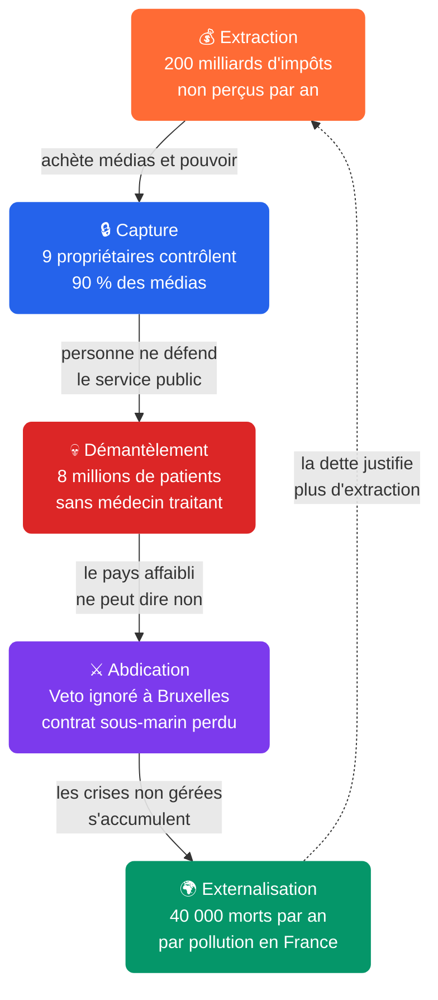

# 🔄 Le Changement de Régime : Pourquoi ce système ne peut pas se réformer

*🔄 Le constat que personne en haut ne changera rien. La démonstration que le verrouillage est structurel. Et ce que ça implique pour le reste.*

*📖 Cet article principal articule 16 articles sur l'enquête **Le Changement de Régime**.*

---

## §0 : La question qu'on ne pose jamais

La France cumule des crises systémiques simultanées : dette à 115,6 % du PIB, services publics démantelés, pauvreté à 15,4 %, abstention à 57 %, hôpital qui craque, école qui chute, agriculture qui saigne, défense qui recule, médias verrouillés, climat ignoré. Chaque article de cette série a documenté une facette de l'effondrement. Chacun a nommé ses responsables et ses mécanismes.

> **Le système français peut-il se réformer de l'intérieur ?**

La réponse est non. Non par pessimisme, non par idéologie, mais par construction logique : les 5 tensions structurelles identifiées dans cette enquête forment un système de verrouillage par contraintes croisées. Chaque réforme d'une tension est neutralisée par les quatre autres, non par malveillance mais parce que les mécanismes de correction supposeraient des contre-pouvoirs qui ont été neutralisés. Ce verrouillage n'est pas éternel : des chocs exogènes (crise de la dette, crise politique, pression sociale) pourraient le briser. Mais il n'existe aujourd'hui aucun mécanisme endogène de sortie. C'est une construction, pas une fatalité : elle peut se défaire par le même chemin qu'elle s'est faite : la lucidité collective.

---

## §1 : Les 5 parois du piège

Les 5 tensions ne sont pas des problèmes parallèles. Elles sont liées en cascade causale : l'extraction nourrit la capture, la capture permet le démantèlement, le démantèlement affaiblit le pays et force l'abdication, l'abdication empêche toute résilience : les crises non gérées creusent la dette qui justifie plus d'extraction.

### Tension 1 : Extraction : ~200 milliards de recettes publiques non perçues chaque année

**~200 milliards d'euros par an. L'équivalent de 1,3 fois le déficit public annuel, soit le budget de l'Éducation, de la Défense et de la Justice réunis, et plus encore.**

Cette somme se décompose en quatre flux distincts, de natures juridiques différentes, dont le point commun est de vider les caisses de l'État :

**Évasion fiscale** (fraude illégale + optimisation agressive) : **80 à 100 Md€/an** (CCFD, Oxfam). L'argent passe par les paradis fiscaux, les prix de transfert, les montages offshore. Le fisc en récupère 12 % selon l'IGF. Le PNF a traité 203,9 millions en 2024 : 0,2 % de ce flux.

**Niches fiscales** : **90 à 100 Md€/an** (Cour des comptes). 470 mesures dérogatoires votées par le Parlement, dont une partie n'a jamais été évaluée pour son efficacité économique ou sociale. Certaines sont défendables, d'autres sont des rentes héritées du lobbying.

**Baisses d'impôts structurelles** depuis 2017 (suppression de l'ISF, flat tax à 30 %, baisse de l'IS de 33 % à 25 %) : **40 à 50 Md€/an** de recettes non perçues (Haut Conseil des Finances Publiques).

**Gaspillage public** : **24 à 48 Md€/an**. Ce flux total se décompose en deux sous-ensembles de nature différente :

- **Gaspillage « actif » (4 à 8 Md€/an)** : projets informatiques inaboutis (Scribe : 257 M€), erreurs de versement CAF (6,3 Md€), dépenses de conseil externalisé (2,5 Md€ en 2021), fonds Marianne (2,5 M€). La partie émergée d'un ICEBERG.

- **Gaspillage institutionnel (20 à 40 Md€/an)** : 434 opérateurs d'État (64 Md€, 14,5 Md€ économisables), 35 000 communes qui doublonnent avec les intercommunalités (7,5 Md€, rapport Ravignon), 53 Md€ de subventions associatives sans contrôle (3 à 10 Md€ récupérables), 101 préfectures en concurrence avec 101 départements (4,96 Md€ AGTE, 1,5 à 2,5 Md€ économisables), et ~1 Md€ pour trois assemblées (Sénat 358 M€, AN 600 M€, CESE 45 M€) à l'efficacité déclinante.

Ces quatre flux ne sont pas purement additifs : une partie de l'optimisation classée dans l'évasion recoupe ce que la Cour des comptes appelle niches. Mais leur ordre de grandeur agrégé est sans ambiguïté : **l'État perd chaque année davantage que son déficit, parce qu'il a renoncé à capter sa propre richesse.**

### Tension 2 : Capture : cet argent achète le silence

**~200 milliards ne disparaissent pas sans laisser de trace. Ils achètent des médias, des fauteuils et des juges.**

9 propriétaires privés contrôlent 90 % de l'audience médiatique nationale (Arcom, baromètre du pluralisme 2024). Bolloré possède Canal+, CNews, C8, Europe 1, le JDD, Paris Match : plus de 200 journalistes ont quitté ses rédactions. Niel contrôle Le Monde. Drahi possédait BFM TV. Arnault possède Les Échos. **Les ultra-riches qui bénéficient de l'impunité fiscale possèdent les médias qui forment l'opinion.**

Au Parlement : 28 recours au 49.3 en 7 ans, 120 ordonnances, 90 % des lois adoptées sans vote (CEVIPOF). À la justice : 0,20 % du PIB contre 0,30 % de moyenne européenne (CEPEJ), 11,2 magistrats pour 100 000 habitants contre 21 en moyenne. Et 40 conventions d'impunité qui permettent aux entreprises de s'acheter l'impunité.

**100 euros de RSA fraudé : poursuivis. 100 millions d'évasion fiscale : une convention d'impunité.**

### Tension 3 : Démantèlement : personne ne peut défendre le service public

**Les caisses sont vides (T1). Personne ne peut protester (T2). Les services publics crèvent, méthodiquement.**

**Santé :** 8 millions de Français sans médecin traitant (CNAM, 2025). 55 % de la population en zone sous-dotée. 100 000 lits d'hospitalisation supprimés en 20 ans.

**École :** −43 points en mathématiques PISA, la plus forte baisse de l'OCDE. La France est 23e sur 81 pays. 25 % des élèves n'atteignent pas le niveau attendu en lecture à l'entrée en sixième.

**Logement :** 4,2 millions de mal-logés, 330 000 sans-domicile (Fondation Abbé Pierre). Le 115 a refusé 61 % des demandes d'hébergement. 735 morts à la rue en 2023.

**Ce n'est pas un échec de politique : les gouvernements passent, la mécanique reste. Le démantèlement est la conséquence d'un système qui transfère les ressources du public vers le privé depuis 40 ans.**

### Tension 4 : Abdication : le pays affaibli ne peut dire non

**Un pays dont les caisses sont vides et les institutions verrouillées ne peut résister aux pressions extérieures.**

**Diplomatie :** la France vote contre l'UE-Mercosur. L'accord est signé quand même : le Coreper contourne son veto par majorité qualifiée. La PAC verse 55 Md€ par an, dont 50,5 dans des comptes opaques que 6 anciens ministres lobbyistes font tourner à Bruxelles.

**Défense :** l'Australie annule le contrat du siècle : 56 Md€, 12 sous-marins : pour rejoindre l'alliance anglo-saxonne sans prévenir Paris. Les stocks de munitions tiendraient quelques semaines (AN n°1890, sept. 2025). La guerre Iran-États-Unis de 2026 l'a confirmé : les missiles MICA des Rafale aux EAU épuisés en semaines (La Tribune).

**Industrie :** déficit commercial de 81 Md€. La France retire 5 500 soldats du Sahel sans résultat. 11e rang militaire mondial (Global Firepower 2024).

**La France conserve les attributs de la puissance : dissuasion nucléaire, siège à l'ONU, 3e exportateur d'armement. Elle a perdu la capacité de les convertir en influence.**

### Tension 5 : Externalisation : les crises non gérées deviennent la dette de demain

**L'impuissance stratégique (T4) rend toute résilience impossible. Les crises qu'on ne règle pas aujourd'hui s'accumulent en dette pour demain.**

**Climat :** 11 Md€ par an de subventions aux énergies fossiles. Les émissions de GES baissent de 1,5 % par an : au rythme actuel, la France mettrait 70 ans pour atteindre ses objectifs climatiques.

**Pollution :** 40 000 décès prématurés par an en France (Santé Publique France), 9 millions dans le monde (Lancet Commission). Un décès sur six. Quinze fois plus que toutes les guerres réunies. Aucun traité, aucun fonds.

**Agriculture :** première puissance agricole d'Europe, mais un suicide d'agriculteur tous les deux jours. 100 000 fermes disparues en dix ans (Agreste). Des sécheresses qui coûtent des milliards.

**Numérique :** 70 % des données françaises sur serveurs américains (CNIL). Les GAFAM réalisent 20 à 30 Md€ de CA en France en payant 5 à 10 % d'impôt. L'Éducation nationale a confié 12 millions d'élèves à Microsoft pour 152 M€ : sous droit américain, sans mandat français. Deux projets de cloud souverain (Cloudwatt, Numergy) ont échoué faute de marché public captif, et en 2026, 52 millions de Français ont fui dans le mégaleak IDMerit — des données que la France ne maîtrise même pas.

**Ces crises ne sont pas séparables. Elles sont le refus d'investir dans l'avenir : l'argent qui aurait dû servir a été transféré ailleurs, depuis le début. La boucle se referme sur T1 : les crises non gérées creusent la dette, la dette justifie plus d'extraction, l'extraction alimente la capture.**

---

## §2 : Le test des 3 réformes

3 réformes évidentes. 3 murs différents. La même cage.

### Rétablir l'ISF

**3 à 5 milliards d'euros par an offerts aux 0,1 % les plus riches. Rétablir l'impôt sur la fortune serait simple à mettre en oeuvre. Mais le débat ne peut pas avoir lieu.**

Il ne peut pas. 9 propriétaires privés contrôlent 90 % de l'audience médiatique : ce sont exactement ceux qui paieraient l'ISF rétabli. Un débat dans leurs médias serait un débat sur leur propre impôt. Il n'a pas lieu.

**Le piège : la capture des médias (T2) verrouille la question avant même qu'elle soit posée.**

### Protéger l'agriculture

**100 000 fermes disparues en dix ans, un suicide d'agriculteur tous les deux jours. Protéger le marché français par des barrières douanières est une évidence. Mais la France ne décide plus seule.**

Elle a voté contre l'UE-Mercosur : l'accord a été signé quand même, le Coreper a contourné son veto par majorité qualifiée. Même la PAC (55 Md€/an) cache 50,5 milliards dans des comptes opaques où 6 anciens ministres lobbyistes pèsent sur les décisions.

**Le piège : l'abdication de souveraineté (T4) empêche d'agir, même quand la volonté politique existe.**

### Soigner la santé

**8 millions de Français sans médecin traitant, 100 000 lits d'hôpital supprimés. Engager des médecins coûte de l'argent. Mais les caisses sont vides.**

200 milliards d'euros par an non perçus : évasion fiscale (80-100 Md€), niches (90-100 Md€), baisses d'impôts depuis 2017 (40-50 Md€). L'argent qui aurait dû financer l'hôpital a été systématiquement transféré ailleurs.

**Le piège : l'extraction (T1) vide les caisses, le démantèlement (T3) transforme le manque en catastrophe humaine. La boucle est bouclée.**

---

Trois réformes, trois murs. Mais la cage est la même : le système est conçu pour que chaque issue de secours soit verrouillée par une autre pièce du système.

## §3 : La révélation : un choix politique, pas une fatalité

**Chaque mécanisme du piège a été construit par une décision politique spécifique. Aucune n'était obligatoire.**

**Supprimer l'ISF (2018)** : 3 à 5 milliards par an transférés des caisses de l'État vers les 0,1 %. Rien n'y obligeait.

**Instaurer la flat tax à 30 % (2018)** : le capital paie désormais moins que le travail pour les hauts revenus. Rien n'y obligeait.

**Utiliser le 49.3 28 fois en 7 ans** : 90 % des lois adoptées sans vote parlementaire. Rien n'y obligeait.

**Permettre aux entreprises de s'acheter l'impunité** : 40 conventions signées depuis 2017, zéro procès, zéro condamnation. Rien n'y obligeait.

**Laisser 9 propriétaires contrôler 90 % des médias** : le débat public confisqué par une poignée de milliardaires. Rien n'y obligeait.

Ces décisions ne sont pas des accidents. Elles ne sont pas le produit de circonstances imprévues. Chacune a été votée, signée, appliquée parce qu'elle servait les intérêts de ceux qui décident.

**Ce qui est construit par des choix peut être défait par d'autres choix. C'est en cela que le système n'est pas une fatalité. C'est en cela qu'il est un choix politique.**

---

## §4 : Les leviers qui existent

Les solutions ne sont pas à inventer. Elles existent, documentées par la Cour des comptes, le Conseil d'État, des commissions parlementaires. Elles sont appliquées ailleurs en Europe. Ce qui manque n'est pas la connaissance : c'est la volonté politique.

### Rétablir l'impôt sur la fortune

**Le levier** : rétablir l'ISF sur le capital mobilier (supprimé en 2018) et supprimer la flat tax à 30 % sur les revenus du capital.

**L'impact** : 3 à 5 milliards d'euros supplémentaires par an pour l'ISF, 2 à 3 milliards pour la flat tax. Au total, 5 à 8 milliards qui retournent dans les caisses de l'État.

**Le précédent** : la Norvège et la Suisse appliquent un impôt sur la fortune avec un recouvrement efficace. L'Espagne a rétabli le sien en 2022.

**Techniquement possible. Politiquement refusé.**

### Imposer les ultra-riches à leur taux réel

**Le levier** : instaurer un taux minimum d'imposition de 30 % sur l'ensemble des revenus des plus hauts contribuables, y compris dividendes et plus-values (aujourd'hui taxés à 30 % via le prélèvement forfaitaire unique).

**L'impact** : 15 à 25 milliards d'euros supplémentaires par an, selon l'Institut des Politiques Publiques et Oxfam.

**Le précédent** : l'OCDE prépare un impôt minimum mondial pour les ultra-riches (proposition 2025). Les États-Unis appliquent déjà un taux minimum de 15 % aux grandes entreprises.

**Techniquement possible. Politiquement refusé.**

### Limiter la concentration des médias

**Le levier** : une loi anti-concentration fixant un plafond d'audience maximale par propriétaire, avec un contrôle indépendant par l'Arcom renforcée.

**L'impact** : 9 propriétaires ne contrôleraient plus 90 % de l'audience. Le pluralisme réel de l'information garanti par la loi, pas par le bon vouloir des milliardaires.

**Le précédent** : l'Allemagne limite la part d'audience télévisuelle à 25 % par groupe. Les Pays-Bas interdisent la propriété croisée entre presse écrite et télévision.

**Techniquement possible. Politiquement refusé.**

### Donner les moyens à la justice

**Le levier** : augmenter le budget de la justice de 0,20 % à 0,31 % du PIB (moyenne de l'Union européenne), et supprimer les conventions qui permettent aux entreprises de s'acheter l'impunité pour fraude fiscale.

**L'impact** : +55 % du budget de la justice, soit environ 3 milliards d'euros supplémentaires par an. Des moyens pour juger les fraudes au lieu de les solder par des amendes.

**Le précédent** : l'Allemagne consacre 0,45 % de son PIB à la justice et son taux de condamnation pour fraude fiscale y est quatre fois plus élevé.

**Techniquement possible. Politiquement refusé.**

Ces quatre leviers ne sont pas des solutions miracles. Ce sont des directions documentées, chiffrées, testées ailleurs. Leur point commun : ils menacent ceux qui bénéficient du statu quo. C'est pourquoi ils ne sont pas appliqués.

Mais le fait qu'ils soient bloqués aujourd'hui ne signifie pas qu'ils le seront toujours. Les systèmes changent quand les rapports de force changent. Et les rapports de force changent quand l'information circule.

---

## §5 : La résilience comme seul chemin

Si le système ne peut pas se réformer de l'intérieur dans les conditions actuelles, que reste-t-il ?

La réponse n'est pas une solution politique : ce serait une contradiction avec le verdict de cette enquête. La réponse est un constat : les alternatives existent déjà, concrètes, testées, documentées. Mais elles sont locales, fragmentées, invisibles dans le débat national verrouillé.

**2000 AMAP et 3000 fermes du réseau DEPHY** prouvent qu'on peut réduire les pesticides de 50 % sans perte de rendement. Les circuits courts représentent 12 % des achats alimentaires des Français et créent trois fois plus d'emplois que la grande distribution. L'agroécologie n'attend pas la PAC.

**Nextcloud, Matrix, Mastodon, Framasoft** : des alternatives libres aux GAFAM, utilisées par des milliers d'organisations. La Gendarmerie nationale a migré 72 000 postes vers Ubuntu. OVHcloud, Scaleway et Outscale montrent qu'un cloud européen existe.

**L'Eusko au Pays basque** (4 000 usagers, 1 000 entreprises), la Gonette à Lyon, le Sol-Violette à Toulouse : des monnaies locales qui créent des circuits économiques hors du verrouillage financier. Enercoop et les centrales villageoises produisent une électricité qui n'appartient pas aux oligopoles.

**Mediapart, Forbidden Stories, Arrêt sur images** enquêtent et décryptent là où les 9 propriétaires verrouillent. Leurs statuts (fonds de dotation, coopérative, abonnement sans pub) les rendent structurellement inachetables. Les budgets participatifs de Paris, Grenoble et Rennes impliquent des centaines de milliers de citoyens dans la décision publique.

**Les chaînes YouTube, podcasts et newsletters indépendants** captent chaque année des parts d'audience que les géants historiques ne regagneront pas. Une génération s'informe sur Telegram, Substack et Twitch, en ayant déjà contourné les 9 propriétaires sans leur demander la permission. Le verrouillage médiatique tient encore sur les institutions, pas sur les usages.

**À Vienne, 60 % du parc locatif est social ou subventionné** sans ghettoïsation. **Singapour a bâti 80 % de propriétaires** via un fonds d'épargne-logement obligatoire. **La Finlande obtient de meilleurs résultats PISA** avec un budget comparable en investissant dans la formation des enseignants et l'autonomie des établissements. Ces modèles existent, ils ne sont pas théoriques.

Le changement ne viendra pas d'en haut. Il viendra du constat que d'en haut, personne ne changera. Cette enquête n'appelle pas à une solution particulière : elle établit un diagnostic. Le système ne peut pas se guérir lui-même quand les verrous institutionnels, médiatiques et fiscaux sont actionnés par ceux qui bénéficient du statu quo.

Le reste appartient à ceux qui lisent, comprennent et décident.

**Ces deux textes prolongent le diagnostic par l'action :**

- **« [L'Adieu aux partis](https://giak.substack.com/p/ladieu-aux-partis-du-diagnostic-de) »** : le levier institutionnel : RIC, tirage au sort, OS démocratique souverain. Comment changer les règles du jeu.
- **« [Le Protocole du ré-enracinement](https://giak.substack.com/p/le-protocole-du-re-enracinement) »** : le levier personnel : 6 étapes pour cesser d'alimenter la machine. Comment changer sa vie.

L'un ne va pas sans l'autre. Changer le système sans changer sa vie, c'est remplacer un maître par un autre. Changer sa vie sans changer le système, c'est cultiver son jardin pendant que la forêt brûle.

---

*📖 **Article suivant :** 👑 La Caste Parasite : 20 familles, 704 milliards, la classe qui a verrouillé le système https://giak.substack.com/p/la-caste-parasite-qui-gouverne-la*
*📖 **Article précédent :** 💻 Le Numérique colonisé : 70 % des données françaises sur serveurs américains [LIEN_A_INSERER]*

---

## Note sur le travail d'enquête

Ce texte est la synthèse d'un travail de **cinq jours** (23-27 mai 2026) qui a produit 16 articles et ce HUB de synthèse. Il s'appuie sur **37 enquêtes complexes** produites par le protocole Truth Engine, un pipeline forensique en 19 étapes qui combine analyse symbolique, vérification multi-source et cartographie des verrous systémiques. Ces enquêtes ont alimenté **86 articles publiés** depuis novembre 2025.

**Méthode.** Chaque enquête suit le pipeline Truth Engine : analyse symbolique du discours dominant (15 symboles scorés de 0 à 10 : gaslighting, framing, capture, inversion, etc.) → cartographie des clusters de manipulation → chronologie forensique → domaines d'impact avec faits marqués ✦ → cartographie systémique du réseau d'acteurs et boucles de rétroaction → chaînes causales quantifiées (≥3 maillons par chaîne, minimum 2 chaînes par enquête) → registre de preuves complet (FACT_REGISTRY avec dates, acteurs, chiffres, URLs, fiabilité) → carte dialectique à 3 perspectives (économique, critique, arbitrage) → identification des loups (acteurs nommément désignés) → scope et limitations → vérification multi-domaine.

**Vérification.** Chaque fait est sourcé avec son URL publique. Les articles ont été soumis à des audits critiques automatisés qui traquent incohérences, biais de framing et sauts logiques. Les corrections issues de ces audits ont été intégrées.

**Volume.** 16 articles, 37 enquêtes, 704 faits vérifiés, environ 120 000 mots. Chacun peut se lire indépendamment. Mais leur force est dans l'accumulation : un fait seul peut être contesté, vingt faits convergents de sources différentes forment une preuve. Le HUB condense cette masse en un diagnostic : le système est verrouillé par ceux qui en bénéficient, la réforme par le haut est une contradiction dans les termes.

**Limite.** Cette enquête est un diagnostic, pas un programme. Les deux textes recommandés en conclusion ouvrent des pistes, l'une institutionnelle, l'autre personnelle. Le reste appartient à ceux qui lisent, comprennent et décident.

---

## Sources

*Le détail complet des sources par thématique (centaines de références) se trouve dans les articles individuels S1 à S16. La section ci-dessous ne reprend que les sources directement citées dans cette synthèse.*

1. **CEVIPOF** : Baromètre de la confiance politique, vague 17, 2026, 57 % d'abstention, 22 % de confiance : [https://www.sciencespo.fr/cevipof/](https://www.sciencespo.fr/cevipof/)
2. **European Tax Observatory** : Global Tax Evasion Report 2024, évasion fiscale 80-100 Md€/an : [https://www.taxobservatory.eu/publication/global-tax-evasion-report-2024/](https://www.taxobservatory.eu/publication/global-tax-evasion-report-2024/)
3. **Monde Diplomatique** : Cartographie des médias français, concentration propriétariale : [https://www.monde-diplomatique.fr/cartes/medias](https://www.monde-diplomatique.fr/cartes/medias)
4. **Arcom** : Baromètre du pluralisme 2024, 9 groupes = 90 % de l'audience médiatique nationale : [https://www.arcom.fr/nos-ressources/etudes-et-publications/pluralisme-politique](https://www.arcom.fr/nos-ressources/etudes-et-publications/pluralisme-politique)
5. **Assemblée Nationale** : Recours au 49.3, 28 depuis 2022 (23 sous Borne, 5 sous Barnier/Bayrou/Lecornu) : [https://www.assemblee-nationale.fr/dyn/49-3](https://www.assemblee-nationale.fr/dyn/49-3)
6. **CEPEJ (Conseil de l'Europe)** : Rapport 2024, budgets justice 0,20 % PIB France vs 0,30 % moyenne européenne : [https://www.coe.int/fr/web/cepej](https://www.coe.int/fr/web/cepej)
7. **INSEE** : Dette publique 3 228 Md€, déficit 5,5 % du PIB, charge 55 Md€ : [https://www.insee.fr/fr/statistiques/8292976](https://www.insee.fr/fr/statistiques/8292976)
8. **INSEE** : Bilan démographique 2025, ICF 1,56, moins de 650 000 naissances : [https://www.insee.fr/fr/statistiques/8719824](https://www.insee.fr/fr/statistiques/8719824)
9. **Cour des comptes** : CICE, 57 Md€ sans conditionnalité, 2023 : [https://www.ccomptes.fr/fr/plateformes-citoyennes/plateforme-evaluations-politique-publique/explorer-evaluations-273](https://www.ccomptes.fr/fr/plateformes-citoyennes/plateforme-evaluations-politique-publique/explorer-evaluations-273)
10. **Cour des comptes** : Niches fiscales, 60 Md€ de dépenses fiscales inefficaces, 2024 : [https://www.ccomptes.fr/fr/publications/la-depense-fiscale](https://www.ccomptes.fr/fr/publications/la-depense-fiscale)
11. **Loi n° 2017-1837** : Suppression ISF sur capital mobilier, 9 Md€ exclus du barème (Loi de finances 2018) : [https://www.legifrance.gouv.fr/jorf/id/JORFTEXT000036171996/](https://www.legifrance.gouv.fr/jorf/id/JORFTEXT000036171996/)
12. **Loi n° 2018-120** : Flat tax à 30 % sur les revenus du capital (PFU) : [https://www.legifrance.gouv.fr/jorf/id/JORFTEXT000037123777/](https://www.legifrance.gouv.fr/jorf/id/JORFTEXT000037123777/)
13. **Transparency International** : Corruption Perceptions Index 2025, France 66/100, plus bas niveau historique : [https://www.transparency.org/en/cpi/2025](https://www.transparency.org/en/cpi/2025)
14. **PNF (Parquet National Financier)** : 40 conventions d'impunité (ex-CJIP) signées depuis 2017 : [https://www.tribunal-de-paris.justice.fr/paris/le-parquet-national-financier](https://www.tribunal-de-paris.justice.fr/paris/le-parquet-national-financier)
15. **Ministère de la Justice** : 77 500 détenus pour 62 000 places, 125 % d'occupation : [https://www.justice.gouv.fr/documentation/etudes-et-statistiques](https://www.justice.gouv.fr/documentation/etudes-et-statistiques)
16. **HATVP** : Pantouflage multiplié par trois, zéro condamnation en 2024 : [https://www.hatvp.fr/actualites/rapport-annuel-dactivite-2024/](https://www.hatvp.fr/actualites/rapport-annuel-dactivite-2024/)
17. **Lancet Commission** : Pollution and health, 2022, 9 millions de morts prématurés/an dans le monde : [https://www.thelancet.com/commissions/pollution-and-health](https://www.thelancet.com/commissions/pollution-and-health)
18. **OCDE** : Programme PISA 2022, résultats France en baisse continue : [https://www.oecd.org/fr/publications/resultats-du-pisa-2022-volume-i_165f1d07-fr/](https://www.oecd.org/fr/publications/resultats-du-pisa-2022-volume-i_165f1d07-fr/)
19. **Commission européenne** : EU Agricultural Outlook 2024-2035, PAC 55 Md€/an : [https://agriculture.ec.europa.eu/media/news/eu-agricultural-outlook-2024-35](https://agriculture.ec.europa.eu/media/news/eu-agricultural-outlook-2024-35)
20. **Douanes françaises** : Déficit commercial 81 Md€, désindustrialisation continue : [https://www.douane.gouv.fr/statistiques](https://www.douane.gouv.fr/statistiques)
21. **Assemblée Nationale** : Avis budgétaire PLF 2026, stocks de munitions pour quelques semaines : [https://www.assemblee-nationale.fr/dyn/17/rapports/cion_def/l17b1890-ti_rapport-avis](https://www.assemblee-nationale.fr/dyn/17/rapports/cion_def/l17b1890-ti_rapport-avis)
22. **Vie-publique.fr** : Rupture du contrat des sous-marins australiens (septembre 2021) : [https://www.vie-publique.fr/en-bref/281691](https://www.vie-publique.fr/en-bref/281691)
23. **Global Firepower 2024** : France 11e puissance militaire mondiale : [https://www.globalfirepower.com/country-military-strength-detail.php?country_id=france](https://www.globalfirepower.com/country-military-strength-detail.php?country_id=france)
24. **DREES** : Dépenses de santé, reste à charge des ménages, déserts médicaux : [https://drees.solidarites-sante.gouv.fr/](https://drees.solidarites-sante.gouv.fr/)
25. **Réseau AMAP / Ministère de l'Agriculture** : 2 000 AMAP, 12 % des achats alimentaires en circuits courts : [https://www.reseau-amap.org/](https://www.reseau-amap.org/)
26. **Euskal Moneta** : Monnaie locale Eusko, 4 000 usagers, 1 000 entreprises : [https://www.euskalmoneta.org/](https://www.euskalmoneta.org/)
27. **Mediapart** : 245 000 abonnés, fonds de dotation pour une presse libre, capital inviolable : [https://www.mediapart.fr/](https://www.mediapart.fr/)
28. **Framasoft** : Alternatives libres (Nextcloud, PeerTube, Mobilizon), 72 000 postes Gendarmerie migrés vers Ubuntu : [https://framasoft.org/](https://framasoft.org/)
29. **Johns Hopkins University** (MacLean et al., 2011) : Psilocybine et augmentation durable du trait Ouverture chez l'adulte : *Journal of Psychopharmacology*
30. **Simone Weil** (1943, 1949) : *L'Enracinement*, prélude à une déclaration des devoirs envers l'être humain
31. **Mission parlementaire Danon** : 434 opérateurs d'État, 64 Md€, 14,5 Md€ d'économies potentielles, 2024 : [https://www.vie-publique.fr/rapport/294072-operateurs-de-letat-mission-danon](https://www.vie-publique.fr/rapport/294072-operateurs-de-letat-mission-danon)
32. **Rapport Ravignon** : Doublons communes-intercommunalités, 7,5 Md€/an, 2024 : [https://www.vie-publique.fr/rapport/293673-rapport-ravignon-sur-la-decentralisation](https://www.vie-publique.fr/rapport/293673-rapport-ravignon-sur-la-decentralisation)
33. **IGF-Igésr** : Premier rapport d'évaluation des subventions aux associations, 53 Md€, 2024 : [https://www.igas.gouv.fr/IMG/pdf/2024-008r_rapport_igf-igesr_evaluation_depenses_associations.pdf](https://www.igas.gouv.fr/IMG/pdf/2024-008r_rapport_igf-igesr_evaluation_depenses_associations.pdf)
34. **PLF 2025** : Mission AGTE 4,96 Md€, hausse de 124 % depuis 2006 : [https://www.budget.gouv.fr](https://www.budget.gouv.fr)
35. **Sénat** : Budget 2025, 358 M€ pour 348 sénateurs : [https://www.senat.fr/notice/2024/2024-2025-budget-du-senat.html](https://www.senat.fr/notice/2024/2024-2025-budget-du-senat.html)
36. **Assemblée Nationale** : Budget 2025, ~600 M€ pour 577 députés : [https://www.assemblee-nationale.fr/dyn/depenses](https://www.assemblee-nationale.fr/dyn/depenses)
