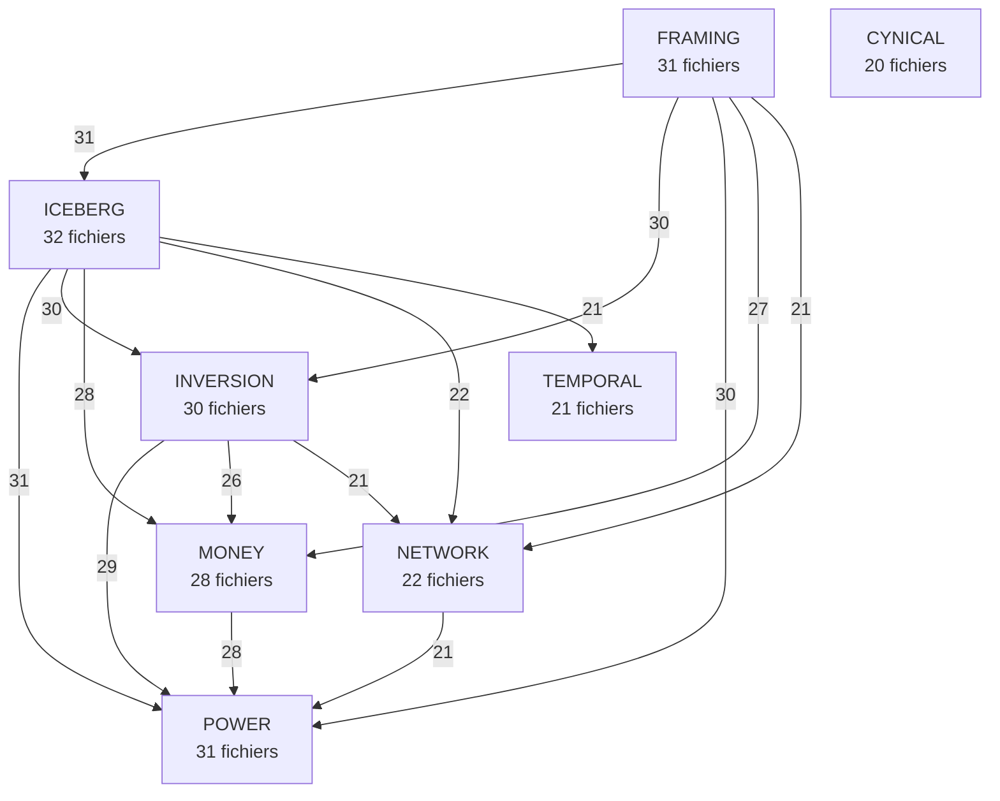

# GRAPHE DE SATURATION — CORPUS TRUTH ENGINE

**Date :** 2026-07-09 | **Méthode :** extraction Python + Mermaid

**100 dossiers KERNEL, 112 posts Substack, 212 unités documentaires.**

## 1. Cooccurrence des symboles

Les arêtes montrent quels symboles apparaissent ensemble dans les mêmes fichiers. Épaisseur = fréquence.

```mermaid
graph TD
    %% Cooccurrence des symboles — corpus Truth Engine (100 dossiers)

    Ξ[Ξ<br/>Iceberg<br/>45 fichiers]
    Λ[Λ<br/>Framing<br/>44 fichiers]
    €[€<br/>Money<br/>43 fichiers]
    Ω[Ω<br/>Inversion<br/>42 fichiers]
    ↕[↕<br/>Power<br/>39 fichiers]
    🌐[🌐<br/>Network<br/>29 fichiers]
    Κ[Κ<br/>Cynical<br/>26 fichiers]
    ⏰[⏰<br/>Temporal<br/>26 fichiers]

    Λ -->|44| Ξ
    Ξ -->|43| €
    Λ -->|42| Ω
    Λ -->|42| €
    Ξ -->|42| Ω
    Ω -->|40| €
    Ξ -->|39| ↕
    Λ -->|38| ↕
    € -->|37| ↕
    Ω -->|36| ↕
    Ξ -->|29| 🌐
    ↕ -->|29| 🌐
    Λ -->|28| 🌐
    Ω -->|28| 🌐
    € -->|28| 🌐
    Κ -->|26| Λ
    Κ -->|26| Ξ
    Κ -->|26| Ω
    Κ -->|26| ↕
    Ξ -->|26| ⏰
```

---

## 2. Hiérarchie des clusters

Les arêtes montrent quels clusters cooccurrent. Épaisseur = fréquence.



---

## 3. Architecture du corpus

Vue en 3 strates : secteurs → clusters → symboles.

```mermaid
graph TB
    %% Architecture du corpus Truth Engine — 100 dossiers KERNEL APEX

    subgraph STRATE_1["Strate 1 : Secteurs couverts (23)"]
        A1[Énergie/Nucléaire]
        A2[Agriculture]
        A3[Eau/Veolia]
        A4[Pharma/Santé]
        A5[Banques]
        A6[Assurances/Mutuelles]
        A7[Télécoms]
        A8[Défense/Armement]
        A9[Retraites]
        A10[Immobilier]
        A11[Luxe]
        A12[Automobile]
        A13[Aéronautique]
        A14[Alimentation]
        A15[Distribution]
        A16[Sport/PSG]
        A17[Narcotrafic]
        A18[BTP/Concessions]
        A19[Épargne]
        A20[Forêts/Biodiversité]
        A21[Pêche]
        A22[Protection Sociale]
        A23[Police]
    end

    subgraph STRATE_2["Strate 2 : Clusters dominants"]
        B1[ICEBERG<br/>30 fichiers]
        B2[MONEY<br/>27 fichiers]
        B3[POWER<br/>28 fichiers]
        B4[FRAMING<br/>27 fichiers]
        B5[INVERSION<br/>26 fichiers]
        B6[NETWORK<br/>20 fichiers]
        B7[CYNICAL<br/>17 fichiers]
        B8[TEMPORAL<br/>17 fichiers]
    end

    subgraph STRATE_3["Strate 3 : Symboles (EDI moyen 0.62)"]
        C1[Ξ ICEBERG<br/>57%% couverture]
        C2[€ MONEY<br/>53%% couverture]
        C3[↕ POWER<br/>48%% couverture]
        C4[Λ FRAMING<br/>54%% couverture]
        C5[Ω INVERSION<br/>52%% couverture]
    end

    A1 --> B1
    A2 --> B1
    A3 --> B1
    A4 --> B2
    A5 --> B2
    A6 --> B2
    B1 --> C1
    B2 --> C2
    B3 --> C3
    B4 --> C4
    B5 --> C5

    CORPORA["112 posts Substack<br/>+ 100 dossiers KERNEL<br/>= 212 unités"]
    CORPORA -.-> STRATE_1
```



---

*Graphes générés automatiquement — rendus dans tout visualiseur Mermaid (GitHub, VS Code, mermaid.live).*
