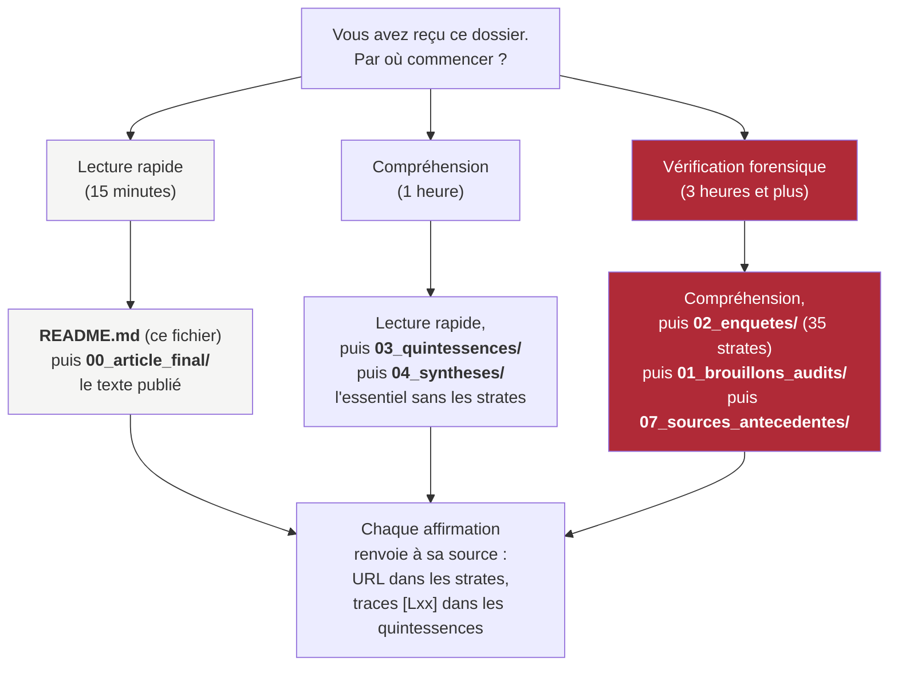
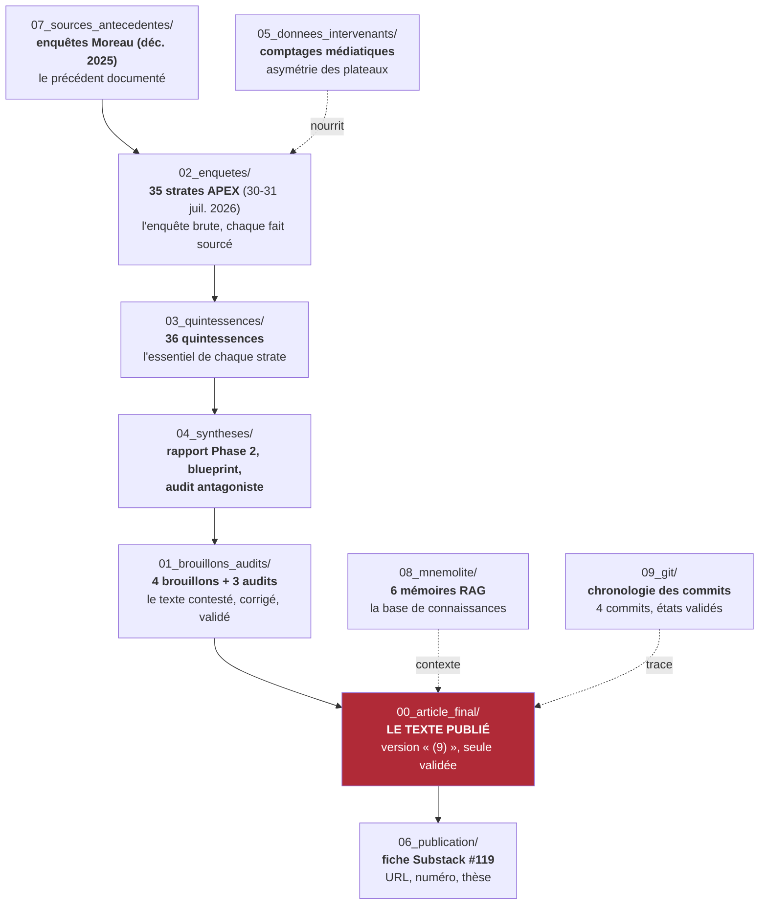
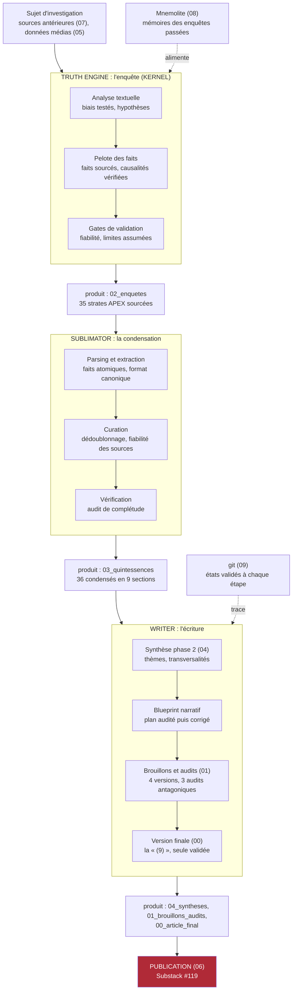

# Dossier complet : « Du « narratif » à l'ingérence : le seuil Fedorova »

## L'affaire en dix lignes

Xenia Fedorova, ancienne directrice de RT France (la chaîne d'État russe en français), est devenue chroniqueuse sur CNews et Europe 1. Le 29 juillet 2026, le gouvernement signe un arrêté d'expulsion contre elle ; le lendemain, un gel de ses avoirs est signé au titre de l'ingérence étrangère. En deux mois, la parole de cette journaliste est passée, côté français, de la tolérance (Barrot, le 29 mai : « on peut mentir sans finir au goulag ») à la contrainte administrative.

L'article publié, [disponible en ligne](https://giak.substack.com/p/du-narratif-a-lingerence-le-seuil) (Substack, 31 juillet 2026), enquête sur ce basculement. Sa thèse : l'État n'a pas rendu publique la chaîne de preuve qui transforme une parole contestable en ingérence étrangère ; la qualification n'est pas sa propre preuve. Le précédent Moreau (décembre 2025) illustre la logique des deux poids, deux mesures selon le passeport : Xavier Moreau, français, a été sanctionné par l'UE mais ne peut être expulsé ; Fedorova, russe, le peut.

Ce dossier contient toute la matière qui a produit cet article : 35 investigations sourcées, leurs condensés, les versions successives du texte et les audits qui l'ont corrigé.

## Sommaire

- [L'affaire en dix lignes](#affaire)
- [Comment ouvrir les fichiers](#ouvrir)
- [Comment lire ce dossier](#lire)
- [Schémas de navigation](#schemas)
- [Détail dossier par dossier](#detail)
  - [00_article_final - le texte publié](#d00)
  - [01_brouillons_audits - les versions intermédiaires et leurs critiques](#d01)
  - [02_enquetes - l'enquête brute, le cœur du travail](#d02)
  - [03_quintessences - l'essentiel de chaque enquête](#d03)
  - [04_syntheses - la synthèse, le plan narratif, l'audit du plan](#d04)
  - [05_donnees_intervenants - les comptages médiatiques](#d05)
  - [06_publication - la trace de la publication](#d06)
  - [07_sources_antecedentes - les enquêtes antérieures citées](#d07)
  - [08_mnemolite - les données de la base de connaissances](#d08)
  - [09_git - la chronologie des commits](#d09)
- [Petit lexique](#lexique)
- [Fiche signalétique du dossier](#fiche)
- [Note de méthode sur ce dossier](#methode)

## Comment ouvrir les fichiers

Tous les documents du dossier sont au format Markdown (`.md`), un format de texte standard. Un navigateur web n'affiche pas ce format avec sa mise en forme : il faut un lecteur Markdown, gratuit ou à essai :

- **Obsidian** (Windows/Mac/Linux, gratuit) : recommandé pour ce dossier, les liens de navigation s'y ouvrent d'un simple clic.
- **VS Code** (Windows/Mac/Linux, gratuit).
- **Typora** (Windows/Mac/Linux, essai gratuit).

Le README que vous lisez est le point d'entrée : les noms de fichiers en bleu sont des liens, cliquez dessus pour ouvrir le document. Sans lecteur Markdown, le Bloc-notes ou TextEdit affichera le texte brut, sans mise en forme ni liens.

## Comment lire ce dossier

Vous avez entre les mains la totalité de la chaîne de production d'un article d'investigation, du fait brut au texte publié. Ce dossier suit l'ordre exact dans lequel le travail a été fait : **enquête d'abord, écriture ensuite**. Chaque dossier a un rôle précis, et les fichiers s'emboîtent du bas vers le haut : les sources antérieures nourrissent les enquêtes, les enquêtes nourrissent les quintessences, les quintessences nourrissent la synthèse et le blueprint, le blueprint produit l'article, les audits le corrigent. Deux dossiers viennent compléter l'archive : les données extraites de la base de connaissances Mnemolite (08) et l'historique Git des commits qui portent le dossier (09).

---

## Schémas de navigation

**Schéma 1 : le parcours de lecture proposé.** Le niveau de vérification forensique (en rouge) correspond au travail complet ; les autres niveaux donnent l'essentiel sans les 35 strates.

**Schéma 2 : la chaîne de production, du fait brut au texte publié.** Chaque étage est un dossier ; l'étage en rouge est le texte publié. Le dossier se lit de bas en haut : sources antérieures, enquête, quintessences, synthèse, brouillons et audits, texte final, fiche de publication. Les trois étages latéraux (05, 08, 09) ne sont pas dans la chaîne : ils l'alimentent ou la documentent.

**Schéma 3 : le workflow de production, les trois moteurs.** La machine qui a produit ce dossier, de la première hypothèse au post publié. Truth Engine enquête, Sublimator condense, Writer écrit et soumet son texte à des audits qui cherchent à le détruire. Chaque moteur a une sortie : un dossier du ZIP. Mnemolite (08) alimente l'enquête par la mémoire des travaux passés ; git (09) fige chaque état validé.

`05_donnees_intervenants/` est un extrait transversal : les comptages de temps de parole et de présence médiatique utilisés dans l'enquête sur l'asymétrie des plateaux (strate 05 et 33).

`08_mnemolite/` et `09_git/` sont les deux couches d'archivage complémentaires : les mémoires vectorielles du projet liées au dossier, et la chronologie des commits qui le portent dans le dépôt Git.

---

## Détail dossier par dossier

### 00_article_final/ — le texte publié

Un seul fichier : [2026-07-31_du-narratif-a-la-menace_affaire-fedorova_ARTICLE_FINAL.md](00_article_final/2026-07-31_du-narratif-a-la-menace_affaire-fedorova_ARTICLE_FINAL.md). C'est la version définitive, publiée le 31 juillet 2026 sur Substack ([la lire en ligne](https://giak.substack.com/p/du-narratif-a-lingerence-le-seuil)). C'est la neuvième itération du texte, la seule validée après les trois audits. Si vous ne devez lire qu'un fichier, c'est celui-ci.

### 01_brouillons_audits/ — les versions intermédiaires et leurs critiques

Quatre brouillons, dans l'ordre chronologique de leur écriture (du plus ancien au plus récent) :

| Fichier | Titre | Rôle |
|---------|-------|------|
| [2026-07-31_23-30_fedorova-fourest-oqtf-roman-noir-pouvoir-francais_ARTICLE.md](01_brouillons_audits/2026-07-31_23-30_fedorova-fourest-oqtf-roman-noir-pouvoir-francais_ARTICLE.md) | Fedorova, le projectile : autopsie d'une OQTF | Première version, angle « roman noir du pouvoir » : la procédure administrative comme projectile d'une guerre entre milliardaires. L'audit antagoniste a jugé cet angle trop spectaculaire par rapport aux preuves. |
| [2026-07-31_23-35_fedorova-oqtf-anatomie-forensique_ARTICLE.md](01_brouillons_audits/2026-07-31_23-35_fedorova-oqtf-anatomie-forensique_ARTICLE.md) | De la sanction européenne à l'expulsion nationale : la séquence Fedorova | Deuxième version, angle « anatomie forensique » : dissection de la procédure, des acteurs, des intérêts et des calendriers. Distingue ce qui est établi de ce qui ne l'est pas. |
| [2026-07-31_23-35_fedorova-oqtf-anatomie-forensique_ARTICLE copy.md](01_brouillons_audits/2026-07-31_23-35_fedorova-oqtf-anatomie-forensique_ARTICLE%20copy.md) | Deux passeports, deux mesures : anatomie forensique de l'expulsion Fedorova | Variante de la précédente (titre alternatif, même matériau). |
| [2026-07-31_23-45_fedorova-declarations-vs-accusations-rapprochement_ARTICLE.md](01_brouillons_audits/2026-07-31_23-45_fedorova-declarations-vs-accusations-rapprochement_ARTICLE.md) | Fedorova : déclarations vs. reproches, l'OQTF est-elle étayée ? | Pièce analytique : confronté une par une les citations verbatim de Fedorova aux griefs de l'arrêté. Compare au cas Moreau. |

Les trois fichiers `Audit_*` sont les critiques croisées du texte :

- [Audit_critique_article_Fedorova.md](01_brouillons_audits/Audit_critique_article_Fedorova.md) : audit de la première version, identifie les erreurs de droit, les sur-interprétations et les faits à vérifier.
- [Audit_critique_nouvelle_version_Fedorova.md](01_brouillons_audits/Audit_critique_nouvelle_version_Fedorova.md) : audit de la version suivante (908 lignes de critique). C'est le plus exhaustif.
- [Audit_forensique_article_Fedorova_v25.md](01_brouillons_audits/Audit_forensique_article_Fedorova_v25.md) : audit final, 889 lignes, vérification source par source et des formulations. C'est lui qui a validé la version « (9) ».

La règle du projet est simple : aucun article n'est publié sans être passé par un audit antagoniste, c'est-à-dire un relecteur qui cherche à démolir l'article plutôt qu'à le féliciter.

### 02_enquetes/ — l'enquête brute (le cœur du travail)

35 fichiers `*_APEX_INVESTIGATION.md` datés des 30 et 31 juillet 2026. Ce sont les investigations proprement dites : chacune suit un protocole strict (analyse textuelle, hypothèses, faits sourcés, causalités, iceberg, limites) et traite un angle spécifique du dossier. Elles sont numérotées en continu (strate 1 à 35). Le numéro porté par le nom de fichier n'est pas systématiquement le numéro de strate : la strate 15 (Asymétrie CPI) est le fichier horodaté [12-00](02_enquetes/2026-07-31_12-00_asymetrie-cpi-zero-mandat-kiev-bavures-documentees_APEX_INVESTIGATION.md), la strate 18 (Fedorova vs OQTF) est le fichier horodaté [15-00](02_enquetes/2026-07-31_15-00_fedorova-vs-oqtf-accusation-fondee-parallele-moreau_APEX_INVESTIGATION.md). La correspondance exacte strate↔fichier figure dans la table ci-dessous et dans les numéros de faits des quintessences (F-S15-XXX = strate 15).

| Strate | Thème | Enquête (02) | Quintessence (03) |
|--------|-------|--------------|-------------------|
| S1 | Le tweet de Fourest | [expulsion-fedorova-fourest-tweet](02_enquetes/2026-07-30_09-30_expulsion-fedorova-fourest-tweet_APEX_INVESTIGATION.md) | [tweet-fourest](03_quintessences/2026-07-30_09-30_tweet-fourest_quintessence.md) |
| S2 | La guerre Křetínský-Bolloré | [iceberg-max](02_enquetes/2026-07-30_11-30_iceberg-max-fedorova-fourest-kretinsky-bollore_APEX_INVESTIGATION.md) | [iceberg-max](03_quintessences/2026-07-30_11-30_iceberg-max_quintessence.md) |
| S3 | Le piège étatique | [iceberg-abyssal](02_enquetes/2026-07-30_13-45_iceberg-abyssal-piege-etat-provocateur_APEX_INVESTIGATION.md) | [iceberg-abyssal](03_quintessences/2026-07-30_13-45_iceberg-abyssal_quintessence.md) |
| S4 | La fatwa médiatique | [fatwa-mediatique](02_enquetes/2026-07-30_15-30_fatwa-mediatique-perte-liberte-expression_APEX_INVESTIGATION.md) | [fatwa-mediatique](03_quintessences/2026-07-30_15-30_fatwa-mediatique_quintessence.md) |
| S5 | Les angles morts Telegram | [cinq-angles-morts](02_enquetes/2026-07-30_17-30_cinq-angles-morts-telegram-contre-enquete_APEX_INVESTIGATION.md) | [cinq-angles-morts](03_quintessences/2026-07-30_17-30_cinq-angles-morts_quintessence.md) |
| S6 | Chaînons manquants France-Allemagne | [chainons-manquants](02_enquetes/2026-07-31_01-00_chainons-manquants-le-sommier-allemagne_APEX_INVESTIGATION.md) | [chainons-manquants](03_quintessences/2026-07-31_01-00_chainons-manquants_quintessence.md) |
| S7 | 16e paquet UE, question Plenel | [seizieme-paquet](02_enquetes/2026-07-31_02-00_seizieme-paquet-question-plenel-resolue_APEX_INVESTIGATION.md) | [seizieme-paquet](03_quintessences/2026-07-31_02-00_seizieme-paquet_quintessence.md) |
| S8 | Rupture Élysée-Bolloré | [elysee-bollore-rupture](02_enquetes/2026-07-31_04-00_elysee-bollore-rupture-genealogie_APEX_INVESTIGATION.md) | [elysee-bollore-rupture](03_quintessences/2026-07-31_04-00-elysee-bollore-rupture_quintessence.md) |
| S9 | Asymétrie LCI/CNews | [asymetrie-lci](02_enquetes/2026-07-31_05-00_asymetrie-lci-le-sommier-verification_APEX_INVESTIGATION.md) | [asymetrie-lci](03_quintessences/2026-07-31_05-00_asymetrie-lci_quintessence.md) |
| S10 | Recrutement de Fedorova | [recrutement-fedorova](02_enquetes/2026-07-31_06-00-recrutement-fedorova-chaine-commandement_APEX_INVESTIGATION.md) | [recrutement-fedorova](03_quintessences/2026-07-31_06-00-recrutement-fedorova_quintessence.md) |
| S11 | Financement de Franc-Tireur | [financement-franc-tireur](02_enquetes/2026-07-31_07-00-financement-franc-tireur-kretinsky-gaz-russe_APEX_INVESTIGATION.md) | [financement-franc-tireur](03_quintessences/2026-07-31_07-00-financement-franc-tireur-kretinsky_quintessence.md) |
| S12 | Audit de contrôle des contradictions | [audit-controle](02_enquetes/2026-07-31_08-00_audit-controle-contradictions_APEX_INVESTIGATION.md) | [audit-controle](03_quintessences/2026-07-31_08-00_audit-controle_quintessence.md) |
| S13 | Gaps résiduels | [gaps-residuels](02_enquetes/2026-07-31_10-00_gaps-residuels-contenu-chroniques-juge-silence-moscou_APEX_INVESTIGATION.md) | [gaps-residuels](03_quintessences/2026-07-31_10-00_gaps-residuels_quintessence.md) |
| S14 | Couverture des médias russes | [medias-russes](02_enquetes/2026-07-31_11-00_medias-russes-reaction-martyr-made-in-moscow_APEX_INVESTIGATION.md) | [medias-russes](03_quintessences/2026-07-31_11-00_medias-russes_quintessence.md) |
| S15 | Asymétrie CPI | [asymetrie-cpi](02_enquetes/2026-07-31_12-00_asymetrie-cpi-zero-mandat-kiev-bavures-documentees_APEX_INVESTIGATION.md) | [asymetrie-cpi](03_quintessences/2026-07-31_12-00-asymetrie-cpi_quintessence.md) |
| S16 | Vérification V191/Bucha | [verification-V191](02_enquetes/2026-07-31_13-00_verification-V191-katchanovski-botsmans-dementi_APEX_INVESTIGATION.md) | [verification-V191](03_quintessences/2026-07-31_13-00_verification-V191_quintessence.md) |
| S17 | Preuves de déportation d'enfants | [audit-preuves](02_enquetes/2026-07-31_14-00_audit-preuves-deportation-enfants-sources-non-occidentales_APEX_INVESTIGATION.md) | [audit-preuves](03_quintessences/2026-07-31_14-00_audit-preuves_quintessence.md) |
| S18 | Fedorova vs OQTF : accusation fondée ? (parallèle Moreau) | [fedorova-vs-oqtf](02_enquetes/2026-07-31_15-00_fedorova-vs-oqtf-accusation-fondee-parallele-moreau_APEX_INVESTIGATION.md) | [fedorova-vs-oqtf](03_quintessences/2026-07-31_15-00-fedorova-vs-oqtf_quintessence.md) |
| S19 | Entretiens « patriotes », diversion | [entretiens-patriotes](02_enquetes/2026-07-31_19-00_entretiens-patriotes-contre-enquete-diversion_APEX_INVESTIGATION.md) | [entretiens-patriotes](03_quintessences/2026-07-31_19-00_entretiens-patriotes_quintessence.md) |
| S20 | Entretiens « patriotes », hypocrisie d'État | [entretiens-patriotes-iceberg-abyssal](02_enquetes/2026-07-31_20-00_entretiens-patriotes-iceberg-abyssal-hypocrisie-etat_APEX_INVESTIGATION.md) | [entretiens-patriotes-iceberg-abyssal](03_quintessences/2026-07-31_20-00_entretiens-patriotes-iceberg-abyssal_quintessence.md) |
| S21 | TotalEnergies et le GNL russe | [totalenergies](02_enquetes/2026-07-31_21-00_totalenergies-gnl-russe-angle-mort_APEX_INVESTIGATION.md) | [totalenergies](03_quintessences/2026-07-31_21-00_totalenergies_quintessence.md) |
| S22 | Gaps bloquants (statut Bolloré, DGSI) | [trois-gaps-bloquants](02_enquetes/2026-07-31_22-00_trois-gaps-bloquants-statut-bollore-dgsi_APEX_INVESTIGATION.md) | [trois-gaps-bloquants](03_quintessences/2026-07-31_22-00_trois-gaps-bloquants_quintessence.md) |
| S23 | Gaps souhaitables (Arcom, GNL) | [trois-gaps-souhaitables](02_enquetes/2026-07-31_23-00_trois-gaps-souhaitables-arcom-precedents-gnl-etat_APEX_INVESTIGATION.md) | [trois-gaps-souhaitables](03_quintessences/2026-07-31_23-00_trois-gaps-souhaitables_quintessence.md) |
| S24 | Sanctions UE Moreau | [moreau-sanctions-ue](02_enquetes/2026-07-31_24-00_moreau-sanctions-ue-deux-poids-deux-mesures_APEX_INVESTIGATION.md) | [moreau-sanctions-ue](03_quintessences/2026-07-31_24-00_moreau-sanctions-ue_quintessence.md) |
| S25 | Loi sur les ingérences étrangères | [loi-ingerences](02_enquetes/2026-07-31_25-00_loi-ingerences-etrangeres-ojtf-editoriale-perennisee_APEX_INVESTIGATION.md) | [loi-ingerences](03_quintessences/2026-07-31_25-00_loi-ingerences-etrangeres_quintessence.md) |
| S26 | Silence de RSF/CPJ/IPI | [silence-rsf](02_enquetes/2026-07-31_26-00_silence-rsf-cpj-ipi-gardiens-liberte-expression_APEX_INVESTIGATION.md) | [silence-rsf](03_quintessences/2026-07-31_26-00_silence-rsf-cpj-ipi_quintessence.md) |
| S27 | Correction du parallèle Moreau | [correction-strate-15](02_enquetes/2026-07-31_27-00_correction-strate-15-parallele-moreau_APEX_INVESTIGATION.md) | [correction-strate-15](03_quintessences/2026-07-31_27-00_correction-strate-15_quintessence.md) |
| S28 | Anatomie juridique CESEDA vs DDHC/CEDH/PIDCP | [anatomie-juridique](02_enquetes/2026-07-31_28-00_anatomie-juridique-procedure-sans-juge-ceseda-vs-etat-de-droit_APEX_INVESTIGATION.md) | [anatomie-juridique](03_quintessences/2026-07-31_28-00_anatomie-juridique-ceseda-vs-etat-de-droit_quintessence.md) |
| S29 | Charte de Munich | [charte-de-munich](02_enquetes/2026-07-31_29-00_charte-de-munich-fedorova-moreau-journalistes_APEX_INVESTIGATION.md) | [charte-de-munich](03_quintessences/2026-07-31_29-00_charte-de-munich_quintessence.md) |
| S30 | Plaidoirie forensique, 15 violations du droit | [plaidoirie-forensique](02_enquetes/2026-07-31_30-00_plaidoirie-forensique-15-violations-droit_APEX_INVESTIGATION.md) | [plaidoirie-forensique](03_quintessences/2026-07-31_30-00_plaidoirie-forensique-15-violations_quintessence.md) |
| S31 | Chaîne de commandement Faure DGSE→Élysée→Préfecture | [patrice-faure](02_enquetes/2026-07-31_31-00_patrice-faure-dgse-elysee-prefet-police_APEX_INVESTIGATION.md) | [patrice-faure](03_quintessences/2026-07-31_31-00_patrice-faure_quintessence.md) |
| S32 | Arcom court-circuitée | [arcom](02_enquetes/2026-07-31_32-00_arcom-regulateur-court-circuite-composition-sanctions_APEX_INVESTIGATION.md) | [arcom](03_quintessences/2026-07-31_32-00_arcom_quintessence.md) |
| S33 | Asymétrie LCI-Poedie | [alla-poedie](02_enquetes/2026-07-31_33-00_alla-poedie-asymetrie-lci-ukrainiens_APEX_INVESTIGATION.md) | [alla-poedie](03_quintessences/2026-07-31_33-00_alla-poedie_quintessence.md) |
| S34 | Le couple russe Philippe | [couple-russe-philippe](02_enquetes/2026-07-31_34-00_couple-russe-edouard-philippe-diversion_APEX_INVESTIGATION.md) | [couple-russe-philippe](03_quintessences/2026-07-31_34-00_couple-russe-philippe_quintessence.md) |
| S35 | Financement approfondi de Franc-Tireur | [franc-tireur-kretinsky](02_enquetes/2026-07-31_35-00_franc-tireur-kretinsky-argent-gaz-guerre-bollore_APEX_INVESTIGATION.md) | [franc-tireur-kretinsky](03_quintessences/2026-07-31_35-00_franc-tireur-kretinsky_quintessence.md) |

Le fichier [2026-07-31_16-00_SYNTHESE-TERMINALE-FEDOROVA-FOUREST-OQTF.md](02_enquetes/2026-07-31_16-00_SYNTHESE-TERMINALE-FEDOROVA-FOUREST-OQTF.md) est la synthèse d'étape produite à 16h le 31 juillet, après les 18 premières strates : elle fige les faits établis, les divergences et la fiabilité composite (7,5/10) avant que l'écriture ne commence. C'est elle qui porte la table officielle S1-S35. Sa quintessence : [SYNTHESE-TERMINALE_quintessence.md](03_quintessences/2026-07-31_16-00_SYNTHESE-TERMINALE_quintessence.md).

**Note de numérotation des strates :** la table S1-S35 de la [synthèse terminale](02_enquetes/2026-07-31_16-00_SYNTHESE-TERMINALE-FEDOROVA-FOUREST-OQTF.md) fait foi. Deux documents internes utilisent une numérotation divergente : le rapport Phase 2 et le blueprint narratif (04) lisent l'heure du nom de fichier comme un numéro de strate, appelant « S15 » la strate Fedorova vs OQTF (en réalité S18) et « S18 » l'Asymétrie CPI (en réalité S15) ; le fichier [27-00_correction-strate-15-parallele-moreau](02_enquetes/2026-07-31_27-00_correction-strate-15-parallele-moreau_APEX_INVESTIGATION.md) porte le même héritage dans son titre. La numérotation canonique est confirmée par les numéros de faits des quintessences (F-S15-XXX, F-S18-XXX) et par la strate 16, qui réfère elle-même à l'« asymétrie CPI (strate 15) ».

### 03_quintessences/ — l'essentiel de chaque enquête

36 fichiers, un par strate (S1 à S35) plus la synthèse terminale. Chaque quintessence condense une enquête en un format canonique de 9 sections : thèse centrale, acteurs, causalités, données, limites, domaines, URLs sources. **C'est le niveau de lecture recommandé si vous voulez comprendre l'enquête sans lire les 35 strates complètes.** Chaque fichier est nommé par sujet (ex. [2026-07-31_24-00_moreau-sanctions-ue_quintessence.md](03_quintessences/2026-07-31_24-00_moreau-sanctions-ue_quintessence.md)), pas par numéro de strate : la correspondance exacte strate↔quintessence est donnée par la table de la section 02 ci-dessus et par les numéros de faits (F-S15-XXX = strate 15). Le rapport Phase 2 (voir 04) utilise une numérotation divergente pour les strates 15 et 18 (voir la note dans 02).

### 04_syntheses/ — la synthèse, le plan narratif, l'audit du plan

Trois fichiers, dans l'ordre logique de production :

1. [rapport_synthese_phase2.md](04_syntheses/rapport_synthese_phase2.md) : regroupe les 35 quintessences, les classe par thème et détecte les transversalités. C'est la matière première de l'écriture.
2. [blueprint_narratif.md](04_syntheses/blueprint_narratif.md) : le plan narratif de l'article. Il choisit le mode (enquête), le fait surprenant (deux poids, deux mesures selon le passeport), la tension dramatique (une procédure légale sans contradictoire), la thèse organisatrice et l'angle (« anatomie systémique », ni victime ni menace). Il a évolué jusqu'à une v9.
3. [audit_antagoniste_blueprint.md](04_syntheses/audit_antagoniste_blueprint.md) : la critique hostile du blueprint. Verdict reproduit en tête : « le blueprint a tordu la réalité documentée pour la faire entrer dans un récit trop propre ». Il a imposé 5 corrections (dont l'abandon du roman noir et le blindage du §6) avant que l'écriture finale ne commence.

### 05_donnees_intervenants/ — les comptages médiatiques

Cinq fichiers du 31 juillet : cartographies des intervenants sur les chaînes mainstream (LCI, BFMTV, CNews, Europe 1), comptages pro-ukrainiens/pro-russes/pro-israéliens, temps de parole. Ce sont les données brutes de l'asymétrie documentée dans l'article (le fait qu'une seule voix pro-russe, Fedorova, soit visée par un arrêté) et dans les strates S9 et S33 de l'enquête.

- [2026-07-31_cartographie-complete-intervenants-medias-mainstream.md](05_donnees_intervenants/2026-07-31_cartographie-complete-intervenants-medias-mainstream.md)
- [2026-07-31_cartographie-ETENDUE-intervenants-medias-mainstream.md](05_donnees_intervenants/2026-07-31_cartographie-ETENDUE-intervenants-medias-mainstream.md)
- [2026-07-31_intervenantes-ukrainiennes-LCI-BFMTV.md](05_donnees_intervenants/2026-07-31_intervenantes-ukrainiennes-LCI-BFMTV.md)
- [2026-07-31_intervenants-pro-israel-medias-francais.md](05_donnees_intervenants/2026-07-31_intervenants-pro-israel-medias-francais.md)
- [2026-07-31_SYNTHÈSE-intervenants-mainstream-temps-parole.md](05_donnees_intervenants/2026-07-31_SYNTH%C3%88SE-intervenants-mainstream-temps-parole.md)

### 06_publication/ — la trace de la publication

[fiche_publication_substack.md](06_publication/fiche_publication_substack.md) : l'entrée de l'index central du blog, qui récapitule l'article publié (URL, numéro 119, thèse, verdict). Ce fichier provient de `substack-online/index.md`, la source de vérité de toutes les publications.

### 07_sources_antecedentes/ — les enquêtes antérieures citées

Deux fichiers du 15 décembre 2025 : les investigations APEX sur les sanctions européennes contre Xavier Moreau ([2025-12-15_16-33_investigation_sanctions_ue_xavier_moreau.md](07_sources_antecedentes/2025-12-15_16-33_investigation_sanctions_ue_xavier_moreau.md) et [2025-12-15_16-41_INVESTIGATION_APEX_DEEP_XAVIER_MOREAU.md](07_sources_antecedentes/2025-12-15_16-41_INVESTIGATION_APEX_DEEP_XAVIER_MOREAU.md)). L'article et l'enquête les utilisent comme précédent documenté de la « sanction d'État » contre une voix jugée hostile, avec la différence de passeport (Moreau, français, ne peut être expulsé ; Fedorova, russe, peut l'être). Le parallèle Moreau traverse tout le dossier (S18, S24, S27) et a été explicitement corrigé en cours d'enquête : ce sont les fichiers de référence originaux.

### 08_mnemolite/ — les données de la base de connaissances

Six mémoires extraites de Mnemolite, le moteur RAG du projet (base vectorielle), archivées intégralement avec leur index [README_MNEMOLITE.md](08_mnemolite/README_MNEMOLITE.md). Elles forment la couche de connaissances préexistantes que l'enquête de juillet 2026 a mobilisées :

1. [01_ddcb22b_fedorova-verdict-forensique.md](08_mnemolite/01_ddcb22b_fedorova-verdict-forensique.md) : le verdict forensique du dossier, sauvegardé la veille de la publication (l'OQTF sans faits cités, le refus français de la voie européenne).
2. [02_c41fa354_concentration-medias-5-milliardaires.md](08_mnemolite/02_c41fa354_concentration-medias-5-milliardaires.md) : la concentration des médias français (5 milliardaires > 75 % des audiences), le contexte où l'étiquette « ingérence » devient instrumentale.
3. [03_e74794cd_catalogue-opposition-controlee.md](08_mnemolite/03_e74794cd_catalogue-opposition-controlee.md) : le catalogue des 10 figures d'opposition contrôlée, Fourest en position 4 (financement par le gaz russe).
4. [04_6bbdf5a7_opposition-controlee-iceberg-max.md](08_mnemolite/04_6bbdf5a7_opposition-controlee-iceberg-max.md) : la matrice élargie, 27 faits, 38 acteurs, intégrant 15 articles Substack.
5. [05_cfeaa04c_fourest-iceberg-max.md](08_mnemolite/05_cfeaa04c_fourest-iceberg-max.md) : l'investigation ICEBERG MAX sur Fourest (nov. 2025) : le paradoxe Křetínský, ses condamnations et exclusions documentées.
6. [06_e9e46462_fourest-apex-infiltration-russe.md](08_mnemolite/06_e9e46462_fourest-apex-infiltration-russe.md) : la déconstruction rhétorique du discours de Fourest sur l'« infiltration russe » (faux dilemme, urgence théâtrale, synecdoque).

**Note de méthode :** l'export automatique de la base échoue sur une erreur de validation de schéma du serveur ; les mémoires ont donc été lues une à une et copiées verbatim. C'est pourquoi ce dossier ne contient que les 6 mémoires pertinentes, et non la base entière.

### 09_git/ — la chronologie des commits

L'historique Git du dossier, en deux volets : [HISTORIQUE_COMMITS.md](09_git/HISTORIQUE_COMMITS.md) (récit chronologique complet) et les messages intégraux des trois commits clés. Quatre commits portent le dossier :

| Commit | Date | Rôle |
|--------|------|------|
| [5162a867](09_git/commit_5162a867_message.txt) | 30 juil. 2026, 20h03 | Le commit fondateur : les 35 strates, les 3 articles, la synthèse terminale, les cartographies d'intervenants |
| [2ff5a9a8](09_git/commit_2ff5a9a8_message.txt) | 30 juil. 2026, 23h08 | La correction post-audit : première version corrigée + `Audit_critique_article_Fedorova.md` + corrections de deux quintessences (V192, V218) |
| [6458d32f](09_git/commit_6458d32f_message.txt) | 2 août 2026, 09h37 | La version finale : l'article « (9) » au titre définitif, les audits 2 et 3 (908 et 889 lignes), l'entrée #119 de l'index Substack |
| `3417673c` | 29 mai 2026 | L'archivage des sources Moreau (déplacement vers `archive/legacy-outputs/logs/`) |

**Ce que Git apporte en plus du dossier :** les états validés du travail, preuve de l'ordre réel (enquête → audit → correction → validation), et la possibilité de retrouver l'état exact du dossier à n'importe quelle date via `git show <hash>:<chemin>`. L'écart entre `2ff5a9a8` et `6458d32f` recouvre les itérations 4 à 9 de l'article, qui n'ont pas fait l'objet de commits séparés : les versions intermédiaires figurent dans `01_brouillons_audits/`.

---

## Petit lexique

Le vocabulaire de ce dossier, sans présupposé :

- **OQTF** : obligation de quitter le territoire français, mesure administrative d'éloignement.
- **Arrêté d'expulsion** : décision administrative ordonnant l'éloignement d'un étranger du territoire.
- **Gel des avoirs** : blocage des comptes et actifs financiers. Base légale L.562-1/L.562-2-1 du code monétaire et financier, pour un acte accompli « à la demande ou pour le compte d'une puissance étrangère ».
- **Strate** : une investigation du dossier, numérotée de S1 à S35. Chaque strate traite un angle et cite ses sources.
- **Quintessence** : le condensé d'une strate en 9 sections fixes (thèse, acteurs, causalités, données, limites, domaines, sources). 36 quintessences pour 35 strates plus la synthèse terminale.
- **APEX** : le niveau le plus exigeant du protocole d'investigation utilisé ici (tests anti-biais, faits sourcés, causalités vérifiées).
- **Audit antagoniste** : relecture par un critique dont le rôle est de démolir le texte. Aucun article n'est publié sans être passé par là.
- **Iceberg** : modèle d'enquête : l'événement visible n'est que la pointe ; les intérêts, filières et précédents sont la masse immergée à documenter.
- **Synthèse terminale** : l'étape qui fige les faits établis, les divergences et la fiabilité composite avant l'écriture.
- **Traces [Lxx]** : renvois internes, dans les quintessences, vers les lignes précises des fichiers sources.
- **CESEDA** : code de l'entrée et du séjour des étrangers et du droit d'asile.
- **DDHC, CEDH, PIDCP** : déclaration des droits de l'homme et du citoyen, convention européenne des droits de l'homme, pacte international relatif aux droits civils et politiques.
- **Substack** : plateforme de publication d'articles et de newsletters, où l'article final est publié.

## Fiche signalétique du dossier

- **Objet :** l'arrêté d'expulsion (29 juillet 2026) et le gel des avoirs (31 juillet 2026) de Xenia Fedorova, ancienne directrice de RT France, chroniqueuse CNews/Europe 1.
- **Méthode :** enquête forensique à 35 strates, chacune sourcée, soumise à audit contradictoire, sans thèse préconçue (ni « victime » ni « menace »).
- **Thèse de l'article :** l'État n'a pas rendu publique la chaîne de preuve qui transforme une parole contestable en ingérence étrangère ; la qualification n'est pas sa propre preuve.
- **Verbatim clé (Barrot, 29 mai 2026) :** « on peut mentir sans finir au goulag ».
- **Verdict :** tyrannie procédurale, la frontière et le système financier comme instruments de silence.
- **Limites assumées :** l'arrêté intégral n'est pas public ; le dossier de la DGSI n'est pas consultable ; le secret-défense s'impose au juge administratif comme aux journalistes.

---

## Note de méthode sur ce dossier

Ce dossier est une archive de travail, pas un ouvrage lissé. Vous y verrez des corrections, des contradictions assumées et des audits qui démolisent. C'est voulu : la fiabilité du texte publié repose précisément sur ce va-et-vient entre affirmation et contestation. Le passage de la strate 18 (parallèle Moreau) à la strate 27 (correction du parallèle Moreau) en est l'exemple le plus net : l'enquête s'est corrigée elle-même, et l'article publié intègre cette correction.
