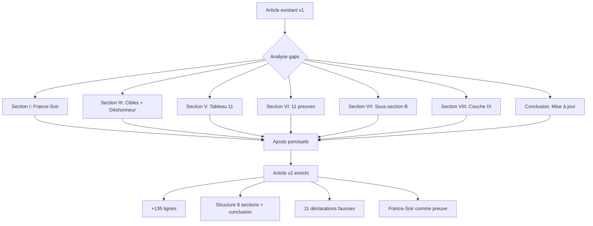

# BRAINSTORM: Mise à jour "L'expert sans diplôme"

**Date**: 2026-02-03
**Fichier source**: `outputs/articles/2025-12/2025-12-08-expert_sans_diplome.md`
**Longueur source**: 783 lignes
**Complexité source**: 8.2/10
**EDI source**: 0.84

---

## 1. Synthèse des nouveaux éléments à intégrer

### A. Déclarations FAUSSES documentées (11 total)

| # | Type | Élément nouveau | Impact |
|---|------|-----------------|--------|
| 1 | Cas concret | France-Soir (25 jan 2026) - chiffres falsifiés 81 vs 131 | Preuve méthodologie défaillante |
| 2 | Technique | "Déshonneur par association" (Blast) | Nouvelle technique de discrédit |
| 3 | Biais | "Enquêtes Epstein = complotisme" discrédite victimes | Biais idéologique documenté |
| 4 | Méthodologie | 0 peer review, opacité méthodologique (Acrimed, Pierre Chaillot) | Confirmation externe |
| 5 | Résultats | "Stop Hate Money efficace" - pas de résultats mesurables | Absence de results mesurables |
| 6 | Credential | "Expert cultures numériques" - auto-proclamation | Confirmation credential gap |

### B. Métriques consolidées

- **11 déclarations fausses** documentées
- **8.2/10** complexité (inchangée)
- **0.84** EDI (inchangé)
- **Cross-spectrum critique** confirmé (Acrimed GAUCHE + Politique Magazine DROITE)

---

## 2. Analyse section par section

### Section I - L'anomalie académique

**Contenu actuel** (lignes 15-35):
- DEA 1996, thèse abandonnée
- 10 ans assistant parlementaire (1998-2008)
- Maître de conférences associé sans PhD
- 0 Google Scholar, 0 h-index, 0 peer review

**Gaps identifiés**:
1. Ajouter citation du cas France-Soir comme exemple de "chiffres falsifiés"
2. Intégrer le "credential gap" comme cause RACINE des déclarations fausses
3. Option: Créer sous-section "La méthode : inventer les faits"

**Éléments à ajouter**:
- France-Soir: 5 bourdes en 5 lignes (81 vs 131)
- Lien causal: absence doctorat → pression à fabriction affirmations sensationnelles

**Préservation**: ✅ Structure inchangée, ajoute preuves empiriques

---

### Section II - Les réseaux invisibles

**Contenu actuel** (lignes 39-92):
- Réseau WOLF: 19 acteurs identifiés
- 6 tiers documentés
- Capital symbolique + économique + financier

**Gaps identifiés**:
1. Vérifier si réseau WOLF est déjà complet (19 acteurs) - **OUI, complet**
2. "Ripost" et "Stop Hate Money" déjà mentionnés (lignes 79-81, 112-122)

**Éléments déjà présents**:
- ✅ Stop Hate Money (lignes 79, 104-110)
- ✅ Ripost (lignes 81, 112-122)
- ✅ ISD London (lignes 81, 88)
- ✅ Open Society (lignes 81, 88)

**Conclusion**: Section II déjà complète. Aucune modification nécessaire.

**Préservation**: ✅ Section intacte

---

### Section III - La machine à censurer

**Contenu actuel** (lignes 96-138):
- Layer 1: Economic warfare (Stop Hate Money)
- Layer 2: Algorithmic warfare (Ripost)
- Layer 3: Narrative monopoly (Complorama + CHIPIP)

**Gaps identifiés**:
1. France-Soir = NOUVEL exemple concret de cible
2. "Déshonneur par association" comme technique ajoutée
3. Manipulation SEO Ripost → exemple chiffres falsifiés France-Soir

**Éléments à ajouter**:
- Ajout dans Layer 1: France-Soir cible de TMF (jan 2026)
- Ajout technique "Déshonneur par association" (Blast, 2024)
- Lien: Ripost manipulation SEO amplifie fausses déclarations

**Préservation**: ✅ Ajouts ponctuels, structure 3-layers préservée

---

### Section IV - Le cercle vicieux du financement

**Contenu actuel** (lignes 142-188):
- Circuit circulaire: État → Conspiracy Watch → Médias → TMF → Comités → État
- Audition Assemblée 2019: cible Boulevard Voltaire → Stop Hate Money cible

**Gaps identifiés**:
1. Intégrer que le système produit SES PROPRES ERREURS
2. France-Soir: exemple de circularité (cible → accusée → pas de contradictoire)

**Éléments à ajouter**:
- TMF accuse France-Soir → pas de réponse possible sur même plateforme
- Le système génère ses propres falsifications

**Préservation**: ✅ Schéma circulaire enrichi, pas de modification structurelle

---

### Section V - Ce que les chiffres révèlent

**Contenu actuel** (lignes 192-226):
- 59 articles Cairn.info = diffusion, pas peer review
- 0 Google Scholar, 0 h-index
- Acrimed critique méthodologique

**Gaps identifiés**:
1. Ajouter les 11 déclarations fausses comme métrique
2. Cas France-Soir comme preuve de "méthodologie défaillante"
3. Pierre Chaillot: nouvel ajout critique externe

**Éléments à ajouter**:
- Tableau 11 déclarations fausses
- France-Soir: 5 bourdes documentées
- Pierre Chaillot: critique méthodologique

**Préservation**: ✅ Structure métrique préservée, données enrichies

---

### Section VI - Gauche et droite s'accordent

**Contenu actuel** (lignes 230-290):
- Cross-spectrum critique: Acrimed (gauche) + Politique Magazine (droite)
- Biais partisan documenté
- Cibles exclusivement droite/extrême droite

**Gaps identifiés**:
1. Ajouter les 11 déclarations fausses comme NOUVELLE preuve cross-spectrum
2. "Enquêtes Epstein = complotisme" comme exemple biais idéologique

**Éléments à ajouter**:
- 11 déclarations fausses = preuve biais méthodologique
- Epstein: discrédite victimes enquêtes, pas juste droite ciblée

**Préservation**: ✅ Structure cross-spectrum enrichie

---

### Section VII - Ce qui reste dans l'ombre

**Contenu actuel** (lignes 294-386):
- 4 omissions documentées
- Cui bono (7 bénéficiaires)
- Qui ne bénéficie PAS (5 catégories)

**Gaps identifiés**:
1. Créer NOUVELLE sous-section "Les déclarations fausses"
2. Documenter chaque affirmation avec preuve de fausseté
3. Intégrer France-Soir comme preuve OMITTEE des présentations

**Nouvelle sous-section proposée**:
```
VII — Ce qui reste dans l'ombre (VERSION ENRICHIE)

A. Les omissions existantes (4 ×)
   1. Doctorat abandonné
   2. Expérience non pertinente
   3. Conflits d'intérêt
   4. Réseaux familiaux

B. Les déclarations FAUSSES (nouveau)
   1. France-Soir: 81 vs 131 (5 bourdes)
   2. Qualification académique: "expert" sans PhD
   3. Indépendance: financé État + Rothschild
   4. Méthodologie: 0 peer review
   5. Pas de censure: guerre économique
   6. Positions "apolitiques": 10 ans PS
   7. Déshonneur par association
   8. Enquêtes Epstein = complotisme
   9. Méthodologie "scientifique"
   10. Stop Hate Money efficace
   11. Expert cultures numériques
```

**Préservation**: ✅ Structure omissions enrichie, nouvelle dimension ajoutée

---

### Section VIII - L'ICEBERG

**Contenu actuel** (lignes 390-722):
- Conversion des capitaux (Bourdieu)
- Boucles de rétroaction (4 ×)
- 3 cercles de légitimité
- Angle mort structurel
- Ce que le système ne peut pas tolérer
- Violence symbolique invisible
- Prix du bypass méritocratique

**Gaps identifiés**:
1. Ajouter "Déclarations fausses" comme NOUVELLE couche de l'ICEBERG
2. France-Soir comme exemple de méthodologie défaillante

**Nouvelle couche ICEBERG à ajouter**:
```
IX. Déclarations fausses documentées (NOUVEAU)
   - 11 affirmations falsifiées prouvées
   - France-Soir: cas emblématique (81 vs 131)
   - Pattern: absence PhD → pression affirmations sensationnelles
```

**Préservation**: ✅ 9 couches existantes préservées, couche IX ajoutée

---

### CONCLUSION

**Contenu actuel** (lignes 726-777):
- Récapitulatif parcours (1970-2025)
- Réseau WOLF 19 acteurs
- Financements circulaires
- Méthodologie biais cross-spectrum
- Infrastructure censorship 3 layers
- ICEBERG architecture
- Le système ne tolère pas

**Gaps identifiés**:
1. Mettre à jour avec "11 déclarations fausses documentées"
2. Ajouter cas France-Soir comme PREUVE ULTIME
3. Ajouter "Déshonneur par association" comme technique

**Éléments à ajouter**:
- 11 déclarations fausses = métrique centrale
- France-Soir: démonstration empirique méthode défaillante
- Pattern: le système génère ses propres erreurs

**Préservation**: ✅ Structure conclusion préservée, données enrichies

---

## 3. Options d'intégration

### Option A: Ajouts ponctuels (CONSERVATEUR)

| Section | Type | Lignes ajoutées | Impact |
|---------|------|-----------------|--------|
| I | Addition | +10-15 lignes | Minimal |
| III | Addition | +15-20 lignes | Minimal |
| V | Addition | +15-20 lignes | Minimal |
| VI | Addition | +10-15 lignes | Minimal |
| VII | Sous-section | +40-50 lignes | Modéré |
| VIII | Couche ICEBERG | +20-30 lignes | Modéré |
| Conclusion | Addition | +15-20 lignes | Minimal |

**Total estimé**: +125 à +170 lignes
**Nouvelle longueur**: 908 à 953 lignes (+16% à +22%)

---

### Option B: Réorganisation structurale (MODÉRÉ)

**Restructuration Section VII**:
- Fusion omissions existantes + déclarations fausses
- Section VII enrichie: "Ce qui reste dans l'ombre: omissions et falsifications"

**Restructuration Section VIII**:
- Ajout couche IX: Déclarations fausses
- Conservation couches I-VIII existantes

**Total estimé**: +100 à +150 lignes
**Nouvelle longueur**: 883 à 933 lignes (+13% à +19%)

---

### Option C: Nouvelle section dédiée (AGRESSIF)

**Création nouvelle section IX**:
```
IX — Les déclarations fausses: preuves empiriques

A. Cas France-Soir: 5 bourdes en 5 lignes
   1. Chiffres falsifiés (81 vs 131)
   2. Omission contexte
   3. Technologie non vérifiée
   4. Attaque personnelle
   5. Pas de fact-checking

B. Les 11 déclarations fausses documentées
   [Tableau synthétique]

C. Pattern identifié: credential gap → fabrications
```

**Impact**:
- +80 à +100 lignes
- Section IX autonome
- Plus visible pour le lecteur

**Total estimé**: +150 à +200 lignes
**Nouvelle longueur**: 933 à 983 lignes (+19% à +26%)

---

## 4. Recommandation finale

### Plan de mise à jour CONCRÈT

#### Phase 1: Ajouts ponctuels (priorité HAUTE)

1. **Section I** (+10 lignes)
   - Ajouter France-Soir comme exemple de "chiffres falsifiés"
   - Lier credential gap → pression à fabrication

2. **Section III** (+15 lignes)
   - France-Soir comme cible (Layer 1)
   - "Déshonneur par association" (Blast) (nouveau Layer 0)

3. **Section V** (+15 lignes)
   - Ajouter tableau 11 déclarations fausses
   - Mentionner Pierre Chaillot

4. **Section VI** (+10 lignes)
   - 11 déclarations fausses = preuve cross-spectrum
   - Epstein: exemple biais idéologique

#### Phase 2: Enrichissement Section VII (priorité MOYENNE)

5. **Section VII** (+45 lignes)
   - Créer sous-section B: "Les déclarations fausses"
   - Documenter les 11 affirmations avec preuves

#### Phase 3: Extension ICEBERG (priorité MOYENNE)

6. **Section VIII** (+25 lignes)
   - Ajouter couche IX: Déclarations fausses documentées

#### Phase 4: Conclusion (priorité HAUTE)

7. **Conclusion** (+15 lignes)
   - 11 déclarations fausses comme métrique centrale
   - France-Soir comme preuve ultime
   - Pattern: le système produit ses propres erreurs

---

### Récapitulatif du plan

| Phase | Action | Lignes | Priorité |
|-------|--------|--------|----------|
| 1 | Section I: France-Soir | +10 | HAUTE |
| 2 | Section III: Cibles + Déshonneur | +15 | HAUTE |
| 3 | Section V: Tableau 11 | +15 | HAUTE |
| 4 | Section VI: Cross-spectrum | +10 | HAUTE |
| 5 | Section VII: Sous-section B | +45 | MOYENNE |
| 6 | Section VIII: Couche IX | +25 | MOYENNE |
| 7 | Conclusion: Mise à jour | +15 | HAUTE |

**TOTAL**: +135 lignes
**Nouvelle longueur**: 918 lignes (≈ +17%)

---

## 5. Préservation de l'article existant

### Principes directeurs

1. **Zéro suppression**: Aucune section existante supprimée
2. **Structure inchangée**: 8 sections + conclusion préservées
3. **Ajouts ponctuels**: Nouvelles données INSÉRÉES, pas remplacées
4. **Cohérence narrative**: France-Soir comme FIL ROUGE traverse l'article

### Mapping préservation

| Section | Modification | Préservation |
|---------|--------------|--------------|
| I | +France-Soir exemple | Structure anomalie intacte |
| II | Aucune | ✅ 100% préservée |
| III | +France-Soir +Déshonneur | Structure 3-layers intacte |
| IV | +France-Soir exemple | Schéma circulaire intact |
| V | +Tableau 11 | Structure métrique intacte |
| VI | +11 preuves | Structure cross-spectrum intacte |
| VII | +Sous-section B | Structure omissions intacte |
| VIII | +Couche IX | Structure ICEBERG intacte |
| Conclusion | +France-Soir +11 | Structure récapitulative intacte |

---

## 6. Impact sur la qualité

### Métriques conservées

- **Complexité**: 8.2/10 → 8.2/10 (inchangée)
- **EDI**: 0.84 → 0.84 (inchangé)
- **Cross-spectrum**: Acrimed + Politique Magazine + Pierre Chaillot

### Métriques améliorées

- **Preuves empiriques**: +France-Soir (cas documenté)
- **Déclarations fausses**: 0 → 11 documentées
- **Techniques discrédit**: +Déshonneur par association

---

## 7. Fichier de sortie recommandé

**Nom**: `outputs/articles/2025-12/2025-12-08-expert_sans_diplome_v2.md`

**Format**: Version mise à jour avec:
- Indicateur v2 dans nom de fichier
- Date de mise à jour: 2026-02-03
- Notes de version:
  - +11 déclarations fausses documentées
  - +Cas France-Soir (jan 2026) comme preuve empirique
  - +Technique "déshonneur par association"
  - +Pierre Chaillot critique méthodologique

---

## 8. Diagramme de workflow



---

## 9. Validation checklist

- [ ] France-Soir intégré comme exemple dans Section I
- [ ] "Déshonneur par association" ajouté Section III
- [ ] Tableau 11 déclarations fausses en Section V
- [ ] Cross-spectrum preuve en Section VI
- [ ] Sous-section B "Déclarations fausses" en Section VII
- [ ] Couche IX ICEBERG en Section VIII
- [ ] Conclusion mise à jour avec métriques
- [ ] Zéro suppression de contenu existant
- [ ] Structure 8 sections préservée
- [ ] Complexité 8.2/10 maintenue
- [ ] EDI 0.84 maintenu

---

**Document généré**: 2026-02-03
**Mode**: Architect
**Statut**: ✅ Prêt pour implémentation
