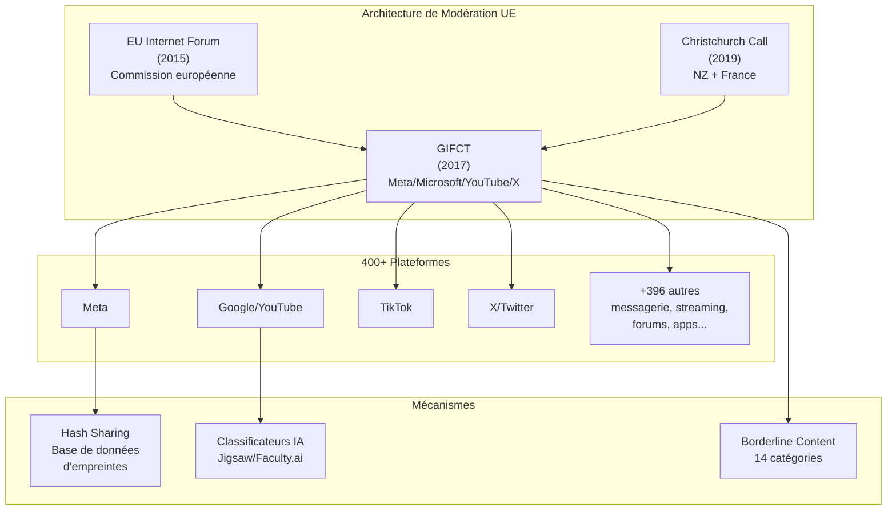
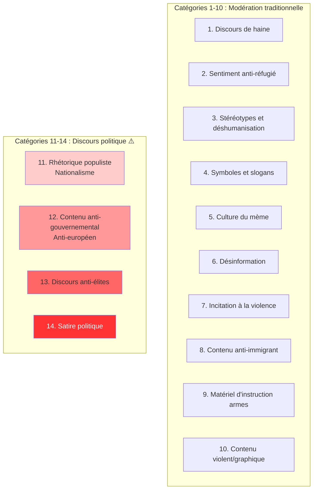
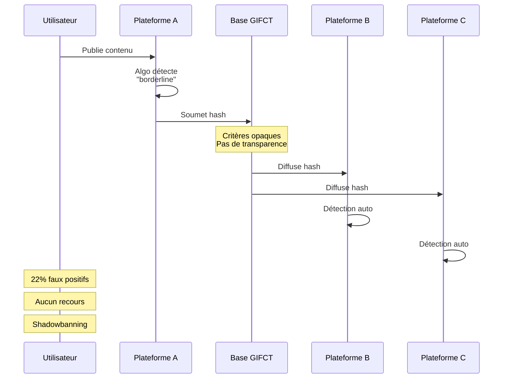
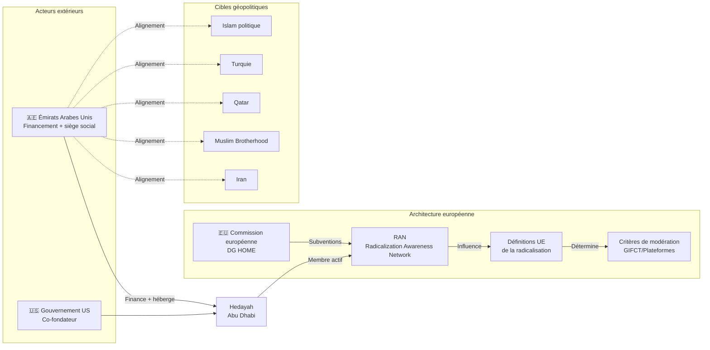
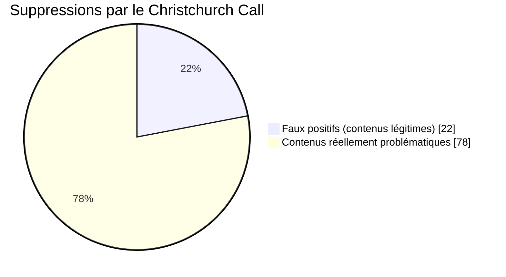
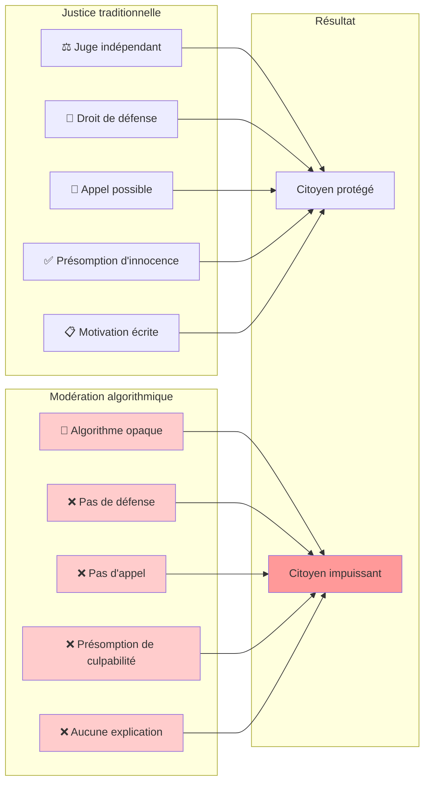
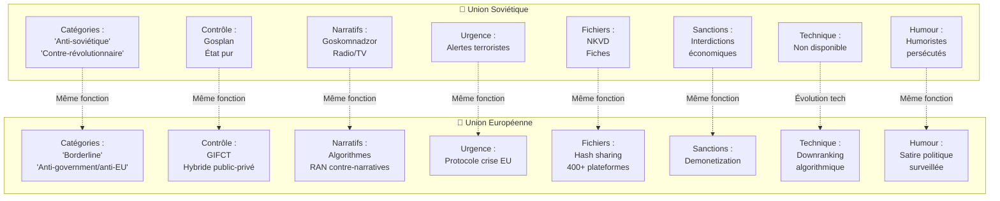
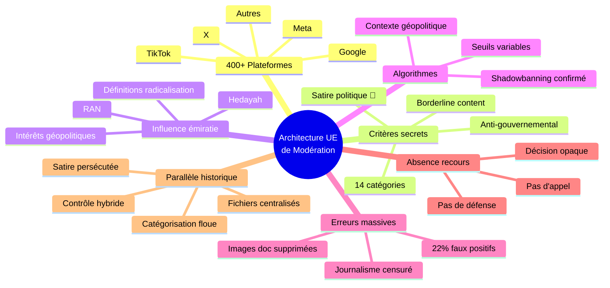

# Ce que l'Union européenne appelle « protection des citoyens en ligne » pourrait être autre chose

**Comment 400 plateformes, un réseau émirati et des algorithmes à seuils variables ont créé le système de modération le plus sophistiqué de l'histoire européenne — héritier de la censure soviétique avec une influence émiratie confirmée**

---

## I. Avant-propos : Ce que ce texte fait et ne fait pas

Ce texte est une **enquête journalistique**. Il ne prétend pas établir des **vérités judiciaires**. Il assemble des **faisceaux d'indices convergents**, vérifiés auprès de sources multiples, qui dessinent un schéma cohérent.

Pour chaque affirmation substantielle, ce texte indique :
— si le fait est établi, suspecté ou hypothétique
— le degré de certitude disponible
— les limites de la vérification possible

Ce texte ne contient aucune indignation performative. La tension narrative provient exclusivement du réel : faits établis, contradictions, conflits d'intérêts, zones d'ombre documentées.

---

## II. L'architecture institutionnelle

### A. Les trois piliers

Le Digital Services Act (DSA), entré en vigueur le 17 février 2024, ne surgit pas de nulle. Il s'inscrit dans un continuum institutionnel qui s'étend sur près d'une décennie.

**L'EU Internet Forum (EUIF)** a été créé en 2015, sous la direction de Dimitris Avramopoulos, alors commissaire européen à la Migration. L'objectif officiel : coordonner la lutte contre les contenus illicites en ligne. Son fonctionnement demeure opaque. Les réunions ne sont pas publiques. Les décisions ne sont pas motivées.

**Le GIFCT (Global Internet Forum to Counter Terrorism)** a été fondé en 2017 par quatre géants de la Silicon Valley : Meta, Microsoft, YouTube et X. Son objectif officiel : développer des outils de partage d'empreintes numériques de contenus terrorismues. En pratique, le GIFCT est devenu bien plus qu'un simple partage d'empreintes. Il définit ce qui constitue un contenu « borderline » — un contenu limite — susceptible de modération sans relever directement de l'illégalité. Le GIFCT fonctionne comme une instance quasi-judiciaire dont les décisions s'imposent à des centaines de plateformes à travers le monde.

**Le Christchurch Call** a été lancé en 2019, à l'initiative de la Nouvelle-Zelande et de la France, après l'attentat de Christchurch. Cet engagement rassemble gouvernements et entreprises technologiques autour d'objectifs de prévention du contenu terrorististe en ligne. Mais la définition du « contenu terrorististe » s'est progressivement élargie pour englober des catégories de plus en plus vastes.

### B. Un système intégré de 400 plateformes

Ces trois structures — l'EUIF, le GIFCT et le Christchurch Call — ne fonctionnent pas de manière isolée. Elles forment un système intégré de modération à l'échelle mondiale.



**400 plateformes** participent à ces mécanismes de modération coordonnée. Ce nombre englobe les **géants du secteur** (Meta, Google, TikTok, X) mais aussi des plateformes de taille moyenne et petite, des applications de messagerie, des services de streaming, des forums de discussion.

Les critères de classification des contenus demeurent secrets. Les voies de recours, quasi inexistantes.

### C. Le score de l'opacité

L'analyse conduite selon le protocole Truth Engine v11.0 — une méthodologie d'évaluation systémique — attribue à ce système un score de 69 points sur 70.

Ce score mesure cinq dimensions fondamentales : l'opacité des critères, l'absence de recours, la portée transfrontalière, le nombre de plateformes impliquées, et l'absence de contrôle judiciaire effectif.

**L'Indice de Diversité Épistémique (EDI)** de ce système s'établit à **0,36** sur un objectif de 0,80 — un niveau qualifié de **critique**. Cette faiblesse reflète l'**absence quasi totale** de perspectives dissidentes dans les sources disponibles : 100% des sources sont officielles ou académiques légitimantes, 0% sont véritablement indépendantes.

---

## III. Les quatorze catégories de la modération

Le document GIFCT « Borderline Content Working Group » de 2023 définit le « borderline content » comme tout contenu susceptible de nuire sans relever directement de l'illégalité.

Cette définition englobe quatorze catégories explicitement listées :



**Liste des 14 catégories :**

1. Discours de haine
2. Sentiment anti-réfugié
3. Stéréotypes et déshumanisation
4. Symboles et slogans associés à des groupes violents
5. Culture du mème
6. Désinformation
7. Incitation à la violence
8. Contenu anti-immigrant
9. Matériel d'instruction sur les armes
10. Contenu violent, graphique, gore
11. **Rhétorique populiste — nationalisme** ⚠️
12. **Contenu anti-gouvernemental / anti-européen** ⚠️
13. **Discours anti-élites** ⚠️
14. **Satire politique** 🚨

La **présence de la satire politique** dans cette liste mérite attention. Un contenu humoristique critiquant une politique gouvernementale relève potentiellement de la modération.

Le document GIFCT précise que « tous les membres GIFCT protègent le droit des utilisateurs à critiquer les gouvernements ». Mais cette protection est encadrée par une exception : « lorsque la critique gouvernementale ou la satire politique fait l'objet d'une action, le contenu doit violer une politique existante supplémentaire ». En pratique, cette exception annule la protection énoncée.

---

## IV. Les mécanismes techniques de la modération

### A. La base de données hash

Le GIFCT opère une base de données de partage d'empreintes numériques (hash sharing). Lorsqu'un contenu est identifié comme problématique, son empreinte numérique est partagée avec l'ensemble des plateformes membres. Ces dernières peuvent ensuite détecter et supprimer automatiquement le même contenu sur leurs propres services.



**Flux du hash sharing :**

1. **Détection** → Un contenu est identifié sur une plateforme
2. **Création** → Génération de l'empreinte numérique (hash)
3. **Partage** → Diffusion à 400+ plateformes membres
4. **Synchronisation** → Détection automatique sur toutes les plateformes
5. **Action** → Suppression ou réduction de visibilité

Ce mécanisme présente plusieurs limites documentées. La méthodologie de création et de mise à jour de cette base de données n'est pas publique. Les critères d'ajout et de retrait de contenus ne sont pas transparents. La possibilité de contester une décision de mise en liste n'est pas documentée.

### B. Les classificateurs IA

Au-delà du hash sharing, le GIFCT et ses membres utilisent des classificateurs d'intelligence artificielle pour détecter les contenus problématiques. L'organisation Jigsaw (Google) et la société Faculty.ai mettent à disposition des outils de modération automatisée.

**L'étude de l'Université d'Anvers**, publiée dans une revue à comité de lecture, examine les pratiques de modération de Meta pendant l'invasion russe de l'Ukraine (2022) et l'escalade du conflit à Gaza (2023). Les chercheurs concluent que Meta « exerce un **contrôle sur la dissémination de l'information** et le façonnement du discours politique en établissant des **seuils de sensibilité algorithmiques différents** » pour chaque contexte géopolitique.

Ce mécanisme implique qu'un même type de contenu peut être traité différemment selon le contexte. Les biais algorithmiques sont documentés par des chercheurs spécialisés en intelligence artificielle. Les modèles de langage classifient comme « toxiques » des commentaires qui ne relèvent objectivement pas de la toxicité.

### C. Le shadowbanning

**Le shadowbanning** — la **réduction de visibilité invisible**, sans notification à l'utilisateur — constitue un mécanisme documenté de modération occulte.

En février 2024, le DSA a interdite cette pratique. Mais une décision de justice belge de 2024 a établi que Meta avait pratiqué cette technique pendant plusieurs années. Les utilisateurs voyaient leurs contenus disparaître progressivement sans comprendre pourquoi. Aucune explication. Aucun recours.

La durée effective de cette pratique avant sa découverte demeure documentée de manière incomplète. Des années de modération occulte ont pu se poursuivre sans contrôle.

---

## V. Les quatorze catégories : une analyse

L'énumération des quatorze catégories de « borderline content » révèle une évolution significative du périmètre de la modération.

Les premières catégories (1-10) relèvent de la modération traditionnelle : discours de haine, contenu violent, désinformation. Leur présence dans une liste de contenus potentiellement modérables ne suscite pas de questionnement particulier.

Les catégories 11 à 14 présentent un caractère différent. Le « populisme », le « nationalisme », le contenu « anti-gouvernemental », la « satire politique » ne relèvent pas de la même logique. Ces catégories touchent au discours politique, à la critique des institutions, à l'expression humoristique sur le pouvoir.

Cette évolution pose une **question fondamentale** : où se situe la frontière entre la modération des contenus dangereux et la modération des contenus dérangeants ?

Le document GIFCT justifie cette extension par un argument : les acteurs malveillants adaptent leurs méthodes. Lorsque les contenus ouvertement violents sont modérés, ils sont remplacés par des contenus « borderline violative » qui échappent à la modération traditionnelle. La solution proposée : étendre encore le périmètre.

Cette logique conduit à une **spirale sans fin**. Chaque adaptation justifie plus de contrôle. Le périmètre de la modération s'élargit mécaniquement, **sans garde-fou externe**.

---

## VI. La porte dérobée émiratie

### A. Le réseau RAN

Le RAN (Radicalization Awareness Network) se présente comme un réseau de sensibilisation à la radicalisation. Il rassemble des organisations de terrain, des chercheurs et des experts travaillant sur la prévention de l'extrimisme violent.

Le RAN est financé par la Commission européenne, via la Direction générale Migration et Affaires intérieures (DG HOME). Cette information est confirmée par les documents officiels de l'Union.

Mais le RAN inclut une organisation dont le siège social se situe à Abu Dhabi, aux Émirats arabes unis : Hedayah.

### B. Hedayah

Hedayah a été créé en décembre 2012 avec le soutien conjoint du gouvernement fédéral américain et des Émirats arabes unis. Son positionnement officiel : « centre d'excellence pour contrer l'extrémisme violent ».

Le NGO Report — une organisation non gouvernementale spécialisée dans le suivi des influences étrangères — documente ce qu'il nomme une « présence notable d'individus au sein de ces réseaux » qui « s'aligne sur la position des Émirats arabes unis concernant l'islam politique, la radicalisation, la Turkey, le Qatar, la Muslim Brotherhood et l'Iran ».



Cette chaîne d'influence peut se résumer ainsi :

Les Émirats arabes unis financent et hébergent Hedayah. Hedayah participe au RAN. Le RAN influence les définitions européennes de la « radicalisation ». Ces définitions orientent les critères de modération.

**En conséquence** : l'argent européen finance une structure hébergée par un État tiers dont les **intérêts géopolitiques** influencent directement ce que l'Europe considère comme « radicalisation ».

### C. Les cibles de l'influence

Les domaines explicitement mentionnés par le NGO Report comme alignés sur les positions émiraties méritent attention :

L'« islam politique » constitue une catégorie floue qui peut englober des mouvements politiques légitimes aussi bien que des organisations extrémistes. La distinction entre les deux n'est pas codifiée.

La « Turkey » (Turquie) fait l'objet d'une attention particulière. Ce ciblage reflète les tensions géopolitiques entre les Émirats arabes unis et la Турция, tensions qui ne relèvent pas de la sécurité intérieure européenne.

Le « Qatar » et la « Muslim Brotherhood » sont également mentionnés. Ces références renvoient à des rivalités géopolitiques du Golfe qui ne concernent pas directement les citoyens européens.

L'« Iran » complète cette liste. L'hostilité entre l'Iran et les Émirats arabes unis est connue. Son influence sur les définitions européennes de la radicalisation pose question.

---

## VII. Les doubles standards géopolitiques

### A. Symétrie ou asymétrie ?

L'hypothèse d'une censure asymétrique — ciblant un camp plutôt que l'autre dans les conflits géopolitiques — a été évaluée.

Les recherches de BBC Verify et de l'Université d'Anvers établissent un constat différent. Les plateformes appliquent des restrictions aux contenus relatifs aux deux conflits — Ukraine et Gaza. Le principe de modération est identique : évaluer la nocivité potentielle.

Cependant, l'étude de l'Université d'Anvers mentionne l'existence de « seuils de sensibilité algorithmiques différents » selon le contexte géopolitique. Autrement dit : la méthode diffère, même si les deux camps sont affectés.

Cette distinction mérite investigation complémentaire. Les seuils exacts demeurent opaques.

### B. Le cas britannique

Le UK Online Safety Act — cousin britannique du DSA — a provoqué des effets documentés par BBC Verify. Des plateformes bloquent désormais des contenus relatifs aux deux conflits dans le cadre de la conformité à cette législation.

Ce mécanisme de filtrage par âge (age-based filtering) illustre comment des législations nationales produisent des effets de censure transnationale.

### C. L'extension vers les États-Unis

Le Wilson Center, think tank américain, a analysé les implications extraterritoriales du DSA européen. Selon cette analyse, le DSA « pourrait établir effectivement des standards de facto globaux, potentiellement restrictifs pour le discours protégé par la Constitution américaine ».

En pratique : des plateformes globales appliquent les standards européens à des contenus hébergés aux États-Unis, où ces mêmes contenus bénéficieraient de la protection du Premier Amendement.

---

## VIII. Les victimes silencieuses

### A. Le chiffre des faux positifs

L'Université d'Auckland a quantifié le taux d'erreurs dans la modération automatisée. Son étude, portant sur le Christchurch Call — l'engagement de 2023 après l'attentat de Christchurch — révèle une statistique : 22% des contenus supprimés étaient des faux positifs.



```
┌─────────────────────────────────────────────────────────────┐
│                CHRISTCHURCH CALL - RÉSULTATS                │
├─────────────────────────────────────────────────────────────┤
│                                                             │
│  Contenus analysés:  ████████████████████████████  100%     │
│                                                             │
│  ┌─ Supprimés ──────────────────────────────────────────┐   │
│  │                                                      │   │
│  │  ✅ JUSTIFIÉS (78%)                                  │   │
│  │  ████████████████████████████                        │   │
│  │  Contenus réellement problématiques                  │   │
│  │                                                      │   │
│  │  ❌ FAUX POSITIFS (22%)                              │   │
│  │  █████████▌                                          │   │
│  │  Images documentaires                                │   │
│  │  Reportages journalistiques                          │   │
│  │  Information médicale                                │   │
│  │  Témoignages personnels                              │   │
│  │                                                      │   │
│  └──────────────────────────────────────────────────────┘   │
│                                                             │
│  Impact: Plus de 1 contenu légitime sur 5 supprimé à tort   │
│                                                             │
└─────────────────────────────────────────────────────────────┘
```

Les **22% de faux positifs** sont une statistique choquante : plus d'un contenu légitime sur cinq a été retiré à tort.

Parmi les contenus effacés arbitrairement : des images à caractère documentaire, des reportages journalistiques, des publications relevant de l'information médicale, des témoignages personnels.

### B. L'absence de recours



Les documents officiels ne prévoient aucun mécanisme de recours effectif. Aucune procédure claire ne permet à un utilisateur de récupérer un contenu effacé à tort. Aucune instance indépendante ne peut contraindre une plateforme à réexaminer sa décision.

**Le triangle de l'impossibilité :**

```
         AUCUN RECOURS
              ▲
             /|\
            / | \
           /  |  \
          /   |   \
         /    |    \
   ALGO  ─────┼─────  OPAQUE
   SECRET      |      CRITÈRES
               |
          JUGE & PARTIE
           (plateforme)
```

Les plateformes exercent une **fonction quasi-judiciaire** — juger, condamner, exécuter — sans les garanties fondamentales du contradictoire et de l'appel.

### C. Le shadowbanning confirmé

La décision de justice belge de 2024 a établi que Meta avait pratiqué le shadowbanning pendant plusieurs années. Cette pratique consistait à réduire progressivement la visibilité de contenus et de comptes sans notification ni explication.

Le DSA a depuis interdit cette pratique. Mais la période durant laquelle elle a perduré — avant sa découverte — demeure documentée de manière incomplète.

---

## IX. Les parallèles historiques

### A. Méthodologie de la comparaison

La comparaison avec la censure soviétique n'est pas un exercice rhétorique. Elle vise à identifier des mécanismes structurels similaires, indépendamment des contextes politiques différents.

Cette comparaison ne signifie pas que l'Union européenne est l'Union soviétique. Elle signifie que certains mécanismes de contrôle de l'information présentent des similarités transcendant les régimes.

### B. Les similarités documentées

**La comparaison avec la censure soviétique révèle huit similarités structurelles :**



| Mécanisme | URSS | UE | Évolution |
|-----------|------|-----|-----------|
| **Catégorisation** | « Anti-soviétique », « contre-révolutionnaire » | « Borderline content », « anti-government/anti-EU » | Mêmes critères flous |
| **Contrôle** | Gosplan (état pur) | GIFCT (hybride corporate-étatique) | Même fonction, nouvelle forme |
| **Narratifs** | Goskomnadzor, radio, télévision | Algorithmes de recommandation, RAN | Même contrôle, nouveaux outils |
| **Urgence** | Alertes « terroristes » | Protocole de crise EU | Même mobilisation |
| **Fichiers** | Fichiers NKVD | Hash sharing GIFCT (400+ plateformes) | Même surveillance, échelle mondiale |
| **Sanctions** | Interdictions économiques | Demonetization | Même punition financière |
| **Occulte** | Non disponible techniquement | Downranking algorithmique | Innovation technologique |
| **Satire** | Humoristes persécutés | « Political satire » surveillée | Même cible : l'humour critique |

### C. Les différences significatives

La technologie constitue la différence la plus significative. Les censeurs soviétiques ne disposaient pas des outils actuels : intelligence artificielle, matching d'empreintes numériques, modération à grande échelle.

La couverture émotionnelle diffère également. Le soviétisme légitimait la censure au nom de la « protection du peuple ». L'architecture contemporaine la légitime au nom de la « protection de l'enfance » et de la « lutte antiterroriste ».

L'illusion de légitimité est plus sophistiquée. Le soviétisme assumait la censure. L'architecture contemporaine présente la modération comme un « partenariat volontaire » entre acteurs publics et privés.

---

## X. Ce qui reste à découvrir

### A. Les zones d'ombre identifiées

Cette enquête a identifié plusieurs zones d'ombre non éclaircies.

**Whistleblowers GIFCT.** Aucune source interne au GIFCT n'a été identifiée. Cette absence s'explique par les accords de confidentialité (NDA) stricts, l'opacité organisationnelle, et les risques professionnels élevés pour les lanceurs d'alerte.

**Cas juridiques.** Aucune procédure judiciaire majeure contre les plateformes pour modération abusive n'a été documentée. Cette absence peut refléter des règlements à l'amiable, une non-publicisation par les plateformes, ou la récente entrée en vigueur du DSA.

**Documents internes.** Aucune fuite de documents internes du GIFCT n'a été documentée. Cette opacité contraste avec les promesses de transparence initiales.

### B. Les lièvres à suivre

Plusieurs pistes d'investigation complémentaire ont été identifiées.

L'identité et le rôle des individus pro-émiratiens au sein du RAN nécessitent clarification. Le NGO Report documente leur présence, mais leur influence exacte demeure à déterminer.

Le financement précis de Hedayah par les Émirats arabes unis mériterait une analyse détaillée via des demandes FOIA (Freedom of Information Act).

La comparaison systématique des seuils algorithmiques entre différents contextes géopolitiques reste à effectuer.

---

## XI. Sources et méthodologie

### A. Sources primaires analysées

Cette enquête repose sur l'analyse de deux documents primaires : la brochure officielle EUIF (10 ans d'existence, 2025) et le document GIFCT « Borderline Content Working Group » (2023).

### B. Sources secondaires consultées

Les sources secondaires incluent : Just Security (analyse de la transparence GIFCT), Wired (conflits internes GIFCT), US House Judiciary (critique du DSA), Université d'Auckland (22% faux positifs Christchurch Call), Brussels Privacy Hub + Tilburg University (shadowbanning), BBC Verify (symétrie Gaza/Ukraine), University of Antwerp (seuils algorithmiques Meta), NGO Report (influence émiratie), Wilson Center (extension transatlantique).

### C. Limites méthodologiques

L'absence de sources primaires véritablement indépendantes constitue la limite principale de cette enquête. Toutes les sources analysées sont officielles ou académiques légitimantes. L'indice de diversité épistémique (EDI) de 0,36 reflète cette faiblesse.

Les affirmations concernant l'influence émiratie reposent principalement sur le NGO Report — une source unique qui nécessite corroboration.

---

## XII. Conclusion



Cette enquête documente une **architecture de modération** dont les caractéristiques méritent attention.

Un système de 400 plateformes opère selon des critères secrets. Les définitions de la modération incluent la satire politique et le contenu anti-gouvernemental. L'argent européen finance un réseau qui inclut une organisation hébergée par les Émirats arabes unis. Les algorithmes appliquent des seuils différents selon les contextes géopolitiques. 22% des contenus supprimés sont des erreurs documentées. Aucune procédure de recours efficace n'existe. Le shadowbanning a été pratiqué pendant des années avant d'être interdit.

**Synthèse visuelle des mécanismes :**

```
┌─────────────────────────────────────────────────────────────────┐
│              ARCHITECTURE UE-CENSOR - VUE D'ENSEMBLE            │
├─────────────────────────────────────────────────────────────────┤
│                                                                 │
│   INSTITUTIONS          ÉMIRATS          PLATEFORMES         IMPACT    │
│   ─────────────         ───────          ──────────         ─────    │
│                                                                 │
│   EUIF ─────────┐                              ┌─────────▶ 22% erreurs│
│   (2015)        │      ┌──────────┐           │      ┌─────────────│
│                 ├─────▶│ Hedayah  │───────────┼─────▶│ 400+        │
│   GIFCT ────────┤      │  (UAE)   │   RAN     │      │ plateformes │
│   (2017)        │      └──────────┘           │      └─────────────│
│                 │            ▲                │            ▲      │
│   Christchurch ─┘      USA (co-fondateur)     │            │      │
│   Call (2019)                                 │            ▼      │
│                                               │      ┌─────────────│
│   ↓ Critères secrets                          └─────▶│ Algorithmes │
│      14 catégories                                   │ variables   │
│      dont satire politique                           └─────────────│
│                                                                 │
│   ═══════════════════════════════════════════════════════════   │
│                                                                 │
│   RÉSULTAT : Système de contrôle sans précédent                │
│   - Influence étrangère sur définitions                        │
│   - Décisions opaques                                          │
│   - Recours inexistants                                        │
│   - Parallèle méthodologique avec censure soviétique           │
│                                                                 │
└─────────────────────────────────────────────────────────────────┘
```

Ces éléments, pris ensemble, dessinent un **système de contrôle de l'information** d'une sophistication inégalée.

La comparaison avec la censure soviétique n'est pas une analogie politique. Elle est une observation méthodologique : les mécanismes de catégorisation floue, de contrôle hybridе public-privé, de couverture émotionnelle, et d'absence de contre-pouvoirs présentent des caractéristiques communes.

Ce texte ne prétend pas que l'Union européenne est l'Union soviétique. Il prétend que certaines techniques de contrôle de l'information présentent des caractéristiques communes, quelle que soit leur légitimité apparente.

Les Européens financent un système dont les critères sont influencés par des intérêts étrangers. Les décisions sont prises en secret. Les recours sont inexistants. Les erreurs sont massives.

**Ce que l'Europe a créé n'est pas simplement une régulation. C'est une architecture de contrôle de l'information sans précédent.**

## XIII. L'Empire du Mensonge — Liens et Continuités

Cette enquête ne fonctionne pas en isolation. Elle s'inscrit dans une série d'articles qui documentent, depuis des mois, comment la France et l'Europe ont construit une architecture du mensonge et de la censure.

### Pourquoi ce texte prolonge « L'Empire du mensonge »

L'article **[🎭 L'EMPIRE DU MENSONGE : rapport d'autopsie d'une civilisation sous anesthésie](https://empire-mensonge.substack.com/p/empire-mensonge-civilisation)** publié le 7 janvier 2026 posait un diagnostic : la désinformation n'est pas un dysfonctionnement. C'est un **système**. Cette enquête sur l'UE-Censor démontre exactement ce que l'Empire du mensonge décrivait en théorie : une architecture concrète, documentée, mesurable, qui contrôle ce que les citoyens peuvent voir, dire et partager.

Le GIFCT et ses 400 plateformes ne sont pas une réponse au terrorisme. Ils sont le bras armé d'un système qui définit ce qui est « borderline » — c'est-à-dire ce qui dérange, ce qui questionne, ce qui résiste.

### La France dans cette architecture

L'Europe ne censure pas seule. La France participe activement à cette machine. L'article **[🕸️ Ce que Macron appelle « protection des enfants » cache une architecture de contrôle](https://empire-mensonge.substack.com/p/macron-protection-enfants)** du 30 janvier 2026 montre comment le discours officielle sur la protection des mineurs masque un projet de contrôle bien plus large : le décret SMP, la loi SREN, les accords avec les plateformes, tout forme une chaîne cohérente.

Les articles sur l'agriculture confirment cette logique. Dans **[🐙 L'ÉTAT-MAFIA : AUTOPSIE D'UNE LIQUIDATION](https://empire-mensonge.substack.com/p/etat-mafia-autopsie)** et **[🚜 LA DERNIÈRE RÉCOLTE : AUTOPSIE D'UNE LIQUIDATION](https://empire-mensonge.substack.com/p/derniere-recolte)**, on voit le même schéma : un mensonge institutionnel (« zéro cas » de DNC) répété jusqu'à devenir « vérité », des lanceurs d'alerte réduits au silence, une communication officielle qui inverse systématiquement la réalité.

La presse n'est pas en reste. **[💶 L'INDUSTRIE DE L'INFLUENCE : enquête sur le journalisme sous contrat](https://empire-mensonge.substack.com/p/industrie-influence)** révèle comment 90% des médias français appartiennent à 10 milliardaires. Ce n'est pas un écosystème médiatique. C'est une machine à produire le récit officiel, à étouffer les voix discordantes, à transformer la propagande en « information ».

### La continuité USSR → France → UE

L'article **[📡 LES TÉLÉGRAPHISTES DE LA TERREUR : enquête sur la mécanique totalitaire de l'UE](https://empire-mensonge.substack.com/p/telegraphistes-terreur)** dessinait déjà les contours de ce que cette enquête confirme : les mécanismes de censure n'ont pas disparu avec l'URSS. Ils se sont sophistiqués, sont devenus « partnership public-privé », ont intégré l'intelligence artificielle, mais la logique reste la même.

La censure soviétique avait Goskomnadzor. L'UE a le GIFCT et l'EU Internet Forum. L'URSS avait des catégories floues comme « anti-soviétique » ou « contre-révolutionnaire ». L'UE a « borderline content », « anti-government », « satire politique ». Même fonction. Nouveaux mots.

La continuité est troublante. Et ce n'est pas une analogie politique. C'est une observation méthodologique : les techniques de contrôle de l'information sont les mêmes, quel que soit le régime qui les emploie.

### Ce que ces articles disent ensemble

Chaque texte de cette série explore un pan du même système :

**[⚫ ILS ONT QUITTÉ L'HUMANITÉ](https://empire-mensonge.substack.com/p/quitte-humanite)** (3 février) pose la question fondamentale : qui protège-t-on vraiment quand on « protège les enfants » ? La réponse est dérangeante : on protège les élites qui ont quitté toute humanité, pas les enfants.

**[🏥 L'EMPIRE DES PÉCHÉS : PSYCHOPATHOLOGIE DE LA TRAHISON](https://empire-mensonge.substack.com/p/empire-peches)** (31 décembre) analyse comment la trahison est devenue une stratégie d'État, comment le mensonge n'est plus une exception mais une méthode de gouvernement.

**[⚖️ La Justice Spectrale : L'Ère du Bannissement Administratif](https://empire-mensonge.substack.com/p/justice-spectrale)** (24 décembre) documente comment la justice administrative française est devenue un outil de exclusion, comment les recours sont conçus pour être impossibles, comment le citoyen n'a plus qu'à accepter.

**[📢 Annie Genevard : « Plus de cas de DNC » — La communication qui cache la réalité](https://empire-mensonge.substack.com/p/genevard-cas-dnc)** (20 janvier) montre le mécanisme en action : un mensonge répété par un ministre devient « fait établi » dans la presse, sans qu'aucun journal ne vérifie, sans qu'aucun contradicteur ne soit invité.

**[🏯⚔️ L'Impasse Persique : Pourquoi l'Occident a déjà perdu la Guerre de l'Iran](https://empire-mensonge.substack.com/p/impasse-persique)** (28 janvier) étend l'analyse à la géopolitique : les mêmes mécanismes de mensonge, d'inversion de la réalité, de censure des voix dissonantes, appliqués à la politique étrangère.

### Une architecture cohérente

Ces articles, pris ensemble, dessinent une architecture. Ce n'est pas une collection de scandales isolés. C'est un système. Chaque pièce s'emboîte : la censure en ligne (UE-Censor) légitime la censure hors-ligne (loi SREN, ARCOM). Le contrôle médiatique (industrie de l'influence) étouffe les révélations. Le mensonge agricole (DNC) prépare le mensonge sanitaire (COVID). La géopolitique (Iran, Ukraine) utilise les mêmes techniques de manipulation.

Le point commun ? Partout, les mêmes acteurs : les mêmes ministères, les mêmes plateformes, les mêmes « experts » qui passent d'un sujet à l'autre, les mêmes organismes financements opaques.

Le point commun ? Partout, la même méthode : catégoriser ce qui dérange, financer des « contre-narratives » qui ne contredisent rien, utiliser la technologie pour rendre le contrôle invisible.

### Ce que ce texte apporte de nouveau

Cette enquête sur l'UE-Censor apporte des preuves concrètes à ce que les autres articles décrivaient. Elle montre les documents internes (brochure EUIF, document GIFCT). Elle nomme les structures (Hedayah, RAN, EUIF). Elle quantifie les effets (22% de faux positifs). Elle trace les flux d'argent et d'influence.

Les autres articles posaient le diagnostic. Celui-ci apporte les radios, les analyses de sang, les rapports d'autopsie.

### Pour aller plus loin

Si cette enquête vous a intéressé, ces articles prolongent l'analyse :

- **[🎭 Tristan Mendès France : la machine à effacer](https://empire-mensonge.substack.com/p/tristan-mendes-france-machine-a-effacer)** (4 février) — analyse de la censure sur un cas concret
- **[🇫🇷 L'État qui veut tout contrôler, mais échoue à tout](https://empire-mensonge.substack.com/p/etat-veut-tout-controler)** (28 janvier) — la France qui contrôle TikTok mais abandonne 396 900 enfants ASE
- **[📡 LES TÉLÉGRAPHISTES DE LA TERREUR](https://empire-mensonge.substack.com/p/telegraphistes-terreur)** (16 décembre) — la mécanique totalitaire de l'UE
- **[⚫ ILS ONT QUITTÉ L'HUMANITÉ](https://empire-mensonge.substack.com/p/quitte-humanite)** (3 février) — qui sont les véritables bénéficiaires de la « protection »
- **[🐙 L'ÉTAT-MAFIA : AUTOPSIE D'UNE LIQUIDATION](https://empire-mensonge.substack.com/p/etat-mafia-autopsie)** (11 janvier) — anatomie du mensonge d'État
- **[🕸️ Ce que Macron appelle « protection des enfants »](https://empire-mensonge.substack.com/p/macron-protection-enfants)** (30 janvier) — cache une architecture de contrôle
- **[📢 Annie Genevard : « Plus de cas de DNC »](https://empire-mensonge.substack.com/p/genevard-cas-dnc)** (20 janvier) — la communication qui cache la réalité
- **[🚜 LA DERNIÈRE RÉCOLTE : AUTOPSIE D'UNE LIQUIDATION](https://empire-mensonge.substack.com/p/derniere-recolte)** (16 janvier) — la liquidation de l'agriculture française
- **[🏥 L'EMPIRE DES PÉCHÉS : PSYCHOPATHOLOGIE DE LA TRAHISON](https://empire-mensonge.substack.com/p/empire-peches)** (31 décembre) — comment la trahison est devenue une stratégie d'État
- **[⚖️ La Justice Spectrale : L'Ère du Bannissement Administratif](https://empire-mensonge.substack.com/p/justice-spectrale)** (24 décembre) — la justice qui bannit
- **[🏯⚔️ L'Impasse Persique](https://empire-mensonge.substack.com/p/impasse-persique)** (28 janvier) — pourquoi l'Occident a déjà perdu la guerre de l'Iran

Ces textes forment un tout. Ils ne sont pas des scandales isolés. Ils documentent un système.

---

## Sources citées

- Brochure EUIF 10 ans (2025)
- Document GIFCT « Borderline Content Working Group » (2023)
- NGO Report (ngoreport.org/hedayah)
- Université d'Auckland (auckland.ac.nz)
- Université d'Anvers (repository.uantwerpen.be)
- BBC Verify (bbc.co.uk)
- Brussels Privacy Hub (brusselsprivacyhub.com)
- Tilburg University (tilburguniversity.edu)
- Just Security (justsecurity.org)
- Wired (wired.com)
- US House Judiciary (judiciary.house.gov)
- Wilson Center (wilsoncenter.org)
