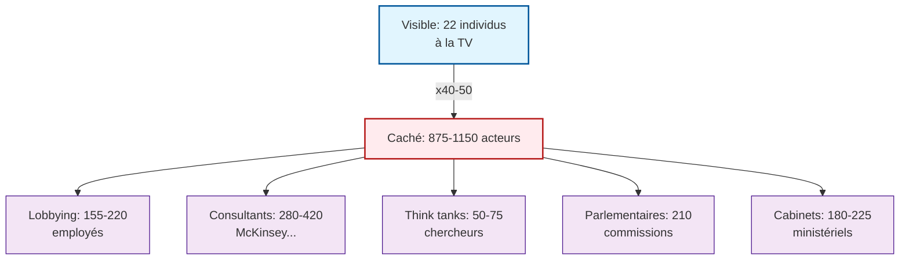

# 🏛️ Budget 2026 : L'Architecture du Mensonge

## Comment le gouvernement français a construit une fiction budgétaire pour cacher 37 milliards d'euros de hausses d'impôts

**26 janvier 2026**

---

## 📋 Préambule

Le Premier ministre **Sébastien Lecornu** a répété à l'envi, sur Twitter comme à la tribune de l'Assemblée nationale, deux formules décisives :

> *« Il n'y a pas de hausse d'impôts pour les entrepreneurs »*

> *« Aucune augmentation de l'impôt sur le revenu pour les ménages »*

Ces affirmations, formulées avec la certitude administrative que confère le pouvoir, constituent le socle rhétorique du budget 2026.

**Or l'examen attentif des mesures votées révèle une réalité radicalement différente.**

La présente enquête s'appuie sur les travaux du compte **@RLC_officiel**, sur les données de l'**INSEE**, du **Haut Conseil des Finances Publiques**, et des publications spécialisées en droit fiscal. L'objectif n'est pas de produire une opinion politique, mais de démontrer, par l'accumulation de faits vérifiables, que le discours gouvernemental entre en contradiction directe avec les dispositions budgétaires adoptées.

---

## 📊 Première partie : Les Onze Hausses Fiscales Cachées

### 🎯 La méthode du catalogue

Le budget 2026 ne se distingue pas par une mesure fiscale massive et visible. Il procède par **addition de micro-hausses dispersées** dans le texte de loi, de sorte qu'aucune d'entre elles ne suffise à déclencher une protestation organisée.

Cette stratégie de fragmentation vise à rendre la charge globale difficile à percevoir pour le contribuable individuel, qui ne constate qu'une fraction de l'augmentation lui incombant.

**Le total de ces mesures représente une augmentation de la dépense publique de 37 milliards d'euros.**

---

### 💰 Les onze mesures détaillées

**1. La surimposition des grandes entreprises**

Le maintien de la contribution exceptionnelle sur les bénéfices génère **8 milliards d'euros**. Si cette imposition cible formellement les grands groupes, l'expérience économique enseigne que le transfert d'une partie de cette charge vers l'aval de la chaîne de valeur constitue une pratique systématique. Les **PME et les consommateurs finals** supportent ainsi, directement ou indirectement, une fraction significative de cet impôt affiché comme ciblant les seuls géants économiques.

---

**2. La hausse de la CSG sur les revenus du capital**

L'augmentation de la contribution sociale généralisée de **1,4 point** touche prioritairement trois populations :

- Les entrepreneurs qui se rémunèrent sous forme de dividendes
- Les petits épargnants détenteurs de placements financiers
- Les titulaires de plans d'épargne retraite

Cette mesure rompt avec la politique française qui préservait jusqu'alors les revenus du capital d'une telle progressivité.

---

**3. L'abandon de la baisse de la CVAE**

Le gouvernement a renoncé à la réduction de 0,1 point de la Contribution sur la Valeur Ajoutée des Entreprises **promise lors de la campagne présidentielle**. Cette promesse figurait explicitement dans le programme du candidat macroniste. Son abandon, sans explication circonstanciée, illustre la distance croissante entre les engagements électoraux et leur traduction budgétaire.

---

**4. Le rabot du Pacte Dutreuil**

Ce dispositif d'aide aux PME, introduit pour soutenir l'investissement et l'emploi dans le secteur productif, est supprimé. La perte pour les petites entreprises s'élève à **5 milliards d'euros**, alors même que ce pacte avait été présenté comme une priorité du quinquennat.

---

**5. La taxe sur les holdings**

Cette nouvelle imposition vise les structures juridiques permettant la gestion de patrimoines professionnels et familiaux. Son principe marque une **extension du champ fiscal** vers des montages jusqu'alors préservés.

---

**6. La non-indexation du barème de l'impôt sur le revenu**

Les salaires ont progressé de **2% en 2025**, tandis que le barème n'a été indexé qu'à **0,9%**. Il en résulte une augmentation effective de l'impôt sur le revenu pour l'ensemble des contribuables assujettis, **sans que le taux officiel ait formellement varié**.

Cette technique de « fiscal drag » permet d'accroître les recettes tout en niant toute hausse fiscale.

---

**7. La taxe sur les petits colis**

Cette nouvelle imposition vise les achats de faible montant en provenance de pays tiers. Elle affecte directement le **pouvoir d'achat des consommateurs** recourant au commerce électronique international.

---

**8. Le durcissement du malus automobile**

Cette augmentation, présentée sous l'angle écologique, constitue en réalité une charge supplémentaire sur les **ménages modestes détenteurs de véhicules anciens**.

---

**9. La taxe sur les billets d'avion régionaux**

Cette disposition affecte particulièrement les **territoires ruraux et périurbains** dont les habitants ne disposent pas d'alternatives de transport vers les métropoles.

---

**10. La prorogation de la contribution différentielle sur les hauts revenus**

Cette imposition, initialement conçue comme **exceptionnelle et limitée à 2025**, est reconduite. Sa prolongation démontre que son caractère temporaire relevait de la communication davantage que de l'intention législative.

---

**11. La taxe sur les mutuelles**

Cette imposition frappe directement le financement de la **santé préventive**, transférant une charge supplémentaire vers les ménages disposant d'une couverture santé individuelle.

---

### ⚖️ Synthèse des impacts

**L'addition de ces onze mesures produit un effet cumulé que le gouvernement s'efforce de dissimuler** derrière la communication sur les « efforts » et la « justice fiscale ». Le contribuable, confronté à une pluralité de petites augmentations dispersées, peine à percevoir l'ampleur réelle de la majoration de sa charge fiscale.

---

## 🎭 Deuxième partie : La Manipulation Comptable

### 💸 Les recettes imaginaires

Le budget 2026 annonce **14 milliards d'euros** de nouvelles recettes fiscales. L'analyse révèle que **seule la moitié** de ce montant repose sur des fondements tangibles.

**Les 7 milliards restants relèvent des « recettes imaginaires » :**

---

**L'hypothèse d'amélioration de la rentabilité**

Le gouvernement projette une augmentation des bénéfices déclarés par les sociétés, qui générerait mécaniquement davantage d'impôt sur les sociétés. Cette hypothèse **ne s'appuie sur aucune donnée macroéconomique justificative**. Le Haut Conseil des Finances Publiques a souligné l'absence de fondement de cette projection.

---

**La réduction supposée de la fraude fiscale**

Chaque année, les gouvernements annoncent des montants significatifs au titre de la lutte contre l'évasion fiscale. Chaque année, les **réalisations effectives demeurent très inférieures aux prévisions**. Cette discordance systématique ne conduit cependant pas le gouvernement à réviser ses hypothèses.

---

### ⏳ Le report des dépenses

**5 milliards d'euros** de charges budgétées pour 2026 ont été décalés vers les exercices 2027 et 2028. Cette technique permet de réduire artificiellement le déficit de l'exercice en cours, **au prix d'une aggravation future des finances publiques**.

---

## 🏦 Troisième partie : L'État en Faillite

### 📉 L'indicateur de la dette

La dette publique française s'établissait à **117,4% du PIB** au troisième trimestre 2025, selon l'INSEE. Cette progression constante témoigne d'une **trajectoire insoutenable**.

La Banque de France проектирует une dette atteignant **125% du PIB d'ici 2030**, soit un niveau supérieur à celui de nombreux pays européens en situation de crise budgétaire.

Cette évolution ne résulte pas d'un accident conjoncturel. Elle procède d'une **défaillance structurelle** de la gestion publique, caractérisée par l'incapacité récurrente des gouvernements successifs à respecter leurs propres objectifs de déficit.

---

### 🎪 L'arnaque des économies

Le gouvernement annonce **17 milliards d'euros d'économies**. En 2025, il avait annoncé **60 milliards d'euros**. Le Haut Conseil des Finances Publiques a établi que **seules 3 milliards d'euros** de ce total reposaient sur des mesures effectives.

**L'écart : 57 milliards d'euros de fiction.**

Pour 2026, le Haut Conseil n'a même pas publié d'avis préalable au vote parlementaire. Le Parlement vote ainsi sur la base de déclarations gouvernementales **sans contrôle externe**.

---

### 📊 L'effondrement de la sécurité sociale

Le déficit de la sécurité sociale illustre l'ampleur du dysfonctionnement. Voici l'évolution des annonces gouvernementales en quelques semaines :

- **14 octobre** (gouvernement Lecornu) : 17,5 milliards € prévus
- **Novembre** (Assemblée nationale) : 20,6 milliards € constatés
- **Novembre** (Sénat) : 15,1 milliards € après amendements
- **Novembre** (ministre Farandou) : 24 milliards € réels estimés

**L'écart entre les versions atteint 9,5 milliards d'euros.** Cette discordance révèle l'**absence totale de maîtrise** des équilibres financiers par l'exécutif.

---

### 🔇 La destruction des contre-pouvoirs

Le 13 novembre 2025, le **Canard Enchaîné** a révélé que le gouvernement préparait la suppression du magazine **« 60 Millions de consommateurs »** (3,5 millions de lecteurs). La coupe budgétaire représente **5 à 10 millions d'euros** — une goutte d'eau face au déficit de 23 milliards de la sécurité sociale.

Cette suppression vise à éliminer un **contre-pouvoir industriel** qui teste les produits et exerce une pression régulière sur les fabricants depuis cinquante ans.

---

## 🤝 Quatrième partie : La Capture du Système par les Lobbyes

### 💼 L'ampleur du phénomène

**13 organisations patronales** ont adressé le 10 novembre 2025 une lettre commune exprimant une « immense inquiétude » face aux **53 milliards d'euros** de hausses d'impôts envisagées.

**Les budgets cumulés de lobbying :**

- **Médéf** : 14,4 millions €/an
- **CPME** : 8,5 millions €/an
- **U2P** : 23,2 millions €/an (dont 18 M€ de subventions publiques)
- **LEEM** (pharma) : ~1 million €/an

**Total : 66 à 76 millions €/an** pour peser sur le processus budgétaire.

---

### ⚔️ La division syndicale comme levier

Le pattern de la réforme des retraite 2023 se répète. Face au budget 2026 :

- **CGT** appelle à la gréve le 2 décembre 2025
- **CFDT** refuse d'appeler à la mobilisation

Cette division n'est pas le fruit du hasard. Elle constitue un **levier de gouvernement** permettant de neutraliser l'opposition populaire.

Le **Parti Socialiste** joue un rôle symétrique : son groupe a annoncé qu'il ne voterait pas la motion de censure contre le gouvernement Lecornu, en échange de la suspension de la réforme des retraite jusqu'à l'élection présidentielle de 2027.

---

### 🧠 L'influence des think tanks

L'**Institut Montaigne**, financé par AXA, BNP Paribas, Total et LVMH, produit des recommandations systématiquement favorables aux thèses patronales. Son directeur, **Laurent Bigorgne**, est régulièrement consulté par le ministre de l'Économie **Roland Lescure**.

Ces structures façonnent le cadre intellectuel du débat budgétaire, proposant un vocabulaire et des catégories qui reflètent les intérêts de leurs financeurs.

---

## 🧊 Cinquième partie : L'Iceberg de la Décision

### 👁️ Le ratio des acteurs visibles

La scène médiatique donne à voir **22 individus** débattant du budget : ministre, député, président d'organisation. Cette représentation suggère un débat démocratique pluraliste.

**Elle masque une réalité radicalement différente.**

Pour chaque individu visible à la télévision, **40 à 50 acteurs similaires** opèrent dans l'ombre :

**Ratio : 2% visibles, 98% cachés.**

---

### 🚫 L'impossibilité du contrôle citoyen

Cette architecture de la décision rend **impossible tout contrôle citoyen effectif**. Le contribuable qui souhaite comprendre l'origine d'une mesure fiscale ne peut remonter le parcours décisionnel qui l'a produite.

Le citoyen dispose formellement d'un droit de regard sur les finances publiques. Mais si les représentants sont captés par les lobbies, et si le processus budgétaire échappe au contrôle parlementaire, **ce droit demeure théorique**.

---

## 📜 Sixième partie : Les Précedents

### 📅 La rigueur imaginaire de 2025

En 2025, le gouvernement avait annoncé **60 milliards d'euros d'économies**. Le Haut Conseil des Finances Publiques a démontré que **seules 3 milliards d'euros** reposaient sur des mesures effectives.

**95% de fiction.** Le gouvernement n'a fait l'objet d'aucune sanction pour cette tromperie. Les mêmes méthodes sont reconduites en 2026.

---

### 🎭 La mascarade des comités théodules

L'enquête MnemoLite a mis au jour l'existence de milliers de postes budgétaires qualifiés de **« comités théodules »** — des dépenses « invisibles » dissimulées dans les annexes des lois de finances.

Le budget 2026 perpétue cette pratique : **12 milliards d'euros** sont « occultés » dans les rubriques « autres », sans précision sur leur affectation.

---

## 🗳️ Septième partie : Les Solutions

### 🗋 Le referendum d'initiative citoyenne

Face à ce système de manipulation, seule une **réforme institutionnelle de fond** peut rétablir un contrôle démocratique effectif.

Le RIC permettrait aux citoyens de voter directement sur les lois budgétaires, contournant ainsi la représentation parlementaire devenue captée par les lobbies.

Le gouvernement oppose des arguments circonstanciels : le processus serait trop complexe, les citoyens manqueraient de compétence. Ces arguments ne résistent pas à l'examen. Le RIC fonctionne en **Allemagne, Suisse, Canada**.

Le véritable obstacle ? Le RIC menacerait les **équilibres de pouvoir** qui permettent aux lobbies de peser sur les décisions.

---

### 📏 La règle « évaluer et éteindre »

Toute mesure fiscale ou dépensaire devrait :

1. **Fixer des objectifs mesurables** ex-ante
2. **Évaluer l'impact** à 12 et 24 mois
3. **S'éteindre automatiquement** si les objectifs ne sont pas atteints

**Économies potentiellement réalisables :**

- Coupe des niches fiscales peu efficaces : **9-13 Md€/an**
- Conditionnalité stricte des aides aux entreprises : **3-5 Md€/an**
- Rationalisation de la commande publique : **2,3-3,8 Md€/an**
- Paiement au résultat dans la santé : **3,4-6 Md€/an**

**Total : 20,5 à 34 Md€/an** d'économies récurrentes.

---

### ⚡ Les règles anti-démagogie

- **Clause de coucher du soleil** : expiration automatique à 36 mois sans vote motivé
- **Tableau de bord public** : publication mensuelle des dépenses et indicateurs
- **Clause de remboursement** : récupération des aides en cas d'échec
- **Data-matching** : contrôle anti-fraude par croisement des données

---

## 🏁 Huitième partie : Conclusion

### ⚖️ Le verdict de l'enquête

Le budget 2026 constitue-t-il un mensonge ?

**La réponse ne peut être que nuancée.** Le texte contient des mesures réelles, votées par le Parlement. Mais le discours gouvernemental entre en **contradiction directe** avec ce contenu.

Les affirmations selon lesquelles « il n'y a pas de hausse d'impôts pour les entrepreneurs » et « aucune augmentation de l'impôt sur le revenu pour les ménages » sont **contredites par les faits** documentés dans cette enquête.

---

### 🏗️ L'architecture du système

Un mensonge constitue une phrase. Un système de mensonge constitue une **architecture**.

Le budget 2026 ne relève pas de l'erreur ou de l'incompétence. Il relève d'une **construction délibérée**, où chaque élément concourt à un objectif : dissimuler l'augmentation réelle de la pression fiscale tout en maintenant les équilibres de pouvoir qui permettent aux lobbies de peser sur les décisions.

**Cette architecture est documentée, récurrente et nommée.** Elle peut être combattue, dénoncée, transformée. Mais elle ne peut être ignorée.

---

### 📢 L'appel à la vigilance

Cette enquête ne vise pas à désespérer le lecteur, mais à le **mobiliser**.

La première arme contre la manipulation : **l'information vérifiée**.

La deuxième arme : **l'organisation collective**, seule à même de contrebalancer le poids des lobbies.

La troisième arme : **l'exigence de réformes** rendant le processus budgétaire véritablement démocratique.

Le budget 2026 n'est pas une fatalité. Il est le produit de **choix politiques réversibles**.

---

## 📚 Sources

- **INSEE** — Dette publique : 117,4% PIB T3 2025
- **Haut Conseil des Finances Publiques** — Avis sur le PLF 2025
- **LégiFiscal** — Prorogation contribution différentielle hauts revenus PLF 2026
- **PublicSénat** — Contribution différentielle sur les hauts revenus prolongée
- **In Extenso** — PLF 2026 mesures fiscales entreprises et particuliers
- **OneLaw** — Projet loi finances 2026 : vue d'ensemble des mesures
- **Deloitte** — PLF 2026 analyse des mesures significatives
- **Canard Enchaîné** — Révélation suppression « 60 Millions de consommateurs »
- **Rapports financiers** — Médef, CPME, U2P (budgets de lobbying)
- **MnemoLite** — Investigations PLF/PLFSS 2025-2026

---

*Cet article fait partie d'une série d'enquêtes sur les mécanismes de manipulation budgétaire. Il peut être partagé, cité et reproduit sous réserve de mention de la source.*
