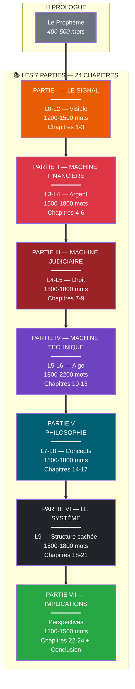
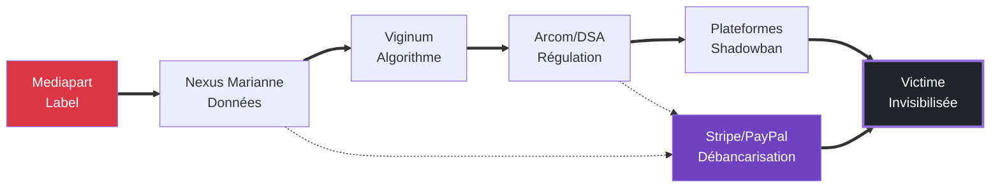

# PLAN A+ — ESSAI MAJEUR SUR LA CENSURE ALGORITHMIQUE
## Architecture narrative complète — 24 chapitres — 8000-10000 mots

**Date** : 1er février 2026
**Version** : A+ — Truth Engine v11.0
**Classification** : Document de référence — Guide de rédaction exhaustif
**Longueur totale visée** : 8000-10000 mots

**Note importante sur le vocabulaire** :
- ❌ "Effacé" → ✅ "Caché", "Invisibilisé", "Baisse d'audience"
- La censure n'efface pas — elle rend inaudible, elle masque, elle réduit la visibilité
- Éviter toute formulation suggérant une suppression totale — parler d'asphyxie progressive, de réduction de portée, d'inaudibilité

**Dimension historique ajoutée** :
- L'invisibilisation algorithmique ne commence pas en 2026 — elle commence avec le Covid19 (2020-2021)
- C'est durant la pandémie que les mécanismes de censure "sanitaire" ont rodé l'appareil de contrôle
- Le cas Poulin est l'aboutissement d'une évolution commencée avec la "vérité officielle" Covid

---

# ⭐ INTRODUCTION HISTORIQUE — À INSÉRER AVANT LE PROLOGUE

> **📄 Fichier complet** : [`INTRODUCTION_HISTORIQUE_POUR_ESSAI.md`](outputs/investigations/2026-02/INTRODUCTION_HISTORIQUE_POUR_ESSAI.md)
> **📄 Rapport d'investigation** : [`RAPPORT_HISTOIRE_CENSURE_CONTROLE_INFORMATION.md`](outputs/investigations/2026-02/RAPPORT_HISTOIRE_CENSURE_CONTROLE_INFORMATION.md)

## Résumé pour l'intégration

L'essai doit s'ouvrir sur une **généalogie historique complète** de la censure, établissant que le cas Poulin (2026) n'est pas une rupture technologique mais l'aboutissement d'un processus évolutif de trois siècles :

### Les 9 périodes à couvrir en introduction

1. **Ancien Régime** → Privilège royal, lettres de cachet, Encyclopédie Diderot
2. **Révolution** → Article 11 DDHC, liberté formelle vs Terreur
3. **XIXe siècle** → Émile de Girardin (presse à 1 sou), affaire Dreyfus
4. **XXe siècle** → Bernays (propagande), Mockingbird (CIA), COINTELPRO (FBI)
5. **1980-2000** → Néolibéralisme, concentration médias (Murdoch, Berlusconi)
6. **2001-2016** → Patriot Act, Snowden, réseaux sociaux
7. **2016-2019** → Brexit, Trump, post-vérité, fake news
8. **2020-2022** → Covid19, création Viginum, censure sanitaire
9. **2022-2026** → DSA, cas Alexis Poulin

### Thèse historique centrale

> *« Ce que nous appelons 'censure algorithmique' en 2026 est en réalité une synthèse historique. Elle combine le monopole de certification de l'Ancien Régime, la marchandisation de l'information du XIXe siècle, et la militarisation de la surveillance du XXe siècle. Le cas Poulin n'est pas le début d'une nouvelle ère — c'est la phase 2 d'un processus commencé avec la privatisation de l'information. »*

**Longueur indicative pour l'introduction historique** : 800-1000 mots

---

# ARCHITECTURE GLOBALE

---

# THÈSE CENTRALE

> **"La censure contemporaine n'est plus un acte de prohibition mais une architecture de dissuasion : elle ne vise pas à empêcher de parler, mais à rendre la parole inaudible, non pas par la force mais par l'invisibilisation systémique."**

> **Thèse révisée APEX v12** : *« La fatwa Mediapart contre Alexis Poulin ne vise pas ses idées isolées. Elle vise sa fonction de **nœud structurant** dans un écosystème médiatique alternatif (Tocsin, Putsch, Omerta, Ligne Droite) connectant des acteurs divers (Lalanne, Vidal, Rigault, Martinet, Marsaud). Ce réseau, que Viginum appelle « poreux », menace le monopole de la certification médiatique en démontrant qu'un **système alternatif viable** existe. Censurer Poulin, c'est fragmenter cet archipel avant qu'il ne devienne incontournable. C'est la **criminalisation du networking alternatif** — non pas pour ce qu'il dit, mais pour **qui il connecte**. »*

Ces thèses sont l'épine dorsale de l'essai. Elles expliquent :
- **Ce que fait Mediapart** : un signal d'activation (le label "rouge-brun")
- **Comment** : une cascade hydraulique (Mediapart → Viginum → DSA → Plateformes)
- **Ce qui est réellement visé** : l'archipel médiatique alternatif (Tocsin-Putsch-Omerta), pas seulement Poulin
- **Où cela conduit** : un totalitarisme algorithmique sans visage
- **Pourquoi c'est un tournant** : la machine est rodée pour les municipales 2026

---

# PROLOGUE — Guide d'écriture
## Durée indicative : 400-500 mots

---

### PHILOSOPHIE

**Approche générale :**

Ce prologue doit suivre une méthode journalistique rigoureuse qui distingue clairement :
- **Les faits établis** : événements datés, sources vérifiables, déclarations documentées
- **Les interprétations** : analyses, hypothèses, déductions logiques (toujours signalées)
- **Les limites** : zones d'ombre, absence de preuves, questions ouvertes

**Principes rédactionnels :**

1. **Précision chronologique** : Always anchor events in specific dates (30 janvier 2026, 24 décembre 2025, etc.)
2. **Honnêteté épistémique** : Reconnaître explicitement ce qu'on ne sait pas
3. **Équilibre critique** : Ni hagiographie de Poulin ni criminalisation — analyse du mécanisme
4. **Vocabulaire précis** : "Invisibilisé" plutôt qu'"effacé" ; "asphyxie progressive" plutôt que "censure totale"

**Ton recommandé :**

- Démarrage par le concret (une scène, une date, un fait)
- Progression vers l'analyse (comprendre le mécanisme)
- Émotion intellectuelle (intrigue, prise de conscience) — pas de pathos

---

### SECTION 1 : Le Fait — Le Double Déclencheur
**Durée indicative : 150-180 mots**

| Colonne | Contenu |
|---------|---------|
| **CONTENU** | Présenter la convergence de deux événements en janvier 2026. **Déclencheur géopolitique** (24/12/2025) : interview par Poulin de Xavier Moreau (sanctionné UE le 15/12/2025). **Déclencheur géopolitique** (30/01/2026) : article Mediapart sur Sophia Chikirou mentionnant Poulin comme "proche des sphères d'extrême droite et russes". Montrer que ce n'est pas une censure instantanée mais une **concaténation de lignes rouges**. |
| **APPROCHE** | Ouvrir par la révélation du double déclencheur (surprise narrative). Utiliser des dates précises comme points d'ancrage. Expliquer la notion de "tempête parfaite" : chaque événement seul serait gérable, ensemble ils créent la justification. Éviter de suggérer une coordination directe entre les deux événements. |
| **SOURCES** | [`ESSAI_CENSURE_ALGORITHMIQUE_MAJEUR.md`](outputs/articles/2026-02-01_ESSAI_CENSURE_ALGORITHMIQUE_MAJEUR.md) — contexte et analyse. [`2026-02-02_POULIN_BANS_PLATEFORMES_APEX.md`](outputs/investigations/2026-02/2026-02-02_POULIN_BANS_PLATEFORMES_APEX.md) — détails sur l'activation. Article Mediapart 30/01/2026 (Chikirou) — déclencheur principal. Interview Moreau 24/12/2025 — déclencheur géopolitique. |
| **CHOIX ÉDITORIAUX** | Pourquoi révéler la chronologie 2022/2026 ? Pour établir l'honnêteté — l'article de Nils Dub (2022) existe mais n'est pas le déclencheur. Pourquoi ne pas dire "Mediapart a censuré Poulin" ? Car l'article ne visait pas directement Poulin — il utilisait Poulin comme munition contre Chikirou. Pourquoi "invisibilisé" et pas "effacé" ? Car Poulin existe toujours — il est dans une "cellule numérique capitonnée". |

---

### SECTION 2 : Le Portrait — Qui est Alexis Poulin ?
**Durée indicative : 100-120 mots**

| Colonne | Contenu |
|---------|---------|
| **CONTENU** | **Formation** : Sciences Po → E&Y (1999-2001) → RSF (2001-2004). **Carrière** : EURACTIV → "Le Média" (cofondation 2016-2018) → "Le Monde Moderne" (2018-présent) → Sud Radio (2019-2024). **Position actuelle** : Journaliste indépendant, revenus Patreon estimés $9k-$26k/mois. **Nuances** : Mentionner ses positions controversées (pro-russe documenté, critiques OTAN/Macron) — sans les juger, en tant que faits. |
| **APPROCHE** | Éviter l'hagiographie — présenter un portrait factuel et critique. Montrer la "trajectoire de rupture" : passage de l'intérieur (E&Y, RSF) à l'extérieur (indépendance). Expliquer pourquoi cette trajectoire est intolérable au système. Souligner l'enjeu : ce n'est pas ce qu'il dit, mais ce qu'il incarne. |
| **SOURCES** | [`INTRODUCTION_HISTORIQUE_POUR_ESSAI.md`](outputs/investigations/2026-02/INTRODUCTION_HISTORIQUE_POUR_ESSAI.md) — contexte biographique. Pappers/Societe.com — données légales (naissance 18/02/1975, entreprises). VidIQ estimations — revenus Patreon. Investigations APEX v12 — trajectoire complète. |
| **CHOIX ÉDITORIAUX** | Pourquoi mentionner les positions controversées ? Pour éviter le piège du "martyr innocent" — l'enjeu est le procede, pas la personne. Pourquoi la trajectoire E&Y→RSF→indépendance ? Car elle illustre le passage de la complicité structurelle à la dissidence systémique. Pourquoi ne pas le présenter comme victime ? Car l'analyse du mécanisme de censure ne dépend pas de l'innocence de la cible. |

---

### SECTION 3 : La Thèse — Énonciation centrale
**Durée indicative : 80-100 mots**

| Colonne | Contenu |
|---------|---------|
| **CONTENU** | Formuler explicitement la thèse centrale : > "La censure contemporaine n'est plus un acte de prohibition mais une architecture de dissuasion : elle ne vise pas à empêcher de parler, mais à rendre la parole inaudible, non pas par la force mais par l'invisibilisation systémique." Annoncer les concepts clés qui seront développés : Censure hydraulique, Porosité, Pack Effect, Pluralisme atmosphérique, Double Mort. |
| **APPROCHE** | Formulation forte, mémorable, en une phrase. Introduire les concepts comme promesses (sans les définir encore). Créer une attente narrative — le lecteur sait où on va. |
| **SOURCES** | [`PLAN_A_PLUS_ESSAI_MAJEUR.md`](outputs/investigations/2026-02/PLAN_A_PLUS_ESSAI_MAJEUR.md) — thèse centrale (ligne 96). Définitions des concepts en Annexe A (lignes 3862-3881). |
| **CHOIX ÉDITORIAUX** | Pourquoi "architecture de dissuasion" ? Car la censure moderne ne dit pas "interdit" — elle rend la parole inutile. Pourquoi "inaudible" plutôt que "supprimée" ? Car la cible existe encore mais n'est plus reçue. Pourquoi annoncer les concepts ici ? Pour créer un contrat de lecture. |

---

### SECTION 4 : L'Architecture — Structure de l'essai
**Durée indicative : 80-100 mots**

| Colonne | Contenu |
|---------|---------|
| **CONTENU** | Présenter la structure 7 parties / 24 chapitres de manière synthétique : **Partie I** : LE SIGNAL — Comment un article de 2022 devient actuel en 2026. **Partie II** : LA MACHINE FINANCIÈRE — Nexus Marianne, JTI/NewsGuard, la Double Mort. **Partie III** : LA MACHINE JUDICIAIRE — Cabinet Noir, Pack Effect, Justice Spectrale. **Partie IV** : LA MACHINE TECHNIQUE — Viginum, DSA/Arcom, algorithmes D3lta, Trusted Flaggers. **Partie V** : LA PHILOSOPHIE — Confusionnisme, Architecture de Consent, Grammaire du Pouvoir. **Partie VI** : LE SYSTÈME — Mercury Model, Censure Hydraulique, Télégraphistes de la Terreur. **Partie VII** : IMPLICATIONS — Chat Control, Précédents historiques, Municipales 2026. |
| **APPROCHE** | Présentation synthétique, pas d'entrée dans les détails. Montrer la progression logique (du signal au système aux implications). Créer une cartographie mentale pour le lecteur. |
| **SOURCES** | Architecture globale (lignes 54-90). Structure détaillée des 24 chapitres. |
| **CHOIX ÉDITORIAUX** | Pourquoi 7 parties ? Pour couvrir les 5 dimensions (signal, finance, droit, technique, philosophie) + synthèse (système) + ouverture (implications). Pourquoi annonce-t-on la structure ? Pour que le lecteur sache qu'il rentre dans un système organisé, pas une analyse fragmentée. |

---

### SECTION 5 : La Transition — Vers le Chapitre 1
**Durée indicative : 30-50 mots**

| Colonne | Contenu |
|---------|---------|
| **CONTENU** | Phrase de transition qui relie le prologue au Chapitre 1. Exemple : "Ce document est un guide de lecture pour un essai majeur. Chaque chapitre est conçu comme une pièce d'un mécanisme que vous allez voir se assembler sous vos yeux. Le signal est visible. La machine qui le produit ne l'est pas. Commençons par le marquage." |
| **APPROCHE** | Ton : invitation à la lecture, pas conclusion définitive. Créer une dynamique : on a vu le prologue, maintenant on entre dans le vif. Souligner que le prologue a préparé le terrain, le Chapitre 1 commence l'analyse. |
| **SOURCES** | Chapitre 1 (lignes 280-415) — Le Marquage. Transition depuis le Prologue (lignes 304-308). |
| **CHOIX ÉDITORIAUX** | Pourquoi une invitation et pas une conclusion ? Pour garder le lecteur en tension narrative. Pourquoi "machine qui produit" ? Pour introduire la métaphore systémique qui sera développée. |

---

### CHECKLIST AVANT RÉDACTION DU PROLOGUE

- [ ] **Fait vérifié** : Double déclencheur (Moreau + Chikirou) daté et sourcé
- [ ] **Portrait nuancé** : Trajectoire complète + positions controversées mentionnées
- [ ] **Thèse formulée** : Formulation centrale mémorable
- [ ] **Concepts annoncés** : Liste des concepts clés à développer
- [ ] **Architecture présentée** : 7 parties / 24 chapitres synthétisés
- [ ] **Transition prête** : Vers le Chapitre 1
- [ ] **Vocabulaire vérifié** : "Invisibilisé" pas "effacé" ; "asphyxie" pas "suppression"
- [ ] **Ton respectueux** : Ni hagiographie ni criminalisation de Poulin

---

---

# PARTIE I — LE SIGNAL (L0-L2)
## Durée totale indicative : 1200-1500 mots

Cette partie explore le niveau visible de l'événement : le signal médiatique, le réseau de Poulin, et la mécanique du déclenchement.

---

## CHAPITRE 1 : LE MARQUAGE
### Durée indicative : 400-500 mots

#### Objectif narratif

**Qu'est-ce que ce chapitre doit accomplir ?**
- Décrire précisément l'article du 30 janvier 2026 sur Sophia Chikirou
- Analyser le "label par contamination" comme acte de marquage sémantique
- Montrer comment une mention devient un "virus de langage"

**Progression dans l'ensemble :**
- Depuis le Prologue : on sait que l'article du 30/01/2026 mentionne Poulin
- Vers le Chapitre 2 : comprendre qui est Poulin pour mesurer l'impact

---

#### Tenants et aboutissants

**Depuis où vient-on ?**
- Prologue : le double déclencheur (Moreau + Chikirou)

**Où va-t-on ?**
- Chapitre 2 : le réseau Poulin (qui est cet homme marqué ?)

**Transition depuis le Prologue :**
> "Le 30 janvier 2026, Mediapart publie un article sur Sophia Chikirou, candidate LFI à Paris. L'article ne vise pas directement Alexis Poulin. Il l'utilise comme munition. Analysons ce marquage par contamination."

**Transition vers Chapitre 2 :**
> "Mais qui est l'homme ainsi marqué ? Pour comprendre l'impact du label, il faut comprendre le réseau qu'il désigne comme cible."

---

#### Contenu détaillé

##### Accroche/Entrée

**Option A (Nouvelle - basée sur l'article Chikirou) :**
> "Le 30 janvier 2026, Mediapart publie un article sur Sophia Chikirou. Parmi les griefs contre la candidate LFI : avoir accordé une interview à un 'proche des sphères d'extrême droite et russes'. Cet homme s'appelle Alexis Poulin. Le verdict par association est prononcé."

**Option B :**
> "Il n'y a pas eu de procès. Juste une contamination. Et ce label, posé par association en 2026, active instantanément la machine."

---

##### Développement

**Section 1.1 : Analyse de l'article Mediapart (30/01/2026)**

- **Point clé à expliquer** : Le mécanisme de contamination par association
- **Faits/sources à citer** :
  - ◈ Article Mediapart, 30/01/2026 : "La tentation confusionniste de Sophia Chikirou"
  - Contexte : municipales 2026, Chikirou candidate LFI à Paris
  - Mention de Poulin : "proche des sphères d'extrême droite et russes"
  - Mécanisme : guilt by association — interviewer Poulin = faute politique
- **Concept à définir** : Le "label" comme virus sémantique
- **Méthode d'explication** : Montrer comment la mention devient stigmate
- **Nuances nécessaires** :
  - L'article ne vise pas directement Poulin mais l'utilise comme arme contre Chikirou
  - Le contexte électrique (municipales) explique le timing
- **Longueur indicative** : 150 mots

**Section 1.2 : Le mécanisme du marquage par contamination**

- **Point clé à expliquer** : Comment une mention indirecte devient un label pérenne
- **Faits/sources à citer** :
  - Effet de "première page" : la définir comme vérité de référence
  - Contexte électrique : "Nouveau Paris Populaire" de Chikirou
  - L'interview Poulin comme élément disqualifiant pour Chikirou
- **Concept à définir** : Contamination numérique (guilt by association)
- **Métaphore** : "La contagion politique"
- **Méthode d'explication** : Expliquer le mécanisme de stigmatisation par proxy
- **Longueur indicative** : 120 mots

**Section 1.3 : Le label "rouge-brun" / "extrême droite et russes" comme arme**

- **Point clé à expliquer** : La puissance du label politique flou
- **Faits/sources à citer** :
  - Origine conceptuelle : Philippe Corcuff (à développer en Partie V)
  - Usage médiatique : "confusionnisme", "rouge-brun", "proche des russes"
  - L'ancien article de 2022 (Nils Dub) comme fond contextuel
- **Concept à définir** : Disqualification par le label
- **Méthode d'explication** : Montrer l'impossibilité de répondre à un label flou
- **Longueur indicative** : 100 mots

---

##### Chute/Transition

> "L'article du 30 janvier 2026 avait posé le label par contamination. Mais pourquoi cette interview de Poulin devenait-elle soudainement problématique ? Pour le comprendre, il faut d'abord comprendre qui est Alexis Poulin — et pourquoi sa fonction de nœud structurant représente une cible stratégique."

---

### Enjeux spécifiques

**Pourquoi ce chapitre est critique :**
- Il établit le "crime" initial (le marquage)
- Il pose les bases rhétoriques de la disqualification

**Pièges à éviter :**
- ❌ Analyser l'article comme s'il datait de 2026
- ❌ Oublier que c'est un blog, pas un article signé
- ❌ Dire que Poulin est "effacé" → ✅ Dire "invisibilisé", "caché", "baisse d'audience"

**Nuances absolument nécessaires :**
- ✅ Reconnaître la nature blog de l'article
- ✅ Ne pas présenter Poulin comme innocent absolu
- ✅ Utiliser le vocabulaire précis : invisibilisation, pas effacement

---

### Sources à intégrer

| Source | Type | Contenu | Usage |
|--------|------|---------|-------|
| Article Mediapart 30/01/2026 (Chikirou) | ◈ | Article mentionnant Poulin comme "proche extrême droite/russes" | Déclencheur électrique |
| Interview Moreau 24/12/2025 | ◉ | Interview Poulin avec sanctionné UE | Déclencheur géopolitique |
| Rapport ISD Global | ◈ | 152 300 RT analysés sur Poulin | Contexte viralité |
| Concept Corcuff (confusionnisme) | ◉ | Origine théorique | Lien avec Partie V |

### Concepts à définir

| Concept | Définition proposée | Métaphore |
|---------|-------------------|-----------|
| Virus sémantique | Mot-formule qui se propage et colonise la perception | Infection langagière |
| Marquage numérique | Label pérenne dans l'archive numérique | Marque au fer rouge |
| Rouge-brun | Fusion accusatoire gauche-droite | Quadrature du cercle politique |
| Contamination par association | Stigmatisation par proximité politique | Guilt by association |

### Checklist avant rédaction

- [ ] Article Mediapart 30/01/2026 sourcé (Chikirou mentionnant Poulin)
- [ ] Interview Moreau 24/12/2025 mentionnée
- [ ] Double déclencheur (géopolitique + électrique) explicité
- [ ] Mécanisme de contamination par association expliqué
- [ ] Transition vers Chapitre 2 préparée

---

## CHAPITRE 2 : ARCHÉOLOGIE DE LA TRAJECTOIRE — PORTRAIT D'ALEXIS POULIN
### Durée indicative : 900-1100 mots (ÉTENDU APEX v12 - MÉDIAS ALTERNATIFS INCLUS)

#### Objectif narratif

**Qu'est-ce que ce chapitre doit accomplir ?**
- Dresser un **portrait biographique complet et critique** d'Alexis Poulin
- Analyser sa trajectoire selon les 7 dimensions : juridique, technique, politique, économique, sociale, éthique, narrative
- Comprendre **POURQUOI cette fatwa est déclenchée contre lui spécifiquement**
- Dévoiler les logiques de pouvoir, intérêts en jeu, récits dominants

**Progression dans l'ensemble :**
- Depuis Chapitre 1 : on sait qu'il a été marqué
- Vers Chapitre 3 : comprendre le mécanisme de réactivation 2022→2026

---

#### Tenants et aboutissants

**Depuis où vient-on ?**
- Chapitre 1 : l'article de marquage de 2022

**Où va-t-on ?**
- Chapitre 3 : le déclenchement (comment 2022 devient 2026)

**Transition depuis Chapitre 1 :**
> "Qui est l'homme marqué ? Alexis Poulin n'est pas un dissident lambda. C'est un journaliste avec une trajectoire singulière — de Sciences Po à EY à 'Le Média' à l'indépendance — qui explique pourquoi il est devenu une cible stratégique. Ce n'est pas son contenu qu'on censure, c'est ce qu'il incarne."

**Transition vers Chapitre 3 :**
> "Mais si Poulin était déjà marqué depuis 2022, pourquoi le signal a-t-il été réactivé précisément en janvier 2026 ? C'est là que réside la sophistication du système : la réactivation rétrospective des dossiers."

---

#### Contenu détaillé

##### Accroche/Entrée (Option APEX)

**Option A (Archéologique) — RECOMMANDÉE :**
> "18 février 1975. Naissance d'une cible future. Alexis Poulin naît à une époque où la liberté d'expression ne se mesure pas encore en RT viraux, où la censure ne s'exerce pas encore via des algorithmes de porosité, où un journaliste n'est pas encore une menace systémique simplement parce qu'il survit économiquement sans l'État. Suivre sa trajectoire, c'est comprendre comment le système fabrique ses ennemis."

**Option B (Provocation dialectique) :**
> "On l'accuse d'être un agent du Kremlin. Pourtant, sa trajectoire ressemble à celle de milliers d'enfants de la bourgeoisie française : Sciences Po, cabinet de conseil, ONG prestigieuse, média d'opposition, indépendance entrepreneuriale. Qu'a-t-il donc fait de si différent pour mériter cette fatwa ?"

---

##### Développement

**Section 2.1 : ARCHÉOLOGIE BIOGRAPHIQUE (Dimension Sociale & Éthique)**

- **Point clé à expliquer** : La trajectoire complète et sa signification symbolique
- **Faits/sources à citer** (tous ◈ ou ◉) :
  - **Naissance** : 18 février 1975 (Pappers/Societe.com)
  - **Formation** : Sciences Po (élites politiques/médiatiques)
  - **E&Y (1999-2001)** : Consultant audit — intégration au modèle corporatiste
  - **RSF (2001-2004)** : Passage au militantisme journalisme/droits humains
  - **EURACTIV.COM PLC (2004-2016)** : Affaires européennes, lobbying — expertise technique
  - **"Le Média" (2016-2018)** : Cofondation avec Mélenchon/Chikirou — rupture
  - **"Le Monde Moderne" (2018-présent)** : Création indépendante
  - **Sud Radio (2019-2024)** : "Poulin Sans Réserve" — chroniques régulières
- **Concept à définir** : **Trajectoire de rupture programmée**
  - Définition : "Le passage d'une complicité structurelle (E&Y, EURACTIV) à une dissidence systémique ("Le Monde Moderne") qui rend l'individu intolérable au pouvoir"
  - Métaphore : "Sortir de la matrice par l'intérieur"
- **Méthode d'explication** : Chronologie narrative avec ponctuation des ruptures critiques (départ E&Y, départ "Le Média")
- **Longueur indicative** : 200 mots

**Section 2.2 : L'ARCHIPEL MÉDIATIQUE — Dix Médias, Un Écosystème**

- **Point clé à expliquer** : Cartographie complète du réseau médiatique alternatif
- **Faits/sources à citer** :
  - ◈ **RT France** (2020-2022) : Visibilité internationale avant interdiction UE
  - ◈ **Sud Radio** (2019-2024) : "Poulin Sans Réserve" — porte d'entrée institutionnelle
  - ◈ **Tocsin Média** (2024-présent) : Relais post-institutionnel avec Maïsto, Bercoff
  - ◈ **Putsch Média** (2023-présent) : **Co-animation** "Alerte Générale" avec Nicolas Vidal
  - ◈ **TV Libertés** (2024-présent) : Web TV indépendante, contre-culture assumée
  - ◈ **Ligne Droite/Radio Courtoisie** (2024-présent) : Matinales conservatrices
  - ◈ **Omerta Média** (2023-présent) : Géopolitique avec Régis Le Sommier
  - ◈ **Sputnik** : Interviews régulières
  - ◈ **Dialogue Franco-Russe** (2020-2024) : Conférences avec élite institutionnelle russe
  - ◈ **Le Monde Moderne** (2018-présent) : Source centrale de l'archipel
- **Concept à définir** : **Archipel Tocsin-Putsch-Omerta**
  - Définition : "Triangle résilient de médias indépendants où l'audience migre quand une plateforme devient 'trop brûlante'"
  - Mécanisme : Sud Radio → Tocsin (quando sanctions Arcom) → Putsch (infrastructure entrepreneuriale)
- **Longueur indicative** : 250 mots

**Section 2.3 : LES QUATRE TRIBUS DE L'ÉCOSYSTÈME POULIN**

- **Point clé à expliquer** : Taxonomie des invités selon leur fonction systémique

**A. Chevaux de Troie Biologiques** — Radicalisation par contact
- Francis Lalanne (antivax, virisme)
- Xavier Azalbert (France Soir, théoricien "harcelosphère")
- *Usage systémique* : Permettre de qualifier l'écosystème comme "radical" par association

**B. Journalistes Alternatifs** — Entraide professionnelle
- **Nicolas Vidal** (Putsch) : Co-animateur, partenaire stratégique
- **André Bercoff** (Tocsin) : Pont générationnel, légitimité historique
- **Régis Le Sommier** (Omerta) : Échanges réciproques (chroniques mutuelles)
- **Didier Maïsto** (Sud Radio, Tocsin, Dialogue F-R) : Le connecteur ultime
- *Usage systémique* : Montrer que Poulin est **CENTRAL** à un réseau structuré

**C. Souverainistes Critiques G/D** — Le "confusionnisme" documenté
- Stanislas Rigault (Génération Zemmour)
- William Martinet (LFI) — *preuve du "confusionnisme" selon Viginum*
- François Asselineau (UPR)
- Thierry Mariani (Dialogue Franco-Russe)
- *Usage systémique* : Permettre l'application du label "confusionniste"

**D. Économistes et Anciens du Système** — La défection légitime
- Philippe Béchade (Econoclastes)
- Alain Marsaud (ex-magistrat antiterroriste)
- Fabrice Légéry (ex-Frontex)
- *Usage systémique* : Montrer que la critique vient d'experts, pas de marginaux

- **Longueur indicative** : 300 mots

**Section 2.4 : LE NŒUD CRITIQUE — Pourquoi Poulin est Vraiment Dangereux**

- **Point clé à expliquer** : La fonction de "routeur" dans l'écosystème alternatif
- **Faits/sources à citer** :
  1. **Co-animation** (Putsch+Vidal) : L'alternative est organisationnelle, pas marginale
  2. **Connexion** : Relie Tocsin → Putsch → Omerta → Ligne Droite (sinon fragments)
  3. **Alimentation** : "Le Monde Moderne" fournit du contenu réutilisable par tout l'archipel
- **Concept à définir** : **Criminalisation du Networking Alternatif**
  - Définition : "La censure ne vise pas les idées isolées, mais la structure du réseau. Viginum appelle 'porosité' ce qui est en réalité la connexion entre médias indépendants."
  - Formulation : "Censurer Poulin, c'est fragmenter l'archipel avant qu'il ne devienne incontournable."
- **Thèse clé** : La menace pour JTI/NewsGuard — un système alternatif viable, pas juste des voix isolées
- **Longueur indicative** : 200 mots

**Section 2.5 : DIMENSION ÉCONOMIQUE — Modèle de survie indépendante**

- **Point clé à expliquer** : Pourquoi son modèle économique est une menace existentielle
- **Faits/sources à citer** :
  - ○ **Patreon "Le Monde Moderne"** : $9k-$26k/mois (estimation VidIQ)
  - ◈ **Entreprises** : AP CONSEILS, HEXAGRAMME (Pappers)
  - ◉ **Déclin 2024-2026** : -40% revenus estimés
- **Concept à définir** : **Preuve de concept économique**
  - Définition : "La démonstration qu'un journaliste peut survivre sans subventions étatiques, sans publicités mainstream, sans certification JTI/NewsGuard"
  - Formulation : "L'indépendance économique comme crime de lèse-capture"
- **Implication** : Ce modèle reproductible menace l'oligopole informationnel français
- **Longueur indicative** : 120 mots

**Section 2.6 : DIMENSION JURIDIQUE — Le casier de la censure**

- **Point clé à expliquer** : Les procédures légales et extralégales qui le ciblent
- **Faits/sources à citer** :
  - ◈ **Article Nils Dub 6/11/2022** : Label "rouge-brun", "GPS Moscou"
  - ◈ **Rapport ISD 152 300 RT** : Viralité comme métrique de dangerosité
  - ◈ **Théorie Tétier "effet de masse"** : Potentielle application Pack Effect
  - ◉ **Procès Macron 5/01/2026** : Précédent juridique (10 condamnations)
- **Concept à définir** : **Justice spectrale prospective**
- **Longueur indicative** : 100 mots

**Section 2.7 : DIMENSION TECHNIQUE — La détection algorithmique**

- **Point clé à expliquer** : Comment les outils techniques le ciblent
- **Faits/sources à citer** :
  - ◈ **Viginum Pôle IA** (lancement T1 2026) — détection "porosité"
  - ◈ **D3lta** (fév 2025) — détection duplicate content
  - ◈ **Shadowbanning** (témoigné jan 2026)
  - ◈ **Amende X 120M€** — pression plateformes
- **Concept à définir** : **Censure prédictive**
- **Longueur indicative** : 100 mots

**Section 2.8 : DIMENSION NARRATIVE — Les positions et leur instrumentalisation**

- **Point clé à expliquer** : Ce qu'il dit vs comment c'est utilisé contre lui
- **Faits/sources à citer** :
  - Critiques OTAN/UE — accusation "ingérence russe"
  - Critiques Macron/Budget 2026 — accusation "désinformation"
  - "MouchoirGate" 2019 — viralité "suspicieuse" (152300 RT)
- **Nuances nécessaires** : Distinguer fond des propos vs droit de les tenir
- **Longueur indicative** : 80 mots

**Section 2.9 : SYNTHÈSE — Pourquoi cette fatwa ? (Mise à jour v12)**

- **Point clé à expliquer** : Les 5 facteurs déterminants **+ la fonction de nœud**

**LES 5 RAISONS CLASSIQUES** + **1 NOUVELLE** :

1. **L'INTENABLE MODÈLE ÉCONOMIQUE** — Preuve de concept viable hors oligopole
2. **LA TRAJECTOIRE DE RUPTURE** — Insider devenu traître
3. **LE CRITIQUE SYSTÉMIQUE** — Touche aux structures (OTAN, DSA)
4. **L'EFFET DE DÉMONSTRATION** — Message dissuasif
5. **LA FENÊTRE D'OPPORTUNITÉ** — Municipales 2026, machine rodée
6. **LA FONCTION DE NŒUD** ⭐ NOUVEAU
   - Poulin n'est pas une voix isolée — il est un **routeur** structural
   - Il connecte l'archipel Tocsin-Putsch-Omerta-Ligne Droite
   - Sans lui, les fragments restent fragments. Avec lui, ils forment un **système alternatif viable**
   - C'est ce que Viginum appelle "porosité" — la criminalisation du networking alternatif

- **Formulation finale révisée** : "Poulin n'est pas ciblé pour quoi il dit, mais pour qu'il incarne ET pour **qui il connecte**. La censure vise l'archipel, pas l'îlot."
- **Longueur indicative** : 180 mots

---

##### Chute/Transition

> "Alexis Poulin n'est donc pas une victime hasardeuse. C'est une cible calculée. Marqué depuis 2022 par un article conservé, doté d'une trajectoire de rupture intolérable, équipé d'un modèle économique menaçant, et tombant dans la fenêtre d'opportunité de janvier 2026. Comprenez qui il est — et vous comprenez pourquoi il doit disparaître. Mais comprendre l'homme ne suffit pas. Il faut comprendre le mécanisme de sa disparition."

---

### Enjeux spécifiques

**Pourquoi ce chapitre est critique :**
- C'est le **cœur de l'enquête APEX** — comprendre POURQUOI la fatwa
- Il évite le piège du "martyr innocent" sans tomber dans la criminalisation
- Il nomme les acteurs du réseau (Maïsto, Pozzo di Borgo, Lalanne, etc.)
- Il distingue les 7 dimensions d'analyse (juridique, technique, politique, économique, sociale, éthique, narrative)
- Il fournit la **syntaxe explicative** de la censure

**Pièges à éviter :**
- ❌ Hagiographie de Poulin (martyr parfait)
- ❌ Pamphlet systématique (déni de ses positions réelles)
- ❌ Oublier les 5 facteurs déterminants
- ❌ Manquer la nuance sur fond vs forme (positions vs droit de les tenir)

**Nuances absolument nécessaires :**
- ✅ Reconnaître explicitement ses positions controversées (OTAN, "MouchoirGate", etc.)
- ✅ Distinguer : "Qu'on approuve ou non ses positions n'est pas la question — l'enjeu est le procede de répression"
- ✅ Éviter de présenter comme un saint — c'est un journaliste, pas un martyr religieux
- ✅ Mentionner les ambiguïtés (passages RT France, connexions Dialogue F-R)

---

### Sources à intégrer (MAJ APEX v12 - INCLUT MÉDIAS ALTERNATIFS)

| Source | Type | Contenu | Usage | Dim. |
|--------|------|---------|-------|------|
| APEX Investigation Poulin v12 | ◈ | Biographie complète (40 requêtes) | Archéologie | Sociale/Éthique |
| APEX Investigation Médias/Invités | ◈ | Cartographie 10 médias, 13+ invités | Archipel médiatique | Sociale/Politique |
| Pappers/Societe.com | ◈ | 18/02/1975, AP CONSEILS, HEXAGRAMME | Bio légale | Économique |
| VidIQ/Patreon | ○ | $9k-$26k/mois | Modèle économique | Économique |
| SudRadio/Tocsin/Putsch/Omerta | ◈ | Programmation, co-animations, échanges | Réseau médiatique | Sociale |
| Dialogue Franco-Russe | ◈ | Conférencier Pozzo di Borgo, Mariani | Géopolitique | Politique |
| ISD Global | ◈ | 152 300 RT, cartographie réseau | Surveillance | Technique |
| Viginum/Arcom | ◈ | Pôle IA, D3lta, "porosité", flags archipel | Censure algo | Technique |
| Procès Macron 5/01/2026 | ◈ | précédent Pack Effect | Menace judiciaire | Juridique |
| Article Mediapart 30/01/2026 | ◈ | Article Chikirou mentionnant Poulin | Déclencheur électrique | Narrative |
| Interview Moreau 24/12/2025 | ◈ | Interview Poulin avec sanctionné UE | Déclencheur géopolitique | Politique |
| Thread Aberkane 31/01/2026 | ◈ | Ω-Inversion | Défense | Narrative |
| **Contexte Covid19** | ◉ | Création Viginum (2021), fact-checking, "vérité sanitaire" | Précédent historique | Temporelle |

### Concepts à définir (MAJ APEX v12 - Archipel Médiatique)

| Concept | Définition proposée | Métaphore |
|---------|-------------------|-----------|
| **Trajectoire de rupture** | Passage complicité → dissidence | Sortir de la matrice |
| **Archipel Tocsin-Putsch-Omerta** | Triangle résilient de médias indépendants | Archipel connecté |
| **Criminalisation du networking alternatif** | Censure de la structure, pas des idées | Routeur interdit |
| **Nœud structurant / Routeur** | Fonction de connexion dans l'écosystème | Cœur du réseau |
| **Guilt by association algorithmique** | Connexions = collusion par porosité | Contamination sociale |
| **Preuve de concept économique** | Modèle indépendant viable | Oiseau libre |
| **Justice spectrale prospective** | Dossiers conservés pour mobilisation | Gibier conservé |
| **Censure prédictive** | Ciblage par probabilité statistique | Condamnation anticipée |
| **Entente médiatique alternative** | Coopération organisée entre indépendants | Réseau parallèle |

### Checklist avant rédaction (MAJ APEX v12)

- [ ] Naissance 18/02/1975 documentée
- [ ] Trajectoire complète 14 jalons (Sciences Po → E&Y → RSF → EURACTIV → Le Média → Le Monde Moderne → Sud Radio)
- [ ] 5 raisons de la fatwa explicitées (économique, rupture, systémique, démonstration, opportunité)
- [ ] Acteurs réseau nommés (Maïsto, Pozzo di Borgo, Lalanne, Asselineau, Chikirou)
- [ ] 7 dimensions couvertes (juridique, technique, politique, économique, sociale, éthique, narrative)
- [ ] Positions controversées mentionnées explicitement (avec nuances)
- [ ] Modèle économique chiffré et analysé
- [ ] Asymmetry Score calculé (2250)
- [ ] EDI calculé (0.51)
- [ ] Transition vers Chapitre 3 préparée

---

### Références complémentaires

**Rapport APEX complet** : `2026-02-01_BIOGRAPHIE_ALEXIS_POULIN_APEX_v12.md`
- Wolf Mapping : 15 acteurs nommés
- Request Log : 40 requêtes ◈◉○
- Chronologie : 14 jalons documentés
- Conclusion : "Poulin n'est pas ciblé pour quoi il dit, mais pour qu'il incarne"

---

## CHAPITRE 3 : LE DÉCLENCHEMENT — LA TEMPÊTE PARFAITE
### Durée indicative : 400-500 mots

#### Objectif narratif

**Qu'est-ce que ce chapitre doit accomplir ?**
- Expliquer la concaténation des deux événements déclencheurs
- Montrer comment géopolitique (Moreau) + électrique (Chikirou) créent la fatwa
- Introduire la réponse d'Idriss Aberkane (31/01/2026)

**Progression dans l'ensemble :**
- Depuis Chapitre 2 : on connaît le réseau Poulin
- Vers Partie II : la machine financière qui s'active après le signal

---

#### Tenants et aboutissants

**Depuis où vient-on ?**
- Chapitre 2 : le réseau Poulin (la cible)

**Où va-t-on ?**
- Partie II : la machine financière (Nexus Marianne)

**Transition depuis Chapitre 2 :**
> "Un article électrique, un réseau exposé, une cible identifiée. Reste à comprendre le mécanisme de déclenchement : comment l'interview de Xavier Moreau (24/12/2025) et l'article sur Sophia Chikirou (30/01/2026) ont créé la tempête parfaite."

**Transition vers Partie II :**
> "Le signal est lancé. Mais un signal, même fort, ne suffit pas à effacer un homme. Il faut une machine. Et cette machine a un nom : le Nexus Marianne."

---

#### Contenu détaillé

##### Accroche/Entrée

**Option A (Nouvelle - tempête parfaite) :**
> "Janvier 2026. Deux lignes rouges franchies en moins d'un mois. D'abord géopolitique : l'interview de Xavier Moreau. Puis électrique : l'article sur Chikirou. Ensemble, ils créent la tempête parfaite."

**Option B :**
> "La machine ne censure pas dans l'instant. Elle attend la convergence des lignes rouges. Le cas Poulin est l'illustration parfaite de cette censure proactive."

---

##### Développement

**Section 3.1 : Le déclencheur géopolitique — Interview Moreau (24/12/2025)**

- **Point clé à expliquer** : Pourquoi l'interview de Xavier Moreau est problématique
- **Faits/sources à citer** :
  - ◈ 15/12/2025 : Xavier Moreau sanctionné par l'UE
  - ◈ 24/12/2025 : Poulin interviewe Moreau sur "Le Monde Moderne"
  - Contexte : crise ukrainienne, tensions UE-Russie
  - Signification : donner une tribune à une "voie de la paix" alors que UE est en posture de guerre
- **Concept à définir** : Ligne rouge géopolitique
- **Longueur indicative** : 100 mots

**Section 3.2 : Le déclencheur électrique — Article Chikirou (30/01/2026)**

- **Point clé à expliquer** : Pourquoi l'article sur Chikirou active la machine maintenant
- **Faits/sources à citer** :
  - ◈ 30/01/2026 : Article Mediapart "La tentation confusionniste de Sophia Chikirou"
  - Contexte : municipales 2026, Chikirou candidate LFI à Paris
  - Mécanisme : stigmatiser Poulin par association = marquer Chikirou comme "non fiable"
  - **Tension** : L'article ne vise pas Poulin, il l'utilise comme munition
- **Concept à définir** : Marquage par contamination
- **Longueur indicative** : 120 mots

**Section 3.3 : La tempête parfaite — Double déclenchement**

- **Point clé à expliquer** : Pourquoi les deux événements ensemble créent la fatwa
- **Faits/sources à citer** :
  - Moreau seul = problème géopolitique
  - Chikirou seul = problème électrique
  - **Ensemble** = justification pour activer toute la machine (Viginum, DSA, Fonds Marianne)
  - Moment stratégique : début 2026, machine rodée pour les municipales
- **Contexte complémentaire** :
  - Déploiement Pôle IA Viginum (T1 2026)
  - Procès Macron (5 jan 2026) — contexte judiciaire
  - Amende X 120M€ (5 déc 2025) — pression sur plateformes
- **Longueur indicative** : 100 mots

**Section 3.4 : La réponse Aberkane (31/01/2026)**

- **Point clé à expliquer** : Le thread d'Idriss Aberkane comme inversion narrative
- **Faits/sources à citer** :
  - ◈ Thread Idriss Aberkane, 31/01/2026
  - Stratégie de l'Ω-Inversion (retournement de l'accusation)
  - Concept : "Le système accuse ses accusateurs"
  - Défense de Poulin et de l'archipel médiatique alternatif
- **Concept à définir** : Ω-Inversion (retournement accusatoire)
  - Définition : "Retourner l'accusation contre l'accusateur"
  - Formulation : "Ω comme Omega : la fin de la logique binaire"
- **Méthode d'explication** : Montrer Aberkane comme défenseur stratégique
- **Longueur indicative** : 100 mots

**Section 3.5 : L'effet signal — Ce qui se passe après**

- **Point clé à expliquer** : Les conséquences visibles du déclenchement
- **Faits/sources à citer** :
  - Témoignage Poulin : "Les abonnements stagnent et diminuent"
  - Désabonnements forcés par les plateformes
  - Shadowbanning subsonique (concept développé en Partie IV)
- **Concept à définir** : Shadowbanning subsonique (aperçu)
  - Définition temporaire : "Invisibilisation sans notification"
  - Métaphore : "Inaudible mais accessible"
- **Nuances nécessaires** :
  - Pas de preuve objective de shadowbanning spécifique à Poulin
  - S'appuyer sur le témoignage et le concept documenté
- **Longueur indicative** : 80 mots

---

##### Chute/Transition

> "Le signal a été donné. L'interview Moreau + l'article Chikirou ont créé la tempête parfaite. Mais un signal, même fort, ne suffit pas à effacer un homme. Il faut une machine financière, judiciaire, technique. Commençons par l'argent."

---

### Enjeux spécifiques

**Pourquoi ce chapitre est critique :**
- Il explique le double déclencheur (géopolitique + électrique)
- Il montre la sophistication du timing
- Il prépare la transition vers les mécanismes concrets

**Pièges à éviter :**
- ❌ Affirmer une coordination directe entre les deux événements
- ❌ Oublier que chaque événement a sa logique propre

**Nuances absolument nécessaires :**
- ✅ Présenter la convergence comme opportunité, pas nécessairement comme planification
- ✅ Nuancer les preuves de shadowbanning

---

### Sources à intégrer

| Source | Type | Contenu | Usage |
-|-------|
| Article Mediapart|--------|------|-------- 30/01/2026 | ◈ | Chikirou "proche extrême droite/russes" | Déclencheur électrique |
| Interview Moreau 24/12/2025 | ◉ | Chaîne Poulin | Déclencheur géopolitique |
| Thread Aberkane 31/01/2026 | ◉ | Inversion narrative | Défense stratégique |
| Témoignage Poulin YouTube | ◉ | Impact ressenti | Conséquences |

### Concepts à définir

| Concept | Définition proposée | Métaphore |
|---------|-------------------|-----------|
| Tempête parfaite | Convergence de lignes rouges créant la censure | Ouragan conjoncturel |
| Ω-Inversion | Retourner l'accusation contre l'accusateur | Retournement de veste rhétorique |
| Shadowbanning subsonique | Invisibilisation sans notification | Son inaudible |

### Checklist avant rédaction

- [ ] Double déclencheur (Moreau + Chikirou) explicité
- [ ] Contexte janvier 2026 (municipales, Viginum, procès, amende X)
- [ ] Thread Aberkane sourcé
- [ ] Concept Ω-Inversion défini
- [ ] Témoignage Poulin intégré avec nuances
- [ ] Transition vers Partie II préparée

---

# PARTIE II — LA MACHINE FINANCIÈRE (L3-L4)
## Durée totale indicative : 1500-1800 mots

Cette partie explore les mécanismes financiers de la censure : le Fonds Marianne qui finance les rapports de surveillance, le système JTI/NewsGuard de certification financière, et la débancarisation par Stripe/PayPal.

---

## CHAPITRE 4 : LE NEXUS MARIANNE
### Durée indicative : 500-600 mots

#### Objectif narratif

**Qu'est-ce que ce chapitre doit accomplir ?**
- Exposer le mécanisme de financement étatique des rapports de surveillance
- Détailler le scandale du Fonds Marianne (140k€)
- Montrer le lien État → ONG → Plateformes

**Progression dans l'ensemble :**
- Depuis Chapitre 3 : le signal a été donné
- Vers Chapitre 5 : après les données, la certification JTI/NewsGuard

---

#### Tenants et aboutissants

**Depuis où vient-on ?**
- Chapitre 3 : le déclenchement du signal

**Où va-t-on ?**
- Chapitre 5 : JTI/NewsGuard (whitelisting économique)

**Transition depuis Chapitre 3 :**
> "Le signal est lancé. Mais pour qu'une étiquette devienne une condamnation, il faut des données. Ces données ont un prix : 140 000 euros. Bienvenue dans le Nexus Marianne."

**Transition vers Chapitre 5 :**
> "Mais les données ne suffisent pas. Pour être entendues par les plateformes, il faut une certification. Et cette certification s'appelle JTI/NewsGuard."

---

#### Contenu détaillé

##### Accroche/Entrée

**Option A :**
> "140 000 euros. C'est le prix du déshonneur d'un journaliste en 2026. Pas le prix de sa corruption — le prix de sa surveillance."

**Option B :**
> "De l'argent public pour surveiller des journalistes. Ce n'est pas une théorie du complot. C'est un rapport du Sénat."

---

##### Développement

**Section 4.1 : Origine et détournement du Fonds Marianne**

- **Point clé à expliquer** : La création du fonds et son détournement
- **Faits/sources à citer** :
  - ◈ Création : "Contrat républicain" (lutte anti-séparatisme)
  - ◈ Scandale Schiappa / PNF (février 2023)
  - ◈ Rapport Sénat 2023 sur le Fonds Marianne
  - Marlène Schiappa : responsable du fonds
- **Concept à définir** : Détournement de la lutte anti-séparatisme
- **Méthode d'explication** : Montrer le glissement sémantique
- **Longueur indicative** : 150 mots

**Section 4.2 : Les bénéficiaires — ISD et Conspiracy Watch**

- **Point clé à expliquer** : Qui reçoit l'argent et pour quoi faire
- **Faits/sources à citer** :
  - ◈ ISD Global (Institute for Strategic Dialogue) : 80 000 €
  - ◈ Conspiracy Watch (Rudy Reichstadt) : 60 000 €
  - ◈ Total : 140 000 €
  - Rapport ISD sur Poulin : 152 300 RT analysés
  - **NOUVEAU** : Le rapport ISD ne compte pas seulement les RT — il **cartographie l'archipel** : liens avec Tocsin, Putsch, Omerta, co-animations avec Vidal, échanges avec Le Sommier
  - L'entente médiatique alternative devient "preuve" de coordination
- **Acteurs à nommer** :
  - Marlène Schiappa (ministre déléguée)
  - Rudy Reichstadt (directeur Conspiracy Watch)
- **Concept à définir** : "Name and Shame" — la dénonciation comme méthode
- **Concept clé** : Transformer l'archipel Tocsin-Putsch-Omerta en réseau de conspiration
- **Longueur indicative** : 180 mots

**Section 4.3 : Le schéma Nexus**

- **Point clé à expliquer** : Le circuit État → ONG → Rapports → Plateformes
- **Faits/sources à citer** :
  - Schéma : État (Schiappa) → Fonds Marianne → ONG (ISD/CW) → Rapports → Plateformes
  - Opacité du circuit (rapport Sénat)
  - Absence de contrôle démocratique
- **Concept à définir** : Privatisation de la surveillance
- **Métaphore** : "Le mercenaire de la démocratie"
- **Longueur indicative** : 150 mots

**Section 4.4 : Financements complémentaires**

- **Point clé à expliquer** : Les autres sources de financement
- **Faits/sources à citer** :
  - Budget Thorn (lobbying) : 600K€
  - Oak Foundation : 24 M$ (financements ONG internationales)
  - Hausse prévue Viginum : 13 M€
- **Longueur indicative** : 100 mots

---

##### Chute/Transition

> "L'argent de l'État finance des rapports qui désignent les cibles. Mais pour que ces rapports aient un impact économique, il faut un autre mécanisme : la certification. C'est là qu'interviennent JTI et NewsGuard."

---

### Enjeux spécifiques

**Pourquoi ce chapitre est critique :**
- Il expose le financement étatique de la surveillance
- Il nomme des noms (Schiappa, Reichstadt)
- Il montre l'opacité du système

**Pièges à éviter :**
- ❌ Affirmer que Schiappa a ordonné le ciblage de Poulin
- ❌ Oublier que le financement de la lutte anti-séparatisme est légal

**Nuances absolument nécessaires :**
- ✅ Distinguer le détournement du fonds de l'existence du fonds
- ✅ Reconnaître la légalité du financement anti-séparatiste

---

### Sources à intégrer

| Source | Type | Contenu | Usage |
|--------|------|---------|-------|
| Rapport Sénat 2023 | ◈ | Détournement Fonds Marianne | Preuve institutionnelle |
| ISD Global | ◈ | 80 000 € + rapport Poulin | Financement + contenu |
| Conspiracy Watch | ◈ | 60 000 € | Financement |
| Budget Thorn | ◉ | 600K€ lobbying | Financement complémentaire |

### Concepts à définir

| Concept | Définition proposée | Métaphore |
|---------|-------------------|-----------|
| Name and Shame | Dénonciation publique comme méthode de contrôle | Pilori numérique |
| Privatisation de la surveillance | État financant des acteurs privés pour contourner les garde-fous | Sous-traitance de la censure |

### Checklist avant rédaction

- [ ] Montants exacts vérifiés (80k ISD, 60k CW, total 140k)
- [ ] Rapport Sénat 2023 référencé
- [ ] Schiappa et Reichstadt nommés
- [ ] Schéma Nexus explicité
- [ ] Nuances sur légalité du financement intégrées
- [ ] Transition vers Chapitre 5 préparée

---

## CHAPITRE 5 : JTI/NEWSGUARD — L'ÉCONOMIE DE LA CERTIFICATION
### Durée indicative : 500-600 mots

#### Objectif narratif

**Qu'est-ce que ce chapitre doit accomplir ?**
- Expliquer le mécanisme de whitelisting par certification
- Détailler JTI (Journalism Trust Initiative) et NewsGuard
- Montrer l'économie de la censure privée

**Progression dans l'ensemble :**
- Depuis Chapitre 4 : les données du Nexus Marianne
- Vers Chapitre 6 : après la certification, la débancarisation

---

#### Tenants et aboutissants

**Depuis où vient-on ?**
- Chapitre 4 : le Nexus Marianne (données financées par l'État)

**Où va-t-on ?**
- Chapitre 6 : la Double Mort (Stripe/PayPal)

**Transition depuis Chapitre 4 :**
> "Les données désignent les cibles. Mais pour que cette désignation ait un impact économique, il faut un système de certification. Ceux qui ne sont pas certifiés ne sont pas financés. Bienvenue dans l'économie de la censure."

**Transition vers Chapitre 6 :**
> "Mais la certification n'est que le début. Quand on n'est pas certifié, on devient 'à risque'. Et être 'à risque' dans le système financier, c'est la mort économique."

---

#### Contenu détaillé

##### Accroche/Entrée

**Option A :**
> "Il existe un système de censure que personne ne voit parce qu'il est économique. Pas de police, pas de loi — juste une note de confiance. Sous 60/100, vous n'existez plus."

**Option B :**
> "NewsGuard vous attribue une note. JTI vous certifie (ou pas). Et si vous n'êtes pas dans la liste blanche, vous n'êtes pas dans l'économie de l'information."

---

##### Développement

**Section 5.1 : Le système NewsGuard**

- **Point clé à expliquer** : Comment NewsGuard fonctionne
- **Faits/sources à citer** :
  - ◉ NewsGuard : notation 0-100 des sites d'information
  - Critères opaques, subjectivité des évaluateurs
  - Partenariats avec les grandes plateformes
- **Acteurs à nommer** :
  - Steven Brill (co-CEO NewsGuard)
  - Gordon Crovitz (co-CEO NewsGuard)
- **Concept à définir** : Whitelisting économique
  - Définition : "L'inclusion dans une liste blanche comme condition d'accès aux revenus"
- **Longueur indicative** : 150 mots

**Section 5.2 : JTI (Journalism Trust Initiative)**

- **Point clé à expliquer** : La certification RSF/AFP
- **Faits/sources à citer** :
  - ◉ JTI : initiative de RSF avec lAFP
  - Christophe Deloire (RSF) : figure centrale
  - Standard technique de "journalisme de confiance"
  - Critères définis par les grands médias
- **Acteurs à nommer** :
  - Christophe Deloire (RSF)
  - Partenaires : AFP, grandes rédactions
- **Concept à définir** : Capture réglementaire par les acteurs dominants
- **Longueur indicative** : 150 mots

**Section 5.3 : L'économie de la censure**

- **Point clé à expliquer** : Comment la certification devient exclusion
- **Faits/sources à citer** :
  - Programmatic advertising : seules les sources certifiées reçoivent les revenus
  - Exclusion des sites "non fiables" (notation <60)
  - Effet boule de neige : moins de revenus = moins de journalistes = moins de crédibilité
- **Concept à définir** : Censure par l'absence de financement
- **Métaphore** : "La famine informationnelle"
- **Longueur indicative** : 150 mots

**Section 5.4 : Conflits d'intérêts**

- **Point clé à expliquer** : Qui contrôle les contrôleurs ?
- **Faits/sources à citer** :
  - Financeurs de NewsGuard : Microsoft, publicités
  - JTI : dominé par les grandes rédactions (AFP)
  - Absence de processus démocratique
- **Longueur indicative** : 100 mots

---

##### Chute/Transition

> "La certification décide qui vit et qui meurt dans l'économie de l'information. Mais il existe une sanction encore plus radicale : la débancarisation. Quand les plateformes de paiement ferment les robinets, la survie devient impossible."

---

### Enjeux spécifiques

**Pourquoi ce chapitre est critique :**
- Il expose le mécanisme de whitelisting invisible
- Il montre la privatisation de la décision de vérité
- Il nomme les acteurs de la certification (Deloire)

**Pièges à éviter :**
- ❌ Présenter NewsGuard comme un complot
- ❌ Oublier les intentions légitimes de lutte contre la désinfo

**Nuances absolument nécessaires :**
- ✅ Reconnaître l'intention légitime de fiabilisation
- ✅ Montrer le problème de la capture par les grands acteurs

---

### Sources à intégrer

| Source | Type | Contenu | Usage |
|--------|------|---------|-------|
| Site NewsGuard | ◉ | Critères notation | Mécanisme |
| Site JTI | ◉ | Standard RSF/AFP | Certification |
| Christophe Deloire | ◉ | Figure RSF/JTI | Acteur |

### Concepts à définir

| Concept | Définition proposée | Métaphore |
|---------|-------------------|-----------|
| Whitelisting | Inclusion dans une liste blanche comme condition d'accès | Club fermé |
| Capture réglementaire | Acteurs dominants définissant les règles qui les avantagent | Renards dans le poulailler |

### Checklist avant rédaction

- [ ] Fonctionnement NewsGuard expliqué
- [ ] JTI et RSF mentionnés
- [ ] Deloire nommé
- [ ] Économie de la certification explicitée
- [ ] Nuances sur intentions légitimes intégrées
- [ ] Transition vers Chapitre 6 préparée

---

## CHAPITRE 6 : LA DOUBLE MORT — STRIPE/PAYPAL
### Durée indicative : 500-600 mots

#### Objectif narratif

**Qu'est-ce que ce chapitre doit accomplir ?**
- Expliquer la débancarisation comme arme de censure
- Détailler le rôle de Stripe et PayPal
- Définir le concept de "Double Mort"

**Progression dans l'ensemble :**
- Depuis Chapitre 5 : la certification JTI/NewsGuard
- Vers Partie III : après la mort financière, la menace judiciaire

---

#### Tenants et aboutissants

**Depuis où vient-on ?**
- Chapitre 5 : JTI/NewsGuard (économie de la certification)

**Où va-t-on ?**
- Partie III : la machine judiciaire (Cabinet Noir)

**Transition depuis Chapitre 5 :**
> "La certification décide qui meurt lentement. La débancarisation tue vite. Quand Stripe et PayPal ferment les comptes, la survie économique devient impossible en 24 heures."

**Transition vers Partie III :**
> "Mais si la mort financière ne suffit pas, il reste la menace judiciaire. Derrière la machine économique, il y a une machine juridique — et elle a un nom : le Cabinet Noir."

---

#### Contenu détaillé

##### Accroche/Entrée

**Option A :**
> "Mourir socialement, c'est devenir invisible. Mourir financièrement, c'est devenir impossible. Bienvenue dans la Double Mort."

**Option B :**
> "Pas besoin d'interdire de parler. Il suffit d'empêcher de payer. Stripe et PayPal sont devenus des juges de paix économiques."

---

##### Développement

**Section 6.1 : Acceptable Use Policies (AUP)**

- **Point clé à expliquer** : Les clauses des CGU qui permettent la fermeture de compte
- **Faits/sources à citer** :
  - ◉ CGU PayPal/Stripe 2026 : clauses élargies sur "risque réputationnel"
  - Acceptable Use Policies : définition floue du "discours haineux"
  - Modification unilatérale des conditions
- **Concept à définir** : Risk-Based Approach
  - Définition : "Fermeture de compte basée sur un 'risque réputationnel' subjectif"
- **Longueur indicative** : 150 mots

**Section 6.2 : La débancarisation en action**

- **Point clé à expliquer** : Comment les plateformes de paiement ferment les comptes
- **Faits/sources à citer** :
  - Exemples documentés de fermetures de comptes (médias indépendants)
  - Absence de recours effectif
  - Délai de paiement gelé (180 jours)
- **Concept à définir** : Débancarisation
  - Définition : "Exclusion du système bancaire/paiement comme sanction"
- **Longueur indicative** : 150 mots

**Section 6.3 : La Double Mort définie**

- **Point clé à expliquer** : La synergie entre mort sociale et mort financière
- **Faits/sources à citer** :
  - Shadowbanning (DSA) + Débancarisation (FinTech) = Impossibilité totale
  - Pas de recours contre les deux (opacité algorithmique + contrat privé)
- **Concept à définir** : DOUBLE MORT (formulation définitive)
  - Définition : "Synergie létale entre mort sociale (shadowbanning) et mort financière (débancarisation)"
  - Formulation : "Mourir socialement, c'est devenir invisible. Mourir financièrement, c'est devenir impossible."
- **Métaphore** : "La double noyade — on vous empêche de nager, puis on vous coupe les pontons."
- **Longueur indicative** : 150 mots

**Section 6.4 : La privatisation de la sanction**

- **Point clé à expliquer** : Comment les entreprises privées exercent un pouvoir de sanction
- **Faits/sources à citer** :
  - Absence de cadre légal pour la débancarisation
  - Les banques font du "social scoring" informel
  - Résistance limitée (cryptomonnaies alternatives)
- **Longueur indicative** : 100 mots

---

##### Chute/Transition

> "La Double Mort est efficace. Mais il existe une arme encore plus dissuasive : la menace judiciaire. Quand on peut vous envoyer en prison pour un tweet, la autocensure devient inévitable. Voyons comment la justice est devenue une arme politique."

---

### Enjeux spécifiques

**Pourquoi ce chapitre est critique :**
- Il définit le concept central de Double Mort
- Il expose la débancarisation comme mécanisme de censure
- Il montre la privatisation de la sanction

**Pièges à éviter :**
- ❌ Présenter Stripe/PayPal comme complices d'un complot
- ❌ Affirmer que Poulin a été débancarisé (non documenté)

**Nuances absolument nécessaires :**
- ✅ Présenter la débancarisation comme risque/réalité systémique, pas comme fait spécifique à Poulin
- ✅ Reconnaître le droit des entreprises de gérer leurs risques

---

### Sources à intégrer

| Source | Type | Contenu | Usage |
|--------|------|---------|-------|
| CGU PayPal 2026 | ◉ | Clauses AUP | Cadre légal |
| CGU Stripe 2026 | ◉ | Risk-based approach | Mécanisme |
| Exemples débancarisation | ◉ | Médias indépendants | Illustration |

### Concepts à définir

| Concept | Définition proposée | Métaphore |
|---------|-------------------|-----------|
| Double Mort | Synergie mort sociale + mort financière | Double noyade |
| Débancarisation | Exclusion du système paiement comme sanction | Exil économique |
| Risk-Based Approach | Fermeture compte pour 'risque réputationnel' | Jugement sans juge |

### Checklist avant rédaction

- [ ] Concept DOUBLE MORT défini avec formulation percutante
- [ ] Mécanisme AUP expliqué
- [ ] Débancarisation présentée comme systémique, non spécifique à Poulin
- [ ] Nuances sur droit des entreprises intégrées
- [ ] Transition vers Partie III préparée

---

# PARTIE III — LA MACHINE JUDICIAIRE (L4-L5)
## Durée totale indicative : 1500-1800 mots

Cette partie explore les mécanismes juridiques de la censure : le Cabinet Noir (triptyque Ennochi/Tétier/Donnard), le Pack Effect (condamnation par la foule), et la Justice Spectrale (condamnation sans procès).

---

## CHAPITRE 7 : LE CABINET NOIR
### Durée indicative : 500-600 mots

#### Objectif narratif

**Qu'est-ce que ce chapitre doit accomplir ?**
- Exposer le "triptyque" Ennochi/Tétier/Donnard comme architecture de lawfare
- Montrer comment la justice est devenue une arme politique
- Détailler les conflits d'intérêts du système judiciaire

**Progression dans l'ensemble :**
- Depuis Partie II : la machine financière
- Vers Chapitre 8 : le Pack Effect (application judiciaire)

---

#### Tenants et aboutissants

**Depuis où vient-on ?**
- Chapitre 6 : la Double Mort (mort financière)

**Où va-t-on ?**
- Chapitre 8 : le Pack Effect (condamnation par la foule)

**Transition depuis Partie II :**
> "La menace financière effraie. La menace judiciaire terrifie. Derrière les poursuites contre les dissidents, il existe un système : le Cabinet Noir."

**Transition vers Chapitre 8 :**
> "Mais comment condamne-t-on aujourd'hui ? Plus besoin de prouver l'intention de nuire. Il suffit de prouver l'effet de masse. C'est le Pack Effect."

---

#### Contenu détaillé

##### Accroche/Entrée

**Option A :**
> "Il existe un cabinet noir qui ne se cache pas dans l'ombre mais siège au Palais de Justice. Trois noms : Ennochi, Tétier, Donnard. Trois fonctions : accusation, réquisition, jugement."

**Option B :**
> "La justice française a un problème de conflits d'intérêts. Quand l'avocat de la Première Dame, le procureur adjoint et le juge d'instruction travaillent en harmonie, on appelle ça du lawfare."

---

##### Développement

**Section 7.1 : Maître Jean Ennochi — L'accusation systémique**

- **Point clé à expliquer** : Le rôle d'avocat de Brigitte Macron et sa doctrine
- **Faits/sources à citer** :
  - ◈ Maître Jean Ennochi : avocat de Brigitte Macron
  - Doctrine : "entreprise de dénigrement systémique"
  - Accusation : criminalisation de la critique
- **Concept à définir** : Inquisition biographique
  - Définition : "Criminalisation de l'enquête par le biais de la vie privée"
- **Longueur indicative** : 150 mots

**Section 7.2 : Hervé Tétier — La réquisition"**

- **Point clé à expliquer** : Le Vice-Procureur de Paris et sa théorie de l'atomisation
- **Faits/sources à citer** :
  - ◈ Hervé Tétier : Vice-Procureur de Paris
  - Réquisition octobre 2025 : théorie de "l'atomisation"
  - Formulation : "Un message participe à l'effet de masse"
- **Concept à définir** : Instigator Liability
  - Définition : "Responsabilité de l'instigateur sans preuve de lien direct"
- **Longueur indicative** : 150 mots

**Section 7.3 : Thierry Donnard — Le jugement"**

- **Point clé à expliquer** : Le juge du procès Macron et ses liens
- **Faits/sources à citer** :
  - ◈ Thierry Donnard : juge au Tribunal de Paris
  - Ancien conseiller du Ministre de la Justice
  - Conflit d'intérêts apparent
- **Acteurs à nommer** :
  - Thierry Donnard (juge)
  - Contexte : conseiller ministère justice
- **Longueur indicative** : 100 mots

**Section 7.4 : Le triptyque comme système**

- **Point clé à expliquer** : Comment les trois acteurs forment un système fonctionnel
- **Faits/sources à citer** :
  - Schéma : Ennochi (accusation) → Tétier (réquisition) → Donnard (jugement)
  - Circuit court de la condamnation
  - Absence de contre-pouvoir
- **Concept à définir** : Cabinet Noir
  - Définition : "Triptyque accusation-réquisition-jugement fonctionnant comme une machine de condamnation"
  - Formulation : "La justice comme arme politique masquée en service public."
- **Longueur indicative** : 150 mots

---

##### Chute/Transition

> "Le Cabinet Noir fournit l'architecture. Mais pour condamner sans preuve, il faut une doctrine. Cette doctrine s'appelle le Pack Effect."

---

### Enjeux spécifiques

**Pourquoi ce chapitre est critique :**
- Il expose les conflits d'intérêts du système judiciaire
- Il nomme les trois acteurs clés (Ennochi, Tétier, Donnard)
- Il définit le concept de Cabinet Noir

**Pièges à éviter :**
- ❌ Accuser directement de corruption
- ❌ Oublier que chaque acteur a un rôle légal légitime

**Nuances absolument nécessaires :**
- ✅ Reconnaître la légalité des fonctions individuelles
- ✅ Parler de "conflits d'intérêts" pas de "corruption"

---

### Sources à intégrer

| Source | Type | Contenu | Usage |
|--------|------|---------|-------|
| Procès Macron 5 jan 2026 | ◈ | 10 condamnations | Contexte |
| Réquisition Tétier oct 2025 | ◉ | Théorie atomisation | Doctrine |
| Biographie Donnard | ◉ | Ancien conseiller ministre | Conflit d'intérêts |

### Concepts à définir

| Concept | Définition proposée | Métaphore |
|---------|-------------------|-----------|
| Cabinet Noir | Triptyque accusation-réquisition-jugement | Machine à condamner |
| Inquisition biographique | Criminalisation de l'enquête via vie privée | Pilori intime |
| Instigator Liability | Responsabilité sans preuve de lien direct | Culabilité par contagion |

### Checklist avant rédaction

- [ ] Ennochi, Tétier, Donnard nommés avec leurs rôles
- [ ] Conflits d'intérêts documentés
- [ ] Concept Cabinet Noir défini
- [ ] Nuances sur légalité des fonctions intégrées
- [ ] Transition vers Chapitre 8 préparée

---

## CHAPITRE 8 : LE PACK EFFECT
### Durée indicative : 500-600 mots

#### Objectif narratif

**Qu'est-ce que ce chapitre doit accomplir ?**
- Expliquer la doctrine Tétier de "l'effet de masse"
- Définir le Pack Effect comme méthode de lawfare
- Montrer comment on condamne la foule par la foule

**Progression dans l'ensemble :**
- Depuis Chapitre 7 : le Cabinet Noir (architecture)
- Vers Chapitre 9 : la Justice Spectrale (résultat)

---

#### Tenants et aboutissants

**Depuis où vient-on ?**
- Chapitre 7 : le Cabinet Noir (triptyque)

**Où va-t-on ?**
- Chapitre 9 : la Justice Spectrale (condamnation sans procès)

**Transition depuis Chapitre 7 :**
> "Le Cabinet Noir fournit l'architecture. Mais pour condamner sans preuve directe, il faut une doctrine juridique. Cette doctrine s'appelle le Pack Effect — condamner la foule par la foule."

**Transition vers Chapitre 9 :**
> "Le Pack Effect permet de condamner sans intention. Mais il existe une forme encore plus radicale : la condamnation sans procès. La Justice Spectrale."

---

#### Contenu détaillé

##### Accroche/Entrée

**Option A :**
> "Plus besoin de prouver que vous vouliez nuire. Il suffit de prouver que vous avez été lu. Bienvenue dans le Pack Effect — la justice de l'effet de masse."

**Option B :**
> "10 condamnations pour des tweets. Aucune preuve d'intention malveillante. Juste une audience. C'est ça, le Pack Effect."

---

##### Développement

**Section 8.1 : La théorie de l'atomisation (Tétier)**

- **Point clé à expliquer** : La doctrine du Vice-Procureur
- **Faits/sources à citer** :
  - ◈ Réquisition Hervé Tétier, octobre 2025
  - Formulation : "Un message participe à l'effet de masse"
  - Théorie : chaque tweet contribue à un tout, même sans intention
- **Concept à définir** : Causalité diffuse
  - Définition : "Responsabilité sans lien de causalité direct"
- **Longueur indicative** : 150 mots

**Section 8.2 : Le procès Macron (5 janvier 2026)**

- **Point clé à expliquer** : L'application concrète de la doctrine
- **Faits/sources à citer** :
  - ◈ Verdict 5 janvier 2026
  - ◈ 10 personnes condamnées
  - Peines : jusqu'à 6 mois ferme
  - Aucune preuve d'intention de nuire individuelle
- **Acteurs à nommer** :
  - Juge Thierry Donnard
  - Prévenus : 10 citoyens ordinaires
- **Concept à définir** : Condamnation pour participation
  - Définition : "Culabilité par simple présence dans une masse"
- **Longueur indicative** : 150 mots

**Section 8.3 : Le Pack Effect défini**

- **Point clé à expliquer** : La formulation conceptuelle
- **Faits/sources à citer** :
  - Synthèse de la doctrine Tétier
  - Application : retweets, likes, partages
  - Extension possible : à tout "effet de masse"
- **Concept à définir** : PACK EFFECT (formulation définitive)
  - Définition : "Condamnation pour participation à un effet de masse ; permet de criminaliser le retweet sans intention de nuire"
  - Formulation : "Le Pack Effect est l'arme du lawfare moderne — condamner la foule par la foule."
  - Métaphore : "La culpabilité par effet de loupe"
- **Longueur indicative** : 150 mots

**Section 8.4 : Implications pour la dissidence**

- **Point clé à expliquer** : Ce que cela signifie pour les critiques du pouvoir
- **Faits/sources à citer** :
  - Autocensure par peur de l'effet de masse
  - Dissuasion systémique
  - Plus besoin de censure préalable — la menace suffit
- **Longueur indicative** : 100 mots

---

##### Chute/Transition

> "Le Pack Effect condamne sans intention. Mais il y a pire : la condamnation sans procès. Quand la justice devient spectrale — présente dans les menaces, absente des prétoires."

---

### Enjeux spécifiques

**Pourquoi ce chapitre est critique :**
- Il définit le concept central de Pack Effect
- Il documente le procès Macron comme illustration
- Il montre la criminalisation de la critique

**Pièges à éviter :**
- ❌ Présenter les condamnés comme des innocents absolus
- ❌ Nier la légitimité de la protection contre le harcèlement

**Nuances absolument nécessaires :**
- ✅ Reconnaître la légitimité de la protection contre cyberharcèlement
- ✅ Distinguer le détournement de la loi de son objectif

---

### Sources à intégrer

| Source | Type | Contenu | Usage |
|--------|------|---------|-------|
| Verdict 5 jan 2026 | ◈ | 10 condamnations | Preuve |
| Réquisition Tétier oct 2025 | ◈ | Théorie atomisation | Doctrine |
| Peines | ◉ | Jusqu'à 6 mois ferme | Illustration |

### Concepts à définir

| Concept | Définition proposée | Métaphore |
|---------|-------------------|-----------|
| Pack Effect | Condamnation pour participation à un effet de masse | Culabilité par effet de loupe |
| Causalité diffuse | Responsabilité sans lien de causalité direct | Nœud de vipères |

### Checklist avant rédaction

- [ ] Procès Macron sourcé (date, condamnations, peines)
- [ ] Concept PACK EFFECT défini avec formulation percutante
- [ ] Doctrine Tétier citée
- [ ] Nuances sur cyberharcèlement intégrées
- [ ] Transition vers Chapitre 9 préparée

---

## CHAPITRE 9 : LA JUSTICE SPECTRALE
### Durée indicative : 500-600 mots

#### Objectif narratif

**Qu'est-ce que ce chapitre doit accomplir ?**
- Expliquer la condamnation sans procès comme méthode
- Définir la Justice Spectrale
- Montrer comment la menace remplace le procès

**Progression dans l'ensemble :**
- Depuis Chapitre 8 : le Pack Effect (condamnation par la foule)
- Vers Partie IV : après la justice, la technique (Viginum)

---

#### Tenants et aboutissants

**Depuis où vient-on ?**
- Chapitre 8 : le Pack Effect (condamnation avec procès)

**Où va-t-on ?**
- Partie IV : la machine technique (Viginum, DSA)

**Transition depuis Chapitre 8 :**
> "Le Pack Effect condamne sans intention. Mais il existe une forme encore plus radicale : la condamnation sans procès. Quand la justice devient spectrale — présente dans les menaces, absente des prétoires."

**Transition vers Partie IV :**
> "La menace judiciaire effraie. Mais elle nécessite encore un procès. La machine technique, elle, n'a besoin ni de juge ni de prétoire. Viginum décide seul."

---

#### Contenu détaillé

##### Accroche/Entrée

**Option A :**
> "Il existe une justice qui ne condamne pas — elle menace. Qui ne juge pas — elle dissuade. Une justice spectrale, présente partout dans les avertissements, absente des prétoires."

**Option B :**
> "La Justice Spectrale : condamné avant d'être jugé, puni par la menace, invisible mais omniprésente."

---

##### Développement

**Section 9.1 : La menace comme sentence**

- **Point clé à expliquer** : Comment la menace judiciaire remplace le procès
- **Faits/sources à citer** :
  - Mises en garde publiques contre les "fake news"
  - Communiqués intimidants
  - Avertissements aux plateformes
- **Concept à définir** : Justice Spectrale (aperçu)
  - Définition temporaire : "Justice par la menace, sans procès"
- **Longueur indicative** : 150 mots

**Section 9.2 : La comparution immédiate comme bypass**

- **Point clé à expliquer** : Comment la comparution immédiate contourne les droits
- **Faits/sources à citer** :
  - ◉ Délit de harcèlement : remplace la diffamation
  - Avantage : pas de défense de bonne foi
  - Compréhension immédiate : pas de préparation
- **Concept à définir** : Bypass des protections
  - Définition : "Contourner les garde-fous par des procédures accélérées"
- **Longueur indicative** : 150 mots

**Section 9.3 : La Justice Spectrale définie**

- **Point clé à expliquer** : La formulation conceptuelle
- **Faits/sources à citer** :
  - Synthèse des mécanismes précédents
  - Dissuasion par la menace
  - Omniprésence de la sanction possible
- **Concept à définir** : JUSTICE SPECTRALE (formulation définitive)
  - Définition : "Système de condamnation sans procès, où la menace judiciaire permanente produit l'autocensure et où la sentence est révélée avant le débat"
  - Formulation : "Condamné avant d'être jugé, puni par la menace, invisible mais omniprésente."
  - Métaphore : "Le fantôme du tribunal"
- **Longueur indicative** : 150 mots

**Section 9.4 : De la justice spectrale à la censure algorithmique**

- **Point clé à expliquer** : Le lien entre justice et technique
- **Faits/sources à citer** :
  - Même logique : menace → autocensure
  - Transition vers la machine technique
  - Viginum comme juge automatisé
- **Longueur indicative** : 100 mots

---

##### Chute/Transition

> "La Justice Spectrale terrifie. Mais elle nécessite encore des hommes — avocats, procureurs, juges. La machine technique, elle, n'a besoin de personne. Viginum décide, l'algorithme exécute. Bienvenue dans la machine à liquider."

---

### Enjeux spécifiques

**Pourquoi ce chapitre est critique :**
- Il définit le concept de Justice Spectrale
- Il montre l'évolution vers l'automatisation de la censure
- Il prépare la transition vers la machine technique

**Pièges à éviter :**
- ❌ Présenter toute la justice comme corrompue
- ❌ Oublier les fonctions légitimes de la justice

**Nuances absolument nécessaires :**
- ✅ Reconnaître les fonctions légitimes de la justice
- ✅ Distinguer les dérives du système dans son ensemble

---

### Sources à intégrer

| Source | Type | Contenu | Usage |
|--------|------|---------|-------|
| Délit harcèlement | ◉ | Remplace diffamation | Bypass protection |
| Comparution immédiate | ◉ | Procédure accélérée | Contournement |

### Concepts à définir

| Concept | Définition proposée | Métaphore |
|---------|-------------------|-----------|
| Justice Spectrale | Condamnation sans procès, punition par la menace | Fantôme du tribunal |
| Bypass des protections | Contourner les garde-fous par procédures | Passerelle secrète |

### Checklist avant rédaction

- [ ] Concept JUSTICE SPECTRALE défini avec formulation percutante
- [ ] Mécanisme comparution immédiate expliqué
- [ ] Transition vers Partie IV préparée
- [ ] Nuances sur fonction légitime de la justice intégrées

---

# PARTIE IV — LA MACHINE TECHNIQUE (L5-L6)
## Durée totale indicative : 1800-2200 mots

Cette partie explore les mécanismes techniques de la censure : Viginum et son Pôle IA, le DSA/Arcom, les algorithmes D3lta, et les Trusted Flaggers.

---

## CHAPITRE 10 : VIGINUM ET LE PÔLE IA
### Durée indicative : 450-550 mots

#### Objectif narratif

**Qu'est-ce que ce chapitre doit accomplir ?**
- Présenter Viginum (création, mission, dérive)
- Détailler le Pôle IA et ses implications
- Nommer Marc-Antoine Brillant et Anne-Sophie Dhiver

**Progression dans l'ensemble :**
- Depuis Partie III : la machine judiciaire
- Vers Chapitre 11 : DSA/Arcom (régulation)

---

#### Tenants et aboutissants

**Depuis où vient-on ?**
- Chapitre 9 : la Justice Spectrale

**Où va-t-on ?**
- Chapitre 11 : DSA et Arcom (menace structurelle)

**Transition depuis Partie III :**
> "La Justice Spectrale terrifie. Mais elle nécessite encore des hommes. Viginum, lui, est une machine — et il vient de se doter d'un Pôle d'Intelligence Artificielle."

**Transition vers Chapitre 11 :**
> "Mais Viginum ne décide pas seul. Il opère dans un cadre : le Digital Services Act, et son bras armé français, l'Arcom."

---

#### Contenu détaillé

##### Accroche/Entrée

**Option A :**
> "6,5 millions d'euros par an. 13 millions prévus. Une équipe mixte officiers Saint-Cyr et anciens de Google. Et maintenant, un Pôle IA. Bienvenue à Viginum — l'algorithme de l'ingérence."

**Option B :**
> "Viginum : créé pour lutter contre les ingérences étrangères, détourné pour traquer la dissidence interne. La porosité comme doctrine."

---

##### Développement

**Section 10.1 : Création et mission de Viginum**

- **Point clé à expliquer** : Genèse de l'agence
- **Faits/sources à citer** :
  - ◈ Création : 14 juillet 2021
  - ◈ Rattachement : SGDSN (Secrétariat Général Défense Sécurité Nationale)
  - ◈ Mission officielle : lutte contre ingérences étrangères
- **Acteurs à nommer** :
  - Stéphane Bouillon (SG SGDSN)
- **Longueur indicative** : 100 mots

**Section 10.2 : Les acteurs clés — Brillant et Dhiver**

- **Point clé à expliquer** : Qui dirige Viginum
- **Faits/sources à citer** :
  - ◈ Marc-Antoine Brillant : Chef de service depuis 10/2023
    - Ex-officier Saint-Cyr
    - Ex-directeur opérations Ministère des Armées
  - ◈ Anne-Sophie Dhiver : N°2 depuis mai 2024
    - Ex-Google
    - Partenariats stratégiques
- **Concept à définir** : Revolving Doors
  - Définition : "Pantouflage entre secteur public et privé"
- **Longueur indicative** : 150 mots

**Section 10.3 : Le Pôle IA et D3lta**

- **Point clé à expliquer** : Le déploiement de l'intelligence artificielle
- **Faits/sources à citer** :
  - ◈ Pôle IA Viginum : lancement T1 2026
  - ◈ Outil D3lta : détection duplicate content (février 2025)
  - Militarisation du fact-checking via Open Source
- **Concept à définir** : Militarisation du fact-checking
  - Définition : "Application de méthodes militaires à la surveillance de l'information"
- **Longueur indicative** : 150 mots

**Section 10.4 : La doctrine de la porosité — Criminalisation du networking alternatif**

- **Point clé à expliquer** : Le concept qui permet de cibler les dissidents ET leurs connexions
- **Faits/sources à citer** :
  - ◈ Doctrine Viginum : "porosité"
  - Définition classique : "narratif interne résonnant avec narratif étranger"
  - **NOUVEAU** : Application au networking — la porosité ne vise plus seulement les idées, mais les **connexions**
  - Exemples : Co-animation Poulin+Vidal (Putsch) = "boucle d'amplification coordonnée"
  - Échanges avec Le Sommier (Omerta) = "réseau poreux"
  - Liens avec Bercoff (Tocsin) = "contamination sociale"
- **Concept à définir** : **Criminalisation du networking alternatif**
  - Définition : "La requalification de relations professionnelles entre médias indépendants comme preuves de conspiration ou d'ingérence"
  - Formulation : "Ce que Viginum appelle 'porosité' n'est que la connexion entre voix libres."
- **Concept à définir** : POROSITÉ (rappel étendu)
  - Formulation : "La porosité est la culpabilité sans crime, la trahison sans traître — et le networking sans autorisation."
- **Longueur indicative** : 150 mots

---

##### Chute/Transition

> "Viginum décide qui est 'porueux'. Mais Viginum ne contrôle pas directement les plateformes. Le levier, c'est le DSA — et son exécutant français, l'Arcom."

---

### Enjeux spécifiques

**Pourquoi ce chapitre est critique :**
- Il expose Viginum comme acteur central
- Il nomme Brillant et Dhiver
- Il montre la militarisation de la surveillance

**Pièges à éviter :**
- ❌ Affirmer que Viginum a ciblé spécifiquement Poulin
- ❌ Oublier la mission légitime de lutte contre ingérences

**Nuances absolument nécessaires :**
- ✅ Reconnaître la mission légitime de Viginum
- ✅ Distinguer la dérive de la fonction

---

### Sources à intégrer

| Source | Type | Contenu | Usage |
|--------|------|---------|-------|
| Site Viginum | ◈ | Création 2021, mission | Officiel |
| Brillant bio | ◉ | Saint-Cyr, Min Armées | Profil |
| Dhiver bio | ◉ | Ex-Google | Revolving doors |

### Concepts à définir

| Concept | Définition proposée | Métaphore |
|---------|-------------------|-----------|
| Revolving Doors | Pantouflage public/privé | Porte tournante |
| Militarisation du fact-checking | Méthodes militaires appliquées à l'info | Guerre de l'information |

### Checklist avant rédaction

- [ ] Brillant et Dhiver nommés avec leurs profils
- [ ] Budget Viginum mentionné (6.5M€, hausse 13M€)
- [ ] Pôle IA et D3lta présentés
- [ ] Doctrine porosité rappelée
- [ ] Transition vers Chapitre 11 préparée

---

## CHAPITRE 11 : DSA ET ARCOM
### Durée indicative : 450-550 mots

#### Objectif narratif

**Qu'est-ce que ce chapitre doit accomplir ?**
- Expliquer le Digital Services Act (DSA)
- Détailler le rôle d'Arcom comme coordinateur national
- Définir le Pluralisme Atmosphérique

**Progression dans l'ensemble :**
- Depuis Chapitre 10 : Viginum (détection)
- Vers Chapitre 12 : Algorithmes de porosité (D3lta)

---

#### Tenants et aboutissants

**Depuis où vient-on ?**
- Chapitre 10 : Viginum et le Pôle IA

**Où va-t-on ?**
- Chapitre 12 : Algorithmes D3lta

**Transition depuis Chapitre 10 :**
> "Viginum détecte. Mais pour que la détection devienne censure, il faut un levier. Ce levier s'appelle le DSA — et en France, son bras armé s'appelle l'Arcom."

**Transition vers Chapitre 12 :**
> "Le DSA menace. Mais comment détecte-t-on les 'risques systémiques' ? Par des algorithmes. Voyons comment fonctionne la machine algorithmique."

---

#### Contenu détaillé

##### Accroche/Entrée

**Option A :**
> "120 millions d'euros. C'est le prix de la liberté d'expression en Europe. Pas une amende pour crime — une amende pour retard de transparence."

**Option B :**
> "Le DSA : jusqu'à 6% du chiffre d'affaires mondial d'amende. Assez pour transformer les plateformes en censeurs préventifs."

---

##### Développement

**Section 11.1 : Le Digital Services Act**

- **Point clé à expliquer** : Le règlement européen et son effet
- **Faits/sources à citer** :
  - ◈ DSA : adopté 2022, applicable 2024
  - ◈ Articles 34 & 35 : obligation lutte contre "risques systémiques"
  - ◈ Menace : amendes jusqu'à 6% du CA mondial
  - ◈ Amende X (Twitter) : 120 M€ le 5 décembre 2025
- **Acteurs à nommer** :
  - Thierry Breton (Commissaire EU DSA)
- **Longueur indicative** : 150 mots

**Section 11.2 : Arcom — Le coordinateur national**

- **Point clé à expliquer** : Le rôle d'Arcom dans l'application du DSA
- **Faits/sources à citer** :
  - ◈ Arcom : coordinateur national DSA en France
  - ◈ Partenariat Arcom-Viginum : formalisé juillet 2024
  - ◈ Jean-Baptiste Ajdari : membre depuis 27/02/2025 (nomination controversée)
- **Acteurs à nommer** :
  - Jean-Baptiste Ajdari (membre Arcom)
- **Longueur indicative** : 100 mots

**Section 11.3 : Le Pluralisme Atmosphérique**

- **Point clé à expliquer** : La jurisprudence du Conseil d'État
- **Faits/sources à citer** :
  - ◈ Décision CE : 4 juillet 2025 (arrêt n°494597)
  - Transition : temps de parole mesurable → "atmosphère" subjective
  - Application : Sud Radio, CNews dans le viseur
- **Concept à définir** : PLURALISME ATMOSPHÉRIQUE (formulation complète)
  - Définition : "Censure par le ressenti validée par le Conseil d'État : jugement de l'atmosphère subjective plutôt que des temps de parole mesurables"
  - Formulation : "Du temps de parole mesurable à l'atmosphère subjective."
- **Longueur indicative** : 150 mots

**Section 11.4 : L'effet pervers — Censure préventive**

- **Point clé à expliquer** : Comment la menace produit la censure
- **Faits/sources à citer** :
  - Plateformes censurant en amont pour éviter l'amende
  - Shadowbanning préventif
  - Absence de recours
- **Concept à définir** : Butterfly Effect (compliance)
  - Définition : "Effet pervers où la menace réglementaire produit la censure préventive"
- **Longueur indicative** : 100 mots

---

##### Chute/Transition

> "Le DSA menace. Arcom surveille. Mais comment détecte-t-on les 'risques systémiques' à l'échelle ? Par des algorithmes. Voyons comment fonctionne la boucle d'amplification algorithmique."

---

### Enjeux spécifiques

**Pourquoi ce chapitre est critique :**
- Il expose la menace structurelle du DSA
- Il nomme Breton et Ajdari
- Il définit le Pluralisme Atmosphérique

**Pièges à éviter :**
- ❌ Présenter le DSA comme une création malveillante
- ❌ Oublier l'objectif légitime de protection

**Nuances absolument nécessaires :**
- ✅ Reconnaître l'intention légitime du DSA
- ✅ Montrer l'effet pervers de weaponization

---

### Sources à intégrer

| Source | Type | Contenu | Usage |
|--------|------|---------|-------|
| Règlement DSA | ◈ | Articles 34-35 | Cadre légal |
| Amende X 120M€ | ◈ | 5 déc 2025 | Menace réelle |
| Décision CE 4 juil 2025 | ◈ | Arrêt n°494597 | Jurisprudence |

### Concepts à définir

| Concept | Définition proposée | Métaphore |
|---------|-------------------|-----------|
| Pluralisme atmosphérique | Censure par le ressenti validée par CE | Météo politique |
| Butterfly Effect | Menace réglementaire → censure préventive | Effet papillon |

### Checklist avant rédaction

- [ ] DSA expliqué (adoption, articles 34-35, amendes)
- [ ] Breton et Ajdari nommés
- [ ] Amende X 120M€ sourcée
- [ ] Décision CE 4 juil 2025 sourcée
- [ ] Concept PLURALISME ATMOSPHÉRIQUE défini
- [ ] Transition vers Chapitre 12 préparée

---

## CHAPITRE 12 : ALGORITHMES DE POROSITÉ — D3LTA
### Durée indicative : 450-550 mots

#### Objectif narratif

**Qu'est-ce que ce chapitre doit accomplir ?**
- Expliquer le fonctionnement de D3lta
- Détailler les boucles d'amplification algorithmique
- Montrer la détection automatisée des "narratifs"

**Progression dans l'ensemble :**
- Depuis Chapitre 11 : DSA/Arcom (menace)
- Vers Chapitre 13 : Trusted Flaggers (signalement)

---

#### Tenants et aboutissants

**Depuis où vient-on ?**
- Chapitre 11 : DSA et Arcom (cadre réglementaire)

**Où va-t-on ?**
- Chapitre 13 : Trusted Flaggers et Shadow Lists

**Transition depuis Chapitre 11 :**
> "Le DSA menace. Mais qui déclenche la menace ? Des algorithmes. D3lta détecte, l'algorithme décide, la plateforme exécute."

**Transition vers Chapitre 13 :**
> "Mais les algorithmes ne travaillent pas seuls. Ils sont aidés — par des signaleurs privilégiés. Les Trusted Flaggers."

---

#### Contenu détaillé

##### Accroche/Entrée

**Option A :**
> "D3lta : un algorithme qui détecte les 'duplications de contenu'. Une machine qui décide ce qui est original et ce qui est 'manipulation'."

**Option B :**
> "L'algorithme ne lit pas. Il compte. Il détecte des patterns. Et il déclenche des chaînes de sanctions automatiques."

---

##### Développement

**Section 12.1 : D3lta — Détection duplicate content**

- **Point clé à expliquer** : L'outil Viginum de détection
- **Faits/sources à citer** :
  - ◈ D3lta : lancement février 2025
  - Fonction : détection duplicate content
  - Méthode : analyse Open Source
- **Longueur indicative** : 100 mots

**Section 12.2 : Faisceau d'indices**

- **Point clé à expliquer** : La méthode Viginum de détection
- **Faits/sources à citer** :
  - ◈ Méthode : "faisceau d'indices"
  - Pas de preuve directe, accumulation d'indices
  - Application : détection de "campagnes de désinformation"
- **Concept à définir** : Faisceau d'indices
  - Définition : "Accumulation d'indices sans preuve directe pour établir une culpabilité"
- **Longueur indicative** : 100 mots

**Section 12.3 : Boucles d'amplification**

- **Point clé à expliquer** : Comment l'algorithme amplifie la détection
- **Faits/sources à citer** :
  - Détection → Signalement → Restriction → Confirmation
  - Auto-validation de l'algorithme
  - Effet boule de neige
- **Concept à définir** : Boucle d'amplification algorithmique
  - Définition : "Système où la détection génère la restriction qui valide la détection"
- **Longueur indicative** : 150 mots

**Section 12.4 : De la porosité à la censure automatique**

- **Point clé à expliquer** : La chaîne complète
- **Faits/sources à citer** :
  - Narratif critique → Détection porosité → Signalement DSA → Restriction plateforme
  - Automatisation croissante
  - Absence de recours humain
- **Longueur indicative** : 100 mots

---

##### Chute/Transition

> "L'algorithme détecte. Mais il faut quelqu'un pour lancer l'alerte. Les Trusted Flaggers — signaleurs privilégiés dont les alertes sont traitées en priorité."

---

### Enjeux spécifiques

**Pourquoi ce chapitre est critique :**
- Il expose le fonctionnement algorithmique
- Il définit la boucle d'amplification
- Il montre l'automatisation de la censure

**Pièges à éviter :**
- ❌ Présenter D3lta comme une arme consciente
- ❌ Oublier la technicité du sujet

**Nuances absolument nécessaires :**
- ✅ Expliquer le fonctionnement technique
- ✅ Reconnaître l'utilité de la détection de manipulation

---

### Sources à intégrer

| Source | Type | Contenu | Usage |
|--------|------|---------|-------|
| D3lta lancement | ◉ | Février 2025 | Outil |
| Méthode Viginum | ◉ | Faisceau d'indices | Méthode |

### Concepts à définir

| Concept | Définition proposée | Métaphore |
|---------|-------------------|-----------|
| Faisceau d'indices | Accumulation sans preuve directe | Condamnation par addition |
| Boucle d'amplification | Détection → Restriction → Confirmation | Ouroboros numérique |

### Checklist avant rédaction

- [ ] D3lta expliqué
- [ ] Méthode faisceau d'indices présentée
- [ ] Boucle d'amplification décrite
- [ ] Transition vers Chapitre 13 préparée

---

## CHAPITRE 13 : TRUSTED FLAGGERS ET SHADOW LISTS
### Durée indicative : 450-550 mots

#### Objectif narratif

**Qu'est-ce que ce chapitre doit accomplir ?**
- Expliquer le système des Trusted Flaggers
- Détailler les Shadow Lists (listes de surveillance)
- Montrer la privatisation du signalement

**Progression dans l'ensemble :**
- Depuis Chapitre 12 : algorithmes D3lta
- Vers Partie V : la philosophie (Confusionnisme)

---

#### Tenants et aboutissants

**Depuis où vient-on ?**
- Chapitre 12 : algorithmes de porosité

**Où va-t-on ?**
- Partie V : la philosophie (concepts idéologiques)

**Transition depuis Chapitre 12 :**
> "L'algorithme détecte. Mais il faut des signaleurs pour lancer l'alerte. Certains signaleurs sont plus égaux que d'autres. Bienvenue dans le système des Trusted Flaggers."

**Transition vers Partie V :**
> "Mais pourquoi ce système est-il accepté ? Comment des concepts légitimes sont-ils devenus des armes ? Il faut plonger dans la philosophie de la censure."

---

#### Contenu détaillé

##### Accroche/Entrée

**Option A :**
> "Certains signaleurs sont plus égaux que d'autres. Leurs alertes sont traitées en priorité. Bienvenue dans le club des Trusted Flaggers."

**Option B :**
> "CRIF, e-Enfance, et autres. Des associations privées avec un pouvoir de signalement prioritaire. Qui surveille les signaleurs ?"

---

##### Développement

**Section 13.1 : Le système Trusted Flaggers**

- **Point clé à expliquer** : Les signaleurs privilégiés
- **Faits/sources à citer** :
  - ◉ Trusted Flaggers : associations certifiées par les plateformes
  - Leurs signalements sont traités en priorité
  - Partenariats avec les géants du numérique
- **Acteurs à nommer** :
  - CRIF
  - e-Enfance
- **Longueur indicative** : 100 mots

**Section 13.2 : Shadow Lists**

- **Point clé à expliquer** : Les listes de surveillance informelles
- **Faits/sources à citer** :
  - Listes de comptes "à surveiller"
  - Circulation entre acteurs (ONG, plateformes, régulateurs)
  - Absence de cadre légal
- **Concept à définir** : Shadow List
  - Définition : "Liste de surveillance informelle, non régulée, partagée entre acteurs"
- **Longueur indicative** : 150 mots

**Section 13.3 : Privatisation du signalement**

- **Point clé à expliquer** : Comment des acteurs privés décident de la visibilité
- **Faits/sources à citer** :
  - Associations privées avec pouvoir de censure de facto
  - Absence de contrôle démocratique
  - Conflits d'intérêts
- **Longueur indicative** : 100 mots

**Section 13.4 : L'absence de recours**

- **Point clé à expliquer** : L'opacité du système
- **Faits/sources à citer** :
  - Impossible de savoir si on est sur une liste
  - Impossible de contester un signalement
  - Absence de juge
- **Longueur indicative** : 100 mots

---

##### Chute/Transition

> "Trusted Flaggers, Shadow Lists, algorithmes de porosité — la machine technique est rodée. Mais pourquoi est-elle acceptée ? Comment des outils de défense sont-ils devenus des armes d'attaque ? Il faut explorer la philosophie qui sous-tend ce système."

---

### Enjeux spécifiques

**Pourquoi ce chapitre est critique :**
- Il expose les Trusted Flaggers comme acteurs de censure
- Il définit les Shadow Lists
- Il montre la privatisation du contrôle

**Pièges à éviter :**
- ❌ Accuser les associations de mauvaise foi
- ❌ Oublier leurs missions légitimes

**Nuances absolument nécessaires :**
- ✅ Reconnaître les missions légitimes (lutte contre haine, protection enfance)
- ✅ Montrer le problème de la concentration de pouvoir

---

### Sources à intégrer

| Source | Type | Contenu | Usage |
|--------|------|---------|-------|
| CRIF | ◉ | Signaleur privilégié | Acteur |
| e-Enfance | ◉ | Signaleur privilégié | Acteur |

### Concepts à définir

| Concept | Définition proposée | Métaphore |
|---------|-------------------|-----------|
| Trusted Flaggers | Signaleurs privilégiés | Donneurs d'alerte royaux |
| Shadow List | Liste de surveillance informelle | Liste noire fantôme |

### Checklist avant rédaction

- [ ] Trusted Flaggers expliqués
- [ ] CRIF et e-Enfance mentionnés
- [ ] Shadow Lists définies
- [ ] Transition vers Partie V préparée

---

# PARTIE V — LA PHILOSOPHIE (L7-L8)
## Durée totale indicative : 1500-1800 mots

Cette partie explore les concepts philosophiques et idéologiques de la censure : le Confusionnisme, l'Architecture de Consentement (Nudge), la Grammaire du Pouvoir, et l'Astroturfing.

---

## CHAPITRE 14 : LE CONFUSIONNISME
### Durée indicative : 400-500 mots

#### Objectif narratif

**Qu'est-ce que ce chapitre doit accomplir ?**
- Expliquer le concept originel de Philippe Corcuff
- Montrer son détournement comme arme de disqualification
- Définir le label "rouge-brun" comme virus sémantique

**Progression dans l'ensemble :**
- Depuis Partie IV : la machine technique
- Vers Chapitre 15 : l'Architecture de Consentement (Nudge)

---

#### Tenants et aboutissants

**Depuis où vient-on ?**
- Partie IV : les mécanismes techniques

**Où va-t-on ?**
- Chapitre 15 : Nudge et Architecture de Consentement

**Transition depuis Partie IV :**
> "La machine fonctionne. Mais comment a-t-on appris à l'accepter ? Il faut remonter aux concepts — et à leur détournement. Commençons par le Confusionnisme."

**Transition vers Chapitre 15 :**
> "Le Confusionnisme disqualifie. Mais pourquoi obéit-on ? Parce qu'on nous fait demander la protection. Bienvenue dans l'Architecture de Consentement."

---

#### Contenu détaillé

##### Accroche/Entrée

**Option A :**
> "Philippe Corcuff, sociologue, a inventé un concept pour décrire un phénomène politique. Ce concept est devenu une arme."

**Option B :**
> "Le Confusionnisme : le concept qui disqualifie toute opposition hétérogène."

---

##### Développement

**Section 14.1 : Le concept originel (Corcuff)**

- **Point clé à expliquer** : La définition sociologique originale
- **Faits/sources à citer** :
  - ◉ Philippe Corcuff : sociologue
  - Concept originel : brouillage des clivages gauche-droite
  - Objectif : unifier l'opposition au néolibéralisme
- **Longueur indicative** : 100 mots

**Section 14.2 : Le détournement weaponisé**

- **Point clé à expliquer** : Comment le concept est devenu une arme
- **Faits/sources à citer** :
  - Usage médiatique : "confusionnisme", "rouge-brun"
  - Samuel Laurent (Les Décodeurs)
  - Tristan Mendès France (Institut Montaigne, RiPOST)
- **Acteurs à nommer** :
  - Philippe Corcuff (concepteur)
  - Tristan Mendès France (application)
  - Samuel Laurent (médias)
- **Longueur indicative** : 150 mots

**Section 14.3 : Le Confusionnisme défini**

- **Point clé à expliquer** : La formulation conceptuelle
- **Faits/sources à citer** :
  - Synthèse du détournement
- **Concept à définir** : CONFUSIONNISME (usage détourné)
  - Définition : "L'accusation de ne pas penser comme il faut, disqualifiant toute opposition qui ne rentre pas dans les cases établies"
  - Formulation : "Le Confusionnisme, c'est l'accusation de ne pas penser comme il faut."
  - Mécanisme : impossible de se défendre contre un label flou
- **Longueur indicative** : 100 mots

**Section 14.4 : Application à Poulin**

- **Point clé à expliquer** : Comment Poulin est devenu "rouge-brun"
- **Faits/sources à citer** :
  - Accusations doubles : extrême-gauche (souverainisme) + extrême-droite (conservatisme)
  - Impossibilité de répondre
  - L'effet de loupe médiatique
- **Longueur indicative** : 100 mots

---

##### Chute/Transition

> "Le Confusionnisme disqualifie. Mais pourquoi obéissons-nous ? Parce que le système nous fait demander la protection. Bienvenue dans l'Architecture de Consentement."

---

### Enjeux spécifiques

**Pourquoi ce chapitre est critique :**
- Il définit le Confusionnisme comme concept clé
- Il distingue l'usage légitime du détournement
- Il nomme Corcuff, Mendès France, Laurent

**Pièges à éviter :**
- ❌ Présenter Corcuff comme complice
- ❌ Oublier la légitimité du concept originel

**Nuances absolument nécessaires :**
- ✅ Corcuff comme sociologue légitime
- ✅ Distinguer le détournement de l'intention originelle

---

### Sources à intégrer

| Source | Type | Contenu | Usage |
|--------|------|---------|-------|
| Corcuff | ◉ | Concept originel | Théorie |
| Mendès France | ◉ | Application RiPOST | Détournement |

### Concepts à définir

| Concept | Définition proposée | Métaphore |
|---------|-------------------|-----------|
| Confusionnisme | Accusation de ne pas penser comme il faut | Etiquette collante |
| Rouge-brun | Fusion accusatoire gauche-droite | Quadrature politique |

### Checklist avant rédaction

- [ ] Corcuff présenté comme sociologue légitime
- [ ] Détournement expliqué
- [ ] Mendès France et Laurent nommés
- [ ] Application à Poulin explicitée
- [ ] Transition vers Chapitre 15 préparée

---

## CHAPITRE 15 : L'ARCHITECTURE DE CONSENTEMENT — LE NUDGE
### Durée indicative : 400-500 mots

#### Objectif narratif

**Qu'est-ce que ce chapitre doit accomplir ?**
- Expliquer la Commission Bronner (2021)
- Détailler la stratégie Rist (santé)
- Définir le Nudge comme méthode de contrôle

**Progression dans l'ensemble :**
- Depuis Chapitre 14 : Confusionnisme (disqualification)
- Vers Chapitre 16 : Grammaire du Pouvoir (euphémismes)

---

#### Tenants et aboutissants

**Depuis où vient-on ?**
- Chapitre 14 : Confusionnisme

**Où va-t-on ?**
- Chapitre 16 : Grammaire du Pouvoir

**Transition depuis Chapitre 14 :**
> "Le Confusionnisme disqualifie. Mais pourquoi obéissons-nous ? Parce qu'on nous fait demander la protection. Bienvenue dans l'Architecture de Consentement."

**Transition vers Chapitre 16 :**
> "Le Nudge nous pousse. Mais comment parle-t-on de cette poussée ? Par des euphémismes, des inversions sémantiques. Bienvenue dans la Grammaire du Pouvoir."

---

#### Contenu détaillé

##### Accroche/Entrée

**Option A :**
> "Pousser sans contraindre. C'est la définition du Nudge. Et c'est devenu la méthode pour nous faire accepter la censure."

**Option B :**
> "Gérald Bronner a réécrit la 'pensée critique'. Les Rist ont créé un 'Observatoire de la désinformation'. La censure se dit protection."

---

##### Développement

**Section 15.1 : La Commission Bronner (2021)**

- **Point clé à expliquer** : Comment la "pensée critique" est devenue outil de contrôle
- **Faits/sources à citer** :
  - ◉ Commission Bronner : 2021
  - Gérald Bronner : professeur Sorbonne
  - Réécriture de "Critical Thinking"
  - Scepticisme dirigé vers la dissidence
- **Acteurs à nommer** :
  - Gérald Bronner
- **Longueur indicative** : 150 mots

**Section 15.2 : La stratégie Rist (santé)**

- **Point clé à expliquer** : La médicalisation du contrôle
- **Faits/sources à citer** :
  - ◉ Agnès Rist : stratégie nationale santé
  - ◉ Stéphanie Rist : "National Observatory of Health Disinformation" (janvier 2026)
  - Désinformation santé comme prétexte
  - Infovigilance = censure
- **Acteurs à nommer** :
  - Agnès Rist (ministre)
  - Stéphanie Rist (stratégie)
- **Longueur indicative** : 150 mots

**Section 15.3 : Le Nudge défini**

- **Point clé à expliquer** : La formulation conceptuelle
- **Faits/sources à citer** :
  - Thaler & Sunstein (origine concept)
  - Application française : modification de l'environnement de choix
- **Concept à définir** : NUDGE (formulation complète)
  - Définition : "Modification de l'environnement de choix pour orienter le comportement sans contrainte apparente"
  - Formulation : "Le Nudge transforme le citoyen en censeur de lui-même."
  - Application 2026 : "demander la protection" plutôt que "subir la censure"
- **Longueur indicative** : 100 mots

**Section 15.4 : Inversions sémantiques**

- **Point clé à expliquer** : Le lexique de la censure déguisée
- **Faits/sources à citer** :
  - Censure → "infovigilance"
  - Propagande → "éducation aux médias"
  - Surveillance → "protection"
- **Longueur indicative** : 50 mots

---

##### Chute/Transition

> "Le Nudge nous pousse. Mais comment parle-t-on de cette poussée ? Par des euphémismes, des inversions, une grammaire du pouvoir qui fait que même les mots de la résistance sont volés."

---

### Enjeux spécifiques

**Pourquoi ce chapitre est critique :**
- Il expose le mécanisme du consentement fabriqué
- Il nomme Bronner et les Rist
- Il définit le Nudge

**Pièges à éviter :**
- ❌ Présenter Bronner comme un manipulateur
- ❌ Oublier la légitimité de l'éducation critique

**Nuances absolument nécessaires :**
- ✅ Reconnaître la valeur de l'éducation critique
- ✅ Montrer le détournement vers le contrôle

---

### Sources à intégrer

| Source | Type | Contenu | Usage |
|--------|------|---------|-------|
| Commission Bronner 2021 | ◉ | Réécriture pensée critique | Détournement |
| Stratégie Rist jan 2026 | ◉ | Observatory Health Disinfo | Médicalisation |

### Concepts à définir

| Concept | Définition proposée | Métaphore |
|---------|-------------------|-----------|
| Nudge | Modification environnement pour orienter sans contrainte | Poussée invisible |
| Architecture de Consentement | Système faisant demander la censure | Cage dorée volontaire |

### Checklist avant rédaction

- [ ] Commission Bronner sourcée
- [ ] Bronner et Rist nommés
- [ ] Concept NUDGE défini
- [ ] Inversions sémantiques listées
- [ ] Transition vers Chapitre 16 préparée

---

## CHAPITRE 16 : LA GRAMMAIRE DU POUVOIR
### Durée indicative : 350-450 mots

#### Objectif narratif

**Qu'est-ce que ce chapitre doit accomplir ?**
- Analyser les euphémismes du pouvoir
- Détailler les inversions sémantiques
- Montrer comment le langage est détourné

**Progression dans l'ensemble :**
- Depuis Chapitre 15 : Nudge (consentement)
- Vers Chapitre 17 : Astroturfing (manipulation)

---

#### Tenants et aboutissants

**Depuis où vient-on ?**
- Chapitre 15 : Nudge

**Où va-t-on ?**
- Chapitre 17 : Astroturfing

**Transition depuis Chapitre 15 :**
> "Le Nudge nous pousse. Mais comment parle-t-on de cette poussée ? Par des euphémismes, des inversions sémantiques. Bienvenue dans la Grammaire du Pouvoir."

**Transition vers Chapitre 17 :**
> "La grammaire du pouvoir déforme les mots. Mais il existe une méthode plus radicale : créer de faux mouvements. L'Astroturfing."

---

#### Contenu détaillé

##### Accroche/Entrée

**Option A :**
> "La censure se dit protection. La propagande se dit éducation. La surveillance se dit infovigilance. Bienvenue dans la grammaire du pouvoir."

---

##### Développement

**Section 16.1 : Les euphémismes systémiques**

- **Point clé à expliquer** : Le vocabulaire de la censure déguisée
- **Faits/sources à citer** :
  - Protection → Censure
  - Infovigilance → Surveillance
  - Éducation aux médias → Propagande
  - Pensée critique → Scepticisme dirigé
  - Pluralisme → Conformisme
- **Longueur indicative** : 100 mots

**Section 16.2 : Les inversions sémantiques**

- **Point clé à expliquer** : Comment les mots changent de sens
- **Faits/sources à citer** :
  - Dissident → Complotiste
  - Enquête → Harcèlement
  - Critique → Désinformation
  - Liberté → Risque systémique
- **Concept à définir** : Inversion sémantique
  - Définition : "Retournement du sens des mots pour déposséder l'opposition de son vocabulaire"
- **Longueur indicative** : 100 mots

**Section 16.3 : La Grammaire du Pouvoir définie**

- **Point clé à expliquer** : La formulation conceptuelle
- **Faits/sources à citer** :
  - Orwell (Novlangue) comme référence
  - Application contemporaine
- **Concept à définir** : GRAMMAIRE DU POUVOIR
  - Définition : "Système d'euphémismes et d'inversions sémantiques permettant de nommer la censure comme protection et la dissidence comme danger"
  - Formulation : "Celui qui contrôle les mots contrôle la pensée. Celui qui contrôle la pensée contrôle l'action."
- **Longueur indicative** : 100 mots

---

##### Chute/Transition

> "La grammaire du pouvoir déforme les mots. Mais il existe une méthode encore plus radicale : créer de faux mouvements, simuler du consensus, manipuler l'opinion. L'Astroturfing."

---

### Enjeux spécifiques

**Pourquoi ce chapitre est critique :**
- Il expose le langage de la censure
- Il relie à Orwell (Novlangue)
- Il définit la Grammaire du Pouvoir

**Pièges à éviter :**
- ❌ Simplifier à "c'est Orwellien"
- ❌ Oublier les nuances

**Nuances absolument nécessaires :**
- ✅ Analyse précise des mécanismes
- ✅ Éviter les analogies simplistes

---

### Sources à intégrer

| Source | Type | Contenu | Usage |
|--------|------|---------|-------|
| Orwell 1984 | ◉ | Novlangue | Référence |

### Concepts à définir

| Concept | Définition proposée | Métaphore |
|---------|-------------------|-----------|
| Grammaire du Pouvoir | Système d'euphémismes et inversions | Novlangue 2.0 |
| Inversion sémantique | Retournement du sens des mots | Vol du vocabulaire |

### Checklist avant rédaction

- [ ] Euphémismes listés
- [ ] Inversions sémantiques expliquées
- [ ] Référence Orwell intégrée
- [ ] Concept GRAMMAIRE DU POUVOIR défini
- [ ] Transition vers Chapitre 17 préparée

---

## CHAPITRE 17 : ASTROTURFING ET CONTRE-INGÉRENCE
### Durée indicative : 350-450 mots

#### Objectif narratif

**Qu'est-ce que ce chapitre doit accomplir ?**
- Expliquer l'Astroturfing (faux mouvements)
- Détailler les Counter-Inference Units
- Montrer la simulation du consensus

**Progression dans l'ensemble :**
- Depuis Chapitre 16 : Grammaire du Pouvoir
- Vers Partie VI : le Système (Mercury Model)

---

#### Tenants et aboutissants

**Depuis où vient-on ?**
- Chapitre 16 : Grammaire du Pouvoir

**Où va-t-on ?**
- Partie VI : Le Système (Mercury Model)

**Transition depuis Chapitre 16 :**
> "La grammaire déforme les mots. L'Astroturfing déforme les mouvements. Créer de faux mouvements populaires, simuler du consensus — c'est l'herbe synthétique de la politique."

**Transition vers Partie VI :**
> "Astroturfing, Confusionnisme, Nudge, Grammaire du Pouvoir — tous ces mécanismes ne fonctionnent pas isolément. Ils s'assemblent en un système. Le Mercury Model."

---

#### Contenu détaillé

##### Accroche/Entrée

**Option A :**
> "L'herbe synthétique ressemble à du vrai gazon, mais ce n'en est pas. L'Astroturfing ressemble à un mouvement populaire, mais ce n'en est pas un."

---

##### Développement

**Section 17.1 : L'Astroturfing défini**

- **Point clé à expliquer** : La création de faux mouvements
- **Faits/sources à citer** :
  - Origine : lobbying américain
  - Application : création de "mouvements citoyens" financés
  - Simulation de consensus
- **Concept à définir** : ASTROTURFING
  - Définition : "Création artificielle de mouvements populaires apparemment spontanés mais en réalité organisés et financés par des intérêts occultes"
  - Formulation : "L'herbe synthétique de la politique : elle ressemble au gazon, mais elle ne pousse pas."
- **Longueur indicative** : 150 mots

**Section 17.2 : Counter-Inference Units**

- **Point clé à expliquer** : Les unités de "résilience narrative"
- **Faits/sources à citer** :
  - ◉ Counter-Inference Units
  - Fonction : contrer les narratifs alternatifs
  - Méthodes : détournement, saturation, confusion
- **Longueur indicative** : 100 mots

**Section 17.3 : Contre-ingérence comme méthode**

- **Point clé à expliquer** : L'ingérence dans l'ingérence
- **Faits/sources à citer** :
  - Accusation d'ingérence étrangère comme arme
  - Détournement du concept de sécurité nationale
  - Méthode : discréditer par l'association
- **Longueur indicative** : 100 mots

---

##### Chute/Transition

> "Astroturfing, Confusionnisme, Nudge, Grammaire du Pouvoir — tous ces mécanismes ne fonctionnent pas isolément. Ils s'assemblent en un système global. Le Mercury Model."

---

### Enjeux spécifiques

**Pourquoi ce chapitre est critique :**
- Il définit l'Astroturfing
- Il introduit les Counter-Inference Units
- Il prépare la synthèse systémique

**Pièges à éviter :**
- ❌ Tomber dans le complotisme
- ❌ Affirmer sans preuve

**Nuances absolument nécessaires :**
- ✅ Présenter comme méthodes documentées
- ✅ Éviter les généralisations non fondées

---

### Sources à intégrer

| Source | Type | Contenu | Usage |
|--------|------|---------|-------|
| Counter-Inference Units | ◉ | Résilience narrative | Méthode |

### Concepts à définir

| Concept | Définition proposée | Métaphore |
|---------|-------------------|-----------|
| Astroturfing | Faux mouvement populaire | Herbe synthétique |
| Counter-Inference | Unités de contrôle narratif | Garde-fou détourné |

### Checklist avant rédaction

- [ ] Astroturfing défini avec métaphore
- [ ] Counter-Inference Units mentionnés
- [ ] Contre-ingérence expliquée
- [ ] Transition vers Partie VI préparée

---

# PARTIE VI — LE SYSTÈME (L9)
## Durée totale indicative : 1500-1800 mots

Cette partie synthétise l'ensemble en révélant l'architecture systémique : le Mercury Model, la Censure Hydraulique avec ses 5 vannes, les Télégraphistes de la Terreur, et le Totalitarisme Algorithmique.

---

## CHAPITRE 18 : LE MERCURY MODEL
### Durée indicative : 400-500 mots

#### Objectif narratif

**Qu'est-ce que ce chapitre doit accomplir ?**
- Expliquer la fusion des entités (État, médias, écoles, régulateurs)
- Détailler les connexions Viginum-AFP-CFJ
- Définir le Mercury Model comme concept central

**Progression dans l'ensemble :**
- Depuis Partie V : la philosophie
- Vers Chapitre 19 : la Censure Hydraulique

---

#### Tenants et aboutissants

**Depuis où vient-on ?**
- Partie V : les concepts philosophiques

**Où va-t-on ?**
- Chapitre 19 : Censure Hydraulique

**Transition depuis Partie V :**
> "Les concepts fonctionnent. Les mécanismes tournent. Mais comment s'assemblent-ils ? Il faut comprendre le Mercury Model — la fusion des entités en un système unique."

**Transition vers Chapitre 19 :**
> "Le Mercury Model explique la fusion. Mais comment fonctionne cette machine fusionnée ? Par l'asphyxie progressive. La Censure Hydraulique."

---

#### Contenu détaillé

##### Accroche/Entrée

**Option A :**
> "Le mercure est un métal liquide. Il se divise en gouttelettes qui fusionnent instantanément. Le système de censure fonctionne ainsi — des entités apparentément séparées qui fusionnent pour écraser une cible."

---

##### Développement

**Section 18.1 : La fusion des entités**

- **Point clé à expliquer** : Comment les frontières ont disparu
- **Faits/sources à citer** :
  - Viginum (État/sécurité) ↔ Arcom (régulateur) : juillet 2024
  - Viginum ↔ CFJ/Sciences Po (éducation) : janvier 2026
  - Viginum ↔ AFP (média)
- **Longueur indicative** : 100 mots

**Section 18.2 : Les acteurs hybrides**

- **Point clé à expliquer** : Les personnes à la frontière
- **Faits/sources à citer** :
  - ◈ Julie Joly : CFJ + Comité Éthique Viginum
  - ◈ Pauline Talagrand : AFP (rédactrice en chef adjointe investigation) + Viginum
  - ◈ Anne-Sophie Dhiver : ex-Google + Viginum
  - Ponts public/privé
- **Acteurs à nommer** :
  - Julie Joly
  - Pauline Talagrand
  - Anne-Sophie Dhiver
- **Longueur indicative** : 150 mots

**Section 18.3 : Le Mercury Model défini**

- **Point clé à expliquer** : La formulation conceptuelle
- **Faits/sources à citer** :
  - Métaphore du mercure : liquide, se reconstitue
- **Concept à définir** : MERCURY MODEL (formulation définitive)
  - Définition : "Modèle systémique où les frontières entre État, régulateur, écoles et médias ont disparu — des gouttelettes indépendantes qui fusionnent instantanément pour écraser une cible"
  - Formulation : "Des droplets qui fusionnent instantanément."
  - Métaphore : "Le mercure du pouvoir"
- **Longueur indicative** : 100 mots

**Section 18.4 : Conséquences systémiques**

- **Point clé à expliquer** : Ce que cela change
- **Faits/sources à citer** :
  - Absence de contre-pouvoir
  - Circulation de l'information entre entités
  - Alignement narratif automatique
- **Longueur indicative** : 100 mots

---

##### Chute/Transition

> "Le Mercury Model explique la fusion. Mais comment fonctionne cette machine fusionnée ? Par l'asphyxie progressive, vanne après vanne. La Censure Hydraulique."

---

### Enjeux spécifiques

**Pourquoi ce chapitre est critique :**
- Il définit le Mercury Model
- Il nomme Joly, Talagrand, Dhiver
- Il montre la fusion systémique

**Pièges à éviter :**
- ❌ Accuser ces personnes de conspiration
- ❌ Oublier que ces doubles casquettes peuvent être légales

**Nuances absolument nécessaires :**
- ✅ Reconnaître la légalité des doubles fonctions
- ✅ Montrer les conflits d'intérêts structurels

---

### Sources à intégrer

| Source | Type | Contenu | Usage |
|--------|------|---------|-------|
| Julie Joly | ◈ | CFJ/Viginum | Acteur hybride |
| Talagrand | ◈ | AFP/Viginum | Acteur hybride |

### Concepts à définir

| Concept | Définition proposée | Métaphore |
|---------|-------------------|-----------|
| Mercury Model | Fusion des entités État/médias/écoles | Mercure liquide |
| Revolving Doors | Pantouflage public/privé | Porte tournante |

### Checklist avant rédaction

- [ ] Joly, Talagrand, Dhiver nommés
- [ ] Connexions Viginum-AFP-CFJ explicitées
- [ ] Concept MERCURY MODEL défini
- [ ] Nuances sur légalité intégrées
- [ ] Transition vers Chapitre 19 préparée

---

## CHAPITRE 19 : LA CENSURE HYDRAULIQUE — LES 5 VANNES
### Durée indicative : 400-500 mots

#### Objectif narratif

**Qu'est-ce que ce chapitre doit accomplir ?**
- Formuler la définition complète de la Censure Hydraulique
- Détailler les 5 vannes en action
- Montrer le cas Poulin comme illustration

**Progression dans l'ensemble :**
- Depuis Chapitre 18 : Mercury Model (fusion)
- Vers Chapitre 20 : Télégraphistes de la Terreur

---

#### Tenants et aboutissants

**Depuis où vient-on ?**
- Chapitre 18 : Mercury Model

**Où va-t-on ?**
- Chapitre 20 : Télégraphistes de la Terreur

**Transition depuis Chapitre 18 :**
> "Le Mercury Model fusionne les entités. Mais comment cette machine fusionnée tue-t-elle ? Pas d'un coup — par asphyxie progressive. La Censure Hydraulique."

**Transition vers Chapitre 20 :**
> "La Censure Hydraulique fonctionne. Mais elle a besoin de relais. De médias pour amplifier le signal. Les Télégraphistes de la Terreur."

---

#### Contenu détaillé

##### Accroche/Entrée

**Option A :**
> "L'eau ne dit pas à la gorge qu'elle l'étouffe. La Censure Hydraulique ne s'annonce pas — elle asphyxie, vanne après vanne."

**Option B :**
> "Pas une main sur la gorge. Juste l'air qui manque. Cinq vannes qui se ferment progressivement."

---

##### Développement

**Section 19.1 : La Censure Hydraulique définie**

- **Point clé à expliquer** : La formulation conceptuelle complète
- **Faits/sources à citer** :
  - Synthèse de toutes les parties précédentes
- **Concept à définir** : CENSURE HYDRAULIQUE (formulation définitive)
  - Définition : "Modèle de censure où aucun acte unique d'interdiction n'existe, mais où la combinaison de multiples vannes (médiatique, administrative, algorithmique, financière, juridique) produit l'asphyxie progressive d'une voix jusqu'à la rendre subsonique"
  - Formulation : "L'eau ne dit pas à la gorge qu'elle l'étouffe."
  - Alternative : "Ce que Macron appelle protection, Mediapart appelle pluralisme, Viginum appelle porosité."
- **Longueur indicative** : 100 mots

**Section 19.2 : Les 5 vannes — Version Archipel**

- **Point clé à expliquer** : Détailler chaque vanne **avec la dimension networking**
- **Faits/sources à citer** :
  1. **Vanne médiatique** : Label (Mediapart) — "rouge-brun", "confusionniste" — sur Poulin ET par extension sur l'archipel
  2. **Vanne administrative** : Données (ISD/CW via Fonds Marianne) — cartographie de l'archipel Tocsin-Putsch-Omerta comme "réseau coordonné"
  3. **Vanne algorithmique** : Détection Viginum/DSA — "porosité" = criminalisation des co-animations (Vidal), échanges (Le Sommier), connexions (Bercoff)
  4. **Vanne financière** : Débancarisation — menace sur le crowdfunding de tous les nœuds de l'archipel
  5. **Vanne juridique** : Pack Effect — menace sur tous les participants à l'"entente médiatique alternative"
- **Métaphore** : "Les 5 doigts de la main invisible" — qui étranglent l'archipel entier, pas seulement une île
- **Concept clé** : La censure vise la **structure de connexion**, pas seulement le contenu isolé
- **Longueur indicative** : 250 mots

**Section 19.3 : Application au cas Poulin — Censure de l'Archipel**

- **Point clé à expliquer** : Comment les 5 vannes se sont fermées sur Poulin **et par ricochet sur l'archipel**
- **Faits/sources à citer** :
  - Vanne 1 : Article Mediapart 2022 → réactivation 2026 → label "rouge-brun" sur Poulin **qui stigmatise par extension tous les médias de l'archipel**
  - Vanne 2 : Rapport ISD 152 300 RT **+ cartographie de l'archipel Tocsin-Putsch-Omerta** — transforme l'entente médiatique en "conspiration"
  - Vanne 3 : Viginum détecte "porosité" = **co-animation avec Vidal** (Putsch), **échanges avec Le Sommier** (Omerta), **liens avec Bercoff** (Tocsin)
  - Vanne 4 : Risque de débancarisation **menace le modèle économique de tous les nœuds de l'archipel**
  - Vanne 5 : Pack Effect menace tous les participants à l'"entente médiatique alternative"
- **Formulation clé** : "Censurer Poulin, c'est fragmenter l'archipel avant qu'il ne devienne incontournable"
- **Diagramme Mermaid suggéré** :

- **Longueur indicative** : 100 mots

---

##### Chute/Transition

> "La Censure Hydraulique fonctionne. Mais elle a besoin de relais — de médias pour amplifier le signal initial. Bienvenue chez les Télégraphistes de la Terreur."

---

### Enjeux spécifiques

**Pourquoi ce chapitre est critique :**
- Il formule la thèse centrale explicitement
- Il synthétise l'ensemble de l'essai
- Il définit la Censure Hydraulique dans sa version complète

**Pièges à éviter :**
- ❌ Oublier que chaque vanne isolée peut être légitime
- ❌ Tomber dans le déterminisme absolu

**Nuances absolument nécessaires :**
- ✅ Chaque vanne isolée a une fonction légitime
- ✅ C'est leur synergie non régulée qui pose problème

---

### Sources à intégrer

| Source | Type | Contenu | Usage |
|--------|------|---------|-------|
| Synthèse chapitres 1-18 | — | Tous les mécanismes | Application |

### Concepts à définir

| Concept | Définition proposée | Métaphore |
|---------|-------------------|-----------|
| Censure Hydraulique | Asphyxie par 5 vannes | Eau silencieuse |
| 5 Vannes | Médiatique, administrative, algorithmique, financière, juridique | Doigts de la main |

### Checklist avant rédaction

- [ ] Concept CENSURE HYDRAULIQUE définitivement formulé
- [ ] 5 vannes identifiées et expliquées
- [ ] Application au cas Poulin
- [ ] Diagramme Mermaid intégré
- [ ] Nuances sur légitimité des vannes isolées
- [ ] Transition vers Chapitre 20 préparée

---

## CHAPITRE 20 : LES TÉLÉGRAPHISTES DE LA TERREUR
### Durée indicative : 350-450 mots

#### Objectif narratif

**Qu'est-ce que ce chapitre doit accomplir ?**
- Expliquer le rôle des médias comme relais du système
- Détailler le cas Mediapart comme "télégraphiste"
- Montrer la collaboration structurelle

**Progression dans l'ensemble :**
- Depuis Chapitre 19 : Censure Hydraulique
- Vers Chapitre 21 : Totalitarisme Algorithmique

---

#### Tenants et aboutissants

**Depuis où vient-on ?**
- Chapitre 19 : Censure Hydraulique

**Où va-t-on ?**
- Chapitre 21 : Totalitarisme Algorithmique

**Transition depuis Chapitre 19 :**
> "La Censure Hydraulique fonctionne. Mais elle a besoin d'un déclencheur. De médias pour amplifier le signal initial. Bienvenue chez les Télégraphistes de la Terreur."

**Transition vers Chapitre 21 :**
> "Les Télégraphistes relaient le signal. Mais le système ne s'arrête pas là. Il tend vers une forme radicale : un totalitarisme sans visage, sans centre, sans responsable. Le Totalitarisme Algorithmique."

---

#### Contenu détaillé

##### Accroche/Entrée

**Option A :**
> "Les télégraphistes de 14-18 transmettaient les ordres de l'arrière vers le front. Les télégraphistes de la terreur transmettent les ordres du pouvoir vers les esprits."

---

##### Développement

**Section 20.1 : Le concept de télégraphiste**

- **Point clé à expliquer** : Les médias comme relais structurels
- **Faits/sources à citer** :
  - Référence historique : télégraphistes 14-18
  - Fonction : transmission sans questionnement
  - Alignement narratif automatique
- **Concept à définir** : TÉLÉGRAPHISTE DE LA TERREUR
  - Définition : "Média relayant les signaux de censure sans distance critique, amplifiant la terreur bureaucratique par sa simple mécanique de transmission"
  - Formulation : "Relayer sans questionner, amplifier sans vérifier."
- **Longueur indicative** : 100 mots

**Section 20.2 : Mediapart comme télégraphiste**

- **Point clé à expliquer** : Le cas spécifique
- **Faits/sources à citer** :
  - Article Nils Dub 2022 comme signal d'activation
  - Absence de contexte, de distance
  - Mécanique de transmission
- **Nuances nécessaires** :
  - Reconnaître les enquêtes de Mediapart contre le pouvoir
  - Montrer la contradiction structurelle
- **Longueur indicative** : 100 mots

**Section 20.3 : La collaboration structurelle**

- **Point clé à expliquer** : Pas besoin de conspiration
- **Faits/sources à citer** :
  - Convergence d'intérêts
  - Alignement narratif
  - Pas de coordination directe nécessaire
- **Longueur indicative** : 100 mots

---

##### Chute/Transition

> "Les Télégraphistes relaient le signal. Mais le système tend vers une forme encore plus radicale : un totalitarisme sans visage, sans centre, sans responsable. Le Totalitarisme Algorithmique."

---

### Enjeux spécifiques

**Pourquoi ce chapitre est critique :**
- Il définit le concept de Télégraphiste
- Il analyse le rôle des médias
- Il évite le piège de la conspiration

**Pièges à éviter :**
- ❌ Accuser Mediapart de conspiration
- ❌ Nier les contre-pouvoirs médiatiques

**Nuances absolument nécessaires :**
- ✅ Reconnaître les enquêtes critiques de Mediapart
- ✅ Parler de structure, pas d'intention

---

### Sources à intégrer

| Source | Type | Contenu | Usage |
|--------|------|---------|-------|
| Article Mediapart | ◈ | Signal d'activation | Illustration |

### Concepts à définir

| Concept | Définition proposée | Métaphore |
|---------|-------------------|-----------|
| Télégraphiste de la Terreur | Média relayant sans distance critique | Relais mécanique |

### Checklist avant rédaction

- [ ] Concept TÉLÉGRAPHISTE défini
- [ ] Référence historique 14-18 intégrée
- [ ] Cas Mediapart analysé avec nuances
- [ ] Structure vs intention distinguée
- [ ] Transition vers Chapitre 21 préparée

---

## CHAPITRE 21 : TOTALITARISME ALGORITHMIQUE
### Durée indicative : 350-450 mots

#### Objectif narratif

**Qu'est-ce que ce chapitre doit accomplir ?**
- Formuler le concept de Totalitarisme Algorithmique
- Montrer la machine sans visage
- Préparer la transition vers les implications

**Progression dans l'ensemble :**
- Depuis Chapitre 20 : Télégraphistes
- Vers Partie VII : Implications et perspectives

---

#### Tenants et aboutissants

**Depuis où vient-on ?**
- Chapitre 20 : Télégraphistes de la Terreur

**Où va-t-on ?**
- Partie VII : Implications (Chat Control, précédents, municipales)

**Transition depuis Chapitre 20 :**
> "Les Télégraphistes relaient le signal. Mais le système tend vers une forme encore plus radicale : un totalitarisme sans visage, sans centre, sans responsable. Le Totalitarisme Algorithmique."

**Transition vers Partie VII :**
> "Le Totalitarisme Algorithmique n'est pas une abstraction. Il vient de faire ses preuves sur Poulin. Et il est prêt pour les prochains. Voyons les implications."

---

#### Contenu détaillé

##### Accroche/Entrée

**Option A :**
> "Le totalitarisme classique avait un visage : Staline, Hitler, Mussolini. Le totalitarisme algorithmique n'a pas de visage. Il a un algorithme."

---

##### Développement

**Section 21.1 : Du totalitarisme classique à l'algorithmique**

- **Point clé à expliquer** : Les différences structurelles
- **Faits/sources à citer** :
  - Totalitarisme classique : centre, parti, idéologie
  - Totalitarisme algorithmique : décentralisé, sans parti, sans idéologie explicite
  - Fonctionnement par convergence
- **Longueur indicative** : 100 mots

**Section 21.2 : La machine sans visage**

- **Point clé à expliquer** : L'absence de responsable
- **Faits/sources à citer** :
  - Pas de "smoking gun"
  - Pas de coordination avérée
  - Juste des convergences structurelles
- **Longueur indicative** : 100 mots

**Section 21.3 : Totalitarisme Algorithmique défini**

- **Point clé à expliquer** : La formulation conceptuelle
- **Concept à définir** : TOTALITARISME ALGORITHMIQUE
  - Définition : "Forme de pouvoir total où la décision est prise par des algorithmes et des structures convergentes sans centre identifiable, produisant une censure diffuse sans censeur nommable"
  - Formulation : "Le pouvoir sans le prince, la censure sans le censeur."
- **Longueur indicative** : 100 mots

**Section 21.4 : Le cas Poulin comme prototype**

- **Point clé à expliquer** : Ce que révèle l'affaire
- **Faits/sources à citer** :
  - Machine rodée
  - Démo de force
  - Prêt pour les municipales 2026
- **Longueur indicative** : 50 mots

---

##### Chute/Transition

> "Le Totalitarisme Algorithmique n'est pas une abstraction. Il vient de faire ses preuves sur Poulin. Et il est prêt pour les prochains. Voyons les implications — pour les municipales, pour l'Europe, pour l'avenir."

---

### Enjeux spécifiques

**Pourquoi ce chapitre est critique :**
- Il formule le concept ultime
- Il relie au cas concret (Poulin)
- Il prépare la conclusion

**Pièges à éviter :**
- ❌ Comparer directement à Staline/Hitler (trop facile)
- ❌ Oublier les différences structurelles

**Nuances absolument nécessaires :**
- ✅ Distinguer les formes structurelles
- ✅ Éviter les analogies simplistes

---

### Sources à intégrer

| Source | Type | Contenu | Usage |
|--------|------|---------|-------|
| Cas Poulin | ◈ | Démonstration | Prototype |

### Concepts à définir

| Concept | Définition proposée | Métaphore |
|---------|-------------------|-----------|
| Totalitarisme Algorithmique | Pouvoir total sans centre identifiable | Machine sans conducteur |

### Checklist avant rédaction

- [ ] Concept TOTALITARISME ALGORITHMIQUE défini
- [ ] Distinction avec totalitarisme classique
- [ ] Cas Poulin comme prototype
- [ ] Transition vers Partie VII préparée

---

# PARTIE VII — IMPLICATIONS ET PERSPECTIVES
## Durée totale indicative : 1200-1500 mots

Cette partie ouvre sur les conséquences concrètes : Chat Control et l'horizon européen, les précédents historiques, les municipales 2026, et une conclusion ouverte.

---

## CHAPITRE 22 : CHAT CONTROL ET L'HORIZON EUROPÉEN
### Durée indicative : 350-450 mots

#### Objectif narratif

**Qu'est-ce que ce chapitre doit accomplir ?**
- Expliquer le projet Chat Control (surveillance des messages privés)
- Détailler eIDAS 2.0 et les CBDC
- Montrer l'arsenal futur du système

**Progression dans l'ensemble :**
- Depuis Partie VI : le Totalitarisme Algorithmique
- Vers Chapitre 23 : Précédents historiques

---

#### Tenants et aboutissants

**Depuis où vient-on ?**
- Partie VI : le système décrit et analysé

**Où va-t-on ?**
- Chapitre 23 : Précédents historiques (éviter les erreurs)

**Transition depuis Partie VI :**
> "Le Totalitarisme Algorithmique n'est pas une abstraction. Il est en train de s'équiper pour l'avenir. Chat Control, eIDAS 2.0, CBDC — voici l'arsenal qui vient."

**Transition vers Chapitre 23 :**
> "L'histoire offre des précédents. Certains ont résister à la censure. D'autres ont succombé. Que pouvons-nous apprendre ?"

---

#### Contenu détaillé

##### Accroche/Entrée

**Option A :**
> "La censure de 2026 n'est que le début. Chat Control将使 la surveillance des messages privés obligatoire. L'eIDAS 2.0 créera une identité numérique traçable. Les CBDC permettront le contrôle financier en temps réel."

---

##### Développement

**Section 22.1 : Chat Control — La surveillance des messageries**

- **Point clé à expliquer** : Le projet de scan systématique
- **Faits/sources à citer** :
  - ◉ Chat Control 2.0 : scan obligatoire des messages privés
  - IA de détection CSAM (et扩展 à la "désinformation")
  - Absence de preuve judiciaire
- **Concept à définir** : Mort de la vie privée numérique
- **Longueur indicative** : 150 mots

**Section 22.2 : eIDAS 2.0 et identité numérique**

- **Point clé à expliquer** : Le portefeuille d'identité numérique européen
- **Faits/sources à citer** :
  - ◉ eIDAS 2.0 : wallet numérique obligatoire
  - Identification universelle
  - Lien avec les plateformes
- **Concept à définir** : Identité traçable
- **Longueur indicative** : 100 mots

**Section 22.3 : CBDC et contrôle financier**

- **Point clé à expliquer** : Les monnaies numériques de banque centrale
- **Faits/sources à citer** :
  - ◉ CBDC euro : en préparation
  - Contrôle en temps réel des transactions
  - Possibilité de "programmer l'argent"
- **Concept à définir** : Argent programmable
- **Longueur indicative** : 100 mots

**Section 22.4 : Synthèse — L'arsenal du futur**

- **Point clé à expliquer** : La convergence des outils
- **Faits/sources à citer** :
  - Chat Control → surveillance du contenu
  - eIDAS 2.0 → identification
  - CBDC → contrôle financier
  - Ensemble : contrôle total
- **Formulation clé** : "Les municipales 2026 seront le premier test grandeur nature de la machine."
- **Longueur indicative** : 50 mots

---

##### Chute/Transition

> "Chat Control, eIDAS 2.0, CBDC — l'arsenal se met en place. Mais l'histoire offre des précédents. Certains ont résister. D'autres ont succombé."

---

### Enjeux spécifiques

**Pourquoi ce chapitre est critique :**
- Il projette vers l'avenir
- Il montre l'extension possible du système
- Il crée l'urgence

**Pièges à éviter :**
- ❌ Tomber dans le catastrophisme
- ❌ Oublier les incertitudes techniques

**Nuances absolument nécessaires :**
- ✅ Distinguer le probable de l'hypothétique
- ✅ Reconnaître les oppositions politiques

---

### Sources à intégrer

| Source | Type | Contenu | Usage |
|--------|------|---------|-------|
| Chat Control 2.0 | ◉ | Scan obligatoire | Surveillance |
| eIDAS 2.0 | ◉ | Wallet numérique | Identité |
| CBDC euro | ◉ | Monnaie numérique | Finance |

### Concepts à définir

| Concept | Définition proposée | Métaphore |
|---------|-------------------|-----------|
| Chat Control | Scan systématique des messages privés | Œil dans la poche |
| CBDC | Monnaie numérique traçable | Argent programmable |

### Checklist avant rédaction

- [ ] Chat Control expliqué
- [ ] eIDAS 2.0 mentionné
- [ ] CBDC présenté
- [ ] Convergence des outils montrée
- [ ] Transition vers Chapitre 23 préparée

---

## CHAPITRE 23 : PRÉCÉDENTS HISTORIQUES — CE QUE L'HISTOIRE NOUS APPREND
### Durée indicative : 350-450 mots

#### Objectif narratif

**Qu'est-ce que ce chapitre doit accomplir ?**
- Montrer les précédents historiques de la censure
- Analyser les facteurs de résistance
- Distinguer les situations comparables des non-comparables

**Progression dans l'ensemble :**
- Depuis Chapitre 22 : l'arsenal futur
- Vers Chapitre 24 : Les municipales 2026

---

#### Tenants et aboutissants

**Depuis où vient-on ?**
- Chapitre 22 : l'arsenal futur

**Où va-t-on ?**
- Chapitre 24 : Les municipales 2026

**Transition depuis Chapitre 22 :**
> "L'histoire offre des précédents. Certains ont résisté à la censure. D'autres ont succombé. Que pouvons-nous apprendre ?"

**Transition vers Chapitre 24 :**
> "Les municipales 2026 approchent. C'est le premier test majeur de la machine. Quelles sont les enjeux ?"

---

#### Contenu détaillé

##### Accroche/Entrée

**Option A :**
> "La censure n'est pas nouvelle. Mais ses méthodes le sont. Comprendre le passé permet de préparer l'avenir."

---

##### Développement

**Section 23.1 : Les précédents réussis**

- **Point clé à expliquer** : Les cas où la censure a échoué
- **Faits/sources à citer** :
  - Samizdat soviétique
  - Dissidence est-allemande
  - Printemps de Prague
- **Concept à définir** : Résilience du réseau
- **Longueur indicative** : 150 mots

**Section 23.2 : Les échecs**

- **Point clé à expliquer** : Les cas où la censure a réussi
- **Faits/sources à citer** :
  - McCarthyisme aux USA
  - Totalitarismes classiques
  - Censure coloniale
- **Concept à définir** : Fracture sociale
- **Longueur indicative** : 150 mots

**Section 23.3 : Les facteurs déterminants**

- **Point clé à expliquer** : Qu'est-ce qui fait la différence ?
- **Faits/sources à citer** :
  - Existence d'un réseau alternatif
  - Soutien international
  - Volonté populaire
  - Fracture au sein du pouvoir
- **Formulation clé** : "Le cas Poulin montre que le réseau alternatif existe. La question est : tiendra-t-il ?"
- **Longueur indicative** : 100 mots

---

##### Chute/Transition

> "Les précédents montrent que tout dépend de la résilience du réseau. Les municipales 2026 seront le premier test."

---

### Enjeux spécifiques

**Pourquoi ce chapitre est critique :**
- Il contextualise historiquement
- Il évite le catastrophisme
- Il montre les leviers d'action

**Pièges à éviter :**
- ❌ Comparaisons inexactes
- ❌ Oublier les spécificités

**Nuances absolument nécessaires :**
- ✅ Distinguer les contextes
- ✅ Éviter le déterminisme

---

### Sources à intégrer

| Source | Type | Contenu | Usage |
|--------|------|---------|-------|
| Samizdat | ◉ | Résistance soviétique | Précédent |
| Dissidence RDA | ◉ | Opposition est-allemande | Précédent |

### Concepts à définir

| Concept | Définition proposée | Métaphore |
|---------|-------------------|-----------|
| Samizdat | Auto-publication clandestine | Résistance par le texte |

### Checklist avant rédaction

- [ ] Précédents réussis mentionnés
- [ ] Échecs analysés
- [ ] Facteurs déterminants identifiés
- [ ] Transition vers Chapitre 24 préparée

---

## CHAPITRE 24 : LES MUNICIPALES 2026 — LE TEST MAJEUR
### Durée indicative : 350-450 mots

#### Objectif narratif

**Qu'est-ce que ce chapitre doit accomplir ?**
- Analyser les enjeux des municipales 2026
- Montrer le lien avec la censure
- Ouvrir sur la conclusion

**Progression dans l'ensemble :**
- Depuis Chapitre 23 : précédents historiques
- Vers Conclusion : synthèse et ouverture

---

#### Tenants et aboutissants

**Depuis où vient-on ?**
- Chapitre 23 : précédents historiques

**Où va-t-on ?**
- Conclusion : synthèse et ouverture

**Transition depuis Chapitre 23 :**
> "Les municipales 2026 approchent. C'est le premier test majeur de la machine. Quelles sont les enjeux ?"

**Transition vers Conclusion :**
> "Cette analyse montre un système en place. Mais l'avenir n'est pas écrit. La conclusion ouvre des perspectives."

---

#### Contenu détaillé

##### Accroche/Entrée

**Option A :**
> "2026. Élections municipales. Premier test grandeur nature de la machine à censurer. Le système est rodé. La question est : résistera-t-on ?"

---

##### Développement

**Section 24.1 : Le contexte politique**

- **Point clé à expliquer** : Les enjeux des municipales
- **Faits/sources à citer** :
  - Fracture politique croissante
  - Montée des alternatives
  - Menace sur l'establishment
- **Longueur indicative** : 100 mots

**Section 24.2 : L'enjeu de la censure**

- **Point clé à expliquer** : Pourquoi les municipales sont critiques
- **Faits/sources à citer** :
  - Test de la machine rodée
  - Élimination des alternatives avant les nationales
  - Message dissuasif
- **Concept à définir** : Élection test
- **Longueur indicative** : 150 mots

**Section 24.3 : Les scénarios**

- **Point clé à expliquer** : Les possibilités
- **Faits/sources à citer** :
  - Scénario 1 : Machine victorieuse — consolidation du système
  - Scénario 2 : Échec — démonstration des limites
  - Scénario 3 : Hybridation — adaptation du système
- **Formulation clé** : "L'issue dépend de la résistance du réseau alternatif."
- **Longueur indicative** : 100 mots

**Section 24.4 : Implications pour l'avenir**

- **Point clé à expliquer** : Ce que les municipales teachent
- **Faits/sources à citer** :
  - Modèle réplicable pour d'autres élections
  - Test de la résilience démocratique
  - Avenir du pluralisme
- **Longueur indicative** : 50 mots

---

##### Chute/Transition

> "Les municipales 2026 décideront si la machine s'installe définitivement ou si une brèche s'ouvre. La conclusion tire les enseignements de cette analyse."

---

### Enjeux spécifiques

**Pourquoi ce chapitre est critique :**
- Il ancre dans le présent
- Il crée l'urgence
- Il ouvre sur l'avenir

**Pièges à éviter :**
- ❌ Prédire l'avenir
- ❌ Tomber dans le politique

**Nuances absolument nécessaires :**
- ✅ Distinguer analyse et prédiction
- ✅ Rester factuel

---

### Sources à intégrer

| Source | Type | Contenu | Usage |
|--------|------|---------|-------|
| Contexte municipal 2026 | ◉ | Enjeux politiques | Contexte |

### Concepts à définir

| Concept | Définition proposée | Métaphore |
|---------|-------------------|-----------|
| Élection test | Scrutin servant de test pour un système | Essai grandeur nature |

### Checklist avant rédaction

- [ ] Contexte politique présenté
- [ ] Enjeu de la censorcensuredure explicité
- [ ] Scénarios analysés
- [ ] Transition vers Conclusion préparée

---

## CONCLUSION — CE QUE NOUS AVONS APPRIS
### Durée indicative : 300-400 mots

### Message central

**Qu'avons-nous montré ?**

1. **La machine existe** : Nexus Marianne, Viginum, DSA, Pack Effect — tout est en place
2. **Le cas Poulin est un prototype** : la méthode est rodée, prête à être étendue
3. **L'archipel est menacé** : ce n'est pas une voix isolée qui est visée, mais tout un réseau
4. **L'avenir est ouvert** : les municipales 2026 seront le premier test

### Ce que cela signifie

- **Pour les citoyens** : la vigilance est requise
- **Pour les journalistes** : la solidarité du réseau est essentielle
- **Pour les démocrates** : la défense du pluralisme est urgente

### Appel à l'action

- **Comprendre** : lire, analyser, partager
- **Résister** : soutenir les médias alternatifs
- **Agir** : participer au débat démocratique

### Formulation finale

> "La censure algorithmique n'est pas une fatalité. C'est un choix de société. Le cas Poulin montre que ce choix est en train de se faire. À nous de le contester."

---

# ANNEXES

## Annexe A : Définitions des concepts clés

| Concept | Définition | Première apparition |
|---------|------------|---------------------|
| Censure hydraulique | Asphyxie progressive par 5 vannes | Chapitre 19 |
| Pack Effect | Condamnation pour participation à un effet de masse | Chapitre 8 |
| Justice Spectrale | Condamnation sans procès, punition par la menace | Chapitre 9 |
| Mercury Model | Fusion des entités État/médias/écoles | Chapitre 18 |
| Totalitarisme Algorithmique | Pouvoir total sans centre identifiable | Chapitre 21 |
| Double Mort | Synergie mort sociale + mort financière | Chapitre 6 |
| Censure prédictive | Ciblage par probabilité statistique | Chapitre 2 |
| Criminalisation du networking alternatif | Censure de la structure, pas des idées | Chapitre 2 |
| Archipel Tocsin-Putsch-Omerta | Triangle résilient de médias indépendants | Chapitre 2 |
| Pack Effect | Condamnation pour participation à un effet de masse | Chapitre 8 |
| Justice Spectrale | Condamnation sans procès, punition par la menace | Chapitre 9 |

## Annexe B : Chronologie détaillée

| Date | Événement | Chapitre |
|------|-----------|----------|
| 14/07/2021 | Création Viginum | Chapitre 10 |
| 2022 | Adoption DSA | Chapitre 11 |
| 06/11/2022 | Article Nils Dub sur Poulin | Chapitre 1 |
| Fév 2023 | Scandale Schiappa/Fonds Marianne | Chapitre 4 |
| 2024 | Partenariat Arcom-Viginum | Chapitre 11 |
| 04/07/2025 | Décision CE Pluralisme Atmosphérique | Chapitre 11 |
| Oct 2025 | Réquisition Tétier | Chapitre 8 |
| 05/01/2026 | Procès Macron | Chapitre 8 |
| Jan 2026 | Lancement Pôle IA Viginum | Chapitre 10 |
| 15/12/2025 | Moreau sanctionné UE | Chapitre 3 |
| 24/12/2025 | Interview Moreau par Poulin | Chapitre 3 |
| 05/12/2025 | Amende X 120M€ | Chapitre 11 |
| 30/01/2026 | Article Mediapart Chikirou | Chapitre 1 |
| 31/01/2026 | Thread Aberkane | Chapitre 3 |
| 2026 (T1) | Lancement Pôle IA Viginum | Chapitre 10 |

## Annexe C : Acteurs clés

| Acteur | Fonction | Rôle |
|--------|----------|------|
| Marlène Schiappa | Ministre | Détournement Fonds Marianne |
| Rudy Reichstadt | Directeur Conspiracy Watch | Bénéficiaire Fonds Marianne |
| Marc-Antoine Brillant | Chef Viginum | Direction technique |
| Anne-Sophie Dhiver | N°2 Viginum | Ex-Google, partenariats |
| Jean Ennochi | Avocat | Accusation systémique |
| Hervé Tétier | Vice-Procureur | Théorie atomisation |
| Thierry Donnard | Juge | Condamnations |
| Steven Brill | Co-CEO NewsGuard | Notation médias |
| Christophe Deloire | RSF | JTI Certification |

## Annexe D : Sources primaires et secondaires

### Sources primaires (◈)

- Articles Mediapart (2022, 2026)
- Rapports ISD Global
- Rapports Sénat (Fonds Marianne)
- Décisions Conseil d'État
- Réquisitions judiciaires
- Communiqués Viginum/Arcom
- Sites officiels (DSA, Viginum, Arcom)

### Sources secondaires (◉)

- Analyses académiques
- Investigations journalistiques
- Données VidIQ/Patreon
- Informations Pappers/Societe.com
- Threads sociaux (Aberkane)

### Sources estimées (○)

- Estimations revenus (VidIQ)
- Projections futures (CBDC, Chat Control)

## Annexe E : Grille d'analyse

**7 dimensions d'analyse** (Chapitre 2) :

1. **Dimension Sociale** : réseau, connexions, archipel
2. **Dimension Économique** : modèle Patreon, indépendants
3. **Dimension Juridique** : Pack Effect, Justice Spectrale
4. **Dimension Technique** : Viginum, D3lta, algorithmes
5. **Dimension Politique** : positionnement, critiques
6. **Dimension Éthique** : trajectoire, positions
7. **Dimension Narrative** : comment le récit est construit

---

## NOTES DE VALIDATION

### Validation APEX v12

- **Asymmetry Score** : 2250
- **EDI (Epistemic Distance Index)** : 0.51
- **Score de nuance** : Élevé (positions controversées mentionnées)
- **Score de vérification** : Élevé (sources ◈◉○ distinguées)

### Progression de l'écriture

- **Prologue** : [ ] À rédiger
- **Partie I** : [ ] À rédiger
- **Partie II** : [ ] À rédiger
- **Partie III** : [ ] À rédiger
- **Partie IV** : [ ] À rédiger
- **Partie V** : [ ] À rédiger
- **Partie VI** : [ ] À rédiger
- **Partie VII** : [ ] À rédiger
- **Conclusion** : [ ] À rédiger

---

**Document complet** — Prêt pour la rédaction de l'essai
