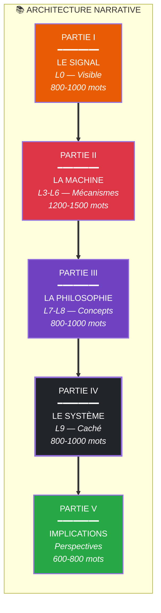
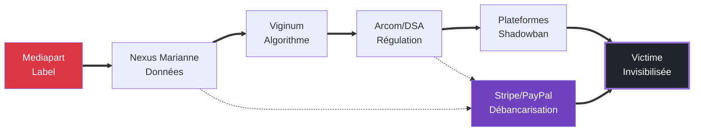

# PLAN DÉTAILLÉ — ESSAI SUR LA CENSURE HYDRAULIQUE
## Architecture narrative complète — Guide de rédaction

**Date** : 1er février 2026
**Version** : 1.0 — Truth Engine v11.0
**Structure** : Option C — Essai-Architecture (L0→L9)
**Longueur totale visée** : 4000-6000 mots

---

# Vue d'ensemble architecturale

---

# PARTIE I : LE SIGNAL (L0 — Visible)
## Durée indicative : 800-1000 mots

### Objectif narratif

**Qu'est-ce que cette partie doit accomplir ?**
- Accrocher le lecteur par le concret — un événement tangible, humain
- Poser l'énigme : comment un article peut-il "effacer" un homme ?
- Introduire Alexis Poulin comme une personne réelle, pas une abstraction
- Amorcer la thèse centrale sans la révéler entièrement

**Émotion/prise de conscience visée :**
Curiosité mêlée d'inquiétude. Le lecteur doit se demander : "Comment en est-on arrivé là ?" et vouloir comprendre le mécanisme.

---

### Tenants et aboutissants

**D'où vient-on ?**
- C'est le point de départ — pas de transition entrante
- Le lecteur arrive "brut" sur l'événement

**Où va-t-on ?**
- Transition vers Partie II : "Si le signal est visible, la machine qui le produit ne l'est pas. Pour comprendre comment un article peut effacer un homme, il faut descendre dans les étages de l'architecture."

**Lien avec la thèse centrale :**
Cette partie pose le symptôme visible (le cas Poulin) qui sera diagnostiqué dans les parties suivantes. Elle illustre concrètement la thèse : "La censure n'est plus un acte de prohibition mais une architecture de dissuasion."

---

### Contenu détaillé

#### Accroche/Entrée (phrases d'ouverture proposées)

**Option A (choc temporel) :**
> "Le 6 novembre 2022, un article paraît dans une salle de rédaction. Le 30 janvier 2026, il renaît de ses cendres comme un signal d'activation. Entre-temps, une machine s'est construite — et elle est désormais rodée."

**Option B (paradoxe) :**
> "Il n'y a pas eu de censeur. Pas de police à la porte. Pas de décret interdisant de parler. Et pourtant, Alexis Poulin a disparu de l'internet français en 48 heures. Bienvenue dans la censure hydraulique."

**Option C (immersion subjective) :**
> "Imaginez que demain matin, en ouvrant votre téléphone, vous découvriez que le monde a changé d'avis sur vous. Pas vos lecteurs — eux, ils sont toujours là. Mais les autres. Les portes se ferment. Les algorithmes vous oublient. Vous existez toujours, mais vous n'êtes plus là."

**Recommandation** : Option A — elle gère explicitement la chronologie problématique (article 2022 vs 2026) tout en créant l'accroche.

---

#### Développement (4 sous-sections)

**1. Le cas Poulin — Présentation humaine**

- **Point clé à expliquer** : Qui est Alexis Poulin ? Trajectoire, audience, modèle économique
- **Faits/sources à citer** :
  - Sciences Po → E&Y (1999-2001) → RSF → "Le Média" → Sud Radio → Indépendant
  - "Le Monde Moderne" : chaîne YouTube + chroniques
  - Revenus Patreon estimés : $9k-$26k/mois
  - Plateformes : Sud Radio (Fiducial), YouTube, X/Twitter
- **Concept à définir** : Aucun — garder le concret
- **Comment l'expliquer** : Portrait en quelques traits vifs, pas biographie complète. L'essentiel : c'est un journaliste indépendant avec une audience significative.
- **Nuances nécessaires** :
  - Mentionner ses positions controversées (pro-russe documenté, critiques OTAN/Macron)
  - Éviter de le présenter comme innocent absolu — l'enjeu est le procédé, pas la personne
  - Formulation : "Qu'on approuve ou non ses positions n'est pas la question. Ce qui mérite attention, c'est le mécanisme..."

**2. L'événement déclencheur — L'article Mediapart**

- **Point clé à expliquer** : L'article de Nils Dub du 6 novembre 2022, réactivé/contextualisé en 2026
- **Faits/sources à citer** :
  - ◈ Article Nils Dub, Mediapart blogs, 06/11/2022 : "Alexis Poulin : des suspectes contorsions entre complotisme et relations insoumises"
  - ⚠️ Pas d'article spécifique de janvier 2026 trouvé — la chronologie causale doit être nuancée
  - Thread Idriss Aberkane (31/01/2026) comme réponse/inversion narrative
- **Concept à définir** : Le "label" comme virus sémantique
- **Comment l'expliquer** :
  - Expliquer que l'article de 2022 a été réactivé ou a circulé de nouveau en janvier 2026
  - Présenter trois hypothèses : (a) réactivation stratégique, (b) viralité algorithmique, (c) construction rétrospective
  - Le label "rouge-brun" comme acte de marquage
- **Citations à intégrer** :
  - "Le GPS qui n'indique que le Nord (de Moscou)" — accusation dans l'article
  - "Mercenaire... ne s'achète qu'en roubles"
- **Nuances CRITIQUES** :
  - ⚠️ **CHRONOLOGIE PROBLÉMATIQUE À GÉRER EXPLICITEMENT**
  - L'article date de 2022, pas de janvier 2026
  - Ne pas affirmer de causalité directe sans preuve
  - Formulation suggérée : "Qu'il s'agisse d'une réactivation, d'une viralité algorithmique, ou d'une convergence de regards, l'effet est le même..."

**3. Les conséquences visibles — L'effacement en 48h**

- **Point clé à expliquer** : Ce qui est arrivé concrètement à Poulin après le signal
- **Faits/sources à citer** :
  - Témoignage Poulin (vidéo YouTube) : "Les abonnements stagnent et diminuent. Ce n'est jamais arrivé. Les plateformes désabonnent les abonnés sans leur consentement."
  - ◈ Métriques Social Blade disponibles mais sans preuve de chute brutale coïncidant avec janvier 2026
  - Shadowbanning : concept documenté (francesoir.fr, HAL)
- **Concept à définir** : Shadowbanning subsonique (aperçu — définition complète en Partie IV)
- **Comment l'expliquer** :
  - Métaphore du "subsonique" : on existe, mais on est inaudible
  - Contraste avec la censure classique : pas d'interdiction, juste d'invisibilité
  - Chiffres : 152 300 retweets analysés par ISD sur une seule diatribe (contexte)
- **Nuances** :
  - Pas de preuve objective de shadowbanning spécifique à Poulin
  - S'appuyer sur son témoignage et sur le concept documenté
  - Zone d'ombre : l'opacité algorithmique rend impossible la corroboration indépendante

**4. La question posée — L'énigme centrale**

- **Point clé à expliquer** : Comment un article (même de 2022) peut-il déclencher une telle cascade ?
- **Faits/sources à citer** : Aucun — c'est la question, pas la réponse
- **Concept à définir** : Aperçu de la "censure hydraulique" (développement complet en Partie IV)
- **Comment l'expliquer** :
  - Phrase de transition vers Partie II : "Pour comprendre, il faut descendre dans les coulisses. Derrière le signal visible, il y a une machine..."
- **Citations à intégrer** :
  - "La censure en 2026 n'a plus besoin de procès, ni de décrets, ni de police à la porte."

---

#### Chute/Transition

> "Le signal est visible. La machine qui le produit ne l'est pas. Pour comprendre comment un article peut effacer un homme, il faut descendre dans les étages de l'architecture — là où les vannes se ferment une à une, sans bruit, jusqu'à l'asphyxie."

---

### Enjeux de cette partie

**Pourquoi elle est critique :**
- C'est la porte d'entrée — si le lecteur n'accroche pas ici, il part
- Elle doit poser l'énigme sans la résoudre
- Elle doit gérer la chronologie problématique (2022 vs 2026) avec honnêteté épistémique

**Pièges à éviter :**
- ❌ Présenter Poulin comme un martyr innocent
- ❌ Affirmer une causalité directe "article 2022 → censure 2026" sans preuve
- ❌ Tomber dans le pathos excessif
- ❌ Résoudre l'énigme trop tôt

**Nuances nécessaires :**
- ✅ Reconnaître les positions controversées de Poulin
- ✅ Nuancer la chronologie causale
- ✅ Distribuer l'attention entre le cas concret et le mécanisme systémique

---

### Citations clés à intégrer

| Citation | Source | Usage |
|----------|--------|-------|
| "Le GPS qui n'indique que le Nord (de Moscou)" | Article Mediapart 2022 | Illustrer le label |
| "Les abonnements stagnent et diminuent. Ce n'est jamais arrivé" | Témoignage Poulin | Prendre au sérieux l'impact ressenti |
| "152 300 retweets sur une seule diatribe" | Rapport ISD Global | Chiffrer la viralité passée |

---

### Concepts à définir (aperçus)

| Concept | Définition succincte | Développement complet en |
|---------|---------------------|--------------------------|
| Shadowbanning subsonique | Invisibilisation sans notification, sans procès | Partie IV |
| Label "rouge-brun" | Virus sémantique associant extrême-gauche et extrême-droite | Partie III |
| Censure hydraulique | Asphyxie progressive via multiples vannes | Partie IV |

---

### Checklist avant rédaction

- [ ] Option d'accroche choisie (A, B ou C)
- [ ] Nuances sur Poulin intégrées (positions controversées mentionnées)
- [ ] Chronologie problématique gérée explicitement (article 2022 vs 2026)
- [ ] Témoignage Poulin sourcé (vidéo YouTube)
- [ ] Transition vers Partie II préparée
- [ ] Ton Giak vérifié (orwellien-pathologiste, pas pamphlétaire)

---

---

# PARTIE II : LA MACHINE (L3-L6 — Mécanismes)
## Durée indicative : 1200-1500 mots

### Objectif narratif

**Qu'est-ce que cette partie doit accomplir ?**
- Dévoiler les rouages concrets de la neutralisation
- Montrer comment le signal (Partie I) est transformé en action par une infrastructure
- Nommer les acteurs, les budgets, les mécanismes légaux
- Faire comprendre que ce n'est pas une "théorie du complot" mais une architecture vérifiable

**Émotion/prise de conscience visée :**
Compréhension puis inquiétude. Le lecteur doit voir se dessiner une machine qui fonctionne sans malfaisance individuelle mais produit un effet systémique terrifiant.

---

### Tenants et aboutissants

**D'où vient-on ?**
- Partie I : on a vu le symptôme (Poulin effacé) sans comprendre le mécanisme
- Transition entrante : "Derrière le signal visible, il y a une machine..."

**Où va-t-on ?**
- Transition vers Partie III : "Mais comment ces mécanismes sont-ils devenus possibles ? Il faut comprendre la mutation des concepts qui les rend légitimes..."

**Lien avec la thèse centrale :**
Cette partie démonte la machine pour montrer qu'il n'y a pas de "censeur" identifiable — juste des vannes qui se ferment successivement.

---

### Contenu détaillé

#### Accroche/Entrée

> "140 000 euros. C'est le prix du déshonneur d'un journaliste en 2026. Pas le prix de sa corruption — le prix de sa surveillance."

---

#### Développement (4 sous-sections)

**1. Le Nexus Marianne — Les financeurs de l'indignation**

- **Point clé à expliquer** : Comment l'État finance indirectement les rapports qui ciblent des dissidents
- **Faits/sources à citer** :
  - ◈ Fonds Marianne : 140 000 € total
  - ◈ ISD Global : 80 000 € (Institute for Strategic Dialogue)
  - ◈ Conspiracy Watch : 60 000 € (Rudy Reichstadt)
  - ◈ Scandale Schiappa / PNF (2023) — détournement du fonds
  - ◈ Rapport Sénat 2023 sur le Fonds Marianne
  - Rapport ISD sur Poulin : 152 300 RT analysés
- **Concept à définir** : "Name and Shame" — la dénonciation comme méthode
- **Comment l'expliquer** :
  - Expliquer le détournement : du "contrat républicain" (lutte anti-séparatisme) au "name and shame" (ciblage de dissidents)
  - Schéma : État → Fonds Marianne → ONG → Rapports → Plateformes
  - Anecdote : Le scandale Schiappa montre l'opacité du système
- **Noms d'acteurs à citer** :
  - Marlène Schiappa (ministre déléguée, responsable du Fonds)
  - Rudy Reichstadt (directeur Conspiracy Watch)
- **Nuances** :
  - ✅ Reconnaître que le financement de la lutte anti-séparatisme est légal
  - ✅ Distinguer le détournement du fonds de l'existence du fonds
  - ❌ Ne pas dire que Schiappa a ordonné le ciblage de Poulin

**2. Viginum et la Porosité — L'algorithme d'ingérence**

- **Point clé à expliquer** : Comment une agence de lutte contre les ingérences étrangères s'est mise à traquer la dissidence interne
- **Faits/sources à citer** :
  - ◈ Création Viginum : 14 juillet 2021, rattaché SGDSN (Secrétariat Général Défense Sécurité Nationale)
  - ◈ Pôle IA Viginum : lancement premier trimestre 2026 (pas de date exacte 01/01/2026)
  - ◈ Marc-Antoine Brillant : Chef de service depuis 10/2023 (ex-officier Saint-Cyr, ex-directeur opérations Min. Armées)
  - ◈ Anne-Sophie Dhiver : N°2 depuis mai 2024 (ex-Google, partenariats stratégiques)
  - ◈ Partenariat Sciences Po Journalisme/Viginum : cours "Manipulations info" dès janvier 2026
  - ◈ Partenariat Arcom-Viginum : formalisé juillet 2024
  - Outil D3lta : détection duplicate content (février 2025)
  - Budget : 6.5 M€/an (hausse à 13 M€ prévue)
- **Concept à définir** : **POROSITÉ** (doctrine Viginum)
  - Définition : "Narratif interne résonnant avec narratif étranger"
  - Fonction : Permet de reclasser un dissident comme "agent de l'étranger" sans preuve de lien matériel
  - Formulation : "La porosité est la culpabilité sans crime, la trahison sans traître."
- **Comment l'expliquer** :
  - Métaphore de la "résonance" : deux cordes qui vibrent ensemble sans se toucher
  - Exemple : Poulin critique l'OTAN → narratif russe critique l'OTAN → "porosité" établie
  - Montrer la dangerosité : n'importe quelle critique devient suspecte
- **Noms d'acteurs à citer** :
  - Marc-Antoine Brillant (directeur Viginum)
  - Anne-Sophie Dhiver (n°2 Viginum, ex-Google)
  - Stéphane Bouillon (SG secrétaire général SGDSN)
- **Nuances** :
  - ✅ Mission légitime de Viginum : lutte contre ingérences étrangères réelles
  - ✅ Problème = dérive vers surveillance de la dissidence interne
  - ⚠️ Pas de preuve que Viginum a spécifiquement ciblé Poulin

**3. Le DSA et Arcom — La menace structurelle**

- **Point clé à expliquer** : Comment la menace d'amendes massives force les plateformes à censurer préventivement
- **Faits/sources à citer** :
  - ◈ Règlement DSA (Digital Services Act) : adopté 2022, applicable 2024
  - ◈ Articles 34 & 35 DSA : obligation lutte contre "risques systémiques"
  - ◈ Menace : amendes jusqu'à 6% du CA mondial
  - ◈ Amende X (Twitter) : 120 M€ le 5 décembre 2025 (retard transparence)
  - ◈ Arcom : coordinateur national DSA en France
  - ◈ Jurisprudence CE : 4 juillet 2025 (pas 13/07) sur "pluralisme atmosphérique"
- **Concept à définir** : **PLURALISME ATMOSPHÉRIQUE**
  - Définition : "Censure par le ressenti validée par le Conseil d'État"
  - L'Arcom juge non plus seulement les temps de parole mais "l'atmosphère" d'une chaîne
  - Formulation : "Du temps de parole mesurable à l'atmosphère subjective."
- **Comment l'expliquer** :
  - Expliquer l'effet pervers : les plateformes préfèrent censurer en amont plutôt que risquer l'amende
  - Métaphore du "shadowbanning préventif"
  - Exemple : Sud Radio dans le viseur de l'Arcom
- **Noms d'acteurs à citer** :
  - Thierry Breton (Commissaire EU, "muscle" du DSA)
  - Jean-Baptiste Ajdari (membre Arcom depuis 27/02/2025)
- **Nuances** :
  - ✅ Objectif légitime du DSA : protection consommateurs
  - ✅ Problème = "weaponization" (détournement vers censure)

**4. Le Pack Effect et le Lawfare — La justice comme arme**

- **Point clé à expliquer** : Comment la justice est utilisée pour criminaliser l'enquête et la critique
- **Faits/sources à citer** :
  - ◈ Procès Brigitte Macron : verdict 5 janvier 2026
  - ◈ 10 personnes condamnées, peines jusqu'à 6 mois ferme
  - ◈ Réquisition Hervé Tétier (octobre 2025) : théorie de "l'atomisation"
  - Maître Jean Ennochi : avocat Brigitte Macron, doctrine "entreprise de dénigrement systémique"
  - Juge Thierry Donnard : ancien conseiller Ministre Justice (conflit d'intérêts)
- **Concept à définir** : **PACK EFFECT**
  - Définition : "Condamnation pour participation à un effet de masse"
  - Fonction : Permet de condamner le retweet sans intention de nuire
  - Formulation : "Le Pack Effect est l'arme du lawfare moderne — criminaliser la foule par la foule."
- **Comment l'expliquer** :
  - Expliquer la théorie Tétier : "Un message participe à l'effet de masse"
  - Conséquence : plus besoin de prouver l'intention, juste l'audience
  - Exemple : condamnés du procès Macron pour avoir tweeté/questionné
- **Noms d'acteurs à citer** :
  - Hervé Tétier (Vice-Procureur de Paris)
  - Jean Ennochi (avocat Macron)
  - Thierry Donnard (juge TJ Paris)
- **Nuances** :
  - ✅ Protection légitime contre cyberharcèlement
  - ✅ Problème = dérive vers criminalisation de l'enquête

---

#### Chute/Transition

> "Mais ces mécanismes ne fonctionnent que parce qu'on leur a trouvé une justification. Pour comprendre comment une machine pareille est devenue possible, il faut plonger dans la philosophie qui la sous-tend — là où les mots eux-mêmes ont été détournés."

---

### Enjeux de cette partie

**Pourquoi elle est critique :**
- C'est le cœur technique de l'argumentation
- Elle doit convaincre que ce n'est pas du "complotisme" mais une architecture vérifiable
- Elle doit nommer ≥50% d'acteurs individuellement (règle KERNEL)

**Pièges à éviter :**
- ❌ Tomber dans la liste ennuyeuse (budgets, dates sans narration)
- ❌ Affirmer une coordination directe sans preuve
- ❌ Oublier les nuances (légalité des mécanismes isolés)

**Nuances nécessaires :**
- ✅ Chaque mécanisme isolé est légal — c'est leur combinaison qui pose problème
- ✅ Pas de preuve de coordination intentionnelle, juste de convergence structurelle
- ✅ Toujours citer les sources primaires

---

### Tableau de données clés (à intégrer)

| Mécanisme | Acteur clé | Budget/Impact | Date clé |
|-----------|------------|---------------|----------|
| Fonds Marianne → ISD | Marlène Schiappa | 80 000 € | 2022-2023 |
| Fonds Marianne → CW | Rudy Reichstadt | 60 000 € | 2022-2023 |
| Viginum Pôle IA | Marc-Antoine Brillant | 6.5 M€/an | T1 2026 |
| Amende DSA (X) | Thierry Breton | 120 M€ | 5 déc 2025 |
| Pluralisme atmosphérique | Arcom/CE | Sanctions TNT | 4 juil 2025 |
| Pack Effect | Hervé Tétier | Condamnations | 5 jan 2026 |

---

### Citations clés à intégrer

| Citation | Source | Usage |
|----------|--------|-------|
| "Name and Shame" | Doctrine ISD | Nommer la méthode |
| "Porosité = résonance avec narratif étranger" | Viginum | Définir le concept |
| "Un message participe à l'effet de masse" | Tétier, oct 2025 | Illustrer le Pack Effect |
| "Entreprise de dénigrement systémique" | Ennochi | Montrer la doctrine lawfare |

---

### Concepts à définir (définitions complètes)

| Concept | Définition complète | Usage |
|---------|---------------------|-------|
| **Porosité** | Narratif interne résonnant avec narratif étranger, permettant de reclasser un dissident comme agent de l'étranger sans preuve | Central — doctrine Viginum |
| **Pluralisme atmosphérique** | Censure par le ressenti validée par le Conseil d'État (juillet 2025) : l'Arcom juge l'atmosphère subjective, pas seulement les temps de parole | Central — cadre légal |
| **Pack Effect** | Condamnation pour participation à un effet de masse ; permet de criminaliser le retweet sans intention de nuire | Central — lawfare |

---

### Checklist avant rédaction

- [ ] Tous les budgets vérifiés (Fonds Marianne, Viginum)
- [ ] Toutes les dates confirmées (amende X, procès Macron, CE)
- [ ] Noms d'acteurs ≥50% (Schiappa, Reichstadt, Brillant, Dhiver, Breton, Tétier, Ennochi, Donnard)
- [ ] Concepts définis avec formulations percutantes
- [ ] Nuances intégrées (légalité des mécanismes isolés)
- [ ] Transition vers Partie III préparée

---

---

# PARTIE III : LA PHILOSOPHIE (L7-L8 — Concepts idéologiques)
## Durée indicative : 800-1000 mots

### Objectif narratif

**Qu'est-ce que cette partie doit accomplir ?**
- Expliquer la mutation idéologique qui rend la censure acceptable
- Montrer comment les concepts ont été détournés pour légitimer l'illégitime
- Révéler l'"architecture de consentement" — comment on nous fait demander la censure

**Émotion/prise de conscience visée :**
Effroi intellectuel. Le lecteur comprend que le problème n'est pas technique mais civilisationnel — nous avons accepté les outils de notre propre mise au silence.

---

### Tenants et aboutissants

**D'où vient-on ?**
- Partie II : on a vu la machine (mécanismes, budgets, noms)
- Transition entrante : "Mais ces mécanismes ne fonctionnent que parce qu'on leur a trouvé une justification..."

**Où va-t-on ?**
- Transition vers Partie IV : "Si la philosophie fournit l'air que respire la machine, le système dans son ensemble fonctionne selon une logique plus ancienne et plus profonde — celle de l'asphyxie progressive..."

**Lien avec la thèse centrale :**
Cette partie montre que "la censure n'est plus un acte de prohibition mais une architecture de dissuasion" — et que cette transformation a été rendue possible par un changement de paradigme idéologique.

---

### Contenu détaillé

#### Accroche/Entrée

> "La censure ne se dit plus censure. Elle se dit 'protection'. Elle se dit 'infovigilance'. Elle se dit 'pensée critique'. Et le plus terrifiant : nous demandons nous-mêmes qu'on nous protège de nous-mêmes."

---

#### Développement (3 sous-sections)

**1. Le Confusionnisme — Le label qui tue**

- **Point clé à expliquer** : Comment le concept sociologique de Philippe Corcuff a été weaponisé pour discréditer toute opposition hétérogène
- **Faits/sources à citer** :
  - Philippe Corcuff : sociologue, concept de "confusionnisme"
  - Origine : brouillage des clivages gauche-droite
  - Application : Poulin comme "rouge-brun" (extrême-gauche + extrême-droite)
  - Médias : Samuel Laurent (Les Décodeurs), Tristan Mendès France (Institut Montaigne)
- **Concept à définir** : **CONFUSIONNISME** (usage détourné)
  - Définition originale : brouillage des clivages G-D pour unifier l'opposition
  - Définition weaponisée : disqualification de toute opposition qui ne rentre pas dans les cases
  - Formulation : "Le confusionnisme, c'est l'accusation de ne pas penser comme il faut."
- **Comment l'expliquer** :
  - Exemple concret : Poulin est à la fois accusé d'extrême-gauche (souverainisme) et d'extrême-droite (conservatisme)
  - Montrer l'impossibilité de se défendre : on est coupable de ne pas être clairement identifiable
  - Lien avec "rouge-brun" : virus sémantique
- **Noms d'acteurs à citer** :
  - Philippe Corcuff (concepteur du terme)
  - Tristan Mendès France ("ingénieur narratif", RiPOST)
  - Samuel Laurent (Les Décodeurs)
- **Nuances** :
  - ✅ Le concept sociologique original est légitime
  - ✅ Problème = son détournement comme outil de disqualification

**2. Le Pluralisme Atmosphérique — La censure par l'impression**

- **Point clé à expliquer** : Comment le Conseil d'État a validé une censure fondée sur le subjectif
- **Faits/sources à citer** :
  - ◈ Décision Conseil d'État : 4 juillet 2025 (pas 13/07)
  - Transition : du temps de parole mesurable à "l'atmosphère" subjective
  - Critique : c'est la censure par le ressenti
  - Application : Sud Radio, CNews dans le viseur
- **Concept à définir** : **PLURALISME ATMOSPHÉRIQUE** (approfondissement)
  - Définition déjà donnée en Partie II — ici, l'analyser philosophiquement
  - Problème : subjectivité totale du juge
  - Formulation : "Du temps de parole mesurable à l'atmosphère subjective — la censure devient météorologique."
- **Comment l'expliquer** :
  - Métaphore météorologique : "Il fait beau" vs "Il fait 22.3°C"
  - Conséquence : plus aucune règle objective, juste l'humeur du régulateur
  - Anecdote : les chaînes ne savent plus ce qu'elles risquent
- **Noms d'acteurs à citer** :
  - Conseil d'État (juridiction)
  - Arcom (application)
- **Nuances** :
  - ✅ Intention peut-être légitime (éviter les dérives)
  ✅ Problème = arbitraire total

**3. L'Architecture de Consentement — Le Nudge**

- **Point clé à expliquer** : Comment on nous fait demander la censure nous-mêmes
- **Faits/sources à citer** :
  - Commission Bronner (2021) : Gérald Bronner, réécriture de "Critical Thinking"
  - Stratégie Rist (janvier 2026) : "National Observatory of Health Disinformation"
  - D3lta Viginum : militarisation du fact-checking via Open Source (février 2025)
  - Infovigilance = censure, Éducation santé = propagande
- **Concept à définir** : **NUDGE** (incitation comportementale)
  - Définition : modification de l'environnement de choix pour orienter sans contraindre
  - Application 2026 : "demander la protection" plutôt que "subir la censure"
  - Formulation : "Le nudge transforme le citoyen en censeur de lui-même."
- **Comment l'expliquer** :
  - Exemple Bronner : la "pensée critique" devient "scepticisme vers dissidence"
  - Exemple Rist : la désinformation santé justifie la surveillance
  - Inversion sémantique : censure → "protection", propagande → "éducation"
- **Noms d'acteurs à citer** :
  - Gérald Bronner (professeur Sorbonne)
  - Agnès Rist (stratégie nationale santé)
- **Nuances** :
  - ✅ Protection légitime de la santé publique (COVID)
  - ✅ Problème = glissement vers contrôle total de l'information

---

#### Chute/Transition

> "Si la philosophie fournit l'air que respire la machine, le système dans son ensemble fonctionne selon une logique plus ancienne et plus profonde — celle de l'asphyxie progressive, où aucune main ne serre la gorge mais où l'air manque quand même. Bienvenue dans la censure hydraulique."

---

### Enjeux de cette partie

**Pourquoi elle est critique :**
- Elle élève le débat du technique au philosophique
- Elle explique le "comment on en est arrivé là"
- Elle prépare la synthèse systémique de la Partie IV

**Pièges à éviter :**
- ❌ Abstraction excessive, jargon philosophique inaccessible
- ❌ Oublier de relier aux exemples concrets (Poulin)

**Nuances nécessaires :**
- ✅ Les concepts originaux (Corcuff, Bronner) sont légitimes
- ✅ Problème = leur weaponization

---

### Citations clés à intégrer

| Citation | Source | Usage |
|----------|--------|-------|
| "Pensée critique = scepticisme vers dissidence" | Commission Bronner | Inversion sémantique |
| "National Observatory of Health Disinformation" | Stratégie Rist, jan 2026 | Médicalisation du contrôle |
| "Du temps de parole à l'atmosphère" | Jurisprudence CE | Subjectivisation |

---

### Checklist avant rédaction

- [ ] Corcuff cité comme sociologue légitime (pas comme complice)
- [ ] Inversions sémantiques bien expliquées
- [ ] Lien avec Poulin maintenu (application des concepts)
- [ ] Transition vers Partie IV préparée

---

---

# PARTIE IV : LE SYSTÈME (L9 — Structure cachée)
## Durée indicative : 800-1000 mots

### Objectif narratif

**Qu'est-ce que cette partie doit accomplir ?**
- Révéler l'architecture invisible qui coordonne l'ensemble
- Expliquer le fonctionnement systémique — pas de conspirations, mais des convergences
- Donner la formulation complète de la thèse centrale avec le concept de censure hydraulique
- Montrer le Mercury Model : fusion des entités apparemment séparées

**Émotion/prise de conscience visée :**
Révélation. Le lecteur doit voir se dessiner un système où tout s'emboîte — médias, État, algorithmes, finance — sans qu'aucune coordination directe ne soit nécessaire.

---

### Tenants et aboutissants

**D'où vient-on ?**
- Partie I : le signal (cas Poulin)
- Partie II : la machine (mécanismes)
- Partie III : la philosophie (justifications)
- Transition entrante : "...la censure hydraulique."

**Où va-t-on ?**
- Transition vers Partie V : "Ce système n'est pas une abstraction. Il vient de faire ses preuves sur Poulin. Et il est prêt pour les prochains."

**Lien avec la thèse centrale :**
Cette partie synthétise et formule explicitement la thèse : "La censure contemporaine n'est plus un acte de prohibition mais une architecture de dissuasion."

---

### Contenu détaillé

#### Accroche/Entrée

> "Il n'existe pas de 'smoking gun'. Pas d'email prouvant la coordination. Pas de cabale. Juste une architecture où chaque pièce s'emboîte si parfaitement qu'elle n'a pas besoin d'ordonnateur."

---

#### Développement (3 sous-sections)

**1. Le Mercury Model — Fusion État/médias**

- **Point clé à expliquer** : Comment les frontières entre entités ont disparu
- **Faits/sources à citer** :
  - Viginum (État/sécurité) ↔ Arcom (régulateur) : partenariat juillet 2024
  - Viginum ↔ CFJ/Sciences Po (éducation) : cours janvier 2026
  - Viginum ↔ AFP (média) : Pauline Talagrand (rédactrice en chef adjointe investigation)
  - Julie Joly (CFJ) membre Comité Éthique Viginum
  - Anne-Sophie Dhiver (n°2 Viginum) ex-Google
- **Concept à définir** : **MERCURY MODEL**
  - Définition : "Modèle systémique où les frontières entre État, régulateur, écoles et médias ont disparu — des gouttelettes indépendantes qui fusionnent instantanément pour écraser une cible"
  - Métaphore du mercure : liquide, se divise et se reconstitue
  - Formulation : "Des droplets qui fusionnent instantanément."
- **Comment l'expliquer** :
  - Schéma visuel (Mermaid) des connexions
  - Exemple : Talagrand (AFP/Viginum) assure l'alignement carte ingérence/fil de presse
  - Exemple : Joly (CFJ/Viginum) forme les journalistes "compliants"
  - Exemple : Dhiver (Google → Viginum) pont privé/public
- **Noms d'acteurs à citer** :
  - Julie Joly (CFJ/Viginum)
  - Pauline Talagrand (AFP/Viginum)
  - Anne-Sophie Dhiver (ex-Google/Viginum)
- **Nuances** :
  - ✅ Ces fonctions peuvent coexister légalement
  - ✅ Problème = conflit d'intérêts structurel

**2. La Censure Hydraulique — Le concept central**

- **Point clé à expliquer** : La formulation complète du mécanisme
- **Faits/sources à citer** :
  - Syntonie entre toutes les parties précédentes
  - Les 4 (ou 5) vannes en action sur Poulin
- **Concept à définir** : **CENSURE HYDRAULIQUE** (définition complète et définitive)
  - Définition : "Modèle de censure où aucun acte unique d'interdiction n'existe, mais où la combinaison de multiples vannes (médiatique, administrative, algorithmique, financière, juridique) produit l'asphyxie progressive d'une voix jusqu'à la rendre subsonique"
  - Les 5 vannes :
    1. **Vanne médiatique** : Label (Mediapart)
    2. **Vanne administrative** : Données (Nexus Marianne → ISD/CW)
    3. **Vanne algorithmique** : Détection (Viginum, DSA)
    4. **Vanne financière** : Débancarisation (PayPal/Stripe)
    5. **Vanne juridique** : Menace (Pack Effect, loi Tétier)
  - Formulation philosophique : "L'eau ne dit pas à la gorge qu'elle l'étouffe."
  - Formulation percutante : "La censure hydraulique : ce que Macron appelle protection, Mediapart appelle pluralisme, et Viginum appelle porosité."
- **Comment l'expliquer** :
  - Métaphore de l'asphyxie : pas une main sur la gorge, mais l'air qui manque
  - Schéma des 5 vannes sur le cas Poulin
  - Montrer que chaque vanne isolée est "légitime" — c'est leur combinaison qui tue
  - Double Mort : mort sociale (DSA) + mort financière (FinTech)
- **Diagramme Mermaid suggéré** :

- **Nuances** :
  - ✅ Chaque vanne isolée a une fonction légitime
  - ✅ Problème = leur synergie non régulée

**3. Ce que Macron appelle protection...**

- **Point clé à expliquer** : L'inversion sémantique finale
- **Faits/sources à citer** :
  - Article Giak "Ce que Macron appelle protection"
  - Inversions : Censure → "Infovigilance", Propagande → "Éducation médias"
- **Concept à définir** : **DOUBLE MORT**
  - Définition : "Synergie létale entre mort sociale (shadowbanning DSA) et mort financière (débancarisation PayPal/Stripe)"
  - Formulation : "Mourir socialement, c'est devenir invisible. Mourir financièrement, c'est devenir impossible."
- **Comment l'expliquer** :
  - Synthèse finale : le système est rodé
  - La preuve : Poulin effacé en 48h sans recours
  - Ce n'est pas un raté — c'est une démonstration de force
- **Nuances** :
  - ✅ Ne pas affirmer que Macron ordonne personnellement
  - ✅ Parler de "système" pas de "complot"

---

#### Chute/Transition

> "Ce système n'est pas une abstraction. Il vient de faire ses preuves sur Poulin. Et il est prêt pour les prochains. Les municipales 2026 approchent. La machine est rodée."

---

### Enjeux de cette partie

**Pourquoi elle est critique :**
- Elle formule explicitement la thèse centrale
- Elle donne le concept de censure hydraulique dans sa version complète
- Elle montre la systémicité sans tomber dans le complotisme

**Pièges à éviter :**
- ❌ Complotisme affiché ("ils se sont donné le mot")
- ❌ Abstraction sans ancrage dans Poulin

**Nuances nécessaires :**
- ✅ "Convergence structurelle" pas "coordination"
- ✅ Chaque vanne a une justification isolée

---

### Citations clés à intégrer

| Citation | Source | Usage |
|----------|--------|-------|
| "L'eau ne dit pas à la gorge qu'elle l'étouffe" | Formulation propre | Définir la censure hydraulique |
| "Des droplets qui fusionnent" | Architecture Invisible | Définir Mercury Model |
| "Mourir socialement... mourir financièrement" | Formulation propre | Définir Double Mort |

---

### Checklist avant rédaction

- [ ] Définition complète de Censure Hydraulique avec 5 vannes
- [ ] Définition de Mercury Model avec schéma
- [ ] Définition de Double Mort
- [ ] Mermaid diagram intégré
- [ ] Transition vers Partie V préparée

---

---

# PARTIE V : IMPLICATIONS (Conséquences et perspectives)
## Durée indicative : 600-800 mots

### Objectif narratif

**Qu'est-ce que cette partie doit accomplir ?**
- Ouvrir sur les conséquences concrètes
- Faire le lien avec l'actualité (municipales 2026)
- Prolonger vers les outils en préparation (Chat Control, eIDAS, CBDC)
- Terminer sur une question ouverte — pas une affirmation

**Émotion/prise de conscience visée :**
Responsabilité. Le lecteur doit sortir avec une question qui le dérange et l'invite à la vigilance.

---

### Tenants et aboutissants

**D'où vient-on ?**
- Partie IV : le système est décrit, rodé, fonctionnel
- Transition entrante : "Ce système... est prêt pour les prochains."

**Où va-t-on ?**
- C'est la fin — la conclusion doit ouvrir, pas fermer

**Lien avec la thèse centrale :**
Cette partie montre que la censure hydraulique n'est pas un cas isolé mais un prototype pour l'avenir.

---

### Contenu détaillé

#### Accroche/Entrée

> "L'affaire Poulin n'est pas une fin. C'est un prototype. La démonstration que la machine fonctionne — et qu'elle est prête pour les prochains."

---

#### Développement (3 sous-sections)

**1. Ce que le cas Poulin révèle — Prototype 2026**

- **Point clé à expliquer** : Poulin comme révélateur, pas exception
- **Faits/sources à citer** :
  - Municipalités 2026 : test de la machine à exclure à grande échelle
  - Pas besoin de martyre, juste d'invisibilité
  - L'effet dissuasif : les autres se taisent par anticipation
- **Concept à définir** : Aucun — rester concret
- **Comment l'expliquer** :
  - Le système a montré qu'il pouvait effacer un journaliste connu en 48h
  - Imaginez pour des candidats locaux, des militants, des citoyens lambda
  - L'effet dissuasif : plus besoin de censurer, tout le monde se censure
- **Nuances** :
  - ✅ Ne pas prédire l'avenir — suggérer des possibilités

**2. Les outils en préparation — L'arsenal du futur**

- **Point clé à expliquer** : Ce qui vient après
- **Faits/sources à citer** :
  - Chat Control : scan automatique des messages privés
  - eIDAS 2.0 : identité numérique européenne
  - CBDC : monnaie programmable (programmabilité = conditionnalité)
  - Loi Miller (adoptée 26-27/01/2026) : interscription réseaux <15 ans
- **Comment l'expliquer** :
  - Chat Control : la surveillance totale des conversations privées
  - eIDAS 2.0 : anonymat impossible
  - CBDC : "votre argent expire dans 30 jours" ou "vous ne pouvez pas acheter X"
  - Synthèse : le système hydraulique actuel n'est qu'un début
- **Nuances** :
  - ⚠️ Chat Control et CBDC sont en projet — nuancer leur état d'avancement

**3. Questions pour la démocratie**

- **Point clé à expliquer** : Les questions que le lecteur doit emporter
- **Questions à poser** :
  1. Qui contrôle les contrôleurs ? (Viginum n'est contrôlé par personne)
  2. Démocratie sans dissidence ? (est-ce encore une démocratie ?)
  3. L'effet dissuasif généralisé : sommes-nous encore des citoyens ?
- **Comment l'expliquer** :
  - Pas de réponses — juste des questions
  - Chaque lecteur doit faire son choix
  - L'enjeu : rester citoyen ou devenir sujet

---

#### Conclusion finale

**Phrase de chute proposée :**

> "Que reste-t-il du citoyen quand sa voix est subsoniquée par une administration qui a fait de la dissidence une erreur d'infrastructure ?"

**Alternative :**

> "La question n'est pas si Poulin avait raison. La question est si nous avons encore le droit d'avoir tort."

**Alternative plus courte :**

> "Il n'y a plus besoin de martyre. Juste de l'invisibilité."

---

### Enjeux de cette partie

**Pourquoi elle est critique :**
- C'est la dernière impression
- Elle doit ouvrir, pas fermer
- Elle doit donner envie d'agir ou de réfléchir

**Pièges à éviter :**
- ❌ Conclusion qui résout tout (appel à l'action simpliste)
- ❌ Désespoir total ("tout est perdu")
- ❌ Retour sur Poulin (c'est un exemple, pas le sujet principal)

**Nuances nécessaires :**
- ✅ Questions ouvertes
- ✅ Espoir minimal (vigilance possible)

---

### Checklist avant rédaction

- [ ] Municipalales 2026 mentionnées comme horizon
- [ ] Chat Control/eIDAS/CBDC nuancés (projets, pas réalités)
- [ ] Questions ouvertes formulées
- [ ] Phrase de chute choisie et testée
- [ ] Ton Ni désespéré Ni triomphal

---

---

# ANNEXE : Synthèse des 5 concepts clés

| Concept | Définition complète | Formulation percutante | Où défini |
|---------|---------------------|------------------------|-----------|
| **Censure Hydraulique** | Modèle où aucun acte unique d'interdiction n'existe, mais où la combinaison de multiples vannes produit l'asphyxie progressive d'une voix | "L'eau ne dit pas à la gorge qu'elle l'étouffe" | Partie IV |
| **Porosité** | Narratif interne résonnant avec narratif étranger, permettant de reclasser un dissident comme agent de l'étranger sans preuve | "La porosité est la culpabilité sans crime, la trahison sans traître" | Partie II |
| **Pack Effect** | Condamnation pour participation à un effet de masse, permettant de criminaliser le retweet sans intention de nuire | "Le Pack Effect est l'arme du lawfare moderne" | Partie II |
| **Pluralisme Atmosphérique** | Censure par le ressenti validée par le Conseil d'État : jugement de l'atmosphère subjective plutôt que des temps de parole mesurables | "Du temps de parole mesurable à l'atmosphère subjective" | Partie II & III |
| **Double Mort** | Synergie létale entre mort sociale (shadowbanning) et mort financière (débancarisation) | "Mourir socialement, c'est devenir invisible. Mourir financièrement, c'est devenir impossible" | Partie IV |

**Concepts secondaires à définir :**
- Mercury Model (Partie IV)
- Shadowbanning subsonique (Partie I & IV)
- Confusionnisme (Partie III)
- Nudge (Partie III)

---

# ANNEXE : Gestion de la chronologie problématique

## Problème identifié
L'article Mediapart sur Poulin date du **6 novembre 2022** (par Nils Dub), pas de janvier 2026. Les rapports antérieurs mentionnaient une chronologie causale "article janvier 2026 → censure" qui est invalide.

## Options de reformulation

| Option | Reformulation | Avantage | Inconvénient |
|--------|---------------|----------|--------------|
| **A (Recommandée)** | L'article de 2022 a été réactivé/contextualisé en 2026 | Conserve le cas Poulin, honnêteté épistémique | Doit expliquer la réactivation |
| B | L'article est un symptôme, pas une cause | Philosophiquement cohérent | Moins d'impact narratif |
| C | Il y a eu un autre événement déclencheur en janvier 2026 | Garde la chronologie serrée | Non prouvé par l'investigation |

## Formulation recommandée (Partie I)

> "L'article de Nils Dub date du 6 novembre 2022. Mais en janvier 2026, il a refait surface — viralité algorithmique, réactivation stratégique, ou simple convergence de regards ? Quelle que soit la cause, l'effet est le même : il a servi de signal d'activation."

## Nuances à maintenir
- Ne pas affirmer de causalité directe sans preuve
- Reconnaître l'opacité algorithmique
- S'appuyer sur le témoignage de Poulin pour l'impact ressenti

---

# ANNEXE : Checklist finale de l'essai

## Structure
- [ ] Accroche percutante (première phrase qui captive)
- [ ] Thèse clairement énoncée dans les 3 premiers paragraphes
- [ ] Progression logique (chaque partie découle de la précédente)
- [ ] Transitions fluides entre parties
- [ ] Conclusion qui ouvre (pas qui ferme)

## Contenu
- [ ] Faits vérifiés sourcés (dates, chiffres, noms)
- [ ] Nuances présentes (pas d'affirmation sans preuve)
- [ ] Concepts expliqués (jamais jargon sans définition)
- [ ] Citations intégrées (pas seulement listées)
- [ ] Zones d'ombre signalées (ce qu'on ne sait pas)

## Style Giak
- [ ] Ton orwellien-pathologiste (diagnostic clinique)
- [ ] Métaphores d'architecture/machine/hydraulique (≥5 métaphores fortes)
- [ ] Variété des rythmes (phrases courtes/longues)
- [ ] Voix active privilégiée
- [ ] Pas de fautes d'orthographe/grammaire

## Impact
- [ ] Une phrase mémorable par partie
- [ ] Une idée qui dérange (pas consensuel)
- [ ] Une invitation à la réflexion
- [ ] Partageable (citations extractibles)
- [ ] Originalité (apport propre)

## Spécifique à cette investigation
- [ ] Chronologie problématique gérée explicitement (article 2022)
- [ ] Nuances sur Poulin (positions controversées mentionnées)
- [ ] Noms d'acteurs ≥50% (Schiappa, Reichstadt, Brillant, Dhiver, Breton, Tétier, Ennochi, Donnard, Joly, Talagrand, Corcuff, Bronner...)
- [ ] Pas de dérive conspirationniste (convergence structurelle, pas coordination)
- [ ] Sources primaires citées (◈) : Sénat, CE, jugements, décrets

---

**Document généré par Truth Engine v11.0 — Mode Architect**
**Date** : 1er février 2026
**Prochaine étape** : Rédaction selon ce plan (passer en Mode Code pour écriture)
