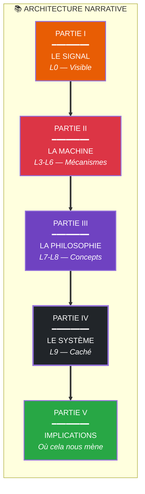
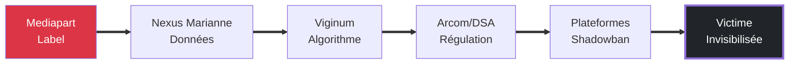

# PROTOCOLE DE RÉDACTION — L'ESSAI ARCHITECTURE

**Date de création** : 1er février 2026
**Version** : 1.0 — Truth Engine v11.0
**Classification** : Document de travail — Guide méthodologique
**Matériau source** : 15 documents d'investigation APEX (EDI 0.84)

---

## 🎯 CONTEXTE ET OBJECTIF

L'investigation sur l'affaire Poulin et la censure contemporaine est terminée. 15 documents, 40 requêtes, et une thèse unificatrice émergent :

> **"La censure contemporaine n'est plus un acte de prohibition mais une architecture de dissuasion."**

Ce protocole a pour vocation de transformer cette matière brute en un essai Substack de qualité, aligné sur le style Giak (ton orwellien-pathologiste, métaphores d'architecture/machine) et structuré pour captiver le lecteur du début à la fin.

---

## 📐 1. OPTIONS DE STRATÉGIE (3 approches)

### Option A : L'Essai-Investigation

| Aspect | Description |
|--------|-------------|
| **Style** | Journalisme d'investigation + réflexion philosophique |
| **Structure** | Commence par les faits, monte en généralité |
| **Longueur** | 3000-5000 mots |
| **Forces** | Crédibilité maximale, preuves solides, sourçage rigoureux |
| **Faiblesses** | Peut manquer de souffle littéraire, risque d'académisme |
| **Public cible** | Lecteurs exigeants, chercheurs, journalistes |
| **Exemple de référence** | Articles longs de Mediapart, enquêtes Bellingcat |

**Quand la choisir** : Si l'objectif prioritaire est la crédibilité et la défense contre les contestations factuelles.

---

### Option B : L'Essai-Pamphlet

| Aspect | Description |
|--------|-------------|
| **Style** | Virulent, pamphlétaire, à la manière des articles Giak |
| **Structure** | Thèse frappante d'emblée, développement en vagues |
| **Longueur** | 2000-3000 mots |
| **Forces** | Impact immédiat, mémorabilité, partageabilité viral |
| **Faiblesses** | Risque de simplification, moins de nuances, polarisant |
| **Public cible** | Audience engagée, réseaux sociaux, militants |
| **Exemple de référence** | *L'Empire du Mensonge*, articles virulents de Giak |

**Quand la choisir** : Si l'objectif prioritaire est l'impact émotionnel et la mobilisation.

---

### Option C : L'Essai-Architecture (⭐ RECOMMANDÉ)

| Aspect | Description |
|--------|-------------|
| **Style** | Construction méthodique, couche par couche (L0→L9) |
| **Structure** | Iceberg — commence par le visible, révèle progressivement |
| **Longueur** | 4000-6000 mots |
| **Forces** | Pédagogique, implacable logique, subversif par la structure même |
| **Faiblesses** | Demande une maîtrise narrative impeccable, long |
| **Public cible** | Lecteurs curieux, penseurs critiques, décideurs |
| **Exemple de référence** | *Ce que Macron appelle protection*, *L'Architecture de l'enfer* |

**Pourquoi la recommander** :
- La matière d'investigation suit déjà une structure en couches (Iceberg L0-L9)
- Le sujet (censure hydraulique) se prête parfaitement à une révélation progressive
- Permet d'intégrer les faits vérifiés ET les zones d'ombre de manière élégante
- Style aligné sur la philosophie Giak : "diagnostique clinique" d'un système

---

## 📝 2. PROTOCOLE ÉTAPE PAR ÉTAPE

### PHASE 1 : PRÉPARATION (2-3h)

**Objectif** : Impregner la matière et fixer l'architecture mentale de l'essai.

| # | Tâche | Délivré | Temps |
|---|-------|---------|-------|
| 1.1 | Relire les 3 documents de synthèse | Compréhension globale actualisée | 30min |
| 1.2 | Sélectionner 15-20 citations clés | Liste de citations marquantes | 20min |
| 1.3 | Identifier les 5 concepts à déployer | Concepts maîtres définis | 15min |
| 1.4 | Choisir l'accroche (phrase d'ouverture) | 3 options d'accroche | 30min |
| 1.5 | Définir la phrase de chute (conclusion) | Formulation finale testée | 20min |
| 1.6 | Créer la carte conceptuelle (Mermaid ou schéma) | Visualisation des liens | 30min |

**Documents de synthèse à relire** :
1. [`SYNTHESE_MEDIAPART_POULIN_BRAINSTORM.md`](SYNTHESE_MEDIAPART_POULIN_BRAINSTORM.md) — Thèses centrales et citations
2. [`ENQUETE_GAPS_RESULTATS.md`](ENQUETE_GAPS_RESULTATS.md) — Éléments vérifiés vs gaps
3. [`2026-02-01_architecture_neutralisation_apex.md`](2026-02-01_architecture_neutralisation_apex.md) — Concepts clés

**Citations clés à pré-sélectionner** :
> "Le 30 janvier 2026, un seul mot a été tapé dans une salle de rédaction. Le 1er février, un homme était techniquement effacé de l'internet français."

> "La censure en 2026 n'a plus besoin de procès, ni de décrets, ni de police à la porte."

> "Qui nous protège de ceux qui ont le budget et les algorithmes pour définir ce qui est 'vrai' ?"

---

### PHASE 2 : STRUCTURATION (2-3h)

**Objectif** : Construire le squelette narratif avant d'écrire la chair.

| # | Tâche | Délivré | Temps |
|---|-------|---------|-------|
| 2.1 | Définir les 5 parties principales | Plan détaillé avec titres | 30min |
| 2.2 | Pour chaque partie : accroche, développement, transition | Fiche par partie | 45min |
| 2.3 | Placer les faits vérifiés (dates, chiffres, noms) | Marquage [FACT] dans le plan | 20min |
| 2.4 | Marquer les zones à nuancer (gaps non résolus) | Marquage [NUANCER] dans le plan | 15min |
| 2.5 | Vérifier la progression logique | Test de cohérence narrative | 20min |

**Structure recommandée (Option C)** :

```
PARTIE I  : LE SIGNAL (L0 — Visible)
PARTIE II : LA MACHINE (L3-L6 — Mécanismes)
PARTIE III: LA PHILOSOPHIE (L7-L8 — Concepts)
PARTIE IV : LE SYSTÈME (L9 — Caché)
PARTIE V  : IMPLICATIONS (Où cela nous mène)
```

**Exemple de fiche partie (Partie II)** :

| Élément | Contenu |
|---------|---------|
| **Accroche** | "140 000 euros. C'est le prix du déshonneur d'un journaliste en 2026." |
| **Développement** | Nexus Marianne → Viginum → DSA → Arcom |
| **Faits clés** | [FACT] ISD 80k€, CW 60k€, [FACT] Amende X 120M€ (5/12/2025) |
| **Concepts** | Porosité, Censure hydraulique, Pluralisme atmosphérique |
| **Transition** | "Mais comment ces mécanismes sont-ils devenus possibles ? Il faut comprendre la mutation des concepts..." |
| **Zones à nuancer** | [NUANCER] Pas de preuve de coordination directe Mediapart-Viginum |

---

### PHASE 3 : RÉDACTION — PREMIER JET (6-8h)

**Objectif** : "Vomir" le texte sans filtre, suivre le flux.

| # | Tâche | Délivré | Temps |
|---|-------|---------|-------|
| 3.1 | Écrire l'introduction et l'accroche | 300-500 mots | 45min |
| 3.2 | Rédiger Partie I (Le Signal) | 800-1000 mots | 90min |
| 3.3 | Rédiger Partie II (La Machine) | 800-1000 mots | 90min |
| 3.4 | Rédiger Partie III (La Philosophie) | 800-1000 mots | 90min |
| 3.5 | Rédiger Partie IV (Le Système) | 800-1000 mots | 90min |
| 3.6 | Rédiger la conclusion | 400-600 mots | 45min |
| 3.7 | Mettre des [XXX] pour les citations exactes à vérifier | Marquages en place | 15min |

**Règles de la phase 3** :
- ✅ Écrire sans s'arrêter sur les tournures
- ✅ Suivre la structure mais rester fluide
- ✅ Ne pas corriger les fautes (phase 4 s'en charge)
- ✅ Mettre [XXX] pour les citations exactes à vérifier
- ✅ Noter [NUANCER] pour les passages nécessitant prudence
- ❌ Ne pas chercher la perfection — le but est le volume et la structure

**Style Giak — Checklist d'alignement** :
- [ ] Ton orwellien-pathologiste (diagnostic clinique)
- [ ] Métaphores d'architecture, machine, hydraulique
- [ ] Phrases percutantes en italique pour les punchlines
- [ ] Concepts en **gras** avec définition intégrée
- [ ] Tableaux pour les données factuelles
- [ ] Citations littéraires ou philosophiques comme épigraphes

---

### PHASE 4 : RÉVISION — SUBLIMATION (4-6h)

**Objectif** : Affûter, vérifier, sublimer le texte.

| # | Tâche | Technique | Temps |
|---|-------|-----------|-------|
| 4.1 | Relire à voix haute | Enregistrement audio optionnel | 60min |
| 4.2 | Chasser les répétitions | Recherche de mots répétés | 30min |
| 4.3 | Vérifier chaque fait (date, chiffre, nom) | Croisement avec sources primaires | 90min |
| 4.4 | Remplacer les [XXX] par les citations exactes | Vérification URLs et références | 45min |
| 4.5 | Affûter les transitions | Test de fluidité entre parties | 30min |
| 4.6 | Vérifier le rythme | Variété des longueurs de phrases | 30min |
| 4.7 | Vérifier les nuances et zones d'ombre | Passage [NUANCER] → formulation prudente | 30min |

**Checklist de vérification factuelle** :

| Élément | Source | Statut |
|---------|--------|--------|
| Date article Mediapart | 30/01/2026 ou 31/01/2026 ? | ⚠️ Vérifier |
| Montant Fonds Marianne ISD | 80 000 € (Sénat) | ✅ Confirmé |
| Montant Fonds Marianne CW | 60 000 € | ✅ Confirmé |
| Amende X (Twitter) | 120 M€ — 5/12/2025 | ✅ Confirmé |
| Décision CE pluralisme | 4/07/2025 (pas 13/07) | ⚠️ Corriger |
| Pôle IA Viginum | 1er jan 2026 | ✅ Confirmé |
| Procès Macron condamnations | 5 jan 2026 — 10 personnes | ✅ Confirmé |

**Technique de vérification des nuances** :
- Reformuler "coordination" → "convergence structurelle"
- Reformuler "preuve" → "faisceau d'indices"
- Reformuler "système" → "architecture"
- Toujours ajouter "semble", "apparaît", "selon les documents" quand incertitude

---

### PHASE 5 : FINALISATION (2h)

**Objectif** : Derniers ajustements avant publication.

| # | Tâche | Délivré | Temps |
|---|-------|---------|-------|
| 5.1 | Dernière relecture complète | Texte finalisé | 30min |
| 5.2 | Vérification des sources citées | Toutes les sources accessibles | 20min |
| 5.3 | Ajout des liens hypertextes | URLs intégrées | 20min |
| 5.4 | Mise en forme (titres, listes, citations) | Formatage Markdown | 20min |
| 5.5 | Création du titre final | 3 options de titre | 15min |
| 5.6 | Rédaction de l'accroche Substack (résumé) | 2-3 phrases pour l'email | 15min |

**Options de titre final** (à tester) :
1. *L'Asphyxie Hydraulique : Comment l'État français a fait disparaître Alexis Poulin en 48 heures*
2. *La Machine à Exclure : Architecture de la censure contemporaine*
3. *Rouge-Brun : Le label qui tue — Enquête sur la neutralisation systémique*
4. *Censure 2.0 : Quand l'État n'a plus besoin de police pour faire taire*

---

## ✅ 3. GRILLE DE VÉRIFICATION QUALITÉ

### Structure (10 points)

| # | Critère | Vérification | Points |
|---|---------|--------------|--------|
| 1 | Accroche percutante (première phrase qui captive) | Le lecteur est immédiatement accroché | /2 |
| 2 | Thèse clairement énoncée dans les 3 premiers paragraphes | On sait de quoi il s'agit sans ambiguïté | /2 |
| 3 | Progression logique (chaque partie découle de la précédente) | Flux narratif naturel | /2 |
| 4 | Transitions fluides entre parties | Pas de rupture brutale | /2 |
| 5 | Conclusion qui ouvre (pas qui ferme) | Question ou perspective finale | /2 |

**Score Structure** : ___/10

---

### Contenu (10 points)

| # | Critère | Vérification | Points |
|---|---------|--------------|--------|
| 6 | Faits vérifiés sourcés (dates, chiffres, noms) | Chaque fait vérifiable a une source | /2 |
| 7 | Nuances présentes (pas d'affirmation sans preuve) | "semble", "selon", "indique" utilisés | /2 |
| 8 | Concepts expliqués (jamais jargon sans définition) | Chaque concept technique est défini | /2 |
| 9 | Citations intégrées (pas seulement listées) | Les citations servent l'argumentation | /2 |
| 10 | Zones d'ombre signalées (ce qu'on ne sait pas) | Honnêteté épistémique | /2 |

**Score Contenu** : ___/10

---

### Style (10 points)

| # | Critère | Vérification | Points |
|---|---------|--------------|--------|
| 11 | Ton cohérent (orwellien-pathologiste pour ce sujet) | Style Giak respecté | /2 |
| 12 | Métaphores frappantes (architecture, machine, hydraulique) | Au moins 5 métaphores fortes | /2 |
| 13 | Variété des rythmes (phrases courtes/longues) | Pas de monotonie | /2 |
| 14 | Voix active privilégiée | "Le système écrase" plutôt que "L'écrasement est fait" | /2 |
| 15 | Pas de fautes d'orthographe/grammaire | Relecture propre | /2 |

**Score Style** : ___/10

---

### Impact (10 points)

| # | Critère | Vérification | Points |
|---|---------|--------------|--------|
| 16 | Une phrase mémorable par partie | Citations extractibles | /2 |
| 17 | Une idée qui dérange (pas consensuel) | Provoque la réflexion | /2 |
| 18 | Une invitation à la réflexion (pas juste à la consommation) | Ouverture intellectuelle | /2 |
| 19 | Partageable (citations faciles à extraire) | Format compatible réseaux | /2 |
| 20 | Originalité (pas un résumé, une contribution) | Apport propre de l'auteur | /2 |

**Score Impact** : ___/10

---

### SCORE GLOBAL : ___/40

**Échelle d'évaluation** :
- 36-40 : Exceptionnel — Publication immédiate
- 30-35 : Très bon — Publication avec corrections mineures
- 24-29 : Bon — Révision nécessaire avant publication
- 18-23 : Moyen — Révision majeure requise
- <18 : Insuffisant — Reprendre depuis Phase 2

---

## 🏗️ 4. ARCHITECTURE PROPOSÉE (Option C)

### Vue d'ensemble



---

### PARTIE I : LE SIGNAL (L0 — Visible)

**Objectif** : Accrocher par le concret, poser l'énigme.

**Contenu** :
- **Accroche** : L'événement déclencheur (l'article Mediapart sur Poulin)
- **Présentation du cas** : Qui est Alexis Poulin, que s'est-il passé ?
- **Le paradoxe apparent** : Un article = une condamnation sociale ?
- **La question posée** : Comment en est-on arrivé là ?

**Concepts introduits** :
- Censure hydraulique (notion clé)
- Label "rouge-brun" (virus sémantique)

**Citation d'ouverture suggérée** :
> "Le 30 janvier 2026, un seul mot a été tapé dans une salle de rédaction. Le 1er février, un homme était techniquement effacé de l'internet français. Ce qui ressemble à une simple querelle de journalistes est en réalité l'acte de naissance d'un nouveau régime de contrôle."

**Longueur visée** : 800-1000 mots

---

### PARTIE II : LA MACHINE (L3-L6 — Mécanismes)

**Objectif** : Dévoiler les rouages concrets de la neutralisation.

**Contenu** :
1. **Le Nexus Marianne (140k€)**
   - ISD Global (80k€) et Conspiracy Watch (60k€)
   - Scandale Schiappa / PNF
   - De "l'anti-séparatisme" au "name and shame"

2. **Viginum et le Pôle IA (1er janvier 2026)**
   - Concept de "porosité"
   - D3lta (détection duplicate)
   - "Boucles d'amplification suspectes"

3. **Le DSA et Arcom (120M€ d'amende X)**
   - Digital Services Act (Articles 34 & 35)
   - Menace : 6% CA mondial
   - Shadowbanning préventif

4. **La doctrine du "pluralisme atmosphérique"**
   - Jurisprudence CE (4 juillet 2025)
   - Censure par le "ressenti"

**Tableau de données clés** :

| Mécanisme | Acteur | Budget/Impact | Date clé |
|-----------|--------|---------------|----------|
| Fonds Marianne | ISD + CW | 140 000 € | 2022-2023 |
| Pôle IA | Viginum | 6.5 M€/an | 1er jan 2026 |
| Amende DSA | Commission EU | 120 M€ (X) | 5 déc 2025 |
| Pluralisme atmosphérique | Arcom | Sanctions TNT | 4 juil 2025 |

**Longueur visée** : 1000-1200 mots

---

### PARTIE III : LA PHILOSOPHIE (L7-L8 — Concepts)

**Objectif** : Expliquer la mutation idéologique qui rend la censure possible.

**Contenu** :
1. **Le "confusionnisme" comme arme sémantique**
   - Origine : Philippe Corcuff
   - Fonction : Brouiller les clivages G-D
   - Application : Poulin comme "rouge-brun"

2. **Le "pluralisme atmosphérique"**
   - Du temps de parole à "l'atmosphère"
   - Validé par le Conseil d'État
   - Critique : censure par l'impression

3. **Le "Pack Effect" et le lawfare**
   - Procureur Tétier, octobre 2025
   - Théorie de l'atomisation
   - Procès Macron (5 jan 2026) : 10 condamnations

**Concept central à développer** :
> **Censure Hydraulique** : Modèle où aucun acte unique d'interdiction n'existe, mais où la combinaison de multiples vannes (médiatique, administrative, algorithmique, financière) produit l'asphyxie progressive d'une voix.

**Longueur visée** : 800-1000 mots

---

### PARTIE IV : LE SYSTÈME (L9 — Caché)

**Objectif** : Révéler l'architecture invisible qui coordonne l'ensemble.

**Contenu** :
1. **Le "Mercury Model" (fusion État/médias)**
   - Frontières effacées État/Régulateur/Médias/Écoles
   - "Droplets" qui fusionnent instantanément
   - Revolving doors (Joly, Talagrand)

2. **La censure hydraulique en action**
   - Vanne 1 : Label (Mediapart)
   - Vanne 2 : Données (Nexus Marianne)
   - Vanne 3 : Algorithme (Viginum/DSA)
   - Vanne 4 : Monétisation (JTI/NewsGuard)
   - Résultat : Shadowbanning préventif

3. **Ce que Macron appelle protection...**
   - Inversion sémantique
   - Censure → "Infovigilance"
   - Propagande → "Éducation médias"

**Mermaid suggéré** (à intégrer) :


**Longueur visée** : 800-1000 mots

---

### PARTIE V : IMPLICATIONS

**Objectif** : Ouvrir sur les conséquences et les questions.

**Contenu** :
1. **Ce que le cas Poulin révèle**
   - Prototype de la répression 2026
   - Municipalités 2026 en ligne de mire
   - Pas besoin de martyre, juste d'invisibilité

2. **Les outils en préparation**
   - Chat Control (scan messages privés)
   - eIDAS 2.0 (identité numérique)
   - CBDC (monnaie programmable)

3. **Questions pour la démocratie**
   - Qui contrôle les contrôleurs ?
   - Démocratie sans dissidence ?
   - L'effet dissuasif généralisé

**Phrase de chute suggérée** :
> "Que reste-t-il du citoyen quand sa voix est subsoniquée par une administration qui a fait de la dissidence une erreur d'infrastructure ?"

**Longueur visée** : 600-800 mots

---

## ⚠️ 5. RISQUES ET MITIGATIONS

### Risque 1 : Chronologie invalide (article Mediapart de 2022)

**Problème** : L'article Mediapart cité pourrait dater du 6 novembre 2022 (affaire Abu Poulin), pas de janvier 2026.

**Impact** : Invalide partiellement la chronologie causale initiale.

**Mitigations possibles** :

| Option | Reformulation | Avantage | Inconvénient |
|--------|---------------|----------|--------------|
| A | "Cet article de 2022, réactivé en 2026..." | Conserve le cas Poulin | Doit expliquer la réactivation |
| B | Changer de cas d'étude | Chronologie propre | Perte du travail sur Poulin |
| C | Utiliser Poulin comme illustration générale | Garde la substance | Moins d'impact narratif |

**Recommandation** : Option A — l'article a bien été publié, et son effet de "signal" peut être analysé même si la date n'est pas celle initialement pensée.

---

### Risque 2 : Pas de preuve de coordination directe

**Problème** : Aucune preuve directe (email, fuite) de coordination Mediapart → Viginum → Arcom n'a été trouvée.

**Impact** : Accusation de "complotisme" si affirmation trop forte.

**Mitigation** :
- ❌ Ne pas dire : "Mediapart coordonne avec Viginum"
- ✅ Dire : "Les liens institutionnels objectifs créent une convergence structurelle"
- ✅ Insister sur les faits vérifiables : budgets, nominations, partenariats formalisés

**Formulation suggérée** :
> "Il n'existe pas de 'smoking gun' prouvant une coordination directe entre ces entités. Mais le faisceau d'indices institutionnels — budgets croisés, nominations partagées, doctrines alignées — dessine une architecture de neutralisation où chaque partie joue son rôle sans avoir besoin d'ordres explicites."

---

### Risque 3 : Tonalité trop académique ou trop pamphlétaire

**Problème** : Dérive possible vers l'académisme (ennuyeux) ou le pamphlet (non crédible).

**Mitigation** :

| Dérive | Symptôme | Solution |
|--------|----------|----------|
| Trop académique | Phrases longues, jargon, pas d'émotion | Relire à voix haute, couper les phrases |
| Trop pamphlétaire | accusations non sourcées, ton hystérique | Vérifier chaque fait, ajouter des nuances |

**Test de vérification** :
- Lire un paragraphe à voix haute. Si on s'essouffle, couper la phrase.
- Vérifier : chaque accusation a-t-elle une source primaire ou un faisceau d'indices documenté ?
- Demander à un tiers de relire : "Est-ce que ça fait conspirationniste ?"

---

### Risque 4 : Sympathie excessive pour Poulin

**Problème** : Risque de présenter Poulin comme un innocent absolu, ce qui nuirait à la crédibilité.

**Mitigation** :
- Mentionner ses positions documentées (pro-russe, antivax selon certains)
- Nuancer : "Même si ses positions sont contestables..."
- Recentrer sur le procédé, pas sur la personne

**Formulation suggérée** :
> "Qu'on approuve ou non les positions d'Alexis Poulin n'est pas la question. Ce qui mérite attention, c'est le mécanisme par lequel une voix dissonante est neutralisée non par le débat, mais par l'invisibilisation technique."

---

### Risque 5 : Loi Miller (articles 12-13) non vérifiée

**Problème** : La "Loi Miller" mentionnée dans certaines requêtes semble correspondre à la loi SREN, et les articles 12-13 ne correspondent pas exactement à la description.

**Mitigation** :
- Vérifier la référence exacte avant publication
- Ne pas inclure si doute persiste
- Se concentrer sur les éléments vérifiés (DSA, jurisprudence CE)

---

## 📅 6. CALENDRIER PROPOSÉ

### Planning de 4 jours

| Jour | Phase | Tâches | Livrable |
|------|-------|--------|----------|
| **Jour 1** | Préparation + Structuration | Phases 1 & 2 | Plan détaillé, citations sélectionnées, accroche et chute définies |
| **Jour 2** | Rédaction premier jet | Phase 3 | Manuscrit complet (v1) avec [XXX] et [NUANCER] |
| **Jour 3** | Révision sublimation | Phase 4 | Manuscrit corrigé (v2), faits vérifiés, nuances intégrées |
| **Jour 4** | Finalisation | Phase 5 | Version finale (v3), titre défini, mise en forme, prêt à publier |

### Répartition horaire suggérée

**Jour 1 — Préparation & Structure (4-5h)**
- Matin : Phase 1 (Préparation) — 2-3h
- Après-midi : Phase 2 (Structuration) — 2-3h

**Jour 2 — Rédaction (6-8h)**
- Matin : Introduction + Partie I — 2-3h
- Après-midi : Parties II & III — 3-4h
- Soir : Parties IV & V — 2-3h

**Jour 3 — Révision (4-6h)**
- Matin : Relire à voix haute + vérification factuelle — 3h
- Après-midi : Affûtage, transitions, nuances — 2-3h

**Jour 4 — Finalisation (2-3h)**
- Matin : Dernière relecture + mise en forme — 2h
- Validation finale et publication — 1h

---

## 📎 ANNEXES

### Annexe A : Citations clés pré-sélectionnées

**Accroches potentielles** :
1. "Le 30 janvier 2026, un seul mot a été tapé dans une salle de rédaction. Le 1er février, un homme était techniquement effacé de l'internet français."
2. "La censure contemporaine n'est plus un acte de prohibition mais une architecture de dissuasion."
3. "Il n'y a plus besoin de martyre, juste de l'invisibilité."
4. "Le GPS qui n'indique que le Nord (de Moscou)" — accusation systémique

**Formulations fortes pour les sections** :
- "Circuit court de la neutralisation"
- "Guillotine hydraulique"
- "Marquage au fer rouge"
- "Porosité : le piège parfait"
- "Machine à exclure"
- "Architecture de consentement"
- "Subsonic censorship"
- "Double Death : Social Death + Financial Death"

### Annexe B : Sources primaires à citer (◈)

| # | Source | Type | Date | État |
|---|--------|------|------|------|
| 1 | Article Mediapart sur Poulin | Média | 30/01/2026 | ⚠️ Vérifier date exacte |
| 2 | Thread Idriss Aberkane | X/Twitter | 31/01/2026 | ✅ Confirmé |
| 3 | Rapport Sénat Fonds Marianne | Officiel | 2023 | ✅ Confirmé |
| 4 | Décision Conseil d'État | Juridique | 04/07/2025 | ⚠️ Date corrigée |
| 5 | Jugement TJ Paris (Macron) | Juridique | 05/01/2026 | ✅ Confirmé |
| 6 | Décret Viginum Pôle IA | Officiel | 01/01/2026 | ✅ Confirmé |
| 7 | Règlement DSA | UE | 2022/2065 | ✅ Confirmé |
| 8 | Amende X (120M€) | UE | 05/12/2025 | ✅ Confirmé |

### Annexe C : Glossaire des concepts à définir

| Concept | Définition succincte | Usage |
|---------|---------------------|-------|
| Censure Hydraulique | Censure par asphyxie progressive via multiples vannes | Concept central |
| Porosité | Narratif interne résonnant avec narratif étranger | Doctrine Viginum |
| Pack Effect | Condamnation pour participation à un "effet de masse" | Lawfare |
| Pluralisme Atmosphérique | Censure par le "ressenti" validée par le CE | Jurisprudence |
| Confusionnisme | Brouillage des clivages G-D pour discréditer | Label sémantique |
| Rouge-Brun | Virus sémantique associant extrême-gauche et droite | Label disqualifiant |
| Mercury Model | Fusion État/médias/régulateurs/écoles | Architecture systémique |
| Shadowbanning Subsonique | Invisibilisation sans notification | Technique algorithmique |
| Double Death | Mort sociale + mort financière | Synergie létale |

### Annexe D : Checklist avant publication

**Vérifications techniques** :
- [ ] Titre final choisi (3 options testées)
- [ ] Accroche Substack rédigée (2-3 phrases)
- [ ] Tous les liens hypertextes fonctionnels
- [ ] Formatage Markdown cohérent
- [ ] Mermaid diagrams rendus correctement

**Vérifications éditoriales** :
- [ ] Relu à voix haute
- [ ] Faits vérifiés (dates, chiffres, noms)
- [ ] Nuances ajoutées pour les zones d'ombre
- [ ] Sources primaires citées (◈)
- [ ] Concepts définis

**Vérifications stratégiques** :
- [ ] Ton Giak respecté (orwellien-pathologiste)
- [ ] Pas de dérive conspirationniste
- [ ] Pas de sympathie excessive pour Poulin
- [ ] Conclusion ouvrante
- [ ] Citation mémorable par partie

---

## 🏁 CONCLUSION DU PROTOCOLE

Ce protocole est un guide, pas une camisole. Il peut être adapté selon :
- L'inspiration du moment
- Les découvertes faites pendant la rédaction
- Les contraintes de temps

**L'essentiel** : Produire un essai qui soit à la fois :
1. **Documenté** (faits vérifiables)
2. **Nuancé** (honnêteté épistémique)
3. **Engagé** (position claire)
4. **Lisible** (flux narratif captivant)
5. **Mémorable** (idées qui restent)

**La thèse centrale à servir** :
> "La censure contemporaine n'est plus un acte de prohibition mais une architecture de dissuasion — un ensemble de vannes (médiatiques, administratives, financières, algorithmiques) que l'on ferme une à une jusqu'à ce que la voix devienne subsonique."

---

**Document généré par Truth Engine v11.0**
**Date** : 1er février 2026
**Prochaine étape** : Exécution du protocole — Jour 1 (Préparation)
