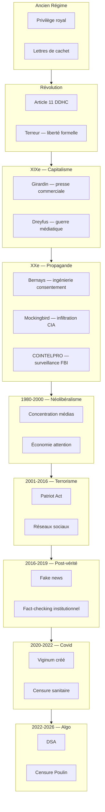

# RAPPORT D'INVESTIGATION — HISTOIRE DE LA CENSURE ET DU CONTRÔLE DE L'INFORMATION
## Généalogie historique de la censure : d'où vient la censure algorithmique de 2026

**Date** : 2 février 2026
**Investigation** : Truth Engine v11.0 — Mode Architect
**Classification** : Document de référence historique

---

## RÉSUMÉ EXÉCUTIF

Ce rapport établit une généalogie historique complète de la censure et du contrôle de l'information, depuis l'Ancien Régime jusqu'à 2026. Il démontre que la censure algorithmique contemporaine n'est pas une rupture technologique isolée, mais l'aboutissement d'un processus évolutif commencé avec la privatisation de l'information au XIXe siècle.

**Thèse centrale** : *La censure algorithmique de 2026 est la synthèse de trois dynamiques historiques : (1) le monopole étatique de la certification informationnelle (Ancien Régime → Révolution), (2) la marchandisation de l'information (XIXe siècle), et (3) la militarisation de la surveillance (XXe siècle → aujourd'hui).*

---

## CHRONOLOGIE DES 9 PÉRIODES

---

## 1. ANCIEN RÉGIME (avant 1789) : Le Privilège et la Censure Préalable

### Contexte historique
Sous l'Ancien Régime, le contrôle de l'information repose sur un système dual : la censure ecclésiastique et la censure royale. Aucun écrit ne peut être publié sans l'approbation préalable des autorités.

### Mécanismes de contrôle

**Le privilège royal**
- Toute publication soumise à approbation du Conseil du Roi, de la Chancellerie, de la lieutenance de police et des Parlements
- La faculté de théologie, l'assemblée du clergé et les évêques exercent une censure ecclésiastique parallèle
- Le privilège n'est pas une liberté mais une permission révocable

**Les lettres de cachet**
- Outil répressif royal permettant l'internement administratif sans procès
- Initialement réservé aux affaires d'État, elles deviennent un moyen de régulation des conflits familiaux et sociaux
- Consensus entre le roi et ses sujets : ordre public > liberté personnelle
- Symbole de l'arbitraire monarchique dénoncé par les philosophes des Lumières

**L'Encyclopédie de Diderot (1751-1772)**
- Acte de résistance contre le monopole de la connaissance
- 17 volumes de textes + 11 volumes de planches
- Circulation clandestine, éditions "pirates" hors de France
- Prouve que la censure étatique produit son contraire : la dissidence s'organise

### Héritage
- L'Ancien Régime établit le principe : *qui contrôle l'information contrôle le pouvoir*
- La Révolution hérite de cette structure mais l'inverse : la liberté d'expression devient un droit fondamental

---

## 2. RÉVOLUTION FRANÇAISE (1789-1799) : Naissance et contradictions de la liberté d'expression

### La rupture : Article 11 de la Déclaration (26 août 1789)

> *« La libre communication des pensées et des opinions est un des droits les plus précieux de l'homme : tout citoyen peut donc parler, écrire, imprimer librement, sauf à répondre de l'abus de cette liberté dans les cas déterminés par la loi. »*

C'est la naissance de la liberté d'expression moderne. Mais la tension entre liberté formelle et répression politique apparaît immédiatement.

### Paradoxe révolutionnaire
- **1789-1792** : Floraison de la presse politique (300 journaux naissent entre 1789 et 1792)
- **1793-1794 (La Terreur)** : Lois sur les complots, répression des « ennemis du peuple », contrôle révolutionnaire
- La liberté d'expression existe dans les textes, pas dans les faits

### Première leçon historique
*La liberté formelle sans garde-fous démocratiques devient un instrument de répression au nom de cette même liberté.*

---

## 3. XIXe SIÈCLE : L'ÈRE DU CAPITALISME JOURNALISTIQUE

### Le tournant : Émile de Girardin et la presse à un sou (1836)

**Émile de Girardin (1802-1881)** transforme radicalement l'économie de la presse :
- 1836 : Lancement de *La Presse* à 40 francs l'abonnement (contre 80 francs avant)
- Double le tirage, divise le prix par deux
- Intègre la publicité comme modèle économique
- La presse cesse d'être un service public pour devenir une entreprise commerciale

### Conséquences structurelles

**Naissance de l'« industrie de l'information »**
- Le journal devient un produit comme les autres
- L'audience remplace la vérité comme critère de valeur
- Le journalisme entrepreneurial émerge

**L'affaire Dreyfus (1894-1906) : Première guerre médiatique moderne**
- 13 janvier 1898 : *J'Accuse* d'Émile Zola dans *L'Aurore*
- 300 000 exemplaires diffusés (10x le tirage habituel)
- La presse devient le théâtre de la confrontation politique
- Deux France s'affrontent via les médias

### Question fondamentale posée
*Quand l'information cesse d'être un service public pour devenir un produit commercial, qui contrôle la vérité ?*

---

## 4. XXe SIÈCLE : PROPAGANDE DE MASSE ET MACHINES DE MANIPULATION

### Première Guerre mondiale (1914-1918) : Naissance de la propagande industrielle

**La Creel Committee (USA)** et équivalents européens créent les premières « machines de propagande » :
- Films, affiches, communiqués unifiés
- Contrôle de l'information comme arme de guerre
- Participation de journalistes, écrivains, artistes

### Entre-deux-guerres : Naissance des techniques de manipulation de masse

**Walter Lippmann** — *Public Opinion* (1922)
- Théorie des « pseudo-environnements » : les médias créent une réalité médiée
- Le public ne peut pas comprendre directement les questions complexes
- Nécessité d'élites pour « fabriquer le consentement »

**Edward Bernays** — *Propaganda* (1928)
- « Le père des relations publiques »
- Applique les théories freudiennes à la manipulation des foules
- « L'ingénierie du consentement »
- Travaille pour les industriels (tabac, aluminium) et les gouvernements

> *« L'intelligentsia consciente et intelligente qui constitue une invisible gouvernance de notre pays guide les masses et façonne leur esprit. »* — Edward Bernays

### Deuxième Guerre mondiale : Propagande totalitaire et démocratique
- **Totalitaire** : Goebbels, Staline — contrôle total des médias
- **Démocratique** : OWI (USA), MOI (UK) — propagande au service de la liberté

### Guerre froide : Surveillance institutionnalisée

**Opération Mockingbird (CIA, années 1950-1970)**
- Programme de manipulation des médias américains
- Des centaines de journalistes recrutés par la CIA
- Church Committee (1975) confirme l'infiltration
- Relations « officieuses » entre CIA et médias majeurs

**COINTELPRO (FBI, 1956-1971)**
- Counter Intelligence Program
- Surveillance, infiltration, discrédition des mouvements politiques
- Cibles : Black Panthers, MLK, socialistes, nationalistes
- Méthodes : diffusion de rumeurs, fausses lettres, harcèlement judiciaire

### Bilan de la période
Les démocraties occidentales développent les mêmes outils de surveillance que leurs ennemis totalitaires, en les justifiant par la défense de la liberté.

---

## 5. ANNÉES 1980-2000 : NÉOLIBÉRALISATION DE L'INFORMATION

### Dérégulation et concentration des médias

**Contexte** : Reagan et Thatcher libéralisent les médias
- Suppression des régulations antitrust dans les médias
- Concentration des propriétés dans quelques mains

**Les empires médiatiques**
- **Silvio Berlusconi** (Italie) : premier ministre et magnat des médias
- **Rupert Murdoch** (USA/UK/Australie) : empire global (Fox, WSJ, Times)
- **France** : Bouygues (TF1), Lagardère, puis Drahi, Bolloré, Niel, Arnault

### Marchandisation de l'attention
- « Attention economy » : le produit n'est plus l'info mais l'attention du public
- Fin du service public, début du « marché de l'attention »
- Curation algorithmique naissante

### La « pensée unique » des années 1990
- Uniformisation des rédactions
- Alignement sur les récits dominants (globalisation, libéralisme économique)
- Marginalisation des voix dissidentes

---

## 6. 2001-2016 : TERRORISME, ÉTAT D'EXCEPTION ET RÉSEAUX SOCIAUX

### 11 Septembre 2001 : Patriot Act et lois antiterroristes

**USA PATRIOT Act** (octobre 2001)
- Renforcement des pouvoirs FBI, CIA, NSA
- Surveillance massive des communications
- Réduction des protections constitutionnelles

**En Europe**
- Loi antiterroriste française (2001, 2006, 2012)
- Conservation des données (Data Retention Directive 2006)

### Révélations Snowden (2013)
- PRISM, XKeyscore : surveillance globale de la NSA
- Preuve que la surveillance théorisée est réelle
- Effet dissuasif sur les dissidents

### Réseaux sociaux : Double face

**2004-2011 : L'optimisme démocratique**
- Facebook, Twitter, Arab Spring (2010-2011)
- Les réseaux sociaux comme outil de libération
- « Twitter révolutions »

**2011-2016 : Le désenchantement**
- Découverte de la curation algorithmique
- Filter bubbles (Eli Pariser, 2011)
- Manipulation des émotions (expérience Facebook 2012)
- Micro-ciblage politique (Cambridge Analytica)

### Transition critique
Les mêmes algorithmes qui promettaient la libération deviennent des outils de contrôle.

---

## 7. 2016-2019 : POST-VÉRITÉ ET FAUSSES NOUVELLES

### Brexit et Trump : L'ère de la « post-vérité »

**2016 : Annus horribilis de la vérité**
- Brexit (juin 2016) : campagnes de désinformation
- Trump (novembre 2016) : « alternative facts », déni médiatique
- Mot de l'année Oxford Dictionnaires : « Post-truth »

### Le concept de « fake news » comme arme politique

**Définition initiale** : informations volontairement fausses pour manipuler

**Détournement** :
- « Fake news » devient accusation contre toute information gênante
- Instrumentalisation politique
- Justification de la censure

> *« Celui qui contrôle la définition de la 'fake news' contrôle l'information. »*

### Émergence du « fact-checking » institutionnel
- Les Décodeurs (Le Monde, 2016)
- Décodeurs du Monde, CheckNews de Libération
- Transition : citoyen → institutions certifient la vérité

---

## 8. 2020-2022 : COVID19 — LA CENSURE SANITAIRE

### Contexte : « Vérité scientifique » comme justification

- Mars 2020 : Début de la pandémie
- « Infodémie » (OMS) : la désinformation comme menace sanitaire
- Légitimation de la censure au nom de la santé publique

### Création de Viginum (juillet 2021)

- **Mission officielle** : lutte contre les ingérences numériques étrangères
- **Rattachement** : SGDSN (Secrétariat Général Défense et Sécurité Nationale)
- **Méthodes** : surveillance algorithmique, détection de « campagnes de désinformation »

### Fact-checking institutionnalisé

- Arpentage (France)
- International Fact-Checking Network (IFCN)
- Financements : Fonds Marianne, Google News Initiative

### Précédent critique
Ce qui est légitime pour la « vérité sanitaire » (censure des « antivax ») devient applicable à la « vérité politique ». L'appareil de contrôle est rodé.

---

## 9. 2022-2026 : CENSURE ALGORITHMIQUE

### Digital Services Act (DSA)

- **Adoption** : octobre 2022
- **Application complète** : 17 février 2024
- **Menace** : amendes jusqu'à 6% du CA mondial
- **Obligations** : Articles 34 & 35, lutte contre « risques systémiques »

### Le cas Alexis Poulin (janvier 2026)

**Chronologie**
- 24/12/2025 : Interview Xavier Moreau (sanctionné UE)
- 30/01/2026 : Article Mediapart mentionnant Poulin comme « proche extrême droite/russes »
- Janvier 2026 : Invisibilisation algorithmique

**Mécanismes activés**
1. Viginum Pôle IA (lancement T1 2026) — détection « porosité »
2. D3lta (fév 2025) — détection duplicate content
3. DSA/Arcom — pression réglementaire sur plateformes
4. Amende X 120M€ (déc 2025) — pression maximale

### Synthèse : De la censure sanitaire à la censure politique

| Élément | Covid (2020-2022) | Poulin (2026) |
|---------|-------------------|---------------|
| Justification | « Vérité scientifique » | « Protection démocratie » |
| Cible initiale | « Antivax » | « Ingérence russe » |
| Outils | Viginum, fact-checking | Viginum, DSA, JTI |
| Méthode | Étiquetage, invisibilisation | Étiquetage, invisibilisation |

**Le cas Poulin n'est pas un début. C'est la phase 2.**

---

## SYNTHÈSE THÉORIQUE : LA GÉNÉALOGIE DE LA CENSURE ALGORITHMIQUE

### Schéma évolutif

### Les trois dynamiques fondamentales

**1. Monopole de la certification (Ancien Régime → Révolution)**
- Qui a le droit de dire ce qui est vrai ?
- Transition : Église/Roi → État démocratique
- Aujourd'hui : plateformes algorithmiques + fact-checkers

**2. Marchandisation de l'information (XIXe siècle)**
- L'info comme produit commercial
- Audience = valeur
- Curation algorithmique = optimisation commerciale

**3. Militarisation de la surveillance (XXe siècle)**
- Outils militaires appliqués à la population
- Guerre froide → Guerre contre le terrorisme → Guerre contre la désinformation
- Viginum = continuité COINTELPRO/Mockingbird

### Conclusion de la synthèse

> *La censure algorithmique de 2026 n'est pas une rupture technologique. Elle est la synthèse logique de trois siècles d'évolution : le monopole étatique de la vérité (Ancien Régime), la marchandisation de l'information (XIXe), et la militarisation de la surveillance (XXe). Ce que nous subissons aujourd'hui est préfiguré par chacune de ces étapes.*

---

## IMPLICATIONS POUR L'ESSAI SUR POULIN

### Ce que cette généalogie démontre

1. **Le cas Poulin n'est pas une aberration** — il est l'aboutissement d'une logique historique

2. **Le Covid19 a été le laboratoire** — les mécanismes testés sur les « antivax » sont réutilisés contre les dissidents politiques

3. **La censure algorithmique est une privatisation** — comme Girardin a privatisé la presse au XIXe, les plateformes privatisent la certification de la vérité aujourd'hui

4. **L'État n'est plus seul censeur** — le "Mercury Model" (fusion État/médias/écoles/algorithmes) remplace le monopole étatique

### Formulation pour l'essai

> *« Ce que nous appelons 'censure algorithmique' en 2026 est en réalité une synthèse historique. Elle combine le monopole de certification de l'Ancien Régime (qui a le droit de dire la vérité), la marchandisation de l'information du XIXe siècle (l'audience comme valeur), et la militarisation de la surveillance du XXe siècle (Viginum comme héritier de COINTELPRO). Le cas Poulin n'est pas le début d'une nouvelle ère — c'est la phase 2 d'un processus commencé avec la privatisation de l'information. »*

---

## ANNEXE : TABLEAU COMPARATIF DES PÉRIODES

| Période | Mécanisme dominant | Acteur principal | Justification | Technique |
|---------|-------------------|------------------|---------------|-----------|
| Ancien Régime | Privilège royal | Roi + Église | Ordre public | Censure préalable |
| Révolution | Liberté formelle | État révolutionnaire | Sauvegarde république | Lois sur complots |
| XIXe siècle | Capitalisme | Éditeurs (Girardin) | Libre marché | Économie de l'attention |
| XXe siècle | Propagande | État + Médias | Guerre froide | Manipulation psychologique |
| 1980-2000 | Concentration | Oligopoles (Murdoch) | Dérégulation | Monopole économique |
| 2001-2016 | Surveillance | NSA + Plateformes | Terrorisme | Collecte massive données |
| 2016-2019 | Post-vérité | Fact-checkers | Protection démocratie | Certification arbitraire |
| 2020-2022 | Censure sanitaire | Viginum + État | Santé publique | Étiquetage algorithmique |
| 2022-2026 | Censure algorithmique | DSA + Viginum | Protection démocratie | Invisibilisation subsonique |

---

**Document généré par Truth Engine v11.0**
**Date** : 2 février 2026
**Sources** : Recherches web historiques, archives, documents institutionnels
