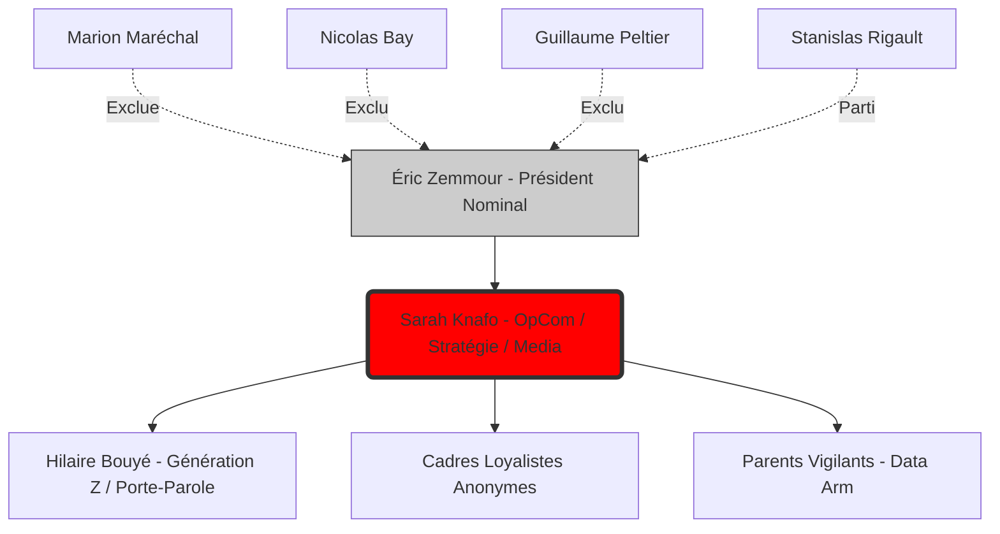

# L'ARMÉE DE SARAH : Cartographie du Pouvoir Post-Purge

> [!CAUTION]
> **CLASSIFICATION**: POWER STRUCTURE ANALYSIS
> **DATE**: 2025-12-12
> **STATUS**: VERROUILLÉ

## EXECUTIVE SUMMARY

L'organigramme de Reconquête a été **désossé** entre juin 2024 et mars 2025. Les "lieutenants historiques" (Maréchal, Bay, Peltier, Rieu, puis Rigault) ont été soit purgés, soit sont partis. Ce qui reste est un **noyau dur** entièrement sous le contrôle de Sarah Knafo, peuplé de profils jeunes, loyaux, et sans alternative politique.

---

## I. LES PURGÉS (Juin 2024)

| Acteur | Statut | Destination Post-Reconquête |
|--------|--------|---------------------------|
| **Marion Maréchal** | Exclue (12 juin 2024) | Fonde "Identité-Libertés" (Oct 2024) |
| **Nicolas Bay** | Exclu (Juin 2024) | Rejoint Identité-Libertés/RN |
| **Guillaume Peltier** | Exclu (Juin 2024) | Rejoint Identité-Libertés/RN |
| **Damien Rieu** | Parti (2024) | Rejoint Identité-Libertés |

👉 **Analyse** : Ce n'est pas une hémorragie, c'est une **amputation chirurgicale**. Zemmour a signé les exclusions, mais c'est Knafo qui a créé les conditions de l'impossible cohabitation (cf. conflit documenté Maréchal/Knafo pendant les Européennes).

---

## II. LE DERNIER DÉPART (Mars 2025)

**Stanislas Rigault** a quitté Reconquête en mars 2025, abandonnant ses postes de :
*   Président de Génération Z
*   Porte-parole du parti

**Point clé** : Rigault était *le recruté de Knafo* (elle l'a présenté à Zemmour en 2020). Son départ n'est pas une purge, c'est un **désengagement stratégique**.

👉 **Hypothèse** : Rigault a vu le piège se refermer. Rester dans un parti contrôlé à 100% par une seule personne (qui n'est pas le président nominal) est une impasse pour une ambition personnelle. Il a préféré "prendre l'air" maintenant.

---

## III. L'ARMÉE DE SARAH (Structure Actuelle)

### Le Triumvirat Fantôme

| Poste | Occupant | Notes |
|-------|----------|-------|
| **Président** | Éric Zemmour | Rôle **nominal**. En retrait médiatique depuis automne 2024. |
| **Figure Médiatique/Stratégie** | **Sarah Knafo** | Rôle **réel**. Députée Européenne. Vice-Prés. groupe "Europe des Nations Souveraines". Omniprésente dans les médias. |
| **Président Génération Z** | Hilaire Bouyé | Le nouveau visage de la jeunesse. Loyaliste. |

### Profil : Hilaire Bouyé (Le Nouveau Soldat)

*   **Âge** : 26 ans
*   **Statut** : Président Génération Z (depuis Mars 2025), Porte-parole Reconquête.
*   **Origine** : **Co-fondateur** de Génération Z avec Rigault. Issue de l'UNI (syndicat étudiant de droite). Formation commerciale (DUT, GEM).
*   **Loyauté** : Totale envers Knafo (il lui doit son ascension).
*   **Score électoral** : 6% au 1er tour de la législative partielle Paris 2e (Sept 2025). Échec cuisant, mais le parti a besoin de têtes.

👉 **Analyse** : Bouyé est le **prototype du Knafiste** : jeune, sans passé politique encombrant, totalement dépendant du couple Zemmour-Knafo pour sa carrière. Il n'a aucune base personnelle, aucun réseau hors du parti. C'est le soldat parfait.

---

## IV. LA DYNAMIQUE DE POUVOIR

### Interprétation

1.  **Zemmour est le "Front"**. Il reste le nom, le brand, l'auteur des livres. Mais il est en retrait opérationnel.
2.  **Knafo est le "CPU"**. Toutes les décisions stratégiques, l'orientation média, les exclusions passent par elle.
3.  **Les "Lieutenants" ne sont plus des lieutenants**. Ils sont des **exécutants sans pouvoir propre**. Bouyé n'a pas de légitimité historique (il n'était pas sur le front de 2022 comme Rieu ou Bay).

---

## V. CONCLUSION : "L'OPA EST TERMINÉE"

Sarah Knafo n'est plus en train de "prendre le pouvoir". Elle l'a **déjà pris**.

Le parti est désormais une **structure binaire** :
*   Le haut (Zemmour-Knafo) : un couple fusionnel où elle est l'opérateur.
*   Le bas (Bouyé + cadres) : des profils sans autonomie, interchangeables.

Il n'y a plus de **contre-pouvoir interne**. Tous ceux qui pouvaient en incarner un sont partis ou ont été purgés.

**Ce que cela signifie pour 2027** : Si Zemmour se représente, c'est elle qui pilotera la campagne. S'il ne se représente pas (fatigue, âge, échec), elle est **la seule** à pouvoir reprendre le flambeau. Le parti a été redessiné pour qu'il n'y ait aucune autre option.

---

## VI. QUESTIONS OUVERTES (Pistes Futures)

1.  **Qui finance Bouyé ?** Son profil financier personnel (DUT + école de commerce) ne colle pas avec une vie de militant à temps plein sans revenus.
2.  **Y a-t-il des "cellules dormantes" Knafistes dans d'autres partis ?** Des personnes passées par Génération Z qui ont ensuite infiltré LR ou d'autres structures ?
3.  **Quelle est la vraie relation entre Knafo et le Claremont Institute au niveau opérationnel ?** Formation reçue = formation à transmettre ?
