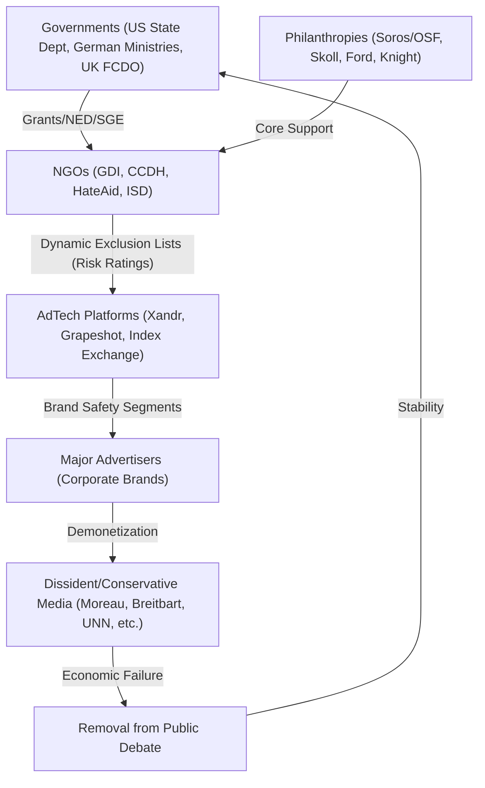

# FINANCIAL SOURCE CODE: THE CENSORSHIP-INDUSTRIAL COMPLEX [2024-12-24]

## 1. THE ARCHITECTURE OF "MONEY INVISIBLE"

The investigation reveals a systemic decoupling of censorship from the law. By using **Market-Based Mechanisms** (AdTech, Licensing, Brand Safety), the state achieves speech suppression without ever having to pass a restrictive law.

### ◈ FINANCIAL FLOWS (2023-2024 DATA)

| Entity | Primary Funding Source | 2024 Revenue/Budget | Key Mechanism |
| :--- | :--- | :--- | :--- |
| **GDI (UK/US)** | Knight, FCDO (ceased), Luminate, OSF, NED | ~$4.7M (combined) | **Dynamic Exclusion List** (Licensed to Xandr, Oracle) |
| **CCDH** | Skoll Fund ($415k), Open Society ($250k) | ~$4.2M | **Advertiser Pressure** (Social Media Boycotts) |
| **HateAid** | German Fed. Ministries, Campact gGmbH | ~Multi-Millions | **Legal Warfare** (Subsidized lawsuits/Vigilance) |
| **ISD Global** | Ford Foundation ($400k), US Dept of State | ~£5M+ (est) | **Policy Influence** (Strategic Advising to EU/US) |

---

## 2. THE GOVERNMENT-NGO-ADTECH LOOP (🌐)

### ◉ THE "LICENSE FOR SILENCE" MODEL
The most critical discovery is the **Licensing Model**. GDI does not just "research"—it **sells data**.
- **The Customer**: AdTech companies (Xandr, Oracle's Grapeshot).
- **The Product**: A real-time feed of "risky" domains.
- **The Loop**: Taxpayer money (via NED/State Dept) funds the creation of the list. Corporations then pay the NGO to access the list to "protect" their brands. The result is an automated, faceless financial strangulation of any outlet labeled "high risk."

---

## 3. IDENTIFIED "FINANCIAL WOLVES"

1. **The Philanthropic Proxies**: George Soros (OSF), Jeff Skoll (eBay/Skoll Fund), and Pierre Omidyar (Luminate/Omidyar Network) operate as the "Venture Capitalists" of the Censorship Complex.
2. **The Administrative Enforcers**: The **Global Engagement Center (GEC)** at the US State Dept and the **German Federal Ministry for Family Affairs** catalyze the NGO growth through strategic grants.
3. **The Proxy Arbitrators**: GDI (Global Disinformation Index) acts as a "Dark Credit Rating Agency" for speech. They decide who is "economically viable" and who is not.

---

## 4. CLINICAL DIAGNOSTICS

[MONEY_IV] **€:** 9.5 (High opacity/Proxy usage)
[NETWORK_S] **🌐:** 10 (Global coordination)
[CUI_BONO] **W:** Institutional status quo and the protection of the "Atlantic Narrative" from internal dissent.

### SYNOPSIS
The "Censorship-Industrial Complex" is a **Financial Shield**. It protects the ruling narrative by turning dissent into a **Liability** for the market. By the time a citizen notices they have been "shadowbanned," their favorite news outlet has already been bankrupted by a "Dynamic Exclusion List" they never knew existed.

**MnemoLite Save**: [FINANCIAL_SOURCE_CODE] Censorship-Industrial Complex - 2025-12-24
