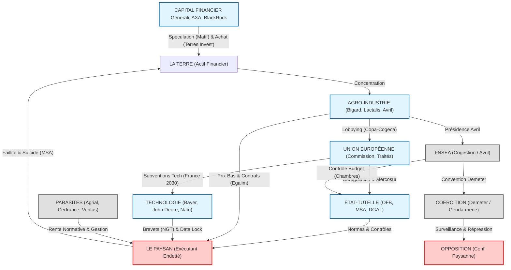

# LA MATRICE : CARTOGRAPHIE SYSTÉMIQUE (PHASE 2 - FINALE)
**Objectif** : Transformer l'Inventaire (Liste) en Système (Machine).
**Dossie** : `/home/giak/projects/truth-engine/logs/CORPUS_ATOMIC_DATA_MASTER.md`

---

## I. LA MÉCANIQUE GÉNÉRALE (THE MACHINE)
*Comment les 9 dimensions s'articulent pour broyer.*

---

## II. LA TRAGÉDIE EN 5 ACTES (STRUCTURE NARRATIVE)
*L'histoire n'est pas une suite d'événements, c'est un programme.*

### ACTE I : L'EXPROPRIATION (Le Foncier)
*   **Thèse** : La terre n'est plus un outil de travail, c'est un actif financier.
*   **Mécanisme** : La MSA agit comme "liquidateur" pour transférer le foncier vers la Finance (Generali/AXA) et l'Énergie (TotalEnergies/Solaire).
*   **Chiffre** : 14% de la SAU détenue par des sociétés.

### ACTE II : LA DÉPENDANCE (Le Vivant & La Tech)
*   **Thèse** : Le paysan a perdu la propriété de ses moyens de production.
*   **Mécanisme** :
    *   **Génétique** : Brevets NGT (Bayer/Limagrain).
    *   **Matériel** : Verrouillage logiciel (John Deere).
    *   **Norme** : Rente de certification (Veritas/Ecocert).

### ACTE III : L'EXTRACTION (L'Argent)
*   **Thèse** : La valeur est siphonnée par l'aval, l'amont et les parasites.
*   **Mécanisme** :
    *   **Agro-Industrie** : Marges Lactalis/Bigard vs Prix producteur.
    *   **Coopératives** : Rémunération dirigeants Sodiaal/Agrial (>200k€) vs Adhérents.
    *   **Admin** : Rente comptable (Cerfrance).

### ACTE IV : LE RECRUTEMENT FORCÉ (La Coercition)
*   **Thèse** : Le consentement est fabriqué par la force et la représentation unique.
*   **Mécanisme** :
    *   **FNSEA** : Syndicat-Etat (Cogestion) qui élimine la concurrence politique.
    *   **Demeter** : Police politique (Gendarmerie) pour traquer la dissidence ("Agribashing").
    *   **Criminalisation** : "Eco-terrorisme" pour les opposants au modèle (Eau).

### ACTE V : LA SUBSTITUTION (Le Futur)
*   **Thèse** : Le but final n'est pas de sauver l'agriculteur, mais de le remplacer.
*   **Mécanisme** :
    *   **Robotique** : Plan France 2030 (Naïo).
    *   **Import** : Ferme-Monde (Mercosur).
    *   **Main d'œuvre** : Néo-esclavage (Terra Fecundis) en attendant les robots.

---

## III. LES 3 VERROUS (CONCLUSION SYSTÉMIQUE)
1.  **Verrou Politique** : FNSEA (Bloque l'alternative).
2.  **Verrou Économique** : Dette (Empêche la sortie).
3.  **Verrou Policier** : Demeter (Empêche la révolte).
