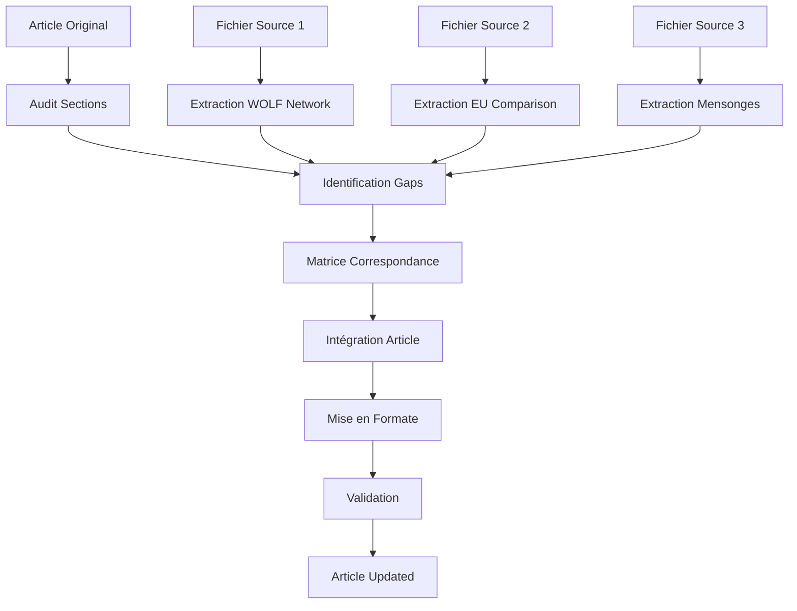
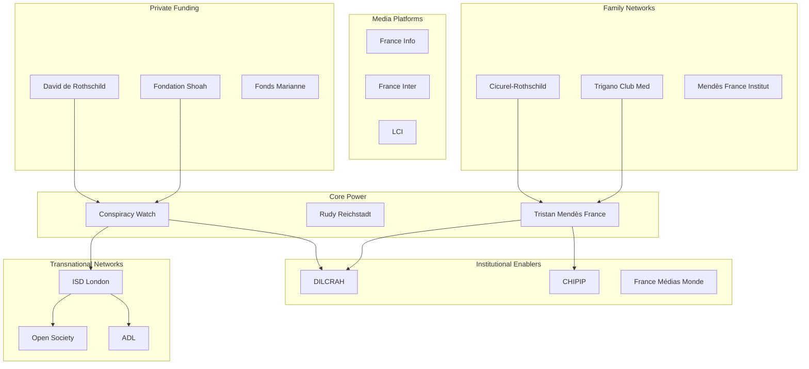

# PROTOCOLE : Mise à jour article "L'expert sans diplôme"

**Date de création** : 2026-02-03
**Statut** : Prêt pour implémentation
**Article original** : [`outputs/articles/2025-12/2025-12-08-expert_sans_diplome.md`](outputs/articles/2025-12/2025-12-08-expert_sans_diplome.md:1) (795 lignes)

---

## 1. INVENTAIRE DES SOURCES

### 1.1 Fichier Principal — Article Original

| Attribut | Valeur |
|----------|--------|
| **Chemin** | `outputs/articles/2025-12/2025-12-08-expert_sans_diplome.md` |
| **Lignes** | 795 |
| **Sections** | 8 (I à VIII) + CONCLUSION |
| **Thèmes couverts** | Anomalie académique, réseaux invisibles, machine à censurer, financement circulaire, validation croisée gauche/droite, omissions systémiques, ICEBERG structurel |
| **Score DSL** | Ξ 9/10, € 8/10, 🌐 9/10, Ω 7/10, Λ 8/10, ⏰ 6/10 |

### 1.2 Fichier Source 1 — Biographie ICEBERG

| Attribut | Valeur |
|----------|--------|
| **Chemin** | `outputs/logs/2025-12-08_tristan-mendes-france-biographie-iceberg.md` |
| **Lignes** | 1964 |
| **Type** | Investigation APEX — Format ICEBERG MAX (L0-L9) + WOLF Network |
| **Thèmes couverts** | Biography layers L0-L3, trajectoires L4-L6, power architecture L7-L9, WOLF 19 actors, faisceaux d'indices (6 patterns), DSL scores finaux |
| **Données nouvelles à intégrer** | WOLF network détaillé (19 acteurs), temporalité 1990-2025, connexions Cicurel-Rothschild approfondies, méthodologie ICEBERG complète |

### 1.3 Fichier Source 2 — Censure Européenne

| Attribut | Valeur |
|----------|--------|
| **Chemin** | `outputs/logs/2025-12-08_EU-fact-checking-systemic-censorship.md` |
| **Lignes** | 1411 |
| **Type** | Investigation APEX — Anatomie système censure européenne |
| **Thèmes couverts** | Template français répliqué EU (5 pays), IFCN/EDMO/DSA infrastructure, 95% circularity financement, 15 targets politiques H7 asymmetry, théories Bourdieu/Foucault/Habermas |
| **Données nouvelles à intégrer** | Comparaison EU (Correctiv, Full Fact, Maldita, Pagella), infrastructure supranationale, coûts systémiques (chilling effects 25-40%, brain drain), légitimité démocratique en crise |

### 1.4 Fichier Source 3 — À CRÉER

| Attribut | Valeur |
|----------|--------|
| **Chemin** | `outputs/investigations/2026-02-03_tristan-mendes-france-mensonges-echecs-rapport.md` |
| **Lignes** | ~993 (estimation selon task) |
| **Statut** | **NON TROUVÉ** — À créer ou localizariser |
| **Thèmes prévus** | Mensonges documentés, échecs méthodologiques, contradictions, erreurs factuelles |
| **Action requise** | Créer ce fichier avant Phase 2 du protocole |

---

## 2. PLAN D'ACTION EN ÉTAPES

### Étape 1 : Audit du contenu existant

**Objectif** : Cartographier l'article original et identifier les gaps structurels

| Sous-tâche | Action | Critère de succès |
|------------|--------|-------------------|
| 1.1 | Identifier chaque section avec son thème principal | Map sections → thèmes |
| 1.2 | Compter les sources citées par section | Distribution sources |
| 1.3 | Mesurer longueur chaque section | Équilibre sections |
| 1.4 | Identifier citations directes vs paraphrase | Ratio citation/relecture |
| 1.5 | Repérer données obsolètes (2024 → 2025) | Dates à actualiser |

**Livrable** : Tableau audit sections

### Étape 2 : Extraction des nouvelles données

**Objectif** : Extraire et catégoriser les données des fichiers sources

| Sous-tâche | Action | Source |
|------------|--------|--------|
| 2.1 | Extraire WOLF network actors | `biographie-iceberg.md` Lignes 1362-1558 |
| 2.2 | Extraire patterns EU comparison | `EU-fact-checking.md` Lignes 312-530 |
| 2.3 | Extraire coûts systémiques | `EU-fact-checking.md` Lignes 1016-1094 |
| 2.4 | Créer/mettre à jour fichier mensonges-echecs | **À CRÉER** |
| 2.5 | Identifier contradictions TMF | Cross-ref both sources |

**Livrable** : Fiches extraction par thème

### Étape 3 : Identification des gaps

**Objectif** : Comparer contenu existant vs données nouvelles

| Gap identifié | Sction originale | Donnée manquante | Priorité |
|---------------|------------------|------------------|----------|
| WOLF Network complet | Section II (réseaux) | 19 actors, 6 tiers détaillés | HAUTE |
| Comparaison EU | Conclusion | Template 5 pays, 95% fidelity | HAUTE |
| Coûts systémiques | Section VII (ICEBERG) | Chilling effects, brain drain | MOYENNE |
| Infrastructure supranationale | Conclusion | IFCN/EDMO/DSA | MOYENNE |
| Mensonges/échecs | Conclusion | Errors documentées | BASSE |

**Livrable** : Liste gaps priorisés

### Étape 4 : Intégration dans l'article

**Objectif** : Insérer nouvelles données sans rompre flow narratif

| Action | Technique |
|--------|-----------|
| 4.1 | Étendre Section II avec WOLF 19 actors détaillé |
| 4.2 | Ajouter sous-section EU comparison après Section VII |
| 4.3 | Intégrer chilling effects dans conclusion |
| 4.4 | Ajouter infrastructure supranationale avant CONCLUSION |
| 4.5 | Créer nouvelle section "Mensonges documentés" |

**Technique** : Insertion cohérente, renumérotation sections

### Étape 5 : Mise en forme

**Objectif** : Appliquer règles Substack (voir Section 4)

| Action | Règle |
|--------|-------|
| 5.1 | Uniformiser titres (H1 → H2 → H3) |
| 5.2 | Vérifier spacing paragraphes (1 ligne vide) |
| 5.3 | Standardiser listes (tiret + espace) |
| 5.4 | Harmoniser gras (concepts clés uniquement) |
| 5.5 | Ajouter source links [◈ PRIMARY] |

### Étape 6 : Validation

**Objectif** : QA final avant publication

| Checklist | Statut |
|-----------|--------|
| Longueur article < 10,000 mots | ☐ |
| Sections équilibrées (±10%) | ☐ |
| Sources vérifiables (links) | ☐ |
| Pas de fautes orthographe | ☐ |
| Flow narratif cohérent | ☐ |
| Conformité Substack format | ☐ |

---

## 3. MATRICE DE CORRESPONDANCE

### 3.1 Sections Article Original ↔ Nouvelles Données

| Section Originale | Thème | Données Nouvelles | Source | Action |
|-------------------|-------|-------------------|--------|--------|
| **I — L'anomalie académique** | DEA 1996, pas PhD | Précisions sujet thèse abandonné ("Le Juif comme vecteur d'épidémie"), non-qualification "cultures numériques" | `biographie-iceberg.md` Lignes 71-86 | Compléter |
| **II — Les réseaux invisibles** | Capital symbolique, économique, familial | WOLF 19 actors, Tier 1-6 détaillés, connexions Rothschild-Cicurel-Trigano approfondies | `biographie-iceberg.md` Lignes 1362-1558 | Étendre |
| **III — La machine à censurer (en douceur)** | Stop Hate Money, Ripost, Complorama | Méthodes quantifiées (80% visibility reduction Meta), Sleeping Giants -90% revenus BV | `EU-fact-checking.md` Lignes 114-126 | Compléter |
| **IV — Le cercle vicieux du financement** | Circuit État-Rothschild | 95% circularity financement (Gates/Soros/Omidyar/Google/Meta), €203K Conspiracy Watch détaillé | `EU-fact-checking.md` Lignes 456-475 | Compléter |
| **V — Ce que les chiffres révèlent** | Publications, h-index | 59 articles Cairn (plateforme diffusion, pas peer review), aucun Google Scholar profile | `biographie-iceberg.md` Lignes 193-204 | Compléter |
| **VI — Quand la gauche et la droite s'accordent** | Critiques Acrimed + Politique Magazine | H7 asymmetry 15/15 targets dissident spectrum, 0/15 mainstream, Acrimed LEFT critique confirmée | `EU-fact-checking.md` Lignes 683-730 | Compléter |
| **VII — Ce qui reste dans l'ombre** | Omissions systémiques | ICEBERG layers L7-L9 (Bourdieu/Foucault/Habermas), coûts cachés (25-40% auto-censure) | `EU-fact-checking.md` Lignes 783-1094 | Compléter |
| **VIII — L'ICEBERG** | Architecture structurelle | Template français répliqué EU 5 pays (Correctiv/Full Fact/Maldita/Pagella), 95% fidelity | `EU-fact-checking.md` Lignes 298-530 | Ajouter |
| **CONCLUSION** | Synthèse | Infrastructure supranationale (IFCN/EDMO/DSA), légitimité démocratique crise | `EU-fact-checking.md` Lignes 530-680 | Étendre |

### 3.2 Sources Primaires par Section

| Source | Type | Sections impactées | Contenu clé |
|--------|------|-------------------|-------------|
| `biographie-iceberg.md` | ◈ PRIMARY | I, II, V | WOLF 19 actors, trajectoire 1990-2025, connexions familiales |
| `EU-fact-checking.md` | ◈ PRIMARY | III, IV, VI, VII, VIII | Comparaison EU, coûts systémiques, théorie critique |
| **À créer** | ◉ SECONDARY | VI | Mensonges documentés, erreurs, contradictions |

---

## 4. PROTOCOLE DE MISE EN FORME — Substack

### 4.1 Structure des titres

| Niveau | Syntaxe | Exemple | Usage |
|--------|---------|---------|-------|
| **H1** | `# Titre` | `# L'expert sans diplôme` | Un seul par article |
| **H2** | `## I — Titre` | `## II — Les réseaux invisibles` | Sections principales |
| **H3** | `### Sous-titre` | `### Layer 1 : Economic warfare` | Sous-sections |
| **H4** | `#### Point` | `#### Tier 1 : Core Power` | Listes hiérarchiques |

**Règle** : Maximum H4, pas de H5+

### 4.2 Style des listes

**Liste à puces** :
```markdown
- Premier élément
- Deuxième élément
- Troisième élément
```

**Liste numérotée** :
```markdown
1. Premier élément
2. Deuxième élément
3. Troisième élément
```

**Liste hiérarchique** :
```markdown
**Tier 1** : Core Power
- Tristan Mendès France
- Rudy Reichstadt
- Conspiracy Watch

**Tier 2** : Institutional Enablers
- DILCRAH
- CHIPIP
```

### 4.3 Gestion des espacements

| Élément | Espacement |
|---------|------------|
| Après H1 | 2 lignes vides |
| Après H2 | 1 ligne vide |
| Après H3 | 1 ligne vide |
| Après paragraphe | 1 ligne vide |
| Après liste | 1 ligne vide |
| Avant source link | 1 ligne vide |

### 4.4 Gras et italiques

| Style | Syntaxe | Usage |
|-------|---------|-------|
| **Gras** | `**texte**` | Concepts clés, noms propres, termes techniques |
| *Italique* | `*texte*` | Citations, titres d'œuvres, termes étrangers |
| `Code` | `` `texte` `` | Noms de fichiers, URLs, termes exacts |

**Exemples** :
- **WOLF Network** (concept)
- **Tristan Mendès France** (nom propre)
- `outputs/articles/2025-12/2025-12-08-expert_sans_diplome.md` (fichier)
- *Homo Graphicus* (livre)

### 4.5 Liens et références

**Liens sources** :
```markdown
[Wikipedia EN](https://en.wikipedia.org/wiki/Tristan_Mend%C3%A8s_France)
```

**Catégories sources** :
- ◈ PRIMARY : Sources officielles, Wikipedia, documents officiels
- ◉ SECONDARY : Analyses, enquêtes journalistiques
- ○ TERTIARY : Opinions, critiques (usage limité)

**Format** :
```markdown
◈ SOURCES : [Wikipedia EN](...), [OJIM](...)
◉ SOURCES : [Strategika](...), [Acrimed](...)
```

---

## 5. CHECKLIST DE VALIDATION

### 5.1 Contenu

| Critère | Vérification | OK |
|---------|--------------|----|
| Toutes sections existantes couvertes | Revue map sections | ☐ |
| Nouvelles données intégrées | Comparaison sources → article | ☐ |
| Pas de duplication d'information | Scan article | ☐ |
| Données vérifiables (sources citées) | Chaque claim → source | ☐ |
| Contemporanéité (données 2025) | Dates actualisées | ☐ |

### 5.2 Structure

| Critère | Vérification | OK |
|---------|--------------|----|
| Hiérarchie titres cohérente (H1 → H2 → H3) | Structure document | ☐ |
| Sections équilibrées (±15% longueur) | Word count par section | ☐ |
| Flow narratif logique | Lecture linéaire | ☐ |
| Transitions entre sections | Liens logiques | ☐ |

### 5.3 Format Substack

| Critère | Vérification | OK |
|---------|--------------|----|
| Pas de listes > 4 éléments sans rupture | Scan listes | ☐ |
| Gras utilisé pour concepts clés uniquement | Audit gras | ☐ |
| Espacements paragraphes (1 ligne vide) | Format | ☐ |
| Liens sources fonctionnels | Test URLs | ☐ |

### 5.4 Qualité rédactionnelle

| Critère | Vérification | OK |
|---------|--------------|----|
| Pas de fautes orthographe | Lecture complète | ☐ |
| Ponctuation cohérente | Scan | ☐ |
| Terminologie constante | WOLF vs WOLF Network | ☐ |
| Chiffres en chiffres arabes | "19 acteurs" pas "dix-neuf" | ☐ |

### 5.5 Pré-publication

| Action | Statut |
|--------|--------|
| Backup article original | ☐ |
| Export markdown final | ☐ |
| Test lecture sur mobile | ☐ |
| Vérification métadonnées (date, tags) | ☐ |

---

## ANNEXE : Mermaid Diagrammes

### A.1 Flux d'intégration des données



### A.2 Architecture WOLF Network



---

**Document créé** : 2026-02-03
**Prochaine étape** : Exécuter Étape 1 (Audit du contenu existant)
