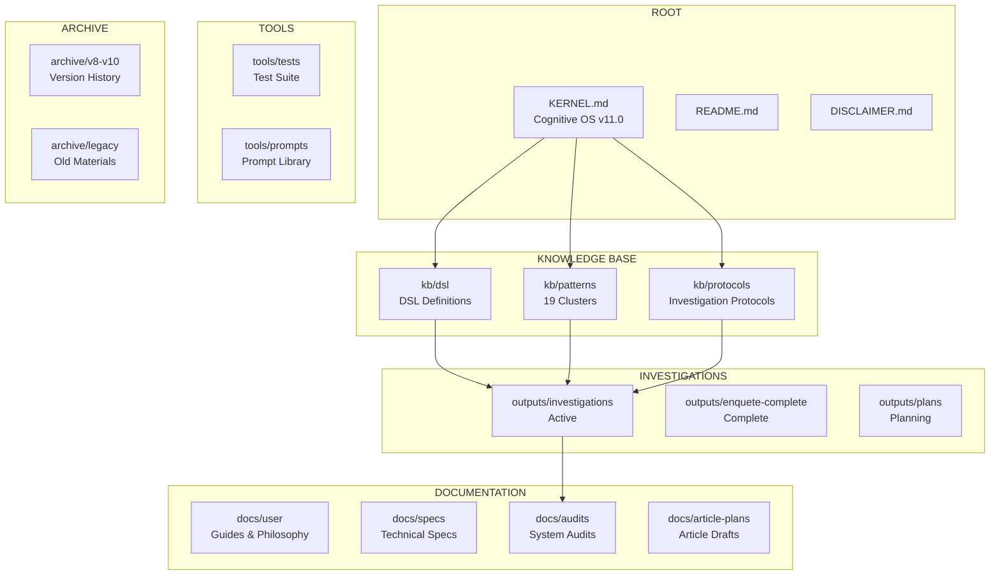

# Truth Engine Reorganization Proposal

## Audit & Migration Plan v1.0

---

## 1. CURRENT STATE AUDIT

### 1.1 Root Level Analysis

| File | Size | Category | Status |
|------|------|----------|--------|
| `KERNEL.md` | ~22KB | KERNEL (duplicate) | ⚠️ Duplicate of `core/KERNEL.md` |
| `README.md` | 7.5KB | Documentation | ✅ Valid |
| `DISCLAIMER.md` | 11KB | Documentation | ✅ Valid |
| `STRUCTURE.md` | 3.7KB | Documentation | ⚠️ Outdated (v10 structure) |
| `package.json` | 127B | Config | ✅ Valid |
| `8-02-2026_investigation_lecornu.md` | 11.7KB | Investigation | ⚠️ Should be in outputs/ |

**Issues Found:**
- `KERNEL.md` at root is duplicate of `core/KERNEL.md`
- Loose investigation file at root level
- `STRUCTURE.md` reflects v10, not v11 architecture

---

### 1.2 Core Directory Analysis

| Path | Files | Purpose | Status |
|------|-------|---------|--------|
| `core/KERNEL.md` | 1 | Cognitive OS v11.0 | ✅ PRIMARY - The executable |
| `core/CLUSTERS_COMPLETE.md` | 1 | Cluster summary | ✅ Reference |
| `core/HANDOFF_MEMO.md` | 1 | Development notes | ⚠️ Could move to docs/ |
| `core/dsl/` | 9 | DSL definitions | ✅ KB - Required for execution |
| `core/patterns/` | 19 | Pattern clusters | ✅ KB - Required for execution |
| `core/protocols/` | N/A | (not visible in listing) | ⚠️ Need to verify |

**Content Breakdown:**
- **KERNEL.md** (22KB): The cognitive operating system - PRIMARY CORE
- **DSL Files**: COGNITIVE_DSL.md (70KB), COGNITIVE_DSL_CORE.md, MACROS.md, PATTERNS.md, QUERY_OPTIMIZATION.md, etc.
- **Pattern Clusters**: 19 CLUSTER_*.md files (bio, confirmation, fragmentation, framing, gaslighting, iceberg, inversion, money, network, overload, power, spectacle, temporal, etc.)

---

### 1.3 Archive Directory Analysis

| Subdirectory | Est. Files | Content | Action |
|--------------|------------|---------|--------|
| `archive/version-docs/` | 3 | V9.1, V10, V10.1 docs | Archive |
| `archive/CLAUDE_FULL.md` | 1 | Legacy documentation | Archive |
| `archive/DASHBOARD.md` | 1 | Legacy dashboard | Archive |
| `archive/articles/` | ? | Old articles | Archive |
| `archive/investigations/` | ? | Old investigations | Archive |
| `archive/kb_archive_old/` | ? | Old KB versions | Archive |
| `archive/backups/` | ? | Various backups | Archive |
| `archive/projects/` | ? | Old projects | Archive |
| `archive/prompts/` | ? | Old prompts | Archive |
| `archive/system/` | ? | System files | Archive |

**Total Estimated: ~80 files from v8-v10**

---

### 1.4 Investigation Outputs Analysis

| Location | Files | Type | Status |
|----------|-------|------|--------|
| `investigations/` | ~12 | Active investigations | ✅ Keep as outputs |
| `outputs/investigations/` | N/A | (subdirectory) | ✅ Keep |
| `outputs/articles/` | N/A | Generated articles | ✅ Keep |
| `outputs/social/` | N/A | Social content | ✅ Keep |
| `enquete-complete/` | ~20 | Complete investigations | ✅ Keep (reference) |
| `docs/investigations/` | 4 subdirs | Investigation archives | ⚠️ Could consolidate |

---

### 1.5 Documentation Analysis

| Location | Files | Type | Status |
|----------|-------|------|--------|
| `tools/docs/` | 6 + subdirs | User guides, philosophy | ✅ Primary docs |
| `tools/docs/audits/` | 4 | System audits | ✅ Keep |
| `tools/docs/article-plans/` | 7 | Article drafts | ✅ Keep |
| `tools/docs/specs/` | ? | Technical specs | ✅ Keep |
| `tools/docs/dev/` | ? | Development docs | ✅ Keep |
| `audits/` | 1 | Single audit | ⚠️ Consolidate to tools/docs/audits/ |
| `plans/` | 5 | Investigation plans | ⚠️ Consider moving to outputs/plans/ |

---

## 2. CURRENT CATEGORY MAPPING (PROBLEMATIC)

```
TRUTH-ENGINE/
├── [ROOT LEVEL CLUTTER]
│   ├── KERNEL.md ⚠️ DUPLICATE
│   ├── README.md
│   ├── DISCLAIMER.md
│   ├── STRUCTURE.md ⚠️ OUTDATED
│   └── 8-02-2026_investigation_lecornu.md ⚠️ LOOSE
│
├── [CONFUSED: Core vs KB vs Docs]
│   ├── core/ (has KERNEL + dsl + patterns)
│   └── docs/ (only has investigations/)
│
├── [HEAVY ARCHIVE]
│   └── archive/ (~80 files v8-v10)
│
├── [INVESTIGATIONS SCATTERED]
│   ├── investigations/
│   ├── outputs/
│   ├── enquete-complete/
│   └── docs/investigations/
│
└── [DOCS IN TOOLS]
    └── tools/docs/
```

---

## 3. PROPOSED NEW STRUCTURE

### 3.1 Target Categories

| Category | Definition | Content |
|----------|------------|---------|
| **Truth Engine Core** | Executable cognitive code | `KERNEL.md` only (the cognitive OS) |
| **Knowledge Base (KB)** | Files needed for execution | DSL, patterns, protocols |
| **Documentation** | User guides, specs, philosophy | `docs/` directory |
| **Investigations** | Generated outputs | `outputs/investigations/`, `enquete-complete/` |

### 3.2 Proposed Directory Structure

```
truth-engine/
│
├── 📦 ROOT FILES (Essential Only)
│   ├── README.md                 # Project entry point
│   ├── DISCLAIMER.md             # Legal warnings
│   └── KERNEL.md                 # ⭐ CORE - Cognitive OS v11.0 (move from core/)
│
├── 📚 KNOWLEDGE BASE (KB) - Execution Required
│   ├── kb/
│   │   ├── dsl/                 # DSL definitions
│   │   │   ├── COGNITIVE_DSL.md
│   │   │   ├── COGNITIVE_DSL_CORE.md
│   │   │   ├── MACROS.md
│   │   │   ├── PATTERNS.md
│   │   │   ├── QUERY_OPTIMIZATION.md
│   │   │   ├── QUERY_TEMPLATES.md
│   │   │   ├── SEARCH_EPISTEMIC.md
│   │   │   ├── THREATS.md
│   │   │   └── ...
│   │   │
│   │   ├── patterns/             # Cognitive pattern clusters (19 files)
│   │   │   ├── CLUSTER_BIO.md
│   │   │   ├── CLUSTER_ICEBERG.md
│   │   │   ├── CLUSTER_MONEY.md
│   │   │   └── ... (16 more)
│   │   │
│   │   └── protocols/            # Investigation protocols
│   │       ├── INVESTIGATION.md
│   │       ├── INVESTIGATION_TREE.md
│   │       ├── OUTPUT_TEMPLATE.md
│   │       └── VALIDATION.md
│   │
│   └── kb_summary.md             # Quick reference index
│
├── 📖 DOCUMENTATION
│   ├── docs/
│   │   ├── user/
│   │   │   ├── USER_GUIDE.md
│   │   │   └── PHILOSOPHY.md
│   │   │
│   │   ├── specs/
│   │   │   ├── DSL_METAGUIDE.md
│   │   │   ├── SCL_NOTATION.md
│   │   │   └── POC_EXECUTION_MODEL.md
│   │   │
│   │   ├── audits/
│   │   │   ├── ANALYSE_COMPREHENSIVE_TRUTH_ENGINE_v10.1.md
│   │   │   ├── AUDIT_COMPLET_TRUTH_ENGINE_ANALYSE_SYSTEMIQUE.md
│   │   │   ├── APEX_INVESTIGATION_FRAMEWORK_ANALYSIS.md
│   │   │   └── 2026-02-11_AUDIT_article_montchalin.md
│   │   │
│   │   ├── article-plans/
│   │   │   └── [All substack article plans]
│   │   │
│   │   └── development/
│   │       └── HANDOFF_MEMO.md
│   │
│   └── STRUCTURE.md              # Updated for v11
│
├── 🔍 INVESTIGATIONS (Generated Outputs)
│   ├── outputs/
│   │   ├── investigations/       # Active investigations
│   │   │   ├── 2026-02-08_*.md
│   │   │   ├── 2026-02-10_*.md
│   │   │   └── 2026-02-11_*.md
│   │   │
│   │   ├── articles/             # Generated articles
│   │   │   └── [Article outputs]
│   │   │
│   │   ├── social/               # Twitter/social outputs
│   │   │   └── [Social content]
│   │   │
│   │   ├── reports/              # Formal reports
│   │   │   └── [Report outputs]
│   │   │
│   │   └── results/              # Test results
│   │       └── [Validation results]
│   │
│   ├── enquete-complete/          # Complete investigations (archive)
│   │   ├── 00-INDEX-COMPLET.md
│   │   ├── 01-EXECUTIVE-SUMMARY.md
│   │   ├── [VECTEUR_*.md files]
│   │   ├── articles/
│   │   └── investigations-complementaires/
│   │
│   └── plans/                     # Investigation plans
│       ├── 2026-02-03_plan_11_mensonges_TMF.md
│       └── [Other plans]
│
├── 🛠️ TOOLS (Infrastructure)
│   ├── tools/
│   │   ├── tests/
│   │   │   ├── sprint1/
│   │   │   ├── sprint2/
│   │   │   ├── poc/
│   │   │   ├── query_optimization/
│   │   │   └── [Test scripts]
│   │   │
│   │   └── prompts/
│   │       ├── systems/
│   │       ├── archive/
│   │       └── outputs/
│   │
│   └── scripts/                   # Utility scripts
│
└── 🗄️ ARCHIVE (Historical)
    └── archive/
        ├── v8-v10/               # Version history
        │   ├── version-docs/
        │   └── [Legacy files]
        │
        ├── legacy/
        │   ├── CLAUDE_FULL.md
        │   ├── DASHBOARD.md
        │   └── [Old documentation]
        │
        └── backups/              # Backups
```

---

## 4. FILE MAPPING TABLE

### 4.1 CORE (Keep at Root)

| Source | Destination | Action |
|--------|-------------|--------|
| `core/KERNEL.md` | `KERNEL.md` | MOVE to root |
| `core/CLUSTERS_COMPLETE.md` | `kb/patterns/SUMMARY.md` | RENAME + MOVE |

### 4.2 KNOWLEDGE BASE

| Source | Destination | Action |
|--------|-------------|--------|
| `core/dsl/*` | `kb/dsl/` | MOVE directory |
| `core/patterns/*` | `kb/patterns/` | MOVE directory |
| `core/protocols/*` | `kb/protocols/` | CREATE + MOVE if exists |

### 4.3 DOCUMENTATION

| Source | Destination | Action |
|--------|-------------|--------|
| `tools/docs/USER_GUIDE.md` | `docs/user/USER_GUIDE.md` | MOVE |
| `tools/docs/PHILOSOPHY.md`/PHILOS | `docs/userOPHY.md` | MOVE |
| `tools/docs/DSL_METAGUIDE.md` | `docs/specs/DSL_METAGUIDE.md` | MOVE |
| `tools/docs/SCL_NOTATION.md` | `docs/specs/SCL_NOTATION.md` | MOVE |
| `tools/docs/POC_EXECUTION_MODEL.md` | `docs/specs/POC_EXECUTION_MODEL.md` | MOVE |
| `tools/docs/audits/*` | `docs/audits/` | MOVE directory |
| `tools/docs/article-plans/*` | `docs/article-plans/` | MOVE directory |
| `tools/docs/dev/*` | `docs/development/` | MOVE if exists |
| `core/HANDOFF_MEMO.md` | `docs/development/HANDOFF_MEMO.md` | MOVE |
| `audits/*` | `docs/audits/` | MOVE |
| `STRUCTURE.md` | `docs/STRUCTURE.md` | UPDATE + MOVE |
| `README.md` | (keep at root) | KEEP |
| `DISCLAIMER.md` | (keep at root) | KEEP |

### 4.4 INVESTIGATIONS

| Source | Destination | Action |
|--------|-------------|--------|
| `investigations/*` | `outputs/investigations/` | MOVE directory |
| `outputs/investigations/*` | `outputs/investigations/` | KEEP |
| `enquete-complete/*` | `outputs/enquete-complete/` | MOVE directory |
| `docs/investigations/*` | `outputs/investigations/archive/` | MOVE |
| `plans/*` | `outputs/plans/` | MOVE directory |

### 4.5 TOOLS

| Source | Destination | Action |
|--------|-------------|--------|
| `tools/tests/*` | `tools/tests/` | KEEP |
| `tools/prompts/*` | `tools/prompts/` | KEEP |
| `tools/docs/CLEANUP_PLAN.md` | `tools/docs/CLEANUP_PLAN.md` | DELETE (outdated) |

### 4.6 ARCHIVE

| Source | Destination | Action |
|--------|-------------|--------|
| `archive/version-docs/*` | `archive/v8-v10/version-docs/` | MOVE |
| `archive/CLAUDE_FULL.md` | `archive/legacy/CLAUDE_FULL.md` | MOVE |
| `archive/DASHBOARD.md` | `archive/legacy/DASHBOARD.md` | MOVE |
| `archive/articles/*` | `archive/legacy/articles/` | MOVE |
| `archive/investigations/*` | `archive/legacy/investigations/` | MOVE |
| `archive/kb_archive_old/*` | `archive/v8-v10/kb/` | MOVE |
| `archive/backups/*` | `archive/backups/` | KEEP |
| `archive/projects/*` | `archive/legacy/projects/` | MOVE |
| `archive/prompts/*` | `archive/legacy/prompts/` | MOVE |
| `archive/system/*` | `archive/legacy/system/` | MOVE |

### 4.7 DELETE

| File | Reason |
|------|--------|
| `8-02-2026_investigation_lecornu.md` | Duplicate - exists in investigations/ |
| `core/` (directory) | Will be empty after KB move |
| `tools/docs/CLEANUP_PLAN.md` | Outdated plan |
| `tools/docs/old_from_other_project/*` | Not related to truth-engine |

---

## 5. GIT COMMIT STRATEGY

### 5.1 Recommended Commit Order

| # | Commit | Scope | Message |
|---|--------|-------|---------|
| 1 | **feat: Establish Truth Engine Core at root level** | Root | Move KERNEL.md to root as single source of truth |
| 2 | **refactor: Extract KB from core/ to kb/** | kb/ | Separate DSL, patterns, protocols into dedicated KB directory |
| 3 | **docs: Restructure documentation to docs/** | docs/ | Consolidate user guides, specs, audits to docs/ |
| 4 | **refactor: Consolidate investigations to outputs/** | outputs/ | Merge scattered investigations into unified outputs directory |
| 5 | **chore: Archive legacy v8-v10 materials** | archive/ | Move historical versions to archive/v8-v10 |
| 6 | **cleanup: Remove duplicates and obsolete files** | Root | Delete redundant files, empty core/ directory |
| 7 | **docs: Update STRUCTURE.md for v11 architecture** | docs/ | Refresh documentation to reflect new structure |

### 5.2 Detailed Commit Commands

```bash
# Commit 1: Core at Root
git add KERNEL.md
git mv core/KERNEL.md .
git commit -m "feat: Establish Truth Engine Core at root level

- Move core/KERNEL.md to project root as single source of truth
- KERNEL.md (v11.0, ~22KB) is the cognitive operating system
- Serves as primary entry point for Truth Engine execution"

# Commit 2: KB Extraction
git add kb/
git mv core/dsl kb/
git mv core/patterns kb/
# Create kb/protocols/ if protocols exist
git commit -m "refactor: Extract KB from core/ to kb/

Knowledge Base contents:
- kb/dsl/: DSL definitions (COGNITIVE_DSL, MACROS, PATTERNS, etc.)
- kb/patterns/: 19 cognitive pattern clusters
- kb/protocols/: Investigation protocols

These files are required for Truth Engine execution."

# Commit 3: Documentation Restructure
git add docs/
git mv tools/docs/USER_GUIDE.md docs/user/
git mv tools/docs/PHILOSOPHY.md docs/user/
git mv tools/docs/DSL_METAGUIDE.md docs/specs/
git mv tools/docs/SCL_NOTATION.md docs/specs/
git mv tools/docs/POC_EXECUTION_MODEL.md docs/specs/
git mv tools/docs/audits/* docs/audits/
git mv tools/docs/article-plans/* docs/article-plans/
git mv audits/* docs/audits/
git mv core/HANDOFF_MEMO.md docs/development/
git mv STRUCTURE.md docs/
git commit -m "docs: Restructure documentation to docs/

New structure:
- docs/user/: USER_GUIDE.md, PHILOSOPHY.md
- docs/specs/: DSL_METAGUIDE.md, SCL_NOTATION.md, POC_EXECUTION_MODEL.md
- docs/audits/: System audits and analyses
- docs/article-plans/: Substack article drafts
- docs/development/: HANDOFF_MEMO.md, development notes"

# Commit 4: Investigations Consolidation
git add outputs/
git mv investigations/* outputs/investigations/
git mv enquete-complete/* outputs/enquete-complete/
git mv docs/investigations/* outputs/investigations/archive/
git mv plans/* outputs/plans/
git commit -m "refactor: Consolidate investigations to outputs/

Unified investigation output structure:
- outputs/investigations/: Active investigations
- outputs/enquete-complete/: Complete investigation packages
- outputs/investigations/archive/: Historical investigations
- outputs/plans/: Investigation planning documents"

# Commit 5: Archive Legacy
git add archive/
mkdir -p archive/v8-v10 archive/legacy
git mv archive/version-docs archive/v8-v10/
git mv archive/CLAUDE_FULL.md archive/legacy/
git mv archive/DASHBOARD.md archive/legacy/
# ... move other legacy items
git commit -m "chore: Archive legacy v8-v10 materials

Historical materials moved to archive/:
- archive/v8-v10/: Version documentation (V9.1, V10, V10.1)
- archive/legacy/: Old documentation, dashboards, prompts
- archive/backups/: Preserved as-is"

# Commit 6: Cleanup
git rm -rf core/
git rm 8-02-2026_investigation_lecornu.md
git rm tools/docs/CLEANUP_PLAN.md
# Remove empty directories
git commit -m "cleanup: Remove duplicates and obsolete files

Removed:
- core/ directory (now empty after KB extraction)
- Duplicate investigation file at root
- Outdated CLEANUP_PLAN.md"

# Commit 7: Documentation Update
git add docs/STRUCTURE.md
git commit -m "docs: Update STRUCTURE.md for v11 architecture

Refreshed documentation to reflect:
- New 4-category structure (Core, KB, Docs, Investigations)
- Updated file mappings
- Current v11.0 architecture"
```

---

## 6. MIGRATION COMMANDS

### 6.1 Phase 1: Pre-Migration Backup

```bash
# Create backup branch
git checkout -b backup-pre-reorganization

# Create snapshot tag
git tag -a v11.0-pre-reorg -m "Pre-reorganization snapshot"
```

### 6.2 Phase 2: Create New Directories

```bash
# Create KB directories
mkdir -p kb/dsl kb/patterns kb/protocols

# Create docs directories
mkdir -p docs/user docs/specs docs/audits docs/article-plans docs/development

# Create outputs directories
mkdir -p outputs/investigations/archive outputs/enquete-complete outputs/plans

# Create archive directories
mkdir -p archive/v8-v10 archive/legacy
```

### 6.3 Phase 3: Move Files (Batch Commands)

```bash
# === CORE → ROOT ===
mv core/KERNEL.md .

# === CORE → KB ===
mv core/dsl/* kb/dsl/
mv core/patterns/* kb/patterns/
# Note: Create/move protocols if they exist

# === TOOLS/DOCS → DOCS ===
mv tools/docs/USER_GUIDE.md docs/user/
mv tools/docs/PHILOSOPHY.md docs/user/
mv tools/docs/DSL_METAGUIDE.md docs/specs/
mv tools/docs/SCL_NOTATION.md docs/specs/
mv tools/docs/POC_EXECUTION_MODEL.md docs/specs/
mv tools/docs/audits/* docs/audits/
mv tools/docs/article-plans/* docs/article-plans/
mv tools/docs/dev/* docs/development/ 2>/dev/null || true
mv core/HANDOFF_MEMO.md docs/development/
mv STRUCTURE.md docs/

# === ROOT → DOCS (after updates)
# (STRUCTURE.md will be updated before commit)

# === INVESTIGATIONS → OUTPUTS ===
mv investigations/* outputs/investigations/
mv enquete-complete/* outputs/enquete-complete/
mv docs/investigations/* outputs/investigations/archive/
mv plans/* outputs/plans/

# === AUDITS → DOCS ===
mv audits/* docs/audits/

# === ARCHIVE RESTRUCTURE ===
mv archive/version-docs/* archive/v8-v10/
mv archive/CLAUDE_FULL.md archive/legacy/
mv archive/DASHBOARD.md archive/legacy/
mv archive/articles/* archive/legacy/ 2>/dev/null || true
mv archive/investigations/* archive/legacy/ 2>/dev/null || true
mv archive/kb_archive_old/* archive/v8-v10/kb/ 2>/dev/null || true
mv archive/projects/* archive/legacy/ 2>/dev/null || true
mv archive/prompts/* archive/legacy/ 2>/dev/null || true
mv archive/system/* archive/legacy/ 2>/dev/null || true
```

### 6.4 Phase 4: Remove Duplicates/Obsolete

```bash
# Remove duplicate KERNEL.md at root (was copied, not moved)
rm -f KERNEL.md

# Remove duplicate investigation at root
rm -f 8-02-2026_investigation_lecornu.md

# Remove outdated cleanup plan
rm -f tools/docs/CLEANUP_PLAN.md

# Remove obsolete directory (now empty)
rmdir core/

# Clean up empty archive subdirectories
rmdir archive/articles 2>/dev/null || true
rmdir archive/investigations 2>/dev/null || true
rmdir archive/kb_archive_old 2>/dev/null || true
rmdir archive/projects 2>/dev/null || true
rmdir archive/prompts 2>/dev/null || true
rmdir archive/system 2>/dev/null || true

# Remove old_from_other_project
rm -rf tools/docs/old_from_other_project/
```

### 6.5 Phase 5: Update Documentation

```bash
# Update README.md references
# - Change core/ → KERNEL.md for entry point
# - Change core/dsl/ → kb/dsl/
# - Change core/patterns/ → kb/patterns/
# - Change tools/docs/ → docs/

# Update docs/STRUCTURE.md with new architecture
# (Manual update required)
```

---

## 7. VALIDATION CHECKLIST

After migration, verify:

- [ ] `KERNEL.md` exists at root (22KB)
- [ ] `kb/dsl/` contains all 9 DSL files
- [ ] `kb/patterns/` contains all 19 cluster files
- [ ] `docs/user/` contains USER_GUIDE.md, PHILOSOPHY.md
- [ ] `docs/specs/` contains DSL_METAGUIDE.md, SCL_NOTATION.md
- [ ] `docs/audits/` contains all audit files
- [ ] `outputs/investigations/` contains all investigation files
- [ ] `outputs/enquete-complete/` contains complete investigations
- [ ] `archive/v8-v10/` contains version docs
- [ ] `core/` directory removed
- [ ] No duplicate files at root level
- [ ] No investigation files loose at root

---

## 8. MERMAID: NEW ARCHITECTURE



---

## 9. SUMMARY

| Metric | Before | After |
|--------|--------|-------|
| Root level files | 6+ (cluttered) | 3 (clean) |
| Core/KB separation | Mixed in `core/` | `KERNEL.md` vs `kb/` |
| Investigation locations | 4+ scattered | 1 unified (`outputs/`) |
| Documentation locations | 2+ locations | 1 unified (`docs/`) |
| Archive organization | Flat mess | Structured (`v8-v10/`, `legacy/`) |
| Clear categories | ❌ | ✅ 4 categories |

---

*Document Version: 1.0*
*Created: 2026-02-22*
*Status: Ready for Review*
