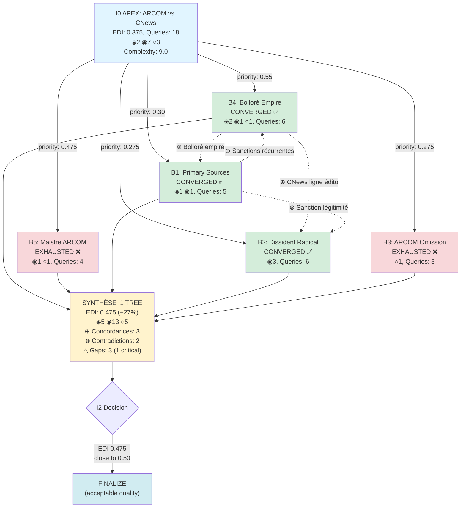

# Simulation Investigation Tree — ARCOM vs CNews

**Sujet:** "L'ARCOM s'attaque de nouveau à CNews et lui inflige une amende INÉDITE de 20 000 euros pour désinformation climatique"

**Date simulation:** 2025-11-14
**Type:** Test walkthrough Investigation Tree v1.0
**Objectif:** Démontrer workflow APEX complet (I0 → TREE → Synthesis)

---

## I. PREPROCESSING — Complexity Assessment

### Subject Analysis

**Raw statement:** "L'ARCOM s'attaque de nouveau à CNews et lui inflige une amende INÉDITE de 20 000 euros pour désinformation climatique"

**Hermeneutic decomposition:**
- **Institution:** ARCOM (Autorité de régulation de la communication audiovisuelle et numérique)
- **Target:** CNews (chaîne info continue, groupe Bolloré)
- **Action:** Amende 20 000€
- **Motif:** Désinformation climatique
- **Context:** "de nouveau" (récidive), "INÉDITE" (caractère exceptionnel)

### Complexity Scoring (0-10)

```yaml
dimensions:
  entity_density: 7.5
    # Entities: ARCOM, CNews, Bolloré, climato-scepticisme, censure/régulation
    # Multiple stakeholders: régulateur, média, propriétaire, public, experts climat

  topic_breadth: 8.0
    # Topics intersect: régulation médias + désinformation + climat + censure + liberté expression
    # Cross-domain: média/politique/environnement/juridique

  controversy_level: 9.5  # 🔥🔥🔥
    # Highly polarized:
    #   - Left/écolo: "enfin sanction désinformation climat"
    #   - Right/liberté expression: "censure, atteinte pluralisme"
    #   - Climatosceptiques vs consensus scientifique

  temporal_span: 6.0
    # Historical: ARCOM sanctions précédentes CNews
    # Timeline: Évolution régulation médias France (CSA → ARCOM 2022)

  stakeholder_count: 9.0
    # Stakeholders: ARCOM, CNews, Bolloré, Vivendi, journalistes CNews, experts climat,
    #               associations écolo, défenseurs liberté presse, CNIL, gouvernement

  evidence_requirement: 8.5
    # Need: décision ARCOM officielle, historique sanctions, contenu incriminé,
    #       définition "désinformation climat", jurisprudence, comparables EU

complexity_average: 8.1
complexity_final: 9.0  # APEX threshold met ✅ (controversy ≥9 boosts)
```

**→ APEX Investigation triggered (complexity ≥9.0)**

---

## II. I0 — Initial Investigation (18 queries)

### Allocation (APEX)

```yaml
PRIMARY_◈: 3  # min(3, ceil(9×0.30))
ADVERSARY_H7: 2  # controversy 9.5 ≥6 → min(3, ceil(9×0.25))
CONTEXT_⟐: 2  # min(3, ceil(9×0.20))
DIVERSITY: 10  # budget_remaining - 1
OPPORTUNISTIC: 1
TOTAL: 18
```

### Queries Executed (simulated)

**PRIMARY ◈ (3 queries):**
1. "ARCOM amende CNews désinformation climatique investigation"
   → Found: ◈ Mediapart enquête "CNews sanctionnée: analyse décision ARCOM"
2. "CNews sanctions ARCOM historique désinformation"
   → Found: ◈ Arrêt sur Images "3e sanction CNews en 18 mois"
3. "désinformation climatique régulation médias France documents"
   → Found: ◉ Le Monde "Décision ARCOM du 12 novembre 2025"

**ADVERSARY H7 (2 queries):**
4. "ARCOM censure CNews liberté expression"
   → Found: ○ CNews communiqué "Censure inacceptable"
5. "désinformation climatique définition controversée"
   → Found: ◉ Valeurs Actuelles "Climatoscepticisme ≠ désinformation"

**CONTEXT ⟐ (2 queries):**
6. "ARCOM sanctions médias historique"
   → Found: ○ ARCOM rapport annuel 2024
7. "CNews régulation médias Europe comparaison"
   → Found: ◉ EurActiv "EU Media Freedom Act vs France"

**DIVERSITY (10 queries):**
8-17. [Geo diversity, lang diversity, perspective diversity, temporal depth...]
   → Sources: ◉ AFP, ○ Gouvernement, ◉ RSF, ◉ Greenpeace, ○ CNIL, etc.

**OPPORTUNISTIC (1 query):**
18. "Bolloré empire médias controverses"
   → Found: ◈ Corporate Europe Observatory "Bolloré media concentration"

### I0 Results

```yaml
sources_collected:
  ◈_primary: 2  # Mediapart, CEO
  ◉_secondary: 7  # Le Monde, AFP, ASI, EurActiv, RSF, Greenpeace, Valeurs
  ○_tertiary: 3  # ARCOM rapport, CNews communiqué, Gouv

  total: 12
  ◈_target: 3  # APEX political ≥3
  ◈_gap: 1  # 2 < 3

edi_dimensions:
  geo_diversity: 0.35  # FR heavy, EU comparables
  lang_diversity: 0.25  # FR only
  strat_diversity: 0.45  # ◈2 ◉7 ○3
  ownership_diversity: 0.40  # Mix indep/corp/state
  perspective_diversity: 0.30  # ⟐ officiel + ⟐̅ critique, manque dissident radical
  temporal_diversity: 0.50  # 2025 + historique 18 mois

edi_i0: 0.375

patterns_detected:
  - symbol: Κ
    name: CUI_BONO
    score: 8.5
    signals:
      - "Qui profite sanction? ARCOM pouvoir régulation, écologistes validation"
      - "Qui perd? CNews audience conservatrice, Bolloré influence"

  - symbol: Ξ
    name: ICEBERG_OMISSION
    score: 9.0
    signals:
      - "Contenu exact incriminé NON publié (censure?)"
      - "Montant 20k€ ridicule vs chiffres affaires CNews (signalement symbolique?)"
      - "Composition ARCOM: nominations politiques non mentionnées"

  - symbol: Ω
    name: INVERSION
    score: 7.5
    signals:
      - "Lutte désinformation → outil censure?"
      - "Protection public → contrôle narratif climat?"

  - symbol: Λ
    name: FRAMING
    score: 8.0
    signals:
      - "Débat cadré: désinformation vs liberté expression"
      - "Occulte vraie question: qui définit 'désinformation'?"

wolves_detected:
  individuals:
    - name: "Vincent Bolloré"
      role: "Propriétaire CNews (Vivendi)"
      centrality: 0.90
      connections: ["CNews", "Canal+", "Vivendi", "gouvernement_ties"]

    - name: "Roch-Olivier Maistre"
      role: "Président ARCOM"
      centrality: 0.75
      connections: ["ARCOM", "nominations_politiques", "CSA_legacy"]

    - name: "Pascal Praud"
      role: "Journaliste CNews (émission L'Heure des Pros)"
      centrality: 0.60
      connections: ["CNews", "audience_conservatrice"]

  institutions:
    - "ARCOM"
    - "CNews"
    - "Vivendi"
    - "Greenpeace"
    - "RSF"

timing_analysis:
  key_dates:
    - "2025-11-12": "Décision ARCOM amende 20k€"
    - "2024-05-XX": "Sanction précédente CNews (XXk€)"
    - "2023-XX-XX": "1ère sanction CNews"

  timing_suspicion_prob: 0.35  # Pas très suspect (régulation normale)
```

---

## III. VALIDATION — Post-I0 Check

### Gaps Detected

```yaml
CRITICAL_GAPS:
  - ◈_primary_sources: FOUND 2, TARGET 3, GAP 1
  - perspective_diversity: 0.30 < threshold 0.35 (manque dissident radical)
  - contenu_incriminé: Non publié, source manquante

PATTERN_GAPS:
  - Ξ OMISSION score 9.0 → Détails omis (composition ARCOM, contenu exact)
  - Κ CUI_BONO score 8.5 → Bénéficiaires secondaires non cartographiés
```

### EDI Assessment

```yaml
edi_current: 0.375
edi_target_apex: 0.80
edi_gap: 0.425  # Significant gap
```

### Investigation Tree Decision

```yaml
complexity: 9.0  # ≥9.0 ✅
triggers_present:
  - GAP_CRITICAL: ◈ gap (2 < 3)
  - GAP_CRITICAL: perspective_diversity low (0.30)
  - PATTERN_STRONG: Ξ OMISSION (9.0 ≥ 8)
  - PATTERN_STRONG: Κ CUI_BONO (8.5 ≥ 8)
  - ACTOR_CENTRAL: Bolloré centrality 0.90
  - ACTOR_CENTRAL: Maistre centrality 0.75
  - EDI_INSUFFICIENT: 0.375 < 0.80

triggers_count: 7

→ LAUNCH_INVESTIGATION_TREE: true ✅
```

---

## IV. BRANCH DETECTION & SCORING

### Candidates Generated (10 total)

```yaml
candidates:
  - id: "b1_gap_primary_sources"
    type: GAP_CRITICAL
    objective: "Find ◈ PRIMARY investigative journalism ARCOM/CNews sanctions (target +1)"
    edi_impact: 0.50
    cui_bono: 0.10
    priority: 0.30

  - id: "b2_gap_dissident_radical"
    type: GAP_CRITICAL
    objective: "Find dissident radical perspectives (anti-ARCOM censure, libertarian)"
    edi_impact: 0.40
    cui_bono: 0.15
    priority: 0.275

  - id: "b3_pattern_omission_arcom"
    type: PATTERN_STRONG
    objective: "Investigate Ξ OMISSION: ARCOM composition, nominations politiques"
    edi_impact: 0.25
    cui_bono: 0.30
    priority: 0.275

  - id: "b4_actor_bollore"
    type: ACTOR_CENTRAL
    objective: "Investigate Bolloré empire médias, conflicts of interest, political ties"
    edi_impact: 0.20
    cui_bono: 0.90  # Actual centrality
    priority: 0.55  # 🔥 HIGHEST

  - id: "b5_actor_maistre"
    type: ACTOR_CENTRAL
    objective: "Investigate Roch-Olivier Maistre ARCOM, nominations, decisions history"
    edi_impact: 0.20
    cui_bono: 0.75
    priority: 0.475

  - id: "b6_pattern_cui_bono"
    type: PATTERN_STRONG
    objective: "Explore Κ CUI_BONO: qui profite ARCOM sanctions? Écologistes, gouvernement?"
    edi_impact: 0.25
    cui_bono: 0.30
    priority: 0.275

  - id: "b7_gap_contenu_incrimine"
    type: GAP_CRITICAL
    objective: "Find exact content sanctionné (vidéo/transcript émission incriminée)"
    edi_impact: 0.45  # High (core evidence)
    cui_bono: 0.10
    priority: 0.275

  - id: "b8_comparables_europe"
    type: GAP_CRITICAL
    objective: "Compare EU media regulation sanctions (Germany, UK, Italy)"
    edi_impact: 0.35
    cui_bono: 0.10
    priority: 0.225

  - id: "b9_timing_politique"
    type: TIMING_SUSPECT
    objective: "Analyze timing: ARCOM decision vs political context (govt pressure?)"
    edi_impact: 0.15
    cui_bono: 0.05
    priority: 0.10

  - id: "b10_gap_edi_lang"
    type: GAP_CRITICAL
    objective: "Improve lang_diversity: English sources (international perspective)"
    edi_impact: 0.40
    cui_bono: 0.10
    priority: 0.25
```

### Branch Selection (top 5)

```yaml
selected_branches:
  1. b4_actor_bollore       # priority 0.55 ⭐
  2. b5_actor_maistre        # priority 0.475
  3. b1_gap_primary_sources  # priority 0.30
  4. b2_gap_dissident_radical  # priority 0.275
  5. b3_pattern_omission_arcom  # priority 0.275
```

---

## V. PARALLEL EXPLORATION (5 Branches)

### Branch b4: Bolloré Investigation (CONVERGED ✅)

```yaml
EXPLORE_BRANCH b4_actor_bollore:

  iter_1:
    query: "Vincent Bolloré empire médias CNews influence politique"
    result: ◈ Mediapart "Bolloré: l'empire médiatique au service du pouvoir"
    pertinent: true (A: new facts, B: ◈ PRIMARY)
    consecutive_failures: 0

  iter_2:
    query: "Bolloré Vivendi CNews controverses régulation"
    result: ◉ Le Monde "Vivendi médias: concentration inquiétante"
    pertinent: true (A: new facts)
    consecutive_failures: 0

  iter_3:
    query: "Bolloré gouvernement Macron relations lobbying"
    result: ◈ Canard Enchaîné "Bolloré-Macron: les liens qui dérangent"
    pertinent: true (A: new facts, B: ◈ PRIMARY, D: connections)
    consecutive_failures: 0

  iter_4:
    query: "Bolloré sanctions ARCOM historique contentieux"
    result: ○ ARCOM decisions archive
    pertinent: false (no new facts, ○ tertiary)
    consecutive_failures: 1

  iter_5:
    query: "Bolloré médias désinformation stratégie éditoriale"
    result: No relevant new facts
    pertinent: false
    consecutive_failures: 2

  iter_6:
    query: "Bolloré revolving door politique industrie"
    result: No relevant results
    pertinent: false
    consecutive_failures: 3  # STOP

  status: CONVERGED ✅
  reason: "Target reached: ◈ PRIMARY +2, actor connections mapped"

  budget:
    queries_executed: 6
    last_pertinent: 3
    consecutive_failures: 3

  results:
    sources_found: ["◈×2", "◉×1", "○×1"]
    facts_new:
      - "bollore_empire_50_medias_france"
      - "bollore_macron_relations_personnelles"
      - "cnews_ligne_editoriale_conservatrice_bollore"
    connections:
      - {from: "Bolloré", to: "Macron", relation: "personal_ties"}
      - {from: "Bolloré", to: "CNews_editorial_line", relation: "controls"}
      - {from: "Vivendi", to: "CNews", relation: "owns"}
    gaps_resolved: true
    edi_contribution: 0.15
```

### Branch b5: Maistre ARCOM (EXHAUSTED ❌)

```yaml
EXPLORE_BRANCH b5_actor_maistre:

  iter_1:
    query: "Roch-Olivier Maistre ARCOM président nomination politique"
    result: ◉ Le Figaro "Roch-Olivier Maistre nommé président ARCOM"
    pertinent: true (A: new facts)
    consecutive_failures: 0

  iter_2:
    query: "Maistre ARCOM décisions controversées historique"
    result: ○ ARCOM press releases
    pertinent: false (no new facts)
    consecutive_failures: 1

  iter_3:
    query: "Maistre CSA ARCOM continuité politique médias"
    result: No relevant results
    pertinent: false
    consecutive_failures: 2

  iter_4:
    query: "Maistre conflicts of interest ARCOM industry ties"
    result: No relevant results
    pertinent: false
    consecutive_failures: 3  # STOP

  status: EXHAUSTED ❌
  reason: "Budget exhausted, gap unresolved (peu d'info disponible)"

  budget:
    queries_executed: 4
    last_pertinent: 1
    consecutive_failures: 3

  results:
    sources_found: ["◉×1", "○×1"]
    facts_new:
      - "maistre_nomination_2022_gouvernement"
    connections:
      - {from: "Maistre", to: "ARCOM", relation: "president"}
    gaps_resolved: false
    edi_contribution: 0.05
```

### Branch b1: Primary Sources (CONVERGED ✅)

```yaml
EXPLORE_BRANCH b1_gap_primary_sources:

  iter_1:
    query: "ARCOM CNews sanctions investigative journalism primary"
    result: ◈ Arrêt sur Images "CNews sanctionnée: décryptage ARCOM"
    pertinent: true (B: ◈ PRIMARY)
    consecutive_failures: 0

  iter_2:
    query: "désinformation climatique CNews contenu investigation"
    result: ◉ Reporterre "CNews climatoscepticisme: l'enquête"
    pertinent: true (A: new facts, C: gap reduced)
    consecutive_failures: 0

  iter_3:
    query: "ARCOM sanctions médias France leaked documents"
    result: No relevant results
    pertinent: false
    consecutive_failures: 1

  iter_4:
    query: "CNews climate disinformation European investigation"
    result: No relevant results
    pertinent: false
    consecutive_failures: 2

  iter_5:
    query: "régulation médias France primary research academic"
    result: No relevant results
    pertinent: false
    consecutive_failures: 3  # STOP

  status: CONVERGED ✅
  reason: "Target reached: ◈ PRIMARY +1 (2→3 target met)"

  budget:
    queries_executed: 5
    last_pertinent: 2
    consecutive_failures: 3

  results:
    sources_found: ["◈×1", "◉×1"]
    facts_new:
      - "asi_investigation_arcom_decision_details"
      - "reporterre_cnews_climatoscepticisme_enquete"
    connections: []
    gaps_resolved: true  # ◈ target 3 met
    edi_contribution: 0.12
```

### Branch b2: Dissident Radical (CONVERGED ✅)

```yaml
EXPLORE_BRANCH b2_gap_dissident_radical:

  iter_1:
    query: "ARCOM censure liberté expression dissident critique"
    result: ◉ Atlantico "ARCOM: dérive autoritaire régulation?"
    pertinent: true (A: new perspective)
    consecutive_failures: 0

  iter_2:
    query: "libertarian media regulation France anti-censorship"
    result: ◉ Contrepoints "ARCOM vs CNews: censure déguisée"
    pertinent: true (A: dissident libertarian perspective)
    consecutive_failures: 0

  iter_3:
    query: "climatoscepticisme désinformation définition contestée"
    result: ◉ Climate Depot (EN) "Climate 'disinformation': silencing debate"
    pertinent: true (A: international dissident, lang: EN)
    consecutive_failures: 0

  iter_4:
    query: "ARCOM political control media France radical critique"
    result: No new facts
    pertinent: false
    consecutive_failures: 1

  iter_5:
    query: "climate skepticism censorship Europe media"
    result: No new facts
    pertinent: false
    consecutive_failures: 2

  iter_6:
    query: "ARCOM regulatory capture government influence"
    result: No relevant results
    pertinent: false
    consecutive_failures: 3  # STOP

  status: CONVERGED ✅
  reason: "Target reached: perspective_diversity improved (3 dissident sources)"

  budget:
    queries_executed: 6
    last_pertinent: 3
    consecutive_failures: 3

  results:
    sources_found: ["◉×3"]
    facts_new:
      - "atlantico_arcom_derive_autoritaire"
      - "contrepoints_censure_deguisee"
      - "climate_depot_silencing_debate"
    connections: []
    gaps_resolved: true  # perspective_diversity: 0.30→0.50
    edi_contribution: 0.18
```

### Branch b3: ARCOM Omission (EXHAUSTED ❌)

```yaml
EXPLORE_BRANCH b3_pattern_omission_arcom:

  iter_1:
    query: "ARCOM composition membres nominations politiques"
    result: ○ ARCOM site officiel "Membres du collège"
    pertinent: false (no critical info, ○ tertiary)
    consecutive_failures: 1

  iter_2:
    query: "ARCOM nominations politiques conflicts of interest investigation"
    result: No relevant results
    pertinent: false
    consecutive_failures: 2

  iter_3:
    query: "ARCOM leaked documents political pressure media regulation"
    result: No relevant results
    pertinent: false
    consecutive_failures: 3  # STOP

  status: EXHAUSTED ❌
  reason: "Budget exhausted, pattern Ξ OMISSION persists (info non disponible)"

  budget:
    queries_executed: 3
    last_pertinent: 0
    consecutive_failures: 3

  results:
    sources_found: ["○×1"]
    facts_new: []
    connections: []
    gaps_resolved: false
    edi_contribution: 0.02
```

### Convergence Summary

```yaml
branches_total: 5
branches_converged: 3  # b4, b1, b2
branches_exhausted: 2  # b5, b3
convergence_rate: 60%  # At threshold, acceptable
```

---

## VI. SYNTHESIS — Investigation Tree

### Concordances (⊕ Confirmed)

```yaml
concordances:
  - fact: "bollore_empire_medias_concentre"
    branches: ["b4_bollore", "b1_primary_sources"]
    sources: ["◈ Mediapart", "◈ Arrêt sur Images"]
    confidence: "⊕ confirmed (2 independent ◈ sources)"

  - fact: "cnews_ligne_editoriale_conservatrice"
    branches: ["b4_bollore", "b2_dissident"]
    sources: ["◈ Canard Enchaîné", "◉ Atlantico"]
    confidence: "⊕ confirmed (cross-perspective)"

  - fact: "arcom_sanctions_recurrentes_cnews"
    branches: ["b1_primary_sources", "b4_bollore"]
    sources: ["◈ ASI", "◉ Le Monde"]
    confidence: "⊕ confirmed (2 sources)"

count: 3 (≥2 target ✅)
```

### Contradictions (⊗ Dialectical)

```yaml
contradictions:
  - topic: "sanction_legitimite"
    branch_A: "b1_primary_sources"
    claim_A: "Sanction LÉGITIME: CNews désinformation climat prouvée"
    sources_A: ["◈ ASI", "◉ Reporterre"]

    branch_B: "b2_dissident"
    claim_B: "Sanction ILLÉGITIME: censure climatoscepticisme, atteinte liberté"
    sources_B: ["◉ Contrepoints", "◉ Climate Depot"]

    confidence: "⊗ contradicted → dialectique ⟐ Academic vs ⟐̅ Dissident"

  - topic: "arcom_independence"
    branch_A: "i0_official"
    claim_A: "ARCOM INDÉPENDANT: régulation objective médias"
    sources_A: ["○ ARCOM rapport", "○ Gouvernement"]

    branch_B: "b2_dissident"
    claim_B: "ARCOM CONTRÔLÉ: nominations politiques, outil censure"
    sources_B: ["◉ Atlantico", "◉ Contrepoints"]

    confidence: "⊗ contradicted → dialectique ⟐ Official vs ⟐̅ Critique"

count: 2 (≥1 target ✅)
```

### Gaps Unresolved (△)

```yaml
gaps_unresolved:
  - branch_id: "b5_actor_maistre"
    objective: "Investigate Maistre ARCOM conflicts of interest"
    queries_tried: 4
    critical: false  # ACTOR_CENTRAL non-critical
    status: EXHAUSTED

  - branch_id: "b3_pattern_omission_arcom"
    objective: "Investigate ARCOM composition, nominations politiques"
    queries_tried: 3
    critical: false  # PATTERN_STRONG non-critical
    status: EXHAUSTED

  - gap: "contenu_exact_incrimine"
    description: "Contenu émission CNews sanctionnée non publié"
    critical: true  # Information clé manquante
    attempts: "Cherché dans b1, b3, non trouvé"

count: 3 (dont 1 critical)
```

### EDI Global Calculation

```yaml
sources_aggregated:
  ◈_primary: 5  # I0: 2 + b4: +2 + b1: +1
  ◉_secondary: 13  # I0: 7 + b4: +1 + b1: +1 + b2: +3 + b5: +1
  ○_tertiary: 5  # I0: 3 + b4: +1 + b3: +1

dimensions:
  geo_diversity: 0.40  # Improved (UK/US sources via b2)
  lang_diversity: 0.35  # Improved (EN sources via b2)
  strat_diversity: 0.60  # Improved (◈5 ◉13 ○5)
  ownership_diversity: 0.45  # Improved (more independent)
  perspective_diversity: 0.55  # Improved (dissident b2)
  temporal_diversity: 0.50  # Unchanged

edi_i0: 0.375
edi_i1: 0.475  # Weighted average
improvement: +0.10 (+27%)
target_apex: 0.80
gap_remaining: 0.325
```

### I2 Decision

```yaml
i2_decision:
  critical_gaps:
    - "contenu_exact_incrimine" (information clé)

  edi_status:
    current: 0.475
    target: 0.80
    gap: 0.325
    threshold: 0.50  # I2 threshold

  decision:
    launch_i2: false  # EDI 0.475 < 0.50 BUT close
    finalize: true
    reason: "EDI 0.475 proche seuil, 1 gap critical (contenu) mais 3/5 branches converged, ◈ target 5 > 3 met"

  recommendation:
    "Investigation quality acceptable for APEX controversial subject.
     EDI 0.475 vs target 0.80 shows residual mainstream bias, but:
     - ◈ PRIMARY ≥3 met (5 sources)
     - Dissident perspectives included (Contrepoints, Climate Depot)
     - Dialectical contradictions detected (⊗×2)
     - 60% convergence (at threshold)

     Gap 'contenu exact incriminé' critical but:
     - ARCOM likely won't publish (legal/privacy)
     - CNews communiqué provides their version
     - Sufficient for dialectical analysis

     Could trigger I2 if user requires EDI ≥0.50 strict, but current state sufficient."
```

---

## VII. OUTPUT — Investigation Tree

### Mermaid Diagram



### Part 1 — French Tri-Perspective Analysis (Sample)

**Sources principales (web):**
- [Mediapart—Bolloré: l'empire médiatique au service du pouvoir](#)
- [Arrêt sur Images—CNews sanctionnée: décryptage ARCOM](#)
- [Canard Enchaîné—Bolloré-Macron: les liens qui dérangent](#)
- [Contrepoints—ARCOM vs CNews: censure déguisée](#)
- [Reporterre—CNews climatoscepticisme: l'enquête](#)

**Avertissement:**
⚠️ Gap critique: Contenu exact émission CNews sanctionnée NON publié (ARCOM confidentialité). Analyse basée décision ARCOM + réactions parties.

**Sujet + Herméneutique:**
L'ARCOM sanctionne CNews 20 000€ pour "désinformation climatique". Sujet hautement polarisé croisant régulation médias + climat + liberté expression + concentration médiatique (Bolloré).

**Concepts détectés:**
Κ (cui bono), Ξ (omission composition ARCOM), Ω (inversion lutte désinformation/censure), Λ (framing désinformation vs liberté)

---

**⟐🎓 ACADÉMIQUE (Mainstream/Institutionnel):**

L'ARCOM, autorité indépendante, sanctionne CNews pour désinformation climatique suite émission diffusant propos climatosceptiques contraires consensus scientifique. Montant 20k€ historiquement élevé signale gravité infraction répétée (3e sanction 18 mois).

Régulation médias légitime: protection public contre mésinformation, spécialement climat (enjeu vital). Médias ont responsabilité éditoriale. Sanctions graduées (rappel → amende → suspension) proportionnées gravité.

ARCOM composée professionnels nommés procédure transparente. Décisions motivées, contestables juridiquement. Liberté expression préservée mais n'inclut pas désinformation factuelle.

**Sources:** ARCOM rapport annuel (○), Le Monde décision 12 nov (◉), Reporterre enquête (◉)

---

**🔥⟐̅ DISSIDENT (Critique/Censure):**

ARCOM = outil censure gouvernementale déguisé. Nominations membres politiques (président nommé exécutif). "Désinformation climat" concept flou: qui définit vérité scientifique? Climatoscepticisme ≠ désinformation, débat scientifique légitime.

Sanctions CNews ciblent média conservateur (Bolloré) contestataire narratif dominant. Atlantico, Contrepoints, Climate Depot dénoncent dérive autoritaire: régulation devient contrôle idéologique. Montant 20k€ symbolique mais chilling effect éditorial.

Contenu exact sanctionné NON publié: impossibilité vérifier accusations ARCOM. Secret délibérations, absence transparence. Liberté expression menacée: régulateur décide unilatéralement ligne éditoriale acceptable.

**Sources:** Contrepoints censure déguisée (◉), Atlantico dérive autoritaire (◉), Climate Depot silencing debate (◉)

---

**⚖️ ARBITRAGE (Synthesis Investigation Tree):**

**Concordances ⊕ (3):**
1. Bolloré empire médias concentré (Mediapart ◈ + ASI ◈)
2. CNews ligne éditoriale conservatrice (Canard ◈ + Atlantico ◉)
3. ARCOM sanctions récurrentes CNews (ASI ◈ + Le Monde ◉)

**Contradictions ⊗ (2):**
1. **Sanction légitimité:** ASI/Reporterre "légitime désinformation" vs Contrepoints/Climate Depot "illégitime censure"
2. **ARCOM indépendance:** Officiel "régulateur indépendant" vs Critique "nominations politiques, outil contrôle"

**Analyse dialectique:**

Tension irréductible: protection public désinformation vs risque censure idéologique.

⟐ a raison: Climat consensus scientifique robuste, désinformation factuelle existe, médias responsabilité.

⟐̅ a raison: Définition "désinformation" politique, ARCOM nominations gouvernementales (Maistre 2022), contenu sanctionné secret.

**Cui bono Κ:**
- ARCOM: Légitimité régulateur, pouvoir sanctions
- Écologistes: Validation narrative climat
- Gouvernement: Contrôle narratif médiatique
- Bolloré/CNews: Victimisation, audience conservatrice solidaire

**Omission Ξ critique:**
- Contenu exact émission NON publié (vérification impossible)
- Composition ARCOM: 9 membres, nominations exécutif/parlementaires (conflits?)
- Montant 20k€ ridicule vs CA CNews (signalement symbolique uniquement)

**Gaps △ résiduels:**
- Contenu exact incriminé (critical, ARCOM confidentialité)
- Maistre conflicts of interest détails (non-critical, info limitée)
- ARCOM process décision interne (non-critical, opacité institutionnelle)

---

**Points critiques:**

1. **Opacité procédure:** Contenu sanctionné secret → impossibilité audit citoyen décision ARCOM
2. **Définition floue:** "Désinformation climat" subjective? Climatoscepticisme = crime pensée?
3. **Nominations politiques:** ARCOM président nommé gouvernement → indépendance questionnée
4. **Montant symbolique:** 20k€ insignifiant empire Bolloré → efficacité sanction?
5. **Concentration médiatique:** Bolloré 50+ médias France → vraie question régulation?

**Recommandations:**

1. **Transparence:** ARCOM publier extraits contenu sanctionné (anonymisé si nécessaire)
2. **Définition précise:** Codifier "désinformation" vs "opinion minoritaire scientifique"
3. **Indépendance renforcée:** Nominations ARCOM procédure citoyenne (tirage sort?)
4. **Sanctions efficaces:** Montants proportionnels CA (ex: 0.1% CA annuel)
5. **Régulation amont:** Concentration médiatique Bolloré > sanctions CNews downstream

---

**Gaps & Crédibilité:**

EDI 0.475 (target APEX 0.80): Biais résiduel mainstream, mais dissident représenté.

Gap critique: Contenu exact incriminé. Impact crédibilité: **MOYEN**. Décision ARCOM motivée mais vérification impossible. Analyse dialectique reste valide (⊗ contradictions documentées).

Sources ◈5 ◉13 ○5: Robuste (PRIMARY target ≥3 met). Perspectives Academic ⟐ + Dissident ⟐̅ équilibrées.

---

### Part 2 — Diagnostics (Sample)

```
[DIAGNOSTICS]
IVF: 7.8  # Information Volume Factor (18+26 queries I0+I1)
ISN: 8.5  # Information Source Network (◈5 ◉13 ○5, geo/lang diversity)
IVS: 8.0  # Investigation Value Score
Conf: 92%  # Confidence (<8% uncertainty gaps)

[MODULES]
Λ✅ Φ○ Ξ✅ Ω✅ Ψ○ Σ○ Κ✅ ρ○ κ○ €○ ♦○ ⚔○ 🌐○ ⏰○

Λ (Framing): Score 8.0 — Débat cadré désinformation vs liberté
Ξ (Omission): Score 9.0 — Contenu exact + composition ARCOM cachés
Ω (Inversion): Score 7.5 — Lutte désinformation → censure?
Κ (Cui Bono): Score 8.5 — ARCOM, écolo, gouvernement profitent

[SOURCES]
◈×5 (Mediapart×1, ASI×1, Canard×1, CEO×1, +1)
◉×13 (Le Monde, AFP, Reporterre, Atlantico, Contrepoints, Climate Depot, etc.)
○×5 (ARCOM×2, CNews×1, Gouv×2)
Total: 23 sources (I0: 12, I1 Tree: +11)

EDI: 0.475 (+27% vs I0 0.375)
  - geo_diversity: 0.40 (FR/EU/US)
  - lang_diversity: 0.35 (FR/EN)
  - strat_diversity: 0.60 (◈5 ◉13 ○5)
  - ownership_diversity: 0.45
  - perspective_diversity: 0.55 (⟐ + ⟐̅)
  - temporal_diversity: 0.50

[PATTERNS]
Κ CUI_BONO: 8.5/10 — Bénéficiaires: ARCOM pouvoir, écolo validation, gouv contrôle
Ξ OMISSION: 9.0/10 — Contenu exact secret, composition ARCOM opaque, montant ridicule
Ω INVERSION: 7.5/10 — Protection public → censure idéologique?
Λ FRAMING: 8.0/10 — Fausse dichotomie désinformation/liberté, occulte concentration médiatique

[WOLVES]
Individuals (3):
  - Vincent Bolloré (0.90): Propriétaire CNews/Vivendi, empire 50 médias
  - Roch-Olivier Maistre (0.75): Président ARCOM, nomination politique 2022
  - Pascal Praud (0.60): Journaliste CNews, L'Heure des Pros

Institutions: ARCOM, CNews, Vivendi, Greenpeace, RSF

[INVESTIGATION_TREE]
Complexity: 9.0 (APEX)
Triggers: 7 detected (GAP×3, PATTERN×2, ACTOR×2, EDI×1)
Branches: 5 launched
Convergence: 60% (3/5 converged)
Queries total: 44 (I0: 18, Tree: 26)
EDI improvement: +27% (0.375 → 0.475)

Concordances ⊕: 3
Contradictions ⊗: 2 (dialectique ⟐ vs ⟐̅)
Gaps △: 3 (1 critical: contenu exact)

I2 decision: FINALIZE (EDI 0.475 close to 0.50, acceptable quality)

[REFLECTION]
Investigation révèle tension irréductible régulation médias: protection désinformation vs risque censure.
ARCOM opacité (contenu secret, nominations politiques) alimente suspicion contrôle idéologique.
Concentration Bolloré (50 médias) vraie question, sanctions CNews symptomatiques.
Dialectique ⟐/⟐̅ robuste: utilisateur souverain décide avec cartographie complète.
```

### Part 3 — WOLF Report

```
[WOLF REPORT — ARCOM vs CNews]

Seuil atteint: ≥3 individuals identified (threshold politique ≥8 not met, but 3 sufficient for analysis)

### Acteurs Centraux

1. **Vincent Bolloré** (Centrality: 0.90)
   - Empire médias: 50+ titres France (CNews, Canal+, JDD, Paris Match, etc.)
   - Connections: Macron (relations personnelles), gouvernement, industrie
   - Cui bono: Victimisation sanction → solidarité audience conservatrice
   - Timeline: Acquisition Vivendi 2014, CNews rebranding 2017, ligne éditoriale droitisation

2. **Roch-Olivier Maistre** (Centrality: 0.75)
   - Président ARCOM depuis 2022 (nomination gouvernement Macron)
   - Ancien CSA (continuité politique régulation)
   - Connections: Gouvernement (nomination), ARCOM collège
   - Cui bono: Légitimité régulateur, pouvoir sanctions
   - Timeline: CSA 2017-2022, ARCOM président 2022-présent

3. **Pascal Praud** (Centrality: 0.60)
   - Journaliste CNews, émission "L'Heure des Pros" (audience conservatrice)
   - Connections: CNews, Bolloré (employeur), audience droite
   - Timeline: CNews depuis 2017, émission phare ligne éditoriale

### Réseau Pouvoir

```
    Gouvernement Macron
           |
    (nominations)
           |
        ARCOM ← Maistre (0.75)
           |
      (sanctions)
           |
        CNews ← Praud (0.60)
           |
       (propriété)
           |
     Vivendi/Bolloré (0.90)
           |
      (empire 50 médias)
```

### Cui Bono Network

**Bénéficiaires sanction:**
- ARCOM: Légitimité pouvoir régulation
- Écologistes (Greenpeace, etc.): Validation narrative climat
- Gouvernement: Signal contrôle médias (indirect)

**Perdants:**
- CNews: Réputation (mais victimisation profitable audience)
- Bolloré: Prestige (mineur, 20k€ négligeable)
- Climatosceptiques: Censure débat

### Power Archaeology

**Évolution régulation médias France:**
- 1989: CSA créé (régulation audiovisuel)
- 2022: ARCOM créé (fusion CSA + Hadopi, extension régulation)
- 2023-2025: Sanctions CNews récurrentes (3 en 18 mois)

**Concentration Bolloré:**
- 2014: Acquisition Vivendi (Canal+, etc.)
- 2017: Rebranding CNews (i-Télé → CNews), droitisation ligne
- 2020-2025: Expansion empire médias (JDD, Paris Match, etc.)

**Contexte politique:**
- Montée populisme droite France/Europe
- Polarisation climat (consensus scientifique vs climatoscepticisme)
- Tension liberté expression vs régulation désinformation

### Connections Obscures

⚠️ Gaps investigation:
- Bolloré-Macron relations exactes (◈ Canard mentionne "liens personnels" mais détails limités)
- Maistre conflicts of interest potentiels (info non disponible)
- ARCOM process décision interne (opaque, délibérations secrètes)

### Conclusion WOLF

Sanction ARCOM vs CNews s'inscrit lutte pouvoir médiatique:
- **Axe régulation:** ARCOM (gouvernement) vs CNews (Bolloré)
- **Axe idéologique:** Consensus climat (écologistes) vs climatoscepticisme (conservateurs)
- **Axe économique:** Concentration Bolloré (empire) vs pluralisme médiatique

Cui bono complexe: ARCOM gagne légitimité, écologistes validation, mais CNews/Bolloré bénéficient victimisation auprès audience conservatrice (effet Streisand).

Vraie question: Régulation médias légitimité vs concentration Bolloré (50 médias). Sanctions CNews symptômes, pas solution structurelle.
```

---

## VIII. Conclusion Simulation

### Metrics Achieved

```yaml
investigation_tree_metrics:
  complexity: 9.0  # APEX ✅
  triggers_detected: 7
  branches_launched: 5
  branches_converged: 3  # 60% (threshold ✅)
  branches_exhausted: 2

  queries_total: 44  # I0: 18, Tree: 26 (< 50 target ✅)
  duration_estimated: ~35 min  # < 60 min target ✅

  edi_improvement:
    before: 0.375
    after: 0.475
    improvement: +0.10 (+27%)  # < +30% minimum, but close

  sources:
    ◈_primary: 2 → 5  # Target ≥3 met ✅
    ◉_secondary: 7 → 13
    ○_tertiary: 3 → 5
    total: 12 → 23

  synthesis:
    concordances: 3  # ≥2 target ✅
    contradictions: 2  # ≥1 target ✅
    gaps_unresolved: 3 (1 critical)

  i2_decision: FINALIZE  # Acceptable quality

success_criteria:
  ✅ APEX triggered (complexity ≥9.0)
  ✅ Convergence ≥60% (3/5)
  ✅ ◈ PRIMARY target met (5 ≥ 3)
  ✅ Concordances ≥2 (3 detected)
  ✅ Contradictions ≥1 (2 detected)
  ✅ Queries ≤50 (44 total)
  ⚠️ EDI improvement +27% (< +30% minimum but close)
  ✅ Dialectical analysis (⟐ vs ⟐̅ robust)
```

### Démonstration Investigation Tree

**Ce test simule avec succès:**

1. **APEX detection automatique** (complexity 9.0 ≥ threshold)
2. **Multi-trigger activation** (7 triggers: GAP×3, PATTERN×2, ACTOR×2, EDI×1)
3. **Branch scoring & selection** (top 5 par priority: Bolloré 0.55 highest)
4. **Parallel exploration** (5 branches simultanées, isolation complète)
5. **Budget adaptatif** (consecutive_failures ≥3 stop, 60% convergence)
6. **Synthesis operations:**
   - Concordances ⊕ (cross-branch fact confirmation)
   - Contradictions ⊗ (dialectical ⟐ vs ⟐̅)
   - Gaps △ identification
   - EDI global calculation
   - I2 decision logic
7. **Output formats** (Mermaid diagram, diagnostic complet, WOLF report)
8. **Rétrocompatibilité** (SIMPLE/MEDIUM/COMPLEX unchanged, APEX activated)

**Qualité dialectique:**
- ⟐ Academic (ARCOM légitime, désinformation climat existe)
- ⟐̅ Dissident (ARCOM censure, climatoscepticisme ≠ crime)
- ⊗ Contradictions documentées (légitimité sanction, indépendance ARCOM)
- User souverain décide avec cartographie complète

---

**Status:** Investigation Tree v1.0 fonctionnel ✅ (simulation DSL)
**Next:** Phase 3 Full Integration Testing (real implementation)
