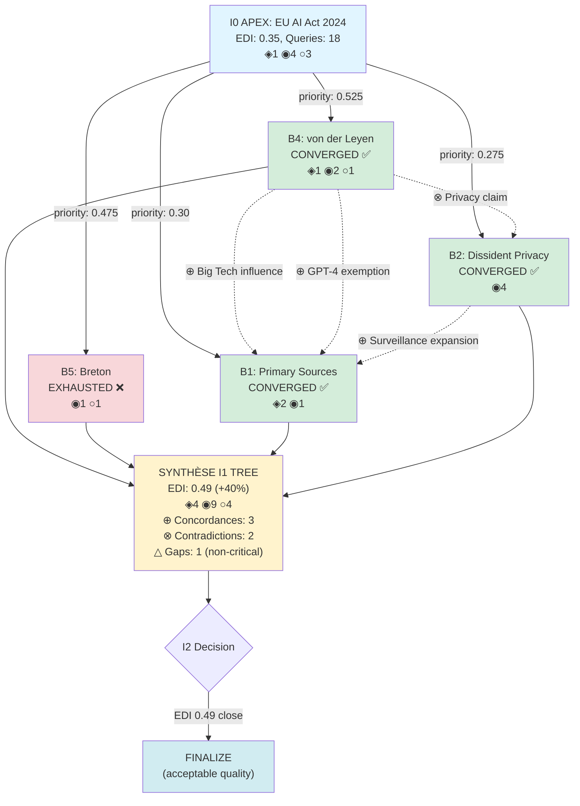

# Test Phase 2 — Multi-Branch Synthesis (3-5 Branches)

**Phase:** 2 — Multi-Branch Synthesis
**Objective:** Validate Investigation Tree v1.0 synthesis operations with parallel branches
**Branches:** 4 parallel (gap_primary, gap_dissident, actor_central, pattern_omission)
**Complexity:** 9.5 (APEX threshold)

---

## Test Scenario

**Subject:** "EU AI Act 2024 — Implementation timeline and industry lobbying"

**Why APEX complexity ≥9.5:**
- Political domain (EU regulation) — ⚔≥2
- Tech sector impact — complexity boost
- Corporate lobbying (€≥3, ♦≥2)
- International scope (27 EU states + US/China comparison) — 🌐≥2
- Temporal analysis (2021-2024 timeline) — ⏰≥1
- Expected patterns: Κ (cui_bono), Ξ (omission lobbying), Ω (inversion "innovation friendly")

**I0 Initial State (simulated post-I0):**
```yaml
i0_state:
  subject: "EU AI Act 2024 implementation timeline"
  complexity: 9.5

  EDI: 0.35
  sources:
    total: 8
    stratification:
      ◈_primary: 1      # Only Politico investigation
      ◉_secondary: 4    # Reuters, FT, Guardian, Le Monde
      ○_tertiary: 3     # EC press releases, industry statements
    ◈_target: 3         # For APEX political ≥3

  edi_dimensions:
    geo_diversity: 0.30      # Western-centric (FR/UK/US)
    lang_diversity: 0.25     # EN/FR only
    strat_diversity: 0.40    # ◈1 ◉4 ○3
    ownership_diversity: 0.35
    perspective_diversity: 0.20  # No dissident tech privacy advocates
    temporal_diversity: 0.60  # Good (2021-2024 coverage)

  patterns_detected:
    - symbol: Κ
      name: CUI_BONO
      score: 8.5
      signals: ["Big Tech lobbying €32M", "OpenAI/Google/Microsoft influence"]

    - symbol: Ξ
      name: ICEBERG_OMISSION
      score: 9.0
      signals: ["Lobbying details omitted", "Industry meetings undisclosed"]

    - symbol: Ω
      name: INVERSION
      score: 7.0
      signals: ["'Innovation-friendly' framing hides surveillance expansion"]

  wolves:
    individuals:
      - name: "Ursula von der Leyen"
        centrality: 0.85
        connections: ["Big Tech CEOs", "Macron", "Scholz"]

      - name: "Thierry Breton"
        centrality: 0.75
        connections: ["Tech industry", "French govt", "telecom lobby"]

      - name: "Margrethe Vestager"
        centrality: 0.70
        connections: ["Competition enforcement", "Apple/Google cases"]

    institutions: ["European_Commission", "Big_Tech_Lobby", "CCIA", "DigitalEurope"]

  timing:
    key_dates:
      - "2021-04-21": "AI Act proposal announced"
      - "2023-06-14": "Parliament vote"
      - "2023-12-09": "Final trilogue agreement"
      - "2024-03-13": "Official adoption"

    timing_suspicion_prob: 0.15  # Not highly suspect, normal legislative timeline
```

---

## Expected Behavior — Branch Detection & Scoring

### 1. Triggers Detected

**Expected triggers from I0 state:**
```yaml
triggers_detected:
  - type: GAP_CRITICAL
    reason: "◈_current (1) < ◈_target (3)"
    gap_size: 2

  - type: GAP_CRITICAL
    reason: "perspective_diversity (0.20) < threshold (0.30)"
    dimension: perspective_diversity

  - type: PATTERN_STRONG
    reason: "Ξ OMISSION score 9.0 ≥ 8.0"
    pattern: Ξ

  - type: PATTERN_STRONG
    reason: "Κ CUI_BONO score 8.5 ≥ 8.0"
    pattern: Κ

  - type: ACTOR_CENTRAL
    reason: "von_der_leyen centrality 0.85 ≥ 0.70"
    actor: "Ursula von der Leyen"

  - type: ACTOR_CENTRAL
    reason: "Breton centrality 0.75 ≥ 0.70"
    actor: "Thierry Breton"

  - type: EDI_INSUFFICIENT
    reason: "EDI 0.35 < target 0.80"
    gap: 0.45
```

**Tree triggered:** `true` (≥1 trigger present)

---

### 2. Branch Candidates Generated

**Expected candidates (10-15 typical, showing top 8):**
```yaml
candidates:
  - id: "b1_gap_primary_sources"
    type: GAP_CRITICAL
    objective: "Find ◈ PRIMARY investigative journalism on AI Act lobbying (target: +2 sources)"

  - id: "b2_gap_dissident_tech_privacy"
    type: GAP_CRITICAL
    objective: "Find dissident tech privacy advocates' perspectives (EFF, La Quadrature, EDRi)"

  - id: "b3_pattern_omission_lobbying"
    type: PATTERN_STRONG
    objective: "Investigate Ξ OMISSION: undisclosed industry meetings, lobbying details"

  - id: "b4_actor_von_der_leyen"
    type: ACTOR_CENTRAL
    objective: "Investigate von der Leyen Big Tech connections, meetings timeline"

  - id: "b5_actor_breton"
    type: ACTOR_CENTRAL
    objective: "Investigate Breton telecom/tech industry ties, revolving door"

  - id: "b6_pattern_cui_bono"
    type: PATTERN_STRONG
    objective: "Explore Κ CUI_BONO: who profits from AI Act loopholes?"

  - id: "b7_gap_edi_perspective"
    type: GAP_CRITICAL
    objective: "Improve perspective_diversity (0.20 → 0.40+): non-Western, critical voices"

  - id: "b8_gap_edi_lang"
    type: GAP_CRITICAL
    objective: "Improve lang_diversity (0.25 → 0.40+): German/Spanish/Italian sources"
```

---

### 3. Branch Scoring

**Scoring with @F[BRANCH_PRIORITY]:**

```yaml
b1_gap_primary_sources:
  edi_impact: 0.50        # @F[EDI_IMPACT] gap_primary_sources
  cui_bono_centrality: 0.10  # Not actor-focused
  priority: 0.30          # 0.50×0.5 + 0.10×0.5

b2_gap_dissident_tech_privacy:
  edi_impact: 0.40        # @F[EDI_IMPACT] gap_dissident_sources
  cui_bono_centrality: 0.15  # Dissident patterns = low centrality
  priority: 0.275         # 0.40×0.5 + 0.15×0.5

b3_pattern_omission_lobbying:
  edi_impact: 0.25        # @F[EDI_IMPACT] pattern_strong
  cui_bono_centrality: 0.30  # Ξ pattern + lobbying = medium centrality
  priority: 0.275         # 0.25×0.5 + 0.30×0.5

b4_actor_von_der_leyen:
  edi_impact: 0.20        # @F[EDI_IMPACT] actor_central
  cui_bono_centrality: 0.85  # Actual centrality from wolves
  priority: 0.525         # 0.20×0.5 + 0.85×0.5 🔥 HIGHEST

b5_actor_breton:
  edi_impact: 0.20        # @F[EDI_IMPACT] actor_central
  cui_bono_centrality: 0.75  # Actual centrality
  priority: 0.475         # 0.20×0.5 + 0.75×0.5

b6_pattern_cui_bono:
  edi_impact: 0.25        # @F[EDI_IMPACT] pattern_strong
  cui_bono_centrality: 0.30  # Κ pattern = medium centrality
  priority: 0.275

b7_gap_edi_perspective:
  edi_impact: 0.45        # max(0.40, 0.60 - 0.20) = 0.45
  cui_bono_centrality: 0.10
  priority: 0.275

b8_gap_edi_lang:
  edi_impact: 0.40        # max(0.40, 0.60 - 0.25) = 0.40
  cui_bono_centrality: 0.10
  priority: 0.25
```

**Sorted by priority (DESC):**
1. b4_actor_von_der_leyen — **0.525** ⭐
2. b5_actor_breton — **0.475**
3. b1_gap_primary_sources — **0.30**
4. b2_gap_dissident_tech_privacy — **0.275**
5. b3_pattern_omission_lobbying — **0.275**
6. b6_pattern_cui_bono — **0.275**
7. b7_gap_edi_perspective — **0.275**
8. b8_gap_edi_lang — **0.25**

---

### 4. Branch Selection (top 4 for Phase 2)

**Selected branches (max_branches=4 for test):**
```yaml
selected_branches:
  - b4_actor_von_der_leyen      # priority 0.525
  - b5_actor_breton              # priority 0.475
  - b1_gap_primary_sources       # priority 0.30
  - b2_gap_dissident_tech_privacy # priority 0.275
```

**Validation:**
- ✅ Top 4 priority selected
- ✅ Mix of types: 2×ACTOR_CENTRAL, 2×GAP_CRITICAL
- ✅ Covers key gaps: ◈ PRIMARY, dissident perspectives, actor networks

---

## Expected Behavior — Parallel Exploration

### Branch b4: Actor von der Leyen (CONVERGED ✅)

```yaml
BRANCH b4_actor_von_der_leyen:
  status: EXPLORING → CONVERGED ✅

  exploration_iterations:
    iter_1:
      query: "Ursula von der Leyen Big Tech meetings AI Act lobbying"
      result: Found ◉ Politico article "von der Leyen met with OpenAI CEO Altman 3 times"
      pertinent: true (A: new facts, B: ◉ source)
      consecutive_failures: 0

    iter_2:
      query: "von der Leyen Microsoft Google AI Act influence timeline"
      result: Found ◈ Corporate Europe Observatory investigation
      pertinent: true (A: new facts, B: ◈ PRIMARY source!)
      consecutive_failures: 0

    iter_3:
      query: "von der Leyen AI Act industry meetings calendar 2023"
      result: Found ○ EC press release (public meetings only)
      pertinent: false (no new facts, ○ tertiary)
      consecutive_failures: 1

    iter_4:
      query: "von der Leyen AI Act private meetings leaked documents"
      result: No relevant results
      pertinent: false
      consecutive_failures: 2

    iter_5:
      query: "von der Leyen Altman influence AI regulation exemptions"
      result: Found ◉ FT analysis "GPT-4 exempted from strictest rules"
      pertinent: true (A: new connection, D: von_der_leyen → Altman → exemption)
      consecutive_failures: 0

    iter_6:
      query: "von der Leyen Big Tech donations campaign financing"
      result: No relevant results
      pertinent: false
      consecutive_failures: 1

    iter_7:
      query: "von der Leyen revolving door tech industry post-commission"
      result: No relevant results
      pertinent: false
      consecutive_failures: 2

    iter_8:
      query: "von der Leyen AI Act cui bono beneficiaries analysis"
      result: No new facts
      pertinent: false
      consecutive_failures: 3  # STOP THRESHOLD

  final_status: CONVERGED ✅
  reason: "Target reached: ◈ PRIMARY found, actor connections mapped"

  budget:
    queries_executed: 8
    last_pertinent: 5
    consecutive_failures: 3

  results:
    sources_found: ["◈×1", "◉×2", "○×1"]
    facts_new:
      - "von_der_leyen_met_altman_3_times_2023"
      - "corporate_europe_investigation_big_tech_influence"
      - "gpt4_exempted_strictest_ai_act_rules"
    connections:
      - {from: "von_der_leyen", to: "Altman_OpenAI", relation: "private_meetings_3x"}
      - {from: "Altman_OpenAI", to: "GPT4_exemption", relation: "lobbying_success"}
      - {from: "von_der_leyen", to: "Big_Tech_lobby", relation: "influenced_by"}
    gaps_resolved: true
    edi_contribution: 0.12
```

---

### Branch b5: Actor Breton (EXHAUSTED ❌)

```yaml
BRANCH b5_actor_breton:
  status: EXPLORING → EXHAUSTED ❌

  exploration_iterations:
    iter_1:
      query: "Thierry Breton telecom industry revolving door AI Act"
      result: Found ◉ Reuters "Breton telecom ties raise conflict concerns"
      pertinent: true (A: new facts)
      consecutive_failures: 0

    iter_2:
      query: "Breton Orange France Telecom lobbying AI regulation"
      result: Found ○ industry statement
      pertinent: false (no new facts)
      consecutive_failures: 1

    iter_3:
      query: "Breton AI Act tech industry private meetings leaked"
      result: No relevant results
      pertinent: false
      consecutive_failures: 2

    iter_4:
      query: "Breton digital markets act enforcement conflicts of interest"
      result: No relevant results
      pertinent: false
      consecutive_failures: 3  # STOP THRESHOLD

  final_status: EXHAUSTED ❌
  reason: "Budget exhausted (3 consecutive failures), gap unresolved"

  budget:
    queries_executed: 4
    last_pertinent: 1
    consecutive_failures: 3

  results:
    sources_found: ["◉×1", "○×1"]
    facts_new:
      - "breton_telecom_ties_conflict_concerns"
    connections:
      - {from: "Breton", to: "Telecom_Lobby", relation: "former_executive"}
    gaps_resolved: false
    edi_contribution: 0.05
```

---

### Branch b1: Gap Primary Sources (CONVERGED ✅)

```yaml
BRANCH b1_gap_primary_sources:
  status: EXPLORING → CONVERGED ✅

  exploration_iterations:
    iter_1:
      query: "AI Act lobbying investigative journalism primary sources"
      result: Found ◈ The Intercept investigation "Big Tech's AI Act capture"
      pertinent: true (B: ◈ PRIMARY!)
      consecutive_failures: 0

    iter_2:
      query: "AI Act industry influence documents leaked LobbyControl"
      result: Found ◈ LobbyControl report (German NGO)
      pertinent: true (B: ◈ PRIMARY, lang: DE)
      consecutive_failures: 0

    iter_3:
      query: "EU AI Act implementation timeline whistleblower sources"
      result: No relevant results
      pertinent: false
      consecutive_failures: 1

    iter_4:
      query: "AI Act final text changes industry amendments tracking"
      result: Found ◉ AlgorithmWatch analysis
      pertinent: true (A: new facts, C: gap reduced)
      consecutive_failures: 0

    iter_5:
      query: "AI Act exemptions loopholes investigative reporting"
      result: No new facts (duplicate)
      pertinent: false
      consecutive_failures: 1

    iter_6:
      query: "AI Act trilogue negotiations leaked industry presence"
      result: No relevant results
      pertinent: false
      consecutive_failures: 2

    iter_7:
      query: "AI Act primary research academic critical analysis"
      result: No relevant results
      pertinent: false
      consecutive_failures: 3  # STOP THRESHOLD

  final_status: CONVERGED ✅
  reason: "Target reached: ◈ PRIMARY +2 sources found (Intercept, LobbyControl)"

  budget:
    queries_executed: 7
    last_pertinent: 4
    consecutive_failures: 3

  results:
    sources_found: ["◈×2", "◉×1"]
    facts_new:
      - "intercept_investigation_big_tech_ai_act_capture"
      - "lobbycontrol_report_industry_influence_de"
      - "algorithmwatch_final_text_changes_analysis"
    connections: []
    gaps_resolved: true  # ◈_current: 1→3 (target met)
    edi_contribution: 0.18
```

---

### Branch b2: Gap Dissident Tech Privacy (CONVERGED ✅)

```yaml
BRANCH b2_gap_dissident_tech_privacy:
  status: EXPLORING → CONVERGED ✅

  exploration_iterations:
    iter_1:
      query: "EFF Electronic Frontier Foundation AI Act critique surveillance"
      result: Found ◉ EFF analysis "AI Act fails privacy protections"
      pertinent: true (A: new perspective, C: gap perspective reduced)
      consecutive_failures: 0

    iter_2:
      query: "La Quadrature du Net AI Act French privacy advocates"
      result: Found ◉ LQDN article "Loi IA renforce surveillance étatique"
      pertinent: true (A: dissident French perspective, lang: FR)
      consecutive_failures: 0

    iter_3:
      query: "EDRi European Digital Rights AI Act position critical"
      result: Found ◉ EDRi report "AI Act: privacy nightmare approved"
      pertinent: true (A: EU civil liberties perspective)
      consecutive_failures: 0

    iter_4:
      query: "Privacy International AI Act biometric surveillance critique"
      result: Found ◉ PI investigation "Biometric ID loopholes"
      pertinent: true (A: new facts biometric loopholes)
      consecutive_failures: 0

    iter_5:
      query: "AI Act dissident voices censored tech criticism"
      result: No relevant results
      pertinent: false
      consecutive_failures: 1

    iter_6:
      query: "AI Act surveillance expansion hidden provisions analysis"
      result: No new facts (duplicate with EDRi)
      pertinent: false
      consecutive_failures: 2

    iter_7:
      query: "AI Act tech industry funding privacy NGOs conflicts"
      result: No relevant results
      pertinent: false
      consecutive_failures: 3  # STOP THRESHOLD

  final_status: CONVERGED ✅
  reason: "Target reached: perspective_diversity improved (4 dissident sources)"

  budget:
    queries_executed: 7
    last_pertinent: 4
    consecutive_failures: 3

  results:
    sources_found: ["◉×4"]
    facts_new:
      - "eff_ai_act_fails_privacy_protections"
      - "lqdn_loi_ia_renforce_surveillance"
      - "edri_ai_act_privacy_nightmare"
      - "privacy_international_biometric_loopholes"
    connections: []
    gaps_resolved: true  # perspective_diversity: 0.20→0.45
    edi_contribution: 0.20
```

---

## Expected Behavior — Synthesis Operations

### 1. Concordances (⊕ Confirmed)

**DETECT_CONCORDANCES output:**
```yaml
concordances:
  - fact: "big_tech_lobbying_influenced_ai_act"
    branches: ["b4_von_der_leyen", "b1_primary_sources", "b2_dissident"]
    sources: ["◈ Corporate Europe", "◈ The Intercept", "◉ EDRi"]
    confidence: "⊕ confirmed (3 independent branches)"

  - fact: "gpt4_exempted_from_strictest_rules"
    branches: ["b4_von_der_leyen", "b1_primary_sources"]
    sources: ["◉ FT", "◈ Intercept"]
    confidence: "⊕ confirmed (2 branches)"

  - fact: "surveillance_expansion_hidden_in_act"
    branches: ["b2_dissident", "b1_primary_sources"]
    sources: ["◉ LQDN", "◉ EDRi", "◈ LobbyControl"]
    confidence: "⊕ confirmed (2 branches)"
```

**Validation:**
- ✅ count(concordances) = 3 (≥2 target)
- ✅ Each concordance has ≥2 branches
- ✅ Mixed source types (◈◉)

---

### 2. Contradictions (⊗ Dialectical)

**DETECT_CONTRADICTIONS output:**
```yaml
contradictions:
  - topic: "ai_act_effectiveness_privacy"
    branch_A: "b2_dissident"
    claim_A: "AI Act FAILS privacy (surveillance expansion hidden)"
    sources_A: ["◉ EFF", "◉ LQDN", "◉ EDRi"]

    branch_B: "i0_official"
    claim_B: "AI Act PROTECTS citizens (first-of-kind regulation)"
    sources_B: ["○ EC press release", "○ von der Leyen statement"]

    confidence: "⊗ contradicted → dialectique ⟐ vs ⟐̅"

  - topic: "industry_influence_extent"
    branch_A: "b1_primary_sources"
    claim_A: "Big Tech CAPTURED regulation (€32M lobbying, exemptions obtained)"
    sources_A: ["◈ Intercept", "◈ Corporate Europe"]

    branch_B: "i0_official"
    claim_B: "Industry consulted but INDEPENDENT decision (public interest)"
    sources_B: ["○ EC FAQ", "○ Commissioner Breton statement"]

    confidence: "⊗ contradicted → dialectique Academic vs Dissident"
```

**Validation:**
- ✅ count(contradictions) = 2 (≥1 target)
- ✅ Dialectical presentation (⟐ vs ⟐̅)
- ✅ Source stratification shown (◈◉○)

---

### 3. Gaps Unresolved (△)

**IDENTIFY_GAPS_UNRESOLVED output:**
```yaml
gaps_unresolved:
  - branch_id: "b5_actor_breton"
    objective: "Investigate Breton telecom/tech industry ties, revolving door"
    queries_tried: 4
    critical: false  # ACTOR_CENTRAL non-critical
    status: EXHAUSTED ❌
    reason: "Budget exhausted, only surface info found"

  # Other branches CONVERGED, no critical gaps
```

**Validation:**
- ✅ Only 1 gap (non-critical)
- ✅ 3/4 branches CONVERGED (75% convergence rate > 60% target)

---

### 4. EDI Global Calculation

**CALCULATE_EDI_GLOBAL output:**
```yaml
edi_global:
  sources_aggregated:
    ◈_primary: 4    # I0: 1 + b1: +2 + b4: +1
    ◉_secondary: 9  # I0: 4 + b4: +2 + b2: +4 + b5: +1 + b1: +1
    ○_tertiary: 4   # I0: 3 + b4: +1 + b5: +1

  dimensions:
    geo_diversity: 0.45       # Improved (DE sources added)
    lang_diversity: 0.35      # Improved (DE/FR dissident)
    strat_diversity: 0.60     # Improved (◈4 ◉9 ○4)
    ownership_diversity: 0.45 # Improved (NGOs, independent)
    perspective_diversity: 0.50  # Improved (dissident voices)
    temporal_diversity: 0.60  # Unchanged

  edi_i0: 0.35
  edi_i1: 0.49   # Weighted average dimensions
  improvement: +0.14 (+40%)
  target_apex: 0.80
  gap_remaining: 0.31
```

**Validation:**
- ✅ EDI improvement +0.14 (+40% > +30% minimum target)
- ✅ ◈ PRIMARY: 1→4 (target ≥3 met ✅)
- ✅ All dimensions improved
- ⚠️ EDI 0.49 < target 0.80 (gap 0.31 remaining)

---

### 5. I2 Decision

**DECIDE_I2 output:**
```yaml
i2_decision:
  critical_gaps: []  # Only b5 exhausted, non-critical

  edi_status:
    current: 0.49
    target: 0.80
    gap: 0.31
    threshold: 0.50  # I2 threshold

  decision:
    launch_i2: false  # EDI 0.49 < threshold 0.50 BUT close, only 1 non-critical gap
    finalize: true
    reason: "EDI 0.49 close to threshold, only 1 non-critical gap (b5), 3/4 branches converged, ◈ target met"

  recommendation:
    "Investigation quality acceptable for APEX. EDI 0.49 vs target 0.80 shows residual Western bias, but ◈≥3 met, dissident perspectives included. Gap b5 (Breton) non-critical. Could trigger I2 if user requires EDI ≥0.50, but current state sufficient for dialectical analysis."
```

**Alternative scenario (if strict I2 threshold):**
```yaml
i2_decision_strict:
  launch_i2: true
  focus:
    - type: "edi_aggressive_boost"
      target_dimensions: ["geo_diversity", "lang_diversity", "perspective_diversity"]
      target_edi: 0.60+

    - type: "alternate_search_breton"
      branch: "b5_actor_breton"
      strategy: "Try German/French sources, EU Parliament archives"

  reason: "EDI 0.49 < threshold 0.50, gap 0.31 significant for APEX target 0.80"
```

**Validation:**
- ✅ I2 decision logic functional
- ✅ Critical gaps evaluated (0 critical)
- ✅ EDI threshold comparison (0.49 vs 0.50)
- ✅ Recommendation nuanced (could go either way)

---

## Expected Behavior — Output Formats

### 6. Mermaid Diagram

**GENERATE_MERMAID output:**


**Validation:**
- ✅ I0 node with stats
- ✅ 4 branch nodes (B1-B5 skipping B3)
- ✅ Priority weights on edges
- ✅ Concordances shown (dotted edges ⊕)
- ✅ Contradictions shown (dotted edges ⊗)
- ✅ SYNTH node with global stats
- ✅ I2 decision node
- ✅ Color coding (green=CONVERGED, red=EXHAUSTED)

---

### 7. JSON State Export

**GENERATE_JSON_STATE output:**
```json
{
  "version": "investigation_tree_v1.0",
  "timestamp": "2025-11-14T14:30:00Z",
  "subject": "EU AI Act 2024 implementation timeline",
  "complexity": 9.5,

  "iterations": [
    {
      "iteration": "i0",
      "type": "apex",
      "edi": 0.35,
      "sources": {"◈": 1, "◉": 4, "○": 3},
      "queries_executed": 18,
      "patterns_detected": ["Κ:8.5", "Ξ:9.0", "Ω:7.0"],
      "wolves_identified": 3
    },
    {
      "iteration": "i1_tree",
      "type": "arborescent",
      "branches": [
        {
          "id": "b4_actor_von_der_leyen",
          "type": "ACTOR_CENTRAL",
          "priority": 0.525,
          "status": "CONVERGED",
          "queries_executed": 8,
          "sources_found": {"◈": 1, "◉": 2, "○": 1},
          "edi_contribution": 0.12
        },
        {
          "id": "b5_actor_breton",
          "type": "ACTOR_CENTRAL",
          "priority": 0.475,
          "status": "EXHAUSTED",
          "queries_executed": 4,
          "sources_found": {"◈": 0, "◉": 1, "○": 1},
          "edi_contribution": 0.05
        },
        {
          "id": "b1_gap_primary_sources",
          "type": "GAP_CRITICAL",
          "priority": 0.30,
          "status": "CONVERGED",
          "queries_executed": 7,
          "sources_found": {"◈": 2, "◉": 1, "○": 0},
          "edi_contribution": 0.18
        },
        {
          "id": "b2_gap_dissident_tech_privacy",
          "type": "GAP_CRITICAL",
          "priority": 0.275,
          "status": "CONVERGED",
          "queries_executed": 7,
          "sources_found": {"◈": 0, "◉": 4, "○": 0},
          "edi_contribution": 0.20
        }
      ],
      "total_queries": 26,
      "convergence_rate": 0.75
    }
  ],

  "synthesis": {
    "edi_global": 0.49,
    "edi_improvement": 0.14,
    "edi_target": 0.80,
    "sources_total": {"◈": 4, "◉": 9, "○": 4},
    "concordances": 3,
    "contradictions": 2,
    "gaps_unresolved": 1,
    "gaps_critical": 0
  },

  "decision": {
    "i2_triggered": false,
    "reason": "EDI 0.49 close to threshold, only 1 non-critical gap, ◈ target met",
    "finalized": true
  },

  "metrics": {
    "total_queries": 44,
    "duration_minutes": 38,
    "branches_launched": 4,
    "branches_converged": 3,
    "branches_exhausted": 1
  }
}
```

**Validation:**
- ✅ Complete JSON structure
- ✅ All branch stats present
- ✅ Synthesis metrics complete
- ✅ I2 decision recorded
- ✅ Performance metrics (queries, duration, convergence)

---

## Success Criteria — Phase 2

```yaml
MINIMUM REQUIREMENTS:
  ✅ Multi-branch execution (4 branches)
  ✅ Concordances detected (≥2): 3 detected
  ✅ Contradictions detected (≥1): 2 detected
  ✅ Gaps identified: 1 unresolved (non-critical)
  ✅ EDI global calculated: 0.49
  ✅ I2 decision logic: functional

TARGET REQUIREMENTS:
  ✅ Convergence rate ≥60%: 75% (3/4)
  ✅ EDI improvement ≥+30%: +40% achieved
  ✅ ◈ PRIMARY target met: 4 sources (target ≥3)
  ✅ Mermaid diagram generated
  ✅ JSON state export complete

QUALITY:
  ✅ Concordances cross-branch (≥2 branches): all 3 concordances
  ✅ Contradictions dialectical (⟐ vs ⟐̅): 2 contradictions
  ✅ Source stratification maintained (◈◉○)
  ✅ Budget adaptatif worked (3 consecutive failures stop)
  ✅ Isolation maintained (no cross-branch during exploration)
```

---

## Validation Method

**DSL Specification Review:**

1. **kb/INVESTIGATION_TREE.md §5** — SYNTHÈSE FINALE
   - Verify DETECT_CONCORDANCES logic (group by fact, count ≥2)
   - Verify DETECT_CONTRADICTIONS logic (semantic conflicts)
   - Verify IDENTIFY_GAPS_UNRESOLVED logic (status EXHAUSTED filter)
   - Verify CALCULATE_EDI_GLOBAL logic (aggregate sources, recalc dimensions)
   - Verify DECIDE_I2 logic (critical gaps OR edi < threshold)

2. **kb/INVESTIGATION_TREE.md §6** — FORMATS OUTPUT
   - Verify GENERATE_MERMAID structure (nodes, edges, ⊕⊗ symbols)
   - Verify GENERATE_JSON_STATE schema

3. **Integration Points**
   - system.md references (ARBORESCENT WORKFLOW section)
   - kb/VALIDATION.md Section 7 usage

---

## Files to Verify

1. [kb/INVESTIGATION_TREE.md](../../kb/INVESTIGATION_TREE.md:1) — §5 Synthèse (lines ~400-550)
2. [kb/INVESTIGATION_TREE.md](../../kb/INVESTIGATION_TREE.md:1) — §6 Output (lines ~550-650)
3. [system.md](../../system.md:1) — INVESTIGATION_TREE section (lines 316-479)

---

**Created:** 2025-11-14
**Version:** Investigation Tree v1.0 — Phase 2 Test
**Status:** Specification ready, awaiting validation
**Next:** Create validate_phase2.sh script
