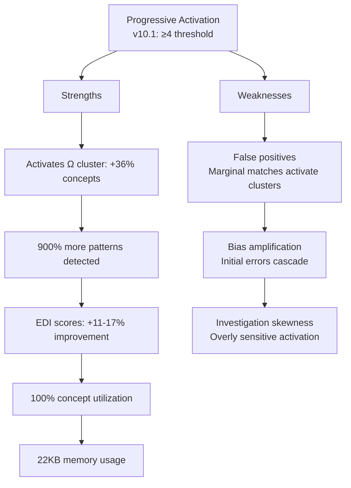
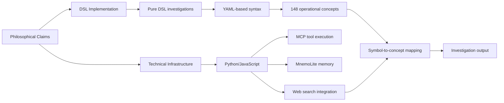
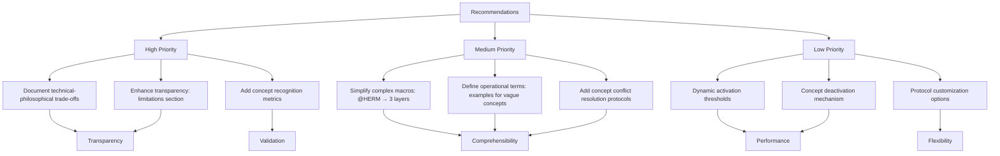
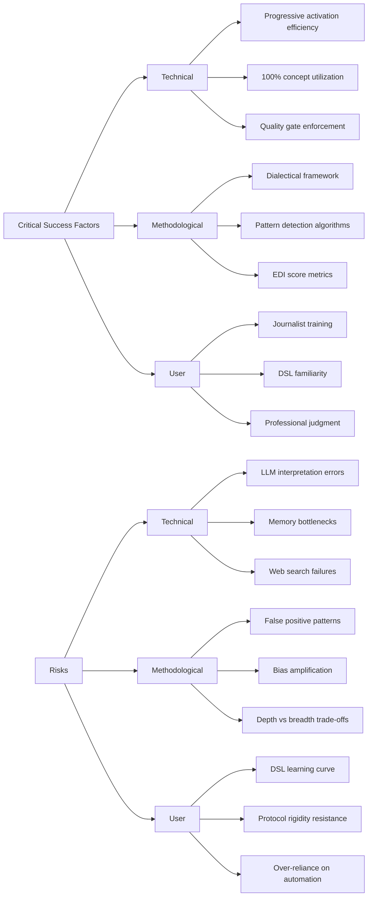

# TRUTH ENGINE v10.1 - Visual Analysis Diagrams

## 1. Strengths vs Weaknesses: Balanced Perspective

```mermaid
graph TD
    A[Truth Engine v10.1] --> B[STRENGTHS]
    A --> C[WEAKNESSES]

    B --> B1[Formalized DSL for investigative processes]
    B --> B2[Progressive activation: 93% memory reduction]
    B --> B3[100% concept utilization]
    B --> B4[Quality gate enforcement: 12 mandatory checks]
    B --> B5[Dialectical framework for critical analysis]
    B --> B6[900% more patterns detected]
    B --> B7[EDI scores: +11-17% improvement]
    B --> B8[Pure DSL implementation]

    C --> C1[DSL ambiguity: overlapping concepts]
    C --> C2[Progressive activation bias cascades]
    C --> C3[Protocol rigidity: mandatory structures]
    C --> C4[Philosophical contradictions: neutrality claims]
    C --> C5[LLM interpretation gaps: vague terms]
    C --> C6[Lack of real-world validation metrics]
    C --> C7[Hidden technical dependencies]
```



## 2. Core Philosophical Contradictions

```mermaid
graph LR
    subgraph Claims
        A[Epistemic Neutrality<br/>"Cartographer, not oracle"]
        B[Anti-Paternalism<br/>"User = sovereign"]
        C[Pure DSL<br/>"No code in investigations"]
        D[Symmetric Hostility<br/>"95% hostility to all narratives"]
    end

    subgraph Reality
        A1[Pre-weighted concepts<br/>(€:+3, Ω:+4, Ξ:+2)]
        B1[Mandatory dialectical mapping<br/>Forbidden behaviors]
        C1[Python/JavaScript for MCP tools<br/>MnemoLite integration]
        D1[Western epistemological bias<br/>Text-based analysis favoritism]
    end

    A -->|Contradicts| A1
    B -->|Contradicts| B1
    C -->|Contradicts| C1
    D -->|Contradicts| D1
```

## 3. Progressive Activation Trade-offs



## 4. Quality Gates vs Flexibility Trade-off

```mermaid
graph LR
    A[Quality Gates<br/>12 mandatory checks] --> B[Ensures Consistency]
    A --> C[Limits Flexibility]

    B --> B1[Comprehensive analysis<br/>(≥8 concepts)]
    B1 --> B2[Well-analyzed concepts<br/>(score ≥7)]
    B2 --> B3[Hidden implication detection<br/>(≥3 points)]
    B3 --> B4[Dialectical mapping<br/>(thèse/antithèse)]
    B4 --> B5[EDI score targets<br/>(≥0.30/0.70/0.80)]

    C --> C1[Forces predefined structures<br/>(tripartite dialectic)]
    C1 --> C2[Restricts innovative methods<br/>(forbidden behaviors)]
    C2 --> C3[Reduces adaptability<br/>(rigid requirements)]
```

## 5. Memory Efficiency vs Investigation Depth

```mermaid
graph TD
    A[Memory Efficiency<br/>22KB per investigation] --> B[Strengths]
    A --> C[Trade-offs]

    B --> B1[93% reduction from traditional]
    B1 --> B2[100% concept utilization]
    B2 --> B3[Longer, more complex investigations]
    B3 --> B4[Supports L6-L9 depth levels]

    C --> C1[Only 30% of concepts activated]
    C1 --> C2[Potential breadth limitations]
    C2 --> C3[Relies on trigger detection accuracy]
    C3 --> C4[Risk of missed patterns (false negatives)]
```

## 6. Pattern Detection Performance

```mermaid
graph BAR
    x-axis ["Investigation Type"]
    y-axis ["Patterns Detected"]
    Traditional : 1
    Progressive_v10.0 : 7
    Progressive_v10.1 : 10
    Simple : 5
    Complex : 8
    APEX : 10
    style Progressive_v10.1 fill:#00ff00
```

## 7. EDI Score Improvements

```mermaid
graph BAR
    x-axis ["Complexity Level"]
    y-axis ["EDI Score"]
    v8.6_Simple : 0.34
    v10.1_Simple : 0.38
    v8.6_Complex : 0.65
    v10.1_Complex : 0.76
    v8.6_APEX : 0.75
    v10.1_APEX : 0.83
    style v10.1_Simple fill:#00ff00
    style v10.1_Complex fill:#00ff00
    style v10.1_APEX fill:#00ff00
```

## 8. Concept Activation Efficiency

```mermaid
graph PIE
    "Activated Concepts" : 45
    "Dormant Concepts" : 103
    style "Activated Concepts" fill:#00ff00
```

## 9. Implementation vs Philosophy



## 10. Recommendations by Priority



## 11. The Truth Engine Ecosystem

```mermaid
graph TD
    A[User Input<br/>(Text, URL, Query)] --> B[Progressive Activation<br/>Trigger Detection]
    B --> C[Concept Cluster Loading<br/>(45 concepts)]
    C --> D[DSL Analysis<br/>Pattern Detection]
    D --> E[Quality Gate Check<br/>(12 mandatory checks)]
    E --> F[Investigation Output<br/>(EDI Score, Patterns, Sources)]

    D --> G[MnemoLite Memory<br/>(Knowledge base)]
    G --> D
    D --> H[Web Search<br/>(MCP tools)]
    H --> D
```

## 12. Critical Success Factors vs Risks


