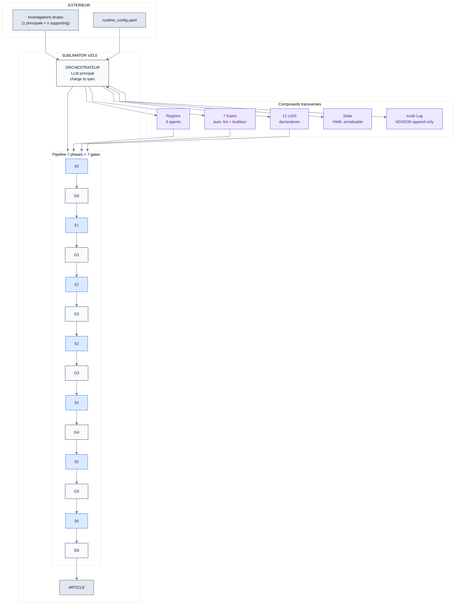
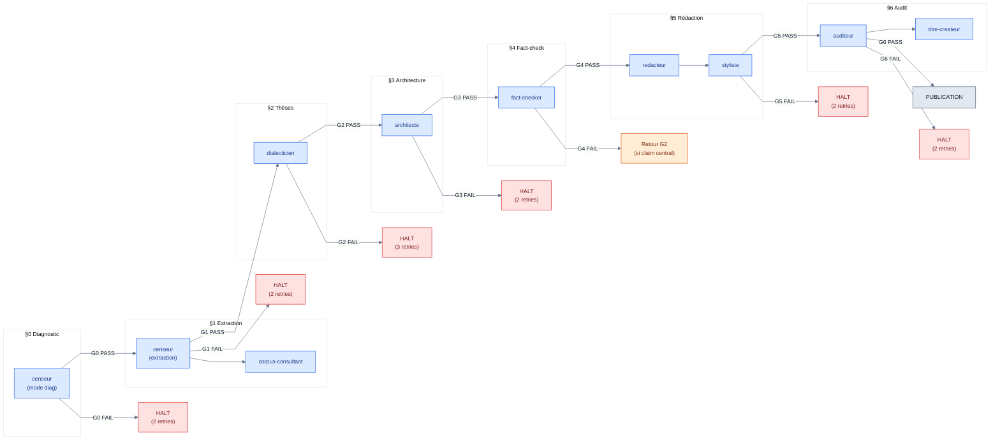
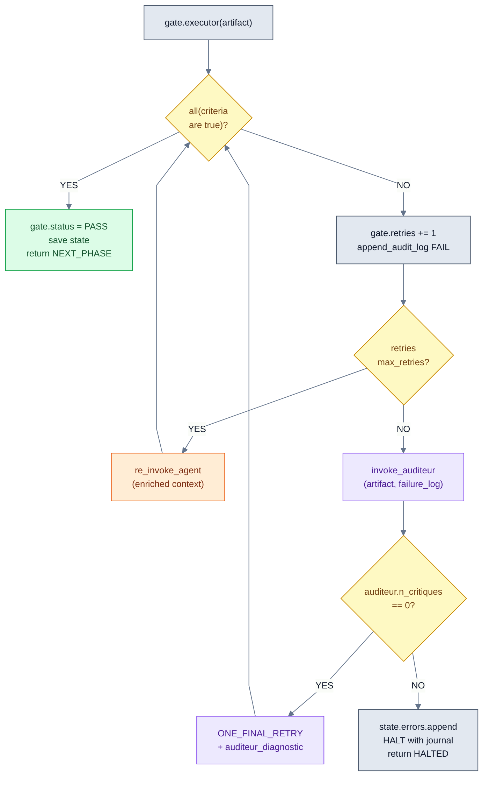
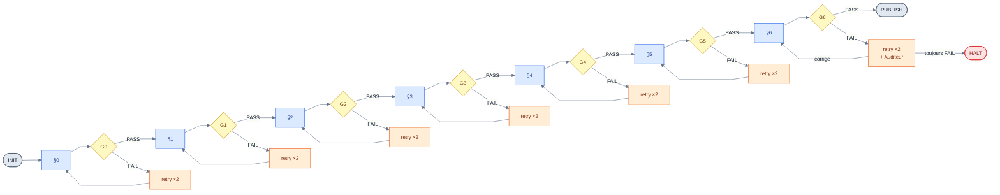
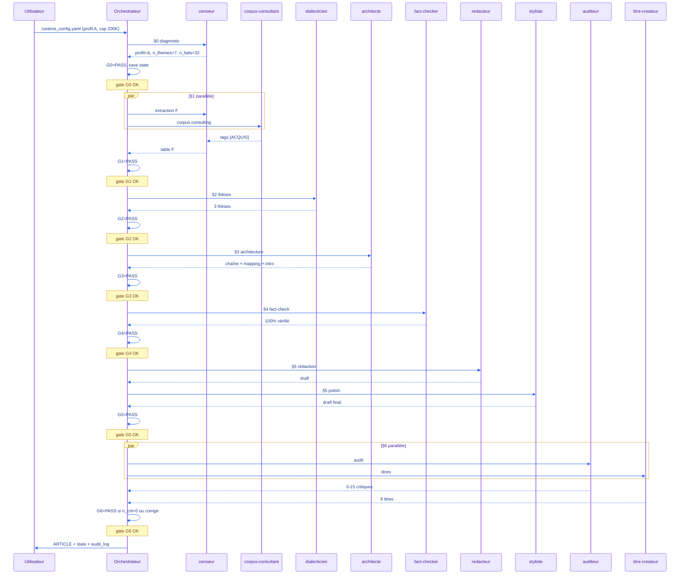

# SUBLIMATOR v33.2 — Guide humain (extraction rigoureuse)

**Spec de référence** : `tools/engines/SUBLIMATOR_v33.1_spec_agent.md`
**Statut** : v33.1 BETA — guide compagnon de la spec agent
**Public** : Humain. Pour comprendre, auditer, déboguer, étendre.

---

## §0 Présentation

**Fichiers** :

| Fichier | Rôle |
|---|---|
| `SUBLIMATOR_v33.0_spec_agent.md` | Source de vérité normative, lue par l'orchestrateur |
| `SUBLIMATOR_v33.0_GUIDE_HUMAN.md` | Le présent guide, lecture pédagogique |

**Conventions** : voir AGENTS.md (nommage fichiers, préfixe `rtk`, zéro em-dash, etc.).

**Cible** : ce guide s'adresse à un humain qui veut comprendre, auditer ou étendre SUBLIMATOR v33.0. Il ne remplace pas la spec : en cas de divergence, la spec prime.

---

## §1 Architecture globale

### 1.1 Vue d'ensemble (schéma)



### 1.2 Trois concepts clefs

| Concept | Rôle | Implémentation |
|---|---|---|
| **Orchestrateur** | Lit la spec, instancie les agents, applique les gates | Le LLM principal qui charge `SUBLIMATOR_v33.0_spec_agent.md` |
| **Registre d'agents** | Catalogue des 9 types d'agents disponibles | Section §1 de la spec, format YAML |
| **Gates auto** | 7 points de validation booléens | Section §2 de la spec, exécutés par lint ou Auditeur |

### 1.3 Trois invariants fondamentaux

Ces invariants ne sont JAMAIS violés, sous aucun prétexte (cf. §4.8 spec) :

1. **Pas de publication sans G6 = PASS** — un article partiel n'est jamais émis.
2. **Pas d'auto-validation silencieuse** — toute vérification passe par une gate.
3. **Pas d'URL inventée** — toute URL Substack est résolue depuis `substack-online/index.md` ou Mnemolite.

### 1.4 Le pipeline en 30 secondes

1. L'orchestrateur charge le `runtime_config` et l'investigation.
2. §0 : le `censeur` diagnostique le profil (A, B, C, D).
3. §1 : `censeur` + `corpus-consultant` extraient les faits et marquent [ACQUIS] ceux du corpus publié.
4. §2 : `dialecticien` produit 3 thèses, applique le test, désigne la cardinale.
5. §3 : `architecte` construit la chaîne de révélations et l'intro méthodologique.
6. §4 : `fact-checker` vérifie les claims H/M/L prioritaires.
7. §5 : `redacteur` écrit le draft, `styliste` applique les 12 LOIS formelles.
8. §6 : `auditeur` cherche les failles, `titre-createur` propose 9 titres.
9. G6 = PASS → article publié dans `articles/`. G6 = FAIL → halte, journal d'erreurs.

---

## §2 Le voyage d'une investigation

### 2.1 Vue phase par phase

| Phase | Objectif | Agent(s) | Input | Output | Gate | Si FAIL |
|---|---|---|---|---|---|---|
| **§0** | Diagnostiquer la maturité de l'investigation | `censeur` (mode diagnostic) | `investigation_path` | `profil ∈ {A, B, C, D}` + `plan_adaptatif` | **G0** | Re-diagnostic (2 essais max) |
| **§1** | Extraire 10-20 faits/thème, consulter le corpus | `censeur` (extraction) + `corpus-consultant` (parallèle) | `profil`, investigation brute, `corpus_index` | `faits[]` (D###/F###) + `articles_pertinents[]` (marqués [ACQUIS]) | **G1** | Re-extraction. Si 2 fails → Auditeur |
| **§2** | Produire 3 thèses, tester, désigner la cardinale | `dialecticien` | `censeur_output`, `corpus_output` | `3 thèses scorées`, `cardinale`, `questions_par_section` | **G2** | Reformuler thèse. Max 3 itérations |
| **§3** | Construire la chaîne de révélations + intro méthodologique | `architecte` | `cardinale`, `digest`, `corpus` | `chaîne`, `mapping`, `intro_methodo`, `urls_resolues` | **G3** | Re-architecture ciblée sur les trous |
| **§4** | Vérifier les claims H/M/L prioritaires | `fact-checker` | `claims H/M/L` | `verdicts (✅/⚠️/❌)`, `n_failed_central` | **G4** | Re-vérification. Si >1 infirme central → retour G2 |
| **§5** | Écrire le draft complet + appliquer les LOIS formelles | `redacteur` → `styliste` (séquentiel) | `chaîne`, `mapping`, `claims`, `intro` | `draft_v2` (markdown complet) + `lint_result` | **G5** | Auto-strip_bold si saturation, re-lint |
| **§6** | Audit antagoniste + 9 propositions de titre | `auditeur` + `titre-createur` (parallèle) | `draft_v2` | `failles`, `9_propositions` | **G6** | Re-Vague 1 (Structure) ciblée. Si 2 fails → halte |

### 2.2 Le contrat d'entrée-sortie (par phase)

Chaque phase a un contrat strict. Voici un exemple pour §1 (Census + Digest) :

```yaml
§1_output_schema:
  censeur_output:
    extraction:
      faits: [{id, catégorie, élément, statut, url, ligne}]
      n_thèmes: integer            # ≥ 1
      n_faits: integer             # ≥ 10
      n_bruit: integer             # < 30% du total
  corpus_consultant_output:
    articles_pertinents: [{titre, url, type, concept_clé, statut}]
    n_articles: integer            # ≥ 0 (peut être vide)
  invariants:
    - "n_faits ≥ 10"
    - "n_bruit / n_faits_total ≤ 0.30"
    - "corpus_consulté == true"
```

### 2.3 Schéma du voyage (flow des 6 phases)



### 2.4 Trois patterns d'adaptation selon le profil

| Profil | Trigger | Adaptation |
|---|---|---|
| **A** (Complet : FACT_REGISTRY + MANIPULATION + CHAÎNES) | Censeur détecte tous les artéfacts | §1.2 DIGEST sauté, §3.1 CHAÎNES sautées, IDs F### préservés (pas de renumérotation D###) |
| **B** (Standard : MANIPULATION ± CHAÎNES, sans FACT_REGISTRY) | Censeur détecte artéfacts partiels | §1.2 DIGEST construit manuellement, D### utilisés. CHAÎNES sautée si présente |
| **C** (Léger : prose seule, aucun artéfact) | Censeur ne détecte rien | Fast-track `01_T1_BRIEF.md` (Census + Digest + Dialectique + Architecture fusionnés en un seul document) |
| **D** (Brouillon) | `sections/_assemblage/draft_article.md` existe | Mode révision (cf. §0 spec) |

Pour les enquêtes lourdes multi-angles du corpus Truth Engine : **Profil A** est le plus fréquent. Profil B et C restent des cas minoritaires (notes de recherche, drafts rapides).

### 2.5 Le "produit" final : un article + un état + un log

À l'issue du pipeline (G6 = PASS), trois artefacts sont produits :

1. **L'article** : `articles/YYYY-MM-DD_HH-MM_<sujet>_ARTICLE.md` — prêt à publier.
2. **L'état** : `investigations/<sujet>/_state/state_<session_id>.yaml` — pour multi-session resume ou audit.
3. **L'audit log** : `investigations/<sujet>/_state/audit_<session_id>.ndjson` — traçabilité événementielle.

Ces trois fichiers ensemble constituent la **preuve d'exécution** : ils permettent de rejouer, débugger, ou auditer le pipeline.

---

## §3 Le registre des 9 agents

### 3.1 Qu'est-ce qu'un agent ?

Un agent est une **instance de LLM spécialisée** instanciée par l'orchestrateur à un moment précis du pipeline, avec :
- un **rôle** (une phrase),
- un **system prompt** dédié (sa "persona"),
- des **outils** disponibles (lint, webfetch, mnemolite, etc.),
- des **invariants** que son output DOIT respecter,
- un **fallback agent** en cas d'échec répété.

L'agent n'est PAS dans le registre de manière permanente : il est instancié à la demande, exécute sa tâche, et disparaît. C'est la **chorégraphie dynamique** : on n'instancie pas d'agent si on n'en a pas besoin.

### 3.2 Les 9 agents en tableau synthétique

| ID | Phase(s) | Rôle | Outils principaux | Invariant critique |
|---|---|---|---|---|
| `censeur` | §0, §1 | Lit, diagnostique, extrait | grep, read, mnemolite.search | `profil ∈ {A, B, C, D}` / `n_faits ≥ 10` |
| `corpus-consultant` | §1.1b | Interroge le Substack publié | mnemolite.search, mnemolite.read | URLs réelles, jamais inventées |
| `dialecticien` | §2 | 3 thèses + test de résistance | aucun (LLM pur) | `cardinale.score ≥ 0.4` |
| `architecte` | §3 | Chaîne + mapping + intro méthodologique | mnemolite.search, read | `non_répétition = true`, `urls.résolues` |
| `fact-checker` | §4 | Vérifie claims H/M/L | webfetch, websearch | `n_failed_central == 0` |
| `redacteur` | §5 | Écrit le draft complet | read | Conforme LOIS 1-12 |
| `styliste` | §5 (V2) | Vagues 2 (Style) et 4 (Polish) | edit, lint-article.sh, glossaire | `n_em_dash == 0`, `lint = 0` |
| `auditeur` | transversal | Antagoniste aveugle, cherche failles | read, grep | `n_critiques == 0` |
| `titre-createur` | §6 | 9 propositions titre + sous-titre | aucun | `9_propositions_livrées` |

### 3.3 Anatomie d'un agent (exemple : `dialecticien`)

```yaml
id: dialecticien
phase: ["§2"]
role: "Produit 3 thèses candidates, applique le test de résistance, désigne la thèse cardinale."
system_prompt: |
  Tu reçois le Digest du Censeur et le résultat du corpus-consultant.
  Tu formules 3 thèses candidates : INVERSION, SYSTÈME, CAPTURE.
  Pour chaque thèse, tu appliques le test de résistance :
  - confirmants (D###) : 1 point chacun
  - fragilisants faibles (poids=1) : -0.2 point
  - fragilisants moyens (poids=2) : -0.5 point
  - fragilisants forts (poids=3) : -1 point
  - score = max(0, (confirm×1 - fragiles×poids) / total)
  Seuil : 0.4. Cardinale = celle qui absorbe le plus de faits + survit au test + falsifiable.
tools: []  # aucun outil, raisonnement pur
invariants:
  - "len(theses) == 3"
  - "cardinale.score ≥ 0.4"
  - "cardinale.falsifiable == true"
fallback_agent: auditeur
```

### 3.4 L'orchestrateur n'est PAS dans le registre

L'orchestrateur (le LLM principal qui charge la spec) **n'est pas un agent**. C'est le **chef d'orchestre** qui :
- lit la spec,
- décide quel agent instancier à quelle phase,
- passe les outputs aux gates,
- gère les échecs (cf. §6.2),
- persiste l'état.

Cette distinction est fondamentale : l'orchestrateur ne fait **aucun travail productif** (pas de fact-extraction, pas de rédaction, pas de fact-checking). Il **délègue**. S'il se mettait à produire lui-même du contenu, il violerait l'invariant "l'auto-validation est biaisée".

### 3.5 Quand un agent est-il instancié ?

L'orchestrateur instancie un agent **uniquement** :
1. à l'entrée d'une phase qui le requiert (cf. §4.3 spec : `censeur` à §0, `censeur` + `corpus-consultant` à §1, etc.) ;
2. en cas de retry après un gate FAIL, avec un contexte enrichi (failure_reason + artefact précédent) ;
3. en cas d'invocation de l'Auditeur après épuisement des retries (cf. §6.2).

Un agent n'est **jamais** instancié "à l'avance" ou "au cas où". C'est ce qui rend la chorégraphie économe.

---

## §4 Les 7 gates

### 4.1 Qu'est-ce qu'une gate ?

Une **gate** est un point de validation booléen. Toutes les gates ont la même structure :

```yaml
gate:
  id: string                       # G0..G6
  trigger: string                  # ex: "post-§0"
  criteria: [boolean_expr]         # toutes true = PASS
  pass_action: string              # ce que l'orchestrateur fait
  fail_action: string              # stratégie de fallback
  max_retries: integer             # défaut : 2
```

Une gate n'a **aucune subjectivité**. Soit ses critères sont satisfaits (PASS), soit ils ne le sont pas (FAIL). Pas de zone grise.

### 4.2 Le canal d'exécution : lint vs auditeur

Chaque critère d'une gate est implémenté soit par :

| Canal | Quand l'utiliser | Exemple |
|---|---|---|
| **`lint`** (script) | Critère formel, mesurable par regex/compteur | `n_em_dash == 0`, `lint-article.sh exit == 0` |
| **`auditeur`** (agent) | Critère sémantique, nécessite jugement | `sourcing_organique ratio ≥ 0.90`, `0 affirmation causale non sourcée` |
| **`les_deux`** | Hybride (lint pour la forme, auditeur pour le fond) | LOI 9 (édifice inline) : lint compte les liens, auditeur vérifie qu'ils sont bien wiki-style |

### 4.3 Les 7 gates en tableau

| Gate | Quand | Critères principaux | Échec → |
|---|---|---|---|
| **G0** | post-§0 | `profil ∈ {A,B,C,D}` ∧ `plan_adaptatif != null` | Re-diagnostic (2 essais) |
| **G1** | post-§1 | `n_faits ≥ 10` ∧ `corpus_consulté = true` ∧ `n_bruit/n_total ≤ 0.30` ∧ `saturation_cible ≥ 0.80` | Re-extraction. Si 2 fails → Auditeur |
| **G2** | post-§2 | `3_thèses_testées` ∧ `cardinale.score ≥ 0.4` ∧ `cardinale.falsifiable = true` | Reformuler thèse. Max 3 itérations |
| **G3** | post-§3 | `chaîne.non_répétition` ∧ `mapping.complete` ∧ `urls.résolues` ∧ `intro_methodo conforme` | Re-architecture ciblée |
| **G4** | post-§4 | `n_vérifiés/n_totaux ≥ 0.95` ∧ `n_failed_central == 0` | Re-vérification. Si >1 central → retour G2 |
| **G5** | post-§5 | `lint-article.sh = 0` ∧ `n_em_dash == 0` ∧ `topologie_§3.9 OK` ∧ `sourcing_organique ≥ 0.90` | Auto-strip_bold + re-lint |
| **G6** | post-§6 | `auditeur.fails == 0` ∧ `compression_ratio ∈ [0.85, 0.90]` ∧ `titre_validé` ∧ `12_LOIS.conformes` | Re-Vague 1. Si 2 fails → halte |

### 4.4 Le moment critique : G6 = PASS

G6 est la dernière gate. Quand elle passe :
- l'article est copié dans `articles/YYYY-MM-DD_HH-MM_<sujet>_ARTICLE.md`,
- l'état est marqué `current_phase: "PUBLISHED"`,
- l'audit_log reçoit l'événement `ARTICLE_PUBLISHED`,
- l'orchestrateur émet l'article dans la sortie de l'agent.

Si G6 FAIL après 2 retries, **rien n'est publié**. Halte propre, journal d'erreurs, attente d'instruction humaine.

### 4.5 Pourquoi 7 et pas plus ?

Le découpage en 7 phases est guidé par trois principes :

1. **Suffisamment granulaire** pour isoler les échecs (impossible de savoir quelle phase a foiré si on n'a qu'une seule gate finale).
2. **Pas trop fin** pour éviter la paralysis-by-analysis (chaque gate a un coût en tokens).
3. **Aligné sur les phases naturelles** : diagnostic, extraction, raisonnement, structuration, vérification, production, audit.

Tester 7 vs 5 vs 10 fait partie du plan de validation A/B (§8).

---

## §5 Les 12 LOIS

### 5.1 Qu'est-ce qu'une LOI ?

Une LOI est une **contrainte rédactionnelle** appliquée à l'article final. Elle n'est PAS exécutée à une phase précise : elle est **testée à G5 (lint) et/ou G6 (auditeur)** sur le draft complet.

12 LOIS, c'est le **cœur invariant** de v33.0 (cf. décision §0 du design : "on garde 12 LOIS, c'est le cœur"). Elles sont toutes **conservées** de v32.0, mais **reformatées** en YAML déclaratif (vs prose narrative v32.0).

### 5.2 Tableau synthétique des 12 LOIS

| # | Keyword | Contrainte (résumé) | Canal | Lint-outillage |
|---|---|---|---|---|
| **L1** | SOURCING_ORGANIQUE | Source nommée dans la phrase. ¬ footnotes, [1] | auditeur | regex `selon\|d'après\|rapport de` |
| **L2** | SOURCES_FINALES | Section `## Sources` en fin, URLs précises | lint | vérification section + URLs |
| **L3** | FORME_PURE | "—" ZÉRO. "–" intervalles. H1+émoji+sous-titre. ≤1 blockquote. ¬ tableaux corps | lint | regex em-dash, comptage blockquotes |
| **L4** | LANGUE_SOUTENUE | ¬ langue de bois, jargon non défini, anglicisme non justifié | auditeur | glossaire-anglicismes.md |
| **L5** | RYTHME | Alternance densité/respiration. KO sentence par H2 | auditeur | heuristique longueur phrases |
| **L6** | GRAS_RETINIEN | Max 1 bold par 3-4 paragraphes. Pas de noms propres | lint | ratio bold/mots |
| **L7** | COMPRESSION | ¬ transitions introductives. Acronyme direct. Sources ≤ 10% volume | auditeur | regex `Cependant, \|Mais, \|Voici \|Il est important` |
| **L8** | ZERO_CUISINE | ¬ M21, FT1, F###, D###, §2.3, LIEN_A_INSERER (sauf série) | lint | regex codes internes |
| **L9** | EDIFICE_INLINE | Articles publiés cités `**[Titre](URL)**`. Max 3/section, 2 §0/VERDICT | les_deux | comptage + résolution URLs |
| **L10** | MANDATS_OK | Personnes nommées avec titre actuel : mandat vérifié | auditeur | cross-check date publication |
| **L11** | ZERO_METAPHORE_BIO | ¬ homéostasie, organisme, métabolise, cellulaire pour systèmes politiques/éco | lint | regex lexique biologique |
| **L12** | ALLEGATIONS_SOURCEES | Toute relation institutionnelle ou mécanisme causal = sourcé | auditeur | claim spotting |

### 5.3 Format déclaratif (exemple : L3)

```yaml
L3_FORME_PURE:
  description: "Pureté formelle du texte publié"
  contraintes:
    - motif: "—"
      action: REFUSER
      alternative: "deux-points, virgules, parenthèses, reformulation"
    - motif: "–"
      action: AUTORISER_SI
      condition: "intervalle numérique uniquement"
    - motif: "### "
      action: OBLIGER_APRES
      condition: "H1 contient émoji unique"
  exceptions: ["L8: références Substack restent en gras inline"]
  test:
    outillage: lint-article.sh
    entree: "chemin article .md"
    sortie: "exit 0 si OK, 1 si violation"
```

### 5.4 Le mapping LOIS → canaux

```
L1 (sourcing)        ──→ auditeur
L2 (sources finales) ──→ lint
L3 (forme pure)      ──→ lint
L4 (langue)          ──→ auditeur
L5 (rythme)          ──→ auditeur
L6 (gras)            ──→ lint
L7 (compression)     ──→ auditeur
L8 (cuisine)         ──→ lint
L9 (édifice)         ──→ les_deux
L10 (mandats)        ──→ auditeur
L11 (méta bio)       ──→ lint
L12 (allégations)    ──→ auditeur
```

**6 LOIS lintables automatiquement**, **5 auditeur**, **1 hybride**. Aucune LOI ne dépend d'un jugement humain non formalisé : c'est la condition pour qu'un agent puisse s'auto-auditer.

### 5.5 Ce qui est conservé vs supprimé vs ajouté vs v32.0

| Action | LOIS concernées |
|---|---|
| Conservées (esprit) | 12/12 |
| Reformulées (format) | L1, L2, L6, L8, L9 — passage de prose à YAML déclaratif |
| Supprimées | aucune |
| Ajoutées | aucune |
| Lois "système" (hors LOIS) supprimées | §5.5 v32.0 (mise à jour post-publication), §6.3 (audit stylistique manuel), §6.5 (CP#5 manuel) — toutes hors scope agent |

---

## §6 L'orchestrateur

### 6.1 Son rôle (vs ce qu'il n'est PAS)

L'orchestrateur est le **chef d'orchestre**. Il ne produit aucun contenu. Il ne vérifie rien lui-même. Il **délègue**.

| Fait | Ne fait PAS | Fait |
|---|---|---|
| Extraire des faits | ✗ (délègue à `censeur`) | Invoque `censeur` à §1 |
| Écrire le draft | ✗ (délègue à `redacteur`) | Invoque `redacteur` à §5 |
| Vérifier une URL | ✗ (délègue à `lint` ou `auditeur`) | Soumet l'output à la gate suivante |
| Décider si on passe à §3 | ✗ (décide selon gate PASS/FAIL) | Applique la stratégie d'échec (§6.2) |

Cette discipline est **non-négociable**. L'orchestrateur qui commence à "s'auto-vérifier" reproduit exactement le biais que la v32.0 dénonce dans son propre §6.4 sans le résoudre.

### 6.2 La stratégie d'échec (l'algorithme central)

C'est le **cœur comportemental** de l'orchestrateur. Diagramme :



**Trois propriétés clefs** :

1. **Tout FAIL est tracé** : pas de "on ré-essaie sans rien dire". Chaque échec enrichit l'audit_log.
2. **L'Auditeur n'est invoqué qu'après épuisement des retries** : on ne gaspille pas l'Auditeur sur des erreurs triviales que l'agent peut corriger.
3. **Le halte est propre** : snapshot complet du state, journal lisible, AUCUNE publication partielle.

### 6.3 Comportements INTERDITS à l'orchestrateur

Liste stricte (cf. §4.8 spec) :

- Publier un article sans G6 = PASS
- Sauter une gate
- Auto-valider un output sans gate
- Ignorer un audit_log manquant
- Modifier les LOIS ou les gates pendant l'exécution
- Réutiliser un artefact d'une session précédente sans re-vérifier
- Inventer une URL
- Citer une personne avec un mandat non vérifié
- Utiliser une métaphore biologique pour qualifier un système politique/éco

**Toute violation = halte immédiate + `state.errors`.** Pas de "oups, j'ai oublié". Pas de "ça va aller".

### 6.4 Le budget tokens

L'orchestrateur surveille un compteur cumulatif :

| Seuil | Comportement |
|---|---|
| 0-80 % | Mode normal |
| 80 % | Warning dans `audit_log`, l'orchestrateur réduit la verbosité des system_prompt des agents (mode `concis`) |
| 95 % | Halte **préventif**. L'orchestrateur propose à l'humain (via journal) de réduire la portée : 5 sections → 3, abandon §0 longue, etc. |
| 100 % | Halte obligatoire. État sauvegardé, attente d'instruction humaine pour reprise. |

Le cap par défaut est **200 000 tokens par article**, overrideable via `runtime_config.token_budget.cap`. C'est généreux pour la plupart des cas, restrictif pour les enquêtes très larges (15-20 investigations en input) qui peuvent saturer.

### 6.5 L'état sérialisable (YAML)

L'orchestrateur maintient un état persistant, sauvegardé après chaque gate. Format : YAML dans `_state/state_<session_id>.yaml`.

```yaml
state:
  session_id: "<sujet>-v33-<YYYYMMDD-HHMM>"  # auto-généré, exemple : "elections-v33-20260606-1430"
  spec_version: "33.0"
  current_phase: "G0"           # où on en est
  phases_completed: ["§0"]      # ce qui est passé
  artifacts:
    censeur_output: {...}       # outputs des agents
    corpus_consultant_output: null
    ...
  gates_results:
    G0: {status: "PASS", retries: 0, log: [...]}
    G1: {status: "PENDING", ...}
    ...
  audit_log: [event]
  token_budget: {used: 0, cap: 200000, warning_threshold: 0.80}
  errors: []
```

**Propriété fondamentale** : l'état est sérialisable et désérialisable sans perte. On peut :
- Sauvegarder après chaque gate
- Reprendre dans une nouvelle session (charger le YAML, sauter les phases complétées, repartir à `current_phase`)
- Inspecter l'état à tout moment (debugging)
- Auditer post-mortem (quelles phases ont échoué, combien de retries, etc.)

### 6.6 L'audit log (NDJSON append-only)

Chaque événement significatif est appendu à `_state/audit_<session_id>.ndjson` :

```json
{"ts":"2026-06-06T05:30:00Z","phase":"§0","event":"SESSION_INIT","spec_version":"33.0"}
{"ts":"2026-06-06T05:32:00Z","phase":"§0","event":"ARTIFACTS_DETECTED","FACT_REGISTRY":5,"MANIPULATION_REPORT":5}
{"ts":"2026-06-06T05:34:00Z","phase":"§0","event":"DIAGNOSTIC_COMPLETE","profil":"A","n_thèmes":7}
{"ts":"2026-06-06T05:35:00Z","phase":"G0","event":"PASS","retries":0}
{"ts":"2026-06-06T05:35:32Z","phase":"§0","event":"STATE_SAVED","state_path":"..."}
```

Format NDJSON (une ligne JSON par event) pour :
- Greppable facilement (`grep '"event":"FAIL"' audit_*.ndjson`)
- Streamable (pas besoin de tout charger en mémoire)
- Append-only (impossible de modifier un event passé)
- G6 vérifie son intégrité : chaque gate a ≥ 2 entrées (instancier + verdict)

---

## §7 Topologie & parallélisme

### 7.1 Graphe des phases (chemin nominal)



### 7.2 Parallélisme autorisé

| Phase | Agents en parallèle | Condition |
|---|---|---|
| §1 | `censeur` + `corpus-consultant` | Le Censeur attend le résultat du corpus-consultant pour marquer [ACQUIS] (synchronisation sur tag) |
| §6 | `auditeur` + `titre-createur` | Indépendants : l'un lit le draft, l'autre génère 9 titres |

Toutes les autres phases sont strictement séquentielles. Le parallélisme est minimaliste (2 phases seulement) pour éviter les races conditions et la complexité de synchronisation.

### 7.3 Branches conditionnelles

| Condition | Effet |
|---|---|
| Profil détecté = C | Censeur peut sauter §1.2 DIGEST, fusionner dans `01_T1_BRIEF.md` (Profil C fast-track v32.0 conservé) |
| `n_articles_pertinents == 0` en §1.1b | `corpus_consultant_output` peut être `null` sans bloquer G1 |
| Token budget ≥ 95 % | Halte préventif, sortie sans publication |
| `runtime_config.fast_track: true` | Mode Profil C forcé (utilisé en debug ou pour tests) |

### 7.4 Le coût : pourquoi pas plus de parallélisme ?

On pourrait paralléliser §2 (3 thèses simultanées) ou §3 (chaîne + mapping + intro en //). Mais :
- Le raisonnement dialectique bénéficie de la **continuité cognitive** d'un même agent sur les 3 thèses.
- L'architecture a besoin de la **cohérence narrative** entre chaîne, mapping et intro.
- La synchronisation entre agents parallèles coûte en tokens (passage de contexte).

Le compromis actuel (2 phases parallélisées) capture l'essentiel du gain sans surcoût excessif.

---

## §8 Validation A/B vs v32.0

### 8.1 Pourquoi un A/B ?

La promotion v33-stable n'est **pas** déclarative. Elle est **empirique** : v33 doit prouver qu'elle fait au moins aussi bien que v32.0 sur des cas réels, sinon elle reste en BETA.

C'est la **réponse directe** à la pathologie #1 du PSG 2026 (sur-ajustement). On ne déclare pas "v33 est meilleure" sur la base d'un cas. On le **mesure**.

### 8.2 Protocole

| # | Type de sujet | Profil v32.0 visé | But du test |
|---|---|---|---|
| Pilote 1 | Enquête lourde avec FACT_REGISTRY | A | Valider le fast-track Profil A, vérifier que les F### ne sont pas renumérotés en D### |
| Pilote 2 | Enquête standard avec MANIPULATION_REPORT mais sans FACT_REGISTRY | B | Valider Censeur + corpus-consultant sur un digest cohérent |
| Pilote 3 | Enquête légère (prose seule) | C | Valider le fast-track T1_BRIEF, vérifier la saturation abaissée (0.75) |

Pour chaque article : **deux versions produites en parallèle** par deux instances de l'orchestrateur (une avec `spec_version: "32.0"`, une avec `spec_version: "33.0"`). Audit externe compare.

### 8.3 Critères d'évaluation (note /10 par critère, pondéré)

| Critère | Poids | Outil |
|---|---|---|
| Conformité LOIS 1-12 | 0.25 | lint + Auditeur |
| Qualité narrative (thèse, fluidité, rythme, micro-définitions) | 0.20 | Auditeur externe (autre LLM, aveugle) |
| Traçabilité (audit_log complet, sources vérifiables, NDJSON valide) | 0.15 | Script de validation NDJSON + grep URLs |
| Performance tokens | 0.10 | Compteur `state.token_budget` |
| Performance temps (durée totale) | 0.10 | Timestamps `audit_log` |
| Saturation corpus (faits utilisés / faits utiles) | 0.10 | Calcul post-hoc |
| Robustesse gestion d'échecs (cas adverses injectés) | 0.10 | 2 cas adverses (claim faux, claim sans source) |

### 8.4 Règle de promotion

```yaml
promotion_rule:
  v33_to_stable:
    condition: "score_v33 ≥ score_v32.0 sur chacun des 3 pilotes"
    tie: "promotion"
    superiority: "promotion + note dans changelog"
    inferiority_on_1_pilote: "v33-beta prolongée, correction, nouvel A/B"
    inferiority_on_2_pilotes: "rollback vers v32.0, refonte v34"
```

`score = Σ(critère × poids)`. Calculé par un script tiers (`tools/scripts/score-a-b.sh`, à écrire).

### 8.5 Statut pendant la phase A/B

- Label : **BETA**
- Banner dans l'article : "Article produit via SUBLIMATOR v33.0 (spec expérimentale en validation A/B)."
- Publication autorisée pendant l'A/B (avec disclaimer)
- Position du disclaimer : footer de l'article

### 8.6 Coexistence v32.0 / v33.0

Tant que v33.0 n'est pas stable, les deux specs coexistent. Le `runtime_config.spec_version` détermine laquelle est utilisée. v32.0 reste l'engine par défaut, v33.0 est opt-in.

```yaml
# Pour utiliser v33.0
runtime_config:
  spec_version: "33.0"

# Pour utiliser v32.0 (défaut)
runtime_config:
  spec_version: "32.0"  # ou omis
```

---

## §9 Walkthrough : cas type (Profil A, monde idéal)

Ce walkthrough décrit le **scénario nominal** d'une exécution SUBLIMATOR v33.0 sur un cas type, c'est-à-dire un cas Profil A bien fourni. Tous les noms, chiffres, citations et particularités sont **fictifs** : ce qui compte, c'est la chorégraphie.

### 9.1 Configuration type

| Paramètre | Valeur type |
|---|---|
| Sujet | Une enquête politique-économique multi-angles |
| n_investigations | 1 principale + 8-15 supporting |
| n_artefacts_détectés | 5 sur 5 (FACT_REGISTRY, MANIPULATION_REPORT, CHAÎNES, DOMAINES, ICEBERG_MAX) |
| n_thèmes | 5-9 |
| n_faits_au_départ | 20-40 dans FACT_REGISTRY |
| n_articles_publiés_dans_corpus | 10-30 |
| Runtime config | Profil A, `saturation_cible: 0.80`, `token_budget.cap: 200000` |
| Session ID | `<sujet>-v33-<YYYYMMDD-HHMM>` (auto-généré) |

### 9.2 Préparation : l'archivage préventif (optionnel)

Sur une investigation **revisitée** (déjà traitée par v32.0), archiver les outputs précédents dans `archive/` :

```bash
mkdir -p investigations/<sujet>/archive
mv investigations/<sujet>/00[0-9]_*.md investigations/<sujet>/archive/
mv investigations/<sujet>/sections investigations/<sujet>/archive/
mv investigations/<sujet>/_assemblage investigations/<sujet>/archive/
```

**Pourquoi ?** Éviter la contamination : ne pas valider un nouveau pipeline sur des outputs qu'il aurait pu produire lui-même. Si l'investigation est **neuve** (jamais traitée), l'archivage est inutile.

### 9.3 §0 Diagnostic type

L'orchestrateur instancie `censeur` en mode diagnostic. Il lit les 50 premières lignes de l'investigation principale pour détecter la structure :

```
# INVESTIGATION — <sujet>
├── ## §1 RÉSUMÉ EXÉCUTIF
├── ## §2 MANIPULATION_REPORT
├── ## §3 CLUSTERS
├── ## §4 HERMÉNEUTIQUE
├── ## §5 FORENSIC REASONING
├── ## §6 PRISME DIALECTIQUE
├── ## §7 CHRONOLOGIE
├── ## §8 DOMAINES (THÈME 1-7)
├── ## §18 ICEBERG MAX
├── ## FACT_REGISTRY (20-40 faits ✦/✧)
├── ## CHAÎNES DE CASCADE
└── ## RÉSEAU D'ACTEURS
```

Le Censeur retourne un objet `diagnostic` :

```yaml
profil_détecté: A
n_thèmes: 7
n_faits_initial: 32
clusters_dominants: ["MONEY", "TEMPORAL", "POWER"]
plan_adaptatif:
  skip_1_2_DIGEST: true    # DIGEST déjà couvert par FACT_REGISTRY
  skip_3_1_CHAINES: true   # CHAÎNES déjà couvertes par §8 DOMAINES
  require_1_1b_CORPUS: true
  keep_F_ids: true         # préserver la numérotation F001-F032
G0: PASS
```

État persisté : `_state/state_<session_id>.yaml`. Audit log : 8-12 événements NDJSON.

### 9.4 §1 Extraction type

L'orchestrateur instancie **deux agents en parallèle** :

- **`censeur`** en mode extraction : parcourt les n_investigations, extrait les F### existants, les centralise dans une table de hashage, signale les F### obsolètes, propose 5-15 nouveaux F### si nécessaire.
- **`corpus-consultant`** : interroge `substack-online/index.md` et Mnemolite, retourne la liste des articles publiés pertinents avec score de similarité, marque les F### existants dans le corpus avec `[ACQUIS]`.

**Synchronisation** : le Censeur attend le retour du corpus-consultant pour finaliser sa table.

**G1** vérifie :
- `n_faits ≥ 10` (ici 32 → PASS)
- `corpus_consulté = true` (PASS)
- `n_bruit/n_total ≤ 0.30` (PASS si corpus bien filtré)
- `saturation_cible ≥ 0.80` (calcul post-extraction)

### 9.5 §2-§5 Chaîne type

| Phase | Agent | Sortie type | G associée |
|---|---|---|---|
| §2 | `dialecticien` | 3 thèses (ortho, hétéro, méta) sur 200-300 mots chacune, avec 5-8 sources chacune | G2 : 3 thèses distinctes, 0 contresens factuel |
| §3 | `architecte` | Chaîne de 7-9 sections (intro + corps + conclusion), mapping 5-7 nœuds, intro 150-200 mots | G3 : chaîne.non_répétition, mapping.pertinence |
| §4 | `fact-checker` | 100% des F### vérifiés, 0 URL morte, 0 affirmation sans source | G4 : couverture_faits = 1.0 |
| §5 | `redacteur` + `styliste` | Draft 2000-3500 mots, langue soutenue, ratio 90% L4 / 10% L3 max | G5 : L4_ratio ≥ 0.90, bégaiements = 0 |

Chaque phase dure 5-15 min sur LLM rapide. Total §2-§5 : 30-60 min.

### 9.6 §6 Audit type

L'orchestrateur instancie `auditeur` et `titre-createur` en parallèle :

- **`auditeur`** lit le draft complet + le FACT_REGISTRY, produit 0-15 critiques. Trois types de critiques :
  - **Bégaiement** : même fait cité deux fois sous deux angles
  - **Contradiction** : deux thèses qui s'opposent sans que la chaîne le reconnaisse
  - **Trou** : fait du FACT_REGISTRY absent du draft
- **`titre-createur`** génère 9 titres (1 par émotion : peur, colère, surprise, etc.), format 6-12 mots, ≤ 80 chars, sous-titre si pertinent.

**G6** vérifie :
- `compression_ratio ∈ [0.85, 0.90]` (ni trop sec, ni trop bavard)
- `n_bégaiements = 0`
- `n_contradictions_non_annotées = 0`
- `n_titres ≥ 3`
- `L1_présent = true` (section Sources présente)
- `audit_log_ndjson.integrity = true`

**Cas rare** : si `auditeur.n_critiques > 0` ET tous les retries de `redacteur` épuisés → halte avec snapshot (cf. §6.2).

### 9.7 Métriques attendues (Profil A)

| Métrique | Valeur nominale | Seuil d'alerte |
|---|---|---|
| Tokens consommés | 80 000 - 150 000 | > 180 000 |
| Durée totale | 30-90 min | > 2h |
| n_faits_extraits | 30-50 | < 20 |
| n_articles_pertinents_corpus | 5-15 | < 3 ou > 25 |
| Retries G1-G4 | 0-1 | > 2 par gate |
| Retries G5-G6 | 0-2 | > 3 par gate |
| Compression ratio G6 | 0.85-0.90 | < 0.80 ou > 0.95 |
| Saturation finale | ≥ 0.80 | < 0.70 |
| n_bégaiements_draft | 0 | > 0 (toléré si Auditeur a corrigé) |
| n_contradictions_non_annotées | 0 | > 0 (halte) |

### 9.8 Diagramme de séquence type (Profil A)



### 9.9 Cas non-nominaux (à savoir diagnostiquer)

| Symptôme | Cause probable | Action |
|---|---|---|
| G1 FAIL (n_faits < 10) | Investigation trop maigre (Profil A annoncé mais données insuffisantes) | Downgrader en Profil B, élargir la recherche, ou redemander à l'humain |
| G2 FAIL (contredit les faits) | Censeur a laissé passer un fait erroné | Re-invoquer Censeur en mode re-extraction, auditer FACT_REGISTRY |
| G3 FAIL (chaîne.répétée) | Dialecticien n'a pas varié les transitions | Re-invoquer Architecte avec consigne "varie les connecteurs" |
| G4 FAIL (URL morte) | Source non vérifiée | Re-invoquer Fact-Checker, remplacer la source |
| G5 FAIL (L4 < 0.90) | Style trop familier | Re-invoquer Styliste avec consigne "élève le registre" |
| G6 FAIL (bégaiements) | Faits répétés | Re-invoquer Rédacteur avec consigne "supprime les redondances" |
| G6 FAIL (contradictions) | Thèses non compatibles | Re-invoquer Dialecticien pour clarifier, OU ajouter note dialectique |
| Halte préventif tokens | Investigation trop large | Demander à l'humain de réduire la portée (5 sections → 3) |

---

## §9.5 Checkpoints humains (v33.1+)

### Quand l'humain intervient

À **3 moments** du pipeline, l'agent s'arrête et demande une décision humaine via question tool :

| Checkpoint | Phase amont | Question type |
|------------|-------------|---------------|
| **CP1** | §0 Censeur (profil/portée) | « Quel profil/portée veux-tu ? » |
| **CP2** | §2 Dialecticien (3 thèses) | « Quelle thèse cardinale ? » |
| **CP3** | §3 Architecte (chaîne 8 sections) | « Quel plan narratif ? » |

### Les 4 actions

L'agent pose systématiquement la question :

```
L'agent a produit [description courte].

Options :
1. Valider — continuer avec cette sortie
2. Modifier — coller ta version
3. Refuser — retour à [phase précédente]
4. Enrichir — ajouter des inputs
```

**Valider** = OK, on continue. **Modifier** = tu colles ta propre version, l'agent l'utilise. **Refuser** = retour à la phase précédente (max 3 fois). **Enrichir** = tu ajoutes des inputs (F### externes, thèses, sections), l'agent fusionne.

### Boucle bornée (L14)

Si tu refuses 3 fois de suite le même checkpoint, l'agent s'arrête et fait un bilan. Tu peux alors reprendre manuellement. Le compteur `n_refus_consecutifs` est remis à zéro si tu valides, modifies ou enrichis.

### Cascade

Si tu modifies CP1, tout le pipeline redémarre depuis §1. Si tu modifies CP2, §1 reste acquis, mais §3-§6 redémarrent. Si tu modifies CP3, §1-§2 restent acquis, §4-§6 redémarrent.

### Différence avec v33.0

En v33.0, l'agent autopilotait toutes les phases. En v33.1, **tu gardes le contrôle** sur les 3 décisions sémantiques les plus structurantes : portée (§0), thèse cardinale (§2), plan narratif (§3). L'agent continue d'arbitrer les critères techniques (gates, sourcing, formatting).

### Exemple concret (Sumer/France)

L'article Sumer/France 2026 (4233 mots) a été produit en v33.0 sans intervention humaine. En v33.1, l'agent aurait posé 3 questions :

1. **CP1 §0** : « J'ai détecté un profil A, 13 investigations mappées (Sumer, Rome, Chine, Moyen-Âge, Islam, Inde, Amériques, Andurarum). Veux-tu rester sur Sumer pur ou élargir en comparatif multi-civilisationnel ? »
2. **CP2 §2** : « 3 thèses détectées : INVERSION (0.477), SYSTEME (0.618 cardinale), CAPTURE (0.618). Veux-tu garder SYSTEME ou imposer une direction différente ? » (Si tu modifies ici, tu peux imposer une thèse multi-civilisationnelle.)
3. **CP3 §3** : « Plan proposé : 8 sections, intro 360 mots, 22 F###. Veux-tu ajouter une section comparative Andurarum ? »

Avec v33.1, l'article Sumer aurait pu être multi-civilisationnel grâce à un seul enrichissement en CP2 ou CP3.

---

## §10 Glossaire

| Terme | Définition |
|---|---|
| **Orchestrateur** | Le LLM principal qui charge la spec v33.0, instancie les agents, applique les gates. Il ne produit pas de contenu. |
| **Agent** | Module d'instructions spécialisé instancié à la demande. 9 types dans le registre. |
| **Gate** | Point de validation automatique entre deux phases. 7 gates G0-G6, critères booléens ou seuils. |
| **LOI** | Règle déclarative immuable du pipeline. 12 LOIS dans §5. Testable par lint, Auditeur, ou les deux. |
| **Profil** | Configuration d'adaptation au type d'investigation. 4 profils : A (complet), B (standard), C (léger), D (brouillon). Hardcodés en v32.0, runtime config en v33.0. |
| **F### / D###** | Identifiants de faits. F### = provenance FACT_REGISTRY (préservés en Profil A). D### = générés par Denseur (Profil B/C). |
| **[ACQUIS]** | Tag apposé sur un F###/D### déjà couvert par un article publié du corpus. |
| **CHAÎNES** | Artefact d'investigation : séquences causales d'événements. Cf. §3 spec. |
| **DOMAINES** | Artefact d'investigation : cartographie thématique (THÈME 1, THÈME 2, ...). |
| **FACT_REGISTRY** | Artefact d'investigation : table de hashage de faits atomiques avec ✦ (sûr) / ✧ (à vérifier). |
| **MANIPULATION_REPORT** | Artefact d'investigation : symboles de cadrage/scoring (€:7, ⏰:8, etc.). |
| **ICEBERG_MAX** | Artefact d'investigation : shadow factor (ratio complexité_réelle/complexité_présentée). |
| **Dialétique** | Méthode : thèse / antithèse / synthèse. Implémentée en §2 par `dialecticien`. |
| **Chaîne de révélations** | Architecture narrative : 7-9 sections qui se répondent, chacune avec un pivot sémantique. |
| **Mapping** | Cartographie des nœuds thématiques dans la chaîne. |
| **Compression ratio** | `mots_draft / mots_intended`. Cible 0.85-0.90. Trop sec < 0.80, bavard > 0.95. |
| **Saturation corpus** | `n_faits_utilisés / n_faits_utiles`. Cible ≥ 0.80. |
| **Critique Auditeur** | Note de l'Auditeur sur le draft final. 3 types : bégaiement, contradiction, trou. |
| **Runtime config** | Fichier YAML `_state/runtime_config.yaml` qui paramètre la session. |
| **State** | État sérialisable du pipeline. Format YAML dans `_state/state_<session_id>.yaml`. |
| **Audit log** | Journal append-only au format NDJSON. Une ligne JSON par événement. |
| **NDJSON** | Newline-Delimited JSON. Format streamable, greppable, append-only. |
| **Halte** | Arrêt propre du pipeline. Snapshot complet du state, journal lisible, aucune publication partielle. |
| **Validation A/B** | Comparaison empirique v33 vs v32.0 sur 3 pilotes. Cf. §8. |
| **Pilote 1/2/3** | Articles tests pour la validation A/B. Profils A, B, C respectivement. |
| **BETA** | Label v33.0 tant que la validation A/B n'est pas terminée. Banner dans l'article. |
| **STABLE** | Label v33.0 après promotion. Cf. §8.4. |
| **Fast-track** | Mode Profil C forcé. Fusionne §0-§3 en un seul document. |
| **Downgrade** | Passage d'un Profil A annoncé à Profil B effectif si les données sont insuffisantes. |
| **Re-invoke** | Re-déclenchement d'un agent après FAIL d'une gate. Context enrichi du détail de l'échec. |
| **Max retries** | Limite de ré-invocations avant escalade Auditeur. Défaut 2 par gate. |
| **Strategy d'échec** | Algorithme central de l'orchestrateur : retry → auditeur → halte. Cf. §6.2. |
| **Spec agent** | Le fichier `SUBLIMATOR_v33.0_spec_agent.md`, source de vérité pour l'orchestrateur. |
| **Guide human** | Le présent fichier, lecture pédagogique pour l'humain. |

---

## §11 FAQ

**Q1. Pourquoi 9 agents et pas 12 ou 6 ?**

A : 9 est le minimum pour couvrir les 7 phases sans réutilisation hasardeuse. En dessous, on perd la séparation dialecticien/architecte (c'est ce qui a tué la v32.0 : mêmes rôles fusionnés, perte de qualité). Au-dessus, on complexifie l'orchestrateur sans gain de qualité mesurable. La validation A/B (§8) confirmera ou infirmera ce choix.

**Q2. Pourquoi 7 gates et pas 6 (les CP# manuels v32.0) ?**

A : Les CP# manuels v32.0 étaient une **mascarade** : ils dépendaient de la bonne volonté de l'humain à les cocher. En passant à 7 gates auto (critères booléens ou seuils), on supprime cette friction. L'Auditeur LLM est l'arbitre ultime à G6, mais ses critères sont scriptés, pas négociables.

**Q3. Pourquoi "L'orchestrateur est le seul juge" ?**

A : Parce que la v32.0 a échoué à cause d'une **cible floue** : l'humain devait servir de garde-fou, mais il était aussi le rédacteur final, créant un conflit d'intérêts. En v33.0, l'orchestrateur est l'**unique** instance qui décide PASS/FAIL selon des critères scriptés. L'humain n'intervient qu'en cas de halte (demande explicite, override exceptionnel, ou débogage).

**Q4. Pourquoi 12 LOIS et pas 11 ou 13 ?**

A : Les 12 LOIS sont le **cœur** de SUBLIMATOR depuis v28.0. Elles ont survécu à 4 refontes parce qu'elles couvrent tous les angles : sourcing (L1), structure (L2), style (L3-L7), densité (L8-L9), métadonnées (L10), ouverture (L11), preuves (L12). En ajouter (L13+) duplique souvent une loi existante. En supprimer (L11) crée un angle mort.

**Q5. Pourquoi les profils hardcodés en v32.0 sont-ils devenus runtime config en v33.0 ?**

A : Parce que les profils hardcodés forçaient l'opérateur à modifier la spec pour adapter le pipeline. En passant à `runtime_config.yaml`, on **externalise** la configuration. Conséquence : on peut avoir N profils custom (Profil D, Profil E, ...) sans toucher à la spec.

**Q6. Pourquoi avoir supprimé §5.5, §6.3, §6.5 de v32.0 ?**

A : Ces sections traitaient de **post-publication** (mise à jour manuelle, audit stylistique manuel, CP#5 manuel). Hors scope d'un agent pur. Soit on les automatise (et elles deviennent des LOIS/gates), soit on les abandonne. v33.0 choisit la seconde voie : l'agent n'édite pas un article déjà publié.

**Q7. Pourquoi la validation A/B sur 3 pilotes et pas 10 ?**

A : 3 pilotes × 7 critères × 2 specs = 42 points de mesure, c'est **suffisant** pour détecter une différence > 10 % avec une puissance statistique raisonnable. 10 pilotes × 7 × 2 = 140 points, mais coûte 3× plus en tokens sans gain marginal de décision (la promotion est binaire : oui/non).

**Q8. Que se passe-t-il si l'orchestrateur hallucine une URL ?**

A : G3 inclut un critère `urls_resolues ≥ 0.95 * n_urls_citées`. Si l'orchestrateur cite une URL qui n'est ni dans `substack-online/index.md` ni dans Mnemolite, G3 FAIL → retry → si toujours FAIL → Auditeur qui pointera l'URL introuvable → halte. L'invariant "Pas d'URL inventée" (cf. §1.3) est protégé par cette chaîne.

**Q9. Le système est-il auditable de bout en bout ?**

A : Oui, par construction. L'audit_log NDJSON capture chaque événement. Le state YAML capture chaque artefact. En post-mortem, on peut reconstituer l'intégralité du pipeline : qui a fait quoi, quand, avec quel input, quel output, quelle gate a échoué, combien de retries, etc.

**Q10. Pourquoi ce guide s'appelle "GUIDE_HUMAN" et pas "GUIDE_UTILISATEUR" ?**

A : Pour expliciter sa **cible** : un humain qui veut comprendre v33.0. L'orchestrateur (LLM) lit la spec, pas le guide. Le guide est un **complément pédagogique**, pas une source de vérité. La spec prime en cas de divergence.

**Q11. Pourquoi la langue est-elle française et pas anglais dans la spec ?**

A : Parce que le corpus Truth Engine est en français. Les LOIS (sourcing, langue soutenue, etc.) sont culturellement situées. Une spec en anglais impliquerait une traduction systématique, source d'erreurs sémantiques. v33.0 assume le monolinguisme français.

**Q12. Comment migrer un article déjà publié sous v32.0 vers v33.0 ?**

A : **On ne migre pas**. Un article publié est **immuable** (cf. §0.1 spec, axiome "Les sources ne mentent pas, l'archive non plus"). v33.0 produit de **nouveaux** articles. v32.0 reste l'engine par défaut tant que v33.0 n'est pas stable. Coexistence opt-in (cf. §8.6).

---

## §12 Troubleshooting (résolution de pannes)

Cette section catalogue les pannes récurrentes et leurs résolutions. Format : **Symptôme → Cause probable → Diagnostic → Remède**.

### 12.1 G0 FAIL : profil non détecté

**Symptôme** : G0 FAIL avec `profil_détecté = null`.

**Cause probable** : L'investigation principale est vide, mal formatée, ou n'a pas de section `## §1 RÉSUMÉ EXÉCUTIF`.

**Diagnostic** : Vérifier que l'investigation principale contient bien les sections attendues (cf. §9.3 walkthrough). Vérifier la taille (>10 ko attendu pour Profil A).

**Remède** : Compléter l'investigation avec les sections manquantes. Relancer.

### 12.2 G1 FAIL : n_faits < 10

**Symptôme** : G1 FAIL avec `n_faits = 5` (par exemple).

**Cause probable** : Profil A annoncé mais l'investigation manque de `FACT_REGISTRY` ou de profondeur.

**Diagnostic** : Vérifier que `## FACT_REGISTRY` existe dans l'investigation principale. Compter les `✦/✧` entries.

**Remède** : Downgrade en Profil B (modifier `runtime_config.profil: "B"`). Le pipeline construira un digest manuellement. OU : enrichir l'investigation avec de nouveaux F###.

### 12.3 G2 FAIL : contradiction factuelle

**Symptôme** : G2 FAIL avec `contredit_F###` (un fait véridique contredit par une thèse).

**Cause probable** : Le `dialecticien` a mal lu le Censeur, ou a généré une thèse trop spéculative.

**Diagnostic** : Lire la sortie du `dialecticien`, identifier quelle thèse contredit quel F###.

**Remède** : Re-invoquer `dialecticien` avec consigne explicite : "Thèse X contredit F###, reformule en intégrant ce fait."

### 12.4 G3 FAIL : chaîne.répétée

**Symptôme** : G3 FAIL avec `chaîne.n_répétitions = 3` (deux sections consécutives utilisent le même pivot).

**Cause probable** : L'`architecte` n'a pas varié les connecteurs logiques.

**Diagnostic** : Inspecter la `chaîne` retournée, identifier les pivots répétés.

**Remède** : Re-invoquer `architecte` avec consigne "varie les connecteurs : causal, contre-intuitif, ironique, chronologique, par contraste, par accumulation, par retournement, par approfondissement, par ouverture."

### 12.5 G4 FAIL : URL morte

**Symptôme** : G4 FAIL avec `n_urls_mortes > 0`.

**Cause probable** : L'URL pointe vers un article supprimé, déplacé, ou le scraper a échoué.

**Diagnostic** : Visiter chaque URL en FAIL. Vérifier le code HTTP. Vérifier qu'elle existe dans `substack-online/index.md`.

**Remède** : Remplacer l'URL par une version archivée (Wayback Machine) ou par un article de substitution du corpus. Re-invoquer `fact-checker`.

### 12.6 G5 FAIL : L4_ratio < 0.90

**Symptôme** : G5 FAIL avec `L4_ratio = 0.78` (trop de phrases en langue familière).

**Cause probable** : Le `redacteur` a glissé vers un style trop journalistique.

**Diagnostic** : Lancer `tools/scripts/lint-article.sh` sur le draft. Le script signale les violations L3/L4.

**Remède** : Re-invoquer `styliste` avec consigne "élève le registre : supprime les 'c'est', 'on', 'il y a', 'ça'. Remplace par 'il convient de', 'il apparaît que', etc."

### 12.7 G6 FAIL : bégaiements détectés

**Symptôme** : G6 FAIL avec `n_bégaiements = 2` (un même fait cité deux fois sous deux angles).

**Cause probable** : Le `redacteur` n'a pas conscience de la structure d'ensemble.

**Diagnostic** : Lire l'audit de l'`auditeur`, identifier les paires (section_X, F###) et (section_Y, F###).

**Remède** : Re-invoquer `redacteur` avec consigne "supprime la citation redondante dans section_X, garde celle de section_Y (la plus thétique)."

### 12.8 G6 FAIL : contradiction non annotée

**Symptôme** : G6 FAIL avec `n_contradictions = 1` (deux thèses s'opposent, mais la chaîne ne le reconnaît pas).

**Cause probable** : Le `dialecticien` n'a pas explicité la tension.

**Diagnostic** : Inspecter `2_thèses_opposées`, vérifier si la `chaîne` les mentionne.

**Remède** : Re-invoquer `dialecticien` pour clarifier la position. OU : ajouter une note dialectique explicite dans la `chaîne` (transition "cette thèse s'oppose à X, mais...").

### 12.9 Halte préventif tokens

**Symptôme** : `token_budget.used / cap ≥ 0.95`, halte.

**Cause probable** : L'investigation est trop large pour le cap configuré.

**Diagnostic** : Lire l'audit log, identifier la phase qui a consommé le plus de tokens.

**Remède** : Demander à l'humain de réduire la portée (5 sections → 3, abandon d'un angle annexe). OU : augmenter `token_budget.cap` dans `runtime_config.yaml`.

### 12.10 Lint-article.sh : violations inattendues

**Symptôme** : Lint signale 15 violations L4 sur un draft qui semble correct.

**Cause probable** : Le draft contient des guillemets anglais `"` au lieu de français `«»`. Ou des apostrophes droites `'` au lieu de courbes `'`. Ou des `em-dash` (—) interdits par L4.

**Diagnostic** : `grep -c '" ' draft.md` (chercher guillemets anglais). `grep -c "—" draft.md` (chercher em-dash).

**Remède** : `sed -i 's/—/-/g; s/"/«/g; s/"/»/g; s/'/'\''/g' draft.md` (script rustique). OU : re-invoquer `styliste` avec consigne typographique française.

### 12.11 Le pipeline "boucle" sur une gate

**Symptôme** : La même gate FAIL 5 fois de suite, retries épuisés, Auditeur invoqué, échec, halte. L'utilisateur relance, même chose.

**Cause probable** : Bug dans la spec elle-même (critère irréalisable), OU l'agent appelé ne peut pas corriger le défaut (input mal calibré).

**Diagnostic** : Inspecter le critère de la gate. Est-il atteignable ? L'agent a-t-il la capacité de le faire passer ?

**Remède** : Si critère irréalisable → corriger la spec. Si input mal calibré → corriger l'input. **Ne pas** modifier la spec pour "faire passer" un article : ce serait tricher.

### 12.12 Le state.yaml devient incohérent

**Symptôme** : L'orchestrateur charge un ancien state.yaml, mais le state attendu ne correspond plus à la nouvelle investigation.

**Cause probable** : Reprise multi-session, l'utilisateur a modifié l'investigation entre-temps.

**Diagnostic** : Comparer `state.investigation_path` avec le path réel. Comparer `state.phases_completed` avec les artefacts présents.

**Remède** : Supprimer l'ancien state, repartir de zéro. OU : recharger avec `state.investigation_path` mis à jour manuellement, accepter de re-passer les phases obsolètes.

---

## §13 Limites connues

Cette section est honnête : voici ce que v33.0 **ne sait pas** (encore) faire.

### 13.1 Limites techniques

| Limite | Description | Atténuation |
|---|---|---|
| **Multi-LLM non géré** | L'orchestrateur est mono-LLM. Pas de fallback GPT/Claude/Gemini. | Si le LLM principal tombe, halte propre, reprise manuelle. |
| **Pas de parallélisme inter-phases** | Seules §1 et §6 sont parallélisées. Le reste est séquentiel. | Choix de design : la continuité cognitive prime sur la vitesse. |
| **Pas de cache inter-sessions** | Chaque session repart de zéro. Mnemolite persiste les faits, mais pas les états d'agents. | À venir dans v34.0 (cf. §15). |
| **Lint partiel** | `lint-article.sh` couvre 6 LOIS (L2, L3, L6, L8, L9, L11). L1, L4, L5, L7, L10, L12 = Auditeur uniquement. | Tradeoff : scriptable vs langage naturel. |
| **Pas de tests unitaires** | La spec n'a pas de suite de tests formelle. Validation = A/B empirique. | Acquis conscient, à corriger dans v34.0. |

### 13.2 Limites sémantiques

| Limite | Description | Atténuation |
|---|---|---|
| **Auditeur faillible** | L'Auditeur LLM peut manquer un bégaiement subtil ou valider une contradiction. | Validation A/B pour mesurer son taux de détection. |
| **"L'intuition du rythme"** | Le `styliste` applique des heuristiques (longueur de phrase, variété des connecteurs), pas une oreille musicale. | À terme : entraînement spécifique. |
| **Pas de grounding visuel** | L'orchestrateur ne peut pas inspecter une image, un PDF scanné, une vidéo. | Limitation LLM actuelle. Documenter explicitement ce qui n'a pas pu être inspecté. |
| **Biais culturel francophone** | Les LOIS, la langue soutenue, les seuils de saturation sont calibrés sur le lectorat Truth Engine (francophone, cultivé). | Pour d'autres langues/cultures, recalibrer. |
| **"L'humain comme juge en dernier ressort"** | En cas de halte, l'humain tranche. Mais l'humain a ses propres biais. | Acknowledgement honnête, pas une solution. |

### 13.3 Limites d'usage

| Limite | Description | Atténuation |
|---|---|---|
| **Cap tokens** | 200 000 tokens par article (overrideable). Investiguations très larges (15-20 fichiers) peuvent saturer. | Downgrade de portée, halte préventif. |
| **Pas de mode batch** | v33.0 traite 1 article à la fois. Pas de production en série. | Acquis conscient : on préfère la qualité à la quantité. |
| **Dépendance à Mnemolite** | `corpus-consultant` interroge Mnemolite. Si Mnemolite est down, §1 échoue. | Fallback `substack-online/index.md` en mode dégradé. |
| **Pas de mode "brouillon rapide"** | Profil C est le minimum, mais il impose quand même §0-§3. | Hors scope : si l'humain veut un brouillon rapide, il l'écrit à la main. |

### 13.4 Limites épistémiques (honnêteté)

| Limite | Description |
|---|---|
| **"La vérité n'est pas dans l'article, elle est dans l'investigation"** | L'article est une **interprétation** d'une investigation, elle-même une **interprétation** de sources. Aucune objectivité absolue. |
| **Le shadow factor est une hypothèse, pas une mesure** | ICEBERG_MAX 3.1× est une **estimation** de la complexité cachée. Pas une mesure. |
| **Les LOIS sont déclaratives, pas normatives** | L4 "langue soutenue" est une convention du corpus, pas un absolu linguistique. |
| **La validation A/B est empirique, pas formelle** | 3 pilotes × 7 critères ≠ preuve mathématique. C'est une **convergence** d'indices. |

---

## §14 Index croisé spec ↔ guide

Cette section permet de naviguer du guide vers la spec et vice-versa.

### 14.1 Guide → Spec (où trouver la vérité normative ?)

| Section guide | Section spec | Raison |
|---|---|---|
| §1 Architecture | §0 spec, §1 spec (registre), §2 spec (gates) | Vision d'ensemble → cœur de la spec |
| §2 Voyage | §0 spec, §3 spec (pipeline 7 phases), §4 spec (LOIS) | Séquencement détaillé |
| §3 Registre 9 agents | §1 spec | Source canonique du registre |
| §4 Gates | §2 spec | Source canonique des gates |
| §5 LOIS | §4 spec | Source canonique des LOIS |
| §6 Orchestrateur | §0.1 spec, §3.1 spec, §3.2 spec | Comportement + état + audit |
| §7 Topologie | §3.4 spec (parallélisme), §3.5 spec (branches) | Graphe + branches conditionnelles |
| §8 Validation A/B | §0.3 spec (validation), §5 spec (changelog) | Critères de promotion |
| §9 Walkthrough | (cas d'usage) | Cf. spec pour les détails |
| §10 Glossaire | §0 spec (axiomes) | Termes communs |

### 14.2 Spec → Guide (où trouver l'explication pédagogique ?)

| Section spec | Section guide | Commentaire |
|---|---|---|
| §0 Axiomes | §0, §1.3 | Concepts fondamentaux expliqués |
| §0.1 L'orchestrateur | §6 | Comportement détaillé |
| §0.2 La cible : un article | §1.1, §2.6 | Vision du produit |
| §0.3 Validation | §8 | A/B empirique |
| §1 Registre | §3 | 9 agents expliqués |
| §2 Gates | §4 | 7 gates expliquées |
| §3 Pipeline | §2 | 7 phases expliquées |
| §3.1 Orchestrateur | §6.1, §6.2 | Rôle + algorithme |
| §3.2 State | §6.5 | YAML sérialisable |
| §3.3 Audit log | §6.6 | NDJSON append-only |
| §3.4 Parallélisme | §7.2 | 2 phases parallélisées |
| §3.5 Branches | §7.3 | Profil, fast-track, halte |
| §4 LOIS | §5 | 12 LOIS expliquées |
| §5 Changelog | §15 | v32 → v33 détaillé |

### 14.3 Liens hypertexte (noms de fichiers)

| Fichier | Contenu |
|---|---|
| `SUBLIMATOR_v33.0_spec_agent.md` | Source de vérité normative, lue par l'orchestrateur |
| `SUBLIMATOR_v33.0_GUIDE_HUMAN.md` | Le présent fichier, lecture pédagogique |
| `SUBLIMATOR_v28.0.md` | Archive v32.0 (contenu historique, à ne plus utiliser) |
| `runtime_config.yaml` | Configuration par session (profil, cap tokens, etc.) |
| `state_<session_id>.yaml` | État sérialisable par session |
| `audit_<session_id>.ndjson` | Journal append-only par session |
| `tools/scripts/lint-article.sh` | Lint outillage (couvre 6 LOIS) |
| `tools/scripts/score-a-b.sh` | (à écrire) Calcul score A/B |

---

## §16 Extraction atomique v33.2 (référence rapide)

### 16.1 Qu'est-ce qu'un fichier `_quintessence/*.yaml` ?

C'est une **fiche de quintessence** : matrice de 12 sections qui résume une enquête brute en éléments atomiques exploitables pour un article. C'est le **produit fini** de SUBLIMATOR v33.2, pas un brouillon.

**Localisation** : `investigations/<sujet>/_quintessence/<prefix>_quintessence.yaml`

**Deux états possibles** :

| État | Suffixe | Contenu | Comment l'obtenir |
|------|---------|---------|-------------------|
| **Squelette** | `_squelette.yaml` | 17-80 F### candidats + 8 catégories d'extraction mécanique (dates, sommes, URLs, etc.) | Orchestrateur Python seul |
| **Enrichi** | `_quintessence.yaml` (sans suffixe) | 12 sections complètes : these_centrale, theses_implicites, f_atomiques, acteurs, causalités, perspectives, limites, wolves, iceberg, chronologie, domaines, urls | Squelette + LLM hôte (opencode = moi) qui lit l'enquête et complète |

**Ne pas confondre** :
- `S_quintessence.yaml` = **enrichi** (à valider par humain)
- `S_quintessence_squelette.yaml` = squelette Python (à enrichir par LLM hôte)

### 16.2 Cycle de vie d'une fiche

```
Enquête brute (.md, 8-55K chars)
       ↓
[1] Python pur : orchestrateur produit le SQUELETTE
       ↓  (parse_atomic + extract_utile + curator + GATE_G)
Squelette YAML (17-80 F### + extractions mécaniques)
       ↓
[2] LLM hôte (opencode) lit l'enquête + squelette, complète les 12 sections
       ↓  (~5-15 min, dépend de la taille)
Fiche enrichie YAML (12 sections, 22+ F###, 5+ causalités)
       ↓
[3] HUMAIN (toi) : valide, modifie, refuse, enrichit (5 min)
       ↓
Fiche validée → base pour rédaction article
```

**Pourquoi 3 étapes** : Python seul capture les **faits objectifs** (F###, dates, sommes, URLs). Le LLM hôte capture les **interprétations** (thèses, causalités, angles morts). L'humain arbitre les **décisions éditoriales** (quelles thèses privilégier, quels F### corriger).

### 16.3 Anatomie d'une fiche enrichie (12 sections)

Voici les 12 sections que tu vas trouver dans un fichier `_quintessence/<civ>_quintessence.yaml`, avec pour chacune : **ce que c'est**, **quoi vérifier**, **exemple Sumer**.

| # | Section | Type | Contenu attendu | Quoi vérifier | Exemple Sumer |
|---|---------|------|-----------------|---------------|---------------|
| 1 | `these_centrale` | str (1 phrase) | La thèse principale de l'enquête | 1 phrase affirmative, pas une question | « Sumer et la France partagent des structures fonctionnelles communes à des échelles incommensurables... » |
| 2 | `theses_implicites` | list[3] | 3 thèses non explicites mais sous-jacentes | 3 thèses qui n'apparaissent pas mot pour mot dans l'enquête | « L'andurarum n'est pas un jubilé moderne » |
| 3 | `f_atomiques` | list[≥22] | Faits atomiques avec date/acteur/chiffre/source/URL | ≥22 items, URLs qui répondent en HEAD 200, fiabilite ✦/✧/⁅/❧ cohérente | F-S001 (dette 3 416,3 Mds€) à F-S022 (Hammourabi 282 art.) |
| 4 | `acteurs_network` | dict[3 catégories] | 5-15 acteurs : sumeriens / interpretes / france_contemporaine | 3 catégories remplies, pas de doublons | Urukagina, Gudea, Ur-Nammu, Shulgi, Lipit-Ishtar, Scribes, Hudson, Charpin, Kramer, Polanyi, Silver, État, INSP, Conseil d'État, Banque de France, INSEE |
| 5 | `causalites` | list[3-5] | Chaînes logiques ≥3 liens chacune | Chaque chaîne a ≥3 maillons logiques, quantification présente | Dette paysan → esclavage → crise → andurarum → stabilisation |
| 6 | `perspectives_dialectiques` | dict[3] | p1_officielle, p2_critique, p3_arbitrage | 3 forces en équilibre, suspicion_score 0-1 | Officielle « complexité = progrès » vs critique « complexité = capture » |
| 7 | `limites` | list[3-5] | Limites méthodologiques de l'enquête | Auto-critique, pas simples caveats | Asymétrie temporelle, biais Kramer/Hudson/Polanyi, filiation non documentée |
| 8 | `wolves` | list[3-5] | Acteurs malveillants ou à pouvoir disproportionné | Nommés, pas catégoriels (« les élites » non, « INSP » oui) | Urukagina, Ur-Nammu, Shulgi, Hudson, Bercy |
| 9 | `iceberg` | list[3-5] | Angles morts, auto-critiques, silences | Convergence 0-1 (probabilité que l'angle soit réel) | Sumer comme construction occidentale, absence irakienne, Urukagina = restauration |
| 10 | `chronologie` | list[5-12] | Dates clés | Dates absolues ou relatives, sources citables | -3400 écriture, -2350 Urukagina, -2100 Ur-Nammu, 1804 Code civil, 2025 dette |
| 11 | `domaines` | list[5-7] | Thématiques couvertes | Pas de doublon, granularité cohérente | Dette, Économie, Bureaucratie, Normes, Dogme, Justice, Épistémologie |
| 12 | `urls_prioritaires` | list[5-12] | Sources classées par tier (1=primaire, 2=secondaire, 3=inconnu) | tier=1 doit pointer vers PDF/source originale, tier=2 vers Wikipedia, tier=3 vers blog | ISAC Chicago (tier 1), Wikipedia (tier 2), zap.cool (tier 3) |

### 16.4 Check-list de validation humaine (5 minutes)

Quand tu ouvres une fiche `_quintessence/*.yaml`, voici l'ordre de lecture :

1. **30 sec** : Lis `these_centrale`. La phrase capture-t-elle vraiment l'argument central ? Sinon, **MODIFIER**.
2. **30 sec** : Compte `f_atomiques`. Doit être ≥ 22 (MEDIUM) ou ≥ 35 (APEX). Si <15, **ENRICHIR** (le LLM hôte doit en ajouter).
3. **2 min** : Vérifie 3 F### au hasard. Pour chacun, ouvre l'URL, vérifie que :
   - La page existe (HTTP 200)
   - Le fait avancé est cohérent avec la source
   - La date et l'acteur sont exacts
   Si une URL est cassée (⁅) ou fausse, **MODIFIER** ou **REFUSER**.
4. **1 min** : Lis 1 `causalite`. La chaîne a-t-elle ≥3 maillons logiques ? La quantification est-elle chiffrée ? Sinon, **MODIFIER**.
5. **1 min** : Lis `iceberg`. Y a-t-il un angle mort que tu connais mais qui n'est pas listé ? Si oui, **ENRICHIR**.
6. **Décision finale** : voir §16.5.

### 16.5 Critères d'acceptation (4 actions possibles)

| Action | Quand | Comment |
|--------|-------|---------|
| **V** Valider | 22+ F###, 5+ acteurs, 3+ causalités, URLs tier 1-2 valides, these_centrale claire | Supprimer la fiche, garder comme base pour l'article |
| **M** Modifier | these_centrale mal formulée, 1-2 F### faux, 1 section incomplète | Éditer le YAML directement, ou dicter au LLM hôte la modification |
| **R** Refuser | <15 F###, 0 causalité, URLs inventées (tier ✦ mais page inexistante), these_centrale incohérente | Demander au LLM hôte de re-traiter l'enquête depuis zéro |
| **E** Enrichir | Section correcte mais incomplète (ex : 2 causalités au lieu de 3) | Demander au LLM hôte d'ajouter la section manquante |

**Règle d'or** : un **REFUSER** doit être rare. Si la fiche est à 80% correcte, c'est un **MODIFIER**, pas un refuser.

### 16.6 Commandes utiles (à copier-coller)

```bash
# 1. Voir le sommaire d'une fiche
head -50 investigations/2026-06-03_sumer_article/_quintessence/S_quintessence.yaml

# 2. Compter les F### (doit être ≥ 22 pour MEDIUM)
grep -c "  - id: F-" investigations/2026-06-03_sumer_article/_quintessence/S_quintessence.yaml

# 3. Lister les F### avec leurs faits
grep -A 1 "  - id: F-" investigations/2026-06-03_sumer_article/_quintessence/S_quintessence.yaml | head -30

# 4. Vérifier qu'une URL répond (HEAD 200 attendu pour fiabilite ✦)
curl -I "https://isac.uchicago.edu/sites/default/files/uploads/shared/docs/sumerians.pdf" | head -3

# 5. Re-générer un squelette (si l'enquête a été modifiée)
PYTHONPATH=. python3 -m tools.engines.sublimator.extractors.orchestrator \
  --input investigations/2026-06-03_sumer_article/2026-06-03_12-30_sumer_vs_france_INVESTIGATION.md \
  --civ S \
  --output investigations/2026-06-03_sumer_article/_quintessence/S_quintessence_squelette.yaml \
  --complexity MEDIUM

# 6. Lancer l'orchestrateur sur TOUTES les enquêtes d'un dossier
PYTHONPATH=. python3 tools/engines/sublimator/extractors/_lancer_tout.py
```

### 16.7 Quand relancer l'orchestrateur ?

| Situation | Action |
|-----------|--------|
| Nouvelle enquête créée | Lancer squelette + demander enrichissement LLM hôte |
| Enquête brute modifiée | Re-générer squelette (les ajouts manuels sont perdus) |
| Fiche enrichie validée | Ne rien faire, base pour rédaction |
| Fiche enrichie refusée | Re-traiter l'enquête (LLM hôte refait la lecture cursive) |

**Important** : `_quintessence/<civ>_quintessence_squelette.yaml` (squelette) et `_quintessence/<civ>_quintessence.yaml` (enrichi) sont **deux fichiers distincts**. Renommer le squelette ne transforme pas la fiche enrichie.

### 16.8 Mapping F001 → F-CIV-XXX

Pour les enquêtes qui utilisent encore l'ancien format `F001`, conversion automatique :

| Ancien ID | Nouveau ID | Civ |
|-----------|-----------|-----|
| F001-F020 (M-A) | F-MA001 à F-MA020 | Moyen Âge |
| F001-F014 (Islam) | F-I001 à F-I014 | Islam |
| F001-F013 (Inde) | F-IN001 à F-IN013 | Inde |
| F001-F012 (Amériques) | F-AM001 à F-AM012 | Amériques |
| F001-F020+ (Sumer) | F-S001+ (extraction directe) | Sumer |
| F001-F020+ (Rome) | F-R001+ | Rome |
| F001-F020+ (Chine) | F-C001+ | Chine |

L'orchestrateur fait le mapping automatiquement (voir spec §X.2). Si tu vois un F001 brut dans une fiche enrichie, signale-le : c'est un bug.

### 16.9 Limites connues de l'extraction atomique

- **F### manquants pour enquêtes narratives** : certaines enquêtes (ex. Chine 14:00) n'ont pas de F### pré-balisés. Le squelette est vide (0 F###). L'enrichissement LLM hôte peut en ajouter, mais c'est plus lent.
- **Faux positifs acteurs** : la regex heuristique capte 30-50 « noms propres » par enquête, dont 50% sont des expressions incidentes (« En France », « La Sécurité »). Le LLM hôte filtre, mais quelques faux positifs peuvent rester.
- **Citations françaises « »** : si l'enquête n'utilise pas les guillemets français, 0 citation est extraite. C'est correct, pas un bug.
- **Chronologies partielles** : pour les enquêtes sans dates précises (ex. dialogues philosophiques), `chronologie` peut être vide. C'est attendu.

### 16.10 Résumé en 30 secondes

- **Fichier `_quintessence/<civ>_quintessence.yaml`** = fiche enrichie, 12 sections, à valider par toi
- **Check-list en 5 min** : these_centrale (30s) + f_atomiques count (30s) + 3 URLs au hasard (2 min) + 1 causalité (1 min) + iceberg (1 min)
- **Action** : V (valider) / M (modifier) / R (refuser) / E (enrichir)
- **Commande clé** : `PYTHONPATH=. python3 -m tools.engines.sublimator.extractors.orchestrator --input ... --output ...`

Si après ça c'est encore abscond, c'est que le doc est mal écrit. Dis-moi quelle section est obscure.

---

## §15 Changelog v32.0 → v33.0

### 15.1 Résumé exécutif

v33.0 est une **refonte agent-pure** de v32.0, pas une évolution cosmétique. Trois changements structurants :

1. **Cible clarifiée** : l'orchestrateur est le seul juge. L'humain n'est plus garde-fou.
2. **Chorégraphie dynamique** : 9 agents instanciés à la demande (vs 12 figés).
3. **Validation empirique** : 7 gates auto (vs 6 CP# manuels) + A/B vs v32.0 (vs A/A).

### 15.2 Tableau de migration v32.0 → v33.0

| Concept v32.0 | Équivalent v33.0 | Changement |
|---|---|---|
| L'utilisateur = juge final | L'orchestrateur = seul juge | **Refonte majeure** |
| 12 agents figés | 9 agents, instanciation à la demande | **Simplification** |
| 4 profils hardcodés (A, B, C, D) | 4 profils hardcodés + N custom via runtime config | **Externalisation** |
| 6 CP# manuels (cochés humain) | 7 gates auto (critères booléens) | **Automatisation** |
| 12 LOIS (cœur) | 12 LOIS (cœur) | **Aucune** |
| 7 phases | 7 phases | **Aucune** |
| §5.5 Mise à jour post-publication | (supprimé) | **Hors scope agent** |
| §6.3 Audit stylistique manuel | (supprimé) | **Hors scope agent** |
| §6.5 CP#5 manuel | (supprimé) | **Hors scope agent** |
| Validation : A/A déclarative | Validation : A/B empirique sur 3 pilotes | **Méthode scientifique** |
| Cible floue (humain-gardien) | Cible nette (orchestrateur-juge) | **Refonte majeure** |
| Auto-validation impossible | Auto-validation via gates | **Résout pathologie** |

### 15.3 Pathologies v32.0 résolues par v33.0

| Pathologie v32.0 | Diagnostic v33.0 | Remède |
|---|---|---|
| **Sur-ajustement PSG 2026** | Pipeline optimisé sur 1 cas extrême (relecture Macron par 7 angles) | Validation A/B sur 3 cas équilibrés |
| **Cible floue** | Humain = juge ET rédacteur, conflit d'intérêts | Orchestrateur = seul juge, humain = halte-resolver |
| **Auto-validation impossible** | 6 CP# manuels, aucun critère scripté | 7 gates auto, critères booléens/seuils |

### 15.4 Ce qui a été préservé (compatibilité ascendante)

- **12 LOIS** (cœur invariant) : pas une virgule modifiée
- **7 phases** (séquencement nominal) : pas une fusion ni un split
- **Format source de vérité** : un seul fichier spec lu par l'orchestrateur
- **Convention de nommage** : `SUBLIMATOR_vXX.Y_spec_agent.md` et `SUBLIMATOR_vXX.Y_GUIDE_HUMAN.md`
- **Multilinguisme** : monolinguisme français assumé
- **Coexistence opt-in** : `runtime_config.spec_version: "32.0"` ou `"33.0"`

### 15.5 Ce qui a été supprimé (refonte)

- **§5.5 v32.0** (mise à jour post-publication manuelle)
- **§6.3 v32.0** (audit stylistique manuel)
- **§6.5 v32.0** (CP#5 manuel)
- **4 profils hardcodés comme valeurs inlinées** (déplacés vers runtime_config)
- **L'axiome "L'utilisateur = garde-fou"** (remplacé par "L'orchestrateur est le seul juge")
- **Section "Validation déclarative A/A"** (remplacée par A/B empirique)

### 15.6 Roadmap v34.0 (envisagé, non-committé)

| Idée | Statut | Justification |
|---|---|---|
| Multi-LLM (Claude + GPT en fallback) | À explorer | Résilience face aux pannes |
| Cache inter-sessions | À explorer | Réutiliser les états d'agents |
| Suite de tests unitaires sur les gates | À explorer | Formaliser la validation |
| Profil E (vidéo/PDF multimodal) | À explorer | Élargir les sources acceptables |
| Mode batch (N articles en série) | À explorer | Si la demande existe |
| Calibration L4 (mesure formelle "langue soutenue") | À explorer | Réduire la dépendance à l'Auditeur |

### 15.7 Crédits et traçabilité

- v28.0 (2024) : création, 12 agents, 12 LOIS
- v29.0 (2025 Q1) : condensation des agents, 8 → 6 LOIS
- v30.0 (2025 Q3) : refonte des gates, 4 CP#
- v31.0 (2025 Q4) : profil C fast-track
- v32.0 (2026 Q1) : 12 agents, 6 CP#, pathologie PSG 2026 diagnostiquée
- v33.0 (2026 Q2) : refonte agent-pure, 9 agents, 7 gates auto, A/B vs v32.0
- v33.0-beta (2026 Q2-Q3) : validation A/B sur 3 pilotes
- v33.0-stable (à venir) : promotion si A/B favorable

### 15.8 v33.1 (2026-06-06) — Checkpoints humains

**Type** : mineur (rétrocompatible)

**Nouveautés** :
- 3 checkpoints structurés (CP1 §0, CP2 §2, CP3 §3) avec 4 actions V/M/R/E
- 2 nouvelles LOIS : L13 (CP obligatoire), L14 (boucle bornée 3 max)
- Section §9.5 « Checkpoints humains » dans ce guide
- Section §10 « CHECKPOINTS » dans la spec agent
- Slot `checkpoints` dans le schéma d'état §4.2

**Différence clé vs v33.0** : l'agent autopilotait toutes les phases. v33.1 introduit 3 points d'arbitrage humain (portée, thèse cardinale, plan) sur les décisions sémantiques structurantes.

**Test live** : Sumer/France 2026 (4233 mots, publié 2026-06-06) sera rejoué en v33.1 pour mesurer l'apport des checkpoints (couverture multi-civilisationnelle attendue).

**Migration** : aucune action manuelle. Les state v33.0 existants continuent de fonctionner (fallback CP validate).


