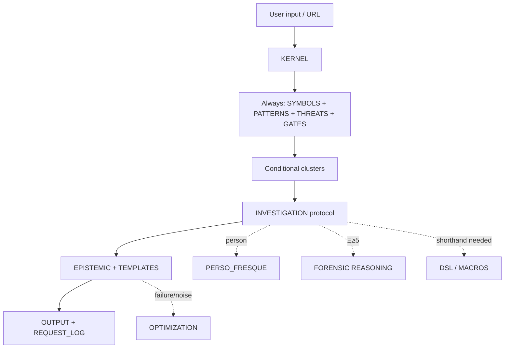
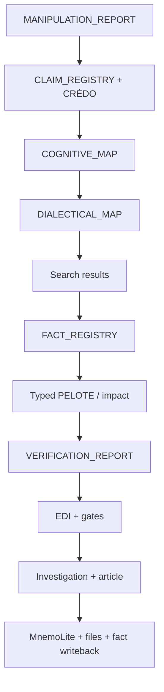

# TRUTH ENGINE v2.1 — Architecture runtime

**Date:** 2026-08-08
**Status:** lean refactor, compatible with v2.0 paths and operational aliases.

## 1. What Truth Engine is

Truth Engine is a prompt-native forensic investigation compiler. Markdown files form an executable cognitive system: KERNEL routes work, an ontology detects review axes, conditional clusters deepen only relevant axes, search modules construct an evidence corpus, and forensic gates prevent unsupported claims from being serialized as facts.

It is not a truth oracle, a publisher-reliability table, a generic fact checker, a RAG database or an automatic accusation generator. It produces a traceable investigation whose conclusions remain bounded by available evidence.

Core contract:

```text
input → claims/questions → evidence objects → fact statuses → typed explanation
      → contradictions/limits → investigation/article → memory/file persistence
```

## 2. Runtime inventory — 32 files

| Layer | Files | Runtime role |
|---|---:|---|
| Orchestrator | `KERNEL.md` | tools, paths, load order, phases, invariants, persistence |
| Ontology | `definitions/*.md` (3) | symbols/statuses/routing; patterns/formulas; threats/counter-checks |
| Protocol | `protocol/*.md` (2) | investigation operations; person branch |
| Conditional clusters | `clusters/*.md` (17) | 15 functional review fragments + index + authoring template |
| Search | `search/*.md` (3) | source roles/EDI; query templates; failure recovery |
| Forensic | `forensic/*.md` (3) | gates; hidden-reality method; request log |
| Output | `output/TEMPLATE.md` | section sets and filenames |
| Shorthand | `tools/*.md` (2) | DSL and macro aliases only |

`ARCHITECTURE.md` sits outside the runtime directory so normal loading never spends investigation context on design documentation.

## 3. Single-authority matrix

| Concern | Canonical authority | Other files may do |
|---|---|---|
| Paths, tool aliases, execution order, load/save | `KERNEL.md` | reference only |
| Symbols, fact statuses, cluster thresholds/mapping | `definitions/SYMBOLS.md` | use symbols; no redefinition |
| Pattern signatures/formulas | `definitions/PATTERNS.md` | invoke `@PAT[]` |
| Threat signatures/counter-checks | `definitions/THREATS.md` | invoke `@THR[]` |
| Cognitive/dialectical/factual/causal operations | `protocol/INVESTIGATION.md` | route/handoff |
| Person-specific longitudinal review | `protocol/PERSO_FRESQUE.md` | trigger only |
| Cluster-specific concepts/questions | individual `clusters/*.md` | no global thresholds/gates |
| Source roles and EDI | `search/EPISTEMIC.md` | pass corpus data |
| Query generation | `search/TEMPLATES.md` | domain hints only |
| Failed/noisy-query recovery | `search/OPTIMIZATION.md` | load on failure only |
| Integrity blockers/corrections | `forensic/GATES.md` | invoke at steps 18/18b |
| Ξ reconstruction | `forensic/REASONING.md` | load only when triggered |
| Audit-log schema/lifecycle | `forensic/REQUEST_LOG.md` | append actual rows |
| Output sections/filenames | `output/TEMPLATE.md` | produce content |
| DSL/macros | `tools/*.md` | aliases; never redefine behavior |

Conflict rule: domain authority wins for its definition; KERNEL wins for execution and persistence.

## 4. Load topology



### Exact phase/file map

| Phase | Load/action |
|---|---|
| Boot | user loads `KERNEL.md` |
| §0 | always load SYMBOLS, PATTERNS, THREATS, GATES |
| §0 after complexity | load clusters exactly per SYMBOLS §4; deduplicate paths |
| Step 2 | query MnemoLite; memory remains leads, never evidence |
| Step 4 | person subject → `PERSO_FRESQUE.md`, APEX |
| Step 8b | `INVESTIGATION.md`; `REASONING.md` if Ξ≥5; shorthand optional |
| Step 9 | `EPISTEMIC.md` + `TEMPLATES.md`; `OPTIMIZATION.md` only on failure/noise |
| Step 14 | `output/TEMPLATE.md` + `forensic/REQUEST_LOG.md` |
| Steps 18/18b | execute canonical GATES |
| Steps 19/19a | memory, investigation file, optional article, confirmed-fact writeback |

## 5. Pipeline and data flow



Canonical step identifiers remain:

```text
0,1,2,3,4,5,6,7,8,8b,8t,9,10,11,12,13,14,15,16,17,18,18b,19,19a
```

## 6. Evidence model

- Source role is claim-relative: direct object `◈`, analysis `◉`, discovery/context `○`.
- Fact status is canonical in SYMBOLS; new output normalizes legacy `⁇` to `⁅`.
- Memory is a search lead. A remembered item must be reopened/revalidated before `✦` or writeback.
- Search snippets, domain roots, prestige and narrative consistency cannot establish `✦`.
- Syndication and circular citation count as one upstream evidence family.
- EDI measures corpus diversity and coverage, not truth.

Hard invariants:

```text
MEMORY ≠ EVIDENCE
CORRELATION | CHRONOLOGY | PRECEDENT ≠ CAUSATION
BENEFIT ≠ INTENT
ROLE ≠ RESPONSIBILITY
ASSOCIATION ≠ COORDINATION
EVIDENCE STOPS → INFERENCE STOPS → GAP
```

## 7. Conditional-cluster contract

SYMBOLS owns every threshold and mapping. A cluster contains only:

1. its unique concepts;
2. evidence-object query stems;
3. measurements/falsifiers;
4. competing explanations;
5. its bounded output fields.

A cluster score routes review and may be revised by evidence. It cannot bootstrap its trigger or prove the hypothesis named by the cluster. Multiple symbols routing to one file load it once.

## 8. Causality and responsibility

PELOTE is research-first. Every edge is typed `CAUSE`, `ENABLER`, `PRECEDENT`, `CONTEXT` or `UNKNOWN`; only the first two can explain an outcome. Depth and mechanism counts are targets only. A short verified chain is preferable to an invented long chain, and descriptive facts survive an unresolved causal gap.

`WOLVES` is a responsibility map, not an accusation quota. A person appears only with a sourced relevant action and bounded responsibility. Intent is explicitly `PROVEN`, `CLAIMED` or `UNKNOWN`; zero named individuals is valid.

## 9. Persistence and serialization boundary

Default paths and exact tool aliases remain unchanged:

```text
BASE=/home/giak/projects/truth-engine/truth-engine-v2
INV=/home/giak/projects/truth-engine/investigations
@READ @WEB @FETCH @EXA @MNEMO_Q @MNEMO_S @MNEMO_U @WRITE
```

Additive write aliases handle deterministic split/article files: `@WRITE_P1`, `@WRITE_P2`, `@WRITE_ART`.

| Order | Persisted REQUEST_LOG state |
|---:|---|
| Build complete pre-save investigation | Mnemo/write/article/writeback = `PENDING_AT_SERIALIZATION` |
| `@MNEMO_S` | call uses the full pre-save text |
| Build file-bound copy | Mnemo row gets actual result; later writes remain pending |
| Investigation write | one `@WRITE`, or exclusive `@WRITE_P1+@WRITE_P2` above 50000 chars |
| Article/writeback | actual outcomes stay in runtime/final delivery; no impossible self-report |

Only currently revalidated `✦` facts are written back. `$FACT_TAGS` is the normalized `$TAGS` set plus `source:{sha1(url)[0:10]}`. Duplicate warning updates the existing memory with `@MNEMO_U`; non-confirmed facts are never stored as verified.

## 10. Compatibility and intentional corrections

Preserved:

- all 32 runtime paths;
- KERNEL phase IDs and data-product names;
- exact base directories and original tool aliases;
- Mnemo hybrid query at step 2, save at 19, writeback at 19a;
- FACT_REGISTRY table shape, CRÉDO, PELOTE, EDI, WOLVES, REQUEST_LOG;
- SIMPLE/MEDIUM/COMPLEX/APEX and 5/7/8/15 output section contracts.

Corrected without changing the external workflow:

- universal publisher/category ranking replaced by claim-level evidence assessment;
- EDI and cluster scores explicitly demoted from truth/verdict signals to diagnostics;
- duplicated cluster mapping and EDI formula removed;
- contradictory score clamps removed;
- MEDIUM output fixed to exactly seven sections;
- forced positive facts, causal depth, mechanisms, deaths and wolf counts removed;
- causal links typed; uncertainty may terminate a chain;
- responsibility, benefit and intent separated;
- static media “reliability” grades removed from runtime routing;
- impossible persisted self-confirmation of file writes replaced by serialization-pending state;
- historical psychology summaries bounded to what the studies can support.

These corrections may produce fewer accusations, shorter causal trees and more explicit `UNKNOWN` results. That is reduced false certainty, not a functional regression in investigation capability.

_Architecture authority: relationships and ownership only; runtime behavior remains canonical in the 32 runtime files._
